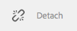

# Creazione e sincronizzazione di Live Copy{#creating-and-synchronizing-live-copies}

Puoi creare una Live Copy da una configurazione di pagina o blueprint, quindi gestire l’ereditarietà e la sincronizzazione.

## Gestione delle configurazioni di blueprint {#managing-blueprint-configurations}

Una configurazione blueprint identifica un sito Web esistente che si desidera utilizzare come origine per una o più pagine Live Copy.

>[!NOTE]
>
>Le configurazioni Blueprint consentono di inviare le modifiche ai contenuti a copie live. Vedere [Live Copy - Source, Blueprint and Blueprint Configurations](/help/sites-administering/msm.md#source-blueprints-and-blueprint-configurations).

Quando create una configurazione di blueprint, selezionate un modello che definisce la struttura interna del modello. Il modello predefinito presuppone che il sito Web di origine abbia le seguenti caratteristiche:

* Il sito Web ha una pagina principale.
* Le pagine figlie immediate della radice sono i rami della lingua del sito Web. Quando create una Live Copy, le lingue vengono presentate come contenuto facoltativo da includere nella copia.
* La radice di ciascun ramo lingua ha una o più pagine figlie. Quando create una Live Copy, le pagine figlie vengono presentate come capitoli che potete includere nella Live Copy.

>[!NOTE]
>
>Una struttura diversa richiede un altro modello di blueprint.

Dopo aver creato la configurazione della blueprint, configurate le seguenti proprietà:

* **Nome**: Nome della configurazione della blueprint.
* **Percorso** origine: Percorso della pagina principale del sito che si sta utilizzando come origine (blueprint).
* **Descrizione**. (Facoltativo)Una descrizione della configurazione della blueprint. La descrizione viene visualizzata nell’elenco delle configurazioni di blueprint tra cui scegliere al momento della creazione di un sito.

Quando si utilizza la configurazione della blueprint, è possibile associarla a una configurazione di rollout che determina in che modo vengono sincronizzate le copie live della sorgente o del blueprint. Vedere [Specifica delle configurazioni di rollout da utilizzare](/help/sites-administering/msm-sync.md#specifying-the-rollout-configurations-to-use).

### Creazione di una configurazione Blueprint {#creating-a-blueprint-configuration}

Per creare una configurazione di blueprint:

1. [Dal ](/help/sites-authoring/basic-handling.md#global-navigation) menu  **** Strumenti, selezionare il  **** menu Siti.
1. Selezionare **Blueprint** per aprire la console **Configurazioni Blueprint**:

   

1. Seleziona **Crea**.
1. Selezionare il modello di blueprint, quindi **Next** per continuare.
1. Selezionate la pagina di origine da usare come modello; quindi **Next** per continuare.
1. Definisci:

   * **Titolo**: titolo obbligatorio per il modello
   * **Descrizione**: una descrizione facoltativa per fornire ulteriori dettagli.

1. **Creative** creerà la configurazione della blueprint in base alle specifiche.

### Modifica o eliminazione di una configurazione Blueprint {#editing-or-deleting-a-blueprint-configuration}

È possibile modificare o eliminare una configurazione blueprint esistente:

1. [Dal ](/help/sites-authoring/basic-handling.md#global-navigation) menu  **** Strumenti, selezionare il  **** menu Siti.
1. Selezionare **Blueprint** per aprire la console **Configurazioni Blueprint**:

   

1. Selezionate la configurazione della blueprint richiesta; le azioni appropriate saranno disponibili nella barra degli strumenti:

   * **Proprietà**; è possibile utilizzare questa opzione per visualizzare e quindi modificare le proprietà della configurazione.
   * **Elimina**

   

## Creazione della Live Copy {#creating-a-live-copy}

### Creazione di una Live Copy di una pagina {#creating-a-live-copy-of-a-page}

Potete creare una copia dal vivo di qualsiasi pagina o ramo. Quando create la Live Copy, potete specificare le configurazioni di rollout da usare per la sincronizzazione del contenuto:

* Le configurazioni di rollout selezionate si applicano alla pagina Live Copy e alle relative pagine figlie.
* Se non si specificano configurazioni di rollout, MSM determina quali configurazioni di rollout utilizzare. Vedere [Specifica della configurazione del rollout da utilizzare](/help/sites-administering/msm-sync.md#specifying-the-rollout-configurations-to-use).

Potete creare una copia dal vivo di qualsiasi pagina:

* Pagine cui viene fatto riferimento da una [configurazione blueprint](#creating-a-blueprint-configuration).
* E pagine senza connessione a una configurazione.
* AEM anche la creazione di una Live Copy all&#39;interno delle pagine di un&#39;altra Live Copy.

L&#39;unica differenza è che la disponibilità del comando **Rollout** nelle pagine di origine/blueprint dipende dal fatto che all&#39;origine venga fatto riferimento da una configurazione blueprint:

* Se create la Live Copy da una pagina di origine a cui **è** fa riferimento in una configurazione di blueprint, il comando Rollout sarà disponibile nelle pagine di origine/blueprint.
* Se create la copia dal vivo da una pagina di origine a cui **non viene fatto riferimento in una configurazione blueprint, il comando Rollout non sarà disponibile nelle pagine di origine/blueprint.**

Per creare una Live Copy:

1. Nella console **Siti** selezionare **Crea**, quindi **Live Copy**.

   

1. Selezionate la pagina di origine, quindi fate clic o toccate **Avanti**. Esempio:

   

1. Specificate il percorso di destinazione della Live Copy (aprite la cartella o la pagina padre della Live Copy), quindi toccate o fate clic su **Next**.

   

   >[!NOTE]
   >
   >Il percorso di destinazione non può trovarsi all&#39;interno del percorso di origine.

1. Invio:

   * un **Titolo** per la pagina.
   * a **Name**, utilizzato nell&#39;URL.

   

1. Utilizzare la casella di controllo **Escludi sottopagine**:

   * Selezionato: crea solo una Live Copy della pagina selezionata (copia dal vivo superficiale)
   * Non selezionato: crea una Live Copy con tutti i discendenti della pagina selezionata (Live Copy)

1. (Facoltativo) Per specificare una o più configurazioni di rollout da utilizzare per la Live Copy, utilizzare l&#39;elenco a discesa **Rollout Configs** per selezionarle; le configurazioni selezionate verranno visualizzate sotto il selettore a discesa.
1. Tocca o fai clic su **Crea**. Verrà visualizzato un messaggio di conferma, da qui è possibile selezionare **Open** o **Done**.

### Creazione di una Live Copy di un sito da una configurazione Blueprint {#creating-a-live-copy-of-a-site-from-a-blueprint-configuration}

Create una Live Copy usando una configurazione di blueprint per creare un sito basato sul progetto (contenuto sorgente). Quando create una Live Copy da una configurazione di blueprint, selezionate uno o più rami della lingua dell&#39;origine blueprint da copiare, quindi selezionate i capitoli da copiare dai rami della lingua. Vedere [Creazione di una configurazione Blueprint](/help/sites-administering/msm-livecopy.md#creating-a-blueprint-configuration).

Se si omettono alcuni rami o capitoli della lingua dalla Live Copy, è possibile aggiungerli successivamente; consultate [Creazione di una Live Copy all&#39;interno di una Live Copy (configurazione Blueprint)](#creating-a-live-copy-inside-a-live-copy-blueprint-configuration).

>[!CAUTION]
>
>Quando l&#39;origine della blueprint contiene collegamenti e riferimenti che si riferiscono a un paragrafo in un ramo diverso, le destinazioni non vengono aggiornate nelle pagine della Live Copy, ma restano indicate alla destinazione originale.

Quando create il sito, fornite i valori per le seguenti proprietà:

* **Lingue** iniziali: I rami della lingua dell&#39;origine della blueprint da includere nella Live Copy.
* **Capitoli** iniziali: Le pagine figlie dei rami del linguaggio blueprint da includere nella Live Copy.
* **Percorso** di destinazione: Posizione della pagina principale del sito di Live Copy.
* **Titolo**: Titolo della pagina principale del sito Live Copy.
* **Nome**: (Facoltativo) Il nome del nodo JCR che memorizza la pagina principale della Live Copy. Il valore predefinito si basa sul titolo.
* **Proprietario** sito: (Facoltativo)
* **Live Copy**: Selezionate questa opzione per stabilire una relazione dal vivo con il sito di origine. Se non selezionate questa opzione, viene creata una copia del blueprint, ma non viene successivamente sincronizzata con l&#39;origine.
* **Configurazioni** rollout: (Facoltativo) Selezionate una o più configurazioni di rollout da usare per la sincronizzazione della live copy. Per impostazione predefinita, le configurazioni di rollout sono ereditate dal blueprint; per ulteriori informazioni, vedere [Specifica delle configurazioni di rollout da utilizzare](/help/sites-administering/msm-sync.md#specifying-the-rollout-configurations-to-use).

Per creare una copia dal vivo di un sito da una configurazione blueprint:

1. Nella console **Siti**, selezionare **Crea**, quindi **Sito** dal selettore a discesa.
1. Selezionate la configurazione della blueprint da usare come origine della live copy e procedete con **Next**:

   

1. Utilizzate il selettore **Lingue iniziali** per specificare la lingua o le lingue del sito blueprint da utilizzare per la Live Copy.

   Per impostazione predefinita vengono selezionate tutte le lingue disponibili. Per rimuovere una lingua, fare clic o toccare la **X** visualizzata accanto alla lingua.

   Esempio:

   

1. Utilizzate il menu a discesa **Capitoli iniziali** per selezionare le sezioni del blueprint da includere nella Live Copy. Anche in questo caso tutti i capitoli disponibili sono inclusi per impostazione predefinita, ma possono essere rimossi.
1. Specificare i valori per le proprietà rimanenti, quindi selezionare **Crea**. Nella finestra di dialogo di conferma, selezionare **Fine** per tornare alla console **Siti** oppure **Apri sito** per aprire la pagina principale del sito.

### Creazione di una Live Copy all&#39;interno di una Live Copy (configurazione Blueprint) {#creating-a-live-copy-inside-a-live-copy-blueprint-configuration}

Quando create una Live Copy all&#39;interno della Live Copy esistente (creata con una configurazione di blueprint), potete inserire qualsiasi copia della lingua o dei capitoli che non erano inclusi al momento della creazione della Live Copy.

## Monitoraggio della Live Copy {#monitoring-your-live-copy}

### Visualizzazione dello stato di una Live Copy {#seeing-the-status-of-a-live-copy}

Le proprietà di una pagina Live Copy mostrano le seguenti informazioni sulla Live Copy:

* **Origine**: La pagina di origine della pagina Live Copy.
* **Stato**: Lo stato di sincronizzazione della Live Copy. Lo stato include se la Live Copy è aggiornata con l&#39;origine, quando si è verificata l&#39;ultima sincronizzazione e chi ha eseguito la sincronizzazione.
* **Configurazione**:

   * Indica se la pagina è ancora soggetta all’ereditarietà Live Copy.
   * Indica se la configurazione è ereditata dalla pagina padre.
   * Qualsiasi configurazione di rollout utilizzata dalla Live Copy.

Per visualizzare le proprietà:

1. Nella console **Siti**, selezionate la pagina della Live Copy e aprite le proprietà.
1. Selezionare la scheda **Live Copy**.

   Esempio:

   

   >[!NOTE]
   >
   >Per ulteriori dettagli, vedere anche l&#39;articolo della Knowledge Base [Livecopy status message - Up-to-date/Green/In Sync](https://helpx.adobe.com/experience-manager/kb/livecopy-status-message---up-to-date-green-in-sync.html).

### Visualizzazione delle Live Copy di una pagina Blueprint {#seeing-the-live-copies-of-a-blueprint-page}

Le pagine Blueprint (a cui viene fatto riferimento in una configurazione blueprint) forniscono un elenco delle pagine Live Copy che utilizzano la pagina corrente (blueprint) come origine. Utilizzate questo elenco per tenere traccia delle copie dal vivo. L&#39;elenco viene visualizzato nella scheda **Blueprint** delle proprietà della pagina [a3/>.](/help/sites-authoring/editing-page-properties.md)

## Sincronizzazione della Live Copy {#synchronizing-your-live-copy}

### Rollout di un blueprint {#rolling-out-a-blueprint}

Distribuite una pagina di blueprint per inviare le modifiche ai contenuti alle Live Copy. Un&#39;azione **Rollout** esegue le configurazioni di rollout che utilizzano il trigger [On Rollout](/help/sites-administering/msm-sync.md#rollout-triggers).

>[!NOTE]
>
>Possono verificarsi conflitti se vengono create nuove pagine con lo stesso nome di pagina sia nel ramo blueprint che in un ramo Live Copy dipendente.
>
>Tali conflitti [devono essere gestiti e risolti al momento del rollout](/help/sites-administering/msm-rollout-conflicts.md).

#### Rollout di una blueprint da Proprietà pagina {#rolling-out-a-blueprint-from-page-properties}

1. Nella console **Siti**, selezionate la pagina nella blueprint e aprite le proprietà.
1. Apri la scheda **Blueprint.**
1. Selezionare **Rollout**.

   

1. Specificate le pagine e le relative sottopagine, quindi confermate con il segno di spunta:

   

1. Specificate se il processo di rollout deve essere eseguito immediatamente (**Now**) o in un&#39;altra data/ora (**Più tardi**).

   

I rollout vengono elaborati come processi asincroni e possono essere controllati in [**Stato processi Async** dashboard](asynchronous-jobs.md#monitor-the-status-of-asynchronous-operations) in **Navigazione globale** -> **Strumenti** -> **Operazioni** -> **Processi**

>[!NOTE]
>
>L&#39;elaborazione asincrona del rollout richiede AEM 6.5.3.0 o superiore. Nelle versioni precedenti, le pagine venivano elaborate immediatamente e in modo sincrono.

#### Eseguire il rollout di una Blueprint dalla Barra di riferimento {#roll-out-a-blueprint-from-the-reference-rail}

1. Nella console **Siti**, selezionate la pagina nel blueprint e aprite il pannello **[Riferimenti](/help/sites-authoring/basic-handling.md#references)** (dalla barra degli strumenti).
1. Selezionare l&#39;opzione **Blueprint** dall&#39;elenco per mostrare i blueprint associati alla pagina.
1. Selezionare la blueprint desiderata dall&#39;elenco.
1. Tocca o fai clic su **Rollout**.
1. Vi verrà chiesto di confermare i dettagli del rollout:

   * **Ambito rollout**:

      Specificate se l&#39;ambito è solo per la pagina selezionata, oppure se deve includere pagine secondarie.

   * **Pianificazione**:

      Specificate se il processo di rollout deve essere eseguito immediatamente (**Now**) o in una data/ora successiva (**Più tardi**).

      

1. Dopo aver confermato questi dettagli, selezionare **Rollout** per eseguire l&#39;azione.

I rollout vengono elaborati come processi asincroni e possono essere controllati in [**Stato processi Async** dashboard](asynchronous-jobs.md#monitor-the-status-of-asynchronous-operations) in **Navigazione globale** -> **Strumenti** -> **Operazioni** -> **Processi**

>[!NOTE]
>
>L&#39;elaborazione asincrona del rollout richiede AEM 6.5.3.0 o superiore. Nelle versioni precedenti, le pagine venivano elaborate immediatamente e in modo sincrono a meno che l&#39;opzione **Rollout in background** fosse selezionata.

#### Rollout di una blueprint dalla panoramica Live Copy {#roll-out-a-blueprint-from-the-live-copy-overview}

L&#39;azione [Rollout è disponibile anche da Live Copy Overview](/help/sites-administering/msm-livecopy-overview.md#using-the-live-copy-overview), quando è selezionata una pagina Blueprint.

1. Aprite la [Live Copy Overview](/help/sites-administering/msm-livecopy-overview.md#using-the-live-copy-overview) e selezionate una pagina Blueprint.
1. Selezionare **Rollout** dalla barra degli strumenti.
1. Specificate le pagine e le relative sottopagine, quindi confermate con il segno di spunta:

   

1. Specificate se il processo di rollout deve essere eseguito immediatamente (**Now**) o in un&#39;altra data/ora (**Più tardi**).

   

I rollout vengono elaborati come processi asincroni e possono essere controllati in [**Stato processi Async** dashboard](asynchronous-jobs.md#monitor-the-status-of-asynchronous-operations) in **Navigazione globale** -> **Strumenti** -> **Operazioni** -> **Processi**

>[!NOTE]
>
>L&#39;elaborazione asincrona del rollout richiede AEM 6.5.3.0 o superiore. Nelle versioni precedenti, le pagine venivano elaborate immediatamente e in modo sincrono.

### Sincronizzazione di una Live Copy {#synchronizing-a-live-copy}

Sincronizzate una pagina di Live Copy per effettuare il pulling delle modifiche dei contenuti dall’origine alla live copy.

#### Sincronizzazione di una Live Copy dalle proprietà pagina {#synchronize-a-live-copy-from-page-properties}

Sincronizzate una Live Copy per effettuare il pulling delle modifiche dall’origine alla Live Copy.

>[!NOTE]
>
>La sincronizzazione esegue le configurazioni di rollout che utilizzano il trigger [On Rollout](/help/sites-administering/msm-sync.md#rollout-triggers).

1. Nella console **Siti**, selezionate la pagina della Live Copy e aprite le proprietà.
1. Apri la scheda **Live Copy.**
1. Tocca o fai clic su **Sincronizza**.

   

   Verrà richiesta la conferma. Per continuare, utilizzare **Sync**.

#### Sincronizzare una Live Copy dalla panoramica Live Copy {#synchronize-a-live-copy-from-the-live-copy-overview}

L&#39;azione [Sincronizza è disponibile anche in Live Copy Overview](/help/sites-administering/msm-livecopy-overview.md#using-the-live-copy-overview), quando si seleziona una pagina Live Copy.

1. Aprite la [Live Copy Overview](/help/sites-administering/msm-livecopy-overview.md#using-the-live-copy-overview) e selezionate una pagina Live Copy.
1. Selezionare **Sincronizza** dalla barra degli strumenti.
1. Confermate l&#39;azione **Rollout** nella finestra di dialogo dopo aver specificato se includere o meno:

   * **Pagina e sottopagine**
   * **Solo pagina**

   

## Modifica del contenuto Live Copy {#changing-live-copy-content}

Per modificare il contenuto della Live Copy, potete:

* Aggiungere paragrafi alla pagina.
* Aggiornate il contenuto esistente interrompendo l&#39;ereditarietà Live Copy per qualsiasi pagina o componente.

>[!NOTE]
>
>Se create manualmente una nuova pagina nella Live Copy, questa viene creata localmente nella Live Copy, il che significa che non dispone di una pagina sorgente corrispondente a cui collegarsi.
>
>La procedura ottimale per creare una pagina locale che fa parte della relazione consiste nel crearla nell’origine e nel eseguire un rollout (profondo). La pagina verrà creata localmente come Live Copy.

>[!NOTE]
>
>Possono verificarsi conflitti se vengono create nuove pagine con lo stesso nome di pagina sia nel ramo blueprint che in un ramo Live Copy dipendente.
>
>Tali conflitti [devono essere gestiti e risolti al momento del rollout](/help/sites-administering/msm-rollout-conflicts.md).

### Aggiunta di componenti a una pagina Live Copy {#adding-components-to-a-live-copy-page}

Aggiungere componenti a una pagina Live Copy in qualsiasi momento. Lo stato di ereditarietà della Live Copy e del sistema di paragrafi non consente di aggiungere componenti.

Quando la pagina Live Copy viene sincronizzata con la pagina di origine, i componenti aggiunti rimangono invariati. Vedere anche [Modifica dell&#39;ordine dei componenti in una pagina Live Copy](#changing-the-order-of-components-on-a-live-copy-page).

>[!NOTE]
>
>Le modifiche apportate localmente a un componente contrassegnato come contenitore non verranno sovrascritte dal contenuto della blueprint su un rollout. Per ulteriori informazioni, vedere [Best practice MSM](/help/sites-administering/msm-best-practices.md#components-and-container-synchronization).

### Sospensione dell&#39;ereditarietà per una pagina {#suspending-inheritance-for-a-page}

Quando create una Live Copy, la configurazione della Live Copy viene salvata nella pagina principale delle pagine copiate. Tutte le pagine figlie della pagina principale ereditano le configurazioni Live Copy. Anche i componenti delle pagine Live Copy ereditano la configurazione Live Copy.

Potete sospendere l’ereditarietà Live Copy per una pagina Live Copy in modo da poter modificare le proprietà e i componenti della pagina. Quando si sospende l&#39;ereditarietà, le proprietà della pagina e i componenti non vengono più sincronizzati con l&#39;origine.

>[!NOTE]
>
>È inoltre possibile [scollegare una Live Copy](#detaching-a-live-copy) dal relativo blueprint per rimuovere tutte le connessioni. L&#39;azione Scollega è permanente e non reversibile.

#### Sospensione dell&#39;ereditarietà dalle proprietà pagina {#suspending-inheritance-from-page-properties}

Per sospendere l’ereditarietà su una pagina:

1. Aprite le proprietà della pagina Live Copy utilizzando il comando **Visualizza proprietà** della console **Siti** oppure utilizzando **Informazioni pagina** nella barra degli strumenti della pagina.
1. Tocca o fai clic sulla scheda **Live Copy**.
1. Selezionare **Suspend** dalla barra degli strumenti. Potete quindi selezionare:

   * **Sospendi**: solo pagina corrente
   * **Sospendi con figli**: pagina corrente e tutte le pagine figlie

1. Selezionare **Suspend** nella finestra di dialogo di conferma.

#### Sospensione dell&#39;ereditarietà dalla panoramica Live Copy {#suspending-inheritance-from-the-live-copy-overview}

L&#39;azione [Sospendi è disponibile anche in Live Copy Overview](/help/sites-administering/msm-livecopy-overview.md#using-the-live-copy-overview), quando si seleziona una pagina Live Copy.

1. Aprite la [Live Copy Overview](/help/sites-administering/msm-livecopy-overview.md#using-the-live-copy-overview) e selezionate una pagina Live Copy.
1. Selezionare **Suspend** dalla barra degli strumenti.
1. Selezionate l’opzione appropriata tra:

   * **Sospendi**
   * **Sospendi con figli**

   

1. Confermare l&#39;azione **Sospendi** nella finestra di dialogo **Sospendi Live Copy**:

   

### Ripresa ereditarietà per una pagina {#resuming-inheritance-for-a-page}

La sospensione dell’ereditarietà Live Copy per una pagina è un’azione temporanea. Una volta sospesa l&#39;azione **Riprendi** diventa disponibile, consentendo di ripristinare la relazione live.

Quando riattivate l&#39;ereditarietà, la pagina non viene sincronizzata automaticamente con l&#39;origine. Potete richiedere una sincronizzazione, se necessario:

* Nella finestra di dialogo **Riprendi**/**Ripristina**; ad esempio:

   

* In una fase successiva, selezionando manualmente l’azione di sincronizzazione.

>[!CAUTION]
>
>Quando riattivate l&#39;ereditarietà, la pagina non viene sincronizzata automaticamente con l&#39;origine. Se necessario, potete richiedere manualmente una sincronizzazione; al momento della ripresa o successivamente.

#### Ripresa ereditarietà dalle proprietà pagina {#resuming-inheritance-from-page-properties}

Una volta che [sospesa](#suspending-inheritance-from-page-properties) l&#39;azione **Riprendi** diventa nella barra degli strumenti delle proprietà della pagina:

Se questa opzione è selezionata, viene visualizzata la finestra di dialogo. Potete selezionare una sincronizzazione, se necessario, quindi confermare l’azione.

#### Riprendere una pagina Live Copy dalla panoramica Live Copy {#resume-a-live-copy-page-from-the-live-copy-overview}

L&#39;azione [Riprendi è disponibile anche in Live Copy Overview](/help/sites-administering/msm-livecopy-overview.md#using-the-live-copy-overview), quando è selezionata una pagina Live Copy.

1. Aprite la [Live Copy Overview](/help/sites-administering/msm-livecopy-overview.md#using-the-live-copy-overview) e selezionate una pagina Live Copy sospesa; verrà visualizzata come **EREDITARIETÀ ANNULLATA**.
1. Selezionare **Riprendi** dalla barra degli strumenti.
1. Indicate se desiderate sincronizzare la pagina dopo aver ripristinato l&#39;ereditarietà, quindi confermate l&#39;azione **Riprendi** nella finestra di dialogo **Riprendi Live Copy**.

### Modifica della profondità di ereditarietà (superficiale/profonda) {#changing-inheritance-depth-shallow-deep}

Su una Live Copy esistente è possibile modificare la profondità di una pagina; ad esempio se sono incluse pagine figlie.

* Per passare a una copia dal vivo superficiale:

   * Avrà effetto immediato ed è non reversibile.

      * Le pagine figlie vengono esplicitamente staccate dalla Live Copy. Ulteriori modifiche sugli elementi figlio non possono essere mantenute se annullate.

      * Rimuoverà eventuali discendenti `LiveRelationships` anche se sono nidificati `LiveCopies`.

* Passaggio a una Live Copy profonda:

   * Le pagine figlie non vengono toccate.
   * Per verificare l&#39;effetto dello switch, potete effettuare un rollout, tutte le modifiche di contenuto vengono applicate in base alla configurazione di rollout.

* Per passare a una Live Copy superficiale e poi tornare a profondità:

   * Tutti gli elementi secondari della (precedentemente) copia live poco profonda vengono trattati come se fossero stati creati manualmente e quindi spostati utilizzando `[oldname]_msm_moved name`.

Per specificare o modificare la profondità:

1. Aprite le proprietà della pagina Live Copy utilizzando il comando **Visualizza proprietà** della console **Siti** oppure utilizzando **Informazioni pagina** nella barra degli strumenti della pagina.
1. Tocca o fai clic sulla scheda **Live Copy**.
1. Nella sezione **Configurazione**, impostare o deselezionare l&#39;opzione **Ereditarietà Live Copy** a seconda che le pagine figlie siano incluse:

   * Selezionato - una Live Copy profonda (le pagine figlie sono incluse)
   * clear - una Live Copy superficiale (escluse le pagine figlie)

   >[!CAUTION]
   >
   >Il passaggio a una copia dal vivo superficiale avrà effetto immediato e non sarà reversibile.
   >
   >Per ulteriori informazioni, vedere [Live Copy - Composition](/help/sites-administering/msm.md#live-copies-composition).

1. Tocca o fai clic su **Salva** per mantenere gli aggiornamenti.

### Annullamento dell&#39;ereditarietà per un componente {#cancelling-inheritance-for-a-component}

Annulla l’ereditarietà Live Copy per un componente in modo che il componente non venga più sincronizzato con il componente di origine. Se necessario, potete abilitare l&#39;ereditarietà in un momento successivo.

>[!NOTE]
>
>Quando riattivate l’ereditarietà, il componente non viene sincronizzato automaticamente con l’origine. Se necessario, potete richiedere manualmente una sincronizzazione.

Annulla ereditarietà per modificare il contenuto del componente o eliminare il componente:

1. Tocca o fai clic sul componente per il quale vuoi annullare l’ereditarietà.

   

1. Sulla barra degli strumenti del componente, fare clic o toccare l&#39;icona **Annulla ereditarietà**.

   

1. Nella finestra di dialogo Annulla ereditarietà, confermare l&#39;azione con **Yes**.

   La barra degli strumenti del componente viene aggiornata per includere tutti i comandi di modifica (appropriati).

### Riattivazione dell&#39;ereditarietà per un componente {#re-enabling-inheritance-for-a-component}

Per abilitare l&#39;ereditarietà per un componente, fare clic o toccare l&#39;icona **Riattiva ereditarietà** sulla barra degli strumenti del componente.

### Modifica dell&#39;ordine dei componenti in una pagina Live Copy {#changing-the-order-of-components-on-a-live-copy-page}

Se una Live Copy contiene componenti che fanno parte di un sistema paragrafo, l’ereditarietà di tale sistema paragrafo è conforme alle regole seguenti:

* L’ordine dei componenti in un sistema paragrafo ereditato può essere modificato, anche con l’ereditarietà stabilita.
* Al momento del rollout, l’ordine dei componenti verrà ripristinato dal blueprint. se nuovi componenti sono stati aggiunti alla Live Copy prima del rollout, verranno riordinati insieme ai componenti sopra ai quali sono stati aggiunti.
* Se l’ereditarietà del sistema di paragrafi viene annullata, l’ordine dei componenti non verrà ripristinato al momento del rollout e rimarrà invariato nella live copy.

>[!NOTE]
>
>Quando si ripristina un&#39;ereditarietà annullata in un sistema paragrafo, l&#39;ordine dei componenti **non verrà ripristinato automaticamente** dal blueprint. Se necessario, potete richiedere manualmente una sincronizzazione.

Per annullare l’ereditarietà del sistema paragrafo, attenersi alla procedura descritta di seguito.

1. Aprite la pagina Live Copy.
1. Trascinare un componente esistente in una nuova posizione sulla pagina.
1. Nella finestra di dialogo **Annulla ereditarietà**, confermare l&#39;azione con **Yes**.

### Sostituzione delle proprietà di una pagina Live Copy {#overriding-properties-of-a-live-copy-page}

Per impostazione predefinita, le proprietà della pagina di una pagina Live Copy vengono ereditate (e non modificabili) dalla pagina di origine.

È possibile annullare l&#39;ereditarietà di una proprietà quando è necessario modificare il valore della proprietà per la Live Copy. Un&#39;icona di collegamento indica che l&#39;ereditarietà è abilitata per la proprietà.

Quando si annulla l&#39;ereditarietà, è possibile modificare il valore della proprietà. Un&#39;icona di collegamento interrotto indica che l&#39;ereditarietà è stata annullata.

In seguito è possibile riabilitare l&#39;ereditarietà per una proprietà, se necessario.

>[!NOTE]
>
>Quando riattivate l&#39;ereditarietà, la proprietà Live Copy page non viene sincronizzata automaticamente con la proprietà source. Se necessario, potete richiedere manualmente una sincronizzazione.

1. Aprite le proprietà della pagina Live Copy utilizzando l&#39;icona **Visualizza proprietà** della console **Siti** o **Informazioni pagina** nella barra degli strumenti della pagina.
1. Per annullare l’ereditarietà di una proprietà, fare clic o toccare l’icona di collegamento visualizzata a destra della proprietà.

   

1. Nella finestra di dialogo di conferma di **Annulla ereditarietà**, fare clic o toccare **Sì**.

### Ripristina proprietà di una pagina Live Copy {#revert-properties-of-a-live-copy-page}

Per abilitare l&#39;ereditarietà per una proprietà, fare clic o toccare l&#39;icona **Ripristina ereditarietà** visualizzata accanto alla proprietà.

### Reimpostazione di una pagina Live Copy {#resetting-a-live-copy-page}

Reimposta una pagina Live Copy su:

* Rimuovere tutte le cancellazioni di ereditarietà e
* Ripristinare lo stato della pagina di origine.

Il ripristino ha effetto sulle modifiche apportate alle proprietà della pagina, al sistema di paragrafi e ai componenti.

#### Reimpostare una pagina Live Copy da Proprietà pagina {#reset-a-live-copy-page-from-the-page-properties}

1. Nella console **Siti**, selezionate la pagina della copia dal vivo e selezionate **Visualizza proprietà**.
1. Apri la scheda **Live Copy.**
1. Selezionare **Reset** dalla barra degli strumenti.

   

1. Nella finestra di dialogo **Reimposta Live Copy**, confermare con **Reimposta**.

#### Reimpostare una pagina Live Copy dalla panoramica Live Copy {#reset-a-live-copy-page-from-the-live-copy-overview}

L&#39;azione [Reimposta è disponibile anche in Live Copy Overview](/help/sites-administering/msm-livecopy-overview.md#using-the-live-copy-overview), quando si seleziona una pagina Live Copy.

1. Aprite la [Live Copy Overview](/help/sites-administering/msm-livecopy-overview.md#using-the-live-copy-overview) e selezionate una pagina Live Copy.
1. Selezionare **Reset** dalla barra degli strumenti.
1. Confermare l&#39;azione **Reset** nella finestra di dialogo **Reset Live Copy**:

   

## Confronto di una pagina Live Copy con una pagina Blueprint {#comparing-a-live-copy-page-with-a-blueprint-page}

Per tenere traccia delle modifiche apportate, è possibile visualizzare la pagina di blueprint in **References** e confrontarla con la relativa pagina di Live Copy:

1. Nella console **Siti**, [ individuate una pagina di blueprint o Live Copy e selezionatela](/help/sites-authoring/basic-handling.md#viewing-and-selecting-resources).
1. Aprite il pannello **[Riferimenti](/help/sites-authoring/basic-handling.md#references)** e selezionate:

   * **Blueprint**  (quando è selezionata una pagina Live Copy)
   * **Live Copy**  (quando è selezionata una pagina di blueprint)

1. Selezionate la Live Copy specifica, quindi:

   * **Confronta con Blueprint**  (quando è selezionata una pagina Live Copy)
   * **Confronta con Live Copy**  (quando è selezionata una pagina di blueprint)

   Esempio:

   

1. Le due pagine (Live Copy e blueprint) verranno aperte una accanto all’altra.

   Per informazioni complete sull&#39;utilizzo di questa funzionalità, consulta [Differenze tra pagine](/help/sites-authoring/page-diff.md).

## Scollegamento di una Live Copy {#detaching-a-live-copy}

Lo scollegamento rimuove in modo permanente la relazione dal vivo tra una Live Copy e la relativa pagina sorgente/blueprint. Tutte le proprietà relative a MSM vengono rimosse dalla Live Copy e le pagine della live copy diventano una copia standalone.

>[!CAUTION]
>
>Non è possibile ripristinare la relazione dal vivo dopo aver scollegato la Live Copy.
>
>Per rimuovere la relazione dal vivo con l&#39;opzione di ripristinarla in un secondo momento, è possibile [annullare l&#39;ereditarietà Live Copy](#suspending-inheritance-for-a-page) per la pagina.

Ci sono implicazioni sulla posizione all&#39;interno della struttura ad albero in cui si utilizza **Scollega**:

* **Scollega a una pagina principale di una LiveCopy**

   Quando questa operazione viene eseguita sulla pagina principale di una Live Copy, rimuove la relazione live tra tutte le pagine del blueprint e la relativa Live Copy.

   Ulteriori modifiche apportate alle pagine del blueprint (così come era) **non influiranno sulla Live Copy (così come era).**

* **Scollega su una pagina secondaria di una LiveCopy**

   Quando l&#39;operazione viene eseguita su una pagina secondaria (o un ramo) all&#39;interno di una Live Copy:

   * la relazione live viene rimossa per la pagina (o il ramo) secondaria
   * e le pagine secondarie del ramo Live Copy sono trattate come se fossero state create manualmente.

   *Tuttavia*, le sottopagine sono ancora soggette alla relazione live del ramo padre, per cui un ulteriore rollout delle pagine blueprint sarà entrambi:

   1. Rinominare le pagine scollegate:

      * Questo perché MSM li considera come pagine create manualmente che causano un conflitto in quanto hanno lo stesso nome delle pagine Live Copy che si sta cercando di creare.
   1. Create una nuova pagina (Live Copy) con il nome originale, contenente le modifiche dal rollout.

   >[!NOTE]
   >
   >Per informazioni dettagliate su tali situazioni, vedere [Conflitti di rollout MSM](/help/sites-administering/msm-rollout-conflicts.md).

### Scollega una pagina Live Copy dalle proprietà pagina {#detach-a-live-copy-page-from-the-page-properties}

Per scollegare una Live Copy:

1. Nella console **Siti**, selezionate la pagina della copia dal vivo e toccate o fate clic su **Visualizza proprietà**.
1. Apri la scheda **Live Copy.**
1. Sulla barra degli strumenti, selezionare **Scollega**.

   

1. Verrà visualizzata una finestra di dialogo di conferma, selezionare **Scollega** per completare l&#39;azione.

### Scollegare una pagina Live Copy dalla panoramica Live Copy {#detach-a-live-copy-page-from-the-live-copy-overview}

L&#39;azione [Scollega è disponibile anche in Live Copy Overview](/help/sites-administering/msm-livecopy-overview.md#using-the-live-copy-overview), quando si seleziona una pagina Live Copy.

1. Aprite la [Live Copy Overview](/help/sites-administering/msm-livecopy-overview.md#using-the-live-copy-overview) e selezionate una pagina Live Copy.
1. Selezionare **Scollega** dalla barra degli strumenti.
1. Confermare l&#39;azione **Scollega** nella finestra di dialogo **Scollega Live Copy**:

   
