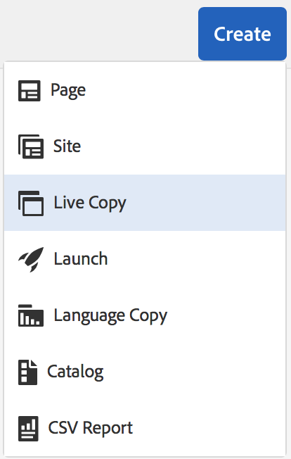

# Creazione e sincronizzazione di Live Copy{#creating-and-synchronizing-live-copies}

Puoi creare una Live Copy da una configurazione di pagina o blueprint, quindi gestire l’ereditarietà e la sincronizzazione.

## Gestione delle configurazioni blueprint {#managing-blueprint-configurations}

Una configurazione blueprint identifica un sito web esistente che desideri utilizzare come origine per una o più pagine Live Copy.

>[!NOTE]
>
>Le configurazioni blueprint consentono di inviare le modifiche al contenuto in Live Copy. Vedi [Live Copy: sorgente, blueprint e configurazioni blueprint](/help/sites-administering/msm.md#source-blueprints-and-blueprint-configurations).

Quando crei una configurazione blueprint, seleziona un modello che definisce la struttura interna della blueprint. Il modello di blueprint predefinito presuppone che il sito web di origine abbia le seguenti caratteristiche:

* Il sito web ha una pagina principale.
* Le pagine secondarie immediate della principale sono rami linguistici del sito web. Durante la creazione di una Live Copy, le lingue vengono presentate come contenuto facoltativo da includere nella copia.
* La pagina principale di ciascun ramo lingua ha una o più pagine secondarie. Durante la creazione di una Live Copy, le pagine figlie vengono presentate come capitoli che puoi includere nella Live Copy.

>[!NOTE]
>
>Una struttura diversa richiede un altro modello di blueprint.

Dopo aver creato la configurazione blueprint, configura le seguenti proprietà:

* **Nome**: nome della configurazione blueprint.
* **Percorso origine**: percorso della pagina principale del sito che si sta utilizzando come origine (blueprint).
* **Descrizione**. (Facoltativo)Una descrizione della configurazione blueprint. La descrizione viene visualizzata nell’elenco delle configurazioni blueprint tra cui scegliere durante la creazione di un sito.

Quando utilizzi la configurazione blueprint, puoi associarla a una configurazione di rollout che determina la modalità di sincronizzazione delle Live Copy dell’origine/blueprint. Vedi [Specifica delle configurazioni di rollout da utilizzare](/help/sites-administering/msm-sync.md#specifying-the-rollout-configurations-to-use).

### Creazione di una configurazione Blueprint {#creating-a-blueprint-configuration}

Per creare una configurazione blueprint:

1. [Passa](/help/sites-authoring/basic-handling.md#global-navigation) al menu **Strumenti** quindi seleziona il menu **Sites**.
1. Seleziona **Blueprint** per aprire la console **Configurazioni blueprint**:

   

1. Seleziona **Crea**.
1. Seleziona il modello di blueprint, quindi **Successivo** per continuare.
1. Seleziona la pagina sorgente da utilizzare come blueprint; poi **Successivo** per continuare.
1. Definisci:

   * **Titolo**: titolo obbligatorio per la blueprint.
   * **Descrizione**: una descrizione facoltativa per fornire ulteriori dettagli.

1. **Crea** creerà la configurazione blueprint in base alle tue specifiche.

### Modifica o eliminazione di una configurazione Blueprint {#editing-or-deleting-a-blueprint-configuration}

Puoi modificare o eliminare una configurazione blueprint esistente:

1. [Passa](/help/sites-authoring/basic-handling.md#global-navigation) al menu **Strumenti** quindi seleziona il menu **Sites**.
1. Seleziona **Blueprint** per aprire la console **Configurazioni blueprint**:

   

1. Seleziona la configurazione blueprint richiesta; le azioni appropriate saranno disponibili nella barra degli strumenti:

   * **Proprietà**; da qui puoi visualizzare e quindi modificare le proprietà della configurazione.
   * **Eliminare**

## Creazione della Live Copy {#creating-a-live-copy}

### Creazione di una Live Copy di una pagina {#creating-a-live-copy-of-a-page}

Puoi creare una Live Copy di qualsiasi pagina o ramo. Quando crei la Live Copy, puoi specificare le configurazioni di rollout da utilizzare per la sincronizzazione del contenuto:

* Le configurazioni di rollout selezionate si applicano alla pagina Live Copy e alle relative pagine figlie.
* Se non specifichi configurazioni di rollout, MSM determina quali configurazioni utilizzare. Vedi [Specifica della configurazione di rollout da utilizzare](/help/sites-administering/msm-sync.md#specifying-the-rollout-configurations-to-use).

Puoi creare una Live Copy di qualsiasi pagina:

* Pagine che fanno riferimento a una [configurazione blueprint](#creating-a-blueprint-configuration).
* E pagine prive di connessione a una configurazione.
* AEM supporta anche la creazione di una Live Copy all’interno delle pagine di un’altra Live Copy.

L&#39;unica differenza è che la disponibilità del **Rollout** nelle pagine sorgente/blueprint dipende dal fatto che un modello di configurazione faccia riferimento al sorgente o meno:

* Se crei la Live Copy da una pagina sorgente che **è** in una configurazione blueprint a cui si fa riferimento, il comando Rollout sarà disponibile nelle pagine sorgente/blueprint.
* Se crei la Live Copy da una pagina sorgente che **non è** in una configurazione blueprint a cui si fa riferimento, il comando Rollout non sarà disponibile nelle pagine sorgente/blueprint.

Per creare una Live Copy:

1. Nella console **Sites** seleziona **Crea**, quindi **Live Copy**.

   

1. Seleziona la pagina sorgente e tocca o fai clic su **Successivo**. Esempio:

   

1. Specifica il percorso di destinazione della Live Copy (apri la cartella/pagina genitore della Live Copy), quindi tocca o fai clic su **Successivo**.

   

   >[!NOTE]
   >
   >Il percorso di destinazione non può trovarsi all&#39;interno del percorso sorgente.

1. Inserisci:

   * un **Titolo** per la pagina.
   * un **Nome**, che viene utilizzato nell’URL.

   

1. Utilizza la casella di spunta **Escludi sottopagine**:

   * Selezionato: crea una Live Copy solo della pagina selezionata (Live Copy shallow)
   * Non selezionato: crea una Live Copy che includa tutti i discendenti della pagina selezionata (Live Copy deep)

1. (Facoltativo) Per specificare una o più configurazioni di rollout da utilizzare per la Live Copy, utilizza **Configurazioni rollout** per selezionarli; le configurazioni selezionate vengono visualizzate sotto il selettore a discesa.
1. Tocca o fai clic su **Crea**. Verrà visualizzato un messaggio di conferma. Da qui puoi selezionare una delle seguenti opzioni, **Apri** o **Fine**.

### Creazione di una Live Copy di un sito da una configurazione Blueprint {#creating-a-live-copy-of-a-site-from-a-blueprint-configuration}

Crea una Live Copy utilizzando una configurazione blueprint per creare un sito basato sul contenuto blueprint (sorgente). Quando crei una Live Copy da una configurazione blueprint, selezioni uno o più rami di lingua della sorgente blueprint da copiare, quindi selezioni i capitoli da copiare dai rami di lingua. Vedi [Creazione di una configurazione Blueprint](/help/sites-administering/msm-livecopy.md#creating-a-blueprint-configuration).

Se ometti alcuni rami o capitoli di lingua dalla Live Copy, puoi aggiungerli in un secondo momento; vedi [Creazione di una Live Copy all’interno di una Live Copy (configurazione Blueprint)](#creating-a-live-copy-inside-a-live-copy-blueprint-configuration).

>[!CAUTION]
>
>Quando il sorgente blueprint contiene collegamenti e riferimenti destinati a un paragrafo in un ramo diverso, le destinazioni non vengono aggiornate nelle pagine Live Copy, ma rimangono indirizzate alla destinazione originale.

Quando crei il sito, fornisci valori per le seguenti proprietà:

* **Lingue iniziali**: rami di lingua della sorgente blueprint da includere nella Live Copy.
* **Capitoli iniziali**: le pagine figlie dei rami di lingua blueprint da includere nella Live Copy.
* **Percorso di destinazione**: posizione della pagina root del sito Live Copy.
* **Titolo**: titolo della pagina root del sito Live Copy.
* **Nome**: (facoltativo) nome del nodo JCR che memorizza la pagina root della Live Copy. Il valore predefinito è basato sul titolo.
* **Proprietario sito**: (Facoltativo)
* **Live Copy**: seleziona questa opzione per stabilire una relazione live con il sito sorgente. Se non selezioni questa opzione, viene creata una copia della blueprint ma non viene successivamente sincronizzata con il sorgente.
* **Configurazioni rollout**: (Facoltativo) seleziona una o più configurazioni di rollout da utilizzare per la sincronizzazione della Live Copy. Per impostazione predefinita, le configurazioni di rollout vengono ereditate dalla blueprint; vedi [Specifica delle configurazioni di rollout da utilizzare](/help/sites-administering/msm-sync.md#specifying-the-rollout-configurations-to-use) per ulteriori dettagli.

Per creare una Live Copy di un sito da una configurazione blueprint:

1. Nella console **Sites**, seleziona **Crea**, quindi **Sito** dal menu a discesa.
1. Seleziona la configurazione blueprint da utilizzare come origine della Live Copy e procedi con **Successivo**:

   

1. Utilizza il **Lingue iniziali** per specificare le lingue del sito blueprint da utilizzare per la live copy.

   Tutte le lingue disponibili sono selezionate per impostazione predefinita. Per rimuovere una lingua, tocca o fai clic sul pulsante **X** accanto alla lingua.

   Esempio:

   

1. Utilizza il **Capitoli iniziali** per selezionare le sezioni della blueprint da includere nella live copy. Anche in questo caso, tutti i capitoli disponibili sono inclusi per impostazione predefinita, ma possono essere rimossi.
1. Immetti i valori per le proprietà rimanenti, quindi seleziona **Crea**. Nella finestra di dialogo di conferma, seleziona **Fine** per tornare alla console **Sites**, oppure **Apri sito** per aprire la pagina root del sito.

### Creazione di una Live Copy all’interno di una Live Copy (configurazione Blueprint) {#creating-a-live-copy-inside-a-live-copy-blueprint-configuration}

Quando crei una Live Copy all’interno della Live Copy esistente (creata utilizzando una configurazione blueprint), puoi inserire qualsiasi copia o capitolo in lingua non inclusi al momento della creazione della Live Copy.

## Monitoraggio della Live Copy {#monitoring-your-live-copy}

### Visualizzazione dello stato di una Live Copy {#seeing-the-status-of-a-live-copy}

Le proprietà di una pagina Live Copy mostrano le seguenti informazioni sulla Live Copy:

* **Sorgente**: pagina sorgente della pagina Live Copy.
* **Stato**: stato di sincronizzazione della Live Copy. Lo stato include se la Live Copy è aggiornata rispetto all’origine, quando si è verificata l’ultima sincronizzazione e chi l’ha eseguita.
* **Configurazione**:

   * Se la pagina è ancora soggetta all&#39;ereditarietà della Live Copy.
   * Se la configurazione viene ereditata dalla pagina genitore.
   * Tutte le configurazioni di rollout utilizzate dalla Live Copy.

Per visualizzare le proprietà:

1. In **Sites** , seleziona la pagina live copy e apri le proprietà.
1. Apri la scheda **Live Copy**.

   Esempio:

   

   >[!NOTE]
   >
   >Per ulteriori dettagli vedi anche l’articolo della Knowledge Base [Messaggio di stato LiveCopy - Sincronizzazione verde/aggiornato](https://helpx.adobe.com/experience-manager/kb/livecopy-status-message---up-to-date-green-in-sync.html).

### Visualizzazione delle Live Copy di una pagina blueprint {#seeing-the-live-copies-of-a-blueprint-page}

Le pagine blueprint (a cui si fa riferimento in una configurazione blueprint) ti forniscono un elenco delle pagine Live Copy che utilizzano la pagina corrente (blueprint) come sorgente. Utilizza questo elenco per tenere traccia delle Live Copy. L&#39;elenco viene visualizzato sulla scheda **Blueprint** nelle [proprietà della pagina](/help/sites-authoring/editing-page-properties.md).

## Sincronizzazione della Live Copy {#synchronizing-your-live-copy}

### Rollout di una blueprint {#rolling-out-a-blueprint}

Effettua il rollout di una pagina blueprint per inviare le modifiche al contenuto in Live Copy. Un **Rollout** esegue le configurazioni di rollout che utilizzano il trigger [durante il rollout](/help/sites-administering/msm-sync.md#rollout-triggers).

>[!NOTE]
>
>Possono verificarsi conflitti se nuove pagine con lo stesso nome vengono create sia nel ramo blueprint che in un ramo Live Copy dipendente.
>
>Tali [conflitti devono essere gestiti e risolti al momento del rollout](/help/sites-administering/msm-rollout-conflicts.md).
>

#### Rollout di una blueprint dalle proprietà della pagina {#rolling-out-a-blueprint-from-page-properties}

1. Nella console **Sites**, seleziona la pagina nella blueprint e apri le proprietà.
1. Apri la scheda **Blueprint.**
1. Seleziona **Rollout**.

   

1. Specifica le pagine e le eventuali sottopagine, quindi conferma con il segno di spunta:

   

1. Specifica se il processo di rollout deve essere eseguito immediatamente (**Ora**) o in un’altra data/ora (**Più tardi**).

   

I rollout vengono elaborati come processi asincroni e possono essere archiviati nel [**Stato processi asincroni** dashboard](asynchronous-jobs.md#monitor-the-status-of-asynchronous-operations) a **Navigazione globale** -> **Strumenti** -> **Operazioni** -> **Processi**

>[!NOTE]
>
>L’elaborazione del rollout asincrono richiede AEM 6.5.3.0 o versione successiva. Nelle versioni precedenti, le pagine venivano elaborate immediatamente e in modo sincrono.

#### Effettuare il roll out di una blueprint dalla barra dei riferimenti {#roll-out-a-blueprint-from-the-reference-rail}

1. Nella console **Sites** seleziona la pagina nella Live Copy e apri il pannello **[Riferimenti](/help/sites-authoring/basic-handling.md#references)** (dalla barra degli strumenti).
1. Seleziona l&#39;opzione **Blueprint** dall’elenco, per visualizzare le blueprint associate a questa pagina.
1. Seleziona la blueprint desiderata dall’elenco.
1. Tocca o fai clic su **Rollout**.
1. Ti verrà chiesto di confermare i dettagli del rollout:

   * **Ambito rollout**:

     Specifica se l’ambito è solo per la pagina selezionata o deve includere pagine secondarie.

   * **Pianificazione**:

     Specifica se il processo di rollout deve essere eseguito immediatamente (**Ora**) o in una data/ora successiva (**Più tardi**).

     

1. Dopo aver confermato questi dettagli, seleziona **Rollout** per eseguire l’azione.

I rollout vengono elaborati come processi asincroni e possono essere archiviati nel [**Stato processi asincroni** dashboard](asynchronous-jobs.md#monitor-the-status-of-asynchronous-operations) a **Navigazione globale** -> **Strumenti** -> **Operazioni** -> **Processi**

>[!NOTE]
>
>L’elaborazione del rollout asincrono richiede AEM 6.5.3.0 o versione successiva. Nelle versioni precedenti, le pagine venivano elaborate immediatamente e in modo sincrono, a meno che il **Rollout sfondo** è stata selezionata.

#### Eseguire il rollout di una blueprint dalla panoramica della Live Copy {#roll-out-a-blueprint-from-the-live-copy-overview}

Quando viene selezionata una pagina Blueprint, l’azione [Rollout è disponibile anche nella panoramica della Live Copy](/help/sites-administering/msm-livecopy-overview.md#using-the-live-copy-overview).

1. Apri [Panoramica della Live Copy](/help/sites-administering/msm-livecopy-overview.md#using-the-live-copy-overview) e seleziona una pagina blueprint.
1. Seleziona **Rollout** nella barra degli strumenti.
1. Specifica le pagine e le eventuali sottopagine, quindi conferma con il segno di spunta:

   

1. Specifica se il processo di rollout deve essere eseguito immediatamente (**Ora**) o in un’altra data/ora (**Più tardi**).

   

I rollout vengono elaborati come processi asincroni e possono essere archiviati nel [**Stato processi asincroni** dashboard](asynchronous-jobs.md#monitor-the-status-of-asynchronous-operations) a **Navigazione globale** -> **Strumenti** -> **Operazioni** -> **Processi**

>[!NOTE]
>
>L’elaborazione del rollout asincrono richiede AEM 6.5.3.0 o versione successiva. Nelle versioni precedenti, le pagine venivano elaborate immediatamente e in modo sincrono.

### Sincronizzazione di una Live Copy {#synchronizing-a-live-copy}

Sincronizza una pagina Live Copy per richiamare le modifiche al contenuto dall’origine alla Live Copy.

#### Sincronizzazione di una Live Copy dalle proprietà della pagina {#synchronize-a-live-copy-from-page-properties}

Sincronizza una Live Copy per richiamare le modifiche dall’origine alla Live Copy.

>[!NOTE]
>
>La sincronizzazione esegue le configurazioni di rollout che utilizzano l’attivatore [Al momento del rollout](/help/sites-administering/msm-sync.md#rollout-triggers).

1. In **Sites** , seleziona la pagina live copy e apri le proprietà.
1. Apri la scheda **Live Copy.**
1. Tocca o fai clic su **Sincronizza**.

   

   Verrà richiesta la conferma, per procedere fai clic su **Sincronizza**.

#### Sincronizzazione di una Live Copy dalla panoramica della Live Copy {#synchronize-a-live-copy-from-the-live-copy-overview}

Quando viene selezionata una pagina Live Copy, l’azione [Sincronizza è disponibile anche nella panoramica della Live Copy](/help/sites-administering/msm-livecopy-overview.md#using-the-live-copy-overview).

1. Apri [Panoramica della Live Copy](/help/sites-administering/msm-livecopy-overview.md#using-the-live-copy-overview) e seleziona una pagina Live Copy.
1. Seleziona **Sincronizza** nella barra degli strumenti.
1. Conferma l’azione **Rollout** nella finestra di dialogo dopo aver specificato se includere:

   * **Pagina e sottopagine**
   * **Solo pagina**

   

## Modifica del contenuto della Live Copy {#changing-live-copy-content}

Per modificare il contenuto della Live Copy, puoi:

* Aggiungere paragrafi alla pagina.
* Aggiorna il contenuto esistente interrompendo l’ereditarietà della Live Copy per qualsiasi pagina o componente.

>[!NOTE]
>
>Se crei manualmente una pagina nella Live Copy, questa sarà locale rispetto alla Live Copy, il che significa che non dispone di una pagina sorgente corrispondente da allegare.
>
>La best practice per creare una pagina locale che fa parte della relazione consiste nel crearla nell’origine e eseguire un rollout (profondo). In questo modo la pagina verrà creata localmente come Live Copy.

>[!NOTE]
>
>Possono verificarsi conflitti se nuove pagine con lo stesso nome vengono create sia nel ramo blueprint che in un ramo Live Copy dipendente.
>
>Tali [conflitti devono essere gestiti e risolti al momento del rollout](/help/sites-administering/msm-rollout-conflicts.md).
>

### Aggiunta di componenti a una pagina Live Copy {#adding-components-to-a-live-copy-page}

Aggiungi componenti a una pagina Live Copy in qualsiasi momento. Lo stato di ereditarietà della Live Copy e del relativo sistema paragrafo non controlla la possibilità di aggiungere componenti.

Quando la pagina Live Copy viene sincronizzata con la pagina sorgente, i componenti aggiunti rimangono invariati. Consulta anche [Modifica dell’ordine dei componenti in una pagina Live Copy](#changing-the-order-of-components-on-a-live-copy-page).

>[!NOTE]
>
>Le modifiche apportate localmente a un componente contrassegnato come contenitore non verranno sovrascritte dal contenuto della blueprint su un rollout. Per ulteriori informazioni, consulta la sezione sulle [Best practice per MSM](/help/sites-administering/msm-best-practices.md#components-and-container-synchronization).

### Sospensione dell’ereditarietà per una pagina {#suspending-inheritance-for-a-page}

Quando crei una Live Copy, la configurazione della Live Copy viene salvata nella pagina root delle pagine copiate. Tutte le pagine figlie della pagina principale ereditano le configurazioni della Live Copy. Anche i componenti sulle pagine Live Copy ereditano la configurazione Live Copy.

Puoi sospendere l’ereditarietà della Live Copy per una pagina Live Copy in modo da poter modificare le proprietà e i componenti della pagina. Quando sospendi l’ereditarietà, le proprietà e i componenti della pagina non vengono più sincronizzati con il sorgente.

>[!NOTE]
>
>È inoltre possibile [scollegare una live copy](#detaching-a-live-copy) dalla blueprint per rimuovere tutte le connessioni. L&#39;azione Scollega è permanente e non reversibile.

>[!NOTE]
>
>Se il componente è contrassegnato come contenitore, le azioni di annullamento e sospensione non si applicano ai relativi componenti figlio. Vedi anche [Best practice MSM](/help/sites-administering/msm-best-practices.md#components-and-container-synchronization) per ulteriori informazioni.

#### Sospensione dell’ereditarietà dalle proprietà della pagina {#suspending-inheritance-from-page-properties}

Per sospendere l’ereditarietà su una pagina:

1. Apri le proprietà della pagina Live Copy utilizzando **Visualizza proprietà** comando del **Sites** console o utilizzando **Informazioni pagina** sulla barra degli strumenti della pagina.
1. Tocca o fai clic sulla scheda **Live Copy**.
1. Seleziona **Sospendi** nella barra degli strumenti. Puoi quindi selezionare:

   * **Sospendi**: solo pagina corrente
   * **Sospendi con elementi figlio**: pagina corrente con eventuali pagine figlie

1. Nella finestra di dialogo di conferma, seleziona **Sospendi**.

#### Sospensione dell’ereditarietà dalla panoramica della Live Copy {#suspending-inheritance-from-the-live-copy-overview}

Quando viene selezionata una pagina Live Copy, l’azione [Sospendi è disponibile anche nella panoramica della Live Copy](/help/sites-administering/msm-livecopy-overview.md#using-the-live-copy-overview).

1. Apri [Panoramica della Live Copy](/help/sites-administering/msm-livecopy-overview.md#using-the-live-copy-overview) e seleziona una pagina Live Copy.
1. Seleziona **Sospendi** nella barra degli strumenti.
1. Seleziona l’opzione appropriata da:

   * **Sospendi**
   * **Sospendi con figli**

   

1. Conferma l’azione **Sospendi** nella finestra di dialogo **Sospendi Live Copy**:

   

### Riprendere l’ereditarietà per una pagina {#resuming-inheritance-for-a-page}

Sospendere l’ereditarietà della Live Copy per una pagina è un’azione temporanea. Una volta sospesa, l’azione **Riprendi** diventa disponibile e consente di ripristinare la relazione live.

Quando riattivi l’ereditarietà, la pagina non viene sincronizzata automaticamente con l’origine. Se necessario, puoi richiedere una sincronizzazione:

* Nella finestra di dialogo **Riprendi**/**Ripristina**; ad esempio:

  

* In una fase successiva, selezionando manualmente l’azione di sincronizzazione.

>[!CAUTION]
>
>Quando riattivi l’ereditarietà, la pagina non viene sincronizzata automaticamente con l’origine. Se necessario, è possibile richiedere manualmente una sincronizzazione al momento della ripresa o in un secondo momento.

#### Ripresa dell’ereditarietà dalle proprietà della pagina {#resuming-inheritance-from-page-properties}

Una volta [sospesa](#suspending-inheritance-from-page-properties), l’azione **Riprendi** viene visualizzata nella barra degli strumenti delle proprietà della pagina:

Se questa opzione è selezionata, viene visualizzata la finestra di dialogo. Se necessario, puoi selezionare una sincronizzazione, quindi confermare l’azione.

#### Riprendere una pagina Live Copy dalla panoramica della Live Copy {#resume-a-live-copy-page-from-the-live-copy-overview}

Quando viene selezionata una pagina Live Copy, l’azione [Riprendi è disponibile anche nella panoramica della Live Copy](/help/sites-administering/msm-livecopy-overview.md#using-the-live-copy-overview).

1. Apri [Panoramica Live Copy](/help/sites-administering/msm-livecopy-overview.md#using-the-live-copy-overview) e seleziona una pagina Live Copy che è stata sospesa; viene visualizzata come **EREDITARIETÀ ANNULLATA**.
1. Seleziona **Riprendi** nella barra degli strumenti.
1. Indica se desideri sincronizzare la pagina dopo aver ripristinato l’ereditarietà, quindi conferma l’azione **Riprendi** nella finestra di dialogo **Riprendi Live Copy**.

### Modifica della profondità dell’ereditarietà (superficiale/profonda) {#changing-inheritance-depth-shallow-deep}

Su una Live Copy esistente puoi modificare la profondità di una pagina, ovvero se sono incluse le pagine figlie.

* Passaggio a una Live Copy shallow:

   * Avrà effetto immediato ed è non reversibile.

      * Le pagine figlie vengono esplicitamente staccate dalla Live Copy. Ulteriori modifiche sugli elementi figlio non potranno essere mantenute se annullate.

      * Rimuove eventuali discendenti `LiveRelationships` anche se sono nidificati `LiveCopies`.

* Passaggio a una Live Copy profonda:

   * Le pagine figlie rimangono intatte.
   * Per vedere l’effetto del passaggio, puoi effettuare un rollout in cui tutte le modifiche di contenuto vengono applicate in base alla configurazione del rollout.

* Passa a una Live Copy shallow e quindi torna a una deep:

   * Tutti i figli della Live Copy shallow (precedentemente) vengono trattati come se fossero stati creati manualmente e vengono quindi spostati utilizzando `[oldname]_msm_moved name`.

Per specificare o modificare la profondità:

1. Apri le proprietà della pagina Live Copy utilizzando **Visualizza proprietà** comando del **Sites** console o utilizzando **Informazioni pagina** sulla barra degli strumenti della pagina.
1. Tocca o fai clic sulla scheda **Live Copy**.
1. Nella sezione **Configurazione** imposta o cancella l&#39;opzione **Ereditarietà Live Copy** a seconda che le pagine figlie siano incluse o meno:

   * selezionato: una live copy profonda (le pagine figlie sono incluse)
   * cancella: una live copy shallow (le pagine figlie sono escluse)

   >[!CAUTION]
   >
   >Il passaggio a una Live Copy shallow avrà effetto immediato e non sarà reversibile.
   >
   >Vedi [Live Copy - Composizione](/help/sites-administering/msm.md#live-copies-composition) per ulteriori informazioni.

1. Tocca o fai clic su **Salva** per mantenere gli aggiornamenti.

### Annullamento dell’ereditarietà di un componente {#cancelling-inheritance-for-a-component}

Annulla l’ereditarietà della Live Copy per un componente in modo che non venga più sincronizzato con il componente sorgente. Se necessario, puoi abilitare l’ereditarietà in un momento successivo.

>[!NOTE]
>
>Se il componente è contrassegnato come contenitore, le azioni di annullamento e sospensione non si applicano ai relativi componenti figlio. Vedi anche [Best practice MSM](/help/sites-administering/msm-best-practices.md#components-and-container-synchronization) per ulteriori informazioni.

>[!NOTE]
>
>Quando riabiliti l’ereditarietà, il componente non viene sincronizzato automaticamente con il sorgente. Se necessario, è possibile richiedere manualmente una sincronizzazione.

Annulla l&#39;ereditarietà per modificare il contenuto o eliminare il componente:

1. Tocca o fai clic il componente per il quale desideri annullare l&#39;ereditarietà.

   

1. Nella barra degli strumenti del componente, tocca o fai clic sull&#39;icona **Annulla ereditarietà**.

   

1. Nella finestra di dialogo Annulla ereditarietà, conferma l’azione con **Sì**.

   La barra degli strumenti del componente viene aggiornata per includere tutti i comandi di modifica (appropriati).

### Riabilitazione dell’ereditarietà per un componente {#re-enabling-inheritance-for-a-component}

Per abilitare l’ereditarietà di un componente, tocca o fai clic sull&#39;icona **Riabilita ereditarietà** sulla barra degli strumenti del componente.

### Modifica dell’ordine dei componenti in una pagina Live Copy {#changing-the-order-of-components-on-a-live-copy-page}

Se una Live Copy contiene componenti che fanno parte di un sistema di paragrafi, l’ereditarietà di tale sistema rispetta le regole seguenti:

* L’ordine dei componenti in un sistema dei paragrafi ereditato può essere modificato anche con l’ereditarietà stabilita.
* Al momento del rollout, l’ordine dei componenti verrà ripristinato dalla blueprint. se sono stati aggiunti nuovi componenti alla live copy prima del rollout, questi verranno riordinati insieme ai componenti sopra i quali sono stati aggiunti.
* Se l’ereditarietà del sistema paragrafo viene annullata, l’ordine dei componenti non verrà ripristinato al momento del rollout e rimarrà invariato nella Live Copy.

>[!NOTE]
>
>Quando si ripristina un’ereditarietà annullata in un sistema dei paragrafi, l’ordine dei componenti **non viene ripristinato automaticamente** dalla blueprint. Se necessario, è possibile richiedere manualmente una sincronizzazione.

Per annullare l’ereditarietà del sistema dei paragrafi, segui la procedura descritta di seguito.

1. Apri la pagina Live Copy.
1. Trascina un componente esistente in una nuova posizione sulla pagina.
1. Nella finestra di dialogo **Annulla ereditarietà** conferma l’azione tramite **Sì**.

### Sovrascrittura delle proprietà di una pagina Live Copy {#overriding-properties-of-a-live-copy-page}

Le proprietà di pagina di una pagina Live Copy vengono ereditate (e non modificabili) dalla pagina sorgente per impostazione predefinita.

Puoi annullare l’ereditarietà di una proprietà quando devi modificarne il valore per la Live Copy. Un’icona di collegamento indica che l’ereditarietà è abilitata per la proprietà.

Quando annulli l’ereditarietà, puoi modificare il valore della proprietà. Un’icona di collegamento interrotto indica che l’ereditarietà è annullata.

In seguito puoi riabilitare l’ereditarietà per una proprietà, se necessario.

>[!NOTE]
>
>Quando riabiliti l’ereditarietà, la proprietà della pagina Live Copy non viene sincronizzata automaticamente con la proprietà sorgente. Se necessario, è possibile richiedere manualmente una sincronizzazione.

1. Apri le proprietà della pagina Live Copy utilizzando **Visualizza proprietà** opzione del **Sites** console o **Informazioni pagina** sulla barra degli strumenti della pagina.
1. Per annullare l’ereditarietà di una proprietà, tocca o fai clic sull’icona di collegamento visualizzata a destra della proprietà.

   

1. Nella finestra di dialogo di conferma **Annulla ereditarietà**, fai clic o tocca **Sì**.

### Ripristinare le proprietà di una pagina Live Copy {#revert-properties-of-a-live-copy-page}

Per abilitare l’ereditarietà di una proprietà, tocca o fai clic sull’icona **Ripristina ereditarietà** visualizzata accanto alla proprietà.

### Reimpostare una pagina Live Copy {#resetting-a-live-copy-page}

Reimposta una pagina Live Copy in:

* Rimuovere tutte le ereditarietà annullate e
* Restituire alla pagina lo stesso stato della pagina sorgente.

La reimpostazione influisce sulle modifiche apportate alle proprietà della pagina, al sistema paragrafo e ai componenti.

#### Reimpostare una pagina Live Copy dalle proprietà della pagina {#reset-a-live-copy-page-from-the-page-properties}

1. In **Sites** , seleziona la pagina live copy e seleziona **Visualizza proprietà**.
1. Apri la scheda **Live Copy.**
1. Seleziona **Reimposta** nella barra degli strumenti.

   

1. Nella finestra di dialogo **Ripristina Live Copy**, conferma con **Reimposta**.

#### Reimpostare una pagina Live Copy dalla panoramica della Live Copy {#reset-a-live-copy-page-from-the-live-copy-overview}

Quando viene selezionata una pagina Live Copy, l’azione [Reimposta è disponibile anche nella panoramica della Live Copy](/help/sites-administering/msm-livecopy-overview.md#using-the-live-copy-overview).

1. Apri [Panoramica di Live Copy](/help/sites-administering/msm-livecopy-overview.md#using-the-live-copy-overview) e seleziona una pagina Live Copy.
1. Seleziona **Reimposta** nella barra degli strumenti.
1. Conferma l’azione **Reimposta** nella finestra di dialogo **Reimposta Live Copy**:

   

## Confrontare una pagina Live Copy con una pagina blueprint {#comparing-a-live-copy-page-with-a-blueprint-page}

Per tenere traccia delle modifiche apportate, puoi visualizzare la pagina blueprint in **Riferimenti** e confrontalo con la relativa pagina live copy:

1. In **Sites** console, [passa a una pagina blueprint o live copy e selezionala](/help/sites-authoring/basic-handling.md#viewing-and-selecting-resources).
1. Apri **[Riferimenti](/help/sites-authoring/basic-handling.md#references)** e selezionare:

   * **Blueprint** (quando viene selezionata una pagina live copy)
   * **Live Copy** (quando è selezionata una pagina blueprint)

1. Seleziona la Live Copy specifica e:

   * **Confronta con blueprint** (quando viene selezionata una pagina live copy)
   * **Confronta con Live Copy** (quando è selezionata una pagina blueprint)

   Ad esempio:

   

1. Le due pagine (Live Copy e blueprint) verranno aperte una accanto all’altra.

   Per informazioni complete sull’utilizzo di questa funzionalità, consulta [Differenze tra pagine](/help/sites-authoring/page-diff.md).

## Scollegare una Live Copy {#detaching-a-live-copy}

Stacca rimuove definitivamente la relazione live tra una Live Copy e la relativa pagina sorgente/blueprint. Tutte le proprietà relative a MSM vengono rimosse dalla Live Copy e le pagine Live Copy diventano una copia autonoma.

>[!CAUTION]
>
>Dopo aver scollegato la Live Copy, non puoi ripristinare la relazione live.
>
>Per rimuovere la relazione live con l’opzione di ripristinarla in un secondo momento, puoi [annulla ereditarietà live copy](#suspending-inheritance-for-a-page) per la pagina.

Ci sono implicazioni relative a dove utilizzi **Scollega** all’interno dell’albero:

* **Scollega su una pagina principale di una Live Copy**

  Quando questa operazione viene eseguita sulla pagina principale di una Live Copy, rimuove la relazione live tra tutte le pagine della blueprint e la relativa Live Copy.

  Ulteriori modifiche alle pagine della blueprint (così come era) **non** ha un impatto sulla live copy (come era).

* **Scollega su una sottopagina di una Live Copy**

  Quando questa operazione viene eseguita su una sottopagina (o ramo) all’interno di una Live Copy:

   * la relazione live viene rimossa per quella sottopagina (o ramo)
   * e le (sotto)pagine nel ramo live copy vengono trattate come se fossero state create manualmente.

  *Tuttavia*, le sottopagine sono ancora soggette alla relazione live del ramo principale, quindi un ulteriore rollout delle pagine blueprint consentirà a entrambi di:

   1. Rinominare le pagine scollegate:

      * Questo perché MSM le considera come pagine create manualmente che causano un conflitto in quanto hanno lo stesso nome delle pagine Live Copy che sta tentando di creare.

   1. Crea una pagina (Live Copy) con il nome originale, contenente le modifiche dal rollout.

  >[!NOTE]
  >
  >Per informazioni dettagliate su tali situazioni, consulta [Conflitti di rollout MSM](/help/sites-administering/msm-rollout-conflicts.md).

### Scollegare una pagina Live Copy dalle proprietà della pagina {#detach-a-live-copy-page-from-the-page-properties}

Per scollegare una Live Copy:

1. In **Sites** , seleziona la pagina live copy e tocca o fai clic su **Visualizza proprietà**.
1. Apri la scheda **Live Copy.**
1. Sulla barra degli strumenti, seleziona **Scollega**.

   

1. Viene visualizzata una finestra di dialogo di conferma, seleziona **Stacca** per completare l&#39;azione.

### Scollega una pagina Live Copy dalla panoramica Live Copy {#detach-a-live-copy-page-from-the-live-copy-overview}

L&#39;[azione Stacca è disponibile anche nella panoramica Live Copy](/help/sites-administering/msm-livecopy-overview.md#using-the-live-copy-overview), quando viene selezionata una pagina Live Copy.

1. Apri la [Panoramica di Live Copy](/help/sites-administering/msm-livecopy-overview.md#using-the-live-copy-overview) e seleziona una pagina Live Copy.
1. Seleziona **Scollega** nella barra degli strumenti.
1. Conferma l&#39;azione **Scollega** nella finestra di dialogo **Scollega Live Copy**:

   
