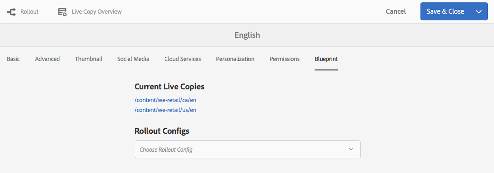
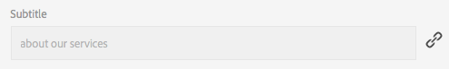

# Creazione e sincronizzazione di Live Copy{#creating-and-synchronizing-live-copies}

Puoi creare una Live Copy da una configurazione di pagina o blueprint, quindi gestire l’ereditarietà e la sincronizzazione.

## Gestione delle configurazioni Blueprint {#managing-blueprint-configurations}

Una configurazione blueprint identifica un sito web esistente che desideri utilizzare come origine per una o più pagine Live Copy.

>[!NOTE]
>
>Le configurazioni Blueprint ti consentono di inviare le modifiche al contenuto in Live Copy. Consulta [Live Copy - Source, Blueprint e Configurazioni Blueprint](/help/sites-administering/msm.md#source-blueprints-and-blueprint-configurations).

Quando crei una configurazione di blueprint, seleziona un modello che definisce la struttura interna della blueprint. Il modello di blueprint predefinito presuppone che il sito web di origine abbia le seguenti caratteristiche:

* Il sito web ha una pagina principale.
* Le pagine figlie immediate della radice sono rami linguistici del sito web. Durante la creazione di una Live Copy, le lingue vengono presentate come contenuto facoltativo da includere nella copia.
* La radice di ciascun ramo lingua ha una o più pagine figlie. Quando crei una Live Copy, le pagine figlie vengono presentate come capitoli da includere nella Live Copy.

>[!NOTE]
>
>Una struttura diversa richiede un altro modello di blueprint.

Dopo aver creato la configurazione blueprint, configura le seguenti proprietà:

* **Nome**: Nome della configurazione blueprint.
* **Percorso** origine: Percorso della pagina principale del sito che si sta utilizzando come origine (blueprint).
* **Descrizione**. (Facoltativo) Una descrizione della configurazione blueprint. La descrizione viene visualizzata nell’elenco delle configurazioni blueprint tra cui scegliere durante la creazione di un sito.

Quando utilizzi la configurazione blueprint, puoi associarla a una configurazione di rollout che determina la modalità di sincronizzazione delle Live Copy dell’origine/blueprint. Consulta [Specifica delle configurazioni di rollout da utilizzare](/help/sites-administering/msm-sync.md#specifying-the-rollout-configurations-to-use).

### Creazione di una configurazione Blueprint {#creating-a-blueprint-configuration}

Per creare una configurazione blueprint:

1.  Passare al menu  **** Strumenti, quindi selezionare il menu  **** Siti.
1. Seleziona **Blueprint** per aprire la console **Configurazioni Blueprint**:

   

1. Seleziona **Crea**.
1. Seleziona il modello di blueprint, quindi **Avanti** per continuare.
1. Selezionare la pagina sorgente da utilizzare come blueprint; quindi **Avanti** per continuare.
1. Definisci:

   * **Titolo**: titolo obbligatorio per la blueprint
   * **Descrizione**: una descrizione facoltativa per fornire ulteriori dettagli.

1. **** La creazione creerà la configurazione blueprint in base alle tue specifiche.

### Modifica o eliminazione di una configurazione Blueprint {#editing-or-deleting-a-blueprint-configuration}

Puoi modificare o eliminare una configurazione blueprint esistente:

1.  Passare al menu  **** Strumenti, quindi selezionare il menu  **** Siti.
1. Seleziona **Blueprint** per aprire la console **Configurazioni Blueprint**:

   

1. Seleziona la configurazione della blueprint richiesta; le azioni appropriate saranno disponibili nella barra degli strumenti:

   * **Proprietà**; puoi utilizzarlo per visualizzare e quindi modificare le proprietà della configurazione.
   * **Elimina**

## Creazione della Live Copy {#creating-a-live-copy}

### Creazione di una Live Copy di una pagina {#creating-a-live-copy-of-a-page}

Puoi creare una Live Copy di qualsiasi pagina o ramo. Quando crei la Live Copy, puoi specificare le configurazioni di rollout da utilizzare per la sincronizzazione del contenuto:

* Le configurazioni di rollout selezionate si applicano alla pagina Live Copy e alle relative pagine figlie.
* Se non si specificano configurazioni di rollout, MSM determina quali configurazioni di rollout utilizzare. Consulta [Specifica della configurazione di rollout da utilizzare](/help/sites-administering/msm-sync.md#specifying-the-rollout-configurations-to-use).

Puoi creare una Live Copy di qualsiasi pagina:

* Pagine a cui fa riferimento una [configurazione blueprint](#creating-a-blueprint-configuration).
* E pagine prive di connessione a una configurazione.
* AEM inoltre supporta la creazione di una Live Copy all’interno delle pagine di un’altra Live Copy.

L&#39;unica differenza è che la disponibilità del comando **Rollout** sulle pagine sorgente/blueprint dipende dal fatto che all&#39;origine venga fatto riferimento da una configurazione blueprint:

* Se crei la Live Copy da una pagina sorgente a cui **è** fa riferimento in una configurazione blueprint, il comando Rollout sarà disponibile nelle pagine sorgente/blueprint.
* Se crei la Live Copy da una pagina di origine a cui **non è** a cui si fa riferimento in una configurazione blueprint, il comando Rollout non sarà disponibile nelle pagine di origine/blueprint.

Per creare una Live Copy:

1. Nella console **Sites** seleziona **Crea**, quindi **Live Copy**.

   

1. Seleziona la pagina sorgente e tocca o fai clic su **Avanti**. Esempio:

   

1. Specifica il percorso di destinazione della Live Copy (apri la cartella o la pagina padre della Live Copy), quindi tocca o fai clic su **Avanti**.

   

   >[!NOTE]
   >
   >Il percorso di destinazione non può trovarsi all&#39;interno del percorso di origine.

1. Inserisci:

   * a **Titolo** per la pagina.
   * a **Name**, utilizzato nell&#39;URL.

   

1. Utilizza la casella di controllo **Escludi sottopagine** :

   * Selezionato: crea una Live Copy solo della pagina selezionata (Live Copy superficiale)
   * Non selezionato: crea una Live Copy che includa tutti i discendenti della pagina selezionata (Live Copy profonda)

1. (Facoltativo) Per specificare una o più configurazioni di rollout da utilizzare per la Live Copy, utilizza l’elenco a discesa **Configurazioni di rollout** per selezionarle; le configurazioni selezionate vengono visualizzate sotto il selettore a discesa.
1. Tocca o fai clic su **Crea**. Verrà visualizzato un messaggio di conferma, da qui è possibile selezionare **Apri** o **Fine**.

### Creazione di una Live Copy di un sito da una configurazione Blueprint {#creating-a-live-copy-of-a-site-from-a-blueprint-configuration}

Crea una Live Copy utilizzando una configurazione blueprint per creare un sito basato sul contenuto blueprint (sorgente). Quando crei una Live Copy da una configurazione blueprint, selezioni uno o più rami della lingua dell’origine blueprint da copiare, quindi selezioni i capitoli da copiare dai rami della lingua. Consulta [Creazione di una configurazione Blueprint](/help/sites-administering/msm-livecopy.md#creating-a-blueprint-configuration).

Se si omettono alcuni rami o capitoli della Live Copy, è possibile aggiungerli successivamente; consulta [Creazione di una Live Copy all’interno di una Live Copy (Configurazione blueprint)](#creating-a-live-copy-inside-a-live-copy-blueprint-configuration).

>[!CAUTION]
>
>Quando l’origine blueprint contiene collegamenti e riferimenti destinati a un paragrafo in un ramo diverso, le destinazioni non vengono aggiornate nelle pagine Live Copy, ma rimangono indirizzate alla destinazione originale.

Quando crei il sito, fornisci valori per le seguenti proprietà:

* **Lingue** iniziali: I rami della lingua dell’origine blueprint da includere nella Live Copy.
* **Capitoli** iniziali: Le pagine figlie dei rami del linguaggio blueprint da includere nella Live Copy.
* **Percorso** di destinazione: Posizione della pagina principale del sito Live Copy.
* **Titolo**: Titolo della pagina principale del sito Live Copy.
* **Nome**: (Facoltativo) Il nome del nodo JCR che memorizza la pagina principale della Live Copy. Il valore predefinito si basa sul titolo.
* **Proprietario** sito: (Facoltativo)
* **Live Copy**: Selezionare questa opzione per stabilire una relazione live con il sito di origine. Se non selezioni questa opzione, viene creata una copia della blueprint ma non viene successivamente sincronizzata con l’origine.
* **Configurazioni di rollout**: (Facoltativo) Seleziona una o più configurazioni di rollout da utilizzare per la sincronizzazione della Live Copy. Per impostazione predefinita, le configurazioni di rollout sono ereditate dalla blueprint; per ulteriori informazioni, consulta [Specifica delle configurazioni di rollout da utilizzare](/help/sites-administering/msm-sync.md#specifying-the-rollout-configurations-to-use) .

Per creare una Live Copy di un sito da una configurazione blueprint:

1. Nella console **Siti**, seleziona **Crea**, quindi **Sito** dal selettore a discesa.
1. Seleziona la configurazione blueprint da utilizzare come origine della Live Copy e procedi con **Avanti**:

   

1. Utilizza il selettore **Lingue iniziali** per specificare la lingua o le lingue del sito blueprint da utilizzare per la Live Copy.

   Tutte le lingue disponibili sono selezionate per impostazione predefinita. Per rimuovere una lingua, tocca o fai clic su **X** accanto alla lingua.

   Esempio:

   

1. Utilizza il menu a discesa **Capitoli iniziali** per selezionare le sezioni della blueprint da includere nella Live Copy. Anche in questo caso, tutti i capitoli disponibili sono inclusi per impostazione predefinita, ma possono essere rimossi.
1. Immetti i valori per le proprietà rimanenti, quindi seleziona **Crea**. Nella finestra di dialogo di conferma, seleziona **Fine** per tornare alla console **Sites** oppure **Apri sito** per aprire la pagina principale del sito.

### Creazione di una Live Copy all’interno di una Live Copy (configurazione Blueprint) {#creating-a-live-copy-inside-a-live-copy-blueprint-configuration}

Quando crei una Live Copy all’interno della Live Copy esistente (creata con una configurazione blueprint), puoi inserire qualsiasi copia o capitolo della lingua non inclusi al momento della creazione della Live Copy.

## Monitoraggio della Live Copy {#monitoring-your-live-copy}

### Visualizzazione dello stato di una Live Copy {#seeing-the-status-of-a-live-copy}

Le proprietà di una pagina Live Copy mostrano le seguenti informazioni sulla Live Copy:

* **Origine**: La pagina sorgente della pagina Live Copy.
* **Stato**: Lo stato di sincronizzazione della Live Copy. Lo stato include se la Live Copy è aggiornata con l’origine, quando si è verificata l’ultima sincronizzazione e chi ha eseguito la sincronizzazione.
* **Configurazione**:

   * Se la pagina è ancora soggetta all’ereditarietà Live Copy.
   * Se la configurazione viene ereditata dalla pagina padre.
   * Tutte le configurazioni di rollout utilizzate dalla Live Copy.

Per visualizzare le proprietà:

1. Nella console **Sites** , seleziona la pagina Live Copy e apri le proprietà.
1. Seleziona la scheda **Live Copy** .

   Esempio:

   

   >[!NOTE]
   >
   >Per ulteriori dettagli vedi anche l&#39;articolo della Knowledge Base [Messaggio di stato di Livecopy - Up-to-date/Green/In Sync](https://helpx.adobe.com/experience-manager/kb/livecopy-status-message---up-to-date-green-in-sync.html).

### Visualizzazione delle Live Copy di una pagina blueprint {#seeing-the-live-copies-of-a-blueprint-page}

Le pagine blueprint (a cui si fa riferimento in una configurazione blueprint) forniscono un elenco delle pagine Live Copy che utilizzano la pagina corrente (blueprint) come origine. Utilizza questo elenco per tenere traccia delle Live Copy. L&#39;elenco viene visualizzato nella scheda **Blueprint** delle proprietà della pagina [a3/>.](/help/sites-authoring/editing-page-properties.md)

## Sincronizzazione della Live Copy {#synchronizing-your-live-copy}

### Rollout di una blueprint {#rolling-out-a-blueprint}

Implementa una pagina blueprint per inviare le modifiche al contenuto in Live Copy. Un&#39;azione **Rollout** esegue le configurazioni di rollout che utilizzano il trigger [Al rollout](/help/sites-administering/msm-sync.md#rollout-triggers).

>[!NOTE]
>
>Possono verificarsi conflitti se vengono create nuove pagine con lo stesso nome di pagina sia nel ramo blueprint che in un ramo Live Copy dipendente.
>
>Tali conflitti [devono essere gestiti e risolti al momento del rollout](/help/sites-administering/msm-rollout-conflicts.md).

#### Rollout di una blueprint dalle proprietà della pagina {#rolling-out-a-blueprint-from-page-properties}

1. Nella console **Sites** , seleziona la pagina nella blueprint e apri le proprietà.
1. Apri la scheda **Blueprint.**
1. Selezionare **Rollout**.

   

1. Specifica le pagine e le eventuali sottopagine, quindi conferma con il segno di spunta:

   

1. Specifica se il processo di rollout deve essere eseguito immediatamente (**Now**) o in un&#39;altra data/ora (**Later**).

   

I rollout vengono elaborati come processi asincroni e possono essere controllati in [**Stato processi asincroni** dashboard](asynchronous-jobs.md#monitor-the-status-of-asynchronous-operations) in **Navigazione globale** -> **Strumenti** -> **Operazioni** -> **Processi**

>[!NOTE]
>
>L’elaborazione del rollout asincrono richiede AEM 6.5.3.0 o versioni successive. Nelle versioni precedenti, le pagine venivano elaborate immediatamente e in modo sincrono.

#### Implementa una blueprint dalla barra dei riferimenti {#roll-out-a-blueprint-from-the-reference-rail}

1. Nella console **Sites** , seleziona la pagina nella Live Copy e apri il pannello **[Riferimenti](/help/sites-authoring/basic-handling.md#references)** (dalla barra degli strumenti).
1. Seleziona l&#39;opzione **Blueprint** dall&#39;elenco per mostrare i progetti associati a questa pagina.
1. Seleziona la blueprint desiderata dall’elenco.
1. Tocca o fai clic su **Rollout**.
1. Ti verrà chiesto di confermare i dettagli del rollout:

   * **Ambito rollout**:

      Specifica se l’ambito è solo per la pagina selezionata o deve includere pagine secondarie.

   * **Pianificazione**:

      Specifica se il processo di rollout deve essere eseguito immediatamente (**Now**) o in una data/ora successiva (**Later**).

      

1. Dopo aver confermato questi dettagli, seleziona **Rollout** per eseguire l&#39;azione.

I rollout vengono elaborati come processi asincroni e possono essere controllati in [**Stato processi asincroni** dashboard](asynchronous-jobs.md#monitor-the-status-of-asynchronous-operations) in **Navigazione globale** -> **Strumenti** -> **Operazioni** -> **Processi**

>[!NOTE]
>
>L’elaborazione del rollout asincrono richiede AEM 6.5.3.0 o versioni successive. Nelle versioni precedenti, le pagine venivano elaborate immediatamente e in modo sincrono a meno che l’opzione **Rollout in background** non fosse selezionata.

#### Implementare una blueprint dalla panoramica Live Copy {#roll-out-a-blueprint-from-the-live-copy-overview}

L’ [Azione di rollout è disponibile anche dalla Panoramica Live Copy](/help/sites-administering/msm-livecopy-overview.md#using-the-live-copy-overview) quando è selezionata una pagina Blueprint.

1. Apri la [Panoramica Live Copy](/help/sites-administering/msm-livecopy-overview.md#using-the-live-copy-overview) e seleziona una pagina Blueprint.
1. Seleziona **Rollout** dalla barra degli strumenti.
1. Specifica le pagine e le eventuali sottopagine, quindi conferma con il segno di spunta:

   

1. Specifica se il processo di rollout deve essere eseguito immediatamente (**Now**) o in un&#39;altra data/ora (**Later**).

   

I rollout vengono elaborati come processi asincroni e possono essere controllati in [**Stato processi asincroni** dashboard](asynchronous-jobs.md#monitor-the-status-of-asynchronous-operations) in **Navigazione globale** -> **Strumenti** -> **Operazioni** -> **Processi**

>[!NOTE]
>
>L’elaborazione del rollout asincrono richiede AEM 6.5.3.0 o versioni successive. Nelle versioni precedenti, le pagine venivano elaborate immediatamente e in modo sincrono.

### Sincronizzazione di una Live Copy {#synchronizing-a-live-copy}

Sincronizza una pagina Live Copy per estrarre le modifiche al contenuto dall’origine alla Live Copy.

#### Sincronizzazione di una Live Copy dalle proprietà pagina {#synchronize-a-live-copy-from-page-properties}

Sincronizza una Live Copy per estrarre le modifiche dall’origine alla Live Copy.

>[!NOTE]
>
>La sincronizzazione esegue le configurazioni di rollout che utilizzano il trigger [Al rollout](/help/sites-administering/msm-sync.md#rollout-triggers).

1. Nella console **Sites** , seleziona la pagina Live Copy e apri le proprietà.
1. Apri la scheda **Live Copy.**
1. Tocca o fai clic su **Sincronizza**.

   

   Verrà richiesta la conferma. Per continuare, utilizzare **Sincronizza**.

#### Sincronizzazione di una Live Copy dalla panoramica Live Copy {#synchronize-a-live-copy-from-the-live-copy-overview}

L&#39;azione [Sincronizza è disponibile anche dalla Panoramica Live Copy](/help/sites-administering/msm-livecopy-overview.md#using-the-live-copy-overview) quando è selezionata una pagina Live Copy.

1. Apri la [Panoramica Live Copy](/help/sites-administering/msm-livecopy-overview.md#using-the-live-copy-overview) e seleziona una pagina Live Copy.
1. Seleziona **Sincronizza** dalla barra degli strumenti.
1. Conferma l’azione **Rollout** nella finestra di dialogo dopo aver specificato se includere:

   * **Pagina e sottopagine**
   * **Solo pagina**

   

## Modifica del contenuto della Live Copy {#changing-live-copy-content}

Per modificare il contenuto della Live Copy, puoi effettuare le seguenti operazioni:

* Aggiungere paragrafi alla pagina.
* Aggiorna il contenuto esistente interrompendo l’ereditarietà della Live Copy per qualsiasi pagina o componente.

>[!NOTE]
>
>Se crei manualmente una nuova pagina nella Live Copy, questa sarà locale nella Live Copy, il che significa che non dispone di una pagina sorgente corrispondente da allegare.
>
>La best practice per creare una pagina locale che fa parte della relazione consiste nel crearla nell’origine e nel eseguire un rollout (profondo). La pagina verrà creata localmente come Live Copy.

>[!NOTE]
>
>Possono verificarsi conflitti se vengono create nuove pagine con lo stesso nome di pagina sia nel ramo blueprint che in un ramo Live Copy dipendente.
>
>Tali conflitti [devono essere gestiti e risolti al momento del rollout](/help/sites-administering/msm-rollout-conflicts.md).

### Aggiunta di componenti a una pagina Live Copy {#adding-components-to-a-live-copy-page}

Aggiungi i componenti a una pagina Live Copy in qualsiasi momento. Lo stato di ereditarietà della Live Copy e del relativo sistema di paragrafi non consente di aggiungere componenti.

Quando la pagina Live Copy viene sincronizzata con la pagina sorgente, i componenti aggiunti rimangono invariati. Consulta anche [Modifica dell’ordine dei componenti in una pagina Live Copy](#changing-the-order-of-components-on-a-live-copy-page).

>[!NOTE]
>
>Le modifiche apportate localmente a un componente contrassegnato come contenitore non verranno sovrascritte dal contenuto della blueprint su un rollout. Per ulteriori informazioni, consulta [Best practice MSM](/help/sites-administering/msm-best-practices.md#components-and-container-synchronization) .

### Sospensione dell’ereditarietà per una pagina {#suspending-inheritance-for-a-page}

Quando crei una Live Copy, la configurazione Live Copy viene salvata nella pagina principale delle pagine copiate. Tutte le pagine figlie della pagina principale ereditano le configurazioni della Live Copy. Anche i componenti nelle pagine Live Copy ereditano la configurazione Live Copy.

Puoi sospendere l’ereditarietà della Live Copy per una pagina Live Copy in modo da poter modificare le proprietà e i componenti della pagina. Quando sospendi l’ereditarietà, le proprietà e i componenti della pagina non vengono più sincronizzati con l’origine.

>[!NOTE]
>
>Puoi anche [scollegare una Live Copy](#detaching-a-live-copy) dalla relativa blueprint per rimuovere tutte le connessioni. L&#39;azione Stacca è permanente e non reversibile.

>[!NOTE]
>
>Se il componente è contrassegnato come contenitore, le azioni di annullamento e sospensione non si applicano ai suoi componenti figlio. Per ulteriori informazioni, consulta anche [Best practice MSM](/help/sites-administering/msm-best-practices.md#components-and-container-synchronization) .

#### Sospensione dell’ereditarietà dalle proprietà pagina {#suspending-inheritance-from-page-properties}

Per sospendere l’ereditarietà su una pagina:

1. Apri le proprietà della pagina Live Copy utilizzando il comando **Visualizza proprietà** della console **Sites** o utilizzando **Informazioni pagina** nella barra degli strumenti della pagina.
1. Tocca o fai clic sulla scheda **Live Copy** .
1. Seleziona **Sospendi** dalla barra degli strumenti. Puoi quindi selezionare:

   * **Sospendi**: solo pagina corrente
   * **Sospendi con bambini**: la pagina corrente e tutte le pagine figlie

1. Seleziona **Sospendi** nella finestra di dialogo di conferma.

#### Sospensione dell’ereditarietà dalla panoramica Live Copy {#suspending-inheritance-from-the-live-copy-overview}

L’ [Azione di sospensione è disponibile anche dalla Panoramica Live Copy](/help/sites-administering/msm-livecopy-overview.md#using-the-live-copy-overview) quando è selezionata una pagina Live Copy .

1. Apri la [Panoramica Live Copy](/help/sites-administering/msm-livecopy-overview.md#using-the-live-copy-overview) e seleziona una pagina Live Copy.
1. Seleziona **Sospendi** dalla barra degli strumenti.
1. Seleziona l’opzione appropriata da:

   * **Sospendi**
   * **Sospendi con figli**

   

1. Conferma l’azione **Sospendi** nella finestra di dialogo **Sospendi Live Copy** :

   

### Ripresa dell’ereditarietà per una pagina {#resuming-inheritance-for-a-page}

Sospendere l’ereditarietà di una Live Copy per una pagina è un’azione temporanea. Una volta sospesa l&#39;azione **Riprendi** diventa disponibile, consentendoti di ripristinare la relazione live.

Quando riattivi l’ereditarietà, la pagina non viene sincronizzata automaticamente con l’origine. Se necessario, puoi richiedere una sincronizzazione:

* Nella finestra di dialogo **Riprendi**/**Ripristina**; ad esempio:

   

* In una fase successiva, selezionando manualmente l’azione di sincronizzazione.

>[!CAUTION]
>
>Quando riattivi l’ereditarietà, la pagina non viene sincronizzata automaticamente con l’origine. Se necessario, è possibile richiedere manualmente una sincronizzazione; al momento della ripresa o successivamente.

#### Ripresa dell’ereditarietà dalle proprietà della pagina {#resuming-inheritance-from-page-properties}

Una volta [sospesa](#suspending-inheritance-from-page-properties) l&#39;azione **Riprendi** diventa nella barra degli strumenti delle proprietà della pagina:

Quando questa opzione è selezionata, viene visualizzata la finestra di dialogo . Puoi selezionare una sincronizzazione, se necessario, quindi confermare l’azione.

#### Riprendi una pagina Live Copy dalla panoramica Live Copy {#resume-a-live-copy-page-from-the-live-copy-overview}

L&#39;azione [Riprendi è disponibile anche dalla Panoramica Live Copy](/help/sites-administering/msm-livecopy-overview.md#using-the-live-copy-overview) quando è selezionata una pagina Live Copy.

1. Apri [Panoramica Live Copy](/help/sites-administering/msm-livecopy-overview.md#using-the-live-copy-overview) e seleziona una pagina Live Copy sospesa; verrà visualizzato come **INHERITANCE CANCELED**.
1. Seleziona **Riprendi** dalla barra degli strumenti.
1. Indica se desideri sincronizzare la pagina dopo aver ripristinato l’ereditarietà, quindi conferma l’azione **Riprendi** nella finestra di dialogo **Riprendi Live Copy** .

### Modifica della profondità di ereditarietà (superficiale/profonda) {#changing-inheritance-depth-shallow-deep}

In una Live Copy esistente è possibile modificare la profondità di una pagina; ovvero se sono incluse le pagine figlie.

* Passaggio a una Live Copy superficiale:

   * Avrà effetto immediato ed è non reversibile.

      * Le pagine figlie vengono esplicitamente staccate dalla Live Copy. Ulteriori modifiche sui bambini non possono essere mantenute se annullate.

      * Rimuove eventuali discendenti `LiveRelationships` anche se sono nidificati `LiveCopies`.

* Passaggio a una Live Copy profonda:

   * Le pagine figlie rimangono intatte.
   * Per vedere l’effetto dello switch, puoi effettuare un rollout, tutte le modifiche di contenuto vengono applicate in base alla configurazione di rollout.

* Passaggio a una Live Copy superficiale e successivo al passaggio al formato profondo:

   * Tutti gli elementi secondari della Live Copy (in precedenza) poco profonda vengono trattati come se fossero stati creati manualmente e vengono quindi spostati utilizzando `[oldname]_msm_moved name`.

Per specificare o modificare la profondità:

1. Apri le proprietà della pagina Live Copy utilizzando il comando **Visualizza proprietà** della console **Sites** o utilizzando **Informazioni pagina** nella barra degli strumenti della pagina.
1. Tocca o fai clic sulla scheda **Live Copy** .
1. Nella sezione **Configurazione** , imposta o cancella l&#39;opzione **Ereditarietà Live Copy** a seconda che siano incluse o meno le pagine figlie:

   * Selezionato - una Live Copy profonda (incluse le pagine figlie)
   * clear - una Live Copy superficiale (sono escluse le pagine figlie)

   >[!CAUTION]
   >
   >Il passaggio a una Live Copy superficiale avrà effetto immediato e non sarà reversibile.
   >
   >Per ulteriori informazioni, consulta [Live Copy - Composizione](/help/sites-administering/msm.md#live-copies-composition) .

1. Tocca o fai clic su **Salva** per mantenere gli aggiornamenti.

### Annullamento dell&#39;ereditarietà di un componente {#cancelling-inheritance-for-a-component}

Annulla l’ereditarietà della Live Copy per un componente in modo che il componente non venga più sincronizzato con il componente di origine. Se necessario, puoi abilitare l’ereditarietà in un momento successivo.

>[!NOTE]
>
>Se il componente è contrassegnato come contenitore, le azioni di annullamento e sospensione non si applicano ai suoi componenti figlio. Per ulteriori informazioni, consulta anche [Best practice MSM](/help/sites-administering/msm-best-practices.md#components-and-container-synchronization) .

>[!NOTE]
>
>Quando riattivi l’ereditarietà, il componente non viene sincronizzato automaticamente con l’origine. Se necessario, è possibile richiedere manualmente una sincronizzazione.

Annulla ereditarietà per modificare il contenuto del componente o eliminare il componente:

1. Tocca o fai clic sul componente per il quale vuoi annullare l’ereditarietà.

   

1. Sulla barra degli strumenti del componente, tocca o fai clic sull’icona **Annulla ereditarietà** .

   

1. Nella finestra di dialogo Annulla ereditarietà, confermare l&#39;azione con **Sì**.

   La barra degli strumenti del componente viene aggiornata per includere tutti i comandi di modifica (appropriati).

### Riattivazione dell&#39;ereditarietà per un componente {#re-enabling-inheritance-for-a-component}

Per abilitare l’ereditarietà per un componente, tocca o fai clic sull’icona **Riattiva ereditarietà** nella barra degli strumenti del componente.

### Modifica dell’ordine dei componenti in una pagina Live Copy {#changing-the-order-of-components-on-a-live-copy-page}

Se una Live Copy contiene componenti che fanno parte di un sistema paragrafo, l’ereditarietà del sistema paragrafo è conforme alle regole seguenti:

* L’ordine dei componenti in un sistema paragrafo ereditato può essere modificato anche con l’ereditarietà stabilita.
* Al momento del rollout, l’ordine dei componenti verrà ripristinato dalla blueprint. se sono stati aggiunti nuovi componenti alla Live Copy prima del rollout, questi verranno riordinati insieme ai componenti sopra i quali sono stati aggiunti.
* Se l’ereditarietà del sistema di paragrafi viene annullata, l’ordine dei componenti non viene ripristinato al momento del rollout e rimarrà invariato nella Live Copy.

>[!NOTE]
>
>Quando si ripristina un&#39;ereditarietà annullata in un sistema paragrafo, l&#39;ordine dei componenti **non viene ripristinato automaticamente** dalla blueprint. Se necessario, è possibile richiedere manualmente una sincronizzazione.

Per annullare l’ereditarietà del sistema paragrafo, attenersi alla procedura descritta di seguito.

1. Apri la pagina Live Copy .
1. Trascina un componente esistente in una nuova posizione sulla pagina.
1. Nella finestra di dialogo **Annulla ereditarietà**, confermare l&#39;azione con **Sì**.

### Sovrascrittura delle proprietà di una pagina Live Copy {#overriding-properties-of-a-live-copy-page}

Per impostazione predefinita, le proprietà di una pagina Live Copy vengono ereditate dalla pagina sorgente (e non modificabili).

È possibile annullare l’ereditarietà di una proprietà quando è necessario modificare il valore della proprietà per la Live Copy. Un’icona di collegamento indica che l’ereditarietà è abilitata per la proprietà .

Quando si annulla l’ereditarietà, è possibile modificare il valore della proprietà. Un’icona di collegamento interrotto indica che l’ereditarietà è annullata.

In seguito puoi riabilitare l’ereditarietà per una proprietà, se necessario.

>[!NOTE]
>
>Quando riattivi l’ereditarietà, la proprietà della pagina Live Copy non viene sincronizzata automaticamente con la proprietà sorgente. Se necessario, è possibile richiedere manualmente una sincronizzazione.

1. Apri le proprietà della pagina Live Copy utilizzando l’opzione **Visualizza proprietà** della console **Sites** o l’icona **Informazioni pagina** sulla barra degli strumenti della pagina.
1. Per annullare l’ereditarietà di una proprietà, tocca o fai clic sull’icona di collegamento visualizzata a destra della proprietà.

   

1. Nella finestra di dialogo di conferma **Annulla ereditarietà**, tocca o fai clic su **Sì**.

### Ripristina proprietà di una pagina Live Copy {#revert-properties-of-a-live-copy-page}

Per abilitare l’ereditarietà per una proprietà, tocca o fai clic sull’icona **Ripristina ereditarietà** posta accanto alla proprietà.

### Reimpostazione di una pagina Live Copy {#resetting-a-live-copy-page}

Reimposta una pagina Live Copy su:

* Rimuovi tutte le cancellazioni di ereditarietà e
* Restituisce la pagina allo stesso stato della pagina sorgente.

Il ripristino influisce sulle modifiche apportate alle proprietà della pagina, al sistema di paragrafi e ai componenti.

#### Ripristina una pagina Live Copy dalle proprietà della pagina {#reset-a-live-copy-page-from-the-page-properties}

1. Nella console **Sites** , seleziona la pagina Live Copy e seleziona **Visualizza proprietà**.
1. Apri la scheda **Live Copy.**
1. Seleziona **Ripristina** dalla barra degli strumenti.

   

1. Nella finestra di dialogo **Ripristina Live Copy**, conferma con **Ripristina**.

#### Ripristina una pagina Live Copy dalla panoramica Live Copy {#reset-a-live-copy-page-from-the-live-copy-overview}

L&#39;azione [Ripristina è disponibile anche dalla Panoramica Live Copy](/help/sites-administering/msm-livecopy-overview.md#using-the-live-copy-overview) quando è selezionata una pagina Live Copy .

1. Apri la [Panoramica Live Copy](/help/sites-administering/msm-livecopy-overview.md#using-the-live-copy-overview) e seleziona una pagina Live Copy.
1. Seleziona **Ripristina** dalla barra degli strumenti.
1. Conferma l&#39;azione **Reset** nella finestra di dialogo **Reset Live Copy** :

   

## Confronto di una pagina Live Copy con una pagina Blueprint {#comparing-a-live-copy-page-with-a-blueprint-page}

Per tenere traccia delle modifiche apportate, puoi visualizzare la pagina blueprint in **Riferimenti** e confrontarla con la relativa pagina Live Copy:

1. Nella console **Sites** , [individua una pagina blueprint o Live Copy e selezionala](/help/sites-authoring/basic-handling.md#viewing-and-selecting-resources).
1. Apri il pannello **[Riferimenti](/help/sites-authoring/basic-handling.md#references)** e seleziona:

   * **Blueprint**  (quando è selezionata una pagina Live Copy)
   * **Live Copy**  (quando è selezionata una pagina blueprint)

1. Seleziona la tua Live Copy specifica, quindi:

   * **Confronta con Blueprint**  (quando è selezionata una pagina Live Copy)
   * **Confronta con Live Copy**  (quando è selezionata una pagina blueprint)

   Esempio:

   

1. Le due pagine (Live Copy e blueprint) verranno aperte una accanto all’altra.

   Per informazioni complete sull&#39;utilizzo di questa funzionalità, consulta [Differenze tra pagine](/help/sites-authoring/page-diff.md).

## Scollegamento di una Live Copy {#detaching-a-live-copy}

Lo scollegamento rimuove definitivamente la relazione live tra una Live Copy e la relativa pagina sorgente/blueprint. Tutte le proprietà relative a MSM vengono rimosse dalla Live Copy e le pagine Live Copy diventano una copia autonoma.

>[!CAUTION]
>
>Non puoi ripristinare la relazione live dopo aver scollegato la Live Copy.
>
>Per rimuovere la relazione in tempo reale con l&#39;opzione di ripristinarla in un secondo momento, è possibile [annullare l&#39;ereditarietà della Live Copy](#suspending-inheritance-for-a-page) per la pagina.

Ci sono implicazioni su dove all&#39;interno dell&#39;albero si utilizza **Scollega**:

* **Stacca su una pagina principale di una LiveCopy**

   Quando questa operazione viene eseguita sulla pagina principale di una Live Copy, rimuove la relazione live tra tutte le pagine del blueprint e la relativa Live Copy.

   Eventuali ulteriori modifiche apportate alle pagine del blueprint (come era) **non avranno alcun impatto sulla Live Copy (così come era).**

* **Stacca su una pagina secondaria di una LiveCopy**

   Quando questa operazione viene eseguita su una pagina secondaria (o ramo) all’interno di una Live Copy:

   * la relazione live viene rimossa per quella pagina secondaria (o ramo)
   * e le pagine (secondarie) nel ramo Live Copy vengono trattate come se fossero state create manualmente.

   *Tuttavia*, le sottopagine sono ancora soggette alla relazione live del ramo principale, quindi un ulteriore rollout delle pagine blueprint consentirà a entrambi:

   1. Rinomina le pagine staccate:

      * Questo perché MSM li considera come pagine create manualmente che causano un conflitto in quanto hanno lo stesso nome delle pagine Live Copy che sta tentando di creare.
   1. Crea una nuova pagina (Live Copy) con il nome originale, contenente le modifiche dal rollout.

   >[!NOTE]
   >
   >Per informazioni dettagliate su tali situazioni, consulta [Conflitti di rollout MSM](/help/sites-administering/msm-rollout-conflicts.md) .

### Scollega una pagina Live Copy dalle proprietà pagina {#detach-a-live-copy-page-from-the-page-properties}

Per scollegare una Live Copy:

1. Nella console **Sites** , seleziona la pagina Live Copy e tocca o fai clic su **Visualizza proprietà**.
1. Apri la scheda **Live Copy.**
1. Sulla barra degli strumenti, selezionare **Stacca**.

   

1. Viene visualizzata una finestra di dialogo di conferma; seleziona **Stacca** per completare l&#39;azione.

### Scollega una pagina Live Copy dalla panoramica Live Copy {#detach-a-live-copy-page-from-the-live-copy-overview}

L&#39;azione [Stacca è disponibile anche dalla Panoramica Live Copy](/help/sites-administering/msm-livecopy-overview.md#using-the-live-copy-overview) quando è selezionata una pagina Live Copy.

1. Apri la [Panoramica Live Copy](/help/sites-administering/msm-livecopy-overview.md#using-the-live-copy-overview) e seleziona una pagina Live Copy.
1. Seleziona **Stacca** dalla barra degli strumenti.
1. Conferma l’azione **Stacca** nella finestra di dialogo **Stacca Live Copy** :

   
