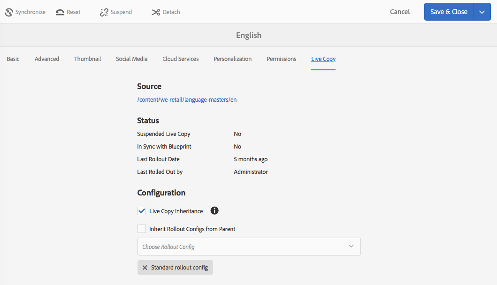

# Configurazione della sincronizzazione di una Live Copy{#configuring-live-copy-synchronization}

Per controllare come e quando le Live Copy vengono sincronizzate con il loro contenuto sorgente, esegui le seguenti attività.

* Decidi se le configurazioni di rollout esistenti soddisfano le tue esigenze o se devi crearne una o più.
* Specifica le configurazioni di rollout da utilizzare per le Live Copy.

## Configurazioni di rollout installate e personalizzate {#installed-and-custom-rollout-configurations}

Questa sezione fornisce informazioni sulle configurazioni di rollout installate e sulle azioni di sincronizzazione da esse utilizzate, nonché su come creare configurazioni personalizzate, se necessario.

>[!CAUTION]
>
>L’aggiornamento o la modifica di una configurazione di rollout preconfigurata (installata) è **non** consigliato. Se è necessaria un’azione live personalizzata, questa deve essere aggiunta in una configurazione di rollout personalizzata.

### Attivatori di rollout {#rollout-triggers}

Ogni configurazione di rollout utilizza un attivatore (o trigger) di rollout che determina l’esecuzione dell’implementazione. Le configurazioni di rollout possono utilizzare uno dei seguenti attivatori:

* **Al momento del rollout**: Il **Rollout** viene utilizzato nella pagina blueprint o nella **Sincronizza** viene utilizzato nella pagina live copy.

* **In caso di modifica**: quando la pagina sorgente viene modificata.

* **Al momento dell’attivazione**: quando la pagina sorgente viene attivata.

* **Alla disattivazione**: quando la pagina sorgente viene disattivata.

>[!NOTE]
>
>L’utilizzo del trigger Durante la modifica può influire sulle prestazioni. Per ulteriori informazioni, consulta la sezione sulle [best practice per MSM](/help/sites-administering/msm-best-practices.md#onmodify).

### Configurazioni di rollout installate {#installed-rollout-configurations}

Nella tabella seguente sono elencate le configurazioni di rollout installate con AEM. La tabella contiene le azioni di attivazione e sincronizzazione per ciascuna configurazione di rollout. Se le azioni di configurazione del rollout installate non soddisfano le tue esigenze, puoi [creare una configurazione di rollout](#creating-a-rollout-configuration).

<table>
 <tbody>
  <tr>
   <th>Nome</th>
   <th>Descrizione</th>
   <th>Attivatore</th>
   <th>Azioni di sincronizzazione    vedi anche <a href="#installed-synchronization-actions">Azioni di sincronizzazione installate</a></th>
  </tr>
  <tr>
   <td>Configurazione di rollout standard</td>
   <td>Configurazione di rollout standard che consente di avviare il processo di rollout all’attivazione del rollout ed esegue le seguenti azioni: crea, aggiorna, elimina contenuto e ordina nodi figlio.</td>
   <td>Al momento del rollout</td>
   <td>contentUpdate  contentCopy  contentDelete  referencesUpdate  productUpdate  orderChildren</td>
  </tr>
  <tr>
   <td>Attiva in caso di attivazione Blueprint</td>
   <td>Pubblica la Live Copy quando il sorgente viene pubblicato.</td>
   <td>Al momento dell’attivazione</td>
   <td>targetActivate</td>
  </tr>
  <tr>
   <td>Disattiva in caso di disattivazione Blueprint</td>
   <td>Disattiva la Live Copy quando il sorgente viene disattivato.</td>
   <td>Alla disattivazione</td>
   <td>targetDeactivate  </td>
  </tr>
  <tr>
   <td>Invia dopo modifica</td>
   <td>
Invia il contenuto alla Live Copy quando il sorgente viene modificato.
 
Utilizza questa configurazione di rollout con moderazione in quanto utilizza il trigger Durante la modifica.
 </td>
   <td>In caso di modifica</td>
   <td>contentUpdate  contentCopy  contentDelete  referencesUpdate  orderChildren  </td>
  </tr>
  <tr>
   <td>Invia dopo modifica (superficiale)</td>
   <td>
Invia il contenuto alla Live Copy quando la pagina blueprint viene modificata, senza aggiornare i riferimenti (ad esempio, per le copie superficiali).
 
Utilizza questa configurazione di rollout con moderazione in quanto utilizza il trigger Durante la modifica.
 </td>
   <td>In caso di modifica</td>
   <td>contentUpdate  contentCopy  contentDelete  orderChildren</td>
  </tr>
  <tr>
   <td>Promuovi lancio</td>
   <td>Configurazione di rollout standard per la promozione di pagine di lancio.</td>
   <td>Al momento del rollout</td>
   <td>contentUpdate  contentCopy  contentDelete  referencesUpdate  orderChildren  markLiveRelationship</td>
  </tr>
  <tr>
   <td>Configurazione rollout contenuto pagina catalogo</td>
   <td>Applica i modelli pagina da una blueprint del catalogo.</td>
   <td>Al momento del rollout</td>
   <td>contentUpdate  contentCopy  contentDelete  referencesUpdate  productCreateUpdate  orderChildren</td>
  </tr>
  <tr>
   <td>Configurazione rollout dell'aggiornamento pagina del catalogo</td>
   <td>Applica le proprietà di destinazione da una blueprint del catalogo. Deve essere eseguito dopo la configurazione del rollout del contenuto della pagina del catalogo.</td>
   <td>Al momento del rollout</td>
   <td>catalogRolloutHooks</td>
  </tr>
  <tr>
   <td>Configurazione rollout pubblicazioni DPS</td>
   <td>Configurazione rollout della pubblicazione DPS che consente di avviare il processo di rollout all’attivazione del rollout, escludendo le proprietà di associazione FolioProducer al momento del rollout iniziale</td>
   <td>Al momento del rollout</td>
   <td>contentUpdate  contentCopy  contentDelete  referencesUpdate  orderChildren  dpsMetadataFilter</td>
  </tr>
  <tr>
   <td>Configurazione rollout catalogo legacy (5.6.0)</td>
   <td>Obsoleto. Utilizza Catalog Generator invece di MSM per i rollout di cataloghi.</td>
   <td>Al momento del rollout</td>
   <td>editProperties</td>
  </tr>
 </tbody>
</table>

### Azioni di sincronizzazione installate {#installed-synchronization-actions}

Nella tabella seguente sono elencate le azioni di sincronizzazione installate con AEM. Se le azioni installate non soddisfano le tue esigenze, puoi [Crea una nuova azione di sincronizzazione](/help/sites-developing/extending-msm.md#creating-a-new-synchronization-action).

<table>
 <tbody>
  <tr>
   <th>Nome azione</th>
   <th>Descrizione</th>
   <th>Proprietà  </th>
  </tr>
  <tr>
   <td>contentCopy</td>
   <td>Quando i nodi dell’origine non esistono nella Live Copy, copia i nodi nella Live Copy. <a href="#excluding-properties-and-node-types-from-synchronization">Configura il servizio CQ MSM Content Copy Action</a> per specificare i tipi di nodo, gli elementi di paragrafo e le proprietà di pagina da escludere.   </td>
   <td> </td>
  </tr>
  <tr>
   <td>contentDelete</td>
   <td>
Elimina i nodi della Live Copy che non esistono nell’origine. <a href="#excluding-properties-and-node-types-from-synchronization">Configura il servizio CQ MSM Content Delete Action</a> per specificare i tipi di nodo, gli elementi di paragrafo e le proprietà di pagina da escludere. 
 </td>
   <td> </td>
  </tr>
  <tr>
   <td>contentUpdate</td>
   <td>Aggiorna il contenuto della Live Copy con le modifiche apportate dal sorgente. <a href="#excluding-properties-and-node-types-from-synchronization">Configura il servizio CQ MSM Content Update Action</a> per specificare i tipi di nodo, gli elementi di paragrafo e le proprietà di pagina da escludere.   </td>
   <td> </td>
  </tr>
  <tr>
   <td>editProperties</td>
   <td>
Modifica le proprietà della Live Copy. La proprietà editMap determina quali proprietà vengono modificate e il relativo valore. Il valore della proprietà editMap deve utilizzare il formato seguente:
 
<code>[property_name_1]#[current_value]#</code>[nuovo_valore],  <code>[property_name_2]#[current_value]#</code>[nuovo_valore],  ... ,  <code>[property_name_n]#[current_value]#</code>[nuovo_valore]
 
Il <code>current_value</code> e <code>new_value</code> Gli elementi sono espressioni regolari.   
 
Ad esempio, considera il seguente valore per editMap:
 
<code>sling:resourceType#/</code>(contentpage|homepage)#/  mobilecontentpage,  cq:template#/contentpage#/mobilecontentpage
 
Questo valore modifica le proprietà dei nodi Live Copy come segue:

    <ul>
     <li>Il <code>sling:resourceType</code> proprietà impostate su <code>contentpage</code> o a <code>homepage</code> sono impostati su <code>mobilecontentpage.</code></li>
     <li>Le proprietà <code>cq:template</code> impostate su <code>contentpage</code> vengono impostate su <code>mobilecontentpage.</code></li>
    </ul> </td>
   <td>
 
 
editMap: (String) identifica la proprietà, il valore corrente e il nuovo valore. Per informazioni, consulta la Descrizione.  
 </td>
  </tr>
  <tr>
   <td>notifica</td>
   <td>Invia un evento di pagina per indicare che è stato eseguito il rollout della pagina. Per ricevere una notifica, è necessario innanzitutto iscriversi a eventi di rollout.</td>
   <td> </td>
  </tr>
  <tr>
   <td>orderChildren</td>
   <td>Nella Live Copy, ordina gli elementi secondari (nodi) in base all’ordine della blueprint  </td>
   <td> </td>
  </tr>
  <tr>
   <td>referencesUpdate</td>
   <td>
Nella Live Copy, questa azione di sincronizzazione aggiorna i riferimenti, come i collegamenti.  Cerca i percorsi nelle pagine Live Copy che puntano a una risorsa all’interno della blueprint. Una volta trovato, aggiorna il percorso in modo che punti alla risorsa correlata all’interno della Live Copy (anziché alla blueprint). I riferimenti che hanno destinazioni esterne alla blueprint non vengono modificati.
 
<a href="#excluding-properties-and-node-types-from-synchronization">Configure il servizio CQ MSM References Update Action</a> per specificare i tipi di nodo, gli elementi di paragrafo e le proprietà di pagina da escludere. 
 </td>
   <td> </td>
  </tr>
  <tr>
   <td>targetVersion</td>
   <td>
Crea una versione della Live Copy.
 
Questa deve essere l’unica azione di sincronizzazione inclusa in una configurazione di rollout.
 </td>
   <td> </td>
  </tr>
  <tr>
   <td>targetActivate</td>
   <td>
Attiva la Live Copy.
 
Questa deve essere l’unica azione di sincronizzazione inclusa in una configurazione di rollout.
 </td>
   <td> </td>
  </tr>
  <tr>
   <td>targetDeactivate</td>
   <td>
Disattiva la Live Copy.
 
Questa deve essere l’unica azione di sincronizzazione inclusa in una configurazione di rollout.
 </td>
   <td> </td>
  </tr>
  <tr>
   <td>flusso di lavoro</td>
   <td>
Avvia il flusso di lavoro definito dalla proprietà target (solo per le pagine) e accetta la Live Copy come payload.
 
Il percorso di destinazione è il percorso del nodo modello.
 </td>
   <td>target: (stringa) percorso del modello di flusso di lavoro.  </td>
  </tr>
  <tr>
   <td>obbligatorio</td>
   <td>
Imposta l’autorizzazione di diversi ACL nella pagina Live Copy in sola lettura per un determinato gruppo di utenti. Sono configurate le seguenti ACL:

    <ul>
     <li>ActionSet.ACTION_NAME_REMOVE</li>
     <li>ActionSet.ACTION_NAME_SET_PROPERTY</li>
     <li>ActionSet.ACTION_NAME_ACL_MODIFY</li>
    </ul> 
Usa questa azione solo per le pagine.
 </td>
   <td>target: (stringa) ID del gruppo per il quale si stanno impostando le autorizzazioni.   </td>
  </tr>
  <tr>
   <td>mandatoryContent</td>
   <td>
Imposta l’autorizzazione di diversi ACL nella pagina Live Copy in sola lettura per un determinato gruppo di utenti. Sono configurate le seguenti ACL:

    <ul>
     <li>ActionSet.ACTION_NAME_SET_PROPERTY</li>
     <li>ActionSet.ACTION_NAME_ACL_MODIFY</li>
    </ul> 
Usa questa azione solo per le pagine.
 </td>
   <td>target: (stringa) ID del gruppo per il quale si stanno impostando le autorizzazioni. </td>
  </tr>
  <tr>
   <td>mandatoryStructure</td>
   <td>Imposta l’autorizzazione dell’ACL ActionSet.ACTION_NAME_REMOVE nella pagina Live Copy in sola lettura per un gruppo di utenti specifico. Usa questa azione solo per le pagine.</td>
   <td>target: (stringa) ID del gruppo per il quale si stanno impostando le autorizzazioni. </td>
  </tr>
  <tr>
   <td>VersionCopyAction</td>
   <td>Se la pagina blueprint/sorgente è stata pubblicata almeno una volta, crea una pagina Live Copy utilizzando la versione pubblicata. Nota: questa azione è disponibile solo per la creazione di una pagina Live Copy basata su una pagina sorgente pubblicata e non per l’aggiornamento di una pagina Live Copy esistente. </td>
   <td> </td>
  </tr>
  <tr>
   <td>PageMoveAction</td>
   <td>
La proprietà PageMoveAction si applica quando una pagina è stata spostata nella blueprint.
 
L’azione copia e non sposta la pagina Live Copy (correlata) dalla posizione prima dello spostamento a quella successiva.
 
PageMoveAction non modifica la pagina LiveCopy nella posizione in cui si trovava prima dello spostamento. Pertanto, per configurazioni di rollout consecutive ha lo stato di LiveRelationship senza blueprint.
 
<a href="#excluding-properties-and-node-types-from-synchronization">Configura il servizio Azione di spostamento di pagine di CQ MSM</a> per specificare i tipi di nodo, gli elementi di paragrafo e le proprietà di pagina da escludere. 
 
Questa deve essere l’unica azione di sincronizzazione inclusa in una configurazione di rollout.
 </td>
   <td>
prop_referenceUpdate: (booleano) Impostare su true per aggiornare i riferimenti. Il valore predefinito è true.
 
 
 </td>
  </tr>
  <tr>
   <td>productCreateUpdate</td>
   <td>Crea o aggiorna le risorse prodotto all'interno di un catalogo. Questa azione è destinata a essere utilizzata in una delle seguenti situazioni:
    <ul>
     <li>Generazione o rollout di un catalogo (o di una sezione di catalogo)</li>
     <li>Un utente ripristina l’ereditarietà della sincronizzazione per un componente prodotto.</li>
    </ul> </td>
   <td> </td>
  </tr>
  <tr>
   <td>markLiveRelationship</td>
   <td>Indica che esiste una relazione live per il contenuto creato da un lancio.</td>
   <td> </td>
  </tr>
  <tr>
   <td>catalogRolloutHooks</td>
   <td>Esegue gli hook di rollout specifici della generazione del catalogo. Chiama i metodi executePageRolloutHooks e executeProductRolloutHooks di CatalogGenerator.  Consulta com.adobe.cq.commerce.pim.api.CatalogGenerator nei documenti Java dell’AEM.</td>
   <td> </td>
  </tr>
  <tr>
   <td>productUpdate</td>
   <td>Aggiorna le pagine dei prodotti in una Live Copy di un catalogo dei prodotti</td>
   <td> </td>
  </tr>
 </tbody>
</table>

### Creazione di una configurazione di rollout {#creating-a-rollout-configuration}

È possibile [creare una configurazione di rollout](/help/sites-developing/extending-msm.md#creating-a-new-rollout-configuration) quando le configurazioni di rollout installate non soddisfano i requisiti dell’applicazione:

* [Creare la configurazione di rollout](/help/sites-developing/extending-msm.md#create-the-rollout-configuration).
* [Aggiungere azioni di sincronizzazione alla configurazione di rollout](/help/sites-developing/extending-msm.md#add-synchronization-actions-to-the-rollout-configuration).

La nuova configurazione di rollout è quindi disponibile quando imposti le configurazioni di rollout su una pagina blueprint o Live Copy.

### Esclusione delle proprietà e dei tipi di nodo dalla sincronizzazione {#excluding-properties-and-node-types-from-synchronization}

Puoi configurare diversi servizi OSGi che supportano le azioni di sincronizzazione corrispondenti in modo che non influiscano su proprietà e tipi di nodo specifici. Ad esempio, molte proprietà e sottonodi relativi al funzionamento interno dell’AEM non devono essere inclusi in una Live Copy. Deve essere copiato solo il contenuto rilevante all’utente della pagina.

Quando si lavora con l’AEM, esistono diversi metodi per gestire le impostazioni di configurazione per tali servizi; vedi [Configurazione di OSGi](/help/sites-deploying/configuring-osgi.md) per ulteriori dettagli e le pratiche consigliate.

Nella tabella seguente sono elencate le azioni di sincronizzazione per le quali è possibile specificare i nodi da escludere. La tabella fornisce i nomi dei servizi da configurare utilizzando la console web e il PID per la configurazione con un nodo dell’archivio.

| Azione di sincronizzazione | Nome del servizio nella console Web | Servizio PID |
|---|---|---|
| contentCopy | CQ MSM Content Copy Action | com.day.cq.wcm.msm.impl.actions.ContentCopyActionFactory |
| contentDelete | CQ MSM Content Delete Action | com.day.cq.wcm.msm.impl.actions.ContentDeleteActionFactory |
| contentUpdate | CQ MSM Content Update Action | com.day.cq.wcm.msm.impl.actions.ContentUpdateActionFactory |
| PageMoveAction | CQ MSM Page Move Action | com.day.cq.wcm.msm.impl.actions.PageMoveActionFactory |
| referencesUpdate | CQ MSM References Update Action | com.day.cq.wcm.msm.impl.actions.ReferencesUpdateActionFactory |

La tabella seguente descrive le proprietà che puoi configurare:

<table>
 <tbody>
  <tr>
   <th>Proprietà Console Web / proprietà OSGi</th>
   <th>Descrizione</th>
  </tr>
  <tr>
   <td>
Tipi di nodo esclusi
 
cq.wcm.msm.action.excludednodetypes
 </td>
   <td>Un’espressione regolare che corrisponde ai tipi di nodo che devono essere esclusi dall’azione di sincronizzazione.</td>
  </tr>
  <tr>
   <td>
Elementi di paragrafo esclusi
 
cq.wcm.msm.action.excludedparagraphitems
 </td>
   <td>Un'espressione regolare che corrisponde agli elementi di paragrafo da escludere dall’azione di sincronizzazione.</td>
  </tr>
  <tr>
   <td>
Proprietà pagina escluse
 
cq.wcm.msm.action.excludedprops
 </td>
   <td>Un’espressione regolare che corrisponde alle proprietà della pagina da escludere dall’azione di sincronizzazione.</td>
  </tr>
  <tr>
   <td>
Tipi di nodi Mixin ignorati
 
cq.wcm.msm.action.ignoredMixin
 </td>
   <td>Disponibile solo per l’azione CQ MSM Content Update. Un’espressione regolare che corrisponde ai nomi dei tipi di nodo mixin che devono essere esclusi dall’azione di sincronizzazione.</td>
  </tr>
 </tbody>
</table>

>[!NOTE]
>
>Nell&#39;interfaccia classica, l&#39;icona del lucchetto visualizzata nella finestra di dialogo Proprietà pagina per le pagine Live Copy non riflette la configurazione della proprietà Proprietà pagina escluse. L&#39;icona di blocco viene visualizzata anche per le proprietà escluse dall&#39;azione di sincronizzazione.

>[!NOTE]
>
>Nell’interfaccia touch vedi anche [Configurazione dei blocchi MSM nelle proprietà della pagina (interfaccia utente ottimizzata per il tocco)](/help/sites-developing/extending-msm.md#configuring-msm-locks-on-pagep-roperties-touch-optimized-ui).

#### Azione di aggiornamento dei contenuti di CQ MSM - Esclusioni {#cq-msm-content-update-action-exclusions}

Per impostazione predefinita sono escluse diverse proprietà e tipi di nodo definiti nella configurazione OSGi di **Azione di aggiornamento dei contenuti di CQ MSM**, in **Proprietà pagina esclusa**.

Per impostazione predefinita, le proprietà che corrispondono alle seguenti espressioni regolari sono escluse (ovvero non aggiornate) al momento del rollout:

Puoi modificare le espressioni che definiscono l’elenco di esclusione secondo le tue esigenze.

Ad esempio, se desideri includere il **Titolo** della pagina nelle modifiche considerate per il rollout, rimuovi `jcr:title` dalle esclusioni. Ad esempio, con il codice regex:

`jcr:(?!(title)$).*`

### Configurazione della sincronizzazione per l’aggiornamento dei riferimenti {#configuring-synchronization-for-updating-references}

Puoi configurare diversi servizi OSGi che supportano le azioni di sincronizzazione corrispondenti, relative all’aggiornamento dei riferimenti.

Quando si lavora con l’AEM, esistono diversi metodi per gestire le impostazioni di configurazione per tali servizi; vedi [Configurazione di OSGi](/help/sites-deploying/configuring-osgi.md) per ulteriori dettagli e le pratiche consigliate.

Nella tabella seguente sono elencate le azioni di sincronizzazione per cui è possibile specificare l’aggiornamento dei riferimenti. La tabella fornisce i nomi dei servizi da configurare utilizzando la console web e il PID per la configurazione con un nodo dell’archivio.

<table>
 <tbody>
  <tr>
   <th>Proprietà Console Web / proprietà OSGi</th>
   <th>Descrizione</th>
  </tr>
  <tr>
   <td>
Aggiornare il riferimento tra LiveCopy nidificate
 
cq.wcm.msm.impl.action.referencesupdate.prop_updateNested
 </td>
   <td>Disponibile solo per CQ MSM References Update Action. Seleziona questa opzione (Console web) o imposta questa proprietà booleana su true (configurazione archivio) per sostituire i riferimenti relativi a qualsiasi risorsa all’interno del ramo della Live Copy superiore.</td>
  </tr>
  <tr>
   <td>
Aggiornare le pagine di riferimento
 
cq.wcm.msm.impl.actions.pagemove.prop_referenceUpdate
 </td>
   <td>Disponibile solo per l’azione di spostamento pagina di CQ MSM. Seleziona questa opzione (Console web) o imposta questa proprietà booleana su <code>true</code> (configurazione dell’archivio) per aggiornare eventuali riferimenti in modo da utilizzare la pagina originale per fare riferimento invece alla pagina Live Copy.</td>
  </tr>
 </tbody>
</table>

## Specifica delle configurazioni di rollout da utilizzare {#specifying-the-rollout-configurations-to-use}

MSM consente di specificare i set di configurazioni di rollout utilizzati in genere e, quando necessario, puoi eseguirne l’override per specifiche Live Copy. MSM fornisce diverse posizioni per specificare le configurazioni di rollout da utilizzare. La posizione determina se la configurazione si applica a una Live Copy specifica.

Il seguente elenco di posizioni in cui puoi specificare le configurazioni di rollout descrive come MSM determina quali usare per una Live Copy:

* **[Proprietà pagina Live Copy](/help/sites-administering/msm-sync.md#setting-the-rollout-configurations-for-a-live-copy-page):** Quando una pagina Live Copy è configurata per l’utilizzo di una o più configurazioni di rollout, MSM utilizza tali configurazioni.
* **[Proprietà pagina blueprint](/help/sites-administering/msm-sync.md#setting-the-rollout-configuration-for-a-blueprint-page):** Quando una Live Copy è basata su una blueprint e la pagina Live Copy non è configurata con una configurazione di rollout, viene utilizzata la configurazione di rollout associata alla pagina blueprint sorgente.
* **Proprietà pagina genitore Live Copy:** Se né la pagina Live Copy né la pagina sorgente blueprint presentano una configurazione di rollout, viene utilizzata la configurazione di rollout che si applica alla pagina genitore della Live Copy.
* **[Impostazione predefinita del sistema](/help/sites-administering/msm-sync.md#setting-the-system-default-rollout-configuration):** Quando non è possibile determinare la configurazione di rollout della pagina genitore della Live Copy, viene utilizzata la configurazione di rollout predefinita del sistema.

Ad esempio, una blueprint utilizza il sito di riferimento We.Retail come contenuto sorgente. Viene creato un sito dalla blueprint. Ogni elemento nel seguente elenco descrive uno scenario diverso relativo all’utilizzo delle configurazioni di rollout:

* Nessuna delle pagine blueprint o delle Live Copy è configurata per l’utilizzo di una configurazione di rollout. MSM utilizza la configurazione di rollout predefinita del sistema per tutte le pagine Live Copy.
* La pagina root del sito di riferimento We.Retail è configurata con diverse configurazioni di rollout. MSM utilizza queste configurazioni di rollout per tutte le pagine Live Copy.
* La pagina root del sito di riferimento We.Retail è configurata con diverse configurazioni di rollout e la pagina root del sito Live Copy è configurata con un diverso set di configurazioni di rollout. MSM utilizza le configurazioni di rollout configurate nella pagina root del sito Live Copy.

### Impostazione delle configurazioni di rollout per una pagina Live Copy {#setting-the-rollout-configurations-for-a-live-copy-page}

Configura una pagina Live Copy con le configurazioni di rollout da utilizzare quando viene eseguito il rollout della pagina sorgente. Per impostazione predefinita, le pagine secondarie ereditano la configurazione. Quando configuri la configurazione di rollout da utilizzare, sovrascrivi la configurazione che la pagina Live Copy eredita dalla pagina genitore.

Puoi anche configurare le configurazioni di rollout per una pagina Live Copy quando [creare la live copy](/help/sites-administering/msm-livecopy.md#creating-a-live-copy-of-a-page).

1. Utilizza il **Sites** per selezionare la pagina live copy.
1. Seleziona **Proprietà** nella barra degli strumenti.
1. Apri la scheda **Live Copy.**

   La sezione **Configurazione** mostra le configurazioni di rollout ereditate dalla pagina.

   

1. Se necessario, regola il flag **Ereditarietà Live Copy**. Se selezionato, la configurazione della Live Copy ha effetto su tutti gli elementi secondari.

1. Deseleziona la proprietà **Eredita configurazione di rollout dall’elemento principale**, quindi seleziona una o più configurazioni di rollout dall’elenco.

   Le configurazioni di rollout selezionate vengono visualizzate sotto l’elenco a discesa.

   

1. Tocca o fai clic su **Salva**.

### Impostazione della configurazione di rollout per una pagina blueprint {#setting-the-rollout-configuration-for-a-blueprint-page}

Configura una pagina blueprint con le configurazioni di rollout da utilizzare quando la pagina blueprint è soggetta a rollout.

Le pagine figlie della pagina blueprint ereditano la configurazione. Quando imposti la configurazione di rollout da utilizzare, potresti sovrascrivere la configurazione che la pagina eredita dalla sua pagina principale.

1. Utilizza la console **Sites** per selezionare la pagina principale della blueprint.
1. Seleziona **Proprietà** nella barra degli strumenti.
1. Apri la scheda **Blueprint.**
1. Seleziona una o più **Configurazioni di rollout** con il selettore a discesa.
1. Per confermare gli aggiornamenti, seleziona **Salva**.

### Impostazione della configurazione di rollout predefinita del sistema {#setting-the-system-default-rollout-configuration}

Specifica una configurazione di rollout da utilizzare come impostazione predefinita del sistema. Per specificare il valore predefinito, configura il servizio OSGi:

* **Day CQ WCM Live Relationship Manager**
il PID del servizio è `com.day.cq.wcm.msm.impl.LiveRelationshipManagerImpl`

Configurare il servizio utilizzando [Console web](/help/sites-deploying/configuring-osgi.md#osgi-configuration-with-the-web-console) o un [nodo archivio](/help/sites-deploying/configuring-osgi.md#osgi-configuration-in-the-repository).

* Nella console web, il nome della proprietà da configurare è Default rollout config.
* Utilizzando un nodo di archivio, il nome della proprietà da configurare è `liverelationshipmgr.relationsconfig.default`.

Imposta il valore di questa proprietà sul percorso della configurazione di rollout da utilizzare come impostazione predefinita del sistema. Il valore predefinito è `/libs/msm/wcm/rolloutconfigs/default`, che corrisponde alla **Configurazione di rollout standard**.
