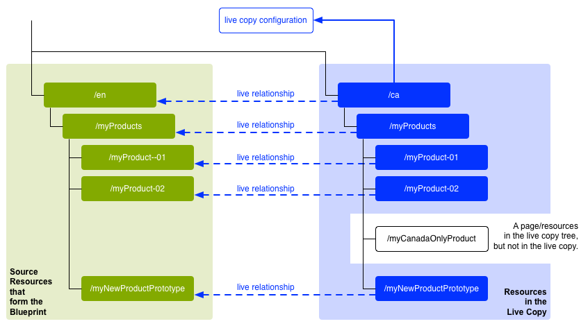

# Riutilizzo del contenuto: Multi-Site Manager e Live Copy{#reusing-content-multi-site-manager-and-live-copy}

Multi Site Manager (MSM) consente di utilizzare lo stesso contenuto del sito in più posizioni. MSM utilizza la funzionalità Live Copy per ottenere questo risultato:

* Con MSM è possibile:

   * Creare contenuto una volta e poi
   * Copia questo contenuto in altre aree ([Live Copy](#live-copies)) dello stesso sito o di altri siti e riutilizzalo in esse.

* MSM mantiene quindi le relazioni (live) tra il contenuto sorgente e le relative Live Copy in modo che:

   * Quando modifichi il contenuto sorgente, la sorgente e le Live Copy vengono sincronizzate (per applicare queste modifiche anche alle Live Copy).
   * Puoi regolare il contenuto delle Live Copy disconnettendo la relazione live per singole pagine secondarie, componenti o entrambi. In questo modo, le modifiche all’origine non vengono più applicate alla Live Copy.

Questa e le pagine seguenti trattano i problemi correlati:

* [Creazione e sincronizzazione di Live Copy](/help/sites-administering/msm-livecopy.md)
* [Panoramica Live Copy](/help/sites-administering/msm-livecopy-overview.md)
* [Configurazione della sincronizzazione di una Live Copy](/help/sites-administering/msm-sync.md)
* [Conflitti di rollout MSM](/help/sites-administering/msm-rollout-conflicts.md)
* [Best practice MSM](/help/sites-administering/msm-best-practices.md)

## Scenari possibili {#possible-scenarios}

Esistono molti casi d’uso per MSM e Live Copy, alcuni scenari includono:

* **Multinazionali: dall’azienda globale a quella locale**

  Un caso d’uso tipico supportato da MSM è quello di riutilizzare i contenuti in diversi siti multinazionali nella stessa lingua. Questo consente di riutilizzare i contenuti principali, tenendo conto delle varianti nazionali.

  Ad esempio, per i clienti negli Stati Uniti viene creata la sezione inglese dell’esempio del sito di riferimento We.Retail. La maggior parte dei contenuti di questo sito può essere utilizzata anche per altri siti We.Retail che soddisfano clienti di lingua inglese di diversi paesi e culture. Il contenuto principale rimane lo stesso in tutti i siti, mentre è possibile apportare modifiche regionali.

  La seguente struttura può essere utilizzata per i siti di Stati Uniti, Regno Unito, Canada e Australia:

  ```xml
  /content
      |- we.retail
          |- language-masters
              |- en
      |- we.retail
          |- us
              |- en
      |- we.retail
          |- gb
              |- en
      |- we.retail
          |- ca
              |- en
      |- we.retail
          |- au
              |- en
  ```

  >[!NOTE]
  >
  >MSM non traduce il contenuto. Viene utilizzato per creare la struttura richiesta e distribuire il contenuto.
  >
  >
  >Se desideri estendere questo esempio, consulta [Traduzione di contenuti per siti multilingue](/help/sites-administering/translation.md).

* **Nazionale: dalla sede principale alle succursali regionali**

  In alternativa, un&#39;azienda con una rete di dealer potrebbe voler creare siti web separati per i singoli dealer, ognuno dei quali rappresenta una variazione del sito principale fornito dalla sede centrale. Potrebbe trattarsi di una singola azienda con più uffici regionali o di un sistema di franchising nazionale composto da un franchisor centrale e da più affiliati locali.

  La sede centrale può fornire le informazioni di base, mentre gli enti regionali possono aggiungere informazioni locali, quali i dati di contatto, gli orari di apertura e gli eventi.

  ```xml
  /content
      |- head-office-Berlin
      |- branch-Hamburg
      |- branch-Stuttgart
      |- branch-Munich
      |- branch-Frankfurt
  ```

* **Più versioni**

  In alternativa, puoi utilizzare MSM per creare versioni di un sottoramo specifico. Ad esempio, un sito secondario di supporto che contiene i dettagli delle diverse versioni di un prodotto specifico, in cui le informazioni di base rimangono costanti e devono essere modificate solo le funzioni aggiornate:

  ```xml
  /content
      |- support
          |- product X
              |- v5.0
              |- v4.0
              |- v3.0
              |- v2.0
              |- v1.0
  ```

  >[!NOTE]
  >
  >In questo caso, devi decidere se effettuare una copia diretta o utilizzare Live Copy.
  >
  >Esiste un equilibrio tra:
  >
  >  * Quanto contenuto di base deve essere aggiornato su più versioni.
  >
  >Contro:
  >
  >  * Quanto delle singole copie deve essere regolato.

## MSM dall’interfaccia utente {#msm-from-the-ui}

MSM è direttamente accessibile nell’interfaccia utente utilizzando varie opzioni dalla console appropriata. Per fornire un’introduzione, di seguito sono elencate le posizioni principali:

* **Crea sito** (**Sites**)

   * MSM consente di gestire più siti web che condividono contenuti comuni. Ad esempio, i siti web sono spesso disponibili per il pubblico internazionale in modo che la maggior parte dei contenuti sia comune in tutti i paesi, con un sottoinsieme di contenuti specifici per ogni singolo paese. MSM consente di [creare Live Copy che aggiornano automaticamente uno o più siti in base al sito di origine](/help/sites-administering/msm-livecopy.md#creating-a-live-copy-of-a-site-from-a-blueprint-configuration). Questo consente anche di applicare una struttura di base comune, utilizzare i contenuti comuni tra più siti, mantenere un aspetto comune e concentrarsi sulla gestione dei contenuti che differiscono effettivamente tra i siti.
   * Per specificare la sorgente è necessaria una configurazione blueprint predefinita.
   * Crea una Live Copy dell’origine (predefinita).
   * Fornisce all&#39;utente il pulsante **Rollout**.

* **Crea Live Copy** (**Sites**)

   * MSM consente di [creare una Live Copy ad hoc (una tantum) di una singola pagina o sottosezione di un sito Web](/help/sites-administering/msm-livecopy.md#creating-a-live-copy-of-a-page); ad esempio, duplicando un sottoramo per fornire informazioni su una versione nuova/aggiornata di un prodotto.
   * Crea una Live Copy ad hoc (non è richiesta alcuna configurazione blueprint).
   * Può essere utilizzato per creare (immediatamente) una Live Copy di qualsiasi pagina/ramo.
   * Richiede **Sincronizza** (non fornisce il pulsante di **Rollout**).

* **Visualizza proprietà** (**Sites**)

   * Se appropriato, questa opzione ti aiuta a [monitorare la Live Copy](/help/sites-administering/msm-livecopy.md#monitoring-your-live-copy) fornendo informazioni sulle **Live Copy** y o **Blueprint** correlate.

* **Riferimenti** (**Sites**)

   * La barra [Riferimenti](/help/sites-authoring/basic-handling.md#references) fornisce informazioni sulle **Live Copy** insieme all’accesso alle azioni appropriate.

* **Panoramica delle Live Copy** (**Sites**)

   * Questa console consente di [visualizzare e gestire la blueprint e le relative Live Copy](/help/sites-administering/msm-livecopy-overview.md).

* **Blueprint** (**Strumenti** - **Sites**)

   * Questa console consente di [creare e gestire le configurazioni blueprint](/help/sites-administering/msm-livecopy.md#creating-a-blueprint-configuration).

>[!NOTE]
>
>MSM può essere utilizzato sia con le pagine che con [Frammenti esperienza](/help/sites-authoring/experience-fragments.md) in quanto tali frammenti fanno parte di un&#39;esperienza (pagina).

>[!NOTE]
>
>Aspetti della funzionalità MSM sono utilizzati in diverse altre funzioni di Adobe Experience Manager (AEM) (ad esempio, Lanci, Catalogo); in questi casi la Live Copy è gestita da tale funzione.

### Termini utilizzati {#terms-used}

Come introduzione, la tabella seguente fornisce una panoramica dei termini principali utilizzati con MSM; questi sono trattati più dettagliatamente nelle sezioni e nelle pagine successive:

<table>
 <tbody>
  <tr>
   <td><strong>Termine</strong></td>
   <td><strong>Definizione</strong></td>
   <td><strong>Ulteriori dettagli</strong></td>
  </tr>
  <tr>
   <td><strong>Sorgente</strong></td>
   <td>Le pagine originali.</td>
   <td>Sinonimo di pagine blueprint e/o blueprint.</td>
  </tr>
  <tr>
   <td><strong>Live Copy </strong></td>
   <td>La copia (dell’origine), gestita dalle azioni di sincronizzazione definite dalle configurazioni di rollout. </td>
   <td> </td>
  </tr>
  <tr>
   <td><strong>Configurazione Live Copy</strong></td>
   <td>Definizione dei dettagli di configurazione di una Live Copy.</td>
   <td> </td>
  </tr>
  <tr>
   <td><strong>Relazione Live</strong><br /> </td>
   <td>Definizione effettiva dell'ereditarietà per una determinata risorsa; connessioni tra l'origine e le Live Copy.<br /> </td>
   <td>Assicura che le modifiche all’origine possano essere sincronizzate con la Live Copy.</td>
  </tr>
  <tr>
   <td><strong>Blueprint</strong></td>
   <td>Sinonimo di Source.</td>
   <td>Può essere definita da una configurazione blueprint.</td>
  </tr>
  <tr>
   <td><strong>Configurazione Blueprint</strong></td>
   <td>Configurazione predefinita che specifica un percorso di origine.</td>
   <td>Quando in una configurazione blueprint viene fatto riferimento a una pagina blueprint, diventa disponibile il comando Rollout.</td>
  </tr>
  <tr>
   <td><strong>Sincronizzazione</strong></td>
   <td>Termine generico per la sincronizzazione dei contenuti tra l'origine e le Live Copy (da <strong>Rollout</strong> e <strong>Sincronizza</strong>).</td>
   <td> </td>
  </tr>
  <tr>
   <td><strong>Rollout</strong><br /> </td>
   <td>Sincronizza dall’origine alla Live Copy.<br /> Può essere attivato da un autore (in una pagina blueprint) o da un evento di sistema (come definito dalla configurazione di rollout).</td>
   <td> </td>
  </tr>
  <tr>
   <td><strong>Configurazione rollout</strong></td>
   <td>Regole che determinano quali proprietà vengono sincronizzate, come e quando.</td>
   <td> </td>
  </tr>
  <tr>
   <td><strong>Sincronizza</strong></td>
   <td>Richiesta manuale di sincronizzazione, effettuata dalle pagine Live Copy.</td>
   <td> </td>
  </tr>
  <tr>
   <td><strong>Ereditarietà</strong></td>
   <td>Una pagina/componente Live Copy eredita il contenuto dalla pagina/componente sorgente quando viene eseguita la sincronizzazione.</td>
   <td> </td>
  </tr>
  <tr>
   <td><strong>Sospendi</strong></td>
   <td>Rimuove temporaneamente la relazione live tra una Live Copy e la relativa pagina blueprint.</td>
   <td> </td>
  </tr>
  <tr>
   <td><strong>Stacca</strong></td>
   <td>Rimuove definitivamente la relazione live tra una Live Copy e la relativa pagina blueprint.</td>
   <td> </td>
  </tr>
  <tr>
   <td><strong>Ripristina</strong></td>
   <td><p>Reimposta una pagina Live Copy in:</p>
    <ul>
     <li>Rimuovi tutte le cancellazioni di ereditarietà e <br /> </li>
     <li>Restituire alla pagina lo stesso stato della pagina sorgente.</li>
    </ul> <p>La reimpostazione influisce sulle modifiche apportate alle proprietà della pagina, al sistema paragrafo e ai componenti.</p> </td>
   <td> </td>
  </tr>
  <tr>
   <td><strong>Superficiale</strong></td>
   <td>Live Copy di una singola pagina.</td>
   <td> </td>
  </tr>
  <tr>
   <td><strong>Profondo</strong></td>
   <td>Una Live Copy di una pagina, insieme alle relative pagine figlie.</td>
   <td> </td>
  </tr>
 </tbody>
</table>

>[!NOTE]
>
>Vedere [Panoramica dell&#39;API Java™](/help/sites-developing/extending-msm.md#overview-of-the-java-api) per i nomi degli oggetti.

## Live Copy {#live-copies}

Una Live Copy MSM è una copia di un contenuto specifico del sito per il quale viene mantenuta una relazione live con il sorgente originale:

* La Live Copy eredita il contenuto dalla sua origine.
* La sincronizzazione esegue il trasferimento effettivo del contenuto quando vengono apportate modifiche al sorgente.
* Una Live Copy può essere considerata:

   * Shallow: una singola pagina
   * Deep: la pagina, insieme alle relative pagine figlie

* Le regole di sincronizzazione, denominate configurazioni di rollout, determinano quali proprietà vengono sincronizzate e quando avviene la sincronizzazione.

Nell&#39;esempio precedente, `/content/we-retail/language-masters/en` è il sito master globale in inglese. Per riutilizzare il contenuto di questo sito, vengono create le Live Copy MSM:

* Il contenuto seguente `/content/we-retail/language-masters/en` è la sorgente.

* Il contenuto sotto `/content/we-retail/language-masters/en` viene copiato sotto i nodi `/content/we-retail/us/en/`, `/content/we-retail/gb/en`, `/content/we-retail/ca/en` e `/content/we-retail/au/en`. Queste sono le Live Copy.

* Gli autori possono modificare le pagine sotto `/content/we-retail/language-masters/en`.
* Quando viene attivato, MSM sincronizza queste modifiche con le Live Copy.

### Live Copy - Composizione {#live-copies-composition}

>[!NOTE]
>
>I diagrammi e le descrizioni contenuti in questa sezione rappresentano istantanee di potenziali Live Copy. Non sono complete, ma forniscono una panoramica per evidenziare caratteristiche specifiche.

Quando crei inizialmente una Live Copy, le pagine sorgente selezionate vengono riportate in rapporto 1:1 nella Live Copy. In seguito, è possibile creare nuove risorse (pagine e/o paragrafi) direttamente all’interno della Live Copy, quindi è utile essere a conoscenza di queste varianti e del loro impatto sulla sincronizzazione. Le possibili composizioni includono:

* [Live Copy con pagine non Live Copy](#live-copy-with-non-live-copy-pages)
* [Live Copy nidificate](#nested-live-copies)

La forma di base della Live Copy dispone di:

* Pagine Live Copy che riflettono le pagine sorgente selezionate in rapporto 1:1.
* Una definizione di configurazione.
* Una relazione live definita per ogni risorsa:

   * Collega la risorsa Live Copy alla relativa blueprint/sorgente.
   * Utilizzato per la realizzazione di ereditarietà e rollout.

* Le modifiche possono essere [sincronizzate](/help/sites-administering/msm-livecopy.md#synchronizing-your-live-copy) in base ai requisiti.


#### Live Copy con pagine non Live Copy {#live-copy-with-non-live-copy-pages}

Quando crei una Live Copy in AEM, puoi visualizzare e navigare attraverso il ramo Live Copy e utilizzare le normali funzionalità AEM sul ramo Live Copy. Ciò significa che tu o un processo potete creare risorse (pagine, paragrafi o entrambi) all&#39;interno del ramo Live Copy. Esempio: `myCanadaOnlyProduct`.

* Tali risorse non hanno alcuna relazione live con le pagine sorgente/blueprint e non sono sincronizzate.
* Possono verificarsi scenari che MSM gestisce come casi speciali. Ad esempio, quando crei una pagina con la stessa posizione e lo stesso nome nei rami sorgente/blueprint e Live Copy. Per tali situazioni, vedi [Conflitti di rollout MSM](/help/sites-administering/msm-rollout-conflicts.md) per ulteriori informazioni.



#### Live Copy nidificate {#nested-live-copies}

Quando crei una pagina [ all&#39;interno di una Live Copy esistente](#live-copy-with-non-live-copy-pages), questa nuova pagina può anche essere impostata come Live Copy di un&#39;altra blueprint. Questa è nota come Live Copy nidificata, in cui il comportamento della seconda Live Copy (interna) è interessato dalla prima Live Copy (esterna) nel modo seguente:

* Un rollout profondo attivato per la Live Copy di livello superiore può essere continuato nella Live Copy nidificata (ad esempio, se il trigger corrisponde).
* Eventuali collegamenti tra le sorgenti vengono riscritti all’interno delle Live Copy.

  Ad esempio, i collegamenti dal secondo al primo blueprint vengono riscritti come collegamenti dalla Live Copy nidificata/seconda alla prima Live Copy.


>[!NOTE]
>
>Se sposti o rinomini una pagina all’interno del ramo Live Copy, questa viene trattata (internamente) come una Live Copy nidificata per consentire all’AEM di tracciare le relazioni.

#### Live Copy sovrapposte {#stacked-live-copies}

Una Live Copy è nota come Live Copy sovrapposta quando viene creata come figlia di una Live Copy shallow. Si comporta nello stesso modo di una [Live Copy nidificata](#nested-live-copies).

### Configurazioni Source, Blueprint e Blueprint {#source-blueprints-and-blueprint-configurations}

Qualsiasi pagina o ramo di pagine può essere utilizzata come origine di una Live Copy.

Tuttavia, MSM ti consente anche di definire una configurazione blueprint che specifica un percorso sorgente. I vantaggi dell’utilizzo di una configurazione blueprint sono i seguenti:

* Consenti all&#39;autore di utilizzare l&#39;opzione **Rollout** su una blueprint per inviare (esplicitamente) le modifiche alle Live Copy che ereditano da questa blueprint.
* Consenti all&#39;autore di utilizzare **Crea sito**, in modo che l&#39;utente possa selezionare facilmente le lingue e configurare la struttura della Live Copy.
* Definisci una configurazione di rollout predefinita per le Live Copy che hanno una relazione con la blueprint.

La sorgente di una Live Copy può essere costituita da pagine normali o da pagine incluse in una configurazione blueprint; entrambi sono casi d’uso validi.

Il sorgente forma la blueprint per la Live Copy. La blueprint viene definita quando:

* [Creare una configurazione Blueprint](/help/sites-administering/msm-livecopy.md#creating-a-blueprint-configuration)

  La configurazione definisce (in anticipo) le pagine da utilizzare per creare la Live Copy.

* [Creare una Live Copy di una pagina](/help/sites-administering/msm-livecopy.md#creating-a-live-copy-of-a-page)

  Le pagine utilizzate per creare la Live Copy (le pagine sorgente) sono le pagine blueprint.

  Una configurazione blueprint può fare riferimento o meno alla pagina sorgente.

### Rollout e sincronizzazione {#rollout-and-synchronize}

Un rollout è l’azione MSM centrale che sincronizza le Live Copy con la loro sorgente. Puoi eseguire i rollout manualmente o in automatico:

* Una [configurazione di rollout](#rollout-configurations) può essere definita in modo che [eventi](/help/sites-administering/msm-sync.md#rollout-triggers) specifici possano causare un rollout automatico.
* Quando crei una pagina blueprint, puoi utilizzare il comando [Rollout](/help/sites-administering/msm-livecopy.md#rolling-out-a-blueprint) per inviare le modifiche alla Live Copy.

  **Il comando Rollout** è disponibile in una pagina blueprint a cui fa riferimento una configurazione blueprint.

  

* Quando crei una pagina Live Copy, puoi utilizzare il comando [Sincronizza](/help/sites-administering/msm-livecopy.md#synchronizing-a-live-copy) per richiamare le modifiche dall&#39;origine alla Live Copy.

  Il comando **Sincronizza** è sempre disponibile nella pagina Live Copy (indipendentemente dal fatto che la pagina sorgente/blueprint sia inclusa in una configurazione blueprint).

  

### Configurazioni rollout {#rollout-configurations}

Una configurazione di rollout definisce quando e come una Live Copy viene sincronizzata con il contenuto sorgente. Una configurazione di rollout è costituita da un trigger e da una o più azioni di sincronizzazione:

* **Trigger**

  Un trigger è un evento che causa la sincronizzazione di un’azione live, ad esempio l’attivazione di una pagina sorgente. MSM definisce i trigger utilizzabili.

* **Azioni di sincronizzazione**

  Eseguito sulla Live Copy per sincronizzarla con la sorgente. Le azioni di esempio sono la copia del contenuto, l’ordine dei nodi secondari e l’attivazione della pagina Live Copy. MSM fornisce diverse azioni di sincronizzazione.

  >[!NOTE]
  >
  >Puoi creare azioni personalizzate per la tua istanza utilizzando l’API Java™.

Le configurazioni di rollout possono essere riutilizzate, in modo che più Live Copy possano utilizzare la stessa configurazione di rollout. In un&#39;installazione standard sono incluse diverse [configurazioni di rollout](/help/sites-administering/msm-sync.md#installed-rollout-configurations).

### Conflitti di rollout {#rollout-conflicts}

I rollout possono complicarsi, soprattutto quando gli autori modificano il contenuto sia nell&#39;origine che nella Live Copy, pertanto è utile essere a conoscenza di come l&#39;AEM gestisce eventuali [conflitti che potrebbero verificarsi durante il rollout](/help/sites-administering/msm-rollout-conflicts.md).

### Sospensione e annullamento dell’ereditarietà e della sincronizzazione {#suspending-and-cancelling-inheritance-and-synchronization}

Ogni pagina e componente di una Live Copy è associata alla relativa pagina sorgente e al relativo componente tramite una relazione live. La relazione live configura la sincronizzazione del contenuto della Live Copy dal sorgente.

Puoi **Sospendere** l&#39;ereditarietà della Live Copy per una pagina Live Copy in modo da poter modificare le proprietà e i componenti della pagina. Quando sospendi l’ereditarietà, le proprietà e i componenti della pagina non vengono più sincronizzati con il sorgente.

Quando modificano una singola pagina, gli autori possono **Annullare l&#39;ereditarietà** per un componente. Quando l’ereditarietà viene annullata, la relazione live viene sospesa e la sincronizzazione non viene eseguita per quel componente. L’annullamento dell’ereditarietà e della sincronizzazione è utile quando è necessario personalizzare le sottosezioni del contenuto.

### Scollegare una Live Copy {#detaching-a-live-copy}

Puoi anche [scollegare una Live Copy](/help/sites-administering/msm-livecopy.md#detaching-a-live-copy) dalla blueprint per rimuovere tutte le connessioni.

>[!CAUTION]
>
>L&#39;azione Scollega è permanente e non reversibile.

Stacca rimuove definitivamente la relazione live tra una Live Copy e la relativa pagina blueprint. Tutte le proprietà relative a MSM vengono rimosse dalla Live Copy e le pagine Live Copy diventano una copia autonoma.

>[!NOTE]
>
>Vedi [Scollegamento di una Live Copy](/help/sites-administering/msm-livecopy.md#detaching-a-live-copy) per informazioni dettagliate, compreso l&#39;impatto correlato sulla pagina secondaria e genitore.

## Passaggi standard per l&#39;utilizzo di MSM {#standard-steps-for-using-msm}

I passaggi seguenti descrivono la procedura standard per utilizzare MSM per riutilizzare il contenuto e sincronizzare le modifiche alle Live Copy.

1. Sviluppa il contenuto del sito sorgente.
1. Determina la configurazione di rollout da utilizzare.

   1. MSM [installa diverse configurazioni di rollout](/help/sites-administering/msm-sync.md#installed-rollout-configurations) che possono soddisfare vari casi d&#39;uso.
   1. Se necessario, puoi [creare una configurazione di rollout](/help/sites-administering/msm-sync.md#creating-a-rollout-configuration).

1. Determina dove devi [specificare le configurazioni di rollout da utilizzare](/help/sites-administering/msm-sync.md#specifying-the-rollout-configurations-to-use) e configurale come richiesto.
1. Se necessario, [crea una configurazione blueprint](/help/sites-administering/msm-livecopy.md#creating-a-blueprint-configuration) che identifica il contenuto sorgente della Live Copy.
1. [Crea una Live Copy](/help/sites-administering/msm-livecopy.md#creating-a-live-copy).
1. Modifica il contenuto sorgente come richiesto. Implementa il normale processo di revisione e approvazione dei contenuti stabilito dalla tua organizzazione.
1. [Esegui il rollout](/help/sites-administering/msm-livecopy.md#rolling-out-a-blueprint) della blueprint oppure [sincronizza la Live Copy](/help/sites-administering/msm-livecopy.md#synchronizing-a-live-copy) con le modifiche.

## Personalizzazione di MSM {#customizing-msm}

MSM fornisce strumenti che consentono all’implementazione di adattarsi alle complessità eccezionali che possono esistere durante la condivisione dei contenuti:

* **Configurazioni rollout personalizzate**
  [Crea una configurazione di rollout](/help/sites-administering/msm-sync.md#creating-a-rollout-configuration) quando le configurazioni di rollout installate non soddisfano le tue esigenze. Puoi utilizzare qualsiasi azione di trigger di rollout e sincronizzazione disponibile.

* **Azioni di sincronizzazione personalizzate**
  [Crea un&#39;azione di sincronizzazione personalizzata](/help/sites-developing/extending-msm.md#creating-a-new-synchronization-action) quando le azioni installate non soddisfano i requisiti specifici dell&#39;applicazione. MSM fornisce un’API Java™ per la creazione di azioni di sincronizzazione personalizzate.

## Best practice   {#best-practices}

La pagina [Best practice MSM](/help/sites-administering/msm-best-practices.md) contiene informazioni importanti sull’implementazione.
