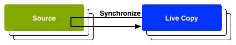

# Riutilizzo del contenuto: Multi-Site Manager e Live Copy{#reusing-content-multi-site-manager-and-live-copy}

Multi Site Manager (MSM) consente di utilizzare lo stesso contenuto del sito in più posizioni. MSM utilizza la funzionalità Live Copy per ottenere quanto segue:

* Con MSM è possibile:

   * Creare contenuti una volta e poi
   * Copiate questo contenuto in altre aree ([Live Copy](#live-copies)) dello stesso o di altri siti e riutilizzatelo.

* MSM mantiene quindi le relazioni (live) tra il contenuto sorgente e le sue copie dal vivo in modo che:

   * Quando apportate delle modifiche al contenuto sorgente, le copie sorgente e live vengono sincronizzate (per applicare anche queste modifiche alle Live Copy).
   * È possibile apportare modifiche al contenuto delle copie dal vivo scollegando la relazione dal vivo per le singole sottopagine e/o componenti. In questo modo, le modifiche all&#39;origine non verranno più applicate alla Live Copy.

Questa e le pagine seguenti affrontano i problemi correlati:

* [Creazione e sincronizzazione di Live Copy](/help/sites-administering/msm-livecopy.md)
* [Console Panoramica Live Copy](/help/sites-administering/msm-livecopy-overview.md)
* [Configurazione della sincronizzazione di una Live Copy](/help/sites-administering/msm-sync.md)
* [Conflitti tra rollout MSM](/help/sites-administering/msm-rollout-conflicts.md)
* [Tecniche consigliate per MSM](/help/sites-administering/msm-best-practices.md)

## Scenari possibili {#possible-scenarios}

Esistono molti casi d&#39;uso per MSM e Live Copy, alcuni scenari includono:

* **Multinazionali - Azienda globale a locale**

   Un caso d&#39;uso tipico supportato da MSM è quello di riutilizzare il contenuto in diversi siti multinazionali in lingua identica. Questo consente di riutilizzare i contenuti di base, consentendo al contempo di effettuare variazioni a livello nazionale.

   Ad esempio, la sezione inglese dell’esempio di sito di riferimento We.Retail viene creata per i clienti negli Stati Uniti. La maggior parte dei contenuti di questo sito può essere utilizzata anche per altri siti Web We.Retail che si rivolgono a clienti di lingua inglese di paesi e culture diverse. Il contenuto principale rimane invariato in tutti i siti, mentre è possibile apportare modifiche regionali.

   La seguente struttura può essere utilizzata per i siti per Stati Uniti, Regno Unito, Canada e Australia:

   ```xml
   /content
       |- we.retail
           |- language-masters
               |- en
       |- we.retail
           |- us
               |- en
       |- we.retail
           |- gb
               |- en
       |- we.retail
           |- ca
               |- en
       |- we.retail
           |- au
               |- en
   ```

   >[!NOTE]
   >
   >MSM non traduce il contenuto. Viene utilizzato per creare la struttura richiesta e distribuire il contenuto.
   >
   >
   >Per un esempio di questo tipo, vedere [Conversione di contenuti per siti multilingue](/help/sites-administering/translation.md).

* **Nazionale - sede principale per le filiali regionali**

   In alternativa, un&#39;azienda con una rete di dealer potrebbe desiderare siti Web separati per i propri dealer - ciascuno dei quali è una variazione del sito principale fornito dalla sede centrale. Questo potrebbe essere per una singola società con più uffici regionali, o un sistema di franchising nazionale composto da un franchisor centrale e da più affiliati locali.

   La sede centrale può fornire le informazioni di base, mentre gli enti regionali possono aggiungere informazioni locali, come i dettagli di contatto, gli orari di apertura e gli eventi.

   ```xml
   /content
       |- head-office-Berlin
       |- branch-Hamburg
       |- branch-Stuttgart
       |- branch-Munich
       |- branch-Frankfurt
   ```

* **Versioni multiple**

   Oppure è possibile utilizzare MSM per creare versioni di uno specifico ramo secondario. Ad esempio, un sottosito di supporto che contiene dettagli sulle diverse versioni di un prodotto specifico, in cui le informazioni di base rimangono costanti e solo le funzioni aggiornate devono essere modificate:

   ```xml
   /content
       |- support
           |- product X
               |- v5.0
               |- v4.0
               |- v3.0
               |- v2.0
               |- v1.0
   ```

   >[!NOTE]
   >
   >In questo caso si tratta sempre di decidere se effettuare una copia semplice o utilizzare copie dal vivo.
   >
   >Esiste un equilibrio tra:
   >
   >  * Quanti contenuti di base dovranno essere aggiornati su più versioni.
   >
   >Contrari:
   >
   >  * La quantità di singole copie dovrà essere regolata.


## MSM dall&#39;interfaccia {#msm-from-the-ui}

MSM è direttamente accessibile nell&#39;interfaccia utente utilizzando le varie opzioni della console appropriata. Per fornire un&#39;introduzione ai seguenti elenchi delle posizioni principali:

* **Crea sito**  (**siti**)

   * MSM consente di gestire più siti Web che condividono contenuti comuni; ad esempio, i siti web sono spesso forniti per il pubblico internazionale in modo che la maggior parte dei contenuti sia comune in tutti i paesi, con un sottoinsieme di contenuti specifici per ogni singolo paese. MSM consente di [creare copie live che aggiornano automaticamente uno o più siti in base al sito di origine](/help/sites-administering/msm-livecopy.md#creating-a-live-copy-of-a-site-from-a-blueprint-configuration). Questo consente anche di applicare una struttura di base comune, utilizzare il contenuto comune tra più siti, mantenere un aspetto e un aspetto comuni e concentrare gli sforzi sulla gestione dei contenuti che differiscono effettivamente tra i siti.
   * Richiede una configurazione blueprint predefinita per specificare l&#39;origine.
   * Crea una Live Copy dell’origine (predefinita).
   * Fornisce all&#39;utente il pulsante **Rollout**.

* **Crea Live Copy**  (**Siti**)

   * MSM consente di [creare una copia live ad hoc (una tantum) di una singola pagina o sottoramo di un sito Web](/help/sites-administering/msm-livecopy.md#creating-a-live-copy-of-a-page); ad esempio, duplicare un ramo secondario per fornire informazioni su una versione nuova o aggiornata di un prodotto.
   * Crea una Live Copy ad hoc (non è richiesta alcuna configurazione di blueprint).
   * Può essere utilizzato per creare (immediatamente) una Live Copy di qualsiasi pagina/ramo.
   * Richiede **Sincronizza** (non fornisce il pulsante **Rollout**).

* **Visualizza proprietà**  (**siti**)

   * Se appropriato, questa opzione consente di [monitorare la copia live](/help/sites-administering/msm-livecopy.md#monitoring-your-live-copy) fornendo informazioni sulla **Live Cop** y o **Blueprint** correlata.

* **Riferimenti**  (**Siti**)

   * La barra laterale [References](/help/sites-authoring/basic-handling.md#references) contiene informazioni su **Live Copy** e sull&#39;accesso alle azioni appropriate.

* **Panoramica**  Live Copy (**Siti**)

   * Questa console consente di [visualizzare e gestire il progetto e le sue copie live](/help/sites-administering/msm-livecopy-overview.md).

* **Blueprint** (**Strumenti**  -  **Siti**)

   * Questa console consente di [creare e gestire le configurazioni di blueprint](/help/sites-administering/msm-livecopy.md#creating-a-blueprint-configuration).

>[!NOTE]
>
>Gli aspetti della funzionalità MSM sono utilizzati in diverse altre funzioni AEM (ad esempio, Lanci, Catalogo); in questi casi la Live Copy viene gestita da tale funzione.

### Termini utilizzati {#terms-used}

Come introduzione, la seguente tabella fornisce una panoramica dei principali termini utilizzati con MSM; verranno trattati più dettagliatamente nelle sezioni e nelle pagine successive:

<table>
 <tbody>
  <tr>
   <td><strong>Termine</strong></td>
   <td><strong>Definizione</strong></td>
   <td><strong>Maggiori dettagli</strong></td>
  </tr>
  <tr>
   <td><strong>Origine</strong></td>
   <td>Le pagine originali.</td>
   <td>Sinonimo di blueprint e/o di pagine Blueprint.</td>
  </tr>
  <tr>
   <td><strong>Live Copy </strong></td>
   <td>La copia (dell’origine), gestita dalle azioni di sincronizzazione come definite dalle configurazioni di rollout. </td>
   <td> </td>
  </tr>
  <tr>
   <td><strong>Configurazione Live Copy</strong></td>
   <td>Definizione dei dettagli di configurazione per una live copy.</td>
   <td> </td>
  </tr>
  <tr>
   <td><strong>Relazione Live</strong><br /> </td>
   <td>definizione efficace dell'eredità di una determinata risorsa; le connessioni tra l'origine e le copie dal vivo.<br /> </td>
   <td>Assicurarsi che le modifiche all'origine possano essere sincronizzate con la live copy.</td>
  </tr>
  <tr>
   <td><strong>Blueprint</strong></td>
   <td>Sinonimo di Sorgente.</td>
   <td>Può essere definito da una configurazione blueprint.</td>
  </tr>
  <tr>
   <td><strong>Configurazione Blueprint</strong></td>
   <td>Configurazione predefinita che specifica un percorso sorgente.</td>
   <td>Quando si fa riferimento a una pagina blueprint in una configurazione blueprint, diventa disponibile il comando Rollout.</td>
  </tr>
  <tr>
   <td><strong>Sincronizzazione</strong></td>
   <td>Termine generico per la sincronizzazione del contenuto tra l'origine e le copie live (tramite <strong>Rollout</strong> e <strong>Synchronize</strong>).</td>
   <td> </td>
  </tr>
  <tr>
   <td><strong>Rollout</strong><br /> </td>
   <td>Sincronizza dalla sorgente alla Live Copy.<br /> Può essere attivato da un autore (in una pagina di blueprint) o da un evento di sistema (come definito dalla configurazione di rollout).</td>
   <td> </td>
  </tr>
  <tr>
   <td><strong>Configurazione rollout</strong></td>
   <td>Regole che determinano le proprietà da sincronizzare, come e quando.</td>
   <td> </td>
  </tr>
  <tr>
   <td><strong>Sincronizza</strong></td>
   <td>Richiesta manuale di sincronizzazione, eseguita dalle pagine Live Copy.</td>
   <td> </td>
  </tr>
  <tr>
   <td><strong>Ereditarietà</strong></td>
   <td>Una pagina/componente Live Copy eredita il contenuto dalla pagina/componente di origine quando si verifica la sincronizzazione.</td>
   <td> </td>
  </tr>
  <tr>
   <td><strong>Sospendi</strong></td>
   <td>Rimuove temporaneamente la relazione dal vivo tra una Live Copy e la relativa pagina di blueprint.</td>
   <td> </td>
  </tr>
  <tr>
   <td><strong>Stacca</strong></td>
   <td>Rimuove definitivamente la relazione dal vivo tra una Live Copy e la relativa pagina blueprint.</td>
   <td> </td>
  </tr>
  <tr>
   <td><strong>Ripristina</strong></td>
   <td><p>Reimposta una pagina Live Copy su:</p>
    <ul>
     <li>Rimuovere tutte le cancellazioni di ereditarietà e<br /> </li>
     <li>Ripristinare lo stato della pagina di origine.</li>
    </ul> <p>Reimposta influisce su eventuali modifiche apportate alle proprietà della pagina, al sistema di paragrafi e ai componenti.</p> </td>
   <td> </td>
  </tr>
  <tr>
   <td><strong>Bassa</strong></td>
   <td>Una Live Copy di una singola pagina.</td>
   <td> </td>
  </tr>
  <tr>
   <td><strong>Profondo</strong></td>
   <td>Una Live Copy di una pagina, insieme alle relative pagine figlie.</td>
   <td> </td>
  </tr>
 </tbody>
</table>

>[!NOTE]
>
>Per i nomi degli oggetti, vedere [Panoramica dell&#39;API Java](/help/sites-developing/extending-msm.md#overview-of-the-java-api).

## Live Copy {#live-copies}

Una Live Copy MSM è una copia di contenuto specifico del sito per il quale viene mantenuta una relazione live con l&#39;origine originale:

* La Live Copy eredita il contenuto dall&#39;origine.
* La sincronizzazione esegue il trasferimento effettivo del contenuto quando vengono apportate modifiche all&#39;origine.
* Una Live Copy può essere considerata come:

   * Bassa: una singola pagina
   * Profondo: la pagina, insieme alle relative pagine figlie

* Le regole di sincronizzazione, denominate configurazioni di rollout, determinano quali proprietà vengono sincronizzate e quando si verifica la sincronizzazione.

Nell&#39;esempio precedente, `/content/we-retail/language-masters/en` è il sito master globale in inglese. Per riutilizzare il contenuto di questo sito, vengono create delle copie dal vivo MSM:

* Il contenuto sotto `/content/we-retail/language-masters/en` è l&#39;origine.

* Il contenuto sottostante `/content/we-retail/language-masters/en` viene copiato sotto i nodi `/content/we-retail/us/en/`, `/content/we-retail/gb/en`, `/content/we-retail/ca/en` e `/content/we-retail/au/en`. Queste sono le copie dal vivo.

* Gli autori apporteranno modifiche alle pagine sottostanti `/content/we-retail/language-masters/en`.
* Quando viene attivato, MSM sincronizza le modifiche con le Live Copy.

### Live Copy - Composizione {#live-copies-composition}

>[!NOTE]
>
>I diagrammi e le descrizioni di questa sezione rappresentano istantanee di potenziali copie live. Non sono complete, ma forniscono una panoramica per evidenziare caratteristiche specifiche.

Quando create inizialmente una Live Copy, le pagine di origine selezionate vengono visualizzate in 1:1 nella live copy. Dopo questo, è possibile creare nuove risorse (pagine e/o paragrafi) direttamente all&#39;interno della Live Copy, per cui è utile essere consapevoli di queste varianti e del loro impatto sulla sincronizzazione. Le possibili composizioni includono:

* [Live Copy con pagine non Live Copy](#live-copy-with-non-live-copy-pages)
* [Live Copy nidificate](#nested-live-copies)

La forma di base della live copy è:

* Live Copy alle pagine che riflettono le pagine di origine selezionate su base 1:1.
* Una definizione di configurazione.
* Una relazione live definita per ogni risorsa:

   * Collegate la risorsa Live Copy al suo blueprint/source.
   * Sono utilizzati per ottenere l&#39;ereditarietà e il rollout.

* Le modifiche possono essere [sincronizzate](/help/sites-administering/msm-livecopy.md#synchronizing-your-live-copy) in base ai requisiti.


#### Live Copy con pagine non Live Copy {#live-copy-with-non-live-copy-pages}

Quando create una Live Copy in AEM potete vedere e navigare all&#39;interno del ramo Live Copy e utilizzare AEM funzionalità normali sul ramo Live Copy. Questo significa che potete creare nuove risorse (pagine e/o paragrafi) all’interno del ramo Live Copy (ad esempio `myCanadaOnlyProduct`).

* Tali risorse non hanno alcuna relazione diretta con le pagine di origine/blueprint e non sono sincronizzate.
* Gli scenari possono verificarsi quando MSM viene gestito come casi speciali. Ad esempio, quando create una pagina con la stessa posizione e lo stesso nome sia nei rami sorgente/blueprint che Live Copy, Per tali situazioni, vedere [Conflitti di rollout MSM](/help/sites-administering/msm-rollout-conflicts.md) per ulteriori informazioni.


#### Live Copy nidificate {#nested-live-copies}

Quando si crea una [nuova pagina all&#39;interno di una Live Copy esistente](#live-copy-with-non-live-copy-pages) è possibile impostare anche questa nuova pagina come Live Copy di un altro blueprint. Questa funzione è nota come Live Copy nidificata, in cui il comportamento della seconda Live Copy (interna) viene influenzato dalla prima Live Copy (esterna) nel modo seguente:

* Un rollout profondo attivato per la Live Copy di primo livello può essere proseguito nella Live Copy nidificata (ad esempio, se l&#39;attivatore corrisponde).
* Eventuali collegamenti tra le origini verranno riscritti nelle copie dal vivo.

   Ad esempio, i collegamenti dal secondo al primo blueprint saranno riscritti come collegamenti dalla copia live nidificata/secondo alla prima live copy.


>[!NOTE]
>
>Se spostate/rinominate una pagina all&#39;interno del ramo Live Copy, questo viene trattato (internamente) come una Live Copy nidificata per consentire AEM tenere traccia delle relazioni.

#### Live Copy sovrapposte {#stacked-live-copies}

Una Live Copy è nota come Live Copy sovrapposta quando viene creata come copia dal vivo superficiale. Si comporta nello stesso modo di una [Live Copy nidificata](#nested-live-copies).

### Configurazioni origine, blueprint e Blueprint {#source-blueprints-and-blueprint-configurations}

Qualsiasi pagina o ramo di pagine può essere utilizzato come origine di una Live Copy.

MSM consente inoltre di definire una configurazione di blueprint che specifica un percorso di origine. L’utilizzo di una configurazione blueprint comporta i seguenti vantaggi:

* Consentite all&#39;autore di utilizzare l&#39;opzione **Rollout** su un blueprint - per (esplicitamente) inviare le modifiche push alle Live Copy che ereditano da questo blueprint.
* Consentire all&#39;autore di utilizzare **Crea sito**; questo consente all&#39;utente di selezionare facilmente le lingue e configurare la struttura della Live Copy.
* Definite una configurazione di rollout predefinita per le copie live che hanno una relazione con il progetto.

L&#39;origine di una Live Copy può essere costituita da pagine regolari o da una configurazione blueprint, entrambe valide.

L&#39;origine costituisce il modello per la Live Copy. La progettazione è definita quando:

* [Creare una configurazione Blueprint](/help/sites-administering/msm-livecopy.md#creating-a-blueprint-configuration)

   La configurazione definisce (in anticipo) le pagine da utilizzare per creare la Live Copy.

* [Creare una Live Copy di una pagina](/help/sites-administering/msm-livecopy.md#creating-a-live-copy-of-a-page)

   Le pagine utilizzate per creare la Live Copy (le pagine di origine) sono le pagine di blueprint.

   Alla pagina di origine può fare riferimento o meno una configurazione blueprint.

### Rollout e sincronizzazione {#rollout-and-synchronize}

Un rollout è l&#39;azione MSM centrale che sincronizza le copie live con l&#39;origine. Potete eseguire i rollout manualmente oppure automaticamente:

* È possibile definire una [configurazione di rollout](#rollout-configurations) in modo che eventi [specifici](/help/sites-administering/msm-sync.md#rollout-triggers) possano causare automaticamente un rollout.
* Durante la creazione di una pagina di blueprint è possibile utilizzare il comando [Rollout](/help/sites-administering/msm-livecopy.md#rolling-out-a-blueprint) per inviare le modifiche push alla Live Copy.

   **Il comando** Rolloutcommand è disponibile in una pagina blueprint a cui fa riferimento una configurazione blueprint.

   

* Durante la creazione di una pagina Live Copy, è possibile utilizzare il comando [Sincronizza](/help/sites-administering/msm-livecopy.md#synchronizing-a-live-copy) per spostare le modifiche dall&#39;origine alla Live Copy.

   Il comando **Sincronizza** è sempre disponibile nella pagina della copia dal vivo (indipendentemente dal fatto che la pagina di origine/blueprint sia inclusa in una configurazione di blueprint).

   

### Configurazioni rollout {#rollout-configurations}

Una configurazione di rollout definisce quando e come una Live Copy viene sincronizzata con il contenuto sorgente. Una configurazione di rollout è costituita da un trigger e da una o più azioni di sincronizzazione:

* **Attivatore**

   Un trigger è un evento che causa la sincronizzazione di azioni live, ad esempio l&#39;attivazione di una pagina di origine. MSM definisce i trigger che è possibile utilizzare.

* **Azioni di sincronizzazione**

   Vengono eseguite sulla Live Copy per sincronizzarla con l&#39;origine. Ad esempio, potete copiare il contenuto, ordinare nodi secondari e attivare la pagina di Live Copy. MSM fornisce una serie di azioni di sincronizzazione.

   >[!NOTE]
   >
   >Potete creare azioni personalizzate per la vostra istanza utilizzando l&#39;API Java.

Le configurazioni di rollout possono essere riutilizzate, in modo che più di una Live Copy possa utilizzare la stessa configurazione di rollout. Diverse [configurazioni di rollout](/help/sites-administering/msm-sync.md#installed-rollout-configurations) sono incluse in un&#39;installazione standard.

### Conflitti di rollout {#rollout-conflicts}

I rollout possono diventare complicati, soprattutto quando gli autori stanno modificando il contenuto sia nell&#39;origine che nella live copy, pertanto è utile essere consapevoli di come AEM gestire eventuali conflitti [che potrebbero verificarsi durante il rollout](/help/sites-administering/msm-rollout-conflicts.md).

### Sospensione e annullamento dell&#39;ereditarietà e della sincronizzazione {#suspending-and-cancelling-inheritance-and-synchronization}

Ogni pagina e componente di una Live Copy è associato alla relativa pagina di origine e al relativo componente tramite una relazione dal vivo. La relazione live configura la sincronizzazione del contenuto della live copy dall’origine.

Potete **Sospendere** l&#39;ereditarietà Live Copy per una pagina Live Copy in modo da poter modificare le proprietà e i componenti della pagina. Quando si sospende l&#39;ereditarietà, le proprietà della pagina e i componenti non vengono più sincronizzati con l&#39;origine.

Quando si modifica una singola pagina, gli autori possono **Annulla ereditarietà** per un componente. Quando l&#39;ereditarietà viene annullata, la relazione live viene sospesa e la sincronizzazione non viene eseguita per quel componente. L’annullamento dell’ereditarietà e della sincronizzazione è utile quando è necessario personalizzare le sottosezioni del contenuto.

### Scollegamento di una Live Copy {#detaching-a-live-copy}

È inoltre possibile [scollegare una Live Copy](/help/sites-administering/msm-livecopy.md#detaching-a-live-copy) dal relativo blueprint per rimuovere tutte le connessioni.

>[!CAUTION]
>
>L&#39;azione Scollega è permanente e non reversibile.

Lo scollegamento rimuove in modo permanente la relazione dal vivo tra una Live Copy e la relativa pagina di blueprint. Tutte le proprietà relative a MSM vengono rimosse dalla Live Copy e le pagine della live copy diventano una copia standalone.

>[!NOTE]
>
>Per informazioni dettagliate, vedere [Scollegamento di una Live Copy](/help/sites-administering/msm-livecopy.md#detaching-a-live-copy). compreso l’impatto correlato sulle pagine secondarie e padre.

## Passaggi standard per l&#39;utilizzo di MSM {#standard-steps-for-using-msm}

Nei passaggi seguenti viene descritta la procedura standard per utilizzare MSM per riutilizzare il contenuto e sincronizzare le modifiche alle Live Copy.

1. Sviluppare il contenuto del sito di origine.
1. Determinare la configurazione del rollout da utilizzare.

   1. MSM [installa diverse configurazioni di rollout](/help/sites-administering/msm-sync.md#installed-rollout-configurations) in grado di soddisfare diversi casi di utilizzo.
   1. Se necessario, potete [creare una configurazione di rollout](/help/sites-administering/msm-sync.md#creating-a-rollout-configuration).

1. Determinate dove è necessario [specificare le configurazioni di rollout da utilizzare](/help/sites-administering/msm-sync.md#specifying-the-rollout-configurations-to-use) e configurarle come necessario.
1. Se necessario, [create una configurazione blueprint](/help/sites-administering/msm-livecopy.md#creating-a-blueprint-configuration) che identifichi il contenuto sorgente della Live Copy.
1. [Crea una Live Copy](/help/sites-administering/msm-livecopy.md#creating-a-live-copy).
1. Apportate le modifiche necessarie al contenuto sorgente. È necessario utilizzare il normale processo di revisione e approvazione del contenuto stabilito dalla propria organizzazione.
1. [Eseguite il rollout ](/help/sites-administering/msm-livecopy.md#rolling-out-a-blueprint) del blueprint o  [sincronizzate il Live ](/help/sites-administering/msm-livecopy.md#synchronizing-a-live-copy) Copy con le modifiche.

## Personalizzazione di MSM {#customizing-msm}

MSM offre strumenti che consentono all&#39;implementazione di adattarsi alle complessità eccezionali che possono esistere durante la condivisione dei contenuti:

* **Configurazioni di rollout personalizzate**
   [Create una ](/help/sites-administering/msm-sync.md#creating-a-rollout-configuration) configurazione di rollout quando le configurazioni di rollout installate non soddisfano i vostri requisiti. Potete utilizzare qualsiasi azione di rollout e sincronizzazione disponibile.

* **Azioni di sincronizzazione personalizzate**
   [Create un&#39;](/help/sites-developing/extending-msm.md#creating-a-new-synchronization-action) azione di sincronizzazione personalizzata quando le azioni installate non soddisfano i requisiti specifici dell&#39;applicazione. MSM fornisce un&#39;API Java per la creazione di azioni di sincronizzazione personalizzate.

## Best practice   {#best-practices}

La pagina [Best practice MSM](/help/sites-administering/msm-best-practices.md) contiene informazioni importanti sull&#39;implementazione.
