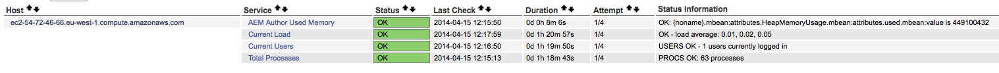

# Dashboard operazioni {#operations-dashboard}

## Introduzione {#introduction}

Il Pannello operazioni nel AEM 6 aiuta gli operatori di sistema a monitorare AEM stato del sistema. Fornisce inoltre informazioni diagnostiche generate automaticamente su aspetti rilevanti della AEM e consente di configurare ed eseguire l&#39;automazione di manutenzione indipendente per ridurre notevolmente le operazioni di progetto e i casi di supporto. Il Pannello operazioni può essere esteso con controlli dello stato e attività di manutenzione personalizzati. Inoltre, è possibile accedere ai dati del dashboard operativo da strumenti di monitoraggio esterni tramite JMX.

**Pannello delle operazioni:**

* È uno stato di sistema con un solo clic per aiutare i reparti operativi a ottenere efficienza?
* Fornisce una panoramica dello stato di salute del sistema in un&#39;unica posizione centralizzata
* Riduzione del tempo necessario per individuare, analizzare e risolvere i problemi
* Offre automazione di manutenzione indipendente che consente di ridurre notevolmente i costi operativi dei progetti

È possibile accedervi da **Strumenti** - **Operazioni** nella schermata di benvenuto AEM.

>[!NOTE]
>
>Per poter accedere al Pannello operazioni, l&#39;utente connesso deve far parte del gruppo di utenti &quot;Operatori&quot;. Per ulteriori informazioni, consulta la documentazione su [Utente, Gruppo e Amministrazione](/help/sites-administering/user-group-ac-admin.md)dei diritti di accesso.

## Rapporti stato {#health-reports}

Il sistema Health Report fornisce informazioni sullo stato di un&#39;istanza AEM tramite Sling Health Checks. Questa operazione può essere eseguita tramite OSGI, JMX, richieste HTTP (tramite JSON) o tramite l&#39;interfaccia utente touch. Offre misurazioni e soglie di alcuni contatori configurabili e, in alcuni casi, fornirà informazioni su come risolvere il problema.

Presenta diverse funzioni, descritte di seguito.

## Verifiche stato {#health-checks}

Le relazioni **sulla** salute sono un sistema di carte che indicano una buona o cattiva salute per una specifica area di prodotto. Queste schede sono visualizzazioni dei Sling Health Checks, che aggregano i dati da JMX e da altre fonti ed espongono di nuovo le informazioni elaborate come MBeans. Questi MBeans possono essere ispezionati anche nella console [Web](/help/sites-administering/jmx-console.md)JMX, nel dominio **org.apache.sling.HealthCheck** .

Per accedere all’interfaccia dei rapporti sull’integrità, utilizzate il menu **Strumenti** - **Operazioni** - Rapporti sull’ **** integrità nella schermata di benvenuto AEM oppure direttamente tramite il seguente URL:

`https://<serveraddress>:port/libs/granite/operations/content/healthreports/healthreportlist.html`


Il sistema di schede espone tre possibili stati: **OK**, **ATTENZIONE** e **CRITICA**. Gli stati sono il risultato di regole e soglie, che possono essere configurate posizionando il mouse sulla scheda e facendo clic sull&#39;icona a forma di ingranaggio nella barra delle azioni:


### Tipi di controllo integrità {#health-check-types}

Esistono due tipi di controlli sanitari nella AEM 6:

1. Controlli di integrità individuali
1. Controlli di integrità compositi

Un **singolo controllo** dello stato è un singolo controllo dello stato che corrisponde a una carta di stato. I controlli di integrità individuali possono essere configurati con regole o soglie e possono fornire uno o più suggerimenti e collegamenti per risolvere problemi di salute identificati. Prendiamo ad esempio il controllo &quot;Log Errors&quot;: se nei registri delle istanze sono presenti voci di ERRORE, queste verranno trovate nella pagina dei dettagli della verifica dello stato. Nella parte superiore della pagina viene visualizzato un collegamento all’analizzatore &quot;Messaggio registro&quot; nella sezione Strumenti di diagnostica, che consente di analizzare questi errori in modo più dettagliato e riconfigurare i logger.

Un controllo dello stato **composito** è un controllo che aggrega le informazioni provenienti da più controlli individuali.

I controlli dello stato composito sono configurati tramite tag **** filtro. In sostanza, tutti i controlli singoli con lo stesso tag del filtro verranno raggruppati come un controllo dello stato composito. Un controllo dello stato composito avrà uno stato OK solo se tutti i controlli singoli che aggrega hanno anche stati OK.

### Come creare controlli di integrità {#how-to-create-health-checks}

Nel Pannello operazioni è possibile visualizzare il risultato dei controlli di integrità individuali e compositi.

### Creazione di un singolo controllo dello stato {#creating-an-individual-health-check}

La creazione di un singolo controllo dello stato comporta due passaggi: implementazione di un Sling Health Check e aggiunta di una voce per il controllo dello stato nei nodi di configurazione del dashboard.

1. Per creare un Sling Health Check, è necessario creare un componente OSGI che implementa l’interfaccia Sling HealthCheck. Questo componente verrà aggiunto all’interno di un bundle. Le proprietà del componente identificheranno completamente il controllo dello stato. Una volta installato il componente, viene automaticamente creato un MBean JMX per il controllo dello stato. Per ulteriori informazioni, consulta la Documentazione [](https://sling.apache.org/documentation/bundles/sling-health-check-tool.html) Sling Health Check.

   Esempio di un componente Sling Health Check, scritto con le annotazioni dei componenti del servizio OSGI:

   ```java
   @Component(service = HealthCheck.class,
   property = {
       HealthCheck.NAME + "=Example Check",
       HealthCheck.TAGS + "=example",
       HealthCheck.TAGS + "=test",
       HealthCheck.MBEAN_NAME + "=exampleHealthCheckMBean"
   })
    public class ExampleHealthCheck implements HealthCheck {
       @Override
       public Result execute() {
           // health check code
       }
    }
   ```

   >[!NOTE]
   >
   >La `MBEAN_NAME` proprietà definisce il nome del fagiolo che verrà generato per il controllo dello stato.

1. Dopo aver creato un controllo dello stato, è necessario creare un nuovo nodo di configurazione, per renderlo accessibile nell&#39;interfaccia del dashboard delle operazioni. Per questo passo, è necessario conoscere il nome del Mfu JMX del controllo dello stato (la `MBEAN_NAME` proprietà). Per creare una configurazione per il controllo dello stato, aprite CRXDE e aggiungete un nuovo nodo (di tipo **nt:unstructure**) nel percorso seguente: `/apps/settings/granite/operations/hc`

   Le seguenti proprietà devono essere impostate sul nuovo nodo:

   * **Nome:** `sling:resourceType`

      * **Tipo:** `String`
      * **Valore:** `granite/operations/components/mbean`
   * **Nome:** `resource`

      * **Tipo:** `String`
      * **Valore:** `/system/sling/monitoring/mbeans/org/apache/sling/healthcheck/HealthCheck/exampleHealthCheck`

   >[!NOTE]
   >
   >Il percorso della risorsa precedente viene creato come segue: se il nome del fagiolo del controllo dello stato è &quot;test&quot;, aggiungere &quot;test&quot; alla fine del percorso `/system/sling/monitoring/mbeans/org/apache/sling/healthcheck/HealthCheck`
   >
   >Quindi il percorso finale sarà:
   >
   >`/system/sling/monitoring/mbeans/org/apache/sling/healthcheck/HealthCheck/test`

   >[!NOTE]
   >
   >Verificate che le proprietà del `/apps/settings/granite/operations/hc` percorso siano impostate su true:
   >
   >
   >`sling:configCollectionInherit`
   >
   >`sling:configPropertyInherit`
   >
   >
   >Questo indicherà al gestore di configurazione di unire le nuove configurazioni con quelle esistenti da `/libs`.

### Creazione di un controllo dello stato composito {#creating-a-composite-health-check}

Il ruolo di Composite Health Check consiste nell&#39;aggregare una serie di controlli di integrità individuali che condividono una serie di funzioni comuni. Ad esempio, il Security Composite Health Check raggruppa tutti i singoli controlli dello stato di salute che eseguono verifiche relative alla sicurezza. Il primo passo per creare un controllo composito è aggiungere una nuova configurazione OSGI. Affinché possa essere visualizzato nel dashboard delle operazioni, è necessario aggiungere un nuovo nodo di configurazione, come abbiamo fatto per un semplice controllo.

1. Andate a Web Configuration Manager nella console OSGI. A tal fine, potete accedere a `https://serveraddress:port/system/console/configMgr`
1. Cercate la voce denominata **Apache Sling Composite Health Check**. Dopo averlo trovato, potete notare che sono già disponibili due configurazioni: uno per i controlli di sistema e uno per i controlli di sicurezza.
1. Per creare una nuova configurazione, premere il pulsante &quot;+&quot; a destra della configurazione. Verrà visualizzata una nuova finestra, come illustrato di seguito:

   

1. Create una configurazione e salvatela. Con la nuova configurazione verrà creato un file Mava.

   Lo scopo di ciascuna proprietà di configurazione è il seguente:

   * **Nome (hc.name):** Nome del controllo dello stato composito. È consigliabile assegnare un nome significativo.
   * **Tag (hc.tags):** Tag per il controllo dello stato. Se questo controllo di integrità composito è destinato a essere parte di un altro controllo di integrità composito (ad esempio in una gerarchia di controlli di integrità), aggiungere i tag a cui è correlato questo composito.
   * **Nome MBean (hc.mava.name):** Il nome del Mava che verrà dato al JMX MBean di questo controllo di stato composito.
   * **Tag filtro (filter.tags):** Si tratta di una proprietà specifica per i controlli di integrità compositi. Questi sono i tag che il composito deve aggregare. La verifica dello stato composito verrà aggregata sotto il suo gruppo tutti i controlli di integrità che presentano tag corrispondenti a qualsiasi tag del filtro di questa composizione. Ad esempio, un controllo dello stato composito con i tag filtro **test** e **check** , aggrega tutti i controlli di integrità individuali e composite che dispongono di uno dei tag **test** e **check** nella proprietà tags ( `hc.tags`).

   >[!NOTE]
   >
   >Per ogni nuova configurazione del controllo dello stato composito Apache Sling viene creata una nuova Mava JMX.**

1. Infine, la voce del controllo dello stato composito appena creato deve essere aggiunta nei nodi di configurazione del dashboard operativo. La procedura è la stessa dei singoli controlli sanitari: è necessario creare un nodo di tipo **nt:unstructure** in `/apps/settings/granite/operations/hc`. La proprietà resource del nodo sarà definita dal valore di **hc.medium.name** nella configurazione OSGI.

   Se, ad esempio, avete creato una configurazione e impostato il valore **hc.mava.name** su **diskusage**, i nodi di configurazione saranno come segue:

   * **Nome:** `Composite Health Check`

      * **Tipo:** `nt:unstructured`

   Con le seguenti proprietà:

   * **Nome:** `sling:resourceType`

      * **Tipo:** `String`
      * **Valore:** `granite/operations/components/mbean`
   * **Nome:** `resource`

      * **Tipo:** `String`
      * **Valore:** `/system/sling/monitoring/mbeans/org/apache/sling/healthcheck/HealthCheck/diskusage`

   >[!NOTE]
   >
   >Se create dei singoli controlli di integrità che logicamente appartengono a un controllo composito già presente nel dashboard per impostazione predefinita, questi verranno catturati automaticamente e raggruppati sotto il rispettivo controllo composito. Di conseguenza, non è necessario creare un nuovo nodo di configurazione per questi controlli.
   >
   >Ad esempio, se create un singolo controllo dello stato di sicurezza, tutto ciò che dovete fare è assegnargli il tag &quot;**sicurezza**&quot;, e viene installato, verrà visualizzato automaticamente sotto il controllo composito Controlli di sicurezza nel Pannello operazioni.

### Controlli di integrità forniti con AEM {#health-checks-provided-with-aem}

<table>
 <tbody>
  <tr>
   <td><strong>zHealthcheck Name</strong></td>
   <td><strong>Descrizione</strong></td>
  </tr>
  <tr>
   <td>Prestazioni delle query</td>
   <td><p>Questo controllo dello stato di salute è stato semplificato <strong>in AEM 6.4</strong>, e ora controlla il <code>Oak QueryStats</code> MBean recentemente modificato, più specificamente l' <code>SlowQueries </code>attributo. Se le statistiche contengono delle query lente, il controllo dello stato restituisce un avviso. In caso contrario, restituisce lo stato OK.<br /> </p> <p>L'MBean per questo controllo dello stato è <a href="http://localhost:4502/system/console/jmx/org.apache.sling.healthcheck%3Aname%3DqueriesStatus%2Ctype%3DHealthCheck">org.apache.sling.HealthCheck:name=queryStatus,type=HealthCheck</a>.</p> </td>
  </tr>
  <tr>
   <td>Lunghezza coda di osservazione</td>
   <td><p>La lunghezza della coda di osservazione viene ripetuta su tutti i listener di eventi e gli osservatori in background, confronta i relativi <code>queueSize </code>elementi con <code>maxQueueSize</code> e:</p>
    <ul>
     <li>restituisce lo stato Critico se il <code>queueSize</code> valore supera il <code>maxQueueSize</code> valore (ovvero quando gli eventi vengono ignorati)</li>
     <li>restituisce Avvisa se il <code>queueSize</code> valore è superiore al valore <code>maxQueueSize * WARN_THRESHOLD</code> (il valore predefinito è 0,75) </li>
    </ul> <p>La lunghezza massima di ogni coda proviene da configurazioni separate (Oak e AEM) e non è configurabile da questo controllo di stato. L'MBean per questo controllo dello stato è <a href="http://localhost:4502/system/console/jmx/org.apache.sling.healthcheck%3Aname%3DObservationQueueLengthHealthCheck%2Ctype%3DHealthCheck">org.apache.sling.HealthCheck:name=ObservationQueueLengthHealthCheck,type=HealthCheck</a>.</p> </td>
  </tr>
  <tr>
   <td>Limiti di attraversamento per query</td>
   <td><p>Limiti di attraversamento query controlla il valore <code>QueryEngineSettings</code> MBean, più specificatamente gli <code>LimitInMemory</code> attributi e <code>LimitReads</code> , e restituisce il seguente stato:</p>
    <ul>
     <li>restituisce lo stato Avvisa se uno dei limiti è uguale o superiore al valore <code>Integer.MAX_VALUE</code></li>
     <li>restituisce lo stato Avvisa se uno dei limiti è inferiore a 10000 (l'impostazione consigliata da Oak)</li>
     <li>restituisce lo stato Critico se non è possibile recuperare il limite <code>QueryEngineSettings</code> o uno dei limiti</li>
    </ul> <p>Il fagiolo per questa verifica dello stato è <a href="http://localhost:4502/system/console/jmx/org.apache.sling.healthcheck%3Aname%3DqueryTraversalLimitsBundle%2Ctype%3DHealthCheck">org.apache.sling.HealthCheck:name=queryTraversalLimitsBundle,type=HealthCheck</a>.</p> </td>
  </tr>
  <tr>
   <td>Orologi sincronizzati</td>
   <td><p>Questo controllo è pertinente solo per i cluster <a href="https://github.com/apache/sling-old-svn-mirror/blob/4df9ab2d6592422889c71fa13afd453a10a5a626/bundles/extensions/discovery/oak/src/main/java/org/apache/sling/discovery/oak/SynchronizedClocksHealthCheck.java">di</a>raccolta note documenti. Restituisce il seguente stato:</p>
    <ul>
     <li>restituisce lo stato Avvisa quando gli orologi dell’istanza non vengono sincronizzati e superano una soglia minima predefinita</li>
     <li>restituisce lo stato Critico quando gli orologi dell’istanza non vengono sincronizzati e superano una soglia elevata predefinita</li>
    </ul> <p>Il fagiolo per questa verifica dello stato è <a href="http://localhost:4502/system/console/jmx/org.apache.sling.healthcheck%3Aname%3DslingDiscoveryOakSynchronizedClocks%2Ctype%3DHealthCheck">org.apache.sling.HealthCheck:name=slingDiscoveryOakSynchronizedClock,type=HealthCheck</a>.</p> </td>
  </tr>
  <tr>
   <td>Indici asincroni</td>
   <td><p>Controllo Indici asincroni:</p>
    <ul>
     <li>restituisce lo stato Critico se almeno una corsia di indicizzazione non riesce</li>
     <li>verifica la presenza <code>lastIndexedTime</code> di tutte le corsie di indicizzazione e:
      <ul>
       <li>restituisce lo stato Critico se è più di 2 ore fa </li>
       <li>restituisce lo stato di avviso se è compreso tra 2 ore e 45 minuti fa </li>
       <li>restituisce OK status se è inferiore a 45 minuti fa </li>
      </ul> </li>
     <li>se nessuna di queste condizioni è soddisfatta, restituisce lo stato OK</li>
    </ul> <p>Sono configurabili sia le soglie di stato Critico che Avvisi. Il tag per questa verifica dello stato è <a href="http://localhost:4502/system/console/jmx/org.apache.sling.healthcheck%3Aname%3DasyncIndexHealthCheck%2Ctype%3DHealthCheck">org.apache.sling.HealthCheck:name=asinccIndexHealthCheck,type=HealthCheck</a>.</p> <p><strong>Nota: </strong>Questo controllo dello stato di salute è disponibile con AEM 6.4 ed è stato riportato a AEM 6.3.0.1.</p> </td>
  </tr>
  <tr>
   <td>Indici Lucene di grandi dimensioni</td>
   <td><p>Questo controllo utilizza i dati esposti da <code>Lucene Index Statistics</code> MBean per identificare indici e rendimenti di grandi dimensioni:</p>
    <ul>
     <li>uno stato di avviso se è presente un indice con più di 1 miliardo di documenti</li>
     <li>uno stato critico se esiste un indice con più di 1,5 miliardi di documenti</li>
    </ul> <p>Le soglie sono configurabili e l'MBean per il controllo dello stato è <a href="http://localhost:4502/system/console/jmx/org.apache.sling.healthcheck%3Aname%3DlargeIndexHealthCheck%2Ctype%3DHealthCheck">org.apache.sling.HealthCheck:name=largeIndexHealthCheck,type=HealthCheck.</a></p> <p><strong>Nota: </strong>Questo controllo è disponibile con AEM 6.4 ed è stato riportato a AEM 6.3.2.0.</p> </td>
  </tr>
  <tr>
   <td>Manutenzione sistema</td>
   <td><p>La manutenzione del sistema è un controllo composito che restituisce il OK se tutte le attività di manutenzione sono in esecuzione come configurate. Tenere presente che:</p>
    <ul>
     <li>ogni attività di manutenzione è accompagnata da un controllo dello stato</li>
     <li>se un'attività non viene aggiunta a una finestra di manutenzione, il relativo controllo dello stato restituirà Critico</li>
     <li>è necessario configurare le attività di manutenzione Registro di controllo e Rimozione flusso di lavoro o rimuoverle dalle finestre di manutenzione. Se non viene configurata, queste attività non riusciranno al primo tentativo di esecuzione, pertanto il controllo di manutenzione del sistema restituirà lo stato Critico.</li>
     <li><strong>Con AEM 6.4</strong>, c'è anche un controllo per l'attività di manutenzione <a href="/help/sites-administering/operations-dashboard.md#automated-maintenance-tasks">dei binari di</a> Lucene</li>
     <li>aem 6.2 e versioni precedenti, il controllo di manutenzione del sistema restituisce uno stato di avviso subito dopo l'avvio, in quanto le attività non vengono mai eseguite. A partire da 6.3, torneranno a essere OK se la prima finestra di manutenzione non è ancora stata raggiunta.</li>
    </ul> <p>L'MBean per questo controllo dello stato è <a href="http://localhost:4502/system/console/jmx/org.apache.sling.healthcheck%3Aname%3Dsystemchecks%2Ctype%3DHealthCheck">org.apache.sling.HealthCheck:name=systemcheck,type=HealthCheck</a>.</p> </td>
  </tr>
  <tr>
   <td>Coda di replica</td>
   <td><p>Questo controllo esegue un'iterazione sugli agenti di replica e controlla le rispettive code. Per l'elemento nella parte superiore della coda, il controllo verifica il numero di tentativi di replica ripetuti dall'agente. Se l'agente ha ripetuto la replica più del valore del <code>numberOfRetriesAllowed</code> parametro, restituisce un avviso. Il <code>numberOfRetriesAllowed</code> parametro è configurabile. </p> <p>L'MBean per questo controllo dello stato è <a href="http://localhost:4502/system/console/jmx/org.apache.sling.healthcheck%3Aname%3DreplicationQueue%2Ctype%3DHealthCheck" target="_blank">org.apache.sling.HealthCheck:name=replicaQueue,type=HealthCheck</a>.</p> </td>
  </tr>
  <tr>
   <td>Processi Sling</td>
   <td>
    <div>
      Sling Jobs controlla il numero di processi in coda in JobManager, li confronta con la <code>maxNumQueueJobs</code> soglia e:
    </div>
    <ul>
     <li>restituisce Critico se non sono presenti <code>maxNumQueueJobs</code> in coda più di</li>
     <li>restituisce Critico se sono presenti processi attivi con esecuzione prolungata superiore a 1 ora</li>
     <li>restituisce Critico se sono presenti processi in coda e l’ultima esecuzione è successiva a 1 ora</li>
    </ul> <p>È possibile configurare solo il numero massimo di processi in coda e il valore predefinito è 1000.</p> <p>L'MBean per questo controllo dello stato è <a href="http://localhost:4502/system/console/jmx/org.apache.sling.healthcheck%3Aname%3DslingJobs%2Ctype%3DHealthCheck" target="_blank">org.apache.sling.HealthCheck:name=slingJobs,type=HealthCheck</a>.</p> </td>
  </tr>
  <tr>
   <td>Prestazioni delle richieste</td>
   <td><p>Questo controllo esamina la metrica <code>granite.request.metrics.timer</code> Sling <a href="http://localhost:4502/system/console/slingmetrics" target="_blank"></a>e:</p>
    <ul>
     <li>restituisce Critico se il valore del 75° percentile supera la soglia critica (il valore predefinito è 500 millisecondi)</li>
     <li>restituisce Avvisa se il valore del 75° percentile supera la soglia di avviso (il valore predefinito è 200 millisecondi)</li>
    </ul> <p>L'MBean per questo controllo dello stato è<em> org.apache.sling.HealthCheck:name=requestsStatus,type=HealthCheck </em><a href="http://localhost:4502/system/console/jmx/org.apache.sling.healthcheck%3Aname%3DrequestsStatus%2Ctype%3DHealthCheck" target="_blank"></a>.</p> </td>
  </tr>
  <tr>
   <td>Errori registro</td>
   <td><p>Questo controllo restituisce lo stato Avvisa in caso di errori nel registro.</p> <p>L'MBean per questo controllo dello stato è <a href="http://localhost:4502/system/console/jmx/org.apache.sling.healthcheck%3Aname%3DlogErrorHealthCheck%2Ctype%3DHealthCheck" target="_blank">org.apache.sling.HealthCheck:name=logErrorHealthCheck,type=HealthCheck</a>.</p> </td>
  </tr>
  <tr>
   <td>Spazio su disco</td>
   <td><p>Il controllo Spazio su disco controlla l' <code>FileStoreStats</code> MBean, recupera la dimensione del Node Store e la quantità di spazio su disco utilizzabile sulla partizione Node Store e:</p>
    <ul>
     <li>restituisce Avvisa se il rapporto tra lo spazio su disco utilizzabile e le dimensioni del repository è inferiore alla soglia di avviso (il valore predefinito è 10)</li>
     <li>restituisce Critico se il rapporto tra lo spazio su disco utilizzabile e le dimensioni dell'archivio è inferiore alla soglia critica (il valore predefinito è 2)</li>
    </ul> <p>Entrambe le soglie sono configurabili. Il controllo funziona solo sulle istanze con un Segment Store.</p> <p>L'MBean per questo controllo dello stato è <a href="http://localhost:4502/system/console/jmx/org.apache.sling.healthcheck%3Aname%3DDiskSpaceHealthCheck%2Ctype%3DHealthCheck" target="_blank">org.apache.sling.HealthCheck:name=DiskSpaceHealthCheck,type=HealthCheck</a>.</p> </td>
  </tr>
  <tr>
   <td>Verifica stato modulo di pianificazione</td>
   <td><p>Questo controllo restituisce un avviso se nell’istanza sono in esecuzione processi Quartz per più di 60 secondi. La soglia di durata accettabile è configurabile.</p> <p>L'MBean per questa verifica dello stato è <a href="http://localhost:4502/system/console/jmx/org.apache.sling.healthcheck%3Aname%3DslingCommonsSchedulerHealthCheck%2Ctype%3DHealthCheck" target="_blank">org.apache.sling.HealthCheck:name=slingCommonsSchedulerHealthCheck,type=HealthCheck</a><em>.</em></p> </td>
  </tr>
  <tr>
   <td>Verifiche di sicurezza</td>
   <td><p>Il controllo di sicurezza è un insieme composto che aggrega i risultati di più controlli di sicurezza. Questi controlli di integrità individuali risolvono problemi diversi dall'elenco di controllo di sicurezza disponibile nella pagina della documentazione <a href="/help/sites-administering/security-checklist.md">Security Checklist.</a> Il controllo è utile come test di fumo di sicurezza all'avvio dell'istanza. </p> <p>L'MBean per questo controllo dello stato è <a href="http://localhost:4502/system/console/jmx/org.apache.sling.healthcheck%3Aname%3Dsecuritychecks%2Ctype%3DHealthCheck" target="_blank">org.apache.sling.HealthCheck:name=securityChecks,type=HealthCheck</a></p> </td>
  </tr>
  <tr>
   <td>Bundle attivi</td>
   <td><p>Bundle attivi controlla lo stato di tutti i bundle e:</p>
    <ul>
     <li>restituisce lo stato Avvisa se uno dei bundle non è attivo o (a partire, con attivazione pigra)</li>
     <li>ignora lo stato dei bundle nell'elenco di esclusione</li>
    </ul> <p>Il parametro ignore list è configurabile.</p> <p>L'MBean per questo controllo dello stato è <a href="http://localhost:4502/system/console/jmx/org.apache.sling.healthcheck%3Aname%3DinactiveBundles%2Ctype%3DHealthCheck" target="_blank">org.apache.sling.HealthCheck:name=inactiveBundles,type=HealthCheck</a>.</p> </td>
  </tr>
  <tr>
   <td>Controllo cache codice</td>
   <td><p>Si tratta di un controllo dello stato che verifica diverse condizioni JVM che possono attivare un bug CodeCache presente in Java 7:</p>
    <ul>
     <li>restituisce Avvisa se l'istanza è in esecuzione su Java 7, con lo scaricamento della cache del codice abilitato</li>
     <li>restituisce Avvisa se l'istanza è in esecuzione su Java 7 e la dimensione della cache del codice riservato è inferiore a una soglia minima (il valore predefinito è 90 MB)</li>
    </ul> <p>La <code>minimum.code.cache.size</code> soglia è configurabile. Per ulteriori informazioni sul bug, <a href="https://bugs.java.com/bugdatabase/view_bug.do?bug_id=8012547">consultate</a><a href="https://bugs.java.com/bugdatabase/view_bug.do?bug_id=8012547"></a><a href="https://bugs.java.com/bugdatabase/view_bug.do?bug_id=8012547"></a><a href="https://bugs.java.com/bugdatabase/view_bug.do?bug_id=8012547"> questa pagina</a>.</p> <p>L'MBean per questa verifica dello stato è <a href="http://localhost:4502/system/console/jmx/org.apache.sling.healthcheck%3Aname%3DcodeCacheHealthCheck%2Ctype%3DHealthCheck" target="_blank">org.apache.sling.HealthCheck:name=codeCacheHealthCheck,type=HealthCheck</a>.</p> </td>
  </tr>
  <tr>
   <td>Errori nel percorso di ricerca delle risorse</td>
   <td><p>Controlla se nel percorso sono presenti risorse <code>/apps/foundation/components/primary</code> e:</p>
    <ul>
     <li>restituisce Avvisa se sono presenti nodi figlio in <code>/apps/foundation/components/primary</code></li>
    </ul> <p>L'MBean per questo controllo dello stato è <a href="http://localhost:4502/system/console/jmx/org.apache.sling.healthcheck%3Aname%3DresourceSearchPathErrorHealthCheck%2Ctype%3DHealthCheck" target="_blank">org.apache.sling.HealthCheck:name=resourceSearchPathErrorHealthCheck,type=HealthCheck</a>.</p> </td>
  </tr>
 </tbody>
</table>

## Monitoraggio con Nagios {#monitoring-with-nagios}

Il Pannello di controllo dello stato può integrarsi con Nagios tramite i fagioli JMX Granite. L&#39;esempio seguente illustra come aggiungere un controllo che mostra la memoria utilizzata sul server in cui è in esecuzione AEM.

1. Installazione e installazione di Nagios sul server di monitoraggio.
1. Quindi, installare il plugin remoto Nagios (NRPE).

   >[!NOTE]
   >
   >Per maggiori informazioni su come installare Nagios e NRPE sul tuo sistema, consulta la Documentazione [di](https://library.nagios.com/library/products/nagioscore/manuals/)Nagios.

1. Aggiungete una definizione host per il server AEM. Questo può essere fatto tramite l&#39;interfaccia Web di Nagios XI, utilizzando Configuration Manager:

   1. Aprite un browser e puntate al server Nagios.
   1. Premere il pulsante **Configura** nel menu principale.
   1. Nel riquadro a sinistra, premere **Core Config Manager** in **Advanced Configuration**.
   1. Premere il collegamento **Ospitanti** nella sezione **Monitoraggio** .
   1. Aggiungete la definizione host:

   

   Di seguito è riportato un esempio di un file di configurazione dell&#39;host, nel caso in cui si utilizzi Nagios Core:

   ```xml
   define host {
      address 192.168.0.5
      max_check_attempts 3
      check_period 24x7
      check-command check-host-alive
      contacts admin
      notification_interval 60
      notification_period 24x7
   }
   ```

1. Installate Nagios e NRPE sul server AEM.
1. Installate il plug-in [check_http_json](https://github.com/phrawzty/check_http_json) su entrambi i server.
1. Definire un comando di controllo JSON generico su entrambi i server:

   ```xml
   define command{
   
       command_name    check_http_json-int
   
       command_line    /usr/lib/nagios/plugins/check_http_json --user "$ARG1$" --pass "$ARG2$" -u 'https://$HOSTNAME$:$ARG3$/$ARG4$' -e '$ARG5$' -w '$ARG6$' -c '$ARG7$'
   
   }
   ```

1. Aggiungete un servizio per la memoria utilizzata sul server AEM:

   ```xml
   define service {
   
       use generic-service
   
       host_name my.remote.host
   
       service_description AEM Author Used Memory
   
       check_command  check_http_json-int!<cq-user>!<cq-password>!<cq-port>!system/sling/monitoring/mbeans/java/lang/Memory.infinity.json!{noname}.mbean:attributes.HeapMemoryUsage.mbean:attributes.used.mbean:value!<warn-threshold-in-bytes>!<critical-threshold-in-bytes>
   
       }
   ```

1. Controlla il dashboard di Nagios per il servizio appena creato:

   

## Diagnosis tools {#diagnosis-tools}

Il Pannello di controllo dell&#39;operazione fornisce inoltre l&#39;accesso a Strumenti di diagnostica che possono aiutare a trovare e risolvere le cause principali degli avvisi provenienti dal Pannello di controllo dello stato, nonché fornire importanti informazioni di debug per gli operatori di sistema.

Tra le sue caratteristiche più importanti:

* Un analizzatore di messaggi di registro
* La possibilità di accedere ai cespugli di heap e thread
* Richieste e analisi delle prestazioni delle query

Per accedere alla schermata Strumenti di diagnostica, andate a **Strumenti - Operazioni - Diagnosi** dalla schermata di benvenuto AEM. Potete inoltre accedere alla schermata accedendo direttamente al seguente URL: `https://serveraddress:port/libs/granite/operations/content/diagnosis.html`


### Messaggi del registro {#log-messages}

I messaggi di registro Interfaccia utente visualizzeranno tutti i messaggi di errore per impostazione predefinita. Se desiderate visualizzare più messaggi di registro, dovete configurare un logger con il livello di registro appropriato.

I messaggi di registro utilizzano un appender del registro di memoria e pertanto non sono correlati ai file di registro. Un&#39;altra conseguenza è che la modifica dei livelli di registro in questa interfaccia utente non modifica le informazioni che vengono registrate nei file di registro tradizionali. L’aggiunta e la rimozione di logger in questa interfaccia utente influirà solo sul logger di memoria. Inoltre, si noti che la modifica delle configurazioni del logger si rifletterà nel futuro del in Memory logger - le voci già registrate e non rilevanti non sono più cancellate, ma voci simili non saranno registrate in futuro.

Potete configurare gli elementi registrati fornendo configurazioni del logger dal pulsante in alto a sinistra dell’ingranaggio nell’interfaccia utente. Qui potete aggiungere, rimuovere o aggiornare le configurazioni del logger. Una configurazione del logger è composta da un livello **di** registro (WARN / INFO / DEBUG) e da un nome **di** filtro. Il nome **del** filtro ha il ruolo di filtrare l&#39;origine dei messaggi di registro che vengono registrati. In alternativa, se un logger deve acquisire tutti i messaggi di registro per il livello specificato, il nome del filtro deve essere &quot;**root**&quot;. Impostando il livello di un logger si attiva l’acquisizione di tutti i messaggi con un livello pari o superiore a quello specificato.

Esempi:

* Se si prevede di acquisire tutti i messaggi **ERRORE** - non è richiesta alcuna configurazione. Tutti i messaggi di errore vengono acquisiti per impostazione predefinita.
* Se prevedete di catturare tutti i messaggi **ERROR**, **WARN** e **INFO** - il nome del logger dovrebbe essere impostato su: &quot;**root**&quot; e il livello logger a: **INFORMAZIONI**.

* Se intendete acquisire tutti i messaggi provenienti da un determinato pacchetto (ad esempio com.adobe.granite), il nome del logger deve essere impostato su: &quot;com.adobe.granite&quot; e il livello di registrazione è: **DEBUG** (questo acquisirà tutti i messaggi **ERROR**, **WARN**, **INFO** e **DEBUG** ), come mostrato nell&#39;immagine seguente.


>[!NOTE]
>
>Non potete impostare un nome di logger per acquisire solo i messaggi di errore tramite un filtro specificato. Per impostazione predefinita, tutti i messaggi di errore vengono acquisiti.

>[!NOTE]
>
>L&#39;interfaccia utente dei messaggi di registro non riflette il registro errori effettivo. A meno che non si configurino altri tipi di messaggi di registro nell&#39;interfaccia utente, verranno visualizzati solo messaggi di errore. Per informazioni sulla visualizzazione di messaggi di registro specifici, vedere le istruzioni riportate sopra.

>[!NOTE]
>
>Le impostazioni nella pagina di diagnosi non influiscono sui contenuti registrati nei file di registro e viceversa. Pertanto, anche se il registro errori potrebbe intercettare i messaggi INFO, potrebbe non essere visualizzato nell&#39;interfaccia utente dei messaggi di registro. Inoltre, tramite l&#39;interfaccia utente è possibile intercettare i messaggi DEBUG da alcuni pacchetti senza che questo influisca sul registro degli errori. Per ulteriori informazioni sulla configurazione dei file di registro, vedere [Registrazione](/help/sites-deploying/configure-logging.md).

>[!NOTE]
>
>**Con AEM 6.4**, le attività di manutenzione vengono disconnesse in un formato più ricco di informazioni a livello di INFO. Ciò consente una migliore visibilità dello stato delle attività di manutenzione.
>
>Se si utilizzano strumenti di terze parti (come Splunk) per monitorare e reagire alle attività di manutenzione, è possibile utilizzare le seguenti istruzioni di registro:

```
Log level: INFO
DATE+TIME [MaintanceLogger] Name=<MT_NAME>, Status=<MT_STATUS>, Time=<MT_TIME>, Error=<MT_ERROR>, Details=<MT_DETAILS>
```

### Request performance {#request-performance}

La pagina Prestazioni richieste consente di analizzare le richieste di pagina più lente elaborate. Solo le richieste di contenuto verranno registrate in questa pagina. In particolare, verranno acquisite le seguenti richieste:

1. Richieste di accesso alle risorse in `/content`
1. Richieste di accesso alle risorse in `/etc/design`
1. Richieste con `".html"` estensione


Viene visualizzata la pagina:

* Data in cui è stata presentata la richiesta
* L’URL e il metodo di richiesta
* Durata in millisecondi

Per impostazione predefinita, vengono acquisite le 20 richieste di pagina più lente, ma il limite può essere modificato in Gestione configurazione.

### Prestazioni delle query {#query-performance}

La pagina Prestazioni query consente di analizzare le query più lente eseguite dal sistema. Queste informazioni vengono fornite dall&#39;archivio in un Mfavo JMX. In Jackrabbit, il `com.adobe.granite.QueryStat` JMX Mava fornisce queste informazioni, mentre nel repository Oak, è offerto da `org.apache.jackrabbit.oak.QueryStats.`

Viene visualizzata la pagina:

* Ora in cui è stata eseguita la query
* Lingua della query
* Numero di volte in cui è stata emessa la query
* Istruzione della query
* Durata in millisecondi


### Spiega query {#explain-query}

Per ogni query, Oak tenta di individuare il modo migliore per eseguire in base agli indici Oak definiti nel repository sotto il nodo **oak:index** . A seconda della query, i diversi indici possono essere scelti da Oak. La comprensione dell’esecuzione di una query da parte di Oak è il primo passo per ottimizzare la query.

La query di spiegazione è uno strumento che spiega in che modo Oak sta eseguendo una query. È possibile accedervi da **Strumenti - Operazioni - Diagnosi** dalla schermata di benvenuto AEM, quindi facendo clic su Prestazioni **** query e passando alla scheda **Query** di spiegazione.

**Funzioni**

* Supporta i linguaggi di query Xpath, JCR-SQL e JCR-SQL2
* Segnala il tempo di esecuzione effettivo della query fornita
* Rileva query lente e avverte sulle query potenzialmente lente
* Segnala l&#39;indice Oak utilizzato per eseguire la query
* Visualizza la spiegazione effettiva del motore Query Oak
* Fornisce l&#39;elenco di clic per caricare delle query lente e popolari

Una volta che vi trovate nell&#39;interfaccia utente di Query Spiega, tutto ciò che dovete fare per utilizzarla è immettere la query e premere il pulsante **Spiega** :


La prima voce nella sezione Spiegazione query rappresenta la spiegazione effettiva. Nella spiegazione verrà visualizzato il tipo di indice utilizzato per eseguire la query.

La seconda voce è il piano di esecuzione.

Se si fa clic sulla casella **Includi tempo** di esecuzione prima di eseguire la query, viene visualizzato anche il tempo di esecuzione della query, consentendo l&#39;utilizzo di ulteriori informazioni per ottimizzare gli indici per l&#39;applicazione o la distribuzione.


### Gestione indice {#the-index-manager}

Lo scopo di Gestione indici è facilitare la gestione degli indici, ad esempio la manutenzione degli indici o la visualizzazione del relativo stato.

È possibile accedervi andando a **Strumenti - Operazioni - Diagnosi **dalla schermata di benvenuto, quindi facendo clic sul pulsante Gestione **** indice.

È inoltre possibile accedervi direttamente al seguente URL: `https://serveraddress:port/libs/granite/operations/content/diagnosistools/indexManager.html`


L’interfaccia utente può essere utilizzata per filtrare gli indici nella tabella digitando i criteri di filtro nella casella di ricerca nell’angolo superiore sinistro dello schermo.

### Scarica ZIP stato {#download-status-zip}

Questo attiverà il download di un file ZIP contenente informazioni utili sullo stato e la configurazione del sistema. L&#39;archivio contiene configurazioni di istanza, un elenco di bundle, OSGI, metriche Sling e statistiche e questo può causare un file di grandi dimensioni. Per ridurre l’impatto di file di stato di grandi dimensioni, utilizzate la **finestra ZIP Stato** download. È possibile accedere alla finestra da:**AEM > Strumenti > Operazioni > Diagnosi > Download ZIP dello stato.**

Da questa finestra è possibile selezionare gli elementi da esportare (file di registro e file di thread) e il numero di giorni di log inclusi nel download rispetto alla data corrente.


### Scarica immagine thread {#download-thread-dump}

Questo attiverà il download di un file ZIP contenente informazioni sui thread presenti nel sistema. Vengono fornite informazioni su ciascun thread, ad esempio lo stato, il caricatore e la traccia di stack.

### Scarica immagine heap {#download-heap-dump}

È inoltre possibile scaricare un’istantanea dell’heap per analizzarla in un secondo momento. Tenete presente che questo attiverà il download di un file di grandi dimensioni, nell&#39;ordine di centinaia di megabyte.

## Attività di manutenzione automatizzata {#automated-maintenance-tasks}

La pagina Attività di manutenzione automatizzata è un luogo in cui è possibile visualizzare e tenere traccia delle attività di manutenzione consigliate pianificate per l&#39;esecuzione periodica. I compiti sono integrati con il sistema di controllo dello stato. Le attività possono essere eseguite manualmente dall&#39;interfaccia.

Per accedere alla pagina Manutenzione del Pannello operazioni, è necessario accedere a **Strumenti - Operazioni - Dashboard - Manutenzione** dalla schermata di benvenuto AEM oppure seguire direttamente questo collegamento:

`https://serveraddress:port/libs/granite/operations/content/maintenance.html`

Le seguenti attività sono disponibili nel Pannello operazioni:

1. La **revisione Pulisci** attività, che si trova nel menu Finestra **Manutenzione** giornaliera.
1. L&#39;attività Pulizia **binarie** Lucene, che si trova nel menu Finestra **Manutenzione** giornaliera.
1. L’attività di eliminazione **del** flusso di lavoro, che si trova nel menu della finestra **Manutenzione** settimanale.
1. Attività **Data Store Garbage Collection** , disponibile nel menu Finestra **Manutenzione** settimanale.
1. Attività di manutenzione **del registro di** controllo, disponibile nel menu della finestra **Manutenzione** settimanale.
1. L&#39;attività di manutenzione **** della rimozione della versione, che si trova nel menu della finestra **Manutenzione** settimanale.

Il tempo predefinito per la finestra di manutenzione giornaliera è compreso tra 2 e 5 AM. Le attività configurate per l&#39;esecuzione nella finestra di manutenzione settimanale verranno eseguite tra 1 e 2 di sabato.

È inoltre possibile configurare le sincronizzazioni premendo l&#39;icona a forma di ingranaggio su una delle due schede di manutenzione:


>[!NOTE]
>
>A partire dal AEM 6.1, le finestre di manutenzione esistenti possono essere configurate per essere eseguite mensilmente.

### Pulizia revisioni {#revision-clean-up}

Per ulteriori informazioni sull&#39;esecuzione della pulizia della revisione, [consultate questo articolo](/help/sites-deploying/revision-cleanup.md)dedicato.

### Pulizia binary di Lucene {#lucene-binaries-cleanup}

Utilizzando l&#39;attività Pulizia binarie Lucene è possibile eliminare i file binari di lucene e ridurre il requisito di dimensioni dell&#39;archivio dati in esecuzione. Questo perché il churn binario di lucene verrà recuperato ogni giorno invece della dipendenza precedente da un&#39;esecuzione di raccolta [di](/help/sites-administering/data-store-garbage-collection.md) dati dell&#39;archivio di dati di successo.

Sebbene l&#39;attività di manutenzione sia stata sviluppata per ridurre i rifiuti di revisione relativi a Lucene, durante l&#39;esecuzione dell&#39;attività si ottengono miglioramenti generali in termini di efficienza:

* L&#39;esecuzione settimanale dell&#39;attività di raccolta rifiuti dell&#39;archivio dati verrà completata più rapidamente
* Può anche migliorare leggermente le prestazioni complessive AEM

È possibile accedere all&#39;attività Pulizia binarie Lucene da: **AEM > Strumenti > Operazioni > Manutenzione > Finestra Manutenzione giornaliera > Pulizia** binario Lucene.

### Archivio dati raccolta oggetti inattivi {#data-store-garbage-collection}

Per informazioni dettagliate sulla raccolta dei rifiuti nell&#39;archivio dati, consultate la pagina [dedicata alla](/help/sites-administering/data-store-garbage-collection.md)documentazione.

### Workflow purge {#workflow-purge}

I flussi di lavoro possono essere eliminati anche dal dashboard di manutenzione. Per eseguire l&#39;attività Rimozione flusso di lavoro, è necessario:

1. Fare clic sulla pagina Finestra **Manutenzione** settimanale.
1. Nella pagina seguente, fate clic sul pulsante **Riproduci** nella scheda di eliminazione **del** flusso di lavoro.

>[!NOTE]
>
>Per ulteriori informazioni sulla manutenzione dei flussi di lavoro, consulta [questa pagina](/help/sites-administering/workflows-administering.md#regular-purging-of-workflow-instances).

### Gestione log di controllo {#audit-log-maintenance}

Per la manutenzione del registro di controllo, consultate la pagina della documentazione [separata.](/help/sites-administering/operations-audit-log.md)

### Pulizia delle versioni {#version-purge}

È possibile pianificare l&#39;attività di manutenzione di Rimozione versioni per eliminare automaticamente le versioni precedenti. Questo riduce al minimo la necessità di utilizzare manualmente gli strumenti [](/help/sites-deploying/version-purging.md)Version Purge. Per pianificare e configurare l&#39;attività Rimozione versioni, accedi a **Strumenti > Operazioni > Manutenzione > Finestra** Manutenzione settimanale e segui la procedura seguente:

1. Click the **Add** button.
1. Scegliete **Versione Rimuovi** dal menu a discesa.

   

1. Per configurare l&#39;attività Rimozione versione, fate clic sull&#39;icona **ingranaggi** sulla scheda di manutenzione della rimozione versione appena creata.

   

**Con AEM 6.4**, potete interrompere l&#39;attività di manutenzione di Version Purge come segue:

* Automaticamente - Se la finestra di manutenzione programmata viene chiusa prima del completamento dell&#39;attività, quest&#39;ultima si interrompe automaticamente. Viene ripresa all’apertura della finestra di manutenzione successiva.
* Manualmente - Per interrompere manualmente l&#39;attività, nella scheda di manutenzione Rimozione versione fare clic sull&#39;icona **Interrompi** . Nella successiva esecuzione, l&#39;attività riprenderà in modo sicuro.

>[!NOTE]
>
>Per interrompere l’attività di manutenzione si intende sospendere l’esecuzione senza perdere traccia del processo già in corso.

>[!CAUTION]
>
>Per ottimizzare le dimensioni del repository è necessario eseguire frequentemente l&#39;attività di eliminazione delle versioni. L&#39;attività deve essere programmata al di fuori degli orari di lavoro quando il traffico è limitato.

## Attività di manutenzione personalizzate {#custom-maintenance-tasks}

Le attività di manutenzione personalizzate possono essere implementate come servizi OSGi. Poiché l&#39;infrastruttura delle attività di manutenzione è basata sulla gestione dei lavori di Apache Sling, un&#39;attività di manutenzione deve implementare l&#39;interfaccia Java ` [org.apache.sling.event.jobs.consumer.JobExecutor](https://sling.apache.org/apidocs/sling7/org/apache/sling/event/jobs/consumer/JobExecutor.html)`. Inoltre, deve dichiarare diverse proprietà di registrazione del servizio da rilevare come attività di manutenzione, come indicato di seguito:

<table>
 <tbody>
  <tr>
   <td><strong>Nome proprietà servizio</strong><br /> </td>
   <td><strong>Descrizione</strong></td>
   <td><strong>Esempio</strong><br /> </td>
   <td><strong>Tipo</strong></td>
  </tr>
  <tr>
   <td>granite.maintenance.isStoppable</td>
   <td>Attributo booleano che definisce se l'attività può essere interrotta dall'utente. Se un'attività dichiara di essere arrestata, deve verificare durante l'esecuzione se è stata arrestata e agire di conseguenza. Il valore predefinito è false.</td>
   <td>vero</td>
   <td>Facoltativo</td>
  </tr>
  <tr>
   <td>granite.maintenance.mandatory</td>
   <td>Attributo booleano che definisce se un'attività è obbligatoria e deve essere eseguita periodicamente. Se un'attività è obbligatoria ma al momento non è in alcuna finestra di pianificazione attiva, un controllo dello stato segnalerà questo errore. Il valore predefinito è false.</td>
   <td>vero</td>
   <td>Facoltativo</td>
  </tr>
  <tr>
   <td>granite.maintenance.name</td>
   <td>Un nome univoco per l'attività, utilizzato per fare riferimento all'attività. Questo solitamente è un nome semplice.</td>
   <td>MyMaintenanceTask</td>
   <td>Obbligatorio</td>
  </tr>
  <tr>
   <td>granite.maintenance.title</td>
   <td>Titolo visualizzato per l'attività</td>
   <td>Attività di manutenzione speciale</td>
   <td>Obbligatorio</td>
  </tr>
  <tr>
   <td>job.topics</td>
   <td>Si tratta di un argomento unico nell’attività di manutenzione.<br /> La gestione dei processi Apache Sling avvierà un processo con esattamente questo argomento per eseguire l'attività di manutenzione e, quando l'attività viene registrata per questo argomento, viene eseguita.<br /> L'argomento deve iniziare con <i>com/adobe/granite/Maintenance/Job/</i></td>
   <td>com/adobe/granite/Maintenance/job/MyMaintenanceTask</td>
   <td>Obbligatorio</td>
  </tr>
 </tbody>
</table>

Oltre alle proprietà del servizio sopra riportate, il `process()` metodo dell&#39; `JobConsumer` interfaccia deve essere implementato aggiungendo il codice da eseguire per l&#39;attività di manutenzione. I dati forniti `JobExecutionContext` possono essere utilizzati per inviare informazioni sullo stato, verificare se il processo viene interrotto dall’utente e creare un risultato (esito positivo o negativo).

Per le situazioni in cui un’attività di manutenzione non deve essere eseguita su tutte le installazioni (ad esempio, eseguita solo sull’istanza pubblica), potete fare in modo che il servizio richieda una configurazione per essere attivo aggiungendo `@Component(policy=ConfigurationPolicy.REQUIRE)`. È quindi possibile contrassegnare la configurazione in base alla modalità di esecuzione a seconda della directory archivio. Per ulteriori informazioni, consultate [Configurazione di OSGi](/help/sites-deploying/configuring-osgi.md#creating-the-configuration-in-the-repository).

Di seguito è riportato un esempio di un&#39;attività di manutenzione personalizzata che elimina i file da una directory temporanea configurabile modificata nelle ultime 24 ore:

src/main/java/com/adobe/granite/samples/maintenance/impl/DeleteTempFilesTask.java

<table>
 <tbody>
  <tr>
   <td><p> </p> <p><code>/*</code></p> <p><code> * #%L</code></p> <p><code> * sample-maintenance-task</code></p> <p><code> * %%</code></p> <p><code> * Copyright (C) 2014 Adobe</code></p> <p><code> * %%</code></p> <p><code> * Licensed under the Apache License, Version 2.0 (the "License");</code></p> <p><code> * you may not use this file except in compliance with the License.</code></p> <p><code> * You may obtain a copy of the License at</code></p> <p><code> * </code></p> <p><code> * <a href="https://www.apache.org/licenses/LICENSE-2.0">https://www.apache.org/licenses/LICENSE-2.0</a></code></p> <p><code> * </code></p> <p><code> * Unless required by applicable law or agreed to in writing, software</code></p> <p><code> * distributed under the License is distributed on an "AS IS" BASIS,</code></p> <p><code> * WITHOUT WARRANTIES OR CONDITIONS OF ANY KIND, either express or implied.</code></p> <p><code> * See the License for the specific language governing permissions and</code></p> <p><code> * limitations under the License.</code></p> <p><code> * #L%</code></p> <p><code> */</code></p> <p><code> </code></p> <p><code>package com.adobe.granite.samples.maintenance.impl;</code></p> <p><code> </code></p> <p><code>import java.io.File;</code></p> <p><code>import java.util.Calendar;</code></p> <p><code>import java.util.Collection;</code></p> <p><code>import java.util.Map;</code></p> <p><code> </code></p> <p><code>import org.apache.commons.io.FileUtils;</code></p> <p><code>import org.apache.commons.io.filefilter.IOFileFilter;</code></p> <p><code>import org.apache.commons.io.filefilter.TrueFileFilter;</code></p> <p><code>import org.apache.felix.scr.annotations.Activate;</code></p> <p><code>import org.apache.felix.scr.annotations.Component;</code></p> <p><code>import org.apache.felix.scr.annotations.Properties;</code></p> <p><code>import org.apache.felix.scr.annotations.Property;</code></p> <p><code>import org.apache.felix.scr.annotations.Service;</code></p> <p><code>import org.apache.sling.commons.osgi.PropertiesUtil;</code></p> <p><code>import org.apache.sling.event.jobs.Job;</code></p> <p><code>import org.apache.sling.event.jobs.consumer.JobConsumer;</code></p> <p><code>import org.apache.sling.event.jobs.consumer.JobExecutionContext;</code></p> <p><code>import org.apache.sling.event.jobs.consumer.JobExecutionResult;</code></p> <p><code>import org.apache.sling.event.jobs.consumer.JobExecutor;</code></p> <p><code>import org.slf4j.Logger;</code></p> <p><code>import org.slf4j.LoggerFactory;</code></p> <p><code> </code></p> <p><code>import com.adobe.granite.maintenance.MaintenanceConstants;</code></p> <p><code> </code></p> <p><code>@Component(metatype = true,</code></p> <p><code> label = "Delete Temp Files Maintenance Task",</code></p> <p><code> description = "Maintatence Task which deletes files from a configurable temporary directory which have been modified in the last 24 hours.")</code></p> <p><code>@Service</code></p> <p><code>@Properties({</code></p> <p><code> @Property(name = MaintenanceConstants.PROPERTY_TASK_NAME, value = "DeleteTempFilesTask", propertyPrivate = true),</code></p> <p><code> @Property(name = MaintenanceConstants.PROPERTY_TASK_TITLE, value = "Delete Temp Files", propertyPrivate = true),</code></p> <p><code> @Property(name = JobConsumer.PROPERTY_TOPICS, value = MaintenanceConstants.TASK_TOPIC_PREFIX</code></p> <p><code> + "DeleteTempFilesTask", propertyPrivate = true) })</code></p> <p><code>public class DeleteTempFilesTask implements JobExecutor {</code></p> <p><code> </code></p> <p><code> private static final Logger log = LoggerFactory.getLogger(DeleteTempFilesTask.class);</code></p> <p><code> </code></p> <p><code> @Property(label = "Temporary Directory", description="Temporary Directory. Defaults to the java.io.tmpdir system property.")</code></p> <p><code> private static final String PROP_TEMP_DIR = "temp.dir";</code></p> <p><code> </code></p> <p><code> private File tempDir;</code></p> <p><code> </code></p> <p><code> @Activate</code></p> <p><code> private void activate(Map&lt;string, object=""&gt; properties) {</code></p> <p><code> this.tempDir = new File(PropertiesUtil.toString(properties.get(PROP_TEMP_DIR),</code></p> <p><code> System.getProperty("java.io.tmpdir")));</code></p> <p><code> }</code></p> <p><code> </code></p> <p><code> @Override</code></p> <p><code> public JobExecutionResult process(Job job, JobExecutionContext context) {</code></p> <p><code> log.info("Deleting old temp files from {}.", tempDir.getAbsolutePath());</code></p> <p><code> Collection&lt;file&gt; files = FileUtils.listFiles(tempDir, new LastModifiedBeforeYesterdayFilter(),</code></p> <p><code> TrueFileFilter.INSTANCE);</code></p> <p><code> int counter = 0;</code></p> <p><code> for (File file : files) {</code></p> <p><code> log.debug("Deleting file {}.", file.getAbsolutePath());</code></p> <p><code> counter++;</code></p> <p><code> file.delete();</code></p> <p><code> // TODO - capture the output of delete() and do something useful with it</code></p> <p><code> }</code></p> <p><code> return context.result().message(String.format("Deleted %s files.", counter)).succeeded();</code></p> <p><code> }</code></p> <p><code> </code></p> <p><code> /**</code></p> <p><code> * IOFileFilter which filters out files which have been modified in the last 24 hours.</code></p> <p><code> *</code></p> <p><code> */</code></p> <p><code> private static class LastModifiedBeforeYesterdayFilter implements IOFileFilter {</code></p> <p><code> </code></p> <p><code> private final long minTime;</code></p> <p><code> </code></p> <p><code> private LastModifiedBeforeYesterdayFilter() {</code></p> <p><code> Calendar cal = Calendar.getInstance();</code></p> <p><code> cal.add(Calendar.DATE, -1);</code></p> <p><code> this.minTime = cal.getTimeInMillis();</code></p> <p><code> }</code></p> <p><code> </code></p> <p><code> @Override</code></p> <p><code> public boolean accept(File dir, String name) {</code></p> <p><code> // this method is never actually called.</code></p> <p><code> return false;</code></p> <p><code> }</code></p> <p><code> </code></p> <p><code> @Override</code></p> <p><code> public boolean accept(File file) {</code></p> <p><code> return file.lastModified() <= this.minTime;</code></p> <p><code> }</code></p> <p><code> }</code></p> <p><code> </code></p> <p><code>}</code></p> <p><code>&lt;file&gt;&lt;/string,&gt;</code></p> <p> </p> </td>
  </tr>
 </tbody>
</table>

[experienceemanager-java-Maintenance-ancetask-sample](https://github.com/Adobe-Marketing-Cloud/experiencemanager-java-maintenancetask-sample)- [src/main/java/com/adobe/granite/samples/maintenance/impl/DeleteTempFilesTask.java](https://github.com/Adobe-Marketing-Cloud/experiencemanager-java-maintenancetask-sample/blob/master/src/main/java/com/adobe/granite/samples/maintenance/impl/DeleteTempFilesTask.java)

Dopo la distribuzione, il servizio viene esposto all&#39;interfaccia utente del dashboard delle operazioni. Potete aggiungerlo a una delle programmazioni di manutenzione disponibili:


Verrà aggiunta una risorsa corrispondente in /apps/granite/operations/config/Maintenance/`schedule`/`taskname`. Se l&#39;attività dipende dalla modalità di esecuzione, la proprietà granite.operations.condition.runmode deve essere impostata su tale nodo con i valori dei runmode che devono essere attivi per questa attività di manutenzione.

## Panoramica sistema {#system-overview}

Il Pannello **Panoramica** del sistema visualizza una panoramica di alto livello della configurazione, dell&#39;hardware e dello stato dell&#39;istanza AEM. Questo significa che lo stato di integrità del sistema è trasparente e che tutte le informazioni sono aggregate in un&#39;unica dashboard.

>[!NOTE]
>
>Potete anche [guardare questo video](https://video.tv.adobe.com/v/21340?captions=ita) per un&#39;introduzione al Pannello Panoramica del sistema.

### Modalità di accesso {#how-to-access}

Per accedere al Pannello Panoramica del sistema, accedi a **Strumenti > Operazioni > Panoramica** del sistema.


### Pannello Panoramica del sistema {#system-overview-dashboard-explained}

La tabella seguente descrive tutte le informazioni visualizzate nel Pannello Panoramica del sistema. Tenere presente che quando non sono disponibili informazioni rilevanti da visualizzare (ad esempio, il backup non è in corso, non sono presenti controlli di integrità critici) nella rispettiva sezione viene visualizzato il messaggio &quot;Nessuna voce&quot;.

È inoltre possibile scaricare un `JSON` file che riepiloga le informazioni del dashboard facendo clic sul pulsante **Scarica** nell&#39;angolo superiore destro del dashboard.L&#39; `JSON` endpoint è `/libs/granite/operations/content/systemoverview/export.json` e può essere utilizzato in uno `curl` script per il monitoraggio esterno.

<table>
 <tbody>
  <tr>
   <td><strong>Sezione</strong></td>
   <td><strong>Quali informazioni vengono visualizzate</strong></td>
   <td><strong>Quando è critico</strong></td>
   <td><strong>Collegamenti a</strong></td>
  </tr>
  <tr>
   <td>Verifiche stato</td>
   <td>
    <ul>
     <li>un elenco di controlli in stato critico</li>
     <li>un elenco di controlli in stato di avviso</li>
    </ul> </td>
   <td>Indicato visivamente:<br />
    <ul>
     <li>un tag rosso per i controlli critici</li>
     <li>un tag arancione per gli assegni di avviso</li>
    </ul> </td>
   <td>
    <ul>
     <li>Pagina Rapporti stato</li>
    </ul> </td>
  </tr>
  <tr>
   <td>Attività di manutenzione</td>
   <td>
    <ul>
     <li>un elenco delle attività che non hanno avuto esito positivo</li>
     <li>un elenco delle attività in esecuzione</li>
     <li>un elenco delle attività completate nell'ultima esecuzione</li>
     <li>un elenco delle attività che non sono mai state eseguite</li>
     <li>un elenco di attività non pianificate</li>
    </ul> </td>
   <td><p>Indicato visivamente:</p>
    <ul>
     <li>un tag rosso per le attività non riuscite</li>
     <li>un tag arancione per l'esecuzione delle attività (in quanto potrebbero influire sulle prestazioni)</li>
     <li>tag grigi per ogni altro stato</li>
    </ul> </td>
   <td>
    <ul>
     <li>Pagina Attività di manutenzione</li>
    </ul> </td>
  </tr>
  <tr>
   <td>Sistema</td>
   <td>
    <ul>
     <li>sistema operativo e versione del sistema operativo (ad esempio, Mac OS X)</li>
     <li>media del carico del sistema, come recuperato da <a href="https://docs.oracle.com/javase/8/docs/api/java/lang/management/OperatingSystemMXBean.html#getSystemLoadAverage--">OperatingSystemMXBeaneable</a></li>
     <li>spazio su disco (sulla partizione in cui si trova la directory principale)</li>
     <li>heap massimo, come restituito da <a href="https://docs.oracle.com/javase/8/docs/api/java/lang/management/MemoryMXBean.html#getHeapMemoryUsage--">MemoryMXBean</a></li>
    </ul> </td>
   <td>N/D</td>
   <td>N/D</td>
  </tr>
  <tr>
   <td>Istanza</td>
   <td>
    <ul>
     <li>la versione AEM</li>
     <li>elenco delle modalità di esecuzione</li>
     <li>la data di inizio dell’istanza</li>
    </ul> </td>
   <td>N/D</td>
   <td>N/D</td>
  </tr>
  <tr>
   <td>Archivio</td>
   <td>
    <ul>
     <li>la versione Oak</li>
     <li>tipo di archivio nodi (Segment Tar o Document)
      <ul>
       <li>se il tipo è documento, viene visualizzato il tipo di archivio documenti (RDB o Mongo)</li>
      </ul> </li>
     <li>in presenza di un archivio dati personalizzato:
      <ul>
       <li>per un archivio dati file, viene visualizzato il percorso</li>
       <li>per un archivio dati S3, viene visualizzato il nome del bucket S3</li>
       <li>per un archivio dati S3 condiviso, viene visualizzato il nome del bucket S3</li>
       <li>per un archivio dati di Azure, viene visualizzato il contenitore</li>
      </ul> </li>
     <li>in assenza di un datastore esterno personalizzato, viene visualizzato un messaggio che indica tale circostanza</li>
    </ul> </td>
   <td>N/D</td>
   <td>N/D</td>
  </tr>
  <tr>
   <td>Agenti di distribuzione</td>
   <td>
    <ul>
     <li>un elenco di agenti con code bloccate</li>
     <li>un elenco di agenti non configurati correttamente ("Errore di configurazione")</li>
     <li>un elenco di agenti con elaborazione coda in pausa</li>
     <li>un elenco di agenti inattivi</li>
     <li>un elenco di agenti in esecuzione (che stanno attualmente elaborando voci)</li>
    </ul> </td>
   <td><p>Indicato visivamente:</p>
    <ul>
     <li>un tag rosso per gli agenti bloccati o gli errori di configurazione</li>
     <li>un tag arancione per gli agenti in pausa</li>
     <li>un tag grigio per agenti in pausa, inattivi o in esecuzione<br /> </li>
    </ul> </td>
   <td>Pagina di distribuzione<br /> </td>
  </tr>
  <tr>
   <td>Agenti di replica</td>
   <td>
    <ul>
     <li>un elenco di agenti con code bloccate</li>
     <li>un elenco di agenti inattivi</li>
     <li>un elenco di agenti in esecuzione (che stanno attualmente elaborando voci)</li>
    </ul> </td>
   <td><p>Indicato visivamente:<br /> </p>
    <ul>
     <li>un tag rosso per gli agenti bloccati</li>
     <li>un tag grigio per gli agenti in pausa</li>
    </ul> </td>
   <td>Pagina di replica</td>
  </tr>
  <tr>
   <td>Flussi di lavoro</td>
   <td>
    <ul>
     <li>Processi flusso di lavoro:
      <ul>
       <li>numero di eventuali processi del flusso di lavoro non riusciti</li>
       <li>numero di eventuali processi del flusso di lavoro annullati</li>
      </ul> </li>
    </ul>
    <ul>
     <li>Conteggio flussi di lavoro - numero di flussi di lavoro con un determinato stato (se presente):
      <ul>
       <li>esecuzione</li>
       <li>non riuscito</li>
       <li>sospeso</li>
       <li>interrotto</li>
      </ul> </li>
    </ul> <p>Per ciascuno degli stati presentati sopra una query viene eseguito un limite di 400 millisecondi. A 400 millisecondi, viene visualizzato il numero di voci ottenute fino a quel momento.</p> </td>
   <td><p>Non interpretato:</p>
    <ul>
     <li>l’utente deve verificare se sono presenti flussi di lavoro e processi con stati imprevisti.</li>
    </ul> </td>
   <td>Pagina Errori del flusso di lavoro</td>
  </tr>
  <tr>
   <td>Processi Sling</td>
   <td><p>Conteggio processi Sling - numero di processi in uno stato specificato (se presente):</p>
    <ul>
     <li>non riuscito</li>
     <li>accodato</li>
     <li>annullato</li>
     <li>attivi</li>
    </ul> </td>
   <td><p>Non interpretato:</p>
    <ul>
     <li>l’utente deve verificare se sono presenti processi con stati imprevisti o con conteggi elevati.</li>
    </ul> </td>
   <td>N/D</td>
  </tr>
  <tr>
   <td>Conteggi nodi stimati</td>
   <td><p>Numero stimato di:</p>
    <ul>
     <li>pagine</li>
     <li>assets</li>
     <li>tag</li>
     <li>autorizzabili</li>
     <li>numero totale di nodi<br /> </li>
    </ul> <p>Il numero totale di nodi viene ottenuto dal nodoCounterMBean, mentre il resto delle statistiche viene ottenuto da IndexInfoService.</p> </td>
   <td>N/D</td>
   <td>N/D</td>
  </tr>
  <tr>
   <td>Backup</td>
   <td>Visualizza "Backup online in corso", se questo è il caso.</td>
   <td>N/D</td>
   <td>N/D</td>
  </tr>
  <tr>
   <td>Indicizzazione</td>
   <td><p>Display:</p>
    <ul>
     <li>"Indicizzazione in corso"</li>
     <li>"Query in corso"</li>
    </ul> <p>Se è presente un thread di indicizzazione o query nel dump del thread.</p> </td>
   <td>N/D</td>
   <td>N/D</td>
  </tr>
 </tbody>
</table>

