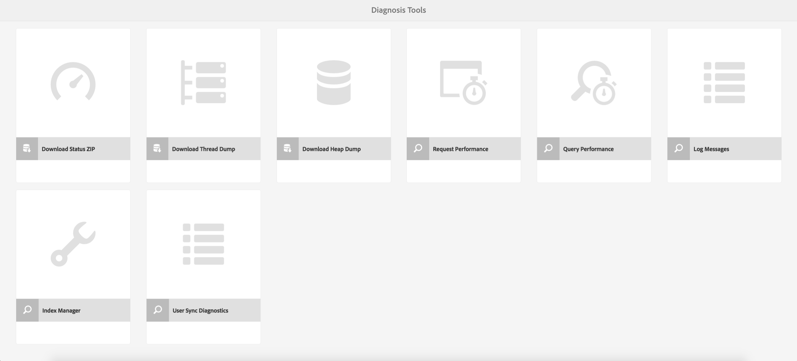
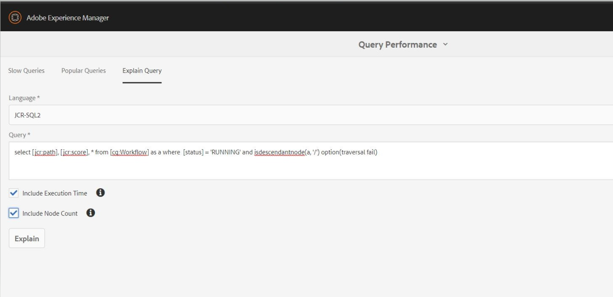

# Dashboard operazioni {#operations-dashboard}

## Introduzione {#introduction}

Il pannello operativo dell’AEM 6 aiuta gli operatori di sistema a monitorare immediatamente lo stato del sistema dell’AEM. Fornisce inoltre informazioni di diagnosi generate automaticamente su aspetti rilevanti dell’AEM e consente di configurare ed eseguire automazione della manutenzione autonoma per ridurre in modo significativo le operazioni del progetto e i casi di supporto. Il dashboard operazioni può essere esteso con controlli di integrità personalizzati e attività di manutenzione. Inoltre, i dati della dashboard operazioni sono accessibili da strumenti di monitoraggio esterni tramite JMX.

**Dashboard operazioni:**

* È uno stato di sistema con un solo clic per aiutare i reparti operativi a migliorare l&#39;efficienza
* Panoramica sullo stato del sistema in un&#39;unica posizione centralizzata
* Riduzione dei tempi di individuazione, analisi e risoluzione dei problemi
* Automazione della manutenzione autonoma che consente di ridurre in modo significativo i costi operativi del progetto

Per accedervi, vai a **Strumenti** - **Operazioni** dalla schermata iniziale AEM.

>[!NOTE]
>
>Per poter accedere al dashboard operazioni, l’utente connesso deve far parte del gruppo di utenti &quot;Operatori&quot;. Per ulteriori informazioni, consulta la documentazione su [Amministrazione utenti, gruppi e diritti di accesso](/help/sites-administering/user-group-ac-admin.md).

## Rapporti stato {#health-reports}

Il sistema di rapporti sullo stato fornisce informazioni sullo stato di un’istanza AEM tramite Sling Health Checks. Puoi eseguire questa operazione tramite OSGI, JMX, richieste HTTP (tramite JSON) o tramite l’interfaccia utente touch. Offre misurazioni e soglie di alcuni contatori configurabili e, a volte, offre informazioni su come risolvere il problema.

Dispone di diverse funzioni, descritte di seguito.

## Verifiche stato {#health-checks}

I **rapporti di stato** sono un sistema di schede che indicano uno stato di salute buono o cattivo per un&#39;area di prodotto specifica. Queste schede sono visualizzazioni dei controlli di integrità Sling, che aggregano i dati da JMX e altre origini ed espongono nuovamente le informazioni elaborate come MBean. Questi MBean possono essere esaminati anche nella [console Web JMX](/help/sites-administering/jmx-console.md), nel dominio **org.apache.sling.healthCheck**.

È possibile accedere all&#39;interfaccia dei report di stato tramite il menu **Strumenti** - **Operazioni** - **Rapporti di stato** nella schermata iniziale dell&#39;AEM oppure direttamente tramite il seguente URL:

`https://<serveraddress>:port/libs/granite/operations/content/healthreports/healthreportlist.html`


Il sistema di schede espone tre possibili stati: **OK**, **AVVERTENZA** e **CRITICO**. Gli stati sono il risultato di regole e soglie, che possono essere configurate passando il mouse sulla scheda e facendo clic sull&#39;icona a forma di ingranaggio nella barra delle azioni:


### Tipi di verifica stato {#health-check-types}

Esistono due tipi di controlli sanitari nell&#39;AEM 6:

1. Verifiche stato individuali
1. Verifiche stato composito

Una **Verifica stato individuale** è una singola verifica di integrità che corrisponde a una scheda di stato. I singoli controlli di integrità possono essere configurati con regole o soglie e possono fornire uno o più suggerimenti e collegamenti per risolvere i problemi di integrità identificati. Prendiamo il controllo &quot;Errori di registro&quot; come esempio: se ci sono voci ERROR nei registri delle istanze, trovale nella pagina dei dettagli del controllo di integrità. Nella parte superiore della pagina, è possibile visualizzare un collegamento all&#39;analizzatore &quot;Log Message&quot; (Messaggi di registro) nella sezione Strumenti di diagnostica, che consente di analizzare questi errori più dettagliatamente e riconfigurare i logger.

Un **controllo di integrità composito** è un controllo che aggrega le informazioni provenienti da diversi controlli individuali.

I controlli di integrità compositi sono configurati con l&#39;ausilio di **tag filtro**. In sostanza, tutti i singoli controlli che hanno lo stesso tag filtro sono raggruppati come un controllo di integrità composito. Un controllo di integrità composito ha lo stato OK solo se anche tutti i singoli controlli che aggrega hanno lo stato OK.

### Come creare controlli di integrità {#how-to-create-health-checks}

Nel dashboard operazioni puoi visualizzare il risultato dei controlli di integrità sia singoli che compositi.

### Creazione di un singolo controllo di integrità {#creating-an-individual-health-check}

La creazione di un singolo controllo di integrità prevede due passaggi: l’implementazione di un controllo di integrità Sling e l’aggiunta di una voce per il controllo di integrità nei nodi di configurazione del dashboard.

1. Per creare una verifica stato Sling, crea un componente OSGI che implementa l’interfaccia Sling HealthCheck. Aggiungi questo componente all’interno di un bundle. Le proprietà del componente identificano completamente il controllo di integrità. Una volta installato il componente, viene automaticamente creato un MBean JMX per il controllo dello stato. Per ulteriori informazioni, consulta la [documentazione Sling Health Check](https://sling.apache.org/documentation/bundles/sling-health-check-tool.html).

   Esempio di componente Sling Health Check, scritto con annotazioni del componente del servizio OSGI:

   ```java
   @Component(service = HealthCheck.class,
   property = {
       HealthCheck.NAME + "=Example Check",
       HealthCheck.TAGS + "=example",
       HealthCheck.TAGS + "=test",
       HealthCheck.MBEAN_NAME + "=exampleHealthCheckMBean"
   })
    public class ExampleHealthCheck implements HealthCheck {
       @Override
       public Result execute() {
           // health check code
       }
    }
   ```

   >[!NOTE]
   >
   >La proprietà `MBEAN_NAME` definisce il nome dell&#39;Mbean generato per questa verifica di integrità.

1. Dopo aver creato una verifica stato, è necessario creare un nuovo nodo di configurazione per renderlo accessibile nell’interfaccia del dashboard operazioni. Per questo passaggio, è necessario conoscere il nome JMX Mbean del controllo di integrità (la proprietà `MBEAN_NAME`). Per creare una configurazione per il controllo dello stato, aprire CRXDE e aggiungere un nodo (di tipo **nt:unstructured**) nel percorso seguente: `/apps/settings/granite/operations/hc`

   Le seguenti proprietà devono essere impostate sul nuovo nodo:

   * **Nome:** `sling:resourceType`

      * **Tipo:** `String`
      * **Valore:** `granite/operations/components/mbean`

   * **Nome:** `resource`

      * **Tipo:** `String`
      * **Valore:** `/system/sling/monitoring/mbeans/org/apache/sling/healthcheck/HealthCheck/exampleHealthCheck`

   >[!NOTE]
   >
   >Il percorso della risorsa precedente viene creato come segue: se il nome Mbean del controllo di integrità è &quot;test&quot;, aggiungere &quot;test&quot; alla fine del percorso `/system/sling/monitoring/mbeans/org/apache/sling/healthcheck/HealthCheck`
   >
   >Quindi il percorso finale è il seguente:
   >
   >`/system/sling/monitoring/mbeans/org/apache/sling/healthcheck/HealthCheck/test`

   >[!NOTE]
   >
   >Verificare che il percorso `/apps/settings/granite/operations/hc` abbia le seguenti proprietà impostate su true:
   >
   >
   >`sling:configCollectionInherit`
   >
   >`sling:configPropertyInherit`
   >
   >
   >Questo processo comunica al gestore della configurazione di unire le nuove configurazioni con quelle esistenti di `/libs`.

### Creazione di un controllo di integrità composito {#creating-a-composite-health-check}

Il ruolo di una Verifica stato composita è quello di aggregare più verifiche di integrità individuali condividendo una serie di caratteristiche comuni. Ad esempio, il controllo di integrità del composto di sicurezza raggruppa tutti i singoli controlli di integrità che eseguono le verifiche relative alla sicurezza. Il primo passaggio per creare un controllo composito consiste nell’aggiungere una configurazione OSGI. Per visualizzarlo nel dashboard operazioni, è necessario aggiungere un nuovo nodo di configurazione nello stesso modo di un semplice controllo.

1. Passa a Gestione configurazione Web nella console OSGI. Accedi a `https://serveraddress:port/system/console/configMgr`
1. Cerca la voce denominata **Verifica stato composito Apache Sling**. Dopo averlo trovato, noterai che sono già disponibili due configurazioni: una per i controlli di sistema e un’altra per i controlli di sicurezza.
1. Per creare una configurazione, premi il pulsante &quot;+&quot; a destra. Viene visualizzata una nuova finestra, come illustrato di seguito:

   

1. Crea una configurazione e salvala. Viene creato un Mbean con la nuova configurazione.

   Lo scopo di ciascuna proprietà di configurazione è il seguente:

   * **Nome (hc.name):** nome del controllo di integrità composito. Si consiglia un nome significativo.
   * **Tag (hc.tags):** I tag per questa verifica stato. Se questo controllo di integrità composito è destinato a far parte di un altro controllo di integrità composito (ad esempio in una gerarchia di controlli di integrità), aggiungere i tag a cui è correlato il composito.
   * **Nome MBean (hc.mbean.name):** Nome del Mbean assegnato all&#39;MBean JMX di questo controllo di integrità composito.
   * **Tag filtro (filter.tags):** proprietà specifica per i controlli di integrità compositi. Questi tag sono aggregati dal composito. Il controllo di integrità composito aggrega nel relativo gruppo tutti i controlli di integrità con qualsiasi tag corrispondente ai tag di filtro del composito. Ad esempio, una verifica di integrità composita con i tag di filtro **test** e **check**, aggrega tutti i controlli di integrità singoli e compositi con i tag **test** e **check** nella proprietà dei tag ( `hc.tags`).

   >[!NOTE]
   >
   >Per ogni nuova configurazione di Apache Sling Composite Health Check viene creato un nuovo JMX Mbean.**

1. Infine, è necessario aggiungere la voce del controllo di integrità composito creato nei nodi di configurazione del dashboard operazioni. La procedura è la stessa dei singoli controlli di integrità: un nodo di tipo **nt:unstructured** deve essere creato in `/apps/settings/granite/operations/hc`. La proprietà di risorsa del nodo è definita dal valore di **hc.mean.name** nella configurazione OSGI.

   Ad esempio, se hai creato una configurazione e hai impostato il valore **hc.mbean.name** su **diskusage**, i nodi di configurazione avranno l&#39;aspetto seguente:

   * **Nome:** `Composite Health Check`

      * **Tipo:** `nt:unstructured`

   Con le seguenti proprietà:

   * **Nome:** `sling:resourceType`

      * **Tipo:** `String`
      * **Valore:** `granite/operations/components/mbean`

   * **Nome:** `resource`

      * **Tipo:** `String`
      * **Valore:** `/system/sling/monitoring/mbeans/org/apache/sling/healthcheck/HealthCheck/diskusage`

   >[!NOTE]
   >
   >Se si creano singoli controlli di integrità che appartengono logicamente a un controllo composito già presente nel dashboard per impostazione predefinita, questi vengono acquisiti e raggruppati automaticamente nel rispettivo controllo composito. Di conseguenza, non è necessario creare un nodo di configurazione per questi controlli.
   >
   >Ad esempio, se crei un singolo controllo di integrità della sicurezza, assegnagli il tag &quot;**security**&quot; e questo verrà installato. Viene visualizzato automaticamente sotto il controllo composito dei controlli di sicurezza nel dashboard operazioni.

### Controlli sanitari forniti con l&#39;AEM {#health-checks-provided-with-aem}

<table>
 <tbody>
  <tr>
   <td><strong>Nome controllo di integrità</strong></td>
   <td><strong>Descrizione</strong></td>
  </tr>
  <tr>
   <td>Prestazioni delle query</td>
   <td><p>Il controllo di integrità è stato semplificato <strong> in AEM 6.4</strong> e ora controlla <code>Oak QueryStats</code> MBean di cui è stato eseguito il refactoring di recente, in particolare l'attributo <code>SlowQueries </code>. Se le statistiche contengono query lente, la verifica stato restituisce un avviso. In caso contrario, verrà restituito lo stato OK.<br /> </p> <p>MBean per questa verifica stato è <a href="http://localhost:4502/system/console/jmx/org.apache.sling.healthcheck%3Aname%3DqueriesStatus%2Ctype%3DHealthCheck">org.apache.sling.healthcheck:name=queriesStatus,type=HealthCheck</a>.</p> </td>
  </tr>
  <tr>
   <td>Lunghezza coda di osservazione</td>
   <td><p>La lunghezza della coda di osservazione scorre tutti i listener di eventi e gli osservatori in background, confronta i <code>queueSize </code> con i <code>maxQueueSize</code> e:</p>
    <ul>
     <li>restituisce lo stato Critico se il valore <code>queueSize</code> supera il valore <code>maxQueueSize</code> (ovvero quando gli eventi verrebbero eliminati)</li>
     <li>restituisce un avviso se il valore <code>queueSize</code> è maggiore di <code>maxQueueSize * WARN_THRESHOLD</code> (il valore predefinito è 0,75) </li>
    </ul> <p>La lunghezza massima di ciascuna coda proviene da configurazioni separate (Oak e AEM) e non è configurabile da questa verifica di integrità. MBean per questa verifica stato è <a href="http://localhost:4502/system/console/jmx/org.apache.sling.healthcheck%3Aname%3DObservationQueueLengthHealthCheck%2Ctype%3DHealthCheck">org.apache.sling.healthcheck:name=ObservationQueueLengthHealthCheck,type=HealthCheck</a>.</p> </td>
  </tr>
  <tr>
   <td>Limiti di attraversamento per query</td>
   <td><p>Query Traversal Limits controlla <code>QueryEngineSettings</code> MBean, in particolare gli attributi <code>LimitInMemory</code> e <code>LimitReads</code>, e restituisce il seguente stato:</p>
    <ul>
     <li>restituisce lo stato Warn se uno dei limiti è uguale o superiore al valore <code>Integer.MAX_VALUE</code></li>
     <li>restituisce lo stato Warn se uno dei limiti è inferiore a 10000 (impostazione consigliata da Oak)</li>
     <li>restituisce lo stato Critico se non è possibile recuperare <code>QueryEngineSettings</code> o uno qualsiasi dei limiti</li>
    </ul> <p>Il valore Mbean per questa verifica stato è <a href="http://localhost:4502/system/console/jmx/org.apache.sling.healthcheck%3Aname%3DqueryTraversalLimitsBundle%2Ctype%3DHealthCheck">org.apache.sling.healthcheck:name=queryTraversalLimitsBundle,type=HealthCheck</a>.</p> </td>
  </tr>
  <tr>
   <td>Orologi sincronizzati</td>
   <td><p>Questa verifica è valida solo per <a href="https://github.com/apache/sling-old-svn-mirror/blob/4df9ab2d6592422889c71fa13afd453a10a5a626/bundles/extensions/discovery/oak/src/main/java/org/apache/sling/discovery/oak/SynchronizedClocksHealthCheck.java">cluster di tipo nodo documento</a>. Restituisce il seguente stato:</p>
    <ul>
     <li>restituisce lo stato Warn quando gli orologi dell’istanza escono dalla sincronizzazione e superano una soglia bassa predefinita</li>
     <li>restituisce lo stato Critico quando gli orologi dell’istanza escono dalla sincronizzazione e superano una soglia elevata predefinita</li>
    </ul> <p>L'Mbean per questa verifica stato è <a href="http://localhost:4502/system/console/jmx/org.apache.sling.healthcheck%3Aname%3DslingDiscoveryOakSynchronizedClocks%2Ctype%3DHealthCheck">org.apache.sling.healthcheck:name=slingDiscoveryOakSynchronizedClocks,type=HealthCheck</a>.</p> </td>
  </tr>
  <tr>
   <td>Indici asincroni</td>
   <td><p>La verifica degli indici asincroni:</p>
    <ul>
     <li>restituisce uno stato Critico se almeno una corsia di indicizzazione non riesce</li>
     <li>controlla <code>lastIndexedTime</code> per tutte le corsie di indicizzazione e:
      <ul>
       <li>restituisce uno stato Critico se è più di 2 ore fa </li>
       <li>restituisce uno stato di avvertenza se è compreso tra 2 ore e 45 minuti fa </li>
       <li>restituisce lo stato OK se è meno di 45 minuti fa </li>
      </ul> </li>
     <li>se nessuna di queste condizioni è soddisfatta, viene restituito lo stato OK</li>
    </ul> <p>È possibile configurare sia le soglie di stato Critico che quelle di Avviso. L'Mbean per questa verifica stato è <a href="http://localhost:4502/system/console/jmx/org.apache.sling.healthcheck%3Aname%3DasyncIndexHealthCheck%2Ctype%3DHealthCheck">org.apache.sling.healthcheck:name=asyncIndexHealthCheck,type=HealthCheck</a>.</p> <p><strong>Nota: </strong>Questo controllo di integrità è disponibile con AEM 6.4 ed è stato supportato nell'AEM 6.3.0.1.</p> </td>
  </tr>
  <tr>
   <td>Indici Lucene di grandi dimensioni</td>
   <td><p>Questo controllo utilizza i dati esposti da <code>Lucene Index Statistics</code> MBean per identificare indici di grandi dimensioni e restituisce:</p>
    <ul>
     <li>uno stato di avvertenza se è presente un indice con più di 1 miliardo di documenti</li>
     <li>uno stato Critico se è presente un indice con più di 1,5 miliardi di documenti</li>
    </ul> <p>Le soglie sono configurabili e l'elemento MBean per il controllo dello stato è <a href="http://localhost:4502/system/console/jmx/org.apache.sling.healthcheck%3Aname%3DlargeIndexHealthCheck%2Ctype%3DHealthCheck">org.apache.sling.healthcheck:name=largeIndexHealthCheck,type=HealthCheck.</a></p> <p><strong>Nota: </strong>Questo controllo è disponibile con AEM 6.4 ed è stato eseguito il backport in AEM 6.3.2.0.</p> </td>
  </tr>
  <tr>
   <td>Manutenzione sistema</td>
   <td><p>Manutenzione sistema è un controllo composito che restituisce l'OK se tutte le attività di manutenzione sono in esecuzione come configurato. Tieni presente che:</p>
    <ul>
     <li>ogni attività di manutenzione è accompagnata da un controllo di integrità associato</li>
     <li>se un'attività non viene aggiunta a una finestra di manutenzione, la verifica dello stato restituisce un valore Critico</li>
     <li>configurare le attività di manutenzione Registro di controllo e Rimozione flusso di lavoro o rimuoverle in altro modo dalle finestre di manutenzione. Se non viene configurata, queste attività non riusciranno al primo tentativo di esecuzione, pertanto la verifica di manutenzione del sistema restituirà lo stato Critico.</li>
     <li><strong>Con AEM 6.4</strong>, è stata eseguita anche una verifica per l'attività <a href="/help/sites-administering/operations-dashboard.md#automated-maintenance-tasks">Manutenzione binary di Lucene</a></li>
     <li>in AEM 6.2 e versioni precedenti, il controllo di manutenzione del sistema restituisce lo stato di avviso subito dopo l'avvio perché le attività non vengono mai eseguite. A partire dalla versione 6.3, se la prima finestra di manutenzione non è stata ancora raggiunta viene visualizzato OK.</li>
    </ul> <p>MBean per questa verifica stato è <a href="http://localhost:4502/system/console/jmx/org.apache.sling.healthcheck%3Aname%3Dsystemchecks%2Ctype%3DHealthCheck">org.apache.sling.healthcheck:name=systemchecs,type=HealthCheck</a>.</p> </td>
  </tr>
  <tr>
   <td>Coda di replica</td>
   <td><p>Questo controllo scorre gli agenti di replica e ne esamina le code. Per l'elemento nella parte superiore della coda, il controllo verifica il numero di tentativi di replica eseguiti dall'agente. Se l'agente ha ritentato la replica con un valore superiore a quello del parametro <code>numberOfRetriesAllowed</code>, verrà restituito un avviso. Il parametro <code>numberOfRetriesAllowed</code> è configurabile. </p> <p>MBean per questa verifica stato è <a href="http://localhost:4502/system/console/jmx/org.apache.sling.healthcheck%3Aname%3DreplicationQueue%2Ctype%3DHealthCheck" target="_blank">org.apache.sling.healthcheck:name=replicationQueue,type=HealthCheck</a>.</p> </td>
  </tr>
  <tr>
   <td>Processi Sling</td>
   <td>
    <div>
      Sling Jobs controlla il numero di job in coda in JobManager, confrontandolo con
     Soglia <code>maxNumQueueJobs</code> e:
    </div>
    <ul>
     <li>restituisce un valore Critico se nella coda sono presenti più di <code>maxNumQueueJobs</code></li>
     <li>restituisce un valore Critico se sono presenti processi attivi con tempi di esecuzione lunghi più vecchi di 1 ora</li>
     <li>restituisce un valore Critico se sono presenti processi in coda e l'ultima ora del processo finito è precedente a 1 ora</li>
    </ul> <p>È possibile configurare solo il parametro relativo al numero massimo di processi in coda e il valore predefinito è 1000.</p> <p>MBean per questa verifica stato è <a href="http://localhost:4502/system/console/jmx/org.apache.sling.healthcheck%3Aname%3DslingJobs%2Ctype%3DHealthCheck" target="_blank">org.apache.sling.healthcheck:name=slingJobs,type=HealthCheck</a>.</p> </td>
  </tr>
  <tr>
   <td>Prestazioni delle richieste</td>
   <td><p>Questo controllo esamina la metrica <code>granite.request.metrics.timer</code> <a href="http://localhost:4502/system/console/slingmetrics" target="_blank">Sling </a> e:</p>
    <ul>
     <li>restituisce un valore Critico se il valore del 75° percentile supera la soglia critica (il valore predefinito è 500 millisecondi)</li>
     <li>restituisce un valore Warn se il valore del 75° percentile supera la soglia di avvertenza (il valore predefinito è 200 millisecondi)</li>
    </ul> <p>MBean per questa verifica stato è <em> </em><a href="http://localhost:4502/system/console/jmx/org.apache.sling.healthcheck%3Aname%3DrequestsStatus%2Ctype%3DHealthCheck" target="_blank">org.apache.sling.healthcheck:name=requestsStatus,type=HealthCheck</a>.</p> </td>
  </tr>
  <tr>
   <td>Errori registro</td>
   <td><p>Questo controllo restituisce lo stato Warn in caso di errori nel registro.</p> <p>MBean per questa verifica stato è <a href="http://localhost:4502/system/console/jmx/org.apache.sling.healthcheck%3Aname%3DlogErrorHealthCheck%2Ctype%3DHealthCheck" target="_blank">org.apache.sling.healthcheck:name=logErrorHealthCheck,type=HealthCheck</a>.</p> </td>
  </tr>
  <tr>
   <td>Spazio su disco</td>
   <td><p>Il controllo dello spazio su disco esamina <code>FileStoreStats</code> MBean, recupera le dimensioni dell'archivio nodi e la quantità di spazio su disco utilizzabile nella partizione dell'archivio nodi e:</p>
    <ul>
     <li>restituisce un avviso se il rapporto tra lo spazio su disco utilizzabile e le dimensioni dell’archivio è inferiore alla soglia di avviso (il valore predefinito è 10)</li>
     <li>restituisce un valore Critico se il rapporto tra lo spazio su disco utilizzabile e le dimensioni dell’archivio è inferiore alla soglia critica (il valore predefinito è 2)</li>
    </ul> <p>Entrambe le soglie sono configurabili. Il controllo funziona solo sulle istanze con un archivio segmenti.</p> <p>MBean per questa verifica stato è <a href="http://localhost:4502/system/console/jmx/org.apache.sling.healthcheck%3Aname%3DDiskSpaceHealthCheck%2Ctype%3DHealthCheck" target="_blank">org.apache.sling.healthcheck:name=DiskSpaceHealthCheck,type=HealthCheck</a>.</p> </td>
  </tr>
  <tr>
   <td>Verifica stato modulo di pianificazione</td>
   <td><p>Questo controllo restituisce un avviso se l’istanza ha processi Quartz in esecuzione per più di 60 secondi. È possibile configurare la soglia di durata accettabile.</p> <p>MBean per questa verifica stato è <a href="http://localhost:4502/system/console/jmx/org.apache.sling.healthcheck%3Aname%3DslingCommonsSchedulerHealthCheck%2Ctype%3DHealthCheck" target="_blank">org.apache.sling.healthcheck:name=slingCommonsSchedulerHealthCheck,type=HealthCheck</a><em>.</em></p> </td>
  </tr>
  <tr>
   <td>Verifiche di sicurezza</td>
   <td><p>Il controllo di sicurezza è un elemento composito che aggrega i risultati di più controlli relativi alla sicurezza. Questi singoli controlli di integrità rispondono a problemi diversi dall'elenco di controllo della sicurezza disponibile nella pagina della documentazione dell'elenco di controllo della sicurezza <a href="/help/sites-administering/security-checklist.md">.</a> Il controllo è utile come test di fumo di sicurezza all'avvio dell'istanza. </p> <p>MBean per questa verifica stato è <a href="http://localhost:4502/system/console/jmx/org.apache.sling.healthcheck%3Aname%3Dsecuritychecks%2Ctype%3DHealthCheck" target="_blank">org.apache.sling.healthcheck:name=securitychecs,type=HealthCheck</a></p> </td>
  </tr>
  <tr>
   <td>Bundle attivi</td>
   <td><p>Bundle attivi controlla lo stato di tutti i bundle e:</p>
    <ul>
     <li>restituisce lo stato Warn se uno dei bundle non è attivo o (a partire da, con attivazione lenta)</li>
     <li>ignora lo stato dei bundle nell’elenco da ignorare</li>
    </ul> <p>Il parametro dell’elenco da ignorare è configurabile.</p> <p>MBean per questa verifica stato è <a href="http://localhost:4502/system/console/jmx/org.apache.sling.healthcheck%3Aname%3DinactiveBundles%2Ctype%3DHealthCheck" target="_blank">org.apache.sling.healthcheck:name=inactiveBundles,type=HealthCheck</a>.</p> </td>
  </tr>
  <tr>
   <td>Controllo cache codice</td>
   <td><p>Verifica stato che verifichi diverse condizioni JVM che possono attivare un bug CodeCache presente in Java™ 7:</p>
    <ul>
     <li>restituisce un avviso se l’istanza è in esecuzione su Java™ 7, con lo svuotamento della cache del codice abilitato</li>
     <li>restituisce un avviso se l’istanza è in esecuzione su Java™ 7 e la dimensione della cache codice riservato è inferiore a una soglia minima (il valore predefinito è 90 MB)</li>
    </ul> <p>La soglia <code>minimum.code.cache.size</code> è configurabile. Per ulteriori informazioni sul bug, vedere <a href="https://bugs.java.com/bugdatabase/"> e quindi eseguire una ricerca nell'ID bug 8012547</a>.</p> <p>MBean per questa verifica stato è <a href="http://localhost:4502/system/console/jmx/org.apache.sling.healthcheck%3Aname%3DcodeCacheHealthCheck%2Ctype%3DHealthCheck" target="_blank">org.apache.sling.healthcheck:name=codeCacheHealthCheck,type=HealthCheck</a>.</p> </td>
  </tr>
  <tr>
   <td>Errori nel percorso di ricerca delle risorse</td>
   <td><p>Verifica se sono presenti risorse nel percorso <code>/apps/foundation/components/primary</code> e:</p>
    <ul>
     <li>restituisce un avviso se sono presenti nodi figlio in <code>/apps/foundation/components/primary</code></li>
    </ul> <p>MBean per questa verifica stato è <a href="http://localhost:4502/system/console/jmx/org.apache.sling.healthcheck%3Aname%3DresourceSearchPathErrorHealthCheck%2Ctype%3DHealthCheck" target="_blank">org.apache.sling.healthcheck:name=resourceSearchPathErrorHealthCheck,type=HealthCheck</a>.</p> </td>
  </tr>
 </tbody>
</table>

### Configurazione verifica stato {#health-check-configuration}

Per impostazione predefinita, per un’istanza AEM preconfigurata, i controlli di integrità vengono eseguiti ogni 60 secondi.

È possibile configurare il **Periodo** con la [configurazione OSGi](/help/sites-deploying/configuring-osgi.md) **configurazione verifica stato query** (com.adobe.granite.queries.impl.hc.QueryHealthCheckMetrics).

## Monitoraggio con servizi esterni {#monitoring-with-external-services}

L’integrazione è possibile con tecnologie o fornitori esterni. Consulta la loro documentazione per i dettagli correlati.

## Strumenti di diagnostica {#diagnosis-tools}

Il dashboard delle operazioni consente inoltre di accedere agli strumenti di diagnostica che consentono di individuare e risolvere le cause principali degli avvisi provenienti dal dashboard di verifica stato e di fornire importanti informazioni di debug per gli operatori di sistema.

Tra le sue caratteristiche più importanti vi sono:

* Un analizzatore di messaggi di registro
* Possibilità di accedere alle immagini heap e thread
* Richieste e analizzatori delle prestazioni delle query

Per accedere alla schermata Strumenti di diagnostica, vai a **Strumenti - Operazioni - Diagnosi** dalla schermata iniziale dell&#39;AEM. È inoltre possibile accedere alla schermata accedendo direttamente al seguente URL: `https://serveraddress:port/libs/granite/operations/content/diagnosis.html`



### Messaggi del registro {#log-messages}

Per impostazione predefinita, nell&#39;interfaccia utente dei messaggi di registro vengono visualizzati tutti i messaggi di ERRORE. Per visualizzare più messaggi di registro, configura un logger con il livello di registro appropriato.

I messaggi di log utilizzano un appender di log in memoria e pertanto non sono correlati ai file di log. Un’altra conseguenza è che la modifica dei livelli di registro in questa interfaccia utente non modifica le informazioni che vengono registrate nei file di registro tradizionali. L’aggiunta e la rimozione dei logger in questa interfaccia utente influisce solo sul logger di memoria. Inoltre, la modifica delle configurazioni del logger si riflette nel futuro del logger in memoria. Le voci già registrate e non più rilevanti non vengono eliminate, ma voci simili non verranno registrate in futuro.

Puoi configurare gli elementi registrati fornendo le configurazioni del logger dal pulsante in alto a sinistra nell’interfaccia utente. È possibile aggiungere, rimuovere o aggiornare le configurazioni del logger. Una configurazione del logger è composta da un **livello di registro** (WARN/INFO/DEBUG) e da un **nome filtro**. Il **nome filtro** ha il ruolo di filtrare l&#39;origine dei messaggi di registro registrati. In alternativa, se un logger deve acquisire tutti i messaggi di registro per il livello specificato, il nome del filtro deve essere &quot;**root**&quot;. L’impostazione del livello di un logger attiva l’acquisizione di tutti i messaggi con un livello uguale o superiore a quello specificato.

Esempi:

* Se prevedi di acquisire tutti i messaggi **ERROR** - non è richiesta alcuna configurazione. Tutti i messaggi ERROR vengono acquisiti per impostazione predefinita.
* Se prevedi di acquisire tutti i messaggi **ERROR**, **WARN** e **INFO**, il nome del logger deve essere impostato su: &quot;**root**&quot; e il livello del logger su: **INFO**.

* Se prevedi di acquisire tutti i messaggi provenienti da un determinato pacchetto (ad esempio, com.adobe.granite), il nome del logger deve essere impostato su: &quot;com.adobe.granite&quot;. Il livello logger impostato su: **DEBUG** (in questo modo vengono acquisiti tutti i messaggi **ERROR**, **WARN**, **INFO** e **DEBUG**), come illustrato nell&#39;immagine seguente.


>[!NOTE]
>
>Non è possibile impostare un nome di logger per acquisire solo i messaggi di ERRORE tramite un filtro specificato. Per impostazione predefinita, vengono acquisiti tutti i messaggi ERROR.

>[!NOTE]
>
>L’interfaccia utente dei messaggi di registro non riflette il registro degli errori effettivo. A meno che non si configurino altri tipi di messaggi di registro nell&#39;interfaccia utente, vengono visualizzati solo i messaggi di ERRORE. Per informazioni su come visualizzare messaggi di registro specifici, consulta le istruzioni precedenti.

>[!NOTE]
>
>Le impostazioni nella pagina di diagnostica non influenzano ciò che viene registrato nei file di registro e viceversa. Pertanto, anche se il registro degli errori può rilevare i messaggi INFO, è possibile che tali messaggi non vengano visualizzati nell’interfaccia utente dei messaggi di registro. Inoltre, tramite l’interfaccia utente di è possibile rilevare i messaggi DEBUG da alcuni pacchetti senza che questo influisca sul registro degli errori. Per ulteriori informazioni su come configurare i file di log, vedere [Registrazione](/help/sites-deploying/configure-logging.md).

>[!NOTE]
>
>**Con AEM 6.4**, le attività di manutenzione vengono disconnesse in un formato più ricco di informazioni a livello INFO. Questo flusso di lavoro offre una migliore visibilità dello stato delle attività di manutenzione.
>
>Se si utilizzano strumenti di terze parti, ad esempio Splunk, per monitorare e reagire all&#39;attività di manutenzione, è possibile utilizzare le istruzioni di registro seguenti:

```
Log level: INFO
DATE+TIME [MaintanceLogger] Name=<MT_NAME>, Status=<MT_STATUS>, Time=<MT_TIME>, Error=<MT_ERROR>, Details=<MT_DETAILS>
```

### Prestazioni delle richieste {#request-performance}

La pagina Prestazioni delle richieste consente di analizzare le richieste di pagina più lente elaborate. In questa pagina vengono registrate solo le richieste di contenuto. In particolare, vengono acquisite le seguenti richieste:

1. Richieste di accesso alle risorse in `/content`
1. Richieste di accesso alle risorse in `/etc/design`
1. Richieste con estensione `".html"`


La pagina mostra:

* Ora in cui è stata effettuata la richiesta
* L’URL e il metodo di richiesta
* Durata in millisecondi

Per impostazione predefinita, vengono acquisite le 20 richieste più lente, ma il limite può essere modificato in Configuration Manager.

### Prestazioni delle query {#query-performance}

La pagina Prestazioni query consente di analizzare le query più lente eseguite dal sistema. Queste informazioni vengono fornite dall’archivio in un JMX Mbean. In Jackrabbit, JMX Mbean `com.adobe.granite.QueryStat` fornisce queste informazioni, mentre nell&#39;archivio Oak è offerto da `org.apache.jackrabbit.oak.QueryStats.`

La pagina mostra:

* Ora in cui è stata eseguita la query
* Lingua della query
* Il numero di volte in cui è stata inviata la query
* Dichiarazione della query
* Durata in millisecondi


### Spiega query {#explain-query}

Per una determinata query, Oak tenta di capire il modo migliore per eseguire in base agli indici Oak definiti nell&#39;archivio nel nodo **oak:index**. A seconda della query, Oak può scegliere indici diversi. Il primo passaggio per ottimizzare la query consiste nel comprendere in che modo Oak esegue una query.

Explain Query è uno strumento che spiega come Oak esegue una query. È possibile accedervi da **Strumenti - Operazioni - Diagnosi** dalla schermata iniziale AEM. Quindi, fai clic su **Prestazioni query** e passa alla scheda **Spiega query**.

**Caratteristiche**

* Supporta i linguaggi di query Xpath, JCR-SQL e JCR-SQL2
* Segnala il tempo di esecuzione effettivo della query fornita
* Rileva query lente e avvisi relativi a query potenzialmente lente
* Segnala l’indice Oak utilizzato per eseguire la query
* Visualizza la spiegazione effettiva del modulo di gestione query di Oak
* Fornisce l’elenco di query lente e popolari da caricare tramite clic

Dopo aver visualizzato l&#39;interfaccia utente Spiega query, immettere la query e premere il pulsante **Spiega**:



La prima voce nella sezione Spiegazione query è la spiegazione effettiva. La spiegazione mostra il tipo di indice utilizzato per eseguire la query.

La seconda voce è il piano di esecuzione.

Se si seleziona la casella **Includi tempo di esecuzione** prima di eseguire la query, verrà visualizzato anche il tempo di esecuzione della query. L&#39;opzione **Includi conteggio nodi** riporta il conteggio dei nodi. Il rapporto consente di ottenere ulteriori informazioni che possono essere utilizzate per ottimizzare gli indici per l’applicazione o la distribuzione.


### Gestore indice {#the-index-manager}

Lo scopo di Gestione indici è quello di facilitare la gestione degli indici, ad esempio la manutenzione degli indici o la visualizzazione del loro stato.

È possibile accedervi da **Strumenti - Operazioni - Diagnosi &#x200B;** dalla schermata iniziale, quindi fare clic sul pulsante **Gestione indice**.

È inoltre possibile accedervi direttamente da questo URL: `https://serveraddress:port/libs/granite/operations/content/diagnosistools/indexManager.html`


L’interfaccia utente può essere utilizzata per filtrare gli indici nella tabella digitando i criteri di filtro nella casella di ricerca nell’angolo in alto a sinistra dello schermo.

### Scarica ZIP stato {#download-status-zip}

Questa azione attiva il download di un file ZIP contenente informazioni utili sullo stato e sulla configurazione del sistema. L’archivio contiene configurazioni di istanze, un elenco di bundle, OSGI, metriche e statistiche Sling, che possono causare un file di grandi dimensioni. È possibile ridurre l&#39;impatto dei file di stato di grandi dimensioni utilizzando la finestra **Scarica ZIP stato**. È possibile accedere alla finestra da:**AEM > Strumenti > Operazioni > Diagnosi > Scarica ZIP stato.**

Da questa finestra puoi selezionare gli elementi da esportare (file di registro e/o immagini thread) e il numero di giorni di registri inclusi nel download rispetto alla data corrente.


### Scarica immagine thread {#download-thread-dump}

Questa azione attiva il download di un file ZIP contenente informazioni sui thread presenti nel sistema. Vengono fornite informazioni su ciascun thread, ad esempio il relativo stato, il caricatore di classi e la traccia dello stack.

### Scarica immagine heap {#download-heap-dump}

Puoi scaricare un’istantanea dell’heap per analizzarla in un secondo momento. Questa azione attiva il download di un file di grandi dimensioni (centinaia di MB).

## Attività di manutenzione automatizzata {#automated-maintenance-tasks}

La pagina Attività di manutenzione automatizzata è un&#39;area in cui è possibile visualizzare e tenere traccia delle attività di manutenzione consigliate pianificate per l&#39;esecuzione periodica. Le attività sono integrate con il sistema di Verifica stato. Le attività possono anche essere eseguite manualmente dall’interfaccia.

Per accedere alla pagina Manutenzione nel dashboard operazioni, dalla schermata iniziale AEM, vai a **Strumenti - Operazioni - dashboard - Manutenzione** oppure segui direttamente questo collegamento:

`https://serveraddress:port/libs/granite/operations/content/maintenance.html`

Nel dashboard operazioni sono disponibili le seguenti attività:

1. L&#39;attività **Pulizia revisioni**, che si trova nel menu **Finestra manutenzione giornaliera**.
1. L&#39;attività **Pulizia file binari Lucene**, che si trova nel menu **Finestra di manutenzione giornaliera**.
1. L&#39;attività **Rimozione flusso di lavoro**, che si trova nel menu **Finestra manutenzione settimanale**.
1. L&#39;attività **Raccolta oggetti inattivi dell&#39;archivio dati**, che si trova nel menu **Finestra manutenzione settimanale**.
1. L&#39;attività **Manutenzione log di controllo**, che si trova nel menu **Finestra manutenzione settimanale**.
1. L&#39;attività **Manutenzione rimozione versione**, che si trova nel menu **Finestra manutenzione settimanale**.
1. L&#39;attività di manutenzione **Rimozione progetto**, che si trova nel menu **Finestra manutenzione settimanale**, utilizza l&#39;opzione **Aggiungi**.
1. **Eliminazione delle attività ad hoc** attività di manutenzione, disponibile nel menu **Finestra manutenzione settimanale**, utilizzando l&#39;opzione **Aggiungi**.

L&#39;orario predefinito per la finestra di manutenzione giornaliera è dalle 2.00 alle 5.00. Le attività configurate per l’esecuzione nella finestra di manutenzione settimanale vengono eseguite tra le ore 1:00 e le ore 2:00 del sabato.

Puoi anche configurare gli intervalli premendo l’icona ingranaggio su una qualsiasi delle due schede di manutenzione:


>[!NOTE]
>
>A partire da AEM 6.1, è possibile configurare le finestre di manutenzione esistenti in modo che vengano eseguite mensilmente.

### Pulizia revisioni {#revision-clean-up}

Per ulteriori informazioni, vedere [Pulizia revisioni](/help/sites-deploying/revision-cleanup.md).

### Pulizia dati binari di Lucene {#lucene-binaries-cleanup}

Utilizzando l&#39;attività Pulizia dati binari di Lucene, è possibile eliminare i dati binari di Lucene e ridurre i requisiti relativi alle dimensioni dell&#39;archivio dati in esecuzione. L&#39;abbandono binario di Lucene viene recuperato ogni giorno invece della dipendenza precedente da un&#39;esecuzione di [Garbage Collection](/help/sites-administering/data-store-garbage-collection.md) dell&#39;archivio dati completata.

Anche se l’attività di manutenzione è stata sviluppata per ridurre i rifiuti di revisione correlati a Lucene, vi sono miglioramenti generali di efficienza durante l’esecuzione dell’attività:

* L’esecuzione settimanale dell’attività di Garbage Collection dell’archivio dati può essere completata più rapidamente.
* Può anche migliorare leggermente le prestazioni complessive dell’AEM.

Puoi accedere all&#39;attività Pulizia file binari Lucene da: **AEM > Strumenti > Operazioni > Manutenzione > Finestra manutenzione giornaliera > Pulizia file binari Lucene**.

### Raccolta oggetti inattivi in archivio dati {#data-store-garbage-collection}

Per informazioni dettagliate sulla raccolta oggetti inattivi dell&#39;archivio dati, consulta la pagina dedicata della documentazione di [Raccolta oggetti inattivi dell&#39;archivio dati](/help/sites-administering/data-store-garbage-collection.md).

### Eliminazione flusso di lavoro {#workflow-purge}

I flussi di lavoro possono essere eliminati anche dal dashboard di manutenzione. Per eseguire l&#39;attività Rimozione flusso di lavoro, eseguire le operazioni seguenti:

1. Fare clic sulla pagina **Finestra manutenzione settimanale**.
1. Nella pagina seguente, fai clic su **Riproduci** nella scheda **Eliminazione flusso di lavoro**.

>[!NOTE]
>
>Per informazioni più dettagliate sulla manutenzione dei flussi di lavoro, vedere [Amministrazione delle istanze dei flussi di lavoro](/help/sites-administering/workflows-administering.md#regular-purging-of-workflow-instances).

### Manutenzione del registro di controllo {#audit-log-maintenance}

Per la manutenzione del registro di controllo, consulta la [pagina separata della documentazione.](/help/sites-administering/operations-audit-log.md)

### Pulizia delle versioni {#version-purge}

È possibile pianificare l&#39;attività di manutenzione Pulizia delle versioni per eliminare automaticamente le versioni precedenti. Questa azione consente di ridurre al minimo la necessità di utilizzare manualmente gli [strumenti di eliminazione versione](/help/sites-deploying/version-purging.md). È possibile pianificare e configurare l&#39;attività Pulizia versione accedendo a **Strumenti > Operazioni > Manutenzione > Finestra manutenzione settimanale** e attenendosi alla seguente procedura:

1. Fare clic su **Aggiungi**.
1. Scegliere **Rimozione versione** dal menu a discesa.

   

1. Per configurare l&#39;attività Pulizia delle versioni, fare clic sull&#39;icona **ingranaggi** nella scheda di manutenzione Pulizia delle versioni appena creata.

   

**Con AEM 6.4**, è possibile interrompere l&#39;attività di manutenzione Pulizia delle versioni nel modo seguente:

* Automaticamente: se la finestra di manutenzione programmata si chiude prima che l&#39;attività possa essere completata, l&#39;attività si interrompe automaticamente. L&#39;operazione riprenderà all&#39;apertura della finestra di manutenzione successiva.
* Manualmente - Per interrompere manualmente l&#39;attività, nella scheda Pulizia delle versioni fare clic sull&#39;icona **Interrompi**. Alla successiva esecuzione, l’attività riprenderà in modo sicuro.

>[!NOTE]
>
>Interrompere l&#39;attività di manutenzione significa sospenderne l&#39;esecuzione senza perdere la traccia del processo già in corso.

>[!CAUTION]
>
>Per ottimizzare le dimensioni dell&#39;archivio, è consigliabile eseguire frequentemente l&#39;operazione di rimozione della versione. L’attività deve essere pianificata al di fuori dell’orario di lavoro in presenza di una quantità limitata di traffico.

### Eliminazione progetti {#project-purge}

<!--
Override the out-of-the-box Maintenance window configuration node under `/libs` by creating properties under the folder `/apps/settings/granite/operations/maintenance/granite_weekly`, `granite_daily` or `granite_monthly`. See the Maintenance Window table below for additional configuration details.

Enable the maintenance task by adding another node under the node above (name it `granite_ProjectPurgeTask`) with the appropriate properties. 
-->

Configurare le proprietà OSGI in **Configurazione eliminazione progetti di Adobe** (com.adobe.cq.projects.purge.Scheduler).

### Eliminazione di attività ad-hoc {#purge-of-ad-hoc-tasks}

<!--
Override the out-of-the-box Maintenance window configuration node under `/libs` by creating properties under the folder `/apps/settings/granite/operations/maintenance/granite_weekly`, `granite_daily` or `granite_monthly`.

See the Maintenance Window table below for additional configuration details. Enable the maintenance task by adding another node under the node above. Name it `granite_TaskPurgeTask`, with attribute `sling:resourceType` set to `granite/operations/components/maintenance/task` and attribute `granite.maintenance.name` set to `TaskPurge`. 
-->

Configura le proprietà OSGI in **Rimozione attività ad hoc** (`com.adobe.granite.taskmanagement.impl.purge.TaskPurgeMaintenanceTask`).

## Attività di manutenzione personalizzate {#custom-maintenance-tasks}

Le attività di manutenzione personalizzate possono essere implementate come servizi OSGi. Poiché l&#39;infrastruttura delle attività di manutenzione si basa sulla gestione dei processi di Apache Sling, un&#39;attività di manutenzione deve implementare l&#39;interfaccia Java™ ` [org.apache.sling.event.jobs.consumer.JobExecutor](https://sling.apache.org/apidocs/sling7/org/apache/sling/event/jobs/consumer/JobExecutor.html)`. Inoltre, deve dichiarare diverse proprietà di registrazione del servizio da rilevare come attività di manutenzione, come indicato di seguito:

<table>
 <tbody>
  <tr>
   <td><strong>Nome proprietà servizio</strong><br /> </td>
   <td><strong>Descrizione</strong></td>
   <td><strong>Esempio</strong><br /> </td>
   <td><strong>Tipo</strong></td>
  </tr>
  <tr>
   <td>granite.maintenance.isStoppable</td>
   <td>Attributo booleano che definisce se l’attività può essere interrotta dall’utente. Se un'attività dichiara di essere arrestabile, durante l'esecuzione deve verificare se è stata arrestata e quindi agire di conseguenza. Il valore predefinito è false.</td>
   <td>vero</td>
   <td>Facoltativo</td>
  </tr>
  <tr>
   <td>granite.maintenance.mandatory</td>
   <td>Attributo booleano che definisce se un’attività è obbligatoria e deve essere eseguita periodicamente. Se un'attività è obbligatoria ma al momento non è presente in alcuna finestra di programmazione attiva, un controllo di integrità segnala questo errore. Il valore predefinito è false.</td>
   <td>vero</td>
   <td>Facoltativo</td>
  </tr>
  <tr>
   <td>granite.maintenance.name</td>
   <td>Nome univoco per l'attività: il nome viene utilizzato per fare riferimento all'attività ed è solo un nome semplice.</td>
   <td>MyMaintenanceTask</td>
   <td>Obbligatorio</td>
  </tr>
  <tr>
   <td>granite.maintenance.title</td>
   <td>Titolo visualizzato per l'attività</td>
   <td>La mia attività di manutenzione speciale</td>
   <td>Obbligatorio</td>
  </tr>
  <tr>
   <td>job.topics</td>
   <td>Argomento univoco dell’attività di manutenzione.<br /> La gestione del processo Apache Sling avvia un processo con esattamente questo argomento per eseguire l'attività di manutenzione e quando l'attività viene registrata per questo argomento viene eseguita.<br /> L'argomento deve iniziare con <i>com/adobe/granite/maintenance/job/</i></td>
   <td>com/adobe/granite/maintenance/job/MyMaintenanceTask</td>
   <td>Obbligatorio</td>
  </tr>
 </tbody>
</table>

A parte le proprietà del servizio di cui sopra, il metodo `process()` dell&#39;interfaccia `JobConsumer` deve essere implementato aggiungendo il codice da eseguire per l&#39;attività di manutenzione. L&#39;elemento `JobExecutionContext` fornito può essere utilizzato per generare informazioni sullo stato, verificare se il processo è stato interrotto dall&#39;utente e creare un risultato (positivo o negativo).

Nelle situazioni in cui un&#39;attività di manutenzione non deve essere eseguita in tutte le installazioni, ad esempio solo nell&#39;istanza Publish, è possibile rendere il servizio necessario per attivare una configurazione aggiungendo `@Component(policy=ConfigurationPolicy.REQUIRE)`. Puoi quindi contrassegnare la configurazione corrispondente come dipendente dalla modalità di esecuzione nell’archivio. Per ulteriori informazioni, vedere [Configurazione di OSGi](/help/sites-deploying/configuring-osgi.md#creating-the-configuration-in-the-repository).

Di seguito è riportato un esempio di attività di manutenzione personalizzata che elimina i file da una directory temporanea configurabile che sono stati modificati nelle ultime 24 ore:

src/main/java/com/adobe/granite/samples/maintenance/impl/DeleteTempFilesTask.java

<table>
 <tbody>
  <tr>
   <td><p> </p> <p><code>/*</code></p> <p><code> * #%L</code></p> <p><code> * sample-maintenance-task</code></p> <p><code> * %%</code></p> <p><code> * Copyright (C) 2014 Adobe</code></p> <p><code> * %%</code></p> <p><code> * Licensed under the Apache License, Version 2.0 (the "License");</code></p> <p><code> * you may not use this file except in compliance with the License.</code></p> <p><code> * You may obtain a copy of the License at</code></p> <p><code> * </code></p> <p><code> * <a href="https://www.apache.org/licenses/LICENSE-2.0">https://www.apache.org/licenses/LICENSE-2.0</a></code></p> <p><code> * </code></p> <p><code> * Unless required by applicable law or agreed to in writing, software</code></p> <p><code> * distributed under the License is distributed on an "AS IS" BASIS,</code></p> <p><code> * WITHOUT WARRANTIES OR CONDITIONS OF ANY KIND, either express or implied.</code></p> <p><code> * See the License for the specific language governing permissions and</code></p> <p><code> * limitations under the License.</code></p> <p><code> * #L%</code></p> <p><code> */</code></p> <p><code> </code></p> <p><code>package com.adobe.granite.samples.maintenance.impl;</code></p> <p><code> </code></p> <p><code>import java.io.File;</code></p> <p><code>import java.util.Calendar;</code></p> <p><code>import java.util.Collection;</code></p> <p><code>import java.util.Map;</code></p> <p><code> </code></p> <p><code>import org.apache.commons.io.FileUtils;</code></p> <p><code>import org.apache.commons.io.filefilter.IOFileFilter;</code></p> <p><code>import org.apache.commons.io.filefilter.TrueFileFilter;</code></p> <p><code>import org.apache.felix.scr.annotations.Activate;</code></p> <p><code>import org.apache.felix.scr.annotations.Component;</code></p> <p><code>import org.apache.felix.scr.annotations.Properties;</code></p> <p><code>import org.apache.felix.scr.annotations.Property;</code></p> <p><code>import org.apache.felix.scr.annotations.Service;</code></p> <p><code>import org.apache.sling.commons.osgi.PropertiesUtil;</code></p> <p><code>import org.apache.sling.event.jobs.Job;</code></p> <p><code>import org.apache.sling.event.jobs.consumer.JobConsumer;</code></p> <p><code>import org.apache.sling.event.jobs.consumer.JobExecutionContext;</code></p> <p><code>import org.apache.sling.event.jobs.consumer.JobExecutionResult;</code></p> <p><code>import org.apache.sling.event.jobs.consumer.JobExecutor;</code></p> <p><code>import org.slf4j.Logger;</code></p> <p><code>import org.slf4j.LoggerFactory;</code></p> <p><code> </code></p> <p><code>import com.adobe.granite.maintenance.MaintenanceConstants;</code></p> <p><code> </code></p> <p><code>@Component(metatype = true,</code></p> <p><code> label = "Delete Temp Files Maintenance Task",</code></p> <p><code> description = "Maintatence Task which deletes files from a configurable temporary directory which have been modified in the last 24 hours.")</code></p> <p><code>@Service</code></p> <p><code>@Properties({</code></p> <p><code> @Property(name = MaintenanceConstants.PROPERTY_TASK_NAME, value = "DeleteTempFilesTask", propertyPrivate = true),</code></p> <p><code> @Property(name = MaintenanceConstants.PROPERTY_TASK_TITLE, value = "Delete Temp Files", propertyPrivate = true),</code></p> <p><code> @Property(name = JobConsumer.PROPERTY_TOPICS, value = MaintenanceConstants.TASK_TOPIC_PREFIX</code></p> <p><code> + "DeleteTempFilesTask", propertyPrivate = true) })</code></p> <p><code>public class DeleteTempFilesTask implements JobExecutor {</code></p> <p><code> </code></p> <p><code> private static final Logger log = LoggerFactory.getLogger(DeleteTempFilesTask.class);</code></p> <p><code> </code></p> <p><code> @Property(label = "Temporary Directory", description="Temporary Directory. Defaults to the java.io.tmpdir system property.")</code></p> <p><code> private static final String PROP_TEMP_DIR = "temp.dir";</code></p> <p><code> </code></p> <p><code> private File tempDir;</code></p> <p><code> </code></p> <p><code> @Activate</code></p> <p><code> private void activate(Map&lt;string, object=""&gt; properties) {</code></p> <p><code> this.tempDir = new File(PropertiesUtil.toString(properties.get(PROP_TEMP_DIR),</code></p> <p><code> System.getProperty("java.io.tmpdir")));</code></p> <p><code> }</code></p> <p><code> </code></p> <p><code> @Override</code></p> <p><code> public JobExecutionResult process(Job job, JobExecutionContext context) {</code></p> <p><code> log.info("Deleting old temp files from {}.", tempDir.getAbsolutePath());</code></p> <p><code> Collection&lt;file&gt; files = FileUtils.listFiles(tempDir, new LastModifiedBeforeYesterdayFilter(),</code></p> <p><code> TrueFileFilter.INSTANCE);</code></p> <p><code> int counter = 0;</code></p> <p><code> for (File file : files) {</code></p> <p><code> log.debug("Deleting file {}.", file.getAbsolutePath());</code></p> <p><code> counter++;</code></p> <p><code> file.delete();</code></p> <p><code> // TODO - capture the output of delete() and do something useful with it</code></p> <p><code> }</code></p> <p><code> return context.result().message(String.format("Deleted %s files.", counter)).succeeded();</code></p> <p><code> }</code></p> <p><code> </code></p> <p><code> /**</code></p> <p><code> * IOFileFilter which filters out files which have been modified in the last 24 hours.</code></p> <p><code> *</code></p> <p><code> */</code></p> <p><code> private static class LastModifiedBeforeYesterdayFilter implements IOFileFilter {</code></p> <p><code> </code></p> <p><code> private final long minTime;</code></p> <p><code> </code></p> <p><code> private LastModifiedBeforeYesterdayFilter() {</code></p> <p><code> Calendar cal = Calendar.getInstance();</code></p> <p><code> cal.add(Calendar.DATE, -1);</code></p> <p><code> this.minTime = cal.getTimeInMillis();</code></p> <p><code> }</code></p> <p><code> </code></p> <p><code> @Override</code></p> <p><code> public boolean accept(File dir, String name) {</code></p> <p><code> // this method is never actually called.</code></p> <p><code> return false;</code></p> <p><code> }</code></p> <p><code> </code></p> <p><code> @Override</code></p> <p><code> public boolean accept(File file) {</code></p> <p><code> return file.lastModified() <= this.minTime;</code></p> <p><code> }</code></p> <p><code> }</code></p> <p><code> </code></p> <p><code>}</code></p> <p><code>&lt;file&gt;&lt;/string,&gt;</code></p> <p> </p> </td>
  </tr>
 </tbody>
</table>

[experiencemanager-java-maintenancetask-sample](https://github.com/Adobe-Marketing-Cloud/experiencemanager-java-maintenancetask-sample)- [src/main/java/com/adobe/granite/samples/maintenance/impl/DeleteTempFilesTask.java](https://github.com/Adobe-Marketing-Cloud/experiencemanager-java-maintenancetask-sample/blob/master/src/main/java/com/adobe/granite/samples/maintenance/impl/DeleteTempFilesTask.java)

Dopo che il servizio è stato distribuito, viene esposto all’interfaccia utente del dashboard operazioni. Puoi aggiungerlo a una delle pianificazioni di manutenzione disponibili:


Questa azione aggiunge una risorsa corrispondente in /apps/granite/operations/config/maintenance/`schedule`/`taskname`. Se l&#39;attività dipende dalla modalità di esecuzione, la proprietà granite.operations.conditions.runmode deve essere impostata su tale nodo con i valori delle modalità di esecuzione che devono essere attive per l&#39;attività di manutenzione.

## Panoramica sistema {#system-overview}

Il **Dashboard panoramica sistema** visualizza una panoramica di alto livello della configurazione, dell&#39;hardware e dello stato dell&#39;istanza AEM. Lo stato di integrità del sistema è trasparente e tutte le informazioni sono aggregate in un unico dashboard.

>[!NOTE]
>
>Puoi anche [guardare questo video](https://video.tv.adobe.com/v/327265?captions=ita) per un&#39;introduzione alla dashboard di panoramica del sistema.

### Come Accedere {#how-to-access}

Per accedere al dashboard Panoramica sistema, passa a **Strumenti > Operazioni > Panoramica sistema**.


### Informazioni sul dashboard Panoramica sistema {#system-overview-dashboard-explained}

La tabella seguente descrive tutte le informazioni visualizzate nel dashboard Panoramica sistema. Se non sono presenti informazioni rilevanti da mostrare (ad esempio, se il backup non è in corso o non sono presenti controlli di integrità critici), nella rispettiva sezione viene visualizzato il messaggio &quot;Nessuna voce&quot;.

È inoltre possibile scaricare un file `JSON` che riepiloga le informazioni del dashboard facendo clic sul pulsante **Scarica** nell&#39;angolo superiore destro del dashboard. L&#39;endpoint `JSON` è `/libs/granite/operations/content/systemoverview/export.json` e può essere utilizzato in uno script `curl` per il monitoraggio esterno.

<table>
 <tbody>
  <tr>
   <td><strong>Sezione</strong></td>
   <td><strong>Informazioni visualizzate</strong></td>
   <td><strong>Quando è fondamentale</strong></td>
   <td><strong>Collegamenti a</strong></td>
  </tr>
  <tr>
   <td>Verifiche stato</td>
   <td>
    <ul>
     <li>un elenco di controlli che si trovano nello stato Critico</li>
     <li>un elenco di assegni in stato Avvertenza</li>
    </ul> </td>
   <td>Indicato visivamente:<br />
    <ul>
     <li>un tag rosso per i controlli critici</li>
     <li>un tag arancione per i controlli di avviso</li>
    </ul> </td>
   <td>
    <ul>
     <li>Pagina Rapporti stato</li>
    </ul> </td>
  </tr>
  <tr>
   <td>Attività di manutenzione</td>
   <td>
    <ul>
     <li>elenco delle attività non riuscite</li>
     <li>un elenco delle attività attualmente in esecuzione</li>
     <li>elenco delle attività completate nell'ultima esecuzione</li>
     <li>un elenco di attività che non sono mai state eseguite</li>
     <li>un elenco di attività non pianificate</li>
    </ul> </td>
   <td><p>A vista:</p>
    <ul>
     <li>un tag rosso per le attività non riuscite</li>
     <li>un tag arancione per l’esecuzione delle attività (in quanto potrebbero influire sulle prestazioni)</li>
     <li>tag grigi per ogni altro stato</li>
    </ul> </td>
   <td>
    <ul>
     <li>Pagina Attività di manutenzione</li>
    </ul> </td>
  </tr>
  <tr>
   <td>Sistema</td>
   <td>
    <ul>
     <li>versione del sistema operativo e del sistema operativo (ad esempio, macOS X)</li>
     <li>media del carico di sistema, recuperata da <a href="https://docs.oracle.com/javase/8/docs/api/java/lang/management/OperatingSystemMXBean.html#getSystemLoadAverage--">OperatingSystemMXBeanusable</a></li>
     <li>spazio su disco (nella partizione in cui si trova la home directory)</li>
     <li>heap massimo restituito da <a href="https://docs.oracle.com/javase/8/docs/api/java/lang/management/MemoryMXBean.html#getHeapMemoryUsage--">MemoryMXBean</a></li>
    </ul> </td>
   <td>N/D</td>
   <td>N/D</td>
  </tr>
  <tr>
   <td>Istanza</td>
   <td>
    <ul>
     <li>versione AEM</li>
     <li>elenco delle modalità di esecuzione</li>
     <li>la data in cui è stata avviata l’istanza</li>
    </ul> </td>
   <td>N/D</td>
   <td>N/D</td>
  </tr>
  <tr>
   <td>Archivio</td>
   <td>
    <ul>
     <li>la versione Oak</li>
     <li>tipo di archivio nodi (Segment Tar o Document)
      <ul>
       <li>se il tipo è documento, viene visualizzato il tipo di archivio documenti (RDB o Mongo)</li>
      </ul> </li>
     <li>se è presente un archivio dati personalizzato:
      <ul>
       <li>per un archivio dati file, viene visualizzato il percorso</li>
       <li>per un archivio dati S3, viene visualizzato il nome del bucket S3</li>
       <li>per un archivio dati S3 condiviso, viene visualizzato il nome del bucket S3</li>
       <li>per un Azure Data Store, viene visualizzato il contenitore</li>
      </ul> </li>
     <li>se non è presente un archivio dati esterno personalizzato, viene visualizzato un messaggio che indica tale fatto</li>
    </ul> </td>
   <td>N/D</td>
   <td>N/D</td>
  </tr>
  <tr>
   <td>Agenti di distribuzione</td>
   <td>
    <ul>
     <li>elenco di agenti con code bloccate</li>
     <li>un elenco di agenti non configurati correttamente ("Errore di configurazione")</li>
     <li>elenco di agenti con elaborazione coda in pausa</li>
     <li>un elenco di agenti inattivi</li>
     <li>un elenco di agenti in esecuzione (che stanno attualmente elaborando le voci)</li>
    </ul> </td>
   <td><p>A vista:</p>
    <ul>
     <li>un tag rosso per gli agenti bloccati o per gli errori di configurazione</li>
     <li>un tag arancione per gli agenti in pausa</li>
     <li>un tag grigio per gli agenti in pausa, inattivi o in esecuzione<br /> </li>
    </ul> </td>
   <td>Pagina di distribuzione<br /> </td>
  </tr>
  <tr>
   <td>Agenti di replica</td>
   <td>
    <ul>
     <li>elenco di agenti con code bloccate</li>
     <li>un elenco di agenti inattivi</li>
     <li>un elenco di agenti in esecuzione (che stanno attualmente elaborando le voci)</li>
    </ul> </td>
   <td><p>Indicato visivamente:<br /> </p>
    <ul>
     <li>un tag rosso per gli agenti bloccati</li>
     <li>un tag grigio per gli agenti in pausa</li>
    </ul> </td>
   <td>Pagina di replica</td>
  </tr>
  <tr>
   <td>Flussi di lavoro</td>
   <td>
    <ul>
     <li>Processi flusso di lavoro:
      <ul>
       <li>numero di processi del flusso di lavoro non riusciti (se presenti)</li>
       <li>numero di processi del flusso di lavoro annullati (se presenti)</li>
      </ul> </li>
    </ul>
    <ul>
     <li>Conteggi flussi di lavoro: numero di flussi di lavoro in un determinato stato (se presenti):
      <ul>
       <li>in esecuzione</li>
       <li>non riuscito</li>
       <li>sospeso</li>
       <li>interrotto</li>
      </ul> </li>
    </ul> <p>Per ciascuno degli stati presentati sopra viene eseguita una query, con un limite di 400 millisecondi. A 400 millisecondi, viene visualizzato il numero di voci ottenute fino a quel punto.</p> </td>
   <td><p>Non interpretato:</p>
    <ul>
     <li>l’utente deve analizzare quando esistono flussi di lavoro e processi con stati imprevisti.</li>
    </ul> </td>
   <td>Pagina Errori di flusso di lavoro</td>
  </tr>
  <tr>
   <td>Processi Sling</td>
   <td><p>Conteggi processi Sling - numero di processi in un determinato stato (se presenti):</p>
    <ul>
     <li>non riuscito</li>
     <li>in coda</li>
     <li>annullato</li>
     <li>attivi</li>
    </ul> </td>
   <td><p>Non interpretato:</p>
    <ul>
     <li>l’utente deve analizzare quando ci sono processi con stati imprevisti o conteggi elevati.</li>
    </ul> </td>
   <td>N/D</td>
  </tr>
  <tr>
   <td>Conteggi nodi stimati</td>
   <td><p>Numero stimato di:</p>
    <ul>
     <li>pagine</li>
     <li>risorse</li>
     <li>tag</li>
     <li>autorizzabili</li>
     <li>numero totale di nodi<br /> </li>
    </ul> <p>Il numero totale di nodi viene ottenuto da nodeCounterMBean, mentre le altre statistiche vengono ottenute da IndexInfoService.</p> </td>
   <td>N/D</td>
   <td>N/D</td>
  </tr>
  <tr>
   <td>Backup</td>
   <td>In tal caso, viene visualizzato "Backup online in corso".</td>
   <td>N/D</td>
   <td>N/D</td>
  </tr>
  <tr>
   <td>Indicizzazione</td>
   <td><p>Visualizza:</p>
    <ul>
     <li>"Indicizzazione in corso"</li>
     <li>"Query in corso"</li>
    </ul> <p>Se nel dump del thread è presente un thread di indicizzazione o di query.</p> </td>
   <td>N/D</td>
   <td>N/D</td>
  </tr>
 </tbody>
</table>
