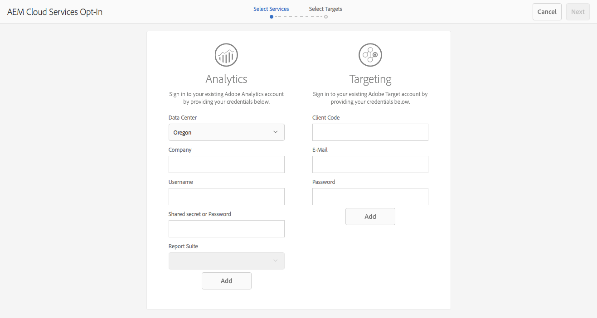

# Scelta di Adobe Analytics e Adobe Target{#opting-into-adobe-analytics-and-adobe-target}

L’AEM dispone di una procedura opt-in per aiutarti a integrarti con Adobe Analytics e Adobe Target. Questa è un’attività preconfigurata e può essere assegnata al gruppo di utenti amministratori.

Quando accedi come amministratore, questa attività (**Configurazione di Analytics e Targeting**) è disponibile da [Casella in entrata](/help/sites-authoring/inbox.md#out-of-the-box-administrative-tasks). In base alle credenziali fornite, consente di configurare e integrare questi servizi.

Sono disponibili le seguenti opzioni per la configurazione dell’integrazione:

* Configura l’integrazione tramite l’attività.

  Questa operazione può essere eseguita immediatamente o in un secondo momento, l’attività rimarrà nella casella in entrata fino a quando non verrà eseguita un’azione. In entrambi i casi la configurazione può essere eseguita direttamente nell’interfaccia utente o con l’utilizzo di un `.properties` file.

* Rinuncia all’integrazione.

  Considera questa opzione se preferisci [configurare manualmente l’integrazione](/help/sites-administering/marketing-cloud.md). Vedi anche [Integrazione dell’AEM con Adobe Target e Adobe Analytics tramite DTM](https://helpx.adobe.com/experience-manager/using/integrate-digital-marketing-solutions.html).

* Configura la configurazione e il provisioning utilizzando uno script.

## Configurazione dell’integrazione {#configuring-the-integration}

Scegli l’integrazione con:

* Analytics per abilitare l’utilizzo delle funzionalità di tracciamento e analisi delle pagine.
* Target per abilitare l’utilizzo delle loro funzionalità di personalizzazione.

Per entrambe le opzioni è necessario fornire le informazioni sull’account utente e specificare le pagine tracciate.

>[!NOTE]
>
>Facoltativamente, puoi fornire informazioni sull’account Analytics e Target utilizzando un file di proprietà che viene letto all’avvio del server. Consulta [Fornitura di informazioni sull&#39;account tramite un file delle proprietà](/help/sites-administering/opt-in.md#providing-account-information-using-a-properties-file).

Quando scegli di partecipare all’integrazione, AEM esegue le seguenti attività:

* Crea le configurazioni cloud che abilitano la connessione ad Analytics e Target.
* Crea i framework che determinano i dati tracciati.
* Configura le pagine web per l’utilizzo di questi servizi.

>[!NOTE]
>
>AT.js è la libreria client predefinita. È configurato in [configurazione servizi cloud di destinazione](/help/sites-administering/target-configuring.md#creating-a-target-cloud-configuration).
>
>L’Adobe consiglia di utilizzare AT.js come libreria client.

Per dare il consenso all’attività precaricata e pronta all’uso:

1. Dal tuo [Casella in entrata, seleziona e **Apri** Configurazione di Analytics e Targeting](/help/sites-authoring/inbox.md#taking-action-on-an-item) attività.

   

1. Per Analytics:

   1. Immetti le informazioni dell’account utente per Analytics, quindi fai clic sul corrispondente **Aggiungi** pulsante.
   1. Le credenziali appropriate sono autenticate.
   1. Una volta autenticato l’account Analytics, seleziona la suite di rapporti Analytics da utilizzare. L’AEM recupera le suite di rapporti di Analytics. Lo stato viene aggiornato a **Aggiunto**.

1. Per Target:

   1. Immetti le informazioni dell’account utente per Target, quindi fai clic sul corrispondente **Aggiungi** pulsante.
   1. Le credenziali appropriate sono autenticate. Lo stato viene aggiornato a **Aggiunto**.

1. Seleziona **Avanti**.
1. Seleziona i siti per i quali utilizzare Analytics e/o Target.

1. Seleziona **Fine** per completare.

   >[!CAUTION]
   >
   >Dopo aver dato il consenso alla configurazione, devi pubblicare il sito o le pagine interessate per replicare queste modifiche nell’istanza di pubblicazione.

## Rinuncia all’integrazione {#opting-out-of-the-integration}

Non partecipare all’integrazione con Analytics e Target quando:

* Non desideri effettuare l’integrazione con questi prodotti.
* Preferisci configurare manualmente le integrazioni.

  Per informazioni sulla configurazione manuale delle integrazioni, consulta [Integrazione con Adobe Analytics](/help/sites-administering/adobeanalytics.md) e [Integrazione con Adobe Target](/help/sites-administering/target.md).

Per rinunciare devi completare l&#39;attività precaricata:

* Dal tuo [Casella in entrata, seleziona e **Completa** Configurazione di Analytics e Targeting](/help/sites-authoring/inbox.md#taking-action-on-an-item) attività.

## Fornitura di informazioni sull&#39;account tramite un file delle proprietà {#providing-account-information-using-a-properties-file}

Installa un file delle proprietà che AEM legge all’avvio del server per configurare le proprietà dell’account per l’integrazione con Analytics e Target. Quando utilizzi il file delle proprietà, la procedura guidata di consenso utilizza automaticamente le proprietà del file e la configurazione cloud viene creata di conseguenza.

Il file delle proprietà è un file di testo denominato marketingcloud.properties salvato nella directory di lavoro utilizzata dal processo AEM (in genere la stessa directory del file JAR). Il file include le seguenti proprietà:

* analytics.server: URL del data center Analytics utilizzato.
* analytics.company: società associata al tuo account utente di Analytics.
* analytics.username: nome utente Analytics.
* analytics.secret: segreto associato al nome utente di Analytics.
* analytics.reportsuite: nome della suite di rapporti di Analytics da utilizzare.
* target.clientcode: il codice client associato al tuo account Target.
* target.email: indirizzo e-mail utilizzato per autenticare l’account Target.
* target.password: password associata al tuo indirizzo e-mail.

Le proprietà e i valori sono separati da segni di uguale (=). Le proprietà di Analytics hanno il prefisso `analytics`, e le proprietà Target hanno il prefisso `target`. Per configurare un servizio, fornisci i valori per tutte le proprietà del servizio. Se non desideri configurare un servizio, non fornire alcun valore per tale servizio.

Il seguente esempio `.properties` Il file include i valori delle proprietà per la creazione di una configurazione cloud per Analytics:

```xml
analytics.server=https://test.omniture.com/login/
analytics.company=MyCompany
analytics.username=sbroders
analytics.secret=12345678
analytics.reportsuite=myreportsuite
target.clientcode=
target.email=
target.password=
```

La procedura seguente descrive come effettuare il consenso all’integrazione utilizzando il file delle proprietà.

1. Creare `marketingcloud.properties` nella directory di lavoro utilizzata dal processo AEM (istanza di authoring).

   >[!NOTE]
   >
   >La directory di lavoro è in genere la directory che contiene il file jar o `license.properties` file.
   >
   >Tuttavia, può anche essere definito come percorso assoluto dalla proprietà di sistema:
   >
   >`mac.provisioning.file.container`

1. Aggiungi i valori delle proprietà in base all’account Analytics e/o Target.
1. Avviare o riavviare il server, quindi accedere utilizzando un account amministratore.
1. Apri l’attività Configure Analytics &amp; Targeting (Configura analisi e destinazione) come descritto in [Configurazione dell’integrazione](/help/sites-administering/opt-in.md#configuring-the-integration). Invece di richiedere le informazioni sull’account, la procedura guidata utilizza i valori di `.properties` file.

   Seleziona **Aggiungi** per il servizio appropriato, quindi continuare con la procedura guidata.

   

## Informazioni sulle configurazioni cloud {#about-the-cloud-configurations}

Quando configuri l’integrazione con Analytics e Target, AEM crea automaticamente le configurazioni e i framework cloud richiesti. Ad esempio, la configurazione cloud di Analytics è denominata Account Analytics con provisioning.

Non è necessario modificare le configurazioni cloud. Tuttavia, puoi configurare i framework in base alle esigenze. (vedere [Mappatura dei dati dei componenti con le proprietà di Adobe Analytics](/help/sites-administering/adobeanalytics-mapping.md) e [Aggiungere un framework Target](/help/sites-administering/target.md).)

>[!NOTE]
>
>Per impostazione predefinita, quando scegli di accedere alla procedura guidata di configurazione di Adobe Target, il targeting accurato è abilitato.
>
>Il targeting accurato significa che la configurazione del servizio cloud attende il caricamento del contesto prima di caricare il contenuto. Di conseguenza, in termini di prestazioni, un targeting accurato può creare un ritardo di alcuni millisecondi prima del caricamento del contenuto.
>
>Il targeting accurato è sempre abilitato nell’istanza di authoring. Tuttavia, nell’istanza di pubblicazione puoi scegliere di disattivare il targeting accurato a livello globale cancellando il segno di spunta accanto a Targeting accurato nella configurazione del servizio cloud (**http://localhost:4502/etc/cloudservices.html**). Puoi inoltre attivare e disattivare il targeting accurato per i singoli componenti indipendentemente dall’impostazione nella configurazione del servizio cloud.
>
>Se hai ***già*** creato i componenti di destinazione e modificato questa impostazione, le modifiche non influiscono su tali componenti. Devi apportare le modifiche direttamente a tali componenti.

>[!CAUTION]
>
>Quando scegli di partecipare alla configurazione di Analytics e a un `reportsuite` , il framework è limitato alla modalità di esecuzione di pubblicazione. Ciò significa che il tracciamento funziona solo sull’istanza Publish.
>
>Se il tracciamento è necessario anche in un’istanza di authoring, il valore deve essere modificato in `all`.

## Configurazione della configurazione e del provisioning tramite script {#configuring-the-setup-and-provisioning-via-script}

In qualità di amministratore, è possibile attivare la configurazione e il provisioning con uno script anziché eseguire manualmente la procedura guidata. A tale scopo, puoi effettuare le seguenti operazioni:

* Invio di una richiesta POST a **/libs/cq/cloudservicesprovisioning/content/autoprovisioning.json** con i parametri richiesti.

I parametri inviati dipendono dai seguenti elementi:

* Se desideri utilizzare il **marketingcloud.properties** compilato con tutte le credenziali richieste, è necessario inviare i seguenti parametri:

   * `automaticProvisioning`= `true`
   * `servicename`= `analytics|target`
   * `path`=percorso di una pagina AEM a cui allegare le configurazioni dei servizi cloud create

  Ad esempio, una richiesta curl che crea configurazioni sia di Analytics che di Target e le allega alla pagina we.retail è:

  ```shell
  curl -v -u admin:admin -X POST -d"automaticProvisioning=true&servicename=target&servicename=analytics&path=/content/we-retail" http://localhost:4502/libs/cq/cloudservicesprovisioning/content/autoprovisioning.json
  ```

* Se non si desidera utilizzare il **marketingcloud.properties** quindi è necessario inviare le credenziali e i parametri. Ad esempio:
   * automaticProvisioning= `true`
   * servicename= `analytics|target`
   * path=path to an AEM page to attach the created cloud services configs; è possibile definire più percorsi
   * analytics.server= `https://servername`
   * analytics.company= `Name of company`
   * analytics.username= `me`
   * analytics.secret= `secret`
   * analytics.reportsuite= `we-retail`
   * target.clientcode= `mycompany`
   * target.email= `me@adobe.com`
   * target.password= `password`

  In questo caso, la richiesta curl che crea configurazioni sia di Analytics che di Target e le allega alla pagina we-retail è:

  ```shell
  curl -v -u admin:admin -X POST -d"automaticProvisioning=false&servicename=target&servicename=analytics&path=/content/we-retail&analytics.server=https://servername/&analytics.company=Name of company&analytics.username=me&analytics.secret=secret&analytics.reportsuite=weretail&target.clientcode=mycompany&target.email=me@adobe.com&target.password=password" http://localhost:4502/libs/cq/cloudservicesprovisioning/content/autoprovisioning.json
  ```
