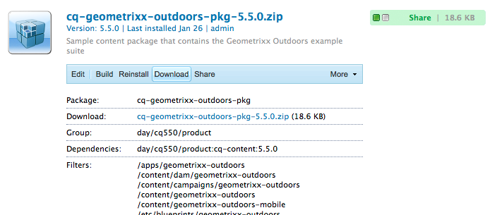

# Come lavorare con i pacchetti{#how-to-work-with-packages}

I pacchetti consentono l&#39;importazione e l&#39;esportazione del contenuto del repository. Ad esempio, puoi utilizzare i pacchetti per installare nuove funzionalità, trasferire contenuti tra le istanze e eseguire il backup del contenuto dell’archivio.

I pacchetti sono accessibili e/o mantenuti dalle pagine seguenti:

* [Package Manager](#package-manager), che consente di gestire i pacchetti nell’istanza AEM locale.

* [Distribuzione di software](#software-distribution), un server centralizzato che contiene sia i pacchetti disponibili al pubblico che quelli privati per la tua azienda. I pacchetti pubblici possono contenere hotfix, nuove funzionalità, documentazione, ecc.

Puoi trasferire i pacchetti tra Gestione pacchetti, Distribuzione software e il file system.

## Cosa sono i pacchetti? {#what-are-packages}

Un pacchetto è un file zip che tiene il contenuto dell’archivio sotto forma di una serializzazione del file system (chiamata serializzazione &quot;vault&quot;). Questo fornisce una rappresentazione semplice da usare e modificare di file e cartelle.

I pacchetti includono contenuto, sia contenuto di pagina che contenuto relativo al progetto, selezionato utilizzando i filtri.

Un pacchetto contiene anche metadati vault, incluse le definizioni del filtro e le informazioni di configurazione dell&#39;importazione. Nel pacchetto possono essere incluse ulteriori proprietà di contenuto (non utilizzate per l’estrazione del pacchetto), ad esempio una descrizione, un’immagine visiva o un’icona; queste proprietà sono riservate al consumatore del pacchetto di contenuti e solo a scopo informativo.

>[!NOTE]
>
>I pacchetti rappresentano la versione corrente del contenuto al momento della creazione del pacchetto. Non includono versioni precedenti del contenuto AEM conservato nell’archivio.

Puoi eseguire le seguenti azioni su o con i pacchetti:

* Creare nuovi pacchetti; definizione delle impostazioni del pacchetto e dei filtri in base alle esigenze
* Anteprima del contenuto del pacchetto (prima della generazione)
* Creare pacchetti
* Visualizza informazioni sul pacchetto
* Visualizza il contenuto del pacchetto (dopo la creazione)
* Modificare la definizione dei pacchetti esistenti
* Rigenera i pacchetti esistenti
* Riavvolgere i pacchetti
* Scarica i pacchetti da AEM al tuo file system
* Caricare pacchetti dal file system nell&#39;istanza AEM locale
* Convalida il contenuto del pacchetto prima dell’installazione
* Eseguire un&#39;installazione a secco
* Installa i pacchetti (AEM non installa automaticamente i pacchetti dopo il caricamento)
* Elimina pacchetti
* Scaricare pacchetti, come hotfix, dalla libreria di distribuzione software
* Carica i pacchetti nella sezione aziendale interna della libreria Distribuzione software

## Informazioni sul pacchetto {#package-information}

Una definizione del pacchetto è composta da vari tipi di informazioni:

* [Impostazioni pacchetto](#package-settings)
* [Filtri del pacchetto](#package-filters)
* [Schermate del pacchetto](#package-screenshots)
* [Icone del pacchetto](#package-icons)

### Impostazioni pacchetto {#package-settings}

Puoi modificare diverse impostazioni del pacchetto per definire aspetti quali la descrizione del pacchetto, i bug correlati, le dipendenze e le informazioni sul provider.

La finestra di dialogo **Impostazioni pacchetto** è disponibile tramite il pulsante **Modifica** quando [crei](#creating-a-new-package) o [modifica](#viewing-and-editing-package-information) un pacchetto e fornisce tre schede per la configurazione. Dopo aver apportato delle modifiche, fai clic su **OK** per salvarle.


| **Campo** | **Descrizione** |
|---|---|
| Nome | Nome del pacchetto. |
| Gruppo | Nome del gruppo a cui aggiungere il pacchetto, per organizzare i pacchetti. Digitare il nome di un nuovo gruppo o selezionare un gruppo esistente. |
| Versione | Testo da utilizzare per la versione personalizzata. |
| Descrizione | Breve descrizione del pacchetto. Il markup HTML può essere utilizzato per la formattazione. |
| Miniatura  | Icona visualizzata con l’elenco dei pacchetti. Fare clic su Sfoglia per selezionare un file locale. |


<table>
 <tbody>
  <tr>
   <th><strong>Campo</strong></th>
   <th><strong>Descrizione</strong></th>
   <th><strong>Formato/Esempio</strong></th>
  </tr>
  <tr>
   <td>Nome</td>
   <td>Nome del provider.</td>
   <td><em>Geometrixx AEM<br /> </em></td>
  </tr>
  <tr>
   <td>URL</td>
   <td>URL del provider.</td>
   <td><em>https://www.aem-geometrixx.com</em></td>
  </tr>
  <tr>
   <td>Collegamento</td>
   <td>Collegamento specifico per il pacchetto a una pagina del provider.</td>
   <td><em>https://www.aem-geometrixx.com/mypackage.html</em></td>
  </tr>
  <tr>
   <td>Richiede<br /> </td>
   <td>
    <ul>
     <li>Amministratore: Seleziona quando il pacchetto può essere installato solo da un account con privilegi di amministratore.</li>
     <li>Riavvia: Seleziona quando il server deve essere riavviato dopo l'installazione del pacchetto.</li>
    </ul> </td>
   <td> </td>
  </tr>
  <tr>
   <td>Gestione AC</td>
   <td><p>Specifica come vengono gestite le informazioni sul controllo di accesso definite nel pacchetto quando il pacchetto viene importato:</p>
    <ul>
     <li><strong>Ignora</strong></li>
     <li><strong>Sovrascrivi</strong></li>
     <li><strong>Unisci</strong></li>
     <li><strong>Cancella</strong></li>
     <li><strong>MergePreserve</strong></li>
    </ul> <p>Il valore predefinito è <strong>Ignore</strong>.</p> </td>
   <td>
    <ul>
     <li><strong>Ignora</strong>  - Mantieni ACL nel repository</li>
     <li><strong>Sovrascrivi</strong>  - sovrascrivi ACL nel repository</li>
     <li><strong>Unione</strong> : unisci entrambi i set di ACL</li>
     <li><strong>Cancella</strong>  - cancella ACL</li>
     <li><strong>MergePreserve</strong> : consente di unire il controllo di accesso nel contenuto con quello fornito con il pacchetto aggiungendo le voci di controllo di accesso delle entità principali non presenti nel contenuto</li>
    </ul> </td>
  </tr>
 </tbody>
</table>


| **Campo** | **Descrizione** | **Formato/Esempio** |
|---|---|---|
| Testato con | Il nome e la versione del prodotto a cui è destinato il pacchetto o con cui è compatibile. | *AEM6* |
| Bug/problemi risolti | Campo di testo che consente di elencare i dettagli dei bug corretti con questo pacchetto. Elenca ogni bug su una riga separata. | riepilogo bug-nr |
| Dipende da | Elenca le informazioni di dipendenza che devono essere rispettate ogni volta che altri pacchetti sono necessari per consentire l&#39;esecuzione del pacchetto corrente come previsto. Questo campo è importante quando si utilizzano gli hotfix. | groupId:name:version |
| Sostituisce | Elenco dei pacchetti obsoleti che questo pacchetto sostituisce. Prima di eseguire l&#39;installazione, controlla che questo pacchetto includa tutti i contenuti necessari dai pacchetti obsoleti in modo che nessun contenuto venga sovrascritto. | groupId:name:version |

### Filtri del pacchetto {#package-filters}

I filtri identificano i nodi del repository da includere nel pacchetto. A **Definizione filtro** specifica le seguenti informazioni:

* Il **percorso principale** del contenuto da includere.
* **** Regole che includono o escludono nodi specifici sotto il percorso principale.

I filtri possono includere zero o più regole. Quando non sono definite regole, il pacchetto contiene tutto il contenuto presente nel percorso principale.

Puoi definire una o più definizioni di filtro per un pacchetto. Utilizza più di un filtro per includere il contenuto di più percorsi principali.


La tabella seguente descrive queste regole e fornisce esempi:

<table>
 <tbody>
  <tr>
   <th> Tipo di regola</th>
   <th>Descrizione </th>
   <th>Esempio </th>
  </tr>
  <tr>
   <td> includi</td>
   <td>È possibile definire un percorso o utilizzare un'espressione regolare per specificare tutti i nodi che si desidera includere.<br /> <br /> L’inclusione di una directory comporta le seguenti operazioni:
    <ul>
     <li>includere la directory <i>e</i> tutti i file e le cartelle presenti in tale directory (ovvero l'intero sottoalbero)</li>
     <li><strong></strong> non includere altri file o cartelle dal percorso principale specificato</li>
    </ul> </td>
   <td>/libs/sling/install(/.*)? </td>
  </tr>
  <tr>
   <td> escludi</td>
   <td>Puoi specificare un percorso o utilizzare un'espressione regolare per specificare tutti i nodi da escludere.<br /> <br /> L’esclusione di una directory esclude tale directory  <i></i> e tutti i file e le cartelle presenti in tale directory (ovvero l’intera sottostruttura).<br /> </td>
   <td>/libs/wcm/foundation/components(/.*)?</td>
  </tr>
 </tbody>
</table>

>[!NOTE]
>
>Un pacchetto può contenere più definizioni di filtro, in modo che i nodi da posizioni diverse possano essere facilmente combinati in un unico pacchetto.

I filtri dei pacchetti sono definiti più spesso al momento della prima [creazione del pacchetto](#creating-a-new-package), ma possono essere modificati anche in un secondo momento (dopo di che il pacchetto deve essere ricostruito).

### Schermate del pacchetto {#package-screenshots}

Puoi allegare le schermate al pacchetto per fornire una rappresentazione visiva dell’aspetto del contenuto; ad esempio, fornendo schermate di nuove funzionalità.

### Icone del pacchetto {#package-icons}

Puoi anche allegare un’icona al pacchetto per fornire una rappresentazione visiva di riferimento rapido di ciò che contiene il pacchetto. Questo viene quindi mostrato nell&#39;elenco dei pacchetti e può aiutarti a identificare facilmente il pacchetto, o la classe del pacchetto.

Poiché un pacchetto può contenere un’icona, le seguenti convenzioni vengono utilizzate per i pacchetti ufficiali:

>[!NOTE]
>
>Per evitare confusione, utilizza un’icona descrittiva per il pacchetto e non utilizzare una delle icone ufficiali.

Pacchetto Hotfix ufficiale:


Pacchetto di installazione o estensione AEM ufficiale:

Feature pack ufficiale:


## Gestione pacchetti {#package-manager}

Gestione pacchetti gestisce i pacchetti nell’installazione AEM locale. Dopo aver [assegnato le autorizzazioni necessarie](#permissions-needed-for-using-the-package-manager) puoi utilizzare Gestione pacchetti per varie azioni, tra cui configurazione, creazione, download e installazione dei pacchetti. Gli elementi chiave da configurare sono:

* [Impostazioni pacchetto](#package-settings)
* [Filtri del pacchetto](#package-filters)

### Autorizzazioni necessarie per l’utilizzo di Gestione pacchetti {#permissions-needed-for-using-the-package-manager}

Per concedere agli utenti il diritto di creare, modificare, caricare e installare pacchetti, devi assegnare loro le autorizzazioni appropriate nelle seguenti posizioni:

* **/etc/packages** (diritti completi esclusa la cancellazione)
* il nodo che contiene il contenuto del pacchetto

>[!CAUTION]
>
>La concessione di autorizzazioni sui pacchetti può portare alla divulgazione di informazioni sensibili e alla perdita di dati.
>
>Per limitare questi rischi, si consiglia vivamente di concedere autorizzazioni di gruppo specifiche solo sui sottoalberi dedicati, ad esempio `/etc/packages/site-content`.

Per istruzioni sulla modifica delle autorizzazioni, consulta [Impostazione delle autorizzazioni](/help/sites-administering/security.md#setting-page-permissions) .

### Creazione di un nuovo pacchetto {#creating-a-new-package}

Per creare una nuova definizione di pacchetto:

1. Nella schermata di benvenuto AEM fare clic su **Pacchetti** oppure nella console **Strumenti** fare doppio clic su **Pacchetti**.

1. Quindi seleziona **Gestione pacchetti**.
1. Fai clic su **Crea pacchetto**.

   >[!NOTE]
   >
   >Se l’istanza dispone di molti pacchetti, potrebbe essere presente una struttura di cartelle, in modo da poter passare alla cartella di destinazione richiesta prima di creare il nuovo pacchetto.

1. Nella finestra di dialogo:

   

   Inserisci:

   * **Nome gruppo**

      Nome del gruppo di destinazione (o della cartella). I gruppi sono destinati ad essere utilizzati per organizzare i pacchetti.

      Se non esiste già, verrà creata una cartella per il gruppo. Se lasci vuoto il nome del gruppo, verrà creato il pacchetto nell&#39;elenco dei pacchetti principali (Home > Pacchetti).

   * **Nome pacchetto**

      Nome del nuovo pacchetto. Seleziona un nome descrittivo per identificare facilmente il contenuto del pacchetto.

   * **Versione**

      Campo di testo per indicare una versione. Questo verrà aggiunto al nome del pacchetto per formare il nome del file zip.
   Fai clic su **OK** per creare il pacchetto.

1. AEM elenca il nuovo pacchetto nella cartella di gruppo appropriata.

   

   Fai clic sull&#39;icona o sul nome del pacchetto da aprire.

   

   >[!NOTE]
   >
   >Se necessario, puoi tornare a questa pagina in un secondo momento.

1. Fai clic su **Modifica** per modificare le impostazioni del [pacchetto](#package-settings).

   Qui puoi aggiungere informazioni e/o definire determinate impostazioni; ad esempio, questi includono una descrizione, l&#39; [icona](#package-icons), i bug correlati e aggiungere i dettagli del provider.

   Dopo aver completato la modifica delle impostazioni, fare clic su **OK**.

1. Aggiungi **[Schermate](#package-screenshots)** al pacchetto come necessario. È disponibile un&#39;istanza quando il pacchetto viene creato. Se necessario, aggiungi di più utilizzando **Package Screenshot** dalla barra laterale.

   Aggiungi l&#39;immagine effettiva facendo doppio clic sul componente immagine nell&#39;area **Schermate**, aggiungendo un&#39;immagine e facendo clic su **OK**.

1. Definisci i **[Filtri pacchetto](#package-filters)** trascinando le istanze del **Definizione filtro** dalla barra laterale, quindi fai doppio clic per aprire per la modifica:

   

   Specifica:

   * **Root**
PathIl contenuto da imballare; può essere la radice di un sottoalbero.
   * ****
Le regole sono facoltative; per le semplici definizioni dei pacchetti, non è necessario specificare regole di inclusione o esclusione.

      Se necessario, puoi definire le regole [**Includi** o **Escludi**](#package-filters) per definire esattamente il contenuto del pacchetto.

      Aggiungi le regole utilizzando il simbolo **+**, in alternativa rimuovi le regole utilizzando il simbolo **-**. Le regole vengono applicate in base al loro ordine in modo da posizionarle come necessario utilizzando i pulsanti **Su** e **Giù** .
   Quindi fai clic su **OK** per salvare il filtro.

   >[!NOTE]
   >
   >È possibile utilizzare tutte le definizioni di filtro necessarie, anche se è necessario fare attenzione a non creare conflitti. Utilizza **Anteprima** per confermare quale sarà il contenuto del pacchetto.

1. Per confermare il contenuto del pacchetto, puoi utilizzare **Anteprima**. Questo esegue una prova del processo di compilazione ed elenca tutti gli elementi che verranno aggiunti al pacchetto quando viene effettivamente generato.
1. Ora puoi [Generare](#building-a-package) il pacchetto.

   >[!NOTE]
   >
   >Non è obbligatorio costruire il pacchetto a questo punto, può essere fatto in un momento successivo.

### Creazione di un pacchetto {#building-a-package}

Un pacchetto viene spesso generato contemporaneamente alla [creazione della definizione del pacchetto](#creating-a-new-package), ma puoi tornare in un secondo momento per generare o ricreare il pacchetto. Questo può essere utile se il contenuto all’interno dell’archivio è stato modificato.

>[!NOTE]
>
>Prima di costruire il pacchetto può essere utile visualizzare in anteprima il contenuto del pacchetto. A questo scopo, fai clic su **Anteprima**.

1. Apri la definizione del pacchetto da **Gestione pacchetti** (fai clic sull&#39;icona o sul nome del pacchetto).

1. Fare clic su **Build**. Una finestra di dialogo richiede la conferma che desideri creare il pacchetto.

   >[!NOTE]
   >
   >Questo è di particolare importanza quando si sta ricostruendo un pacchetto in quanto il contenuto del pacchetto verrà sovrascritto.

1. Fai clic su **OK**. AEM il pacchetto, elencando tutti i contenuti aggiunti al pacchetto così come lo fa. Quando completato AEM visualizza una conferma della generazione del pacchetto e (quando chiudi la finestra di dialogo) aggiorna le informazioni sull’elenco dei pacchetti.

### Ritorno a capo di un pacchetto {#rewrapping-a-package}

Una volta costruito un pacchetto, è possibile riavvolgerlo, se necessario.

Il rewrapping modifica le informazioni sul pacchetto - *senza* modificare il contenuto del pacchetto. Le informazioni sul pacchetto sono la miniatura, la descrizione, ecc., in altre parole tutto ciò che è possibile modificare con la finestra di dialogo **Impostazioni pacchetto** (per aprire questo clic su **Modifica**).

Un caso d&#39;uso importante per il ritorno a capo è quando si prepara un pacchetto. Ad esempio, potresti avere un pacchetto esistente e decidere di condividerlo con altri. Per aggiungere una miniatura e una descrizione. Invece di ricreare l&#39;intero pacchetto con tutte le sue funzionalità (che potrebbero richiedere un po&#39; di tempo e correre il rischio che il pacchetto non sia più identico all&#39;originale) puoi racchiuderlo e aggiungere semplicemente la miniatura e la descrizione.

1. Apri la definizione del pacchetto da **Gestione pacchetti** (fai clic sull&#39;icona o sul nome del pacchetto).

1. Fai clic su **Modifica** e aggiorna **[Impostazioni pacchetto](#package-settings)** come necessario. Fate clic su **OK** per salvare. 

1. Fai clic su **Ravvolgi** per richiedere una conferma in una finestra di dialogo.

### Visualizzazione e modifica delle informazioni sui pacchetti {#viewing-and-editing-package-information}

Per visualizzare o modificare le informazioni sulla definizione di un pacchetto:

1. In Gestione pacchetti individua il pacchetto da visualizzare.
1. Fai clic sull’icona del pacchetto che desideri visualizzare. Verrà aperta la pagina del pacchetto in cui sono elencate le informazioni sulla definizione del pacchetto:

   

   >[!NOTE]
   >
   >Puoi anche modificare ed eseguire determinate azioni sul pacchetto da questa pagina.
   >
   >I pulsanti disponibili dipendono dal fatto che il pacchetto sia già stato creato o meno.

1. Se il pacchetto è già stato generato, fare clic su **Sommario**, verrà aperta una finestra in cui sono elencati tutti i contenuti del pacchetto:

### Visualizzazione del contenuto del pacchetto e verifica dell’installazione {#viewing-package-contents-and-testing-installation}

Dopo aver creato un pacchetto puoi visualizzarne il contenuto:

1. In Gestione pacchetti individua il pacchetto da visualizzare.
1. Fai clic sull’icona del pacchetto che desideri visualizzare. Verrà aperta la pagina del pacchetto contenente informazioni sulla definizione del pacchetto.

1. Per visualizzare il contenuto fare clic su **Sommario**, viene aperta una finestra in cui sono elencati tutti i contenuti del pacchetto:

   

1. Per eseguire una prova dell&#39;installazione, fare clic su **Test Installation**. Dopo aver confermato l’azione, viene aperta una finestra in cui sono elencati i risultati come se l’installazione fosse stata eseguita:

   

### Download dei pacchetti nel file system {#downloading-packages-to-your-file-system}

Questa sezione descrive come scaricare un pacchetto da AEM al file system utilizzando **Gestione pacchetti**.

1. Nella schermata di benvenuto AEM fare clic su **Pacchetti**, quindi selezionare **Gestione pacchetti**.
1. Passa al pacchetto da scaricare.

   

1. Fare clic sul collegamento formato dal nome del file zip (sottolineato) per il pacchetto che si desidera scaricare; ad esempio `export-for-offline.zip`.

   AEM scaricare il pacchetto sul computer (utilizzando una finestra di dialogo standard per il download del browser).

### Caricamento dei pacchetti dal file system {#uploading-packages-from-your-file-system}

Il caricamento di un pacchetto consente di caricare un pacchetto dal file system in Gestione pacchetti AEM.
Per caricare un pacchetto:

1. Passa a **Gestione pacchetti**. Quindi nella cartella del gruppo in cui desideri caricare il pacchetto.

   

1. Fai clic su **Carica pacchetto**.

   

   * **File**

      È possibile digitare direttamente il nome del file oppure utilizzare il **Sfoglia..Finestra di dialogo** per selezionare il pacchetto richiesto dal file system locale (dopo la selezione fare clic su **OK**).

   * **Forza caricamento**

      Se esiste già un pacchetto con questo nome, puoi fare clic su di esso per forzare il caricamento (e sovrascrivere il pacchetto esistente).
   Fai clic su **OK** in modo che il nuovo pacchetto venga caricato ed elencato nell&#39;elenco Gestione pacchetti.

   >[!NOTE]
   >
   >Per rendere il contenuto disponibile a AEM, assicurati di [installare il pacchetto](#installing-packages).

### Convalida dei pacchetti {#validating-packages}

Prima di installare un pacchetto, potrebbe essere utile verificarne il contenuto. Poiché i pacchetti possono modificare i file sovrapposti sotto `/apps` e/o aggiungere, modificare e rimuovere ACL, spesso è utile convalidare queste modifiche prima di installare.

#### Opzioni di convalida {#validation-options}

Il meccanismo di convalida può controllare le seguenti caratteristiche del pacchetto:

* Importazioni dei pacchetti OSGi
* Sovrapposizioni
* ACL

Queste opzioni sono descritte di seguito.

* **Convalida importazioni di pacchetti OSGi**

   **Elementi controllati**

   Questa convalida esamina il pacchetto per tutti i file JAR (bundle OSGi), estrae il loro `manifest.xml` (che contiene le dipendenze con le versioni su cui si basa il bundle OSGi) e verifica le dipendenze dell&#39;istanza AEM esportate con le versioni corrette.

   **Come viene segnalato**

   Tutte le dipendenze con versione che non possono essere soddisfatte dall&#39;istanza AEM sono elencate nel **Registro attività** di Gestione pacchetti.

   **Stati di errore**

   Se le dipendenze non sono soddisfatte, i bundle OSGi nel pacchetto con quelle dipendenze non si avvieranno. Questo si traduce in una distribuzione non funzionante dell&#39;applicazione, in quanto tutto ciò che si basa sul bundle OSGi non avviato a sua volta non funzionerà correttamente.

   **Risoluzione degli errori**

   Per risolvere gli errori dovuti ai bundle OSGi non soddisfatti, è necessario modificare la versione della dipendenza nel bundle con importazioni non soddisfatte.

* **Convalida sovrapposizioni**

   **Elementi controllati**

   Questa convalida determina se il pacchetto installato contiene un file già sovrapposto nell&#39;istanza AEM di destinazione.

   Ad esempio, se disponi di una sovrapposizione esistente in `/apps/sling/servlet/errorhandler/404.jsp`, un pacchetto che contiene `/libs/sling/servlet/errorhandler/404.jsp` in modo da modificare il file esistente in `/libs/sling/servlet/errorhandler/404.jsp`.

   **Come viene segnalato**

   Tali sovrapposizioni sono descritte nel **Registro attività** di Gestione pacchetti.

   **Stati di errore**

   Uno stato di errore indica che il pacchetto sta tentando di distribuire un file già sovrapposto, pertanto le modifiche nel pacchetto verranno sostituite (e quindi &quot;nascoste&quot;) dalla sovrapposizione e non avranno effetto.

   **Risoluzione degli errori**

   Per risolvere questo problema, il gestore del del file di sovrapposizione in `/apps` deve rivedere le modifiche al file di sovrapposizione in `/libs` e incorporare le modifiche necessarie nella sovrapposizione ( `/apps`), quindi ridistribuire il file di sovrapposizione.

   >[!NOTE]
   >
   >Il meccanismo di convalida non consente di eseguire la riconciliazione se il contenuto sovrapposto è stato correttamente incorporato nel file di sovrapposizione. Pertanto questa convalida continuerà a segnalare i conflitti anche dopo aver apportato le modifiche necessarie.

* **Convalida ACL**

   **Elementi controllati**

   Questa convalida verifica quali autorizzazioni vengono aggiunte, come verranno gestite (unione/sostituzione) e se le autorizzazioni correnti saranno interessate.

   **Come viene segnalato**

   Le autorizzazioni sono descritte nel **Registro attività** di Gestione pacchetti.

   **Stati di errore**

   Non è possibile fornire errori espliciti. La convalida indica semplicemente se eventuali nuove autorizzazioni ACL verranno aggiunte o influenzate dall&#39;installazione del pacchetto.

   **Risoluzione degli errori**

   Utilizzando le informazioni fornite dalla convalida, i nodi interessati possono essere rivisti in CRXDE e le ACL possono essere regolate nel pacchetto come necessario.

   >[!CAUTION]
   >
   >Come best practice, si consiglia di non influenzare gli ACL forniti da AEM, in quanto ciò potrebbe causare un comportamento imprevisto del prodotto.

#### Esecuzione della convalida {#performing-validation}

La convalida dei pacchetti può essere eseguita in due modi diversi:

* Tramite l’interfaccia utente di Gestione pacchetti
* Tramite richiesta HTTP POST, ad esempio con cURL

>[!NOTE]
>
>La convalida deve sempre verificarsi dopo il caricamento del pacchetto ma prima di installarlo.

**Convalida del pacchetto tramite Gestione pacchetti**

1. Apri Gestione pacchetti in `https://<server>:<port>/crx/packmgr`
1. Seleziona il pacchetto nell&#39;elenco, quindi seleziona il menu a discesa **Altro** dall&#39;intestazione e quindi **Convalida** dal menu a discesa.

   >[!NOTE]
   >
   >Questa operazione deve essere eseguita dopo il caricamento del pacchetto di contenuti, ma prima di installare il pacchetto.

1. Nella finestra di dialogo modale visualizzata, utilizzare le caselle di controllo per selezionare i tipi di convalida e iniziare la convalida facendo clic su **Convalida**. In alternativa, fai clic su **Annulla**.

1. Vengono quindi eseguite le convalide selezionate. I risultati vengono visualizzati nel registro attività di Gestione pacchetti.

**Convalida Del Pacchetto Tramite Richiesta HTTP POST**

La richiesta di POST si presenta come segue.

```
https://<host>:<port>/crx/packmgr/service.jsp?cmd=validate&type=osgiPackageImports,overlays,acls
```

>[!NOTE]
>
>Il parametro `type` può essere qualsiasi elenco non ordinato separato da virgole composto da:
>
>* `osgiPackageImports`
>* `overlays`
>* `acls`

>
>
Il valore di `type` viene impostato automaticamente su `osgiPackageImports` se non viene passato.

Di seguito è riportato un esempio di utilizzo di cURL per eseguire una convalida del pacchetto.

1. Se utilizzi cURL, esegui un’istruzione simile alla seguente:

   ```shell
   curl -v -X POST --user admin:admin -F file=@/Users/SomeGuy/Desktop/core.wcm.components.all-1.1.0.zip 'http://localhost:4502/crx/packmgr/service.jsp?cmd=validate&type=osgiPackageImports,overlays,acls'
   ```

1. La convalida richiesta viene eseguita e la risposta viene inviata nuovamente come oggetto JSON.

>[!NOTE]
>
>La risposta a una richiesta HTTP POST di convalida sarà un oggetto JSON con i risultati della convalida.

### Installazione dei pacchetti {#installing-packages}

Dopo aver caricato un pacchetto, devi installare il contenuto. Per avere installato e funzionante il contenuto del pacchetto, è necessario che sia:

* caricato in AEM (sia [caricato dal file system](#uploading-packages-from-your-file-system) o scaricato da [Distribuzione di software](#software-distribution))

* installati

>[!CAUTION]
>
>L’installazione di un pacchetto può sovrascrivere o eliminare il contenuto esistente. Carica un pacchetto solo se sei sicuro che non elimini o sovrascrivi il contenuto necessario.
>
>Per visualizzare il contenuto o l’impatto di un pacchetto puoi:
>
>* Esegui un&#39;installazione di prova del pacchetto senza modificare nessuno dei contenuti:
   >  Apri il pacchetto (fai clic sull&#39;icona o sul nome del pacchetto) e fai clic su **Test Install**.
   >
   >
* Vedi un elenco dei contenuti del pacchetto:
   >  Apri il pacchetto e fai clic su **Sommario**.

>


>[!NOTE]
>
>Immediatamente prima dell&#39;installazione del pacchetto, viene creato un pacchetto di snapshot che contiene il contenuto che verrà sovrascritto.
>
>Questa istantanea verrà reinstallata se/quando disinstalli il pacchetto.

>[!CAUTION]
>
>Se stai installando risorse digitali, devi:
>
>* Per prima cosa, disattiva WorkflowLauncher.
   >  Utilizza l’opzione di menu Componenti della console OSGi per disattivare `com.day.cq.workflow.launcher.impl.WorkflowLauncherImpl`.
   >
   >
* Al termine dell’installazione, riattiva WorkflowLauncher.
>
>
La disattivazione di WorkflowLauncher assicura che il framework di Importazione risorse non manipoli (involontariamente) le risorse al momento dell’installazione.

1. In Gestione pacchetti individua il pacchetto da installare.

   Un pulsante **Installa** viene visualizzato sul lato dei pacchetti che non sono ancora stati installati.

   >[!NOTE]
   >
   >In alternativa, puoi aprire il pacchetto facendo clic sulla relativa icona per accedere al pulsante **Installa**.

1. Fai clic su **Installa** per avviare l&#39;installazione. Viene visualizzata una finestra di dialogo per richiedere conferma ed elencare tutte le modifiche in corso. Al termine, fai clic su **Chiudi** nella finestra di dialogo.

   La parola **Installed** viene visualizzata accanto al pacchetto dopo che è stato installato.

### Caricamento e installazione basati su file system {#file-system-based-upload-and-installation}

Esiste un modo alternativo per caricare e installare i pacchetti nell’istanza. Nel file system, accanto al file jar e al file `license.properties` è presente una cartella `crx-quicksart`. È necessario creare una cartella denominata `install` in `crx-quickstart`. Avrete quindi qualcosa come questo: `<aem_home>/crx-quickstart/install`

In questa cartella di installazione, puoi aggiungere direttamente i tuoi pacchetti. Vengono caricati e installati automaticamente nell’istanza. Al termine, puoi visualizzare i pacchetti in Gestione pacchetti.

Se l’istanza è in esecuzione, l’aggiunta di un pacchetto alla cartella `install` avvia direttamente il caricamento e l’installazione sull’istanza. Se l&#39;istanza non è in esecuzione, i pacchetti inseriti nella cartella `install` verranno installati all&#39;avvio in ordine alfabetico.

>[!NOTE]
>
>Puoi anche farlo prima di avviare l’istanza per la prima volta. A questo scopo, devi creare manualmente la cartella `crx-quickstart` , creare la cartella `install` al suo interno e inserire i pacchetti in essa. Quindi, quando avvii la tua istanza per la prima volta, i pacchetti verranno installati in ordine alfabetico.

### Disinstallazione dei pacchetti {#uninstalling-packages}

AEM consente di disinstallare i pacchetti. Questa azione ripristina il contenuto dell’archivio interessato allo snapshot effettuato immediatamente prima dell’installazione del pacchetto.

>[!NOTE]
>
>Al momento dell’installazione, viene creato un pacchetto di snapshot contenente il contenuto che verrà sovrascritto.
>
>Questo pacchetto verrà reinstallato quando disinstallerai il pacchetto.

1. In Gestione pacchetti individua il pacchetto da disinstallare.
1. Fai clic sull&#39;icona del pacchetto da disinstallare.
1. Fai clic su **Disinstalla** per rimuovere il contenuto di questo pacchetto dall&#39;archivio. Viene visualizzata una finestra di dialogo per richiedere conferma ed elencare tutte le modifiche in corso. Al termine, fai clic su **Chiudi** nella finestra di dialogo.

### Eliminazione dei pacchetti {#deleting-packages}

Per eliminare un pacchetto dall’elenco Gestione pacchetti:

>[!NOTE]
>
>I file/nodi installati dal pacchetto sono **non** eliminati.

1. Nella console **Strumenti** , espandi la cartella **Pacchetti** per visualizzare il pacchetto nel riquadro di destra.

1. Fai clic sul pacchetto da eliminare in modo che sia evidenziato e quindi:

   * Fare clic su **Elimina** nel menu della barra degli strumenti.
   * Fai clic con il pulsante destro del mouse e seleziona **Elimina**.

   

1. AEM richiede la conferma di voler eliminare il pacchetto. Fai clic su **OK** per confermare l&#39;eliminazione.

>[!CAUTION]
>
>Se questo pacchetto è già stato installato, il contenuto *installato* **non** verrà eliminato.

### Replica dei pacchetti {#replicating-packages}

Replicare il contenuto di un pacchetto per installarlo nell&#39;istanza di pubblicazione:

1. In **Gestione pacchetti**, individua il pacchetto da replicare.

1. Fai clic sull’icona o sul nome del pacchetto da replicare per espanderlo.
1. Nel menu a discesa **Altro** della barra degli strumenti, selezionare **Replica**.

## Condivisione pacchetti {#package-share}

Package Share era un server centralizzato reso disponibile pubblicamente per la condivisione di pacchetti di contenuti.

È stato sostituito da [Distribuzione di software](#software-distribution).

## Distribuzione di software {#software-distribution}

[Software ](https://downloads.experiencecloud.adobe.com) Distribution è la nuova interfaccia utente progettata per semplificare la ricerca e il download di pacchetti AEM.

Per ulteriori informazioni, consulta la [documentazione sulla distribuzione software](https://experienceleague.adobe.com/docs/experience-cloud/software-distribution/home.html).

>[!CAUTION]
>
>AEM gestione dei pacchetti non è utilizzabile con Distribuzione software per il momento, si scaricano i pacchetti sul disco locale.
