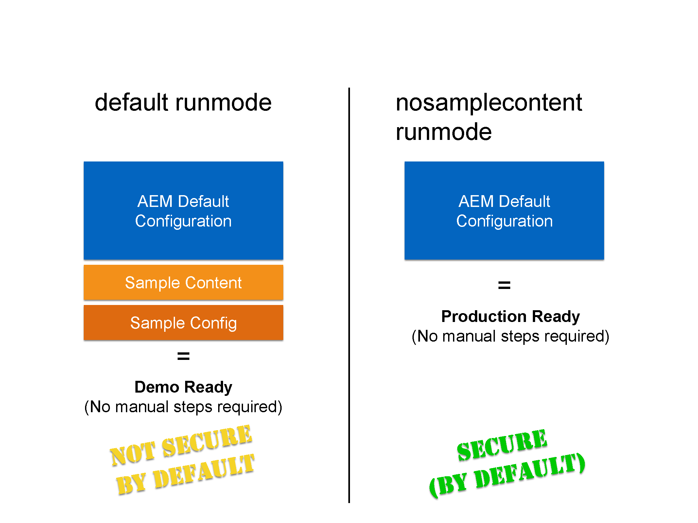

# Esecuzione di AEM in modalità pronta per la produzione{#running-aem-in-production-ready-mode}

Con AEM 6.1, Adobe introduce il nuovo `"nosamplecontent"` Modalità di esecuzione per automatizzare i passaggi necessari per preparare un’istanza AEM per l’implementazione in un ambiente di produzione.

La nuova modalità di esecuzione non solo configurerà automaticamente l’istanza in modo da rispettare le best practice per la sicurezza descritte nell’elenco di controllo per la sicurezza, ma rimuoverà anche tutte le applicazioni e le configurazioni geometrixx di esempio nel processo.

>[!NOTE]
>
>Poiché, per motivi pratici, la modalità pronta per la produzione dell’AEM coprirà solo la maggior parte delle attività necessarie per proteggere un’istanza, si consiglia vivamente di consultare il [Elenco di controllo della sicurezza](/help/sites-administering/security-checklist.md) prima di andare live con il tuo ambiente di produzione.
>
>Inoltre, tieni presente che l’esecuzione di AEM in modalità pronta per la produzione disabilita in modo efficace l’accesso a CRXDE Lite. Se necessario a scopo di debug, consulta [Abilitazione di CRXDE Lite nell’AEM](/help/sites-administering/enabling-crxde-lite.md).



Per eseguire l’AEM in modalità &quot;production ready&quot; è sufficiente aggiungere `nosamplecontent` tramite `-r` runmode passa agli argomenti di avvio esistenti:

```shell
java -jar aem-quickstart.jar -r nosamplecontent
```

Ad esempio, puoi utilizzare Production ready per avviare un’istanza di authoring con persistenza MongoDB simile alla seguente:

```shell
java -jar aem-quickstart.jar -r author,crx3,crx3mongo,nosamplecontent -Doak.mongo.uri=mongodb://remoteserver:27017 -Doak.mongo.db=aem-author
```

## Modifica parte della modalità pronta per la produzione {#changes-part-of-the-production-ready-mode}

In particolare, le seguenti modifiche di configurazione saranno eseguite quando l’AEM viene eseguito in modalità &quot;pronto per la produzione&quot;:

1. Il **Pacchetto di supporto CRXDE** ( `com.adobe.granite.crxde-support`) è disattivato per impostazione predefinita in modalità pronta per la produzione. Può essere installato in qualsiasi momento dall’archivio Maven pubblico di Adobe. La versione 3.0.0 è richiesta per AEM 6.1.

1. Il **Apache Sling: accesso WebDAV semplice agli archivi** ( `org.apache.sling.jcr.webdav`) sarà disponibile solo il **autore** istanze.

1. Gli utenti appena creati dovranno modificare la password al primo accesso. Questo non si applica all’utente amministratore.
1. **Genera informazioni di debug** è disabilitato per **Gestore script Java Apache Sling**.

1. **Contenuto mappato** e **Genera informazioni di debug** sono disabilitati per **Gestore script Apache Sling JSP**.

1. Il **Filtro WCM Day CQ** è impostato su `edit` il **autore** e `disabled` il **pubblicare** istanze.

1. Il **Adobe Granite HTML Library Manager** è configurato con le seguenti impostazioni:

   1. **Minimizza:** `enabled`
   1. **Debug:** `disabled`
   1. **Gzip:** `enabled`
   1. **Tempistica:** `disabled`

1. Il **Apache Sling GET Servlet** è impostato per supportare configurazioni sicure per impostazione predefinita, come segue:

| **Configurazione** | **Autore** | **Pubblicazione** |
|---|---|---|
| Rendering TXT | disattivato | disattivato |
| rappresentazione HTML | disattivato | disattivato |
| Rappresentazione JSON | abilitato | abilitato |
| Rappresentazione XML | disattivato | disattivato |
| json.maximumresults | 1000 | 100 |
| Indice automatico | disattivato | disattivato |
