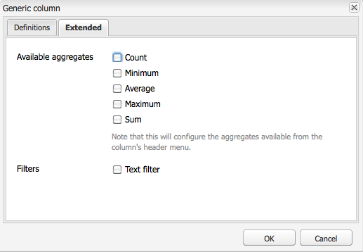

# Generazione rapporti {#reporting}

Per aiutarti a monitorare e analizzare lo stato dell’istanza, Adobe Experience Manager (AEM) fornisce una selezione di rapporti predefiniti che possono essere configurati per i tuoi requisiti individuali:

* [Report componente](#component-report)
* [Utilizzo disco](#disk-usage)
* [Verifica stato](#health-check)
* [Report attività pagina](#page-activity-report)
* [Report di contenuti generati dall&#39;utente](#user-generated-content-report)
* [Report utente](#user-report)
* [Report di istanze flusso di lavoro](#workflow-instance-report)
* [Report di workflow](#workflow-report)

>[!NOTE]
>
>Questi rapporti sono disponibili solo nell’interfaccia classica. Per il monitoraggio e il reporting del sistema nell&#39;interfaccia utente moderna, vedere il [dashboard operazioni.](/help/sites-administering/operations-dashboard.md)

Tutti i report sono accessibili dalla console **Strumenti**. Seleziona **Report** nel riquadro di sinistra, quindi fai doppio clic sul report richiesto nel riquadro di destra per aprirlo per la visualizzazione, la configurazione o entrambi.

È inoltre possibile creare nuove istanze di un report dalla console **Strumenti**. Selezionare **Report** nel riquadro di sinistra, quindi **Nuovo...** nella barra degli strumenti. Definisci un **Titolo** e un **Nome**, seleziona il tipo di report richiesto, quindi fai clic su **Crea**. La nuova istanza di report viene visualizzata nell’elenco. Fai doppio clic su questo per aprire, quindi trascina un componente dalla barra laterale in modo da creare la prima colonna e avviare la definizione del rapporto.

>[!NOTE]
>
>Oltre ai report standard dell&#39;AEM disponibili con la procedura guidata, puoi [sviluppare i tuoi (nuovi) report](/help/sites-developing/dev-reports.md).

## Nozioni di base sulla personalizzazione dei rapporti {#the-basics-of-report-customization}

Sono disponibili vari formati di rapporti. Tutti i rapporti seguenti utilizzano colonne che possono essere personalizzate come descritto nelle sezioni seguenti:

* [Report componente](#component-report)
* [Report attività pagina](#page-activity-report)
* [Report di contenuti generati dall&#39;utente](#user-generated-content-report)
* [Report utente](#user-report)
* [Report di istanze flusso di lavoro](#workflow-instance-report)

>[!NOTE]
>
>I seguenti rapporti hanno ciascuno il proprio formato e la propria personalizzazione:
>
>
>* [Verifica stato](#health-check) utilizza i campi di selezione per specificare i dati sui quali si desidera creare un rapporto.
>* [Utilizzo disco](#disk-usage) utilizza i collegamenti per eseguire il drill-down della struttura dell&#39;archivio.
>* [Il flusso di lavoro](/help/sites-administering/reporting.md#workflow-report) offre una panoramica dei flussi di lavoro in esecuzione nell&#39;istanza.
>
>Pertanto, le seguenti procedure per la configurazione delle colonne non sono appropriate. Per informazioni dettagliate, consulta le descrizioni dei singoli rapporti.

### Selezione e posizionamento delle colonne di dati {#selecting-and-positioning-the-data-columns}

Le colonne possono essere aggiunte, riposizionate o rimosse da qualsiasi rapporto, sia standard che personalizzato.

Nella scheda **Componenti** della barra laterale (disponibile nella pagina del report) sono elencate tutte le categorie di dati che è possibile selezionare come colonne.

Per modificare la selezione dei dati:

* per aggiungere una colonna, trascina il componente richiesto dalla barra laterale e rilascialo nella posizione desiderata

   * un segno di spunta verde indica quando la posizione è valida e una coppia di frecce indica esattamente dove viene posizionata
   * un simbolo rosso &quot;no-go&quot; indica quando la posizione non è valida

* per spostare una colonna, fare clic sull&#39;intestazione, tenere premuto e trascinare nella nuova posizione
* per rimuovere una colonna, fare clic sul titolo della colonna, tenere premuto e trascinare verso l&#39;alto nell&#39;area dell&#39;intestazione del report (un simbolo meno rosso indica che la posizione non è valida). Rilasciare il pulsante del mouse e la finestra di dialogo Elimina componenti richiede la conferma dell&#39;eliminazione effettiva della colonna.

### Menu a discesa delle colonne {#column-drop-down-menu}

Ogni colonna del rapporto ha un menu a discesa. Questa opzione diventa visibile quando il cursore del mouse si sposta sulla cella del titolo della colonna.

Viene visualizzata una freccia all&#39;estrema destra della cella del titolo (da non confondere con la freccia immediatamente a destra del testo del titolo che indica il [meccanismo di ordinamento corrente](#sorting-the-data)).

Le opzioni disponibili nel menu dipendono dalla configurazione della colonna (effettuata durante lo sviluppo del progetto), mentre le opzioni non valide vengono disattivate (disattivate).

### Ordinamento dei dati {#sorting-the-data}

I dati possono essere ordinati in base a una colonna specifica:

* facendo clic sull&#39;intestazione di colonna appropriata; l&#39;ordinamento passa da crescente a decrescente e viene indicato da una freccia posta immediatamente accanto al testo del titolo
* utilizzare il menu a discesa della [colonna](#column-drop-down-menu) per selezionare in modo specifico **Ordinamento crescente** o **Ordinamento decrescente**; anche in questo caso, il menu è indicato da una freccia accanto al testo del titolo

### Grafico dei gruppi e dei dati correnti {#groups-and-the-current-data-chart}

Nelle colonne appropriate è possibile selezionare **Raggruppa per questa colonna** dal menu a discesa [colonna](#column-drop-down-menu). Raggruppa i dati in base a ogni valore distinto all’interno di quella colonna. È possibile selezionare più colonne da raggruppare. L’opzione è disattivata (disattivata) quando i dati nella colonna non sono appropriati. In altre parole, ogni voce è distinta e univoca, quindi non è possibile formare gruppi. Ad esempio, la colonna ID utente del report utente.

Dopo aver raggruppato almeno una colonna, viene generato un grafico a torta di **Dati correnti**, in base a questo raggruppamento. Se sono raggruppate più colonne, ciò viene indicato nel grafico.

Spostando il cursore sul grafico a torta viene visualizzato il valore aggregato per il segmento appropriato. Utilizza l’aggregato attualmente definito per la colonna, ad esempio conteggio, minimo, media, tra gli altri.

### Filtri e aggregati {#filters-and-aggregates}

Nelle colonne appropriate è inoltre possibile configurare **Impostazioni filtro** e/o **Aggregati** dal menu a discesa della [colonna](#column-drop-down-menu).

#### Filtri {#filters}

Impostazioni filtro consente di specificare i criteri per le voci da visualizzare. Gli operatori disponibili sono:

* `contains`
* `equals`

Per impostare un filtro:

1. Seleziona l’operatore desiderato dall’elenco a discesa.
1. Immettere il testo su cui applicare il filtro.
1. Fai clic su **Applica**.

Per disattivare il filtro:

1. Rimuovi il testo del filtro.
1. Fai clic su **Applica**.

#### Aggregati {#aggregates}

Puoi anche selezionare un metodo di aggregazione (che può variare a seconda della colonna selezionata):

### Proprietà colonna {#column-properties}

Questa opzione è disponibile solo se la [colonna generica](#generic-column) è stata utilizzata nel [report utente](#user-report).

### Dati storici {#historic-data}

Un grafico della variazione dei tuoi dati nel tempo può essere visto in **Dati storici**. Questo deriva da istantanee scattate a intervalli regolari.

Dati:

* Raccolto da, se disponibile, la prima colonna ordinata, altrimenti la prima colonna (non raggruppata)
* Raggruppato per la colonna appropriata

Il rapporto può essere generato:

1. Imposta **Raggruppamento** nella colonna richiesta.
1. **Modifica** la configurazione in modo da poter definire istantanee orarie o giornaliere.
1. **Fine...** la definizione per avviare la raccolta di snapshot.

   Il pulsante cursore rosso/verde in alto a sinistra indica quando vengono raccolte le istantanee.

Il grafico risultante è mostrato in basso a destra:

Quando inizia la raccolta dei dati, puoi selezionare:

* **Periodo**

  È possibile selezionare le date di inizio e di fine per la visualizzazione dei dati del rapporto.

* **Intervallo**

  Mese, Settimana, Giorno, Ora possono essere selezionati per la scala e l’aggregazione del rapporto.

  Ad esempio, se per febbraio 2011 sono disponibili snapshot giornaliere:

   * Se l&#39;intervallo è impostato su `Day`, ogni snapshot viene visualizzato come un singolo valore nel grafico.
   * Se l&#39;intervallo è impostato su `Month`, tutte le istantanee di febbraio vengono aggregate in un singolo valore (visualizzato come un singolo punto nel grafico).

Seleziona i requisiti, quindi fai clic su **Vai** per applicarli al report. Per aggiornare la visualizzazione dopo aver creato ulteriori snapshot, fare di nuovo clic su **Vai**.

Quando si raccolgono gli snapshot, è possibile:

* Utilizzare di nuovo **Fine...** per reinizializzare la raccolta.

  **Fine** &quot;congela&quot; la struttura del report (ovvero le colonne assegnate al report e che sono raggruppate, ordinate, filtrate e così via) e avvia l&#39;acquisizione di snapshot.

* Apri la finestra di dialogo **Modifica** in modo da poter selezionare **Nessun snapshot di dati** per terminare la raccolta fino a quando non è necessario.

  **Modifica** attiva o disattiva solo l&#39;acquisizione di snapshot. Se l&#39;acquisizione delle istantanee viene nuovamente attivata, viene utilizzato lo stato del report al termine dell&#39;ultima esecuzione per l&#39;acquisizione di ulteriori istantanee.

>[!NOTE]
>
>Le istantanee vengono archiviate in `/var/reports/...`, dove il resto del percorso rispecchia il percorso del rispettivo report e ID creati al termine del report.
>
>
>Le copie istantanee precedenti possono essere eliminate manualmente, se si è certi di non aver più bisogno di tali istanze.

>[!NOTE]
>
>I rapporti preconfigurati non richiedono elevate prestazioni, ma si consiglia comunque di utilizzare istantanee giornaliere in un ambiente di produzione. Se possibile, esegui queste istantanee giornaliere in un momento in cui non c’è molta attività sul sito web. Questo può essere definito con il parametro `Daily snapshots (repconf.hourofday)` per **Day CQ Reporting Configuration**. Per ulteriori informazioni su come configurare questa configurazione, vedere [Configurazione OSGI](/help/sites-deploying/configuring-osgi.md).

#### Limiti di visualizzazione {#display-limits}

Il rapporto sui dati storici può anche cambiare leggermente nell’aspetto a causa dei limiti che possono essere impostati, in base al numero di risultati per il periodo selezionato.

Ogni linea orizzontale è nota come serie (e corrisponde a una voce nella legenda del grafico), ogni colonna verticale di punti rappresenta gli snapshot aggregati.

Per mantenere il grafico pulito per periodi di tempo più lunghi, è possibile impostare alcuni limiti. Per i rapporti standard:

* serie orizzontale - il numero massimo predefinito e di sistema è `9`

* snapshot aggregati verticali. Il valore predefinito è `35` (per serie orizzontali)

Pertanto, quando i limiti (appropriati) vengono superati:

* i punti non vengono visualizzati
* la legenda del grafico dati cronologici potrebbe mostrare un numero di voci diverso da quello del grafico dati corrente

I report personalizzati possono inoltre mostrare il valore **Total** per tutte le serie. Viene visualizzata come una serie (linea orizzontale e voce nella legenda).

>[!NOTE]
>
>Per i rapporti personalizzati, i limiti possono essere impostati in modo diverso.

### Modifica (Report) {#edit-report}

Il pulsante **Modifica** apre la finestra di dialogo **Modifica report**.

In questa posizione è definito il periodo per la raccolta di snapshot per [Dati cronologici](#historic-data), ma è possibile definire anche diverse altre impostazioni:

* **Titolo**

  Puoi definire un titolo personalizzato.

* **Descrizione**

  Puoi definire una tua descrizione.

* **Percorso principale** (*attivo solo per alcuni report*)

  Utilizzare questa opzione per limitare il report a una sezione (secondaria) dell’archivio.

* **Elaborazione report**

   * **aggiorna automaticamente i dati**

     I dati del rapporto vengono aggiornati ogni volta che si aggiorna la definizione del rapporto.

   * **aggiorna manualmente i dati**

     Questa opzione può essere utilizzata per evitare ritardi causati da operazioni di aggiornamento automatico quando il volume di dati è elevato.

     Selezionando questa opzione, i dati del rapporto devono essere aggiornati manualmente quando viene modificato un qualsiasi aspetto della configurazione del rapporto. Significa anche che quando modifichi un aspetto della configurazione, la tabella del rapporto risulta vuota.

     Quando questa opzione è selezionata, viene visualizzato il pulsante **[Carica dati](#load-data)** accanto a **Modifica** nel report. **Carica dati** carica i dati e aggiorna i dati del rapporto visualizzati.

* **Snapshot**
È possibile definire la frequenza delle istantanee, giornaliera, oraria o non.

### Carica dati {#load-data}

Il pulsante **Carica dati** è visibile solo quando **aggiorna manualmente i dati** è stato selezionato da **[Modifica](#edit-report)**.

Facendo clic su **Carica dati**, i dati vengono ricaricati e il report visualizzato viene aggiornato.

Selezionando di aggiornare manualmente i dati si ottiene quanto segue:

1. Quando modifichi la configurazione del rapporto, la tabella dei dati del rapporto risulta vuota.

   Ad esempio, se modifichi il meccanismo di ordinamento di una colonna, i dati non vengono visualizzati.

1. Se desideri visualizzare nuovamente i dati del report, fai clic su **Carica dati** per ricaricare i dati.

### Fine (rapporto) {#finish-report}

Quando **Termina** il report:

* La definizione del report *a partire da quel momento* viene utilizzata per acquisire gli snapshot. In seguito, è possibile continuare a lavorare su una definizione di report perché è separata dalle istantanee.
* Eventuali snapshot esistenti vengono rimossi.
* Sono stati raccolti nuovi snapshot per i [dati cronologici](#historic-data).

Questa finestra di dialogo consente di definire o aggiornare il titolo e la descrizione del report risultante.

## Tipi di rapporti {#report-types}

### Report componente {#component-report}

Il rapporto sui componenti fornisce informazioni sull’utilizzo dei componenti da parte del sito web.

[Colonne di informazioni](#selecting-and-positioning-the-data-columns) su:

* Autore
* Percorso componente
* Tipo componente
* Ultima modifica
* Pagina

Ciò significa che è possibile visualizzare quanto segue:

* Quali componenti vengono utilizzati e dove vengono utilizzati.

  Utile, ad esempio, durante il test.

* Come vengono distribuite le istanze di un componente specifico.

  Questo può essere interessante se pagine specifiche (ovvero, &quot;pagine pesanti&quot;) riscontrano problemi di prestazioni.

* Identificare le parti del sito con modifiche frequenti/meno frequenti.
* Scopri come il contenuto della pagina si sviluppa nel tempo.

Tutti i componenti sono inclusi, standard per prodotto e specifici per progetto. Utilizzando la finestra di dialogo **Modifica**, l&#39;utente può anche impostare un **percorso principale** che definisce il punto iniziale del report. Tutti i componenti sotto tale percorso principale vengono considerati per il report.

 

### Utilizzo disco {#disk-usage}

Il report sull&#39;utilizzo del disco mostra informazioni sui dati archiviati nel repository.

Il report inizia nella directory principale ( / ) dell’archivio facendo clic su un ramo specifico che è possibile espandere all’interno dell’archivio (il percorso corrente si riflette nel titolo del report).

### Verifica stato {#health-check}

Questo rapporto analizza il registro di richieste corrente:

`<cq-installation-dir>/crx-quickstart/logs/request.log`

Per aiutarti a identificare le richieste più costose in un dato periodo.

Per generare il rapporto, puoi specificare quanto segue:

* **Periodo (ore)**

  Il numero di ore (passate) da analizzare.

  Predefinito: `24`

* **max Risultati**

  Numero massimo di righe di output.

  Predefinito: `50`

* **max Richieste**

  Numero massimo di richieste da analizzare.

  Predefinito: `-1` (tutti)

* **Indirizzo e-mail**

  Invia i risultati a un indirizzo e-mail.

  Facoltativo; predefinito: vuoto

* **Esegui ogni giorno alle (hh:mm)**

  Specificare un orario per l&#39;esecuzione automatica giornaliera del report.

  Facoltativo; predefinito: vuoto

### Report attività pagina {#page-activity-report}

Il rapporto di attività della pagina elenca le pagine e le relative azioni.

[Colonne di informazioni](#selecting-and-positioning-the-data-columns) su:

* Pagina
* stimato
* Tipo
* User

Ciò consente di monitorare:

* Modifiche più recenti.
* Autori che lavorano su pagine specifiche.
* Pagine che non sono state modificate di recente, quindi potrebbe essere necessario intervenire.
* Pagine modificate più/meno frequentemente.
* Utenti più/meno attivi.

Il rapporto attività pagina prende tutte le sue informazioni dal registro di audit. Per impostazione predefinita, il percorso della directory principale è configurato per il registro di controllo in `/var/audit/com.day.cq.wcm.core.page`.

### Report di contenuti generati dall&#39;utente {#user-generated-content-report}

Questo rapporto fornisce informazioni sui contenuti generati dagli utenti, che si tratti di commenti, valutazioni o forum.

[Colonne di informazioni](#selecting-and-positioning-the-data-columns) su:

* Data
* Indirizzo IP
* Pagina
* Referrer
* Tipo
* Identificatore utente

Consente di:

* Scopri quali pagine ricevono il maggior numero di commenti.
* Ottieni una panoramica di tutti i commenti lasciati da specifici visitatori del sito, forse correlati ai problemi.
* Valuta se i nuovi contenuti provocano commenti monitorando quando vengono aggiunti commenti su una pagina.

### Report utente {#user-report}

Questo rapporto fornisce informazioni su tutti gli utenti che hanno registrato un account e/o un profilo, che può includere sia autori all’interno della tua organizzazione che visitatori esterni.

[Colonne di informazioni](#selecting-and-positioning-the-data-columns) (se disponibili) su:

* Età
* Paese
* Dominio
* E-mail
* Cognome
* Genere
* [Generico](#generic-column)
* Nome assegnato
* Info
* Interesse
* Lingua
* Hashcode NTLM
* ID utente

Consente di:

* Scopri la distribuzione demografica degli utenti.
* Generare rapporti sui campi personalizzati aggiunti ai profili.

#### Colonna generica {#generic-column}

La colonna **Generic** è disponibile nel report utente e consente di accedere alle informazioni personalizzate, in genere dai [profili utente](/help/sites-administering/identity-management.md#profiles-and-user-accounts); ad esempio, [Colore preferito come descritto in Aggiunta di campi alla definizione del profilo](/help/sites-administering/identity-management.md#adding-fields-to-the-profile-definition).

La finestra di dialogo Colonna generica (Generic column) viene aperta quando eseguite una delle seguenti operazioni:

* Trascina il componente generico dalla barra laterale al rapporto.
* Selezionare le Proprietà colonna per una colonna generica esistente.

Dalla scheda **Definizioni** puoi definire:

* **Titolo**

  Titolo personalizzato per la colonna generica.

* **Proprietà**

  Il nome della proprietà come memorizzato nell’archivio, in genere all’interno del profilo dell’utente.

* **Percorso**

  In genere la proprietà viene presa da `profile`.

* **Tipo**

  Selezionare il tipo di campo tra `String`, `Number`, `Integer`, `Date`.

* **Aggregato predefinito**

  Definisce l’aggregato utilizzato per impostazione predefinita se la colonna è separata in un rapporto con almeno una colonna raggruppata. Seleziona l&#39;aggregato richiesto da `Count`, `Minimum`, `Average`, `Maximum`, `Sum`.

  Ad esempio, *Count* per un campo `String` significa che viene visualizzato il numero di valori `String` distinti per la colonna nello stato aggregato.

Nella scheda **Extended** è inoltre possibile definire gli aggregati e i filtri disponibili:

### Report di istanze flusso di lavoro {#workflow-instance-report}

Questo offre una panoramica concisa, fornendo informazioni sulle singole istanze dei flussi di lavoro, sia in esecuzione che completati.

[Colonne di informazioni](#selecting-and-positioning-the-data-columns) su:

* Completato
* Durata
* Iniziatore
* Modello
* Payload
* Avviato
* Stato

Ciò significa che è possibile:

* Monitora la durata media dei flussi di lavoro; se ciò accade regolarmente, può evidenziare i problemi con il flusso di lavoro.

### Report di workflow {#workflow-report}

Vengono fornite statistiche chiave sui flussi di lavoro in esecuzione nell’istanza.

## Utilizzo dei rapporti in un ambiente Publish {#using-reports-in-a-publish-environment}

Dopo aver configurato i rapporti in base a esigenze specifiche, puoi attivarli per trasferire la configurazione nell’ambiente di pubblicazione.

>[!CAUTION]
>
>Se desideri **Dati storici** per l&#39;ambiente Publish, **Termina** il report nell&#39;ambiente di authoring prima di attivare la pagina.

Il report appropriato è quindi accessibile in

`/etc/reports`

Ad esempio, il rapporto User-Generated Content (Contenuto generato dall’utente) si trova in:

`http://localhost:4503/etc/reports/ugcreport.html`

Questo ora genera rapporti sui dati raccolti dall’ambiente Publish.

Poiché nell&#39;ambiente Publish non è consentita alcuna configurazione di report, i pulsanti **Modifica** e **Fine** non sono disponibili. È tuttavia possibile selezionare **Periodo** e **Intervallo** per i report **Dati cronologici** se vengono raccolti snapshot.

>[!CAUTION]
>
>L&#39;accesso a questi report può rappresentare un problema di sicurezza; pertanto, l&#39;Adobe consiglia di configurare Dispatcher in modo che `/etc/reports` non sia disponibile per i visitatori esterni. Per ulteriori dettagli, vedere l&#39;[elenco di controllo protezione](security-checklist.md).

## Autorizzazioni necessarie per l’esecuzione dei rapporti {#permissions-needed-for-running-reports}

Le autorizzazioni necessarie dipendono dall’azione:

* I dati del rapporto vengono raccolti utilizzando i privilegi dell’utente corrente.
* I dati storici vengono raccolti utilizzando i privilegi dell’utente che ha completato il rapporto.

In un’installazione standard dell’AEM sono preimpostate le seguenti autorizzazioni per i rapporti:

* **Report utente**

  `user administrators` - lettura e scrittura

* **Report attività pagina**

  `contributors` - lettura e scrittura

* **Report componente**

  `contributors` - lettura e scrittura

* **Report di contenuto generato dall&#39;utente**

  `contributors` - lettura e scrittura

* **Report istanza flusso di lavoro**

  `workflow-users` - lettura e scrittura

Tutti i membri del gruppo `administrators` dispongono dei diritti necessari per creare i report.
