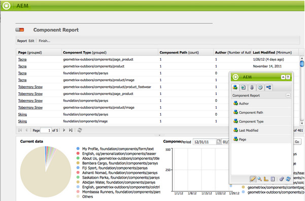

# Generazione rapporti {#reporting}

Per aiutarti a monitorare e analizzare lo stato dell’istanza, l’AEM fornisce una selezione di rapporti predefiniti che possono essere configurati per i tuoi requisiti individuali:

* [Report componente](#component-report)
* [Utilizzo disco](#disk-usage)
* [Verifica stato](#health-check)
* [Report attività pagina](#page-activity-report)
* [Report per contenuti generati dall&#39;utente](#user-generated-content-report)
* [Report utente](#user-report)
* [Report di istanze flusso di lavoro](#workflow-instance-report)
* [Report di workflow](#workflow-report)

>[!NOTE]
>
>Questi rapporti sono disponibili solo nell’interfaccia classica. Per il monitoraggio e il reporting del sistema nell&#39;interfaccia utente moderna, vedi [Dashboard operazioni.](/help/sites-administering/operations-dashboard.md)

È possibile accedere a tutti i rapporti da **Strumenti** console. Seleziona **Rapporti** nel riquadro di sinistra, fare doppio clic sul report richiesto nel riquadro di destra per aprirlo per la visualizzazione e/o la configurazione.

È possibile creare nuove istanze di un rapporto anche dalla sezione **Strumenti** console. Seleziona **Rapporti** nel riquadro di sinistra, quindi **Nuovo...** dalla barra degli strumenti. Definisci un **Titolo** e **Nome**, seleziona il tipo di rapporto desiderato, quindi fai clic su **Crea**. La nuova istanza di report verrà visualizzata nell’elenco. Fai doppio clic su questo per aprire, quindi trascina un componente dalla barra laterale per creare la prima colonna e avviare la definizione del rapporto.

>[!NOTE]
>
>Oltre ai rapporti standard AEM preconfigurati, puoi [sviluppare rapporti personalizzati (completamente nuovi)](/help/sites-developing/dev-reports.md).

## Nozioni di base sulla personalizzazione dei rapporti {#the-basics-of-report-customization}

Sono disponibili vari formati di rapporti. Tutti i rapporti seguenti utilizzano colonne che possono essere personalizzate come descritto nelle sezioni seguenti:

* [Report componente](#component-report)
* [Report attività pagina](#page-activity-report)
* [Report per contenuti generati dall&#39;utente](#user-generated-content-report)
* [Report utente](#user-report)
* [Report di istanze flusso di lavoro](#workflow-instance-report)

>[!NOTE]
>
>I seguenti rapporti hanno ciascuno il proprio formato e la propria personalizzazione:
>
>
>* [Verifica stato](#health-check) utilizza i campi di selezione per specificare i dati sui quali si desidera creare rapporti.
>* [Utilizzo disco](#disk-usage) utilizza i collegamenti per eseguire il drill-down della struttura dell’archivio.
>* [Report di flusso di lavoro](/help/sites-administering/reporting.md#workflow-report) offre una panoramica dei flussi di lavoro in esecuzione nell’istanza.
>
>Pertanto, le seguenti procedure per la configurazione delle colonne non sono appropriate. Per informazioni dettagliate, consulta le descrizioni dei singoli rapporti.

### Selezione e posizionamento delle colonne di dati {#selecting-and-positioning-the-data-columns}

Le colonne possono essere aggiunte, riposizionate o rimosse da qualsiasi rapporto, sia standard che personalizzato.

Il **Componenti** Nella scheda della barra laterale (disponibile nella pagina del report) sono elencate tutte le categorie di dati che è possibile selezionare come colonne.

Per modificare la selezione dei dati:

* per aggiungere una nuova colonna, trascina il componente richiesto dalla barra laterale e rilascialo nella posizione desiderata

   * una spunta verde indica quando la posizione è valida e una coppia di frecce indica esattamente dove verrà posizionata
   * un simbolo rosso &quot;no-go&quot; indica quando la posizione non è valida

* per spostare una colonna, fai clic sull’intestazione, tieni premuto e trascina nella nuova posizione
* per rimuovere una colonna, fai clic sul titolo della colonna, tieni premuto e trascina verso l’alto nell’area dell’intestazione del rapporto (un simbolo rosso meno indica che la posizione non è valida); rilascia il pulsante del mouse e la finestra di dialogo Elimina componenti richiederà la conferma che desideri eliminare la colonna.

### Menu a discesa delle colonne {#column-drop-down-menu}

Ogni colonna del rapporto ha un menu a discesa. Questa opzione diventa visibile quando il cursore del mouse si sposta sulla cella del titolo della colonna.

La freccia viene visualizzata all&#39;estrema destra della cella del titolo (da non confondere con la freccia immediatamente a destra del testo del titolo che indica [meccanismo di ordinamento corrente](#sorting-the-data)).

Le opzioni disponibili nel menu dipendono dalla configurazione della colonna (effettuata durante lo sviluppo del progetto), mentre tutte le opzioni non valide saranno disattivate.

### Ordinamento dei dati {#sorting-the-data}

I dati possono essere ordinati in base a una colonna specifica:

* facendo clic sull&#39;intestazione di colonna appropriata; l&#39;ordinamento sarà crescente o decrescente, indicato da una freccia posta immediatamente accanto al testo del titolo
* utilizzare il [menu a discesa della colonna](#column-drop-down-menu) per selezionare in modo specifico **Ordinamento crescente** o **Ordine decrescente**; anche in questo caso verrà indicata da una freccia accanto al testo del titolo

### Grafico dei gruppi e dei dati correnti {#groups-and-the-current-data-chart}

Nelle colonne appropriate è possibile selezionare **Raggruppa per questa colonna** dal [menu a discesa della colonna](#column-drop-down-menu). I dati verranno raggruppati in base a ciascun valore distinto all’interno di tale colonna. È possibile selezionare più colonne da raggruppare. L’opzione è disattivata quando i dati nella colonna non sono appropriati, ovvero ogni voce è distinta e univoca, pertanto non è possibile creare gruppi, ad esempio la colonna ID utente del report utente.

Dopo il raggruppamento di almeno una colonna, un grafico a torta **Dati correnti** in base a questo raggruppamento. Se sono raggruppate più colonne, anche questo sarà indicato nel grafico.

Spostando il cursore sul grafico a torta verrà visualizzato il valore aggregato per il segmento appropriato. Utilizza l’aggregato attualmente definito per la colonna, ad esempio conteggio, minimo, media, tra gli altri.

### Filtri e aggregati {#filters-and-aggregates}

Sulle colonne appropriate puoi anche configurare **Impostazioni filtro** e/o **Aggregati** dal [menu a discesa della colonna](#column-drop-down-menu).

#### Filtri {#filters}

Le impostazioni del filtro consentono di specificare i criteri per la visualizzazione delle voci. Gli operatori disponibili sono:

* `contains`
* `equals`

Per impostare un filtro:

1. Seleziona l’operatore desiderato dall’elenco a discesa.
1. Immettere il testo su cui applicare il filtro.
1. Clic **Applica**.

Per disattivare il filtro:

1. Rimuovi il testo del filtro.
1. Clic **Applica**.

#### Aggregati {#aggregates}

Puoi anche selezionare un metodo di aggregazione (che può variare a seconda della colonna selezionata):

### Proprietà colonna {#column-properties}

Questa opzione è disponibile solo quando [Colonna generica](#generic-column) è stato utilizzato in [Report utente](#user-report).

### Dati storici {#historic-data}

Un grafico della variazione dei dati nel tempo può essere visto in **Dati storici**. Questo deriva da istantanee scattate a intervalli regolari.

Dati:

* Raccolto da, se disponibile, la prima colonna ordinata, altrimenti la prima colonna (non raggruppata)
* Raggruppato per la colonna appropriata

Il rapporto può essere generato:

1. Imposta **Raggruppamento** nella colonna richiesta.
1. **Modifica** la configurazione per definire la frequenza con cui eseguire le istantanee, oraria o giornaliera.
1. **Fine...** la definizione per avviare la raccolta di snapshot.

   Il pulsante cursore rosso/verde in alto a sinistra indica quando vengono raccolte le istantanee.

Il grafico risultante è mostrato in basso a destra:

Una volta avviata la raccolta dei dati, puoi selezionare:

* **Periodo**

   È possibile selezionare le date di inizio e di fine per la visualizzazione dei dati del rapporto.

* **Intervallo**

   Mese, Settimana, Giorno, Ora possono essere selezionati per la scala e l’aggregazione del rapporto.

   Ad esempio, se per febbraio 2011 sono disponibili snapshot giornaliere:

   * Se l&#39;intervallo è impostato su `Day`, ogni istantanea viene visualizzata come un singolo valore nel grafico.
   * Se l&#39;intervallo è impostato su `Month`, tutte le istantanee di febbraio vengono aggregate in un singolo valore (visualizzato come un singolo punto nel grafico).

Seleziona le tue esigenze, quindi fai clic su **Vai** per applicarli al report. Per aggiornare la visualizzazione dopo aver creato ulteriori snapshot, fare clic su **Vai** di nuovo.

Durante la raccolta degli snapshot è possibile:

* Utilizzare **Fine...** per reinizializzare la raccolta.

   **Fine** &quot;congela&quot; la struttura del rapporto (ovvero le colonne assegnate al rapporto e che sono raggruppate, ordinate, filtrate, ecc.) e inizia a creare snapshot.

* Apri **Modifica** finestra di dialogo per selezionare **Nessuna istantanea di dati** per terminare la raccolta fino a quando richiesto.

   **Modifica** attiva o disattiva solo l&#39;acquisizione di istantanee. Se l&#39;acquisizione delle istantanee viene nuovamente attivata, viene utilizzato lo stato del report al termine dell&#39;ultima esecuzione per l&#39;acquisizione di ulteriori istantanee.

>[!NOTE]
>
>Le istantanee vengono archiviate in `/var/reports/...` dove il resto del percorso rispecchia il percorso del rispettivo rapporto e ID creati al termine del rapporto.
>
>
>Le copie istantanee precedenti possono essere eliminate manualmente, se si è certi che non siano più necessarie.

>[!NOTE]
>
>I rapporti preconfigurati non richiedono elevate prestazioni, ma si consiglia comunque di utilizzare istantanee giornaliere in un ambiente di produzione. Se possibile, esegui queste istantanee giornaliere in un momento in cui non c’è molta attività sul sito web; questo può essere definito con `Daily snapshots (repconf.hourofday)` parametro per **Configurazione reporting Day CQ**; vedi [Configurazione OSGI](/help/sites-deploying/configuring-osgi.md) per ulteriori dettagli su come configurarlo.

#### Limiti di visualizzazione {#display-limits}

Il rapporto sui dati storici può anche cambiare leggermente nell’aspetto a causa dei limiti che possono essere impostati, in base al numero di risultati per il periodo selezionato.

Ogni linea orizzontale è nota come serie (e corrisponde a una voce nella legenda del grafico), ogni colonna verticale di punti rappresenta gli snapshot aggregati.

Per mantenere il grafico pulito per periodi di tempo più lunghi, è possibile impostare alcuni limiti. Per i rapporti standard:

* serie orizzontale: valore predefinito e massimo del sistema. `9`

* snapshot aggregati verticali: il valore predefinito è `35` (per serie orizzontale)

Pertanto, quando i limiti (appropriati) vengono superati:

* i punti non verranno visualizzati
* la legenda del grafico dati cronologici potrebbe mostrare un numero di voci diverso da quello del grafico dati corrente

I rapporti personalizzati possono anche mostrare **Totale** per tutte le serie. Viene visualizzata come una serie (linea orizzontale e voce nella legenda).

>[!NOTE]
>
>Per i rapporti personalizzati i limiti possono essere impostati in modo diverso.

### Modifica (Report) {#edit-report}

Il **Modifica** apre il pulsante **Modifica Report** Finestra di dialogo.

Questa è una posizione in cui il periodo per la raccolta degli snapshot per [Dati storici](#historic-data) è definito, ma è possibile definire anche diverse altre impostazioni:

* **Titolo**

   Puoi definire un titolo personalizzato.

* **Descrizione**

   Puoi definire una tua descrizione.

* **Percorso directory principale** (*attivo solo per alcuni rapporti*)

   Utilizzare questa opzione per limitare il report a una sezione (secondaria) dell’archivio.

* **Elaborazione rapporto**

   * **aggiorna i dati automaticamente**

      I dati del rapporto verranno aggiornati ogni volta che si aggiorna la definizione del rapporto.

   * **aggiorna i dati manualmente**

      Questa opzione può essere utilizzata per evitare ritardi causati da operazioni di aggiornamento automatico quando il volume di dati è elevato.

      Selezionando questa opzione, i dati del rapporto devono essere aggiornati manualmente quando viene modificato un qualsiasi aspetto della configurazione del rapporto. Significa anche che non appena modifichi un aspetto della configurazione, la tabella del rapporto verrà spenta.

      Quando selezionato, **[Carica dati](#load-data)** verrà visualizzato il pulsante (accanto a **Modifica** sulla relazione). **Carica dati** carica i dati e aggiorna i dati del rapporto mostrati.

* **Snapshot**
È possibile definire la frequenza delle istantanee, giornaliera, oraria o non.

### Carica dati {#load-data}

Il **Carica dati** è visibile solo quando **aggiorna dati manualmente** è stato selezionato da **[Modifica](#edit-report)**.

Clic su **Carica dati** ricarica i dati e aggiorna il rapporto visualizzato.

Selezionando di aggiornare manualmente i dati si ottiene quanto segue:

1. Non appena modifichi la configurazione del rapporto, la tabella dei dati del rapporto viene cancellata.

   Ad esempio, se modifichi il meccanismo di ordinamento di una colonna, i dati non vengono visualizzati.

1. Se desideri visualizzare nuovamente i dati del rapporto, fai clic su **Carica dati** per ricaricare i dati.

### Fine (rapporto) {#finish-report}

Quando **Fine** la relazione:

* Definizione del rapporto *a partire da quel momento* verrà utilizzato per acquisire le istantanee (in seguito sarà possibile continuare a lavorare su una definizione di rapporto, in quanto è poi separata dalle istantanee).
* Eventuali snapshot esistenti verranno rimossi.
* Vengono raccolti nuovi snapshot per [Dati storici](#historic-data).

Con questa finestra di dialogo puoi definire o aggiornare il tuo titolo e la tua descrizione per il rapporto risultante.

## Tipi di rapporti {#report-types}

### Report componente {#component-report}

Il rapporto sui componenti fornisce informazioni sull’utilizzo dei componenti da parte del sito web.

[Colonne di informazioni](#selecting-and-positioning-the-data-columns) informazioni su:

* Autore
* Percorso componente
* Tipo componente
* Ultima modifica
* Pagina

Ciò significa che puoi vedere, ad esempio:

* Quali componenti vengono utilizzati e dove.

   Utile, ad esempio, durante il test.

* Come vengono distribuite le istanze di un componente specifico.

   Questo può essere interessante se pagine specifiche (ad esempio, &quot;pagine pesanti&quot;) presentano problemi di prestazioni.

* Identificare le parti del sito con modifiche frequenti/meno frequenti.
* Scopri come il contenuto della pagina si sviluppa nel tempo.

Tutti i componenti sono inclusi, standard per prodotto e specifici per progetto. Utilizzo di **Modifica** l&#39;utente può anche impostare una **Percorso directory principale** che definisce il punto d’inizio del rapporto: tutti i componenti sotto tale radice vengono considerati per il rapporto.

 

### Utilizzo disco {#disk-usage}

Il report sull&#39;utilizzo del disco mostra informazioni sui dati archiviati nel repository.

Il report inizia nella directory principale ( / ) dell’archivio; facendo clic su un ramo specifico è possibile eseguire il drill-down all’interno dell’archivio (il percorso corrente si rifletterà nel titolo del report).

### Verifica stato {#health-check}

Questo rapporto analizza il registro di richieste corrente:

`<cq-installation-dir>/crx-quickstart/logs/request.log`
per aiutarti a identificare le richieste più costose entro un dato periodo.

Per generare il rapporto puoi specificare:

* **Periodo (ore)**

   Il numero di ore (passate) da analizzare.

   Predefiniti: `24`

* **max. Risultati**

   Numero massimo di righe di output.

   Predefiniti: `50`

* **max Richieste**

   Numero massimo di richieste da analizzare.

   Predefinito: `-1` (tutti)

* **Indirizzo e-mail**

   Invia i risultati a un indirizzo e-mail.

   Facoltativo; predefinito: vuoto

* **Esegui ogni giorno alle (hh: mm)**

   Specifica a che ora il report deve essere eseguito automaticamente su base giornaliera.

   Facoltativo; predefinito: vuoto

### Report attività pagina {#page-activity-report}

Il rapporto di attività della pagina elenca le pagine e le relative azioni.

[Colonne di informazioni](#selecting-and-positioning-the-data-columns) informazioni su:

* Pagina
* stimato
* Tipo
* User

Ciò consente di monitorare:

* Modifiche più recenti.
* Autori che lavorano su pagine specifiche.
* Pagine che non sono state modificate di recente, quindi potrebbe essere necessario intervenire.
* Pagine modificate più/meno frequentemente.
* Utenti più/meno attivi.

Il rapporto attività pagina prende tutte le sue informazioni dal registro di audit. Per impostazione predefinita, il percorso della directory principale è configurato per il registro di controllo in `/var/audit/com.day.cq.wcm.core.page`.

### Report per contenuti generati dall&#39;utente {#user-generated-content-report}

Questo rapporto fornisce informazioni sui contenuti generati dagli utenti, che si tratti di commenti, valutazioni o forum.

[Colonne di informazioni](#selecting-and-positioning-the-data-columns) il:

* Data
* Indirizzo IP
* Pagina
* Referrer
* Tipo
* Identificatore utente

Consenti di:

* Scopri quali pagine ricevono il maggior numero di commenti.
* Ottieni una panoramica di tutti i commenti lasciati da specifici visitatori del sito, forse correlati ai problemi.
* Valuta se i nuovi contenuti provocano commenti monitorando quando vengono aggiunti commenti su una pagina.

### Report utente {#user-report}

Questo rapporto fornisce informazioni su tutti gli utenti che hanno registrato un account e/o un profilo, che può includere sia autori all’interno della tua organizzazione che visitatori esterni.

[Colonne di informazioni](#selecting-and-positioning-the-data-columns) (se disponibile) informazioni su:

* Età
* Paese
* Dominio
* E-mail
* Cognome
* Genere
* [Generico](#generic-column)
* Nome assegnato
* Info
* Interesse
* Lingua
* Hashcode NTLM
* ID utente

Consenti di:

* Scopri la distribuzione demografica dei tuoi utenti.
* Generare rapporti sui campi personalizzati aggiunti ai profili.

#### Colonna generica {#generic-column}

Il **Generico** è disponibile nel Report utente, in modo da poter accedere a informazioni personalizzate, in genere [profili utente](/help/sites-administering/identity-management.md#profiles-and-user-accounts)ad esempio, [Colore preferito come descritto in Aggiunta di campi alla definizione del profilo](/help/sites-administering/identity-management.md#adding-fields-to-the-profile-definition).

La finestra di dialogo Colonna generica si apre quando:

* Trascina il componente generico dalla barra laterale al rapporto.
* Selezionare le Proprietà colonna per una colonna generica esistente.

Dalla sezione **Definizioni** scheda che puoi definire:

* **Titolo**

   Titolo personalizzato per la colonna generica.

* **Proprietà**

   Il nome della proprietà come memorizzato nell’archivio, in genere all’interno del profilo dell’utente.

* **Percorso**

   Di solito la proprietà viene ricavata da `profile`.

* **Tipo**

   Seleziona il tipo di campo da `String`, `Number`, `Integer`, `Date`.

* **Aggregato predefinito**

   Definisce l’aggregato utilizzato per impostazione predefinita se la colonna è separata in un rapporto con almeno una colonna raggruppata. Seleziona l’aggregato richiesto da `Count`, `Minimum`, `Average`, `Maximum`, `Sum`.

   Ad esempio: *Conteggio* per un `String` campo indica che il numero di `String` vengono visualizzati i valori per la colonna nello stato aggregato.

In **Esteso** scheda puoi anche definire gli aggregati e i filtri disponibili:

### Report di istanze flusso di lavoro {#workflow-instance-report}

Questo offre una panoramica concisa, fornendo informazioni sulle singole istanze dei flussi di lavoro, sia in esecuzione che completati.

[Colonne di informazioni](#selecting-and-positioning-the-data-columns) informazioni su:

* Completato
* Durata
* Iniziatore
* Modello
* Payload
* Avviato
* Stato

In questo modo è possibile:

* Monitora la durata media dei flussi di lavoro; se ciò accade regolarmente, può evidenziare i problemi con il flusso di lavoro.

### Report di workflow {#workflow-report}

Vengono fornite statistiche chiave sui flussi di lavoro in esecuzione nell’istanza.

## Utilizzo dei rapporti in un ambiente di pubblicazione {#using-reports-in-a-publish-environment}

Dopo aver configurato i rapporti in base ai requisiti specifici, puoi attivarli per trasferire la configurazione nell’ambiente di pubblicazione.

>[!CAUTION]
>
>Se vuoi **Dati storici** per l’ambiente di pubblicazione, **Fine** il rapporto sull’ambiente di authoring prima di attivare la pagina.

La relazione appropriata sarà quindi accessibile in

`/etc/reports`

Ad esempio, il rapporto User Generated Content (Contenuto generato dall’utente) si trova in:

`http://localhost:4503/etc/reports/ugcreport.html`

Ora creerà rapporti sui dati raccolti dall’ambiente di pubblicazione.

Poiché nell’ambiente di pubblicazione non è consentita alcuna configurazione di report, il **Modifica** e **Fine** non sono disponibili. Tuttavia, puoi selezionare **Periodo** e **Interval** per **Dati storici** segnala se gli snapshot vengono raccolti.

>[!CAUTION]
>
>L’accesso a questi rapporti può rappresentare un problema di sicurezza; pertanto ti consigliamo di configurare Dispatcher in modo che `/etc/reports` non è disponibile per i visitatori esterni. Consulta la [Elenco di controllo della sicurezza](security-checklist.md) per ulteriori dettagli.

## Autorizzazioni necessarie per l’esecuzione dei rapporti {#permissions-needed-for-running-reports}

Le autorizzazioni necessarie dipendono dall’azione:

* I dati del rapporto vengono sostanzialmente raccolti utilizzando i privilegi dell’utente corrente.
* I dati storici vengono raccolti utilizzando i privilegi dell’utente che ha completato il rapporto.

In un’installazione standard dell’AEM sono preimpostate le seguenti autorizzazioni per i rapporti:

* **Report utente**

   `user administrators` - lettura e scrittura

* **Report attività pagina**

   `contributors` - lettura e scrittura

* **Report componente**

   `contributors` - lettura e scrittura

* **Report per contenuti generati dall&#39;utente**

   `contributors` - lettura e scrittura

* **Report di istanze flusso di lavoro**

   `workflow-users` - lettura e scrittura

Tutti i membri del `administrators` dispongono dei diritti necessari per creare nuovi rapporti.
