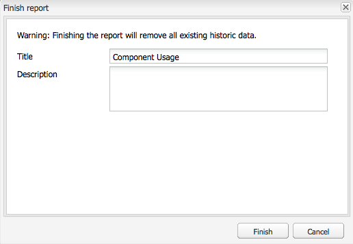
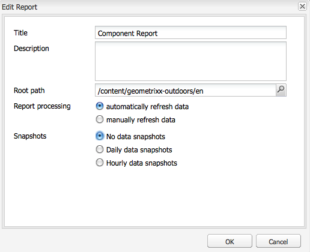

# Generazione rapporti {#reporting}

Per aiutarti a monitorare e analizzare lo stato dell’istanza, AEM fornisce una selezione di rapporti predefiniti, che possono essere configurati per i tuoi requisiti individuali:

* [Report componente](#component-report)
* [Utilizzo disco](#disk-usage)
* [Verifica stato](#health-check)
* [Report attività pagina](#page-activity-report)
* [Report per contenuti generati dall&#39;utente](#user-generated-content-report)
* [Report utente](#user-report)
* [Report di istanze flusso di lavoro](#workflow-instance-report)
* [Report flusso di lavoro](#workflow-report)

È possibile accedere a tutti i rapporti dalla console **Strumenti** . Selezionate **Rapporti** nel riquadro a sinistra, quindi fate doppio clic sul rapporto richiesto nel riquadro a destra per aprirlo e/o per la configurazione.

È inoltre possibile creare nuove istanze di un rapporto dalla console **Strumenti** . **Selezionate** Rapporti **nel riquadro a sinistra, quindi** Nuovo... dalla barra degli strumenti. Definire un **Titolo** e un **Nome**, selezionare il tipo di rapporto desiderato, quindi fare clic su **Crea**. La nuova istanza di report verrà visualizzata nell&#39;elenco. Fate doppio clic su questo per aprire, quindi trascinate un componente dalla barra laterale per creare la prima colonna e avviare la definizione del rapporto.

>[!NOTE]
>
>Oltre ai report standard AEM disponibili ovunque, puoi [sviluppare anche nuovi report](/help/sites-developing/dev-reports.md).

## Nozioni di base sulla personalizzazione dei report {#the-basics-of-report-customization}

Sono disponibili vari formati di rapporti. I report seguenti utilizzano tutte le colonne che possono essere personalizzate come descritto nelle sezioni seguenti:

* [Report componente](#component-report)
* [Report attività pagina](#page-activity-report)
* [Report per contenuti generati dall&#39;utente](#user-generated-content-report)
* [Report utente](#user-report)
* [Report di istanze flusso di lavoro](#workflow-instance-report)

>[!NOTE]
>
>I seguenti rapporti hanno ciascuno un proprio formato e una propria personalizzazione:
>
>
>* [Il controllo](#health-check) stato utilizza i campi di selezione per specificare i dati sui quali si desidera eseguire il rapporto.
>* [Uso](#disk-usage) del disco utilizza i collegamenti per espandere la struttura del repository.
>* [Il rapporto](/help/sites-administering/reporting.md#workflow-report) Workflow offre una panoramica dei flussi di lavoro in esecuzione nell’istanza.
>
>
Pertanto, le seguenti procedure per la configurazione delle colonne non sono appropriate. Per informazioni dettagliate, consultate le descrizioni dei singoli rapporti.

### Selezione e posizionamento delle colonne di dati {#selecting-and-positioning-the-data-columns}

Le colonne possono essere aggiunte, riposizionate o rimosse da uno dei rapporti, sia standard che personalizzati.

La scheda **Componenti** della barra laterale (disponibile nella pagina del rapporto) elenca tutte le categorie di dati che possono essere selezionate come colonne.

Per modificare la selezione dei dati:

* per aggiungere una nuova colonna, trascinate il componente richiesto dalla barra laterale e rilasciatelo nella posizione desiderata

   * un segno di spunta verde indica quando la posizione è valida e una coppia di frecce indica esattamente dove verrà posizionata
   * un simbolo rosso senza uscita indicherà se la posizione non è valida

* per spostare una colonna, fate clic sull’intestazione, tenete premuto e trascinate fino alla nuova posizione
* per rimuovere una colonna, fate clic sul titolo della colonna, tenete premuto e trascinate verso l’alto nell’area dell’intestazione del rapporto (un simbolo meno rosso indica che la posizione non è valida); rilasciate il pulsante del mouse e la finestra di dialogo Elimina componenti per richiedere la conferma dell’eliminazione effettiva della colonna.

### Menu a discesa Colonna {#column-drop-down-menu}

Ogni colonna del rapporto dispone di un menu a discesa. Questo diventa visibile quando il cursore del mouse si sposta sulla cella del titolo della colonna.

Verrà visualizzata una freccia all&#39;estrema destra della cella del titolo (da non confondere con l&#39;indicatore freccia immediatamente a destra del testo del titolo che indica il meccanismo [di ordinamento](#sorting-the-data)corrente).

Le opzioni disponibili nel menu dipendono dalla configurazione della colonna (come avviene durante lo sviluppo del progetto), tutte le opzioni non valide saranno disabilitate.

### Ordinamento dei dati {#sorting-the-data}

I dati possono essere ordinati in base a una colonna specifica tramite:

* facendo clic sull’intestazione della colonna appropriata; l’ordinamento verrà alternato tra crescente e decrescente, indicata da una freccia accanto al testo del titolo
* utilizzare il menu [a discesa della](#column-drop-down-menu) colonna per selezionare in modo specifico **Ordinamento crescente** o **Ordinamento decrescente**; di nuovo, viene indicata da una freccia accanto al testo del titolo

### Gruppi e Grafico dati corrente {#groups-and-the-current-data-chart}

Nelle colonne appropriate è possibile selezionare **Raggruppa per questa colonna** dal menu [a discesa della](#column-drop-down-menu)colonna. I dati verranno raggruppati in base a ciascun valore distinto all&#39;interno di tale colonna. È possibile selezionare più colonne da raggruppare. L&#39;opzione sarà disattivata quando i dati nella colonna non sono appropriati; ossia ogni voce è distinta e univoca, per cui non è possibile formare gruppi, ad esempio la colonna ID utente del rapporto utente.

Dopo aver raggruppato almeno una colonna, verrà generato un grafico a torta con i dati **** correnti, in base a questo raggruppamento. Se più colonne sono raggruppate, anche questo verrà indicato nel grafico.

Spostando il cursore sul grafico a torta, viene visualizzato il valore aggregato per il segmento appropriato. Viene utilizzato l&#39;aggregato attualmente definito per la colonna; ad esempio, count, Minimum, average, tra gli altri.

### Filtri e aggregati {#filters-and-aggregates}

Nelle colonne appropriate è inoltre possibile configurare le impostazioni **dei** filtri e/o gli **aggregati** dal menu [a discesa della](#column-drop-down-menu)colonna.

#### Filtri {#filters}

Impostazioni filtro consente di specificare i criteri per le voci da visualizzare. Gli operatori disponibili sono:

* `contains`
* `equals`

Per impostare un filtro:

1. Selezionare l&#39;operatore desiderato dall&#39;elenco a discesa.
1. Immettere il testo su cui filtrare.
1. Fate clic su **Applica**.

Per disattivare il filtro:

1. Rimuovete il testo del filtro.
1. Fate clic su **Applica**.

#### Aggregati {#aggregates}

È inoltre possibile selezionare un metodo di aggregazione (che può variare a seconda della colonna selezionata):

### Proprietà colonna {#column-properties}

Questa opzione è disponibile solo se la colonna  Generico è stata utilizzata nel report utente.

### Dati storici {#historic-data}

Un grafico delle modifiche apportate ai dati nel tempo è visibile sotto Dati **** storici. Questo è derivato da istantanee effettuate a intervalli regolari.

I dati sono:

* Raccolti dalla prima colonna ordinata, se disponibile, altrimenti dalla prima colonna (non raggruppata)
* Raggruppato dalla colonna appropriata

È possibile generare il rapporto:

1. Impostate **Raggruppamento** sulla colonna richiesta.
1. **Modificare** la configurazione per definire la frequenza con cui le istantanee devono essere effettuate; ogni ora o ogni giorno.
1. **** Fine... la definizione per avviare la raccolta di snapshot.

   Il pulsante del cursore rosso/verde in alto a sinistra indica quando vengono raccolte le istantanee.

Il grafico risultante viene visualizzato in basso a destra:

Una volta avviata la raccolta dei dati, puoi selezionare:

* **Periodo**

   Potete selezionare tra e fino alle date per i dati del rapporto da visualizzare.

* **Intervallo**

   Mese, Settimana, Giorno, Ora possono essere selezionati per la scala e l&#39;aggregazione del rapporto.

   Ad esempio, se le istantanee giornaliere sono disponibili per febbraio 2011:

   * Se l&#39;intervallo è impostato su `Day`, ogni istantanea viene visualizzata come un singolo valore nel grafico.
   * Se l&#39;intervallo è impostato su `Month`, tutte le istantanee di febbraio sono aggregate in un singolo valore (visualizzate come un singolo &quot;punto&quot; nel grafico).

Selezionate i requisiti, quindi fate clic su **Vai** per applicarli al rapporto. Per aggiornare la visualizzazione dopo ulteriori istantanee, fare di nuovo clic su **Vai** .

Quando vengono raccolte delle istantanee, è possibile:

* **Usa** finitura... per reinizializzare la raccolta.

   **Fine** &quot;blocca&quot; la struttura del report (ovvero le colonne assegnate al report e raggruppate, ordinate, filtrate ecc.) e inizia a scattare istantanee.

* Aprite la finestra di dialogo **Modifica** per selezionare **Nessuna snapshot** di dati per terminare la raccolta finché non richiesto.

   **L’opzione Modifica** attiva o disattiva solo l’acquisizione di istantanee. Se si riaccendono le istantanee, viene utilizzato lo stato del report dell&#39;ultima volta che è stato completato per scattare ulteriori istantanee.

>[!NOTE]
>
>Le istantanee sono memorizzate in `/var/reports/...` cui il resto del percorso rispecchia il percorso del rispettivo rapporto e ID creato al termine del rapporto.
>
>
>Le vecchie istantanee possono essere eliminate manualmente, se siete completamente sicuri di non richiederle più.

>[!NOTE]
>
>I report preconfigurati non richiedono elevate prestazioni, ma si consiglia comunque di utilizzare istantanee giornaliere in un ambiente di produzione. Se possibile, eseguire queste istantanee giornaliere in un momento in cui non esiste molta attività sul sito Web; questo può essere definito con il `Daily snapshots (repconf.hourofday)` parametro per **Day CQ Reporting Configuration**; per ulteriori informazioni sulla configurazione di [OSGI, consulta Configurazione](/help/sites-deploying/configuring-osgi.md) OSGI.

#### Limiti di visualizzazione {#display-limits}

Il rapporto dati storici può anche leggermente cambiare aspetto a causa di limiti che possono essere impostati, in base al numero di risultati per il periodo selezionato.

Ogni linea orizzontale è nota come serie (e corrisponde a una voce nella legenda del grafico), ogni colonna verticale di punti rappresenta le istantanee aggregate.

Per mantenere il grafico pulito per periodi di tempo prolungati, è possibile impostare dei limiti. Per i rapporti standard, questi sono:

* serie orizzontale: sia il valore predefinito che il valore massimo del sistema è `9`

* snapshot aggregate verticali - il valore predefinito è `35` (per serie orizzontali)

Quindi, quando i limiti (appropriati) vengono superati, i seguenti:

* i punti non verranno visualizzati
* la legenda del grafico dati cronologico potrebbe mostrare un numero diverso di voci rispetto a quello del grafico dati corrente

I rapporti personalizzati possono anche mostrare il valore **Totale** per tutte le serie. Viene visualizzata come una serie (linea orizzontale e voce nella legenda).

>[!NOTE]
>
>Per i rapporti personalizzati, i limiti possono essere impostati in modo diverso.

### Edit (Report) {#edit-report}

Il pulsante **Modifica** apre la finestra di dialogo **Modifica rapporto** .

Si tratta di una posizione in cui è definito il periodo di raccolta delle istantanee per i dati  storici, ma è possibile definire anche diverse altre impostazioni:

* **Titolo**

   Potete definire il vostro titolo.

* **Descrizione**

   Potete definire una descrizione personalizzata.

* **Percorso** radice (*attivo solo per alcuni report*)

   Utilizzate questa opzione per limitare il rapporto a una sezione (sub) del repository.

* **Elaborazione report**

   * **aggiorna i dati automaticamente**

      I dati del rapporto vengono aggiornati ogni volta che aggiornate la definizione del rapporto.

   * **aggiorna i dati manualmente**

      Questa opzione può essere utilizzata per evitare ritardi causati da operazioni di aggiornamento automatico in presenza di un volume elevato di dati.

      Selezionando questa opzione, i dati del rapporto devono essere aggiornati manualmente quando viene modificato qualsiasi aspetto della configurazione del rapporto. Ciò significa anche che, non appena si modifica qualsiasi aspetto della configurazione, la tabella dei rapporti verrà oscurata.

      Quando questa opzione è selezionata, viene visualizzato il pulsante **[Carica dati](#load-data)**(accanto a **Modifica**nel rapporto).**I dati**di caricamento caricheranno i dati e aggiorneranno i dati del rapporto mostrati.

* **Istantanee**&#x200B;È possibile definire la frequenza delle istantanee; ogni giorno, ogni ora o per niente.

### Carica dati {#load-data}

Il pulsante **Carica dati** è visibile solo se i dati **di aggiornamento** manuale sono stati selezionati da **[Modifica](#edit-report)**.

Fai clic su **Carica dati** per ricaricare i dati e aggiornare il rapporto visualizzato.

Se si seleziona l&#39;aggiornamento manuale dei dati:

1. Non appena si modifica la configurazione del rapporto, i dati della tabella del rapporto vengono oscurati.

   Ad esempio, se modificate il meccanismo di ordinamento per una colonna, i dati non saranno visualizzati.

1. Se si desidera che i dati del rapporto siano nuovamente visualizzati, sarà necessario fare clic su **Carica dati** per ricaricare i dati.

### Finish (report) {#finish-report}

Al **termine** del rapporto:

* La definizione del rapporto *a partire da quel momento* verrà utilizzata per acquisire le istantanee (in seguito sarà possibile continuare a lavorare su una definizione del rapporto così come è poi separata dagli snapshot).
* Eventuali istantanee esistenti verranno rimosse.
* Vengono raccolte nuove istantanee per i dati [storici](#historic-data).

Con questa finestra di dialogo puoi definire, o aggiornare, il tuo titolo e la descrizione per il rapporto risultante.

## Tipi di rapporti {#report-types}

### Report componente {#component-report}

Il rapporto sui componenti fornisce informazioni sull’utilizzo dei componenti da parte del sito Web.

[Colonne di informazioni](#selecting-and-positioning-the-data-columns) su:

* Authoring
* Percorso componente
* Tipo componente
* Ultima modifica
* Pagina

Significato che puoi vedere, ad esempio:

* Quali componenti vengono utilizzati dove.

   Utile, ad esempio, per i test.

* Modalità di distribuzione delle istanze di un componente specifico.

   Può essere interessante se si tratta di pagine specifiche (ad es. &quot;pagine pesanti&quot;) rilevano problemi di prestazioni.

* Identificare parti del sito con modifiche frequenti/meno frequenti.
* Scopri come si sviluppa il contenuto delle pagine nel tempo.

Tutti i componenti sono inclusi, standard di prodotto e specifici per i progetti. Utilizzando la finestra di dialogo **Modifica** , l&#39;utente può anche impostare un percorso **** radice che definisce il punto di inizio del rapporto. Tutti i componenti al di sotto di tale radice vengono considerati per il rapporto.

 report 

### Utilizzo disco {#disk-usage}

Il rapporto sull&#39;uso del disco mostra informazioni sui dati memorizzati nella directory archivio.

Il rapporto inizia nella directory principale ( / ) del repository; facendo clic su un particolare ramo è possibile eseguire il drill-down all&#39;interno della directory archivio (il percorso corrente si riflette nel titolo del rapporto).

### Verifica stato {#health-check}

Questo rapporto analizza il registro delle richieste corrente:

`<cq-installation-dir>/crx-quickstart/logs/request.log`
per identificare le richieste più costose in un determinato periodo di tempo.

Per generare il rapporto è possibile specificare:

* **Periodo (ore)**

   Numero di ore (passate) da analizzare.

   Impostazione predefinita: `24`

* **max. Risultati**

   Numero massimo di linee di output.

   Impostazione predefinita: `50`

* **max. Richieste**

   Numero massimo di richieste da analizzare.

   Predefinito: `-1` (all)

* **Indirizzo e-mail**

   Invia i risultati a un indirizzo e-mail.

   Facoltativo;Predefinito: blank

* **Esegui ogni giorno alle (hh: mm)**

   Specifica l&#39;ora in cui il rapporto deve essere eseguito automaticamente su base giornaliera.

   Facoltativo;Predefinito: blank

### Report attività pagina {#page-activity-report}

Il rapporto sulle attività della pagina elenca le pagine e le azioni eseguite su di esse.

[Colonne di informazioni](#selecting-and-positioning-the-data-columns) su:

* Pagina
* Tempo
* Tipo
* User

È possibile monitorare:

* Ultime modifiche.
* Autori che lavorano su pagine specifiche.
* Pagine che non sono state modificate di recente, potrebbe essere necessario intervenire.
* Pagine modificate più o meno frequentemente.
* La maggior parte / meno utenti attivi.

Il rapporto attività pagina prende tutte le informazioni dal registro di controllo. Per impostazione predefinita, il percorso principale è configurato nel registro di controllo in `/var/audit/com.day.cq.wcm.core.page`.

### Report per contenuti generati dall&#39;utente {#user-generated-content-report}

Questo rapporto fornisce informazioni sul contenuto generato dall’utente; siano commenti, valutazioni o forum.

[Colonne di informazioni](#selecting-and-positioning-the-data-columns) su:

* Data
* Indirizzo IP
* Pagina
* Referrer
* Tipo
* Identificatore utente

Consente di:

* Vedi quali pagine ricevono più commenti.
* Ottenete una panoramica di tutti i commenti che i visitatori specifici del sito stanno lasciando, forse i problemi sono correlati.
* Determinare se il nuovo contenuto sta provocando commenti monitorando quando i commenti vengono inseriti in una pagina.

### Report utente {#user-report}

Questo rapporto fornisce informazioni su tutti gli utenti che hanno registrato un account e/o un profilo; può includere sia autori all’interno dell’organizzazione che visitatori esterni.

[Colonne di informazioni](#selecting-and-positioning-the-data-columns) (se disponibili) su:

* Età
* Paese
* Dominio
* E-mail
* Cognome
* Genere
* [Generico](#generic-column)
* Nome assegnato
* Info
* Interesse
* Lingua
* Hashcode NTLM
* ID utente

Consente di:

* Visualizzare la distribuzione demografica degli utenti.
* Report sui campi personalizzati aggiunti ai profili.

#### Generic Column {#generic-column}

La colonna **Generico** è disponibile nel Rapporto utente in modo da poter accedere alle informazioni personalizzate, in genere dai profili utente; ad esempio, Colore [preferito come illustrato in Aggiunta di campi alla definizione](/help/sites-administering/identity-management.md#adding-fields-to-the-profile-definition)del profilo.

La finestra di dialogo della colonna Generico si aprirà quando:

* Trascinate il componente Generico dalla barra laterale al rapporto.
* Selezionare Proprietà colonna per una colonna Generica esistente.

From the **Definitions** tab you can define:

* **Titolo**

   Titolo personalizzato per la colonna generica.

* **Proprietà**

   Nome della proprietà memorizzato nella directory archivio, in genere all&#39;interno del profilo dell&#39;utente.

* **Percorso**

   Di solito la proprietà viene presa dalla `profile`.

* **Tipo**

   Selezionare il tipo di campo da `String`, `Number`, `Integer`, `Date`.

* **Aggregazione predefinita**

   Questo definisce l&#39;aggregazione utilizzata per impostazione predefinita se la colonna è separata in un rapporto con almeno una colonna raggruppata. Selezionare l&#39;aggregazione desiderata da `Count`, `Minimum`, `Average`, `Maximum`, `Sum`.

   Ad esempio, *Count* per un `String` campo significa che il numero di valori distinti `String` viene visualizzato per la colonna nello stato aggregato.

Nella scheda **Estese** è inoltre possibile definire gli aggregati e i filtri disponibili:

### Report di istanze flusso di lavoro {#workflow-instance-report}

Questo fornisce una breve panoramica delle singole istanze dei flussi di lavoro, sia in esecuzione che completati.

[Colonne di informazioni](#selecting-and-positioning-the-data-columns) su:

* Completato
* Durata
* Iniziatore
* Modello
* Payload
* Avviato
* Stato

È quindi possibile:

* monitorare la durata media dei flussi di lavoro; se questo accade regolarmente, può evidenziare problemi con il flusso di lavoro.

### Report flusso di lavoro {#workflow-report}

Questo fornisce statistiche chiave sui flussi di lavoro in esecuzione nell’istanza.

## Utilizzo dei rapporti in un ambiente di pubblicazione {#using-reports-in-a-publish-environment}

Una volta configurati i rapporti in base ai requisiti specifici, potete attivarli per trasferire la configurazione nell’ambiente di pubblicazione.

>[!CAUTION]
>
>Se desiderate dati **** storici per l’ambiente di pubblicazione, **completate** il rapporto sull’ambiente di authoring prima di attivare la pagina.

La relazione appropriata sarà quindi accessibile in

`/etc/reports`

Ad esempio, il rapporto Contenuto generato dall&#39;utente si trova in:

`http://localhost:4503/etc/reports/ugcreport.html`

A questo punto, verrà generato un rapporto sui dati raccolti dall&#39;ambiente di pubblicazione.

Poiché nell’ambiente di pubblicazione non è consentita alcuna configurazione di rapporto, i pulsanti **Modifica** e **Fine** non sono disponibili. Tuttavia, è possibile selezionare **Periodo** e **Intervallo** per i rapporti sui dati **** storici se vengono raccolte snapshot.

>[!CAUTION]
>
>L&#39;accesso a tali relazioni può costituire una questione di sicurezza; è quindi consigliabile configurare il dispatcher in modo che non `/etc/reports` sia disponibile per i visitatori esterni. Per ulteriori dettagli, vedere l&#39;elenco [di controllo](security-checklist.md) della sicurezza.

## Autorizzazioni necessarie per l’esecuzione dei report {#permissions-needed-for-running-reports}

Le autorizzazioni necessarie dipendono dall’azione:

* I dati del rapporto vengono raccolti utilizzando i privilegi dell&#39;utente corrente.
* I dati storici vengono raccolti utilizzando i privilegi dell&#39;utente che ha completato il rapporto.

In un’installazione standard di AEM le seguenti autorizzazioni sono predefinite per i rapporti:

* **Report utente**

   `user administrators` - lettura e scrittura

* **Report attività pagina**

   `contributors` - lettura e scrittura

* **Report componente**

   `contributors` - lettura e scrittura

* **Report per contenuti generati dall&#39;utente**

   `contributors` - lettura e scrittura

* **Report di istanze flusso di lavoro**

   `workflow-users` - lettura e scrittura

Tutti i membri del `administrators` gruppo dispongono dei diritti necessari per creare nuovi rapporti.
