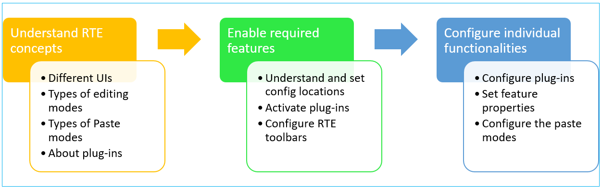

# Configurare l’editor Rich Text {#configure-the-rich-text-editor}

L’editor Rich Text offre agli autori un’ampia gamma di funzionalità per modificare il contenuto di testo. Sono disponibili icone, caselle di selezione, barre degli strumenti e menu per un&#39;esperienza di modifica del testo WYSIWYG.

Per informazioni su come utilizzare le funzionalità dell&#39;editor Rich Text per l&#39;authoring, vedere [Utilizzare l&#39;editor Rich Text per l&#39;authoring](/help/sites-authoring/rich-text-editor.md). L’editor Rich Text può essere configurato per abilitare, disabilitare ed estendere le funzioni disponibili nei componenti di authoring. Il seguente flusso di lavoro illustra un ordine consigliato per il completamento delle attività di configurazione dell’editor Rich Text in Experience Manager.



*Figura: sequenza di passaggi per imparare a configurare l&#39;editor Rich Text*

## Interfaccia utente touch e interfaccia classica {#understand-touch-enabled-ui-and-classic-ui}

L’interfaccia touch è quella standard, ad Experience Manager. L&#39;Adobe ha introdotto l&#39;interfaccia touch con [responsive design](/help/sites-authoring/responsive-layout.md) per l&#39;ambiente di authoring. L’interfaccia touch è progettata per i dispositivi touch e desktop. L’interfaccia di si differenzia notevolmente dall’interfaccia classica originale.


*Figura: barra degli strumenti dell&#39;editor Rich Text nell&#39;interfaccia utente touch*


*Figura: barra degli strumenti dell&#39;editor Rich Text nell&#39;interfaccia classica*

>[!MORELIKETHIS]
>
>* [Consigli per l&#39;interfaccia utente](/help/sites-deploying/ui-recommendations.md)
>* Informazioni sulla rimozione dell&#39;interfaccia classica, vedere [Note sulla versione dell&#39;Experience Manager 6.5](/help/release-notes/deprecated-removed-features.md)
>* Per informazioni sulla differenza tra le interfacce utente, vedere [Interfaccia utente touch e Interfaccia classica](https://aemcq5pedia.wordpress.com/2018/01/05/touch-enabled-ui-aem6-3/)
>* Per informazioni dettagliate sull&#39;interfaccia utente touch, vedere [Concetti sull&#39;interfaccia utente touch di Experience Manager](/help/sites-developing/touch-ui-concepts.md)

## Varie modalità di editing {#editingmodes}

Gli autori possono creare e modificare il contenuto testuale in Experience Manager utilizzando le diverse modalità dei componenti. Le opzioni della barra degli strumenti per l’authoring e la formattazione dei contenuti e l’esperienza utente dei componenti abilitati per l’editor Rich Text in diverse modalità di modifica variano in base alle configurazioni dell’editor Rich Text.

| Modalità di modifica | Area di modifica | Funzioni consigliate da abilitare | Interfaccia utente touch | Interfaccia classica |
|--- |--- |--- |--- |--- |
| In linea | Modifica diretta per modifiche rapide e minori; Formattazione senza apertura di una finestra di dialogo | Caratteristiche minime dell’editor Rich Text | Y | Y |
| Editor Rich Text a schermo intero | Copre l&#39;intera pagina | Tutte le funzionalità richieste dell&#39;editor Rich Text | Y | N |
| Finestra di dialogo | Finestra di dialogo sopra il contenuto della pagina, ma non copre l’intera pagina | Tutte le funzioni dell’editor Rich Text richieste nell’interfaccia classica; abilita in modo giudizioso le funzioni nell’interfaccia touch | Y | Y |
| Finestra di dialogo a schermo intero | Come modalità a tutto schermo; contiene campi della finestra di dialogo insieme all’editor Rich Text | Tutte le funzionalità richieste dell&#39;editor Rich Text | Y | N |

>[!NOTE]
>
>La funzione di modifica dell’origine non è disponibile in modalità di modifica in linea nell’interfaccia utente touch. Non è possibile trascinare le immagini in modalità a schermo intero. Tutte le altre funzioni funzionano in tutte le modalità.

### Modifica in linea {#inline-editing}

All’apertura (con un doppio clic lento) è possibile modificare il contenuto all’interno della pagina. Viene visualizzata una barra degli strumenti compatta con opzioni di base.


*Figura: modifica in linea con barra degli strumenti di base nell&#39;interfaccia utente touch*

Nell’interfaccia classica, un doppio clic lento sul componente consente la modifica in linea e un contorno arancione evidenzia il contenuto. Se Content Finder è aperto, nella parte superiore della finestra viene visualizzata una barra degli strumenti con le opzioni di formattazione RTE disponibili. Se Content Finder non è aperto, le opzioni di formattazione non vengono visualizzate ed è possibile apportare solo semplici modifiche al testo.

### Modifica a tutto schermo {#full-screen-editing}

I componenti di Experience Manager possono essere aperti in visualizzazione a schermo intero che nasconde il contenuto della pagina e occupa lo schermo disponibile. Prendi in considerazione la modifica a schermo intero di una versione dettagliata della modifica in linea, in quanto offre le opzioni di modifica più avanzate. Per aprirlo, fai clic su  nella barra degli strumenti compatta quando utilizzi la modalità di modifica in linea.

Nella finestra di dialogo in modalità a tutto schermo, insieme a una barra degli strumenti dettagliata dell’editor Rich Text, sono disponibili anche le opzioni e i componenti disponibili in una finestra di dialogo. È applicabile solo a una finestra di dialogo che contiene l’editor Rich Text insieme ad altri componenti.


*Figura: la barra degli strumenti dettagliata dell&#39;editor Rich Text quando si modifica in modalità a schermo intero nell&#39;interfaccia utente touch*

### Modifica finestre di dialogo {#dialog-editing}

Quando si fa doppio clic su un componente, viene visualizzata una finestra di dialogo per la modifica del contenuto. La finestra di dialogo viene visualizzata sopra la pagina esistente. In alcuni scenari specifici, la finestra di dialogo si apre come finestra pop-up. Ad esempio, quando un componente Testo fa parte di una colonna in un layout di pagina a più colonne e l’area disponibile per la finestra di dialogo è inferiore.


*Figura: modalità di modifica delle finestre di dialogo nell&#39;interfaccia utente touch*


*Figura: finestra di dialogo nell&#39;interfaccia classica contenente la barra degli strumenti dettagliata per la modifica*

## Informazioni sui plug-in dell’editor Rich Text e sulle funzioni associate {#aboutplugins}

Questa funzionalità è disponibile tramite una serie di plug-in, ciascuno con:

* Una proprietà `features`:

   * Utilizzato per attivare o disattivare le funzionalità di base di quel plug-in
   * Che può essere configurato utilizzando una procedura standard

* Se necessario, proprietà e opzioni aggiuntive che richiedono una configurazione specializzata.

Le funzionalità di base dell&#39;editor Rich Text vengono attivate o disattivate dal valore della proprietà `features` in un nodo specifico del plug-in appropriato.

Nella tabella seguente sono elencati i plug-in correnti:

* ID plug-in con collegamento alla documentazione API. ID utilizzato come nome del nodo durante l&#39;attivazione di un plug-in [1&rbrace;.](/help/sites-administering/configure-rich-text-editor-plug-ins.md#activateplugin)
* Valori consentiti per la proprietà `features`.
* Descrizione delle funzionalità fornite dal plug-in.

| ID plug-in | funzioni | Descrizione |
|--- |--- |--- |
| modifica | taglia copia-incolla-predefinito-incolla-testo-incolla-parole-html | [Taglia, copia e, le tre modalità Incolla](/help/sites-administering/configure-rich-text-editor-plug-ins.md#textstyles). |
| findreplace | trova sostituisci | Trova e sostituisci. |
| formato | sottolineatura grassetto corsivo | [Formattazione testo di base](/help/sites-administering/configure-rich-text-editor-plug-ins.md#textstyles). |
| immagine | immagine | Supporto immagini di base (trascinamento dal contenuto o da Content Finder). A seconda del browser, il supporto presenta comportamenti diversi per gli autori |
| tasti |  | Per definire questo valore, vedere [dimensioni scheda](/help/sites-administering/configure-rich-text-editor-plug-ins.md#tabsize). |
| giustificare | justifyleft justifycenter justifyright | Allineamento paragrafo. |
| collegamenti | modifylink scollega ancoraggio | [Collegamenti ipertestuali e ancoraggi](/help/sites-administering/configure-rich-text-editor-plug-ins.md#linkstyles). |
| elenchi | rientro non ordinato ordinato rientro | Questo plug-in controlla sia il rientro [che gli elenchi](/help/sites-administering/configure-rich-text-editor-plug-ins.md#indentmargin), inclusi gli elenchi nidificati. |
| misctools | specialchars sourceedit | Strumenti vari consentono agli autori di immettere [caratteri speciali](/help/sites-administering/configure-rich-text-editor-plug-ins.md#spchar) o modificare l&#39;origine HTML. Inoltre, puoi aggiungere un intero [intervallo di caratteri speciali](/help/sites-administering/configure-rich-text-editor-plug-ins.md#definerangechar) se desideri definire un tuo elenco. |
| Paraformat | paraformat | I formati di paragrafo predefiniti sono Paragrafo, Titolo 1, Titolo 2 e Titolo 3 (`<p>`, `<h1>`, `<h2>` e `<h3>`). È possibile [aggiungere altri formati di paragrafo](/help/sites-administering/configure-rich-text-editor-plug-ins.md#paraformats) o estendere l&#39;elenco. |
| controllo ortografico | testo di controllo | [Controllo ortografico in base alla lingua](/help/sites-administering/configure-rich-text-editor-plug-ins.md#adddict). |
| stili | stili | Supporto per lo stile tramite una classe CSS. [Aggiungere nuovi stili di testo](/help/sites-administering/configure-rich-text-editor-plug-ins.md#textstyles) se si desidera aggiungere o estendere un intervallo personalizzato di stili da utilizzare con il testo. |
| pedice | pedice apice | Estensioni ai formati di base, con l’aggiunta di pedice e pedice. |
| tabella | tabella rimovibile insertrow removerow insertcolumn removecolumn cellcellprops mergecells splitcell selectrow selectcolumns | Per aggiungere stili personalizzati per intere tabelle o singole celle, vedere [configurare gli stili di tabella](/help/sites-administering/configure-rich-text-editor-plug-ins.md#tablestyles). |
| annulla | annulla ripetizione | Dimensione cronologia di [operazioni Annulla e Ripristina](/help/sites-administering/configure-rich-text-editor-plug-ins.md#undohistory). |

>[!NOTE]
>
>Il plug-in a schermo intero non è supportato nella modalità finestra di dialogo. Utilizzo dell&#39;impostazione `dialogFullScreen` per configurare la barra degli strumenti per la modalità a schermo intero.

## Comprendere i percorsi e le posizioni di configurazione {#understand-the-configuration-paths-and-locations}

La modalità [di modifica dell&#39;editor Rich Text (e l&#39;interfaccia utente)](#editingmodes) fornita agli autori determinano il percorso per i dettagli di configurazione quando si attivano [i plug-in dell&#39;editor Rich Text](/help/sites-administering/configure-rich-text-editor-plug-ins.md#activateplugin):

| Modalità di modifica | Posizione per l’interfaccia utente touch | Posizione per l’interfaccia classica |
|---|---|---|
| In linea | `cq:editConfig/cq:inplaceEditing` | `cq:editConfig/cq:inplaceEditing` |
| Schermo intero | `cq:editConfig/cq:inplaceEditing` | Non applicabile |
| Finestra di dialogo | `cq:dialog` | `dialog` |
| Finestra di dialogo a schermo intero | `cq:dialog` | Non applicabile |

>[!NOTE]
>
>Non denominare il nodo in `cq:inplaceEditing` come `config`. Nel nodo `cq:inplaceEditing`, definire le proprietà seguenti:
>* **Nome**: `configPath`
>* **Tipo**: `String`
>* **Valore**: percorso del nodo contenente la configurazione effettiva
>
>Non assegnare al nodo di configurazione dell&#39;Editor Rich Text il nome `config`. In caso contrario, le configurazioni dell&#39;editor Rich Text avranno effetto solo per gli amministratori e non per gli utenti del gruppo `content-author`.

Configura le seguenti proprietà che si applicano in modalità di modifica Finestra di dialogo solo nell’interfaccia utente touch:

* `useFixedInlineToolbar`: impostare questa proprietà booleana definita nel nodo dell&#39;editor Rich Text (uno con sling:resourceType= `cq/gui/components/authoring/dialog/richtext`) su `True`, in modo che la barra degli strumenti dell&#39;editor Rich Text sia fissa anziché mobile.

  Quando questa proprietà è true, la modifica del testo Rich Text viene avviata per impostazione predefinita sull&#39;evento &quot;foundation-contentloaded&quot;.

  Per evitare questo problema, impostare la proprietà `customStart` su `True` e attivare l&#39;evento &#39;rte-start&#39; per avviare la modifica dell&#39;editor Rich Text. Quando questa proprietà è impostata su &#39;true&#39;, il comportamento predefinito, ovvero la velocità di avvio al clic, non funziona.

* `customStart`: impostare questa proprietà booleana definita nel nodo dell&#39;editor Rich Text su `True`, per controllare quando avviare l&#39;editor Rich Text attivando l&#39;evento `rte-start`.

* `rte-start`: attiva questo evento il `contenteditable-div` dell&#39;editor Rich Text, quando iniziare la modifica dell&#39;editor Rich Text. Questo funziona solo se `customStart` è stato impostato su true.

Quando si utilizza l&#39;editor Rich Text nella finestra di dialogo touch, è obbligatorio impostare la proprietà `useFixedInlineToolbar` su true per evitare problemi.

## Personalizzazione della modifica diretta {#customizing-in-place-editing}

Puoi definire su quale selettore di HTML viene avviato l’editor di testo configurando le seguenti proprietà:

* **`editElementQuery`** - Definita il `cq:InplaceEditingConfig`, questa proprietà viene utilizzata per specificare un selettore dell&#39;elemento HTML su cui verrà avviata la modifica in linea per il componente Testo. Se non viene specificato diversamente, la modifica in linea viene avviata direttamente sul componente Testo di HTML.
* **`textPropertyName`** - Definita il `cq:InplaceEditingConfig`, questa proprietà viene utilizzata per specificare il nome della proprietà che verrà salvata nel nodo del contenuto in cui il valore HTML del componente testo verrà mantenuto dopo la modifica in linea.

La proprietà corrispondente per la modalità finestra di dialogo è `name`.

## Abilitare le funzionalità dell’editor Rich Text attivando i plug-in {#enable-rte-functionalities-by-activating-plug-ins}

Le funzionalità dell’editor Rich Text sono disponibili tramite una serie di plug-in, ciascuno con la proprietà Features. Puoi configurare la proprietà features per abilitare o disabilitare le varie funzioni di ciascun plug-in.

Per informazioni dettagliate sulle configurazioni dei plug-in dell&#39;editor Rich Text, vedere [come attivare e configurare i plug-in dell&#39;editor Rich Text](/help/sites-administering/configure-rich-text-editor-plug-ins.md).

**Esempio**: scarica [questa configurazione di esempio](/help/sites-administering/assets/rte-sample-all-features-enabled-10.zip) che illustra come configurare l&#39;editor Rich Text. In questo pacchetto sono abilitate tutte le funzioni.

>[!NOTE]
>
>Il componente di testo [Componenti core](https://experienceleague.adobe.com/docs/experience-manager-core-components/using/components/text.html#the-text-component-and-the-rich-text-editor) consente agli editor di modelli di configurare molti plug-in dell&#39;editor Rich Text in un&#39;interfaccia grafica come criteri di contenuto, eliminando la necessità di configurazione tecnica. I criteri dei contenuti possono funzionare con le configurazioni dell’interfaccia utente dell’editor Rich Text come descritto in questo documento.
>
>Per ulteriori informazioni, consulta la sezione [Impostazioni dell&#39;interfaccia utente e criteri del contenuto](/help/sites-administering/rich-text-editor.md) di questo documento e [Creazione di modelli di pagina](/help/sites-authoring/templates.md) e la [documentazione per gli sviluppatori di Componenti core](https://experienceleague.adobe.com/docs/experience-manager-core-components/using/developing/developing.html).

>[!NOTE]
>
>A scopo di riferimento, i componenti di testo predefiniti (forniti come parte di un’installazione standard) sono disponibili all’indirizzo:
>
>* `/libs/wcm/foundation/components/text`
>* `/libs/foundation/components/text`
>
>Per creare un componente testo personalizzato, copia il componente precedente invece di modificare questi componenti.

## Configurare la barra degli strumenti dell’editor Rich Text {#dialogfullscreen}

AEM consente di configurare l’interfaccia per l’Editor Rich Text in modo diverso a seconda delle diverse modalità di modifica. Di seguito sono riportate le impostazioni predefinite. Puoi modificare questi valori predefiniti in base alle tue esigenze. Puoi personalizzare solo le funzioni della barra degli strumenti che desideri fornire agli autori. Non è necessario specificare tutte le configurazioni della barra degli strumenti.

Per configurare la barra degli strumenti per `dialogFullScreen`, utilizzare la seguente configurazione di esempio.

```java
<uiSettings jcr:primaryType="nt:unstructured">
  <cui jcr:primaryType="nt:unstructured">
    <inline
      jcr:primaryType="nt:unstructured"
      toolbar="[format#bold,format#italic,format#underline,#justify,#lists,links#modifylink,links#unlink,#paraformat]">
      <popovers jcr:primaryType="nt:unstructured">
        <justify
          jcr:primaryType="nt:unstructured"
          items="[justify#justifyleft,justify#justifycenter,justify#justifyright,justify#justifyjustify]"
          ref="justify"/>
        <lists
          jcr:primaryType="nt:unstructured"
          items="[lists#unordered,lists#ordered,lists#outdent,lists#indent]"
          ref="lists"/>
        <paraformat
          jcr:primaryType="nt:unstructured"
          items="paraformat:getFormats:paraformat-pulldown"
          ref="paraformat"/>
      </popovers>
    </inline>
    <dialogFullScreen
      jcr:primaryType="nt:unstructured"
      toolbar="[format#bold,format#italic,format#underline,justify#justifyleft,justify#justifycenter,justify#justifyright,justify#justifyjustify,lists#unordered,lists#ordered,lists#outdent,lists#indent,links#modifylink,links#unlink,table#createoredit,#paraformat,image#imageProps]">
      <popovers jcr:primaryType="nt:unstructured">
        <paraformat
          jcr:primaryType="nt:unstructured"
          items="paraformat:getFormats:paraformat-pulldown"
          ref="paraformat"/>
      </popovers>
    </dialogFullScreen>
    <tableEditOptions
      jcr:primaryType="nt:unstructured"
      toolbar="[table#insertcolumn-before,table#insertcolumn-after,table#removecolumn,-,table#insertrow-before,table#insertrow-after,table#removerow,-,table#mergecells-right,table#mergecells-down,table#mergecells,table#splitcell-horizontal,table#splitcell-vertical,-,table#selectrow,table#selectcolumn,-,table#ensureparagraph,-,table#modifytableandcell,table#removetable,-,undo#undo,undo#redo,-,table#exitTableEditing,-]">
    </tableEditOptions>
  </cui>
</uiSettings>
```

Vengono utilizzate diverse impostazioni dell’interfaccia utente per la modalità in linea e per la modalità a schermo intero. La proprietà toolbar viene utilizzata per specificare i pulsanti della barra degli strumenti.

Ad esempio, se il pulsante è esso stesso una funzionalità (ad esempio, `Bold`), viene specificato come `PluginName#FeatureName` (ad esempio, `links#modifylink`).

Se il pulsante è un popover (contenente alcune caratteristiche di un plug-in), viene specificato come `#PluginName` (ad esempio, `#format`).

È possibile specificare separatori (`|`) tra un gruppo di pulsanti con `-`.

Il nodo pop-up in modalità in linea o a schermo intero contiene un elenco dei popover utilizzati. Ogni nodo figlio sotto il nodo &#39;popovers&#39; prende il nome dal plug-in (ad esempio, il formato). La proprietà &#39;items&#39; contiene un elenco di caratteristiche del plug-in (ad esempio, format#bold).

## Impostazioni dell’interfaccia utente e criteri dei contenuti dell’Editor Rich Text {#rtecontentpolicies}

Gli amministratori possono controllare le opzioni dell’editor Rich Text utilizzando i criteri del contenuto, ad esempio anziché eseguire la configurazione come descritto in precedenza. I criteri del contenuto definiscono le proprietà di progettazione di un componente quando viene utilizzato come parte di un [modello modificabile](/help/sites-authoring/templates.md). Ad esempio, se un componente testo che utilizza l’editor Rich Text viene utilizzato con un modello modificabile, il criterio del contenuto può definire che l’opzione grassetto sia disponibile e che siano disponibili alcune opzioni di formattazione di paragrafo. I criteri per i contenuti sono riutilizzabili e possono essere applicati a più modelli.

Le opzioni disponibili nell’editor Rich Text scorrono a valle dalle configurazioni dell’interfaccia utente ai criteri dei contenuti.

* Le impostazioni di configurazione dell’interfaccia utente definiscono le opzioni disponibili per i criteri dei contenuti.
* Se la configurazione dell&#39;interfaccia utente dell&#39;editor Rich Text è stata rimossa o non consente un elemento, il criterio del contenuto non è in grado di configurarlo.
* Un autore ha accesso solo alle funzionalità rese disponibili dalle configurazioni dell’interfaccia utente e dai criteri dei contenuti.

Ad esempio, puoi visualizzare la [documentazione dei componenti core testo](https://experienceleague.adobe.com/docs/experience-manager-core-components/using/wcm-components/text.html#the-text-component-and-the-rich-text-editor).

## Personalizzare la mappatura tra icone e comandi della barra degli strumenti {#iconstoolbar}

È possibile personalizzare la mappatura tra le icone Coral visualizzate sulla barra degli strumenti dell&#39;editor Rich Text e i comandi disponibili. Oltre alle icone Coral, non è possibile utilizzare altre icone.

1. Creare un nodo denominato `icons` in `uiSettings/cui`.

1. Crea nodi per le singole icone al di sotto di esso.
1. Su ciascuno dei singoli nodi delle icone, specificate un&#39;icona Coral e un comando da mappare sull&#39;icona.

Di seguito è riportato uno snippet di esempio per mappare il comando Bold sull&#39;icona Coral denominata `textItalic`.

```java
<text jcr:primaryType="nt:unstructured" sling:resourceType="cq/gui/components/authoring/dialog/richtext" name="./text" useFixedInlineToolbar="{Boolean}true">
    <rtePlugins jcr:primaryType="nt:unstructured">
        <format jcr:primaryType="nt:unstructured" features="bold,italic"/>
    </rtePlugins>
    <uiSettings jcr:primaryType="nt:unstructured">
        <cui jcr:primaryType="nt:unstructured">
            <inline jcr:primaryType="nt:unstructured"
                toolbar="[format#bold,format#italic,format#underline,links#modifylink,links#unlink]">
            </inline>
            <icons jcr:primaryType="nt:unstructured">
                <bold jcr:primaryType="nt:unstructured"
                    command="format#bold"
                    icon="textItalic"/>
            </icons>
        </cui>
    </uiSettings>
</text>
```

## Passa all’editor Rich Text di CoralUI 2 {#switch-to-coralui-rich-text-editor}

In una pagina, puoi includere la libreria client di CoralUI 2 RTE o la libreria client di CoralUI 3 RTE. Per impostazione predefinita, l’Editor Rich Text include la libreria client CoralUI 3 RTE. Per passare a CoralUI 2 RTE, effettuare le seguenti operazioni.

>[!NOTE]
>
>L’Adobe non lo consiglia come best practice. Passa a CoralUI 2 RTE come ultima risorsa. I plug-in personalizzati per l’editor Rich Text CoralUI 2 funzionano con l’editor Rich Text CoralUI 3 se i plug-in non dipendono dagli elementi interni dell’editor Rich Text, come le classi.
>
>Se si utilizzano plug-in personalizzati per CoralUI3 RTE, utilizzare la libreria `rte.coralui3`.


1. Sovrapporre il nodo `/libs/cq/gui/components/authoring/editors/clientlibs/core` in `/apps` ed effettuare le seguenti operazioni:

   * Sostituire `rte.coralui3` con `rte.coralui2` per la proprietà dependencies.
   * Sostituisci `cq.authoring.editor.core.inlineediting.rte.coralui3` con `cq.authoring.editor.core.inlineediting.rte.coralui2` per la proprietà di incorporamento.
   * Sostituisci `cq.authoring.rte.coralui3` con `cq.authoring.rte.coralui2` per la proprietà di incorporamento.

1. Sovrapponi i nodi `/libs/cq/gui/components/authoring/dialog/richtext/clientlibs/rte/coralui3` e `/libs/cq/gui/components/authoring/dialog/richtext/clientlibs/rte/coralui2` in `/apps`.

   Rimuovere la categoria `cq.authoring.dialog` da `/apps/cq/gui/components/authoring/dialog/richtext/clientlibs/rte/coralui3` e aggiungerla a `/apps/cq/gui/components/authoring/dialog/richtext/clientlibs/rte/coralui2`.

1. Modificare qualsiasi altra dipendenza inclusa nella pagina da `rte.coralui3` a `rte.coralui2`. Ad esempio, dopo aver sovrapposto il nodo `/libs/mcm/campaign/components/touch-ui/clientlibs/rte` in `/apps`, modificare qualsiasi dipendenza da esso da `rte.coralui3` a `rte.coralui2`.

1. Sovrapponi il nodo `cq/ui/widgets` in `/apps`. Sostituire la dipendenza `cq.rte` nel nodo `/apps/cq/ui/widgets` con `cq.coralui2.rte`.

>[!NOTE]
>
>CoralUI 2 RTE utilizza i modelli Handlebars per le finestre di dialogo dei plug-in. Pertanto, la clientlib dell’editor Rich Text di CoralUI 2 aveva una dipendenza dalla clientlib Handlebars. L’editor Rich Text CoralUI 3 non utilizza modelli Handlebars e non ha alcuna dipendenza associata. Se i plug-in personalizzati utilizzano modelli Handlebars, includi la clientlib Handlebars nella pagina web.

## Ulteriori informazioni {#further-information}

Per ulteriori informazioni sulla configurazione dell&#39;editor Rich Text, vedere il riferimento all&#39;[API del widget AEM](https://developer.adobe.com/experience-manager/reference-materials/6-5/widgets-api/index.html?class=CQ.form.RichText).

In particolare, per visualizzare i plug-in e le opzioni correlate disponibili:

* Il componente [CQ.form.RichText](https://developer.adobe.com/experience-manager/reference-materials/6-5/widgets-api/index.html?class=CQ.form.RichText) fornisce un campo modulo per la modifica di informazioni di testo formattato (testo formattato). Per informazioni su tutti i parametri disponibili per il modulo Rich Text, vedere Opzioni di configurazione.
* Il componente RichText offre un&#39;ampia gamma di funzionalità utilizzando i plug-in elencati in [CQ.form.rte.plugins.Plugin](https://developer.adobe.com/experience-manager/reference-materials/6-5/widgets-api/index.html?class=CQ.form.rte.plugins.Plugin). Per ogni plug-in:

   * Per informazioni dettagliate sulle funzionalità che è possibile attivare (o disattivare), vedere Funzionalità.
   * Per informazioni dettagliate sulla configurazione del plug-in appropriato, consulta Opzioni di configurazione per tutti i parametri disponibili.

* Sono inoltre disponibili ulteriori informazioni sulle regole HTML per i collegamenti.

che possono essere utilizzati per estendere e personalizzare l’editor Rich Text. Ad esempio, per elencare gli ancoraggi disponibili nella pagina durante la creazione di un collegamento, puoi fornire la tua implementazione di `LinkPlugin`.

## Limitazioni note {#known-limitations}

La funzionalità AEM RTE presenta le seguenti limitazioni:

* Le funzionalità di editor Rich Text sono supportate solo nelle finestre di dialogo dei componenti AEM. L&#39;editor Rich Text non è supportato nelle creazioni guidate o nei moduli Foundation come [Proprietà pagina](/help/sites-developing/page-properties-views.md) e [Scaffolding](/help/sites-authoring/scaffolding.md) nell&#39;interfaccia utente touch.

* AEM non funziona su [dispositivi ibridi](/help/release-notes/release-notes.md).

* Non denominare il nodo di configurazione dell&#39;editor Rich Text `config`. In caso contrario, la configurazione dell&#39;editor Rich Text verrà applicata solo agli amministratori e non agli utenti del gruppo `content-author`.

* L’editor Rich Text non supporta il frame in linea o l’iframe per incorporare il contenuto.

## Best practice e suggerimenti {#best-practices-and-tips}

* Abilita solo i plug-in senza pop-up per una finestra di dialogo mobile. I plug-in senza pop-up sono di dimensioni ridotte e sono più adatti per una finestra di dialogo mobile.
* Abilitare i plug-in con popup più grandi, ad esempio il plug-in `Paste`, solo nella modalità di dialogo a schermo intero o in modalità a schermo intero. I plug-in con un pop-up di grandi dimensioni richiedono più spazio sullo schermo per fornire una buona esperienza di authoring.
* Se si utilizzano plug-in personalizzati per CoralUI3 RTE, utilizzare la libreria `rte.coralui3`.

## Risoluzione dei problemi frequenti relativi all’editor Rich Text {#troubleshoot-issues-with-aem-rich-text-editor}

**Come selezionare più celle di tabella?**

Per selezionare più celle in una tabella, premere il tasto `Ctrl` o `Cmd` e quindi fare clic sulle celle della tabella una per una.

A questo punto eseguire l&#39;operazione sulla selezione, ad esempio impostare le proprietà delle celle selezionate.

**I collegamenti ipertestuali vengono persi durante la modifica di un componente tramite il pulsante Configura**

Aggiungere un collegamento ipertestuale in un componente testo modificandolo tramite il pulsante Configura. È possibile che il collegamento ipertestuale venga perso quando viene modificato di nuovo e convalidato per la seconda volta.

Una soluzione consiste nel fare clic nel componente testo quando viene visualizzata la seconda volta la finestra di dialogo per modifica, quindi eseguire la convalida del collegamento.

Questo problema è stato risolto con AEM 6.3 e versioni successive.

**Il contenuto HTML aggiunto in modalità di modifica origine è andato perso**

Non aggiungere un HTML XSS-prone. L’AEM, e non l’editor Rich Text, può rimuovere alcuni contenuti HTML per rispettare le regole antisamiche XSS.

Per verificare che il HTML incollato sia stato salvato, controlla il contenuto salvato in CRXDE (nel nodo del contenuto).

Se non viene salvato, il HTML deve essere stato rimosso dall’editor Rich Text in quanto non è conforme alle regole dell’editor Rich Text.

Se viene salvata in CRXDE ma non viene riprodotta nella pagina (per verificare il rendering, vedi l&#39;[anteprima](/help/sites-authoring/editing-content.md#preview-mode) della pagina, viene rimossa dalle regole AEM XSS.

**Il componente Multifield non funziona come previsto**

Per creare un componente con più campi, utilizza esclusivamente CoralUI 3. Non utilizzare le finestre di dialogo dei componenti di CoralUI 2.

Inoltre, verifica che il codice di implementazione multifield e la struttura dei nodi siano corretti.

**La configurazione disponibile per gli amministratori non è disponibile per gli autori**

Se gli aggiornamenti delle configurazioni dell&#39;interfaccia vengono rispecchiati per gli amministratori ma non per gli account di authoring, verificare che il nodo di configurazione non sia denominato `config`. Utilizzare la proprietà [`configPath`](/help/sites-developing/components-basics.md#cq-inplaceediting).

>[!MORELIKETHIS]
>
>* [Configurare i plug-in dell&#39;editor Rich Text](configure-rich-text-editor-plug-ins.md)
>* [Utilizza l&#39;editor Rich Text per l&#39;authoring](../sites-authoring/rich-text-editor.md)
>* [Configurare l&#39;editor Rich Text per i siti accessibili](rte-accessible-content.md)
>* [Parità di funzioni per l&#39;interfaccia touch e l&#39;interfaccia classica](../release-notes/touch-ui-features-status.md)
>* [Esempio di esercitazione per creare un componente con più campi composito](https://experience-aem.blogspot.com/2019/05/aem-65-touchui-composite-multifield-with-coral3-rte-rich-text.html)
