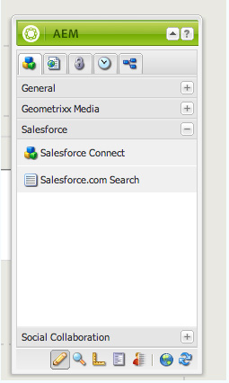
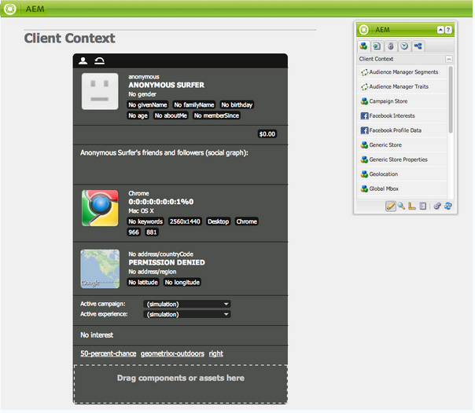
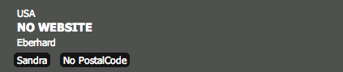

# Integrazione con Salesforce {#integrating-with-salesforce}

L’integrazione di Salesforce con AEM fornisce funzionalità di gestione dei lead e sfrutta le funzionalità esistenti fornite in dotazione da Salesforce. Puoi configurare AEM per la pubblicazione dei lead su Salesforce e creare componenti che accedono direttamente ai dati da Salesforce.

L’integrazione bidirezionale ed estensibile tra AEM e Salesforce consente:

* Organizzazioni per utilizzare e aggiornare completamente i dati per migliorare la customer experience.
* Impegno dal marketing alle attività di vendita.
* Organizzazioni per trasmettere e ricevere automaticamente i dati da un datastore Salesforce.

Il presente documento descrive quanto segue:

* come configurare i Cloud Services Salesforce (configurare AEM per l’integrazione con Salesforce).
* come utilizzare le informazioni di contatto/lead di Salesforce nel contesto client e per la personalizzazione.
* come utilizzare il modello di flusso di lavoro Salesforce per pubblicare gli utenti AEM come conduce a salesforce.
* come creare un componente che mostri i dati di Salesforce.

## Configurazione di AEM da integrare con Salesforce {#configuring-aem-to-integrate-with-salesforce}

Per configurare AEM da integrare con Salesforce, devi prima configurare un’applicazione di accesso remoto in Salesforce. Quindi configura il servizio cloud di salesforce per puntare a questa applicazione di accesso remoto.

>[!NOTE]
>
>Puoi creare un account sviluppatore gratuito in Salesforce.

Per configurare AEM da integrare con Salesforce:

>[!CAUTION]
>
>È necessario installare il [API Salesforce Force](https://experience.adobe.com/#/downloads/content/software-distribution/en/aem.html?fulltext=salesforce*&amp;orderby=%40jcr%3Acontent%2Fjcr%3AlastModified&amp;orderby.sort=desc&amp;layout=list&amp;p.offset=0&amp;p.limit=1&amp;package=%2Fcontent%2Fsoftware-distribution%2Fen%2Fdetails.html%2Fcontent%2Fdam%2Faem%2Fpublic%2Fadobe%2Fpackages%2Fcq650%2Ffeaturepack%2Fcom.adobe.cq.mcm.salesforce.content) pacchetto di integrazione prima di continuare con la procedura. Per ulteriori dettagli su come lavorare con i pacchetti, consulta la sezione [Come lavorare con i pacchetti](/help/sites-administering/package-manager.md#package-share) pagina.

1. In AEM, passa a **Cloud Services**. In Servizi di terze parti, fai clic su **Configura ora** in **Salesforce**.

   

1. Crea una nuova configurazione, ad esempio **sviluppatore**.

   >[!NOTE]
   >
   >La nuova configurazione reindirizza a una nuova pagina: **http://localhost:4502/etc/cloudservices/salesforce/developer.html**. Questo è esattamente lo stesso valore che devi specificare nell’URL di callback durante la creazione dell’applicazione di accesso remoto in Salesforce. Questi valori devono corrispondere.

1. Accedi al tuo account di vendita (o se non ne hai uno, creane uno in [https://developer.force.com](https://developer.force.com).)
1. In Salesforce, passa a **Crea** > **App** per arrivare a **App collegate** (nelle versioni precedenti di salesforce, il flusso di lavoro era **Distribuzione** > **Accesso remoto**).
1. Fai clic su **Nuovo** per AEM con Salesforce.

   

1. Inserisci il **Nome app connesso**, **Nome API** e **Invia e-mail**. Seleziona la **Abilita impostazioni OAuth** e immetti **URL di callback** e aggiungi un ambito OAuth (ad esempio, accesso completo). L’URL di callback è simile al seguente: `http://localhost:4502/etc/cloudservices/salesforce/developer.html`

   Modifica il nome/numero di porta del server e il nome della pagina in modo che corrispondano alla configurazione.

   

1. Fai clic su **Salva** per salvare la configurazione di salesforce. Salesforce crea un **chiave del consumatore** e **segreto dei consumatori**, necessaria per la configurazione AEM.

   

   >[!NOTE]
   >
   >Potrebbe essere necessario attendere alcuni minuti (fino a 15 minuti) per attivare l&#39;applicazione di accesso remoto in Salesforce.

1. In AEM, passa a **Cloud Services** e passa alla configurazione di salesforce creata in precedenza (ad esempio, **sviluppatore**). Fai clic su **Modifica** e inserisci la chiave cliente e il segreto cliente da salesforce.com.

   

   | Url di accesso | Endpoint di autorizzazione Salesforce. Il suo valore è precompilato e viene utilizzato nella maggior parte dei casi. |
   |---|---|
   | Chiave cliente | Immettere il valore ottenuto dalla pagina Registrazione applicazioni di accesso remoto in salesforce.com |
   | Segreto cliente | Immettere il valore ottenuto dalla pagina Registrazione applicazioni di accesso remoto in salesforce.com |

1. Fai clic su **Connessione a Salesforce** per la connessione. Salesforce richiede che la configurazione sia possibile per connettersi a salesforce.

   

   In AEM viene visualizzata una finestra di dialogo di conferma che indica che la connessione è stata completata.

1. Passa alla pagina principale del sito web e fai clic su **Proprietà pagina**. Quindi seleziona **Cloud Services** e aggiungere **Salesforce** e seleziona la configurazione corretta (ad esempio, **sviluppatore**).

   

   Ora puoi utilizzare il modello di flusso di lavoro per pubblicare i lead su Salesforce e creare componenti che accedono ai dati da Salesforce.

## Esportazione di utenti AEM come lead Salesforce {#exporting-aem-users-as-salesforce-leads}

Se desideri esportare un utente AEM come lead di vendita, devi configurare il flusso di lavoro per la pubblicazione dei lead su salesforce.

Per esportare AEM utenti come porta Salesforce:

1. Passa al flusso di lavoro Salesforce in `http://localhost:4502/workflow` facendo clic con il pulsante destro del mouse sul flusso di lavoro **Esportazione Salesforce.com** e facendo clic su **Inizio**.

   

1. Seleziona l’utente AEM da creare come lead come **Payload** per questo flusso di lavoro (home -> utenti). Assicurati di selezionare il nodo del profilo dell&#39;utente in quanto contiene informazioni come **givenName**, **familyName**, e così via, mappati su piombo Salesforce **Nome** e **LastName** campi.

   

   >[!NOTE]
   >
   >Prima di avviare questo flusso di lavoro, esistono alcuni campi obbligatori che un nodo lead in AEM deve avere prima di essere pubblicato in Salesforce. Questi sono **givenName**, **familyName**, **azienda** e **email**. Per visualizzare un elenco completo delle mappature tra AEM utente e il lead Salesforce, vedi [Mappatura della configurazione tra AEM utente e lead Slaesforce.](#mapping-configuration-between-aem-user-and-salesforce-lead)

1. Fai clic su **OK**. Le informazioni utente vengono esportate su salesforce.com. Puoi verificarlo su salesforce.com.

   >[!NOTE]
   >
   >I registri degli errori mostrano se un lead viene importato. Per ulteriori informazioni, controllare il registro degli errori.

### Configurazione del flusso di lavoro di esportazione Salesforce.com {#configuring-the-salesforce-com-export-workflow}

Potrebbe essere necessario configurare il flusso di lavoro di esportazione Salesforce.com per adattarlo alla configurazione Salesforce.com corretta o per apportare altre modifiche.

Per configurare il flusso di lavoro di esportazione Salesforce.com:

1. Accedi a `http://localhost:4502/cf#/etc/workflow/models/salesforce-com-export.html.`

   

1. Apri il passaggio Esportazione Salesforce.com, seleziona la **Argomenti** e seleziona la configurazione corretta selezionata e fai clic su **OK**. Inoltre, se desideri che il flusso di lavoro ricrei un lead eliminato in Salesforce, seleziona la casella di controllo .

   

1. Fai clic su **Salva** per salvare le modifiche.

   

### Mappatura della configurazione tra AEM utente e Salesforce Lead {#mapping-configuration-between-aem-user-and-salesforce-lead}

Per visualizzare o modificare la configurazione di mappatura corrente tra un utente AEM e un lead Salesforce, apri Gestione configurazione: `https://<hostname>:<port>/system/console/configMgr` e cerca **Configurazione mappatura lead Salesforce**.

1. Apri Configuration Manager facendo clic su **Console web** o direttamente a `https://<hostname>:<port>/system/console/configMgr.`
1. Cerca **Configurazione mappatura lead Salesforce**.

   

1. Modifica le mappature, a seconda delle necessità. La mappatura predefinita segue il pattern **aemUserAttribute=sfLeadAttribute**. Fai clic su **Salva** per salvare le modifiche.

## Configurazione dell’archivio del contesto client Salesforce {#configuring-salesforce-client-context-store}

L’archivio del contesto client di salesforce mostra informazioni aggiuntive sull’utente attualmente connesso rispetto a quelle già disponibili in AEM. Tira queste informazioni aggiuntive da Salesforce a seconda della connessione dell&#39;utente con Salesforce.

A questo scopo, devi configurare quanto segue:

1. Collega un utente AEM con un ID Salesforce tramite il componente Salesforce Connect.
1. Aggiungi i dati del profilo Salesforce nella pagina del contesto client per configurare le proprietà che desideri visualizzare.
1. (Facoltativo) Crea un segmento che utilizza i dati dall’archivio del contesto client di Salesforce.

### Collegamento di un utente AEM con un ID Salesforce {#linking-an-aem-user-with-a-salesforce-id}

Devi mappare un utente AEM con un ID Salesforce per caricarlo nel contesto client. In uno scenario reale, il collegamento basato su dati utente noti con convalida viene eseguito in base a uno scenario reale. A scopo dimostrativo, in questa procedura si utilizza il **Salesforce Connect** componente.

1. Passa a un sito web in AEM, accedi e trascina **Salesforce Connect** dalla barra laterale.

   >[!NOTE]
   >
   >Se la **Salesforce Connect** componente non disponibile, vai a **Progettazione** visualizzalo e selezionalo per renderlo disponibile in **Modifica** visualizza.

   

   Quando trascini il componente nella pagina, viene visualizzato **Link a Salesforce=Off**.

   

   >[!NOTE]
   >
   >Questo componente è solo a scopo dimostrativo. Per gli scenari reali, ci sarebbe un altro processo per collegare/abbinare gli utenti con i lead.

1. Dopo aver trascinato il componente sulla pagina, aprilo per configurarlo. Seleziona la configurazione, il tipo di contatto e il lead o il contatto Salesforce, quindi fai clic su **OK**.

   

   AEM collega l’utente con il contatto Salesforce o il lead.

   

### Aggiunta di dati Salesforce al contesto client {#adding-salesforce-data-to-client-context}

Puoi caricare i dati utente da Salesforce nel contesto client da utilizzare per la personalizzazione:

1. Apri il contesto client che desideri estendere navigando in tale ambiente, ad esempio: `http://localhost:4502/etc/clientcontext/default/content.html.`

   

1. Trascina **Dati profilo Salesforce** al contesto client.

   

1. Fai doppio clic sul componente per aprirlo. Seleziona **Aggiungi elemento** e seleziona una proprietà dall’elenco a discesa. Aggiungi tutte le proprietà desiderate e seleziona **OK**.

   

1. Ora puoi vedere le proprietà specifiche di Salesforce di Salesforce visualizzate nel contesto client.

   

### Creazione di un segmento utilizzando i dati dall’archivio di contesto client Salesforce {#building-a-segment-using-data-from-salesforce-client-context-store}

Puoi creare un segmento che utilizza i dati dall’archivio del contesto client Salesforce. Per effettuare questo collegamento:

1. Passa alla segmentazione in AEM andando a **Strumenti** > **Segmentazione** o [http://localhost:4502/miscadmin#/etc/segmentation](Http://localhost:4502/miscadmin#/etc/segmentation).
1. Crea o aggiorna un segmento per includere i dati di Salesforce. Per ulteriori informazioni, consulta [Segmentazione](/help/sites-administering/campaign-segmentation.md).

## Ricerca dei lead {#searching-leads}

AEM viene fornito con un componente Ricerca di esempio che cerca i lead in Salesforce in base ai criteri specificati. Questo componente mostra come utilizzare l’API REST di Salesforce per cercare oggetti salesforce. Devi collegare una pagina con una configurazione Salesforce per avviare una chiamata a salesforce.com.

>[!NOTE]
>
>Questo è un componente di esempio che mostra come utilizzare l’API REST di Salesforce per eseguire query sugli oggetti Salesforce. Utilizzalo come esempio per creare componenti più complessi in base alle tue esigenze.

Per utilizzare questo componente:

1. Passa alla pagina in cui desideri utilizzare questa configurazione. Apri le proprietà della pagina e seleziona **Cloud Services.** Fai clic su **Aggiungi servizi** e seleziona **Salesforce** e la configurazione appropriata e fai clic su **OK**.

   

1. Trascina il componente di ricerca Salesforce sulla pagina (purché sia stato abilitato). Per abilitarlo, passa alla modalità Progettazione e aggiungilo all&#39;area appropriata).

   

1. Apri il componente Ricerca e specifica i parametri di ricerca e fai clic su **OK.**

   

1. AEM visualizza i lead specificati nel componente di ricerca che corrispondono ai criteri specificati.

   
