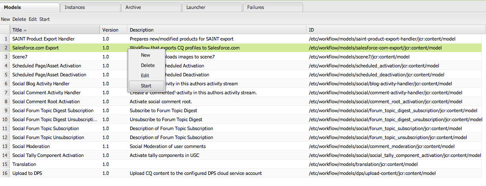

# Integrazione con Salesforce {#integrating-with-salesforce}

L’integrazione di Salesforce con Adobe Experience Manager (AEM) fornisce funzionalità di gestione dei lead e utilizza le funzionalità esistenti fornite da Salesforce con le impostazioni predefinite. Puoi configurare l’AEM in modo da pubblicare i lead in Salesforce e creare componenti che accedano ai dati direttamente da Salesforce.

L’integrazione bidirezionale ed estensibile tra AEM e Salesforce consente di:

* Organizzazioni che utilizzano e modificano completamente i dati per migliorare l’esperienza del cliente.
* Coinvolgimento dalle attività di marketing alle attività di vendita.
* Organizzazioni per trasmettere e ricevere automaticamente i dati da un archivio dati Salesforce.

Questo documento descrive quanto segue:

* come configurare i Cloud Service Salesforce (configurare AEM per l’integrazione con Salesforce).
* come utilizzare le informazioni di contatto/lead Salesforce in ClientContext e per Personalization.
* come utilizzare il modello di flusso di lavoro Salesforce per pubblicare gli utenti AEM come lead per Salesforce.
* come creare un componente che mostra i dati di Salesforce.

## Configurazione dell’AEM per l’integrazione con Salesforce {#configuring-aem-to-integrate-with-salesforce}

Per configurare l’AEM per l’integrazione con Salesforce, devi prima configurare un’applicazione di accesso remoto in Salesforce. Quindi configura il servizio cloud Salesforce in modo che punti a questa applicazione di accesso remoto.

>[!NOTE]
>
>Puoi creare un account sviluppatore gratuito in Salesforce.

Per configurare l’AEM per l’integrazione con Salesforce:

>[!CAUTION]
>
>Installa il pacchetto di integrazione dell&#39;API [&#128279;](https://experience.adobe.com/#/downloads/content/software-distribution/en/aem.html?fulltext=salesforce*&amp;orderby=%40jcr%3Acontent%2Fjcr%3AlastModified&amp;orderby.sort=desc&amp;layout=list&amp;p.offset=0&amp;p.limit=2&amp;package=%2Fcontent%2Fsoftware-distribution%2Fen%2Fdetails.html%2Fcontent%2Fdam%2Faem%2Fpublic%2Fadobe%2Fpackages%2Fcq650%2Ffeaturepack%2Fcom.adobe.cq.mcm.salesforce.content-1.0.4.zip) di Salesforce prima di continuare con la procedura. Per ulteriori dettagli su come utilizzare i pacchetti, vedere la pagina [Come utilizzare i pacchetti](/help/sites-administering/package-manager.md#package-share).

1. In AEM, passa a **Cloud Service**. In Servizi di terze parti, fare clic su **Configura ora** in **Salesforce**.

   

1. Crea una configurazione, ad esempio **sviluppatore**.

   >[!NOTE]
   >
   >La nuova configurazione reindirizza a una nuova pagina: **http://localhost:4502/etc/cloudservices/salesforce/developer.html**. Si tratta esattamente dello stesso valore che è necessario specificare nell&#39;URL di richiamata durante la creazione dell&#39;applicazione di accesso remoto in Salesforce. Questi valori devono corrispondere.

1. Accedi al tuo account Salesforce (oppure, se non ne hai uno, creane uno all&#39;indirizzo [https://developer.salesforce.com](https://developer.salesforce.com).)
1. In Salesforce passa a **Crea** > **App** per accedere a **App collegate** (nelle versioni precedenti di Salesforce il flusso di lavoro era **Distribuisci** > **Accesso remoto**).
1. Fai clic su **Nuovo** per connettere AEM a Salesforce.

   

1. Immetti **Nome app connessa**, **Nome API** e **E-mail contatto**. Selezionare la casella di controllo **Abilita impostazioni OAuth**, immettere l&#39;**URL richiamata** e aggiungere un ambito OAuth (ad esempio, accesso completo). L&#39;URL di callback è simile al seguente: `http://localhost:4502/etc/cloudservices/salesforce/developer.html`

   Modifica il nome del server/numero di porta e il nome della pagina in modo che corrispondano alla configurazione.

   

1. Fai clic su **Salva** per salvare la configurazione Salesforce. Salesforce crea una **chiave consumer** e un **segreto consumer** necessari per la configurazione dell&#39;AEM.

   

   >[!NOTE]
   >
   >Attendi alcuni minuti (fino a 15 minuti) prima di attivare l’applicazione di accesso remoto in Salesforce.

1. In AEM, passa a **Cloud Service** e passa alla configurazione Salesforce creata in precedenza, ad esempio **sviluppatore**. Fai clic su **Modifica** e immetti la chiave cliente e il segreto cliente da salesforce.com.

   

   | Url di accesso | Questo è l’endpoint di autorizzazione Salesforce. Il suo valore è precompilato e serve la maggior parte dei casi. |
   |---|---|
   | Chiave cliente | Immettere il valore ottenuto dalla pagina Registrazione applicazione di accesso remoto in salesforce.com |
   | Segreto cliente | Immettere il valore ottenuto dalla pagina Registrazione applicazione di accesso remoto in salesforce.com |

1. Fare clic su **Connetti a Salesforce** per connettersi. Salesforce richiede di consentire alla configurazione di connettersi a Salesforce.

   

   In AEM, viene visualizzata una finestra di dialogo di conferma che informa che la connessione è stata eseguita correttamente.

1. Passa alla pagina principale del sito Web e fai clic su **Proprietà pagina**. Quindi seleziona **Cloud Service**, aggiungi **Salesforce** e seleziona la configurazione corretta (ad esempio, **sviluppatore**).

   

   Ora puoi utilizzare il modello di flusso di lavoro per pubblicare i lead in Salesforce e creare componenti che accedono ai dati da Salesforce.

## Esportazione di utenti AEM come lead Salesforce {#exporting-aem-users-as-salesforce-leads}

Se desideri esportare un utente AEM come lead Salesforce, configura il flusso di lavoro per pubblicare i lead in Salesforce.

Per esportare gli utenti AEM come lead di Salesforce:

1. Passare al flusso di lavoro Salesforce in `http://localhost:4502/workflow` facendo clic con il pulsante destro del mouse sul flusso di lavoro **Salesforce.com Export** e scegliendo **Start**.

   

1. Seleziona l&#39;utente AEM da creare come lead come **Payload** per questo flusso di lavoro (home > utenti). Accertati di selezionare il nodo del profilo dell&#39;utente in quanto contiene informazioni come **givenName** e **familyName**, mappate ai campi **FirstName** e **LastName** del lead Salesforce.

   

   >[!NOTE]
   >
   >Prima di avviare questo flusso di lavoro, è necessario disporre di alcuni campi obbligatori per un nodo lead in AEM prima di poter pubblicare il prodotto in Salesforce. Si tratta di **givenName**, **familyName**, **company** e **email**. Per visualizzare un elenco completo dei mapping tra l&#39;utente AEM e il lead Salesforce, vedere [Configurazione mapping tra l&#39;utente AEM e il lead Salesforce.](#mapping-configuration-between-aem-user-and-salesforce-lead)

1. Fare clic su **OK**. Le informazioni utente vengono esportate in salesforce.com. Puoi verificarlo all’indirizzo salesforce.com.

   >[!NOTE]
   >
   >I registri degli errori mostrano se un lead è importato. Per ulteriori informazioni, consulta il registro degli errori.

### Configurazione del flusso di lavoro di esportazione Salesforce.com {#configuring-the-salesforce-com-export-workflow}

Se necessario, configura il flusso di lavoro di esportazione Salesforce.com in modo che corrisponda alla configurazione Salesforce.com corretta o che apporti altre modifiche.

Per configurare il flusso di lavoro di esportazione Salesforce.com:

1. Passa a `http://localhost:4502/cf#/etc/workflow/models/salesforce-com-export.html.`

   

1. Apri il passaggio di esportazione Salesforce.com, seleziona la scheda **Argomenti**, seleziona la configurazione corretta e fai clic su **OK**. Inoltre, se desideri che il flusso di lavoro ricrei un lead eliminato in Salesforce, seleziona la casella di controllo.

   

1. Fai clic su **Salva** per salvare le modifiche.

   

### Mappatura della configurazione tra l’utente AEM e il lead Salesforce {#mapping-configuration-between-aem-user-and-salesforce-lead}

Per visualizzare o modificare la configurazione di mappatura corrente tra un utente AEM e un lead Salesforce, aprire Configuration Manager `https://<hostname>:<port>/system/console/configMgr` e cercare **Configurazione mappatura lead Salesforce**.

1. Aprire Configuration Manager facendo clic su **Console Web** o accedendo direttamente a `https://<hostname>:<port>/system/console/configMgr.`
1. Cerca **Configurazione mappatura lead Salesforce**.

   

1. Modifica le mappature in base alle esigenze. La mappatura predefinita segue il pattern **aemUserAttribute=sfLeadAttribute**. Fai clic su **Salva** per salvare le modifiche.

## Configurazione dell’archivio ClientContext Salesforce {#configuring-salesforce-client-context-store}

L’archivio contestuale del client Salesforce mostra informazioni aggiuntive sull’utente attualmente connesso rispetto a quelle già disponibili in AEM. Estrae queste informazioni aggiuntive da Salesforce a seconda della connessione dell’utente con Salesforce.

A questo scopo, configura quanto segue:

1. Collega un utente AEM con un ID Salesforce tramite il componente Salesforce Connect.
1. Aggiungi i dati profilo Salesforce nella pagina di contesto del client per configurare le proprietà da visualizzare.
1. (Facoltativo) Crea un segmento che utilizza i dati dell’archivio Salesforce Client Context.

### Collegamento di un utente AEM a un ID Salesforce {#linking-an-aem-user-with-a-salesforce-id}

Mappa un utente AEM con un ID Salesforce in modo da poterlo caricare nel contesto del client. In uno scenario reale, il collegamento si basa sui dati utente noti con convalida. Per scopi dimostrativi, in questa procedura si utilizza il componente **Salesforce Connect**.

1. Passa a un sito Web in AEM, accedi e trascina il componente **Salesforce Connect** dalla barra laterale.

   >[!NOTE]
   >
   >Se il componente **Salesforce Connect** non è disponibile, passare alla visualizzazione **Progettazione** e selezionarla per renderla disponibile nella visualizzazione **Modifica**.

   

   Quando trascini il componente nella pagina, viene visualizzato **Collegamento a Salesforce=Off**.

   

   >[!NOTE]
   >
   >Questo componente è solo a scopo dimostrativo. Per scenari reali, ci sarebbe un altro processo per collegare/abbinare gli utenti con i lead.

1. Dopo aver trascinato il componente sulla pagina, aprilo per configurarlo. Selezionare la configurazione, il tipo di contatto e il lead o il contatto Salesforce, quindi fare clic su **OK**.

   

   L’AEM collega l’utente al contatto o al lead Salesforce.

   

### Aggiunta di dati Salesforce a ClientContext {#adding-salesforce-data-to-client-context}

Puoi caricare i dati utente da Salesforce in ClientContext da utilizzare per la personalizzazione:

1. Aprire il contesto client che si desidera estendere spostandosi, ad esempio, `http://localhost:4502/etc/clientcontext/default/content.html.`

   

1. Trascina il componente **Dati profilo Salesforce** nel contesto client.

   

1. Apri il componente facendo doppio clic su di esso. Selezionare **Aggiungi elemento** e selezionare una proprietà dall&#39;elenco a discesa. Aggiungi tutte le proprietà desiderate e seleziona **OK**.

   

1. Ora puoi vedere le proprietà specifiche di Salesforce di Salesforce visualizzate nel contesto client.

   

### Creazione di un segmento utilizzando i dati dall’archivio ClientContext Salesforce {#building-a-segment-using-data-from-salesforce-client-context-store}

Puoi creare un segmento che utilizza i dati dell’archivio Salesforce ClientContext. Per effettuare questo collegamento:

1. Passa alla segmentazione in AEM scegliendo **Strumenti** > **Segmentazione** oppure [http://localhost:4502/miscadmin#/etc/segmentation](http://localhost:4502/miscadmin#/etc/segmentation).
1. Crea o aggiorna un segmento per includere i dati di Salesforce. Per ulteriori informazioni, vedere [Segmentazione](/help/sites-administering/campaign-segmentation.md).

## Ricerca di lead {#searching-leads}

L’AEM viene fornito con un componente di ricerca di esempio che cerca i lead in Salesforce in base ai criteri forniti. Questo componente mostra come utilizzare l’API REST di Salesforce per cercare oggetti Salesforce. Per attivare una chiamata a salesforce.com, collega una pagina a una configurazione Salesforce.

>[!NOTE]
>
>Questo è un componente di esempio che mostra come utilizzare l’API REST Salesforce per eseguire query sugli oggetti Salesforce. Utilizzalo come esempio per creare componenti più complessi in base alle tue esigenze.

Per utilizzare questo componente:

1. Passa alla pagina in cui desideri utilizzare questa configurazione. Apri le proprietà della pagina e seleziona **Cloud Service.** Fare clic su **Aggiungi servizi**, selezionare **Salesforce** e la configurazione appropriata, quindi fare clic su **OK**.

   

1. Trascina nella pagina il componente di ricerca Salesforce (se attivato). Per attivarla, passare alla modalità Progettazione e aggiungerla all&#39;area appropriata).

   

1. Aprire il componente Ricerca e specificare i parametri di ricerca, quindi fare clic su **OK.**

   

1. In AEM vengono visualizzati i lead specificati nel componente di ricerca che corrispondono ai criteri specificati.

   
