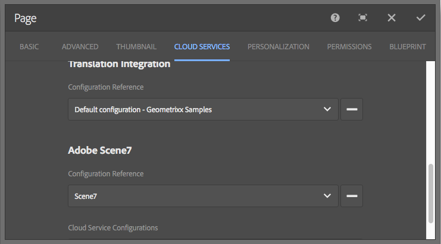

# Integrare Adobe Experience Manager con Dynamic Media Classic {#integrating-with-dynamic-media-classic-scene}

Adobe Dynamic Media Classic è una soluzione in hosting per la gestione, l&#39;ottimizzazione, la pubblicazione e la distribuzione di risorse rich media per web, dispositivi mobili, e-mail, display e stampa connessi a Internet.

Per utilizzare Dynamic Media Classic, devi configurare la configurazione cloud in modo che Dynamic Media Classic e Adobe Experience Manager Assets possano interagire tra loro. Questo documento descrive come configurare Experience Manager e Dynamic Media Classic.

Per informazioni sull&#39;utilizzo di tutti i componenti di Dynamic Media Classic in una pagina e sull&#39;utilizzo di video, vedere [Utilizzare Dynamic Media Classic](../assets/scene7.md).

>[!NOTE]
>
>* La piattaforma di visualizzazione DHTML di Dynamic Media Classic ha ufficialmente raggiunto la fine del ciclo di vita il 31 gennaio 2014. Per ulteriori informazioni, consulta le [Domande frequenti sulla fine del ciclo di vita del visualizzatore DHTML](../sites-administering/dhtml-viewer-endoflifefaqs.md).
>* Prima di configurare Dynamic Media Classic per l&#39;utilizzo con Experience Manager, consulta [Best practice](#best-practices-for-integrating-scene-with-aem) per l&#39;integrazione di Dynamic Media Classic con Experience Manager.
>* Se utilizzi Dynamic Media Classic con una configurazione proxy personalizzata, devi configurare entrambe le configurazioni proxy del client HTTP, in quanto alcune funzionalità di Experience Manager utilizzano le API 3.x e altre le API 4.x. 3.x è configurato con [http://localhost:4502/system/console/configMgr/com.day.commons.httpclient](http://localhost:4502/system/console/configMgr/com.day.commons.httpclient) e 4.x con [http://localhost:4502/system/console/configMgr/org.apache.http.proxyconfigurator](http://localhost:4502/system/console/configMgr/org.apache.http.proxyconfigurator).
>

## Integrazione Experience Manager/Dynamic Media Classic e Dynamic Medie {#aem-scene-integration-versus-dynamic-media}

Gli utenti Experienci Manager possono scegliere tra due soluzioni per lavorare con Dynamic Medie. Puoi utilizzare una delle seguenti opzioni:

* Integra la tua istanza di Experience Manager con Dynamic Media Classic.
* Utilizza Dynamic Medie integrato in Experience Manager.

Utilizza i seguenti criteri per determinare quale soluzione scegliere:

* Sei un cliente Dynamic Media Classic **esistente** le cui risorse risiedono in Dynamic Media Classic per la pubblicazione e la distribuzione, ma desideri integrare tali risorse con l&#39;authoring di Sites (WCM), Experience Manager Assets o entrambi? In tal caso, utilizzare l&#39;[integrazione point-to-point di Experience Manager/Dynamic Media Classic](#aem-scene-point-to-point-integration) descritta in questo documento.

* Se sei un **nuovo** cliente Experience Manager con esigenze di distribuzione di contenuti rich media, seleziona l&#39;[opzione Dynamic Medie](#aem-dynamic-media). Questa opzione è particolarmente utile se non disponi di un account S7 esistente e se nel sistema sono memorizzate molte risorse.

* In alcuni casi, utilizza entrambe le soluzioni. Lo [scenario a doppio uso](/help/sites-administering/scene7.md#dual-use-scenario) descrive tale scenario.

### Integrazione point-to-point Experience Manager/Dynamic Media Classic {#aem-scene-point-to-point-integration}

Quando si utilizzano risorse in questa soluzione, è possibile effettuare una delle seguenti operazioni:

* Carica le risorse direttamente in Dynamic Media Classic, quindi accedi tramite il browser dei contenuti di **Dynamic Media Classic** per l&#39;authoring delle pagine oppure
* Carica in Experience Manager Assets e quindi abilita la pubblicazione automatica in Dynamic Media Classic; puoi accedere tramite il browser di contenuti **Assets** per l&#39;authoring delle pagine

I componenti utilizzati per questa integrazione si trovano nell&#39;area del componente **Dynamic Media Classic** in [modalità progettazione](/help/sites-authoring/author-environment-tools.md#page-modes).

### Experience Manager Dynamic Medie {#aem-dynamic-media}

Experience Manager Dynamic Medie consiste nell’unificare le funzioni di Dynamic Media Classic direttamente all’interno della piattaforma Experience Manager.

Quando si utilizzano risorse in questa soluzione, si segue questo flusso di lavoro:

1. Carica risorse singole immagine e video direttamente in Experience Manager.
1. Codifica i video direttamente in Experience Manager.
1. Crea set basati su immagini direttamente in Experience Manager.
1. Se applicabile, aggiungi interattività a immagini o video.

I componenti utilizzati per Dynamic Medie si trovano nell&#39;area del componente **[!UICONTROL Dynamic Medie]** in [modalità progettazione](/help/sites-authoring/author-environment-tools.md#page-modes). Essi includono quanto segue:

* **[!UICONTROL Dynamic Medie]** - Il componente **[!UICONTROL Dynamic Medie]** è intelligente. A seconda che si aggiunga un&#39;immagine o un video, sono disponibili varie opzioni. Il componente supporta predefiniti per immagini, visualizzatori basati su immagini come set di immagini, set 360 gradi, set di file multimediali diversi e video. Inoltre, il visualizzatore è reattivo: le dimensioni dello schermo cambiano automaticamente in base alle dimensioni sullo schermo. Tutti i visualizzatori sono visualizzatori HTML5.

* **[!UICONTROL File multimediali interattivi]** - Il componente **[!UICONTROL File multimediali interattivi]** è destinato a risorse quali banner a carosello, immagini interattive e video interattivi. Tali risorse sono interattive all’interno di tali punti attivi o mappe immagine. Questo componente è intelligente. In altre parole, a seconda che si aggiunga un’immagine o un video, sono disponibili varie opzioni. Inoltre, il visualizzatore è reattivo: le dimensioni dello schermo cambiano automaticamente in base alle dimensioni sullo schermo. Tutti i visualizzatori sono visualizzatori HTML5.

### Scenario a doppio uso {#dual-use-scenario}

È possibile utilizzare contemporaneamente le funzioni di integrazione di Dynamic Medie e Dynamic Media Classic di Experience Manager. Nella tabella seguente vengono descritti i casi di utilizzo in cui è necessario attivare e disattivare determinate aree.

Per utilizzare contemporaneamente Dynamic Medie e Dynamic Media Classic:

1. Configura [Dynamic Media Classic](#creating-a-cloud-configuration-for-scene) in Cloud Service.
1. Segua le istruzioni specifiche relative al caso d’uso:

   <table>
    <tbody>
    <tr>
    <td> </td>
    <td> </td>
    <td><strong>Dynamic Media</strong></td>
    <td> </td>
    <td><strong>Integrazione Dynamic Media Classic</strong></td>
    <td> </td>
    </tr>
    <tr>
    <td><strong>Se sei...</strong></td>
    <td><strong>Flusso di lavoro del caso d’uso</strong></td>
    <td><strong>Immagini/Video</strong></td>
    <td><strong>Componente elementi multimediali dinamici</strong></td>
    <td><strong>Browser contenuti e componenti S7</strong></td>
    <td><strong>Caricamento automatico da Assets a S7</strong></td>
    </tr>
    <tr>
    <td>Novità di Sites e Dynamic Medie</td>
    <td>Carica le risorse in Experience Manager e utilizza il componente Experience Manager Dynamic Medie per creare risorse sulle pagine Sites</td>
    <td>
Il/La
 
(vedere passaggio 3)
 </td>
    <td><a href="/help/assets/adding-dynamic-media-assets-to-pages.md">Il/La</a></td>
    <td>Disattivato</td>
    <td>Disattivato</td>
    </tr>
    <tr>
    <td>Nel settore retail e per Sites e Dynamic Medie</td>
    <td>Carica risorse non di prodotto in Experience Manager per la gestione e la consegna. Carica le risorse di prodotto in Dynamic Media Classic e utilizza il browser dei contenuti di Dynamic Media Classic in Experience Manager e Componente per creare pagine di dettagli prodotto in Sites.</td>
    <td>
Il/La
 
(vedere passaggio 3)
 </td>
    <td><a href="/help/assets/adding-dynamic-media-assets-to-pages.md">Il/La</a></td>
    <td><a href="/help/assets/scene7.md#scene-content-browser">Il/La</a></td>
    <td>Disattivato</td>
    </tr>
    <tr>
    <td>Novità di Assets e Dynamic Medie</td>
    <td>Carica le risorse in Experience Manager Assets e utilizza l’URL pubblicato/il codice di incorporamento pubblicato da Dynamic Medie</td>
    <td>
Il/La
 
(vedere passaggio 3)
 </td>
    <td>Disattivato</td>
    <td>Disattivato</td>
    <td>Disattivato</td>
    </tr>
    <tr>
    <td>Utilizzo di Dynamic Medie e modelli per la prima volta</td>
    <td>Utilizza Dynamic Medie per immagini e video. Crea modelli immagine in Dynamic Media Classic e utilizza Dynamic Media Classic Content Finder per includere modelli nelle pagine Sites.</td>
    <td>
Il/La
 
(vedere passaggio 3)
 </td>
    <td><a href="/help/assets/adding-dynamic-media-assets-to-pages.md">Il/La</a></td>
    <td><a href="/help/assets/scene7.md#scene-content-browser">Il/La</a></td>
    <td>Disattivato</td>
    </tr>
    <tr>
    <td>Un cliente Dynamic Media Classic esistente e sono nuovi per Sites</td>
    <td>Carica le risorse in Dynamic Media Classic e utilizza il browser dei contenuti Experience Manager Dynamic Media Classic per cercare e creare risorse nelle pagine Sites</td>
    <td>Disattivato</td>
    <td>Disattivato</td>
    <td><a href="/help/assets/scene7.md#scene-content-browser">Il/La</a></td>
    <td>Disattivato</td>
    </tr>
    <tr>
    <td>Un cliente Dynamic Media Classic esistente e sono nuovi per Sites e Assets</td>
    <td>Carica le risorse in DAM e pubblicale automaticamente in Dynamic Media Classic per la consegna. Utilizza il browser di contenuti Experience Manager Dynamic Media Classic per cercare e creare risorse nelle pagine Sites.</td>
    <td>Disattivato</td>
    <td>Disattivato</td>
    <td><a href="/help/assets/scene7.md#scene-content-browser">Il/La</a></td>
    <td>
<a href="#configuringautouploadingfromaemassets">Il/La</a>
 
(Vedere punto 4)
 </td>
    </tr>
    <tr>
    <td>Cliente Dynamic Media Classic esistente e nuovo in Assets</td>
    <td>
Carica le risorse in Experience Manager e utilizza Dynamic Medie per generare rappresentazioni da scaricare/condividere. Pubblica automaticamente le risorse di Experience Manager in Dynamic Media Classic per la consegna.
 
<strong>Importante:</strong> genera elaborazioni duplicate e le rappresentazioni generate in Experience Manager non sono sincronizzate con Dynamic Media Classic
 </td>
    <td>
Il/La
 
(vedere passaggio 3)
 </td>
    <td>Disattivato</td>
    <td>Disattivato</td>
    <td>
<a href="#configuringautouploadingfromaemassets">Il/La</a>
 
(Vedere punto 4)
 </td>
    </tr>
    </tbody>
    </table>

1. (Facoltativo; vedere la tabella dei casi d&#39;uso) - Configurare la [configurazione cloud Dynamic Medie](/help/assets/config-dynamic.md) e [abilitare il server Dynamic Medie](/help/assets/config-dynamic.md).
1. (Facoltativo; consulta la tabella dei casi d’uso) - Se scegli di abilitare il caricamento automatico da Assets a Dynamic Media Classic, devi aggiungere quanto segue:

   1. Imposta il caricamento automatico in Dynamic Media Classic.
   1. Aggiungi il passaggio **Caricamento Dynamic Media Classic** dopo tutti i passaggi del flusso di lavoro Dynamic Medie *alla fine del flusso di lavoro* **Aggiorna risorsa DAM** ( `https://<server>:<host>/cf#/etc/workflow/models/dam/update_asset.html)`
   1. (Facoltativo) Limita il caricamento delle risorse Dynamic Media Classic per tipo MIME in [https://&lt;server>:&lt;port>/system/console/configMgr/com.day.cq.dam.scene7.impl.Scene7AssetMimeTypeServiceImpl](http://localhost:4502/system/console/configMgr/com.day.cq.dam.scene7.impl.Scene7AssetMimeTypeServiceImpl). I tipi MIME di risorse non presenti in questo elenco non vengono caricati sul server Dynamic Media Classic.
   1. (Facoltativo) Configura il video in configurazione Dynamic Media Classic. È possibile abilitare la codifica video per Dynamic Medie e Dynamic Media Classic simultaneamente o per entrambi. Le rappresentazioni dinamiche vengono utilizzate per l’anteprima e la riproduzione localmente nell’istanza Experience Manager, mentre le rappresentazioni video Dynamic Media Classic vengono generate e memorizzate sui server Dynamic Media Classic. Durante la configurazione dei servizi di codifica video per Dynamic Medie e Dynamic Media Classic, applica un [profilo di elaborazione video](/help/assets/video-profiles.md) alla cartella risorse di Dynamic Media Classic.
   1. (Facoltativo) [Configura anteprima protetta in Dynamic Media Classic](/help/sites-administering/scene7.md#configuring-the-state-published-unpublished-of-assets-pushed-to-scene).

#### Limitazioni {#limitations}

Quando sono abilitati sia Dynamic Media Classic che Dynamic Medie, esistono le seguenti limitazioni:

* Il caricamento manuale in Dynamic Media Classic selezionando una risorsa e trascinandola su un componente Dynamic Media Classic in una pagina di Experience Manager non funziona.
* Anche se le risorse sincronizzate Experience Manager-Dynamic Media Classic vengono aggiornate automaticamente in Dynamic Media Classic quando la risorsa viene modificata in Assets, un’azione di rollback non attiva un nuovo caricamento. Di conseguenza, Dynamic Media Classic non ottiene la versione più recente subito dopo un rollback. La soluzione consiste nel modificare nuovamente una volta completato il rollback.
* È necessario utilizzare Dynamic Medie per un caso d’uso e l’integrazione Dynamic Media Classic per un altro in modo che le risorse Dynamic Medie non interagiscano con il sistema Dynamic Media Classic? In tal caso, non applicare la configurazione Dynamic Media Classic alla cartella Dynamic Medie. E non applicare la configurazione di Dynamic Medie (profilo di elaborazione) a una cartella Dynamic Media Classic.

## Best practice per l’integrazione di Dynamic Media Classic con Experience Manager {#best-practices-for-integrating-scene-with-aem}

Durante l’integrazione di Dynamic Media Classic con Experience Manager, è necessario osservare alcune importanti best practice nelle seguenti aree:

* Test per la tua integrazione
* Per alcuni scenari è consigliabile caricare le risorse direttamente da Dynamic Media Classic

Vedi [limitazioni note](#known-limitations-and-design-implications).

### Test dell’integrazione {#test-driving-your-integration}

L’Adobe consiglia di testare l’integrazione con la cartella principale che punta solo a una sottocartella anziché a un’intera azienda.

>[!CAUTION]
>
>L’importazione di risorse da un account aziendale Dynamic Media Classic esistente può richiedere molto tempo per la visualizzazione nell’Experience Manager. Assicurati di designare una cartella in Dynamic Media Classic che non abbia troppe risorse (ad esempio, la cartella principale spesso ha troppe risorse e può causare l’arresto anomalo del sistema).

### Caricare risorse da Experience Manager Assets e da Dynamic Media Classic {#uploading-assets-from-aem-assets-versus-from-scene}

Puoi caricare le risorse utilizzando la funzionalità Assets (Digital Asset Management) o accedendo a Dynamic Media Classic direttamente in Experience Manager tramite il browser del contenuto di Dynamic Media Classic. La scelta dipende dai seguenti fattori:

* I tipi di risorse Dynamic Media Classic non ancora supportati da Experience Manager Assets devono essere aggiunti direttamente da Dynamic Media Classic a un sito web di Experienci Manager tramite il browser del contenuto di Dynamic Media Classic. Ad esempio, i modelli di immagine.
* Per i tipi di risorse supportati sia da Experience Manager Assets che da Dynamic Media Classic, la decisione su come caricarle dipende da quanto segue:

   * Dove si trovano oggi le risorse E
   * Quanto è importante gestirli in un archivio comune

Supponiamo che le risorse siano già in Dynamic Media Classic e che la loro gestione in un archivio comune non sia importante. In questo caso, è inutile esportare le risorse in Experience Manager Assets solo per sincronizzarle nuovamente in Dynamic Media Classic e consegnarle. L’Adobe consiglia di mantenere le risorse in un unico archivio e sincronizzarle con Dynamic Media Classic solo per la consegna.

## Configurare l’integrazione di Dynamic Media Classic {#configuring-scene-integration}

Puoi configurare Experience Manager per caricare le risorse in Dynamic Media Classic. Assets da una cartella di destinazione CQ può essere caricato (automaticamente o manualmente) da Experience Manager a un account aziendale Dynamic Media Classic.

>[!NOTE]
>
>L’Adobe consiglia di utilizzare solo la cartella di destinazione designata per l’importazione delle risorse Dynamic Media Classic. Le risorse digitali che risiedono al di fuori della cartella di destinazione possono essere utilizzate nei componenti di Dynamic Media Classic solo nelle pagine in cui è stata abilitata la configurazione di Dynamic Media Classic. Inoltre, vengono inseriti in una cartella on-demand in Dynamic Media Classic. La cartella on-demand non è sincronizzata con Experience Manager (ma le risorse sono individuabili nel browser del contenuto di Dynamic Media Classic).

**Per configurare Dynamic Media Classic per l&#39;integrazione con Experience Manager:**

1. [Definisci una configurazione cloud](#creating-a-cloud-configuration-for-scene) - Definisce la mappatura tra una cartella Dynamic Media Classic e una cartella Assets. Completa questo passaggio anche se desideri una sola sincronizzazione unidirezionale (da Experience Manager Assets a Dynamic Media Classic).
1. [Abilita il **listener DAM s7dam**](#enabling-the-adobe-cq-scene-dam-listener) di Adobe CQ - Operazione completata nella console [!UICONTROL OSGi].
1. Se desideri che Experience Manager Assets venga caricato automaticamente in Dynamic Media Classic, devi attivare tale opzione e aggiungere Dynamic Media Classic al flusso di lavoro [!UICONTROL Risorsa di aggiornamento DAM]. Puoi anche caricare manualmente le risorse.
1. Aggiunta di componenti Dynamic Media Classic alla barra laterale. Questa funzionalità consente agli utenti di utilizzare i componenti Dynamic Media Classic nelle pagine di Experience Manager.
1. [Mappa la configurazione sulla pagina nell&#39;Experience Manager](#enabling-scene-for-wcm). Questo passaggio è necessario per visualizzare tutti i predefiniti video creati in Dynamic Media Classic. È inoltre necessario se devi eseguire una pubblicazione di una risorsa dall’esterno della cartella di destinazione di CQ a Dynamic Media Classic.

Questa sezione illustra come eseguire tutti questi passaggi ed elenca limitazioni importanti.

### Funzionamento della sincronizzazione tra Dynamic Media Classic e Experience Manager Assets {#how-synchronization-between-scene-and-aem-assets-works}

Durante la configurazione della sincronizzazione di Experience Manager Assets e Dynamic Media Classic, è importante comprendere quanto segue:

#### Carica su Dynamic Media Classic da Experience Manager Assets {#uploading-to-scene-from-aem-assets}

* Nell’Experience Manager è presente una cartella di sincronizzazione designata per i caricamenti Dynamic Media Classic.
* I caricamenti in Dynamic Media Classic possono essere automatizzati se le risorse digitali si trovano nella cartella di sincronizzazione designata.
* La struttura di cartelle e sottocartelle in Experience Manager viene replicata in Dynamic Media Classic.

>[!NOTE]
>
>Experience Manager incorpora tutti i metadati come XMP prima di caricarli in Dynamic Media Classic, in modo che tutte le proprietà sul nodo dei metadati siano disponibili in Dynamic Media Classic come XMP.

#### Limitazioni note e implicazioni relative alla progettazione {#known-limitations-and-design-implications}

Con la sincronizzazione tra Experience Manager Assets e Dynamic Media Classic, al momento esistono le seguenti limitazioni/implicazioni di progettazione:

<table>
 <tbody>
  <tr>
   <td><strong>Limitazione/implicazioni di progettazione</strong></td>
   <td><strong>Descrizione</strong></td>
  </tr>
  <tr>
   <td>Una cartella di sincronizzazione (di destinazione) designata</td>
   <td>In Experience Manager, per i caricamenti Dynamic Media Classic è possibile avere solo una cartella designata per azienda. Puoi creare più configurazioni se devi avere accesso a più account aziendali in Dynamic Media Classic.</td>
  </tr>
  <tr>
   <td>Struttura delle cartelle</td>
   <td>Se elimini una cartella sincronizzata con le risorse, tutte le risorse remote di Dynamic Media Classic vengono eliminate ma la cartella rimane.</td>
  </tr>
  <tr>
   <td>Cartella on-demand</td>
   <td>Assets che risiedono al di fuori della cartella di destinazione e vengono caricati manualmente in Dynamic Media Classic in WCM vengono automaticamente inseriti in una cartella on-demand separata su Dynamic Media Classic. Puoi configurare questa cartella nella configurazione cloud di Experience Manager.</td>
  </tr>
  <tr>
   <td>File multimediali diversi</td>
   <td>I set di file multimediali diversi vengono visualizzati in Experience Manager anche se non sono supportati in Experience Manager.</td>
  </tr>
  <tr>
   <td>PDF</td>
   <td>I PDF generati dagli eCatalog in Dynamic Media Classic vengono importati nella cartella di destinazione CQ.</td>
  </tr>
  <tr>
   <td>Aggiornamento dell’interfaccia</td>
   <td>Durante la sincronizzazione tra Experience Manager e Dynamic Media Classic, assicurati di aggiornare l’interfaccia utente per visualizzare le modifiche. </td>
  </tr>
  <tr>
   <td>Miniature video</td>
   <td>Se si carica un video su Experience Manager Assets per la codifica tramite Dynamic Media Classic, la disponibilità delle miniature e dei video codificati in Experience Manager Assets può richiedere del tempo, a seconda del tempo di elaborazione del video.</td>
  </tr>
  <tr>
   <td>Sottocartelle di destinazione</td>
   <td>
Se utilizzi sottocartelle all’interno della cartella di destinazione, assicurati di utilizzare nomi univoci per ogni risorsa (indipendentemente dalla posizione). Inoltre, accertati di configurare Dynamic Media Classic (nell’area Configurazione) in modo da non sovrascrivere le risorse, indipendentemente dalla posizione.
 
In caso contrario, vengono caricate le risorse con lo stesso nome caricate in una sottocartella di destinazione di Dynamic Media Classic, ma viene eliminata la stessa risorsa con lo stesso nome presente nella cartella di destinazione. 
 </td>
  </tr>
 </tbody>
</table>

### Configurare i server Dynamic Media Classic {#configuring-scene-servers}

Se esegui Experience Manager dietro un proxy o disponi di impostazioni firewall speciali, devi abilitare esplicitamente gli host delle diverse aree. I server sono gestiti nel contenuto in `/etc/cloudservices/scene7/endpoints` e possono essere personalizzati in base alle esigenze. Seleziona un URL e modificalo per modificarlo, se necessario. Nelle versioni precedenti di Experience Manager, questi valori erano hardcoded.

Se si passa a `/etc/cloudservices/scene7/endpoints.html`, vengono visualizzati i server elencati (e possono essere modificati toccando l&#39;URL):

### Creare una configurazione cloud per Dynamic Media Classic {#creating-a-cloud-configuration-for-scene}

Una configurazione cloud definisce la mappatura tra una cartella Dynamic Media Classic e una cartella Experience Manager Assets. Deve essere configurato per sincronizzare Experience Manager Assets con Dynamic Media Classic. Per ulteriori informazioni, vedere Funzionamento della sincronizzazione.

>[!CAUTION]
>
>L’importazione di risorse da un account aziendale Dynamic Media Classic esistente può richiedere molto tempo per la visualizzazione nell’Experience Manager. Assicurati di designare una cartella in Dynamic Media Classic che non abbia troppe risorse. Ad esempio, la cartella principale ha spesso troppe risorse.
>
>Se desideri testare l’integrazione, fai in modo che la cartella principale punti solo a una sottocartella, invece che all’intera azienda.

>[!NOTE]
>
>Puoi avere più configurazioni: una configurazione cloud rappresenta un utente per azienda Dynamic Media Classic. Se desideri accedere ad altre aziende o altri utenti Dynamic Media Classic, devi creare più configurazioni.

**Per creare una configurazione cloud per Dynamic Media Classic:**

1. Seleziona l&#39;icona Experience Manager e passa a **[!UICONTROL Distribuzione]** > **[!UICONTROL Cloud Service]** per accedere a Adobe Dynamic Media Classic.

1. Seleziona **[!UICONTROL Configura ora]**.

   

1. Nel campo **[!UICONTROL Titolo]** e facoltativamente nel campo **[!UICONTROL Nome]**, immetti le informazioni appropriate. Seleziona **[!UICONTROL Crea]**.

   >[!NOTE]
   >
   >Durante la creazione di altre configurazioni, viene visualizzato il campo **[!UICONTROL configurazione principale]**.
   >
   >**non** modificare la configurazione padre. La modifica della configurazione principale può interrompere l’integrazione.

1. Immetti l&#39;indirizzo e-mail, la password e l&#39;area geografica del tuo account Dynamic Media Classic e seleziona **[!UICONTROL Connetti a Dynamic Media Classic]**. Sei connesso al server Dynamic Media Classic e la finestra di dialogo si espande con più opzioni.

1. Immetti il nome **[!UICONTROL della società]** e il **[!UICONTROL percorso principale]**. Queste informazioni corrispondono al nome del server pubblicato insieme al percorso che si desidera specificare. Se non si conosce il nome del server pubblicato, in Dynamic Media Classic passare a **[!UICONTROL Configurazione > Impostazione applicazione]**).

   >[!NOTE]
   >
   >Il percorso principale di Dynamic Media Classic è l’Experience Manager della cartella Dynamic Media Classic a cui si connette. Può essere limitata a una cartella specifica.

   >[!CAUTION]
   >
   >A seconda delle dimensioni della cartella di Dynamic Media Classic, l&#39;importazione di una cartella principale può richiedere molto tempo. Inoltre, i dati Dynamic Media Classic potrebbero superare l’archiviazione Experience Manager. Assicurati di importare la cartella corretta. L&#39;importazione di troppi dati può arrestare il sistema.

   

1. Selezionare **[!UICONTROL OK]**. Experience Manager salva la configurazione.

>[!NOTE]
>
>Se ti stai riconnettendo:
>
>* Quando ci si riconnette a Dynamic Media Classic al momento della pubblicazione, la reimpostazione della password al momento della pubblicazione o della riconnessione non funziona (non si tratta di un problema nell’istanza di authoring).
>* Se si modificano valori quali regione, nome società, è necessario riconnettersi a Dynamic Media Classic. Se le opzioni di configurazione sono state modificate ma non salvate, l’Experience Manager indica erroneamente che la configurazione è valida. Assicurati di riconnetterti.
>

### Abilitare il listener Dam di Adobe CQ Dynamic Media Classic {#enabling-the-adobe-cq-scene-dam-listener}

Abilita il listener Dam di Adobe CQ Dynamic Media Classic, che è disabilitato per impostazione predefinita.

**Per abilitare il listener Dam di Adobe CQ Dynamic Media Classic:**

1. Seleziona l&#39;icona [!UICONTROL Strumenti], quindi passa a **[!UICONTROL Operazioni]** > **[!UICONTROL Console Web]**.
1. Nella console Web passare a **[!UICONTROL Adobe CQ Dynamic Media Classic Dam Listener]** e selezionare la casella di controllo **[!UICONTROL Enabled]**.

   

1. Seleziona **[!UICONTROL Salva]**.

### Aggiungi timeout configurabile al flusso di lavoro Caricamento Dynamic Media Classic {#adding-configurable-timeout-to-scene-upload-workflow}

Per impostazione predefinita, quando un’istanza di Experience Manager è configurata per gestire la codifica video tramite Dynamic Media Classic, si verifica un timeout di 35 minuti in qualsiasi processo di caricamento. Per supportare processi di codifica video con tempi di esecuzione potenzialmente più lunghi, puoi configurare questa impostazione.

1. Passa a **http://localhost:4502/system/console/configMgr/com.day.cq.dam.scene7.impl.Scene7UploadServiceImpl**.

   

1. Modifica il numero come desiderato nel campo **[!UICONTROL Timeout processo attivo]**. Qualsiasi numero non negativo viene accettato con l’unità di misura in secondi. Per impostazione predefinita, questo numero è impostato su 2100.

   >[!NOTE]
   >
   >Best practice: la maggior parte delle risorse viene acquisita entro pochi minuti (ad esempio, le immagini). Ma in alcuni casi, ad esempio con video più grandi, il valore di timeout aumenta a 7200 secondi (due ore) per adattarsi a tempi di elaborazione lunghi. In caso contrario, questo processo di caricamento Dynamic Media Classic è contrassegnato come **[!UICONTROL UploadFailed]** nei metadati JCR (Java™ Content Repository).

1. Seleziona **[!UICONTROL Salva]**.

### Caricamento automatico da Experience Manager Assets {#autouploading-from-aem-assets}

A partire dall’Experience Manager 6.3.2, Experience Manager Assets è configurato in modo che tutte le risorse digitali caricate vengano aggiornate a Dynamic Media Classic, se le risorse si trovano in una cartella di destinazione CQ.

Quando una risorsa viene aggiunta in Experience Manager Assets, viene caricata e pubblicata automaticamente in Dynamic Media Classic.

>[!NOTE]
>
>La dimensione massima del file per il caricamento automatico da Experience Manager Assets a Dynamic Media Classic è di 500 MB.

**Per caricare automaticamente da Experience Manager Assets:**

1. Seleziona l&#39;icona Experience Manager e passa a **[!UICONTROL Distribuzione]** > **[!UICONTROL Cloud Service]**.
1. Sotto l&#39;intestazione Dynamic Medie, in Configurazioni disponibili, selezionare **[!UICONTROL dms7 (Dynamic Medie]**).
1. Selezionare la scheda **[!UICONTROL Avanzate]**, selezionare la casella di controllo **[!UICONTROL Abilita caricamento automatico]**, quindi selezionare **[!UICONTROL OK]**. Configura il flusso di lavoro Risorsa DAM per includere il caricamento in Dynamic Media Classic.

   >[!NOTE]
   >
   >Per informazioni su come inviare risorse a Dynamic Media Classic in stato non pubblicato, vedere [Configurazione dello stato (pubblicato/non pubblicato) delle risorse inviate a Dynamic Media Classic](#configuring-the-state-published-unpublished-of-assets-pushed-to-scene).

   

1. Torna alla pagina iniziale dell&#39;Experience Manager e seleziona **[!UICONTROL Flussi di lavoro]**. Fai doppio clic sul flusso di lavoro **Risorsa di aggiornamento DAM** per aprirlo.
1. Nella barra laterale passare ai componenti del **[!UICONTROL Flusso di lavoro]** e selezionare **[!UICONTROL Dynamic Media Classic]**. Trascina **[!UICONTROL Dynamic Media Classic]** nel flusso di lavoro e seleziona **[!UICONTROL Salva]**. Gli Assets aggiunti a Experience Manager Assets nella cartella di destinazione vengono caricati automaticamente in Dynamic Media Classic.

   

   >[!NOTE]
   >
   >* Quando si aggiungono risorse dopo l’automazione, se non vengono posizionate nella cartella di destinazione CQ, non vengono caricate in Dynamic Media Classic.
   >* Experience Manager incorpora tutti i metadati come XMP prima di caricarli in Dynamic Media Classic, in modo che tutte le proprietà sul nodo dei metadati siano disponibili in Dynamic Media Classic come XMP.

### Configurare lo stato (pubblicato/non pubblicato) delle risorse inviate a Dynamic Media Classic {#configuring-the-state-published-unpublished-of-assets-pushed-to-scene}

Se invii risorse da Experience Manager Assets a Dynamic Media Classic, puoi pubblicarle automaticamente (comportamento predefinito) o inviarle a Dynamic Media Classic in stato non pubblicato.

È possibile che non si desideri pubblicare immediatamente le risorse su Dynamic Media Classic se si desidera testarle in un ambiente di staging prima di andare &quot;live&quot;. Experience Manager può essere utilizzato con l’ambiente Secure Test di Dynamic Media Classic per inviare le risorse direttamente da Assets a Dynamic Media Classic in stato non pubblicato.

Le risorse Dynamic Media Classic rimangono disponibili tramite l’anteprima protetta. Solo quando le risorse vengono pubblicate in Experience Manager, anche le risorse Dynamic Media Classic vengono pubblicate in produzione.

Se desideri pubblicare immediatamente le risorse quando vengono inviate a Dynamic Media Classic, non è necessario configurare alcuna opzione. Questa funzionalità è il comportamento predefinito.

Tuttavia, se non desideri che le risorse inviate a Dynamic Media Classic vengano pubblicate automaticamente, questa sezione descrive come configurare Experience Manager e Dynamic Media Classic per eseguire questa funzionalità.

#### Prerequisiti per l’invio di risorse a Dynamic Media Classic non pubblicati {#prerequisites-to-push-assets-to-scene-unpublished}

Prima di poter inviare risorse a Dynamic Media Classic senza pubblicarle, è necessario impostare quanto segue:

1. [Utilizzare l&#39;Admin Console per creare un caso di supporto](https://helpx.adobe.com/it/enterprise/admin-guide.html/enterprise/using/support-for-experience-cloud.ug.html). Nel tuo caso di supporto, richiedi l’abilitazione dell’anteprima protetta per il tuo account Dynamic Media Classic.
1. [Imposta l&#39;anteprima protetta per il tuo account Dynamic Media Classic](https://experienceleague.adobe.com/docs/dynamic-media-classic/using/upload-publish/testing-assets-making-them-public.html).

Questi passaggi sono gli stessi che segui per creare una configurazione di test protetta in Dynamic Media Classic.

>[!NOTE]
>
>Se l&#39;ambiente di installazione è un sistema operativo UNIX® a 64 bit, vedere [https://helpx.adobe.com/experience-manager/kb/enable-xmp-write-back-64-bit-redhat.html](https://helpx.adobe.com/experience-manager/kb/enable-xmp-write-back-64-bit-redhat.html) per le altre opzioni di configurazione da impostare.

#### Limitazioni note per il push delle risorse in stato non pubblicato  {#known-limitations-for-pushing-assets-in-unpublished-state}

Se utilizzate questa funzione, tenete presente le seguenti limitazioni:

* Il controllo delle versioni non è supportato.
* Se una risorsa è già pubblicata in Experience Manager e viene creata una versione successiva, tale nuova versione viene immediatamente pubblicata in diretta in produzione. Al momento dell’attivazione, Publish funziona solo con la pubblicazione iniziale di una risorsa.

>[!NOTE]
>
>Per pubblicare immediatamente le risorse, è consigliabile mantenere **[!UICONTROL Abilita anteprima protetta]** impostato su **[!UICONTROL Immediatamente]** e utilizzare la funzionalità **[!UICONTROL Abilita caricamento automatico]**.

### Impostare lo stato delle risorse inviate a Dynamic Media Classic come non pubblicate {#setting-the-state-of-assets-pushed-to-scene-as-unpublished}

>[!NOTE]
>
>Se un utente pubblica la risorsa in Experience Manager, la risorsa S7 viene attivata automaticamente nella risorsa di produzione/live (la risorsa non si trova più in anteprima protetta/non pubblicata).

**Per impostare lo stato delle risorse inviate a Dynamic Media Classic come non pubblicate:**

1. Seleziona l&#39;icona Experience Manager e passa a **[!UICONTROL Distribuzione]** > **[!UICONTROL Cloud Service]**.
1. Seleziona **[!UICONTROL Dynamic Media Classic]**.
1. Seleziona la configurazione in Dynamic Media Classic.
1. Selezionare la scheda **[!UICONTROL Avanzate]**.
1. Nel menu a discesa **[!UICONTROL Abilita visualizzazione protetta]**, seleziona **[!UICONTROL All&#39;attivazione di Publish AEM]** per inviare risorse a Dynamic Media Classic senza pubblicazione. Per impostazione predefinita, questo valore è impostato su **[!UICONTROL Immediatamente]**, in cui le risorse Dynamic Media Classic vengono pubblicate immediatamente.

   Consulta la [documentazione di Dynamic Media Classic](https://experienceleague.adobe.com/docs/dynamic-media-classic/using/upload-publish/testing-assets-making-them-public.html) per ulteriori informazioni sui test delle risorse prima di renderle pubbliche.

   

1. Selezionare **[!UICONTROL OK]**.

Se si abilita Anteprima protetta, le risorse vengono inviate al server di anteprima protetto senza essere pubblicate.

Per verificare se **[!UICONTROL Anteprima protetta]** è abilitata, passare a un componente Dynamic Media Classic in una pagina di Experience Manager. Seleziona **[!UICONTROL Modifica]**. La risorsa presenta il server di anteprima protetto elencato nell’URL. Dopo la pubblicazione in Experience Manager, il dominio server nel riferimento file viene aggiornato dall’URL di anteprima all’URL di produzione.

### Abilita Dynamic Media Classic per WCM {#enabling-scene-for-wcm}

L&#39;abilitazione di Dynamic Media Classic per WCM è necessaria per due motivi:

* Abilita l’elenco a discesa dei profili video universali per l’authoring delle pagine. Senza questo elenco, il menu a discesa **[!UICONTROL Predefinito video universale]** è vuoto e non può essere impostato.
* Se una risorsa digitale non si trova nella cartella di destinazione, puoi caricarla in Dynamic Media Classic se abiliti Dynamic Media Classic per tale pagina nelle proprietà della pagina. Quindi trascina e rilascia la risorsa su un componente Dynamic Media Classic. Si applicano le normali regole di ereditarietà (le pagine figlie ereditano la configurazione dalla pagina padre).

Quando si abilita Dynamic Media Classic per WCM, come per altre configurazioni, si applicano le regole di ereditarietà. È possibile abilitare Dynamic Media Classic per WCM nell’interfaccia utente classica o ottimizzata per il tocco.

#### Abilitare Dynamic Media Classic per WCM nell’interfaccia utente ottimizzata per il tocco {#enabling-scene-for-wcm-in-the-touch-optimized-user-interface}

1. Seleziona l&#39;icona Experience Manager e passa a **[!UICONTROL Sites]**, quindi alla pagina root del sito Web (non specifica della lingua).

1. Nella barra degli strumenti, seleziona l&#39;icona [!UICONTROL impostazioni] e seleziona **[!UICONTROL Apri proprietà]**.

1. Seleziona **[!UICONTROL Cloud Service]**, **[!UICONTROL Aggiungi configurazione]** e **[!UICONTROL Dynamic Media Classic]**.
1. Nell&#39;elenco a discesa **[!UICONTROL Adobe Dynamic Media Classic]**, selezionare la configurazione desiderata e selezionare **[!UICONTROL OK]**.

   

   I predefiniti video di tale configurazione di Dynamic Media Classic sono disponibili per l’utilizzo in Experience Manager con il componente video Dynamic Media Classic su tale pagina e sulle pagine figlie.

#### Abilitare Dynamic Media Classic per WCM nell’interfaccia utente classica {#enabling-scene-for-wcm-in-the-classic-user-interface}

1. Ad Experience Manager, selezionare **[!UICONTROL Siti Web]** e passare alla pagina principale del sito Web (non specifica della lingua).

1. Nella barra laterale, seleziona l&#39;icona **[!UICONTROL Pagina]** e seleziona **[!UICONTROL Proprietà pagina]**.

1. Seleziona **[!UICONTROL Cloud Service]** > **[!UICONTROL Aggiungi servizi]** > **[!UICONTROL Dynamic Media Classic]**.
1. Nell&#39;elenco a discesa **[!UICONTROL Adobe Dynamic Media Classic]**, selezionare la configurazione desiderata e selezionare **[!UICONTROL OK]**.

   I predefiniti video di tale configurazione di Dynamic Media Classic sono disponibili per l’utilizzo in Experience Manager con il componente video Dynamic Media Classic su tale pagina e sulle pagine figlie.

### Configurare una configurazione predefinita {#configuring-a-default-configuration}

Se disponi di più configurazioni di Dynamic Media Classic, puoi specificarne una come predefinita per il browser del contenuto di Dynamic Media Classic.

È possibile contrassegnare una sola configurazione Dynamic Media Classic come predefinita in un determinato momento. La configurazione predefinita è quella delle risorse aziendali visualizzate per impostazione predefinita nel Browser contenuti di Dynamic Media Classic.

**Per configurare una configurazione predefinita:**

1. Seleziona l&#39;icona Experience Manager e passa a **[!UICONTROL Distribuzione]** > **[!UICONTROL Cloud Service]**.
1. Seleziona **[!UICONTROL Dynamic Media Classic]**.
1. Seleziona la configurazione in Dynamic Media Classic.
1. Per aprire la configurazione, selezionare **[!UICONTROL Modifica]**.

1. Nella scheda **[!UICONTROL Generale]**, selezionare la casella di controllo **[!UICONTROL Configurazione predefinita]** per impostarla come società e percorso principale predefiniti visualizzati nel browser del contenuto di Dynamic Media Classic.

   

   >[!NOTE]
   >
   >Se è presente una sola configurazione, la selezione della casella di controllo **[!UICONTROL Configurazione predefinita]** non ha alcun effetto.

### Configurare la cartella ad hoc {#configuring-the-ad-hoc-folder}

Puoi configurare la cartella su richiesta in cui vengono caricate le risorse in Dynamic Media Classic quando la risorsa non si trova nella cartella di destinazione CQ. Consulta Pubblicazione di risorse dall’esterno della cartella di destinazione CQ.

**Per configurare la cartella ad hoc:**

1. Seleziona l&#39;icona Experience Manager e passa a **[!UICONTROL Distribuzione]** > **[!UICONTROL Cloud Service]**.
1. Seleziona **[!UICONTROL Dynamic Media Classic]**.
1. Seleziona la configurazione in Dynamic Media Classic.
1. Per aprire la configurazione, selezionare **[!UICONTROL Modifica]**.

1. Selezionare la scheda **[!UICONTROL Avanzate]**. Nel campo **[!UICONTROL Cartella ad hoc]** puoi modificare la cartella **Ad-hoc**. Per impostazione predefinita, è **name_of_the_company/CQ5_adhoc**.

   

### Configurare predefiniti video universali {#configuring-universal-presets}

Per configurare i predefiniti video universali per il componente video, vedi [Video](/help/assets/s7-video.md).

## Abilita il supporto dei parametri del processo di caricamento Assets/Dynamic Media Classic basato sul tipo MIME {#enabling-mime-type-based-assets-scene-upload-job-parameter-support}

Puoi abilitare parametri configurabili per processi di caricamento Dynamic Media Classic attivati dalla sincronizzazione di risorse Digital Asset Manager/Dynamic Media Classic.

In particolare, è possibile configurare il formato di file accettato per tipo MIME nell’area OSGi (Open Service Gateway initiative) del pannello di configurazione della console web di Experience Manager. Puoi quindi personalizzare i singoli parametri del processo di caricamento utilizzati per ciascun tipo MIME nell’archivio dei contenuti JCR (Java™).

**Per abilitare le risorse basate sul tipo MIME:**

1. Seleziona l&#39;icona Experience Manager e passa a **[!UICONTROL Strumenti]** > **[!UICONTROL Operazioni]** > **[!UICONTROL Console Web]**.
1. Nel pannello Configurazione console Web Adobe Experience Manager, dal menu **[!UICONTROL OSGi]**, selezionare **[!UICONTROL Configurazione]**.
1. Nella colonna Nome individuare e selezionare **[!UICONTROL Adobe CQ Dynamic Media Classic Asset MIME type Service]** per modificare la configurazione.
1. Nell’area Mapping tipo MIME, seleziona un segno più (+) per aggiungere un tipo MIME.

   Vedi [Tipi MIME supportati](/help/assets/assets-formats.md#supported-mime-types).

1. Nel campo di testo, digita il nuovo nome del tipo MIME.

   Digitare ad esempio `<file_extension>=<mime_type>` come in `EPS=application/postscript` O `PSD=image/vnd.adobe.photoshop`.

1. Nell&#39;angolo inferiore destro della finestra di configurazione, seleziona **[!UICONTROL Salva]**.
1. Torna all&#39;Experience Manager e seleziona **[!UICONTROL CRXDE Liti]** nella barra a sinistra.
1. Nella barra a sinistra della pagina di CRXDE Lite passare a `/etc/cloudservices/scene7/<environment>` (sostituisci `<environment>` con il nome effettivo).
1. Espandere `<environment>` (sostituendo `<environment>` per il nome effettivo) per visualizzare il nodo `mimeTypes`.
1. Seleziona il mimeType appena aggiunto.

   Ad esempio, `mimeTypes > application_postscript` O `mimeTypes > image_vnd.adobe.photoshop`.

1. Sul lato destro della pagina CRXDE Lite, seleziona la scheda **[!UICONTROL Proprietà]**.
1. Specifica un parametro del processo di caricamento Dynamic Media Classic nel campo valore **[!UICONTROL jobParam]**.

   Ad esempio, `psprocess="rasterize"&psresolution=120` .

   Consulta l&#39;[API del sistema di produzione delle immagini di Adobe Dynamic Media Classic](https://experienceleague.adobe.com/docs/dynamic-media-developer-resources/image-production-api/c-overview.html) per ulteriori parametri del processo di caricamento utilizzabili.

   >[!NOTE]
   >
   >Se si caricano file PSD e si desidera elaborarli come modelli con estrazioni di livello, immettere quanto segue nel campo valore **[!UICONTROL jobParam]**:
   >
   >`process=MaintainLayers&layerNaming=AppendName&createTemplate=true`
   >
   >Assicurati che il file PSD disponga di &quot;livelli&quot;. Se si tratta solo di un’immagine o di un’immagine con maschera, questa viene elaborata come un’immagine perché non vi sono livelli da elaborare.

1. Nell&#39;angolo superiore sinistro della pagina CRXDE Lite, selezionare **[!UICONTROL Salva tutto]**.

## Risoluzione dei problemi relativi all’integrazione di Dynamic Media Classic e Experience Manager {#troubleshooting-scene-and-aem-integration}

In caso di problemi durante l’integrazione di Experience Manager con Dynamic Media Classic, consulta i seguenti scenari per le soluzioni.

**Se la pubblicazione delle risorse digitali in Dynamic Media Classic non riesce:**

* Verifica che la risorsa che stai caricando si trovi nella cartella **[!UICONTROL CQ target]** (specifica questa cartella nella configurazione cloud di Dynamic Media Classic).
* In caso contrario, è necessario configurare la configurazione cloud in **[!UICONTROL Proprietà pagina]** per tale pagina per consentire il caricamento nella cartella **[!UICONTROL CQ ad hoc]**.

* Controlla i registri per eventuali informazioni.

**Se i tuoi predefiniti video non vengono visualizzati:**

* Verificare di aver configurato la configurazione cloud della pagina tramite **[!UICONTROL Proprietà pagina]**. I predefiniti video sono disponibili nel componente video Dynamic Media Classic.

**Se le risorse video non vengono riprodotte, Experience Manager:**

* Assicurati di aver utilizzato il componente video corretto. Il componente video Dynamic Media Classic è diverso dal componente video di base. Vedere [Componente video Foundation rispetto al componente video Dynamic Media Classic](/help/assets/s7-video.md).

**Se le risorse nuove o modificate in Experience Manager non vengono caricate automaticamente in Dynamic Media Classic:**

* Assicurati che le risorse siano nella cartella di destinazione CQ. Solo le risorse presenti nella cartella di destinazione CQ vengono aggiornate automaticamente (a condizione che Experience Manager Assets sia stato configurato per il caricamento automatico delle risorse).
* Assicurati di aver configurato la configurazione dei Cloud Service su Abilita caricamento automatico e di aver aggiornato e salvato il flusso di lavoro Risorsa DAM in modo da includere il caricamento di Dynamic Media Classic.
* Quando carichi un’immagine in una sottocartella della cartella di destinazione di Dynamic Media Classic, accertati di effettuare una delle seguenti operazioni:

   * Assicurati che i nomi di tutte le risorse, a prescindere dalla posizione, siano univoci. In caso contrario, la risorsa nella cartella di destinazione principale viene eliminata e rimane solo la risorsa nella sottocartella.
   * Modifica il modo in cui Dynamic Media Classic sovrascrive le risorse nell’area Configura dell’account Dynamic Media Classic. Non impostare Dynamic Media Classic per la sovrascrittura delle risorse, a prescindere dalla posizione, se si utilizzano risorse con lo stesso nome in sottocartelle.

**Se le risorse o le cartelle eliminate non sono sincronizzate tra Dynamic Media Classic e l&#39;Experience Manager:**

* Assets e le cartelle eliminate in Experience Manager Assets vengono comunque visualizzate nella cartella sincronizzata in Dynamic Media Classic. Eliminali manualmente.

**Se il caricamento del video non riesce:**

* Se il caricamento del video non riesce e stai utilizzando Experience Manager per codificare il video tramite l&#39;integrazione Dynamic Media Classic, consulta [Aggiungere un timeout configurabile al flusso di lavoro di caricamento di Dynamic Media Classic](#adding-configurable-timeout-to-scene-upload-workflow).

>[!CAUTION]
>
>L’importazione di risorse da un account aziendale Dynamic Media Classic esistente può richiedere molto tempo per la visualizzazione nell’Experience Manager. Assicurati di designare una cartella in Dynamic Media Classic che non abbia troppe risorse. Ad esempio, la cartella principale ha spesso troppe risorse.
>
>Se desideri testare l’integrazione, fai in modo che la cartella principale punti solo a una sottocartella, invece che all’intera azienda.
