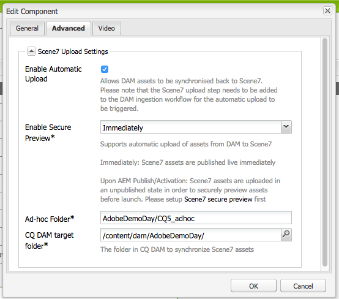

# Integrare Adobe Experience Manager con Dynamic Media Classic {#integrating-with-dynamic-media-classic-scene}

Adobe Dynamic Media Classic è una soluzione in hosting per la gestione, l’ottimizzazione, la pubblicazione e la distribuzione di risorse multimediali sul web, su dispositivi mobili, e-mail, schermi collegati a Internet e la stampa.

Per utilizzare Dynamic Media Classic, devi configurare la configurazione cloud in modo che Dynamic Media Classic e Adobe Experience Manager Assets possano interagire tra loro. Questo documento descrive come configurare Experience Manager e Dynamic Media Classic.

Per informazioni sull’utilizzo di tutti i componenti Dynamic Media Classic in una pagina e sull’utilizzo dei video, consulta [Utilizza Dynamic Media Classic](../assets/scene7.md).

>[!NOTE]
>
>* La piattaforma di visualizzatori DHTML di Dynamic Media Classic ha ufficialmente raggiunto la fine del ciclo di vita il 31 gennaio 2014. Per ulteriori informazioni, consulta la sezione [Domande frequenti sulla fine del ciclo di vita del visualizzatore DHTML](../sites-administering/dhtml-viewer-endoflifefaqs.md).
>* Prima di configurare Dynamic Media Classic per l’utilizzo di Experience Manager, consulta [Best practice](#best-practices-for-integrating-scene-with-aem) per l’integrazione di Dynamic Media Classic con Experience Manager.
>* Se utilizzi Dynamic Media Classic con una configurazione proxy personalizzata, devi configurare entrambe le configurazioni proxy del client HTTP, perché alcune funzionalità di Experience Manager utilizzano le API 3.x e altre le API 4.x. 3.x è configurato con [http://localhost:4502/system/console/configMgr/com.day.commons.httpclient](http://localhost:4502/system/console/configMgr/com.day.commons.httpclient) e 4.x è configurato con [http://localhost:4502/system/console/configMgr/org.apache.http.proxyconfigurator](http://localhost:4502/system/console/configMgr/org.apache.http.proxyconfigurator).
>

## Integrazione Experience Manager/Dynamic Media Classic con Dynamic Media {#aem-scene-integration-versus-dynamic-media}

Gli utenti di Experience Manager possono scegliere tra due soluzioni da utilizzare con Dynamic Media. Puoi utilizzare uno dei seguenti elementi:

* Integra la tua istanza di Experience Manager con Dynamic Media Classic.
* Utilizza Dynamic Media integrato in Experience Manager.

Utilizza i seguenti criteri per determinare quale soluzione scegliere:

* Sei un **esistente** Cliente Dynamic Media Classic le cui risorse risiedono in Dynamic Media Classic per la pubblicazione e la distribuzione, ma desideri integrarle con Sites (WCM) authoring, o Experience Manager Assets, o entrambi? In tal caso, utilizza il [Integrazione punto-punto Experience Manager/Dynamic Media Classic](#aem-scene-point-to-point-integration) descritto nel presente documento.

* Se sei un **nuovo** Ad Experience Manager, il cliente che ha esigenze di distribuzione di contenuti rich media, seleziona la [Opzione Dynamic Media](#aem-dynamic-media). Questa opzione ha senso se non disponi di un account S7 esistente e molte risorse memorizzate in tale sistema.

* In alcuni casi, utilizza entrambe le soluzioni. La [scenario a doppio uso](/help/sites-administering/scene7.md#dual-use-scenario) descrive quello scenario.

### Integrazione punto-punto Experience Manager/Dynamic Media Classic {#aem-scene-point-to-point-integration}

Quando lavori con le risorse in questa soluzione, effettua una delle seguenti operazioni:

* Carica le risorse direttamente in Dynamic Media Classic e quindi accedi tramite **Dynamic Media Classic** browser dei contenuti per la creazione delle pagine o
* Carica in Experience Manager Assets e quindi abilita la pubblicazione automatica in Dynamic Media Classic; accesso tramite **Risorse** browser dei contenuti per la creazione delle pagine

I componenti utilizzati per questa integrazione si trovano nella **Dynamic Media Classic** area componente in [Modalità Progettazione](/help/sites-authoring/author-environment-tools.md#page-modes).

### Experience Manager Dynamic Media {#aem-dynamic-media}

Experience Manager Dynamic Media è l’unificazione delle funzionalità di Dynamic Media Classic direttamente all’interno della piattaforma Experience Manager.

Quando lavori con le risorse in questa soluzione, segui questo flusso di lavoro:

1. Caricare risorse singole di immagini e video direttamente in Experience Manager.
1. Codifica i video direttamente in Experience Manager.
1. Crea set basati su immagini direttamente in Experience Manager.
1. Se applicabile, aggiungi l’interattività alle immagini o ai video.

I componenti utilizzati per Dynamic Media si trovano nella sezione **[!UICONTROL Dynamic Media]** area componente in [Modalità Progettazione](/help/sites-authoring/author-environment-tools.md#page-modes). Includono quanto segue:

* **[!UICONTROL Dynamic Media]** - **[!UICONTROL Dynamic Media]** componente è intelligente : a seconda che aggiunga un’immagine o un video, avrai a disposizione diverse opzioni. Il componente supporta i predefiniti per immagini e i visualizzatori basati su immagini, come set di immagini, set di rotazione, set di file multimediali diversi e video. Inoltre, il visualizzatore è reattivo: le dimensioni dello schermo cambiano automaticamente in base alle dimensioni dello schermo. Tutti i visualizzatori sono visualizzatori HTML5.

* **[!UICONTROL File multimediali interattivi]** - **[!UICONTROL File multimediali interattivi]** Il componente è destinato a risorse quali banner a carosello, immagini interattive e video interattivo. Tali risorse hanno in loro interattività come punti attivi o mappe immagine. Questo componente è intelligente. A seconda che si aggiunga un&#39;immagine o un video, sono disponibili varie opzioni. Inoltre, il visualizzatore è reattivo: le dimensioni dello schermo cambiano automaticamente in base alle dimensioni dello schermo. Tutti i visualizzatori sono visualizzatori HTML5.

### Scenario a doppio uso {#dual-use-scenario}

È possibile utilizzare contemporaneamente le funzioni di integrazione di Dynamic Media e Dynamic Media Classic di Experience Manager. Nella tabella dei casi d’uso riportata di seguito viene descritto quando si attivano e disattivano determinate aree.

Per utilizzare contemporaneamente Dynamic Media e Dynamic Media Classic:

1. Configura [Dynamic Media Classic](#creating-a-cloud-configuration-for-scene) nei Cloud Services.
1. Segui le istruzioni specifiche relative al tuo caso d’uso:

   <table>
    <tbody>
    <tr>
    <td> </td>
    <td> </td>
    <td><strong>Dynamic Media</strong></td>
    <td> </td>
    <td><strong>Integrazione Dynamic Media Classic</strong></td>
    <td> </td>
    </tr>
    <tr>
    <td><strong>Se ...</strong></td>
    <td><strong>Flusso di lavoro del caso d’uso</strong></td>
    <td><strong>Imaging/Video</strong></td>
    <td><strong>Componente elementi multimediali dinamici</strong></td>
    <td><strong>Browser e componenti dei contenuti S7</strong></td>
    <td><strong>Caricamento automatico da Assets a S7</strong></td>
    </tr>
    <tr>
    <td>Novità di Sites e Dynamic Media</td>
    <td>Carica le risorse in Experience Manager e utilizza il componente Experience Manager Dynamic Media per creare le risorse sulle pagine Sites</td>
    <td>
Attivato
 
(Vedere il passaggio 3)
 </td>
    <td><a href="/help/assets/adding-dynamic-media-assets-to-pages.md">Attivato</a></td>
    <td>Disattivato</td>
    <td>Disattivato</td>
    </tr>
    <tr>
    <td>Nel settore retail, e nuovi su Sites e Dynamic Media</td>
    <td>Carica le risorse NON collegate ai prodotti in Experience Manager per la gestione e la distribuzione. Carica le risorse PRODUCT in Dynamic Media Classic e utilizza il browser dei contenuti Dynamic Media Classic in Experience Manager e componente per creare pagine di dettagli prodotto su Sites.</td>
    <td>
Attivato
 
(Vedere il passaggio 3)
 </td>
    <td><a href="/help/assets/adding-dynamic-media-assets-to-pages.md">Attivato</a></td>
    <td><a href="/help/assets/scene7.md#scene-content-browser">Attivato</a></td>
    <td>Disattivato</td>
    </tr>
    <tr>
    <td>Novità di Assets e Dynamic Media</td>
    <td>Carica le risorse in Experience Manager Assets e utilizza l’URL/codice di incorporamento pubblicato da Dynamic Media</td>
    <td>
Attivato
 
(Vedere il passaggio 3)
 </td>
    <td>Disattivato</td>
    <td>Disattivato</td>
    <td>Disattivato</td>
    </tr>
    <tr>
    <td>Novità di Dynamic Media e modelli</td>
    <td>Utilizza Dynamic Media per immagini e video. Creare modelli di immagini in Dynamic Media Classic e utilizzare Content Finder di Dynamic Media Classic per includere modelli nelle pagine Sites.</td>
    <td>
Attivato
 
(Vedere il passaggio 3)
 </td>
    <td><a href="/help/assets/adding-dynamic-media-assets-to-pages.md">Attivato</a></td>
    <td><a href="/help/assets/scene7.md#scene-content-browser">Attivato</a></td>
    <td>Disattivato</td>
    </tr>
    <tr>
    <td>Un cliente Dynamic Media Classic esistente e sono nuovi di Sites</td>
    <td>Carica le risorse in Dynamic Media Classic e utilizza il browser dei contenuti di Experience Manager Dynamic Media Classic per cercare e creare le risorse nelle pagine Sites</td>
    <td>Disattivato</td>
    <td>Disattivato</td>
    <td><a href="/help/assets/scene7.md#scene-content-browser">Attivato</a></td>
    <td>Disattivato</td>
    </tr>
    <tr>
    <td>Un cliente Dynamic Media Classic esistente e sono nuovi di Sites e Assets</td>
    <td>Carica le risorse in DAM e pubblica automaticamente in Dynamic Media Classic per la distribuzione. Utilizza il browser dei contenuti di Experience Manager Dynamic Media Classic per cercare e creare risorse nelle pagine di Sites.</td>
    <td>Disattivato</td>
    <td>Disattivato</td>
    <td><a href="/help/assets/scene7.md#scene-content-browser">Attivato</a></td>
    <td>
<a href="#configuringautouploadingfromaemassets">Attivato</a>
 
(Vedere il passaggio 4)
 </td>
    </tr>
    <tr>
    <td>Cliente Dynamic Media Classic esistente e nuovo di Assets</td>
    <td>
Carica le risorse in Experience Manager e utilizza Dynamic Media per generare rappresentazioni da scaricare/condividere. Pubblicare automaticamente le risorse di Experience Manager in Dynamic Media Classic per la distribuzione.
 
<strong>Importante:</strong> Controlla che l'elaborazione e le rappresentazioni duplicate generate in Experience Manager non siano sincronizzate con Dynamic Media Classic
 </td>
    <td>
Attivato
 
(Vedere il passaggio 3)
 </td>
    <td>Disattivato</td>
    <td>Disattivato</td>
    <td>
<a href="#configuringautouploadingfromaemassets">Attivato</a>
 
(Vedere il passaggio 4)
 </td>
    </tr>
    </tbody>
    </table>

1. (Facoltativo; consultare la tabella dei casi d&#39;uso) - Impostare [Configurazione cloud Dynamic Media](/help/assets/config-dynamic.md) e [abilitare il server Dynamic Media](/help/assets/config-dynamic.md).
1. (Facoltativo; consulta la tabella dei casi d’uso): se scegli di abilitare il caricamento automatico da Assets a Dynamic Media Classic, devi aggiungere quanto segue:

   1. Imposta il caricamento automatico su Dynamic Media Classic.
   1. Aggiungi il **Caricamento Dynamic Media Classic** segui tutti i passaggi del flusso di lavoro Dynamic Media *alla fine di* **Risorsa di aggiornamento DAM** workflow ( `https://<server>:<host>/cf#/etc/workflow/models/dam/update_asset.html)`
   1. (Facoltativo) Limita il caricamento delle risorse Dynamic Media Classic per tipo MIME in [https://&lt;server>:&lt;port>/system/console/configMgr/com.day.cq.dam.scene7.impl.Scene7AssetMimeTypeServiceImpl](http://localhost:4502/system/console/configMgr/com.day.cq.dam.scene7.impl.Scene7AssetMimeTypeServiceImpl). I tipi MIME delle risorse non inclusi in questo elenco non vengono caricati sul server Dynamic Media Classic.
   1. (Facoltativo) Configura il video nella configurazione Dynamic Media Classic. È possibile abilitare la codifica video sia per Dynamic Media che per Dynamic Media Classic simultaneamente. Le rappresentazioni dinamiche vengono utilizzate per l’anteprima e la riproduzione localmente nell’istanza di Experience Manager, mentre le rappresentazioni video Dynamic Media Classic vengono generate e memorizzate sui server Dynamic Media Classic. Quando configuri servizi di codifica video sia per Dynamic Media che per Dynamic Media Classic, applica un [profilo di elaborazione video](/help/assets/video-profiles.md) nella cartella delle risorse di Dynamic Media Classic.
   1. (Facoltativo) [Configurare l’anteprima protetta in Dynamic Media Classic](/help/sites-administering/scene7.md#configuring-the-state-published-unpublished-of-assets-pushed-to-scene).

#### Limitazioni {#limitations}

Quando Dynamic Media Classic e Dynamic Media sono abilitati, sono presenti le seguenti limitazioni:

* Il caricamento manuale in Dynamic Media Classic selezionando una risorsa e trascinandola su un componente Dynamic Media Classic in una pagina di Experience Manager non funziona.
* Anche se le risorse sincronizzate Experience Manager-Dynamic Media Classic vengono aggiornate automaticamente in Dynamic Media Classic quando la risorsa viene modificata in Assets, un’azione di rollback non attiva un nuovo caricamento. Di conseguenza, Dynamic Media Classic non ottiene la versione più recente immediatamente dopo un rollback. La soluzione consiste nel modificare nuovamente una volta completato il rollback.
* È necessario utilizzare Dynamic Media per un caso d’uso e l’integrazione Dynamic Media Classic per un altro in modo che le risorse Dynamic Media non interagiscano con il sistema Dynamic Media Classic? In tal caso, non applicare la configurazione Dynamic Media Classic alla cartella Dynamic Media. Inoltre, non applicare la configurazione di Dynamic Media (profilo di elaborazione) a una cartella Dynamic Media Classic.

## Best practice per l’integrazione di Dynamic Media Classic con Experience Manager {#best-practices-for-integrating-scene-with-aem}

Quando si integra Dynamic Media Classic con Experience Manager, è necessario osservare alcune best practice importanti nelle seguenti aree:

* Testare l&#39;integrazione
* Caricamento delle risorse direttamente da Dynamic Media Classic consigliato per alcuni scenari

Vedi [limitazioni note](#known-limitations-and-design-implications).

### Testa l&#39;integrazione {#test-driving-your-integration}

Adobe consiglia di eseguire un test dell’integrazione facendo sì che la cartella principale punti a una sottocartella solo anziché a un’intera azienda.

>[!CAUTION]
>
>L’importazione di risorse da un account aziendale Dynamic Media Classic esistente può richiedere molto tempo per essere visualizzata in Experience Manager. Assicurati di designare una cartella in Dynamic Media Classic che non abbia troppe risorse (ad esempio, la cartella principale ha spesso troppe risorse e può causare l’arresto anomalo del sistema).

### Caricare risorse da Experience Manager Assets rispetto a Dynamic Media Classic {#uploading-assets-from-aem-assets-versus-from-scene}

Puoi caricare le risorse utilizzando la funzionalità Risorse (gestione delle risorse digitali) o accedendo direttamente ad Dynamic Media Classic in Experience Manager tramite il browser dei contenuti di Dynamic Media Classic. Quale scelta dipende dai seguenti fattori:

* I tipi di risorse Dynamic Media Classic che Experience Manager Assets non supporta ancora devono essere aggiunti a un sito web di Experience Manager direttamente da Dynamic Media Classic, tramite il browser dei contenuti Dynamic Media Classic. Ad esempio, modelli di immagine.
* Per i tipi di risorse supportati sia da Experience Manager Assets che da Dynamic Media Classic, la decisione su come caricarli dipende dai seguenti elementi:

   * Dove sono presenti le attività E
   * Quanto è importante gestirli in un archivio comune

Supponiamo che le risorse siano già in Dynamic Media Classic e che la loro gestione in un archivio comune non sia importante. In questo caso, esportare le risorse in Experience Manager Assets solo per sincronizzarle di nuovo in Dynamic Media Classic per la consegna è un ciclo continuo inutile. Adobe consiglia di mantenere le risorse in un unico archivio e di sincronizzarle con Dynamic Media Classic solo per la distribuzione.

## Configurare l’integrazione Dynamic Media Classic {#configuring-scene-integration}

Puoi configurare Experience Manager per caricare le risorse in Dynamic Media Classic. Le risorse da una cartella di destinazione CQ possono essere caricate (automaticamente o manualmente) da un Experience Manager a un account aziendale Dynamic Media Classic.

>[!NOTE]
>
>Adobe consiglia di utilizzare solo la cartella di destinazione designata per l’importazione di risorse Dynamic Media Classic. Le risorse digitali che risiedono al di fuori della cartella di destinazione possono essere utilizzate solo nei componenti Dynamic Media Classic nelle pagine in cui la configurazione di Dynamic Media Classic è stata abilitata. Inoltre, vengono inseriti in una cartella on-demand in Dynamic Media Classic. La cartella on-demand non viene sincronizzata con Experience Manager (ma le risorse sono individuabili nel browser dei contenuti Dynamic Media Classic).

**Per configurare Dynamic Media Classic per l’integrazione con Experience Manager:**

1. [Definire una configurazione cloud](#creating-a-cloud-configuration-for-scene) - Definisce la mappatura tra una cartella Dynamic Media Classic e una cartella Assets. Completa questo passaggio anche se desideri solo la sincronizzazione unidirezionale (da Experience Manager Assets a Dynamic Media Classic).
1. [Abilita la **Listener di dighe Adobe CQ s7dam**](#enabling-the-adobe-cq-scene-dam-listener) - Fatto a [!UICONTROL OSGi] console.
1. Se desideri che Experience Manager Assets venga caricato automaticamente in Dynamic Media Classic, devi attivare tale opzione e aggiungere Dynamic Media Classic al [!UICONTROL Risorsa di aggiornamento DAM] workflow. Puoi anche caricare manualmente le risorse.
1. Aggiunta di componenti Dynamic Media Classic alla barra laterale. Questa funzionalità consente agli utenti di utilizzare i componenti Dynamic Media Classic nelle pagine dei loro Experienci Manager.
1. [Mappa la configurazione alla pagina nell’Experience Manager](#enabling-scene-for-wcm) - Questo passaggio è necessario per visualizzare eventuali predefiniti video creati in Dynamic Media Classic. È necessario anche se devi eseguire una pubblicazione di una risorsa dall’esterno della cartella di destinazione di CQ in Dynamic Media Classic.

Questa sezione descrive come eseguire tutti questi passaggi ed elenca limitazioni importanti.

### Funzionamento della sincronizzazione tra Dynamic Media Classic e Experience Manager Assets {#how-synchronization-between-scene-and-aem-assets-works}

Quando si configura la sincronizzazione di Experience Manager Assets e Dynamic Media Classic, è importante comprendere quanto segue:

#### Caricamento in Dynamic Media Classic da Experience Manager Assets {#uploading-to-scene-from-aem-assets}

* È presente una cartella di sincronizzazione designata in Experience Manager per i caricamenti Dynamic Media Classic.
* I caricamenti in Dynamic Media Classic possono essere automatizzati se le risorse digitali vengono inserite nella cartella di sincronizzazione designata.
* La struttura di cartelle e sottocartelle in Experience Manager viene replicata in Dynamic Media Classic.

>[!NOTE]
>
>Experience Manager incorpora tutti i metadati come XMP prima di caricarli in Dynamic Media Classic, in modo che tutte le proprietà sul nodo di metadati siano disponibili in Dynamic Media Classic come XMP.

#### Limitazioni note e implicazioni di progettazione {#known-limitations-and-design-implications}

Con la sincronizzazione tra Experience Manager Assets e Dynamic Media Classic, ci sono attualmente le seguenti limitazioni/implicazioni di progettazione:

<table>
 <tbody>
  <tr>
   <td><strong>Limitazione/implicazione del progetto</strong></td>
   <td><strong>Descrizione</strong></td>
  </tr>
  <tr>
   <td>Una cartella di sincronizzazione designata (target)</td>
   <td>Per i caricamenti di Dynamic Media Classic, in Experience Manager puoi avere una sola cartella designata per azienda. Puoi creare più configurazioni se devi avere accesso a più account aziendali in Dynamic Media Classic.</td>
  </tr>
  <tr>
   <td>Struttura a cartelle</td>
   <td>Se elimini una cartella sincronizzata con le risorse, tutte le risorse remote di Dynamic Media Classic vengono eliminate ma la cartella rimane.</td>
  </tr>
  <tr>
   <td>Cartella on-demand</td>
   <td>Le risorse che risiedono al di fuori della cartella di destinazione e caricate manualmente in Dynamic Media Classic in WCM vengono automaticamente posizionate in una cartella on-demand separata su Dynamic Media Classic. Puoi configurare questa cartella nella configurazione cloud in Experience Manager.</td>
  </tr>
  <tr>
   <td>Supporti misti</td>
   <td>I set di file multimediali diversi vengono visualizzati in Experience Manager anche se non sono supportati in Experience Manager.</td>
  </tr>
  <tr>
   <td>PDF</td>
   <td>I PDF generati dagli eCatalog in Dynamic Media Classic vengono importati nella cartella di destinazione di CQ.</td>
  </tr>
  <tr>
   <td>Aggiornamento dell’interfaccia utente</td>
   <td>Durante la sincronizzazione tra Experience Manager e Dynamic Media Classic, assicurati di aggiornare l’interfaccia utente per visualizzare le modifiche. </td>
  </tr>
  <tr>
   <td>Miniature video</td>
   <td>Se carichi un video in Experience Manager Assets per la codifica tramite Dynamic Media Classic, le miniature video e i video codificati possono richiedere un po’ di tempo per essere disponibili in Experience Manager Assets, a seconda del tempo di elaborazione del video.</td>
  </tr>
  <tr>
   <td>Sottocartelle di Target</td>
   <td>
Se utilizzi le sottocartelle all’interno della cartella di destinazione, assicurati di usare nomi univoci per ogni risorsa (indipendentemente dalla posizione). Inoltre, assicurati di configurare Dynamic Media Classic (nell’area Configurazione) per non sovrascrivere le risorse, indipendentemente dalla posizione.
 
In caso contrario, vengono caricate le risorse con lo stesso nome e caricate in una sottocartella di destinazione di Dynamic Media Classic, ma la risorsa con lo stesso nome nella cartella di destinazione viene eliminata. 
 </td>
  </tr>
 </tbody>
</table>

### Configurare i server Dynamic Media Classic {#configuring-scene-servers}

Se si esegue un Experience Manager dietro un proxy o si dispone di impostazioni firewall speciali, è necessario abilitare esplicitamente gli host delle diverse aree geografiche. I server sono gestiti nel contenuto in `/etc/cloudservices/scene7/endpoints` e può essere personalizzato in base alle esigenze. Seleziona un URL e quindi modifica l’URL per modificarlo, se necessario. Nelle versioni precedenti di Experience Manager, questi valori erano codificati in modo rigido.

Se passi a `/etc/cloudservices/scene7/endpoints.html`, vengono visualizzati i server elencati (e puoi modificarli toccando l’URL):

### Creare una configurazione cloud per Dynamic Media Classic {#creating-a-cloud-configuration-for-scene}

Una configurazione cloud definisce la mappatura tra una cartella Dynamic Media Classic e una cartella Experience Manager Assets. Deve essere configurato per sincronizzare Experience Manager Assets con Dynamic Media Classic. Per ulteriori informazioni, consulta Funzionamento della sincronizzazione .

>[!CAUTION]
>
>L’importazione di risorse da un account aziendale Dynamic Media Classic esistente può richiedere molto tempo per essere visualizzata in Experience Manager. Assicurati di designare una cartella in Dynamic Media Classic che non abbia troppe risorse. Ad esempio, la cartella principale ha spesso troppe risorse.
>
>Se desideri testare l’integrazione, fai in modo che la cartella principale punti solo a una sottocartella, invece che all’intera azienda.

>[!NOTE]
>
>Puoi avere più configurazioni: una configurazione cloud rappresenta un utente di una società Dynamic Media Classic. Se desideri accedere ad altre aziende o utenti Dynamic Media Classic, devi creare più configurazioni.

**Per creare una configurazione cloud per Dynamic Media Classic:**

1. Seleziona l’icona dell’Experience Manager e passa a **[!UICONTROL Distribuzione]** > **[!UICONTROL Cloud Services]** per accedere a Adobe Dynamic Media Classic.

1. Seleziona **[!UICONTROL Configura ora]**.

   

1. In **[!UICONTROL Titolo]** ed eventualmente nel campo **[!UICONTROL Nome]** immettere le informazioni appropriate. Seleziona **[!UICONTROL Crea]**.

   >[!NOTE]
   >
   >Quando crei più configurazioni, la **[!UICONTROL configurazione padre]** viene visualizzato il campo .
   >
   >Do **not** modificare la configurazione padre. La modifica della configurazione padre può interrompere l&#39;integrazione.

1. Immetti indirizzo e-mail, password e area geografica del tuo account Dynamic Media Classic e seleziona **[!UICONTROL Connessione a Dynamic Media Classic]**. Sei connesso al server Dynamic Media Classic e la finestra di dialogo si espande con più opzioni.

1. Inserisci il **[!UICONTROL Azienda]** nome e **[!UICONTROL Percorso radice]**. Queste informazioni sono il nome del server pubblicato e il percorso che si desidera specificare. Se non conosci il nome del server pubblicato, in Dynamic Media Classic, vai a **[!UICONTROL Configurazione > Impostazione applicazione]**).

   >[!NOTE]
   >
   >Il percorso principale di Dynamic Media Classic è l’Experience Manager di cartelle Dynamic Media Classic a cui si connette. Può essere ridotto a una cartella specifica.

   >[!CAUTION]
   >
   >A seconda delle dimensioni della cartella Dynamic Media Classic, l’importazione di una cartella principale può richiedere molto tempo. Inoltre, i dati Dynamic Media Classic potrebbero superare l&#39;archiviazione Experience Manager. Assicurati di importare la cartella corretta. L&#39;importazione di troppi dati può arrestare il sistema.

   

1. Seleziona **[!UICONTROL OK]**. Experience Manager salva la configurazione.

>[!NOTE]
>
>Se si sta riconnettendo:
>
>* Quando ci si riconnette a Dynamic Media Classic al momento della pubblicazione, reimpostare la password al momento della pubblicazione o della riconnessione non funziona (non si tratta di un problema sull&#39;istanza Author).
>* Se modifichi valori come la tua area geografica, il nome della società, devi riconnetterti a Dynamic Media Classic. Se le opzioni di configurazione sono state modificate ma non salvate, l’Experience Manager indica erroneamente che la configurazione è valida. Assicurati di riconnettersi.
>

### Abilita il listener Adobe CQ Dynamic Media Classic Dam {#enabling-the-adobe-cq-scene-dam-listener}

Abilita Adobe CQ Dynamic Media Classic Dam Listener, disattivato per impostazione predefinita.

**Per abilitare Adobe CQ Dynamic Media Classic Dam Listener:**

1. Seleziona la [!UICONTROL Strumenti] , quindi passa a **[!UICONTROL Operazioni]** > **[!UICONTROL Console web]**.
1. Nella console Web, passa a **[!UICONTROL Listener Adobe CQ Dynamic Media Classic Dam]** e seleziona la **[!UICONTROL Abilitato]** casella di controllo.

   

1. Seleziona **[!UICONTROL Salva]**.

### Aggiungi timeout configurabile al flusso di lavoro di caricamento Dynamic Media Classic {#adding-configurable-timeout-to-scene-upload-workflow}

Quando un’istanza di Experience Manager è configurata per gestire la codifica video tramite Dynamic Media Classic, per impostazione predefinita si verifica un timeout di 35 minuti su qualsiasi processo di caricamento. Per eseguire lavori di codifica video potenzialmente più lunghi, puoi configurare questa impostazione.

1. Passa a **http://localhost:4502/system/console/configMgr/com.day.cq.dam.scene7.impl.Scene7UploadServiceImpl**.

   

1. Modifica il numero come desiderato nella **[!UICONTROL Timeout processo attivo]** campo . Qualsiasi numero non negativo è accettato con l&#39;unità di misura in secondi. Per impostazione predefinita, questo numero è impostato su 2100.

   >[!NOTE]
   >
   >Procedure consigliate: La maggior parte delle risorse vengono acquisite al massimo in pochi minuti (ad esempio, immagini). Ma in alcuni casi - video di dimensioni maggiori, ad esempio - aumenta il valore di timeout a 7200 secondi (due ore) per adattarsi a tempi di elaborazione lunghi. In caso contrario, questo processo di caricamento di Dynamic Media Classic viene contrassegnato come **[!UICONTROL UploadFailed]** nei metadati JCR (Java™ Content Repository).

1. Seleziona **[!UICONTROL Salva]**.

### Caricamento automatico da Experience Manager Assets {#autouploading-from-aem-assets}

A partire da Experience Manager 6.3.2, Experience Manager Assets è configurato in modo che tutte le risorse digitali caricate vengano aggiornate in Dynamic Media Classic, se le risorse si trovano in una cartella di destinazione CQ.

Quando una risorsa viene aggiunta in Experience Manager Assets, viene caricata e pubblicata automaticamente in Dynamic Media Classic.

>[!NOTE]
>
>La dimensione massima del file per il caricamento automatico da Experience Manager Assets a Dynamic Media Classic è 500 MB.

**Per caricare automaticamente da Experience Manager Assets:**

1. Seleziona l’icona dell’Experience Manager e passa a **[!UICONTROL Distribuzione]** > **[!UICONTROL Cloud Services]**.
1. Sotto l’intestazione Dynamic Media, in Configurazioni disponibili, seleziona **[!UICONTROL dms7 (Dynamic Media)]**).
1. Seleziona la **[!UICONTROL Avanzate]** seleziona la scheda **[!UICONTROL Abilita caricamento automatico]** casella di controllo, quindi selezionare **[!UICONTROL OK]**. Ora devi configurare il flusso di lavoro DAM Asset per includere il caricamento in Dynamic Media Classic.

   >[!NOTE]
   >
   >Vedi [Configurazione dello stato (pubblicato/non pubblicato) delle risorse inviate a Dynamic Media Classic](#configuring-the-state-published-unpublished-of-assets-pushed-to-scene) per informazioni su come inviare risorse a Dynamic Media Classic in uno stato non pubblicato.

   

1. Torna alla pagina di benvenuto dell’Experience Manager e seleziona **[!UICONTROL Flussi di lavoro]**. Fai doppio clic sul pulsante **Risorsa di aggiornamento DAM** viene aperto.
1. Nella barra laterale passate alla **[!UICONTROL Flusso di lavoro]** componenti e seleziona **[!UICONTROL Dynamic Media Classic]**. Trascina **[!UICONTROL Dynamic Media Classic]** al flusso di lavoro e seleziona **[!UICONTROL Salva]**. Le risorse aggiunte a Experience Manager Assets nella cartella di destinazione vengono caricate automaticamente in Dynamic Media Classic.

   

   >[!NOTE]
   >
   >* Quando si aggiungono risorse dopo l’automazione, se non si trovano nella cartella di destinazione di CQ, non vengono caricate in Dynamic Media Classic.
   >* Experience Manager incorpora tutti i metadati come XMP prima di caricarli in Dynamic Media Classic, in modo che tutte le proprietà sul nodo di metadati siano disponibili in Dynamic Media Classic come XMP.

### Configurare lo stato (pubblicato/non pubblicato) delle risorse inviate a Dynamic Media Classic {#configuring-the-state-published-unpublished-of-assets-pushed-to-scene}

Se invii risorse da Experience Manager Assets a Dynamic Media Classic, puoi pubblicarle automaticamente (comportamento predefinito) o inviarle in Dynamic Media Classic in uno stato non pubblicato.

È possibile che non si desideri pubblicare immediatamente le risorse su Dynamic Media Classic se desideri testarle in un ambiente di staging prima di diventare live. Puoi utilizzare Experience Manager con l’ambiente Dynamic Media Classic Secure Test per inviare risorse direttamente da Assets a Dynamic Media Classic in uno stato non pubblicato.

Le risorse Dynamic Media Classic rimangono disponibili tramite anteprima protetta. Solo quando le risorse vengono pubblicate in Experience Manager, anche le risorse Dynamic Media Classic diventano live in produzione.

Se desideri pubblicare immediatamente le risorse quando le invii a Dynamic Media Classic, non è necessario configurare alcuna opzione. Questa funzionalità è il comportamento predefinito.

Tuttavia, se non desideri che le risorse inviate a Dynamic Media Classic vengano pubblicate automaticamente, questa sezione descrive come configurare Experience Manager e Dynamic Media Classic per eseguire questa funzionalità.

#### Prerequisiti per inviare risorse in Dynamic Media Classic senza pubblicazione {#prerequisites-to-push-assets-to-scene-unpublished}

Prima di poter inviare risorse in Dynamic Media Classic senza pubblicarle, è necessario impostare quanto segue:

1. [Utilizza l’Admin Console per creare un caso di supporto](https://helpx.adobe.com/it/enterprise/admin-guide.html/enterprise/using/support-for-experience-cloud.ug.html). Nel tuo caso di assistenza, richiedi l&#39;abilitazione dell&#39;anteprima sicura per il tuo account Dynamic Media Classic.
1. [Configurare un&#39;anteprima sicura per il tuo account Dynamic Media Classic](https://experienceleague.adobe.com/docs/dynamic-media-classic/using/upload-publish/testing-assets-making-them-public.html?lang=en).

Questi passaggi sono gli stessi che segui per creare qualsiasi configurazione di test sicuro in Dynamic Media Classic.

>[!NOTE]
>
>Se l&#39;ambiente di installazione è un sistema operativo UNIX® a 64 bit, consultare [https://helpx.adobe.com/experience-manager/kb/enable-xmp-write-back-64-bit-redhat.html](https://helpx.adobe.com/experience-manager/kb/enable-xmp-write-back-64-bit-redhat.html) altre opzioni di configurazione da impostare.

#### Limitazioni note per il push delle risorse in stato non pubblicato  {#known-limitations-for-pushing-assets-in-unpublished-state}

Se utilizzi questa funzione, prendi nota delle seguenti limitazioni:

* Nessun supporto per il controllo delle versioni.
* Se una risorsa è già pubblicata in Experience Manager e viene creata una versione successiva, la nuova versione viene pubblicata immediatamente in tempo reale in produzione. La pubblicazione all’attivazione funziona solo con la pubblicazione iniziale di una risorsa.

>[!NOTE]
>
>Per pubblicare le risorse all’istante, si consiglia di mantenere **[!UICONTROL Abilita anteprima protetta]** impostato su **[!UICONTROL Immediatamente]** e utilizza **[!UICONTROL Abilita caricamento automatico]** funzionalità.

### Imposta lo stato delle risorse inviate a Dynamic Media Classic come non pubblicate {#setting-the-state-of-assets-pushed-to-scene-as-unpublished}

>[!NOTE]
>
>Se un utente pubblica la risorsa in Experience Manager, la attiva automaticamente nella produzione/risorsa live (la risorsa non è più in anteprima protetta/non pubblicata).

**Per impostare lo stato delle risorse inviate a Dynamic Media Classic come non pubblicate:**

1. Seleziona l’icona dell’Experience Manager e passa a **[!UICONTROL Distribuzione]** > **[!UICONTROL Cloud Services]**.
1. Seleziona **[!UICONTROL Dynamic Media Classic]**.
1. Seleziona la configurazione in Dynamic Media Classic.
1. Seleziona la **[!UICONTROL Avanzate]** scheda .
1. In **[!UICONTROL Abilita visualizzazione protetta]** menu a discesa, seleziona **[!UICONTROL All’attivazione di AEM Publish]** per inviare risorse in Dynamic Media Classic senza pubblicazione. Per impostazione predefinita, questo valore è impostato su **[!UICONTROL Immediatamente]**, in cui le risorse Dynamic Media Classic vengono pubblicate immediatamente.)

   Vedi [Documentazione di Dynamic Media Classic](https://experienceleague.adobe.com/docs/dynamic-media-classic/using/upload-publish/testing-assets-making-them-public.html) per ulteriori informazioni sulla verifica delle risorse prima di renderle pubbliche.

   

1. Seleziona **[!UICONTROL OK]**.

Se abiliti l’anteprima protetta, le risorse vengono inviate al server di anteprima protetto e la pubblicazione viene annullata.

Per vedere se **[!UICONTROL Anteprima protetta]** è abilitato e passa a un componente Dynamic Media Classic in una pagina dell’Experience Manager. Seleziona **[!UICONTROL Modifica]**. La risorsa dispone del server di anteprima protetto elencato nell’URL. Dopo la pubblicazione in Experience Manager, il dominio del server nel riferimento al file viene aggiornato dall&#39;URL di anteprima all&#39;URL di produzione.

### Abilita Dynamic Media Classic per WCM {#enabling-scene-for-wcm}

L’abilitazione di Dynamic Media Classic per WCM è necessaria per due motivi:

* Abilita l’elenco a discesa dei profili video universali per la creazione delle pagine. Senza questo elenco, il **[!UICONTROL Predefinito video universale]** Il menu a discesa è vuoto e non può essere impostato.
* Se una risorsa digitale non si trova nella cartella di destinazione, puoi caricarla in Dynamic Media Classic se abiliti Dynamic Media Classic per tale pagina nelle proprietà della pagina. Quindi trascina e rilascia la risorsa su un componente Dynamic Media Classic. Si applicano le normali regole di ereditarietà (ovvero le pagine figlie ereditano la configurazione dalla pagina padre).

Quando si abilita Dynamic Media Classic per WCM, come con altre configurazioni, si applicano le regole di ereditarietà. È possibile abilitare Dynamic Media Classic per WCM nell’interfaccia utente touch o classica.

#### Abilitare Dynamic Media Classic per WCM nell’interfaccia touch {#enabling-scene-for-wcm-in-the-touch-optimized-user-interface}

1. Seleziona l’icona dell’Experience Manager e passa a **[!UICONTROL Sites]**, quindi la pagina principale del sito web (non specifica della lingua).

1. Nella barra degli strumenti, seleziona la [!UICONTROL impostazioni] e seleziona **[!UICONTROL Apri proprietà]**.

1. Seleziona **[!UICONTROL Cloud Services]** e seleziona **[!UICONTROL Aggiungi configurazione]** e seleziona **[!UICONTROL Dynamic Media Classic]**.
1. In **[!UICONTROL Adobe Dynamic Media Classic]** elenco a discesa, seleziona la configurazione desiderata e seleziona **[!UICONTROL OK]**.

   

   I predefiniti video di tale configurazione di Dynamic Media Classic sono disponibili per l’uso in Experience Manager con il componente video Dynamic Media Classic presente nella pagina e nelle pagine figlie.

#### Abilitare Dynamic Media Classic per WCM nell’interfaccia utente classica {#enabling-scene-for-wcm-in-the-classic-user-interface}

1. In Experience Manager, seleziona **[!UICONTROL Siti Web]** e passare alla pagina principale del sito web (non specifica della lingua).

1. Nella barra laterale, seleziona la **[!UICONTROL Pagina]** e seleziona **[!UICONTROL Proprietà pagina]**.

1. Seleziona **[!UICONTROL Cloud Services]** > **[!UICONTROL Aggiungi servizi]** > **[!UICONTROL Dynamic Media Classic]**.
1. In **[!UICONTROL Adobe Dynamic Media Classic]** elenco a discesa, seleziona la configurazione desiderata e seleziona **[!UICONTROL OK]**.

   I predefiniti video di tale configurazione di Dynamic Media Classic sono disponibili per l’uso in Experience Manager con il componente video Dynamic Media Classic presente nella pagina e nelle pagine figlie.

### Configurare una configurazione predefinita {#configuring-a-default-configuration}

Se disponi di più configurazioni di Dynamic Media Classic, puoi specificarne una come predefinita per il browser dei contenuti di Dynamic Media Classic.

È possibile contrassegnare come predefinita una sola configurazione Dynamic Media Classic alla volta. La configurazione predefinita è quella delle risorse aziendali visualizzate per impostazione predefinita nel browser dei contenuti di Dynamic Media Classic.

**Per configurare una configurazione predefinita:**

1. Seleziona l’icona dell’Experience Manager e passa a **[!UICONTROL Distribuzione]** > **[!UICONTROL Cloud Services]**.
1. Seleziona **[!UICONTROL Dynamic Media Classic]**.
1. Seleziona la configurazione in Dynamic Media Classic.
1. Per aprire la configurazione, seleziona **[!UICONTROL Modifica]**.

1. In **[!UICONTROL Generale]** seleziona la scheda **[!UICONTROL Configurazione predefinita]** casella di controllo per renderla l&#39;azienda predefinita e il percorso principale che viene visualizzato nel browser dei contenuti di Dynamic Media Classic.

   

   >[!NOTE]
   >
   >Se è presente una sola configurazione, seleziona la **[!UICONTROL Configurazione predefinita]** la casella di controllo non ha alcun effetto.

### Configurare la cartella ad-hoc {#configuring-the-ad-hoc-folder}

Puoi configurare la cartella on-demand in cui vengono caricate le risorse in Dynamic Media Classic quando la risorsa non si trova nella cartella di destinazione di CQ. Consulta Pubblicazione di risorse dall’esterno della cartella di destinazione CQ.

**Per configurare la cartella ad-hoc:**

1. Seleziona l’icona dell’Experience Manager e passa a **[!UICONTROL Distribuzione]** > **[!UICONTROL Cloud Services]**.
1. Seleziona **[!UICONTROL Dynamic Media Classic]**.
1. Seleziona la configurazione in Dynamic Media Classic.
1. Per aprire la configurazione, seleziona **[!UICONTROL Modifica]**.

1. Seleziona la **[!UICONTROL Avanzate]** scheda . In **[!UICONTROL Cartella ad hoc]** puoi modificare il campo **Ad hoc** cartella. Per impostazione predefinita, è il **name_of_the_company/CQ5_adhoc**.

   

### Configurare i predefiniti video universali {#configuring-universal-presets}

Per configurare i predefiniti video universali per il componente video, vedi [Video](/help/assets/s7-video.md).

## Attiva supporto per i parametri di processo di caricamento di risorse/Dynamic Media Classic basati su tipi MIME {#enabling-mime-type-based-assets-scene-upload-job-parameter-support}

Puoi abilitare i parametri dei processi di caricamento Dynamic Media Classic configurabili attivati dalla sincronizzazione delle risorse di Digital Asset Manager/Dynamic Media Classic.

Nello specifico, puoi configurare il formato di file accettato per tipo MIME nell’area OSGi (iniziativa Open Service Gateway) del pannello Configurazione della console Web Experience Manager. Puoi quindi personalizzare i singoli parametri del processo di caricamento utilizzati per ogni tipo MIME nel JCR (Java™ Content Repository).

**Per abilitare le risorse basate su tipi MIME:**

1. Seleziona l’icona dell’Experience Manager e passa a **[!UICONTROL Strumenti]** > **[!UICONTROL Operazioni]** > **[!UICONTROL Console web]**.
1. Nel pannello Configurazione della console Web di Adobe Experience Manager, nella sezione **[!UICONTROL OSGi]** menu, seleziona **[!UICONTROL Configurazione]**.
1. Nella colonna Nome , individua e seleziona **[!UICONTROL Servizio Adobe CQ Dynamic Media Classic Asset MIME type]** per modificare la configurazione.
1. Nell’area Mime Type Mapping (Mime Type Mapping), seleziona un segno più (+) per aggiungere un tipo MIME.

   Vedi [Tipi MIME supportati](/help/assets/assets-formats.md#supported-mime-types).

1. Nel campo di testo, digita il nuovo nome del tipo MIME.

   Ad esempio, digitare un `<file_extension>=<mime_type>` come in `EPS=application/postscript` O `PSD=image/vnd.adobe.photoshop`.

1. Nell&#39;angolo in basso a destra della finestra di configurazione, seleziona **[!UICONTROL Salva]**.
1. Torna all’Experience Manager e nella barra a sinistra seleziona **[!UICONTROL CRXDE Lite]**.
1. Nella pagina CRXDE Lite, nella barra a sinistra, passa a `/etc/cloudservices/scene7/<environment>` (sostituto `<environment>` per il nome effettivo).
1. Espandi `<environment>` (sostituto `<environment>` per il nome effettivo) per rivelare il `mimeTypes` nodo.
1. Seleziona il mimeType appena aggiunto.

   Ad esempio: `mimeTypes > application_postscript` O `mimeTypes > image_vnd.adobe.photoshop`.

1. Sul lato destro della pagina CRXDE Lite, seleziona la **[!UICONTROL Proprietà]** scheda .
1. Specifica un parametro di processo di caricamento Dynamic Media Classic nel **[!UICONTROL jobParam]** campo valore.

   Esempio, `psprocess="rasterize"&psresolution=120` .

   Consulta la sezione [API di Adobe Dynamic Media Classic Image Production System](https://experienceleague.adobe.com/docs/dynamic-media-developer-resources/image-production-api/c-overview.html) per ulteriori parametri di processo di caricamento, puoi utilizzare .

   >[!NOTE]
   >
   >Se si caricano file PSD e si desidera elaborarli come modelli con estrazioni di livello, immettere quanto segue in **[!UICONTROL jobParam]** campo valore:
   >
   >`process=MaintainLayers&layerNaming=AppendName&createTemplate=true`
   >
   >Assicurati che il tuo file PSD abbia &quot;livelli&quot;. Se è rigorosamente un&#39;immagine o un&#39;immagine con maschera, viene elaborata come immagine perché non ci sono livelli da elaborare.

1. Nell’angolo in alto a sinistra della pagina CRXDE Lite, seleziona **[!UICONTROL Salva tutto]**.

## Risolvere i problemi relativi all’integrazione di Dynamic Media Classic e Experience Manager {#troubleshooting-scene-and-aem-integration}

Se riscontri problemi nell’integrazione di Experience Manager con Dynamic Media Classic, consulta i seguenti scenari per le soluzioni .

**Se la pubblicazione delle risorse digitali in Dynamic Media Classic non riesce:**

* Verifica che la risorsa che stai caricando sia nel **[!UICONTROL Obiettivo CQ]** (specifica questa cartella nella configurazione cloud di Dynamic Media Classic).
* In caso contrario, devi configurare la configurazione cloud in **[!UICONTROL Proprietà pagina]** per consentire il caricamento in **[!UICONTROL CQ ad hoc]** cartella.

* Controlla i registri per eventuali informazioni.

**Se i predefiniti video non vengono visualizzati:**

* Verifica di aver configurato la configurazione cloud di quella pagina attraverso **[!UICONTROL Proprietà pagina]**. I predefiniti video sono disponibili nel componente video Dynamic Media Classic.

**Se le risorse video non vengono riprodotte in Experience Manager:**

* Assicurati di aver utilizzato il componente video corretto. Il componente video di Dynamic Media Classic è diverso dal componente video di base. Vedi [Componente video di base e componente video di Dynamic Media Classic](/help/assets/s7-video.md).

**Se le risorse nuove o modificate in Experience Manager non vengono caricate automaticamente in Dynamic Media Classic:**

* Assicurati che le risorse siano nella cartella di destinazione di CQ. Solo le risorse che si trovano nella cartella di destinazione di CQ vengono aggiornate automaticamente (purché sia stato configurato Experience Manager Assets per caricare automaticamente le risorse).
* Assicurati di aver configurato la configurazione dei Cloud Services su Abilita caricamento automatico e di aver aggiornato e salvato il flusso di lavoro DAM Asset per includere il caricamento di Dynamic Media Classic.
* Quando carichi un’immagine in una sottocartella della cartella di destinazione di Dynamic Media Classic, verifica di effettuare una delle seguenti operazioni:

   * Assicurati che i nomi di tutte le risorse, indipendentemente dalla posizione, siano univoci. In caso contrario, la risorsa nella cartella di destinazione principale viene eliminata e la risorsa nella sottocartella rimane solo.
   * Modifica il modo in cui Dynamic Media Classic sovrascrive le risorse nell’area Configurazione dell’account Dynamic Media Classic. Non impostare Dynamic Media Classic per la sovrascrittura delle risorse indipendentemente dalla posizione, se nelle sottocartelle utilizzi risorse con lo stesso nome.

**Se le risorse o le cartelle eliminate non sono sincronizzate tra Dynamic Media Classic e Experience Manager:**

* Le risorse e le cartelle eliminate in Experience Manager Assets vengono comunque visualizzate nella cartella sincronizzata in Dynamic Media Classic. Eliminali manualmente.

**Se il caricamento del video non riesce:**

* Se il caricamento del video non riesce e stai utilizzando un Experience Manager per codificare i video tramite l’integrazione Dynamic Media Classic, consulta [Aggiungi timeout configurabile al flusso di lavoro di caricamento Dynamic Media Classic](#adding-configurable-timeout-to-scene-upload-workflow).

>[!CAUTION]
>
>L’importazione di risorse da un account aziendale Dynamic Media Classic esistente può richiedere molto tempo per essere visualizzata in Experience Manager. Assicurati di designare una cartella in Dynamic Media Classic che non abbia troppe risorse. Ad esempio, la cartella principale ha spesso troppe risorse.
>
>Se desideri testare l’integrazione, fai in modo che la cartella principale punti solo a una sottocartella, invece che all’intera azienda.
