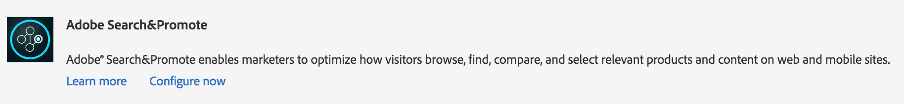

# Integrare con Adobe Search&amp;Promote{#integrating-with-adobe-search-promote}

Per chiamare il servizio Adobe Search&amp;Promote dal sito web, esegui le seguenti attività:

1. Specifica l’URL del cloud.
1. Configura la connessione al servizio Search&amp;Promote.
1. Aggiungete componenti Search&amp;Promote alla barra laterale.
1. Utilizza i componenti per creare i contenuti. (Consulta [Aggiungere funzionalità di Search&amp;Promote a una pagina web](/help/sites-authoring/search-and-promote.md).)
1. Aggiungi dei banner alle tue pagine. Le immagini dei banner sono sensibili ai dati di Search&amp;Promote.
1. Genera una mappa del sito per il servizio Search&amp;Promote da utilizzare.

>[!NOTE]
>
>Se utilizzi Search&amp;Promote con una configurazione proxy personalizzata, devi configurare entrambe le configurazioni proxy del client HTTP, in quanto alcune funzionalità di Adobe Experience Manager utilizzano le API 3.x e altre le API 4.x:
>
>* 3.x è configurato con [https://localhost:4502/system/console/configMgr/com.day.commons.httpclient](https://localhost:4502/system/console/configMgr/com.day.commons.httpclient)
>* 4.x è configurato con [https://localhost:4502/system/console/configMgr/org.apache.http.proxyconfigurator](https://localhost:4502/system/console/configMgr/org.apache.http.proxyconfigurator)

>

## Modificare l’URL del servizio Search&amp;Promote {#changing-the-search-promote-service-url}

L’URL predefinito configurato per il servizio Search&amp;Promote è `https://searchandpromote.omniture.com/px/`. Per utilizzare un servizio diverso, utilizza la console OSGi per specificare un URL diverso.

1. Apri la console OSGi e seleziona la scheda **[!UICONTROL Configurazione]** . ([https://localhost:4502/system/console/configMgr](https://localhost:4502/system/console/configMgr))
1. Seleziona l’elemento Day CQ Search&amp;Promote Configuration.
1. Immettere l&#39;URL nella casella URI server remoto e selezionare **[!UICONTROL Salva]**.

## Configurare la connessione a Search&amp;Promote {#configuring-the-connection-to-search-promote}

Configura una o più connessioni a Search&amp;Promote in modo che le pagine web possano interagire con il servizio. Per connettersi, è necessario l&#39;identificazione dei membri e il numero di account dell&#39;account di Search&amp;Promote.

1. In Experience Manager, passa a **[!UICONTROL Strumenti]** > **[!UICONTROL Implementazione]** > seleziona **[!UICONTROL Cloud Services]**.

   Se ti trovi su un computer locale, l’URL del dashboard è simile al seguente:

   [https://localhost:4502/libs/cq/core/content/tools/cloudservices.html](https://localhost:4502/libs/cq/core/content/tools/cloudservices.html)

1. Nella pagina Cloud Services, seleziona il collegamento Search&amp;Promote Adobe o l’icona Search&amp;Promote .

1. Se si configura Adobe Search&amp;Promote per la prima volta, selezionare **[!UICONTROL Configura ora]** per aprire il pannello Crea configurazione.

   Per ulteriori informazioni su Search&amp;Promote, seleziona **[!UICONTROL Ulteriori informazioni]**.

   

1. Inserisci un **[!UICONTROL Titolo]** riconoscibile dagli autori di pagine e un **[!UICONTROL Nome]** univoco.
1. Seleziona **[!UICONTROL Crea]**.

   Inoltre, la configurazione appena creata viene visualizzata sotto **Configurazioni disponibili** sulla voce dell&#39;elenco di Search&amp;Promote **dashboard Cloud Services** Adobe.

   

1. Nella finestra di dialogo **[!UICONTROL Modifica componente]**, aggiungere quanto segue ai campi.

   * **ID membro**
   * **Numero di conto**

   >[!NOTE]
   >
   >Per ottenere queste informazioni **autonomamente,** è necessario prima accedere a
   >
   >[https://searchandpromote.omniture.com/center/](https://searchandpromote.omniture.com/center/)
   >
   >
   >utilizzando le credenziali valide di Seach&amp;Promote (e-mail/password).
   >Poi, devi guardare il tuo url nella barra degli indirizzi del tuo browser che dovrebbe essere simile a questo:
   >
   >
   >[https://searchandpromote.omniture.com/px/home/?sp_id=XXXXXXXX-spYYYYYYYY](https://searchandpromote.omniture.com/px/home/?sp_id=XXXXXXXX-spYYYYYYYY)
   >
   >**Dove:**
   >
   >    * **** XXXXXXXX corrisponde al tuo* ID membro**
   >    * **** spYYYYYYYYcorrisponde al numero del tuo  **account**

1. Selezionare **[!UICONTROL Connetti a Search&amp;Promote]**.

   Quando viene visualizzato il messaggio di connessione riuscita, selezionare **[!UICONTROL OK]**.

   (Dopo la connessione, il testo del pulsante cambia in** Connetti di nuovo a Search&amp;Promote**.)

1. Selezionare **[!UICONTROL OK]**. Viene visualizzata la pagina Impostazioni Search&amp;Promote per la configurazione creata.

## Configurare il data center {#configuring-the-data-center}

Se l’account di Search&amp;Promote è in Asia o in Europa, è necessario modificare il centro dati predefinito in modo che punti a quello destro (il centro dati predefinito è per gli account nordamericani).

**Per configurare il data center:**

1. Passa alla console Web all’indirizzo `https://localhost:4502/system/console/configMgr/com.day.cq.searchpromote.impl.SearchPromoteServiceImpl`

   

1. A seconda della posizione del server, modificare l’URI in uno dei seguenti modi:

   * America del Nord: [https://center.atomz.com/px/](https://center.atomz.com/px/)
   * EMEA: [https://center.lon5.atomz.com/px/](https://center.lon5.atomz.com/px/)
   * APAC: [https://center.sin2.atomz.com/px/](https://center.sin2.atomz.com/px/)

1. Seleziona **[!UICONTROL Salva]**.

## Aggiungere componenti Search&amp;Promote alla barra laterale {#adding-search-promote-components-to-sidekick}

In modalità Progettazione, modifica un componente **par** per consentire l’utilizzo dei componenti Search&amp;Promote nella barra laterale. (Per ulteriori informazioni, consulta la documentazione [Componenti](/help/sites-developing/components.md#addinganewcomponenttotheparagraphsystemdesignmode) .)

Per informazioni sull&#39;utilizzo dei componenti, consulta [Aggiungere funzionalità di Search&amp;Promote a una pagina web](/help/sites-authoring/search-and-promote.md).)

## Specifica il servizio Search&amp;Promote utilizzato dalle pagine {#specifying-the-search-promote-service-that-your-pages-use}

Configura le pagine web in modo che utilizzino un servizio Search&amp;Promote specifico. I componenti di Search&amp;Promote utilizzano automaticamente il servizio della relativa pagina host.

Quando si configurano le proprietà Search&amp;Promote per una pagina, tutte le pagine figlie ereditano le impostazioni. Se necessario, è possibile configurare le pagine figlie in modo da ignorare le impostazioni ereditate.

>[!NOTE]
>
>La connessione al servizio deve essere configurata in precedenza. (Consultare [Configurare la connessione a Search&amp;Promote](#connection).)

1. Apri la finestra di dialogo **[!UICONTROL Proprietà pagina]** . Ad esempio, nella pagina** Siti web**, fai clic con il pulsante destro del mouse sulla pagina e seleziona **[!UICONTROL Proprietà]**.
1. Selezionare la scheda **[!UICONTROL Cloud Services]**.
1. Per disabilitare l’ereditarietà delle configurazioni di cloud services da una pagina padre, seleziona l’icona a forma di lucchetto accanto al percorso di ereditarietà.

   

1. Seleziona **[!UICONTROL Aggiungi servizio]**.
1. Selezionare **[!UICONTROL Search&amp;Promote Adobe]**, quindi selezionare **[!UICONTROL OK]**.
1. Seleziona la configurazione della connessione per il tuo account Search&amp;Promote, quindi seleziona **OK**.

## Feed di prodotto {#product-feed}

L’integrazione di Search&amp;Promote consente di effettuare le seguenti operazioni:

* Utilizza l’API eCommerce, indipendentemente dalla struttura dell’archivio sottostante e dalla piattaforma commerce.
* Utilizza la funzione Connettore indice di Search&amp;Promote per poter avere un feed di prodotto in formato XML.
* Utilizzare la funzione Controllo remoto di Search&amp;Promote se si desidera eseguire richieste on-demand o pianificate del feed di prodotto.
* Generazione di feed per diversi account di Search&amp;Promote, configurati come configurazioni di servizi cloud.

Per ulteriori informazioni, consulta [Feed prodotto](/help/sites-administering/product-feed.md).
