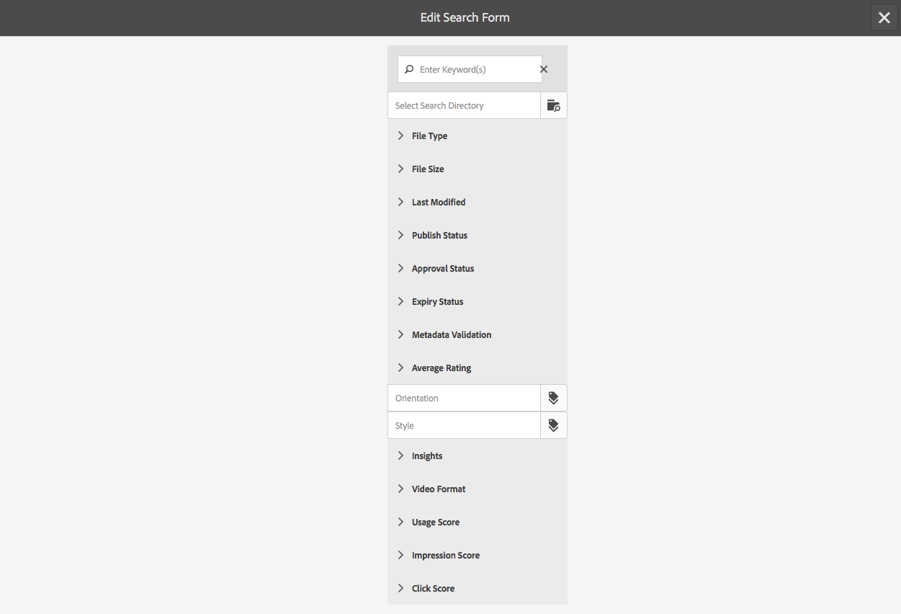

# Configurazione dei moduli di ricerca{#configuring-search-forms}

Utilizzate **Ricerca in Forms** per personalizzare la selezione dei predicati di ricerca utilizzati nei pannelli di ricerca disponibili nelle varie console AEM e/o nei pannelli dell&#39;ambiente di authoring. La personalizzazione di questi pannelli rende la funzionalità di ricerca versatile in base alle esigenze specifiche.

È disponibile un [intervallo di predicate](#predicates-and-their-settings)s out-of-the-box. Potete aggiungere più predicati, inclusi (tra gli altri) il predicato full-text per le ricerche full-text, il predicato Property per cercare risorse che corrispondono a una singola proprietà specificata dall&#39;utente o il predicato Options per cercare risorse che corrispondono a uno o più valori specificati per una particolare proprietà.

È possibile [configurare i moduli di ricerca ](#configuring-your-search-forms) utilizzati in varie console e nel browser delle risorse (durante la modifica delle pagine). È possibile accedere alle finestre di dialogo [per la configurazione di questi moduli](#configuring-your-search-forms) tramite:

* **Strumenti**

   * **Generale**

      * **Moduli di ricerca**

Quando accedete per la prima volta a questa console, potete vedere che tutte le configurazioni dispongono di un simbolo lucchetto. Questo indica che la configurazione appropriata è la configurazione predefinita (out-of-the-box) e non può essere eliminata. Una volta personalizzata la configurazione, il blocco scompare - a meno che [si elimina la configurazione personalizzata](#deleting-a-configuration-to-reinstate-the-default), nel qual caso viene ripristinato il valore predefinito (e l&#39;indicatore del lucchetto).

## Configurazioni {#configurations}

Le configurazioni predefinite disponibili sono:

* **Editor pagina (ricerca documenti):**

   Questa configurazione definisce le opzioni disponibili per la ricerca di documenti nel browser Risorse (durante la modifica di una pagina).

* **Editor pagina (ricerca immagini):**

   Questa configurazione definisce le opzioni disponibili per la ricerca di immagini nel browser Risorse (durante la modifica di una pagina).

* **Editor pagina (ricerca manoscritto):**

   Questa configurazione definisce le opzioni disponibili per la ricerca di manoscritti nel browser Risorse (durante la modifica di una pagina).

* **Editor pagina (ricerca pagine):**

   Questa configurazione definisce le opzioni disponibili per la ricerca di pagine nel browser Risorse (durante la modifica di una pagina).

* **Editor pagina (ricerca paragrafi):**

   Questa configurazione definisce le opzioni disponibili per la ricerca di paragrafi nel browser Risorse (durante la modifica di una pagina).

* **Editor pagina (ricerca prodotti):**

   Questa configurazione definisce le opzioni disponibili per la ricerca di prodotti nel browser Risorse (durante la modifica di una pagina).

* **Editor pagina (Dynamic Media Classic  [precedentemente Scene7] search)**:

   Questa configurazione definisce le opzioni disponibili per la ricerca di risorse Scene7 nel browser Risorse (durante la modifica di una pagina).

* **Barra di ricerca amministrazione sito**:

   Questa configurazione definisce le opzioni di ricerca disponibili per l’utente quando si utilizza la barra di ricerca della console Siti.

* **Editor pagina (ricerca video):**

   Questa configurazione definisce le opzioni disponibili per la ricerca di video nel browser Risorse (durante la modifica di una pagina).

* **Barra di ricerca amministrazione risorse:**

   Questa configurazione definisce le opzioni di ricerca disponibili per l’utente quando utilizza la console Risorse.

* **Barra di ricerca amministrazione progetti:**

   Questa configurazione definisce le opzioni di ricerca disponibili per l&#39;utente durante la ricerca in un catalogo commerciale.

* **Barra di ricerca amministrazione ordini:**

   Questa configurazione definisce le opzioni di ricerca disponibili per l&#39;utente durante la ricerca di ordini commerciali.

* **Barra di ricerca amministrazione raccolte prodotti:**

   Questa configurazione definisce le opzioni di ricerca disponibili per l&#39;utente durante la ricerca nelle raccolte di prodotti commerce.

* **Barra di ricerca amministrazione prodotti:**

   Questa configurazione definisce le opzioni di ricerca disponibili per l&#39;utente durante la ricerca di prodotti e-commerce.

* **Barra di ricerca amministrazione progetti:**

   Questa configurazione definisce le opzioni di ricerca disponibili per l&#39;utente durante la ricerca di progetti.

## Predicati e relative impostazioni {#predicates-and-their-settings}

### Predicati {#predicates}

Sono disponibili i seguenti predicati, a seconda della configurazione:

<table>
 <tbody>
  <tr>
   <th>Predicato</th>
   <th>Scopo</th>
   <th>Impostazioni</th>
  </tr>
  <tr>
   <td>Analisi </td>
   <td>Funzionalità di ricerca/filtro nel browser Siti per la visualizzazione dei dati basati sull'analisi. I filtri di ricerca di Analytics si caricano per corrispondere alle colonne di analisi personalizzate mappate.</td>
   <td>
    <ul>
     <li>Etichetta campo</li>
     <li>Descrizione</li>
    </ul> </td>
  </tr>
  <tr>
   <td>Ultima modifica risorsa </td>
   <td>Data dell'ultima modifica apportata alla risorsa.  </td>
   <td>Un predicato personalizzato, in base al predicato Data.</td>
  </tr>
  <tr>
   <td>Componenti </td>
   <td>Consente a un autore di cercare/filtrare le pagine in cui è contenuto un componente specifico. Ad esempio, una galleria di immagini.  </td>
   <td>
    <ul>
     <li>Etichetta campo</li>
     <li>Segnaposto</li>
     <li>Nome proprietà*</li>
     <li>Profondità proprietà</li>
     <li>Descrizione</li>
    </ul> </td>
  </tr>
  <tr>
   <td>Data </td>
   <td>Ricerca basata su cursore delle risorse basata su una proprietà data.</td>
   <td>
    <ul>
     <li>Etichetta campo</li>
     <li>Nome proprietà*</li>
     <li>Descrizione</li>
    </ul> </td>
  </tr>
  <tr>
   <td>Intervallo date </td>
   <td>Cerca le risorse create all’interno di un intervallo specificato per una proprietà data. Nel pannello Ricerca, potete specificare le date di inizio e fine.</td>
   <td>
    <ul>
     <li>Etichetta campo</li>
     <li>Segnaposto</li>
     <li>Nome proprietà*</li>
     <li>Testo intervallo (Da)*</li>
     <li>Testo intervallo (A)*</li>
     <li>Descrizione</li>
    </ul> </td>
  </tr>
  <tr>
   <td>Stato scadenza </td>
   <td>Consente di effettuare ricerche nelle risorse in base allo stato di scadenza.</td>
   <td>
    <ul>
     <li>Etichetta campo</li>
     <li>Nome proprietà*</li>
     <li>Descrizione</li>
    </ul> </td>
  </tr>
  <tr>
   <td>Dimensione file </td>
   <td>Consente di effettuare ricerche delle risorse in base alle loro dimensioni.</td>
   <td>
    <ul>
     <li>Etichetta campo</li>
     <li>Nome proprietà*</li>
     <li>Percorso opzione</li>
     <li>Descrizione</li>
    </ul> </td>
  </tr>
  <tr>
   <td>Testo completo </td>
   <td>Predefinito di ricerca per ricerche full-text.</td>
   <td>
    <ul>
     <li>Etichetta campo</li>
     <li>Segnaposto</li>
     <li>Nome proprietà</li>
     <li>Descrizione</li>
    </ul> </td>
  </tr>
  <tr>
   <td>Filtro nascosto</td>
   <td>Un filtro su proprietà e valore, non visibile all'utente.</td>
   <td>
    <ul>
     <li>Nome proprietà</li>
     <li>Valore proprietà</li>
     <li>Descrizione</li>
    </ul> </td>
  </tr>
  <tr>
   <td>Opzioni </td>
   <td>
Le opzioni sono nodi di contenuto creati dall'utente.
 
Per ulteriori informazioni, vedere <a href="#addinganoptionspredicate">Aggiunta di un predicato di opzioni</a>.
 </td>
   <td>
    <ul>
     <li>Etichetta campo</li>
     <li>Percorso JSON</li>
     <li>Nome proprietà*</li>
     <li>Selezione singola</li>
     <li>Percorso opzione</li>
     <li>Descrizione</li>
    </ul> </td>
  </tr>
  <tr>
   <td>Proprietà Options </td>
   <td>Cercare in una proprietà dell'opzione.</td>
   <td>
    <ul>
     <li>Etichetta campo</li>
     <li>Nome proprietà*</li>
     <li>Percorso nodo opzioni  </li>
     <li>Selezione singola</li>
     <li>Descrizione</li>
    </ul> </td>
  </tr>
  <tr>
   <td>Pagina Stato </td>
   <td>Consente di cercare le pagine in base al loro stato.</td>
   <td>
    <ul>
     <li>Etichetta campo</li>
     <li>Nome proprietà pubblicazione</li>
     <li>Nome proprietà LiveCopy</li>
     <li>Descrizione</li>
    </ul> </td>
  </tr>
  <tr>
   <td>Percorso </td>
   <td>Consente di cercare le risorse che si trovano sotto un percorso specifico.</td>
   <td>
    <ul>
     <li>Etichetta campo</li>
     <li>Aggiungi percorso di ricerca</li>
     <li>Descrizione</li>
    </ul> </td>
  </tr>
  <tr>
   <td>Proprietà </td>
   <td>Eseguire la ricerca in una proprietà specificata.</td>
   <td>nessuno</td>
  </tr>
  <tr>
   <td>Stato pubblicazione </td>
   <td>Cercare le risorse in base al loro stato di pubblicazione</td>
   <td>
    <ul>
     <li>Etichetta campo</li>
     <li>Nome proprietà*</li>
     <li>Descrizione</li>
    </ul> </td>
  </tr>
  <tr>
   <td>Intervallo </td>
   <td>Consente di cercare risorse all’interno di un intervallo specificato. Nel pannello Ricerca, potete specificare i valori minimo e massimo per l’intervallo.</td>
   <td>
    <ul>
     <li>Etichetta campo</li>
     <li>Nome proprietà</li>
     <li>Descrizione</li>
    </ul> </td>
  </tr>
  <tr>
   <td>Opzioni intervallo </td>
   <td>Un predicato di ricerca specifico per le risorse e lo stesso Predicato di scorrimento comune. È ancora disponibile a causa di problemi di compatibilità con versioni precedenti.</td>
   <td>
    <ul>
     <li>Etichetta campo</li>
     <li>Nome proprietà*</li>
     <li>Percorso opzione</li>
     <li>Descrizione</li>
    </ul> </td>
  </tr>
  <tr>
   <td>Valutazione </td>
   <td>Cercare le risorse in base al loro punteggio.  </td>
   <td>
    <ul>
     <li>Etichetta campo</li>
     <li>Nome proprietà*</li>
     <li>Percorso opzione</li>
     <li>Descrizione</li>
    </ul> </td>
  </tr>
  <tr>
   <td>Data relativa </td>
   <td>Cerca risorse in base alla data relativa della creazione  </td>
   <td>
    <ul>
     <li>Etichetta campo</li>
     <li>Nome proprietà*</li>
     <li>Data relativa</li>
     <li>Descrizione</li>
    </ul> </td>
  </tr>
  <tr>
   <td>Intervallo cursore </td>
   <td>Un predicato di ricerca comune che estende il predicato dell'intervallo con la funzionalità di scorrimento. Il valore della proprietà ricercata deve essere compreso tra i limiti del cursore.</td>
   <td>
    <ul>
     <li>Etichetta campo</li>
     <li>Nome proprietà*</li>
     <li>Descrizione</li>
    </ul> </td>
  </tr>
  <tr>
   <td>Tag </td>
   <td>Consente di effettuare ricerche nelle risorse in base ai tag. È possibile configurare la proprietà Path per compilare vari tag nell'elenco Tag.</td>
   <td>
    <ul>
     <li>Etichetta campo</li>
     <li>Nome proprietà*</li>
     <li>Percorso opzione</li>
     <li>Descrizione</li>
    </ul> </td>
  </tr>
  <tr>
   <td>Tag </td>
   <td>Ricerca basata sui tag.</td>
   <td>
    <ul>
     <li>Segnaposto</li>
     <li>Nome proprietà*</li>
     <li>Descrizione</li>
    </ul> </td>
  </tr>
 </tbody>
</table>

>[!NOTE]
>
>* I predicati di ricerca comuni sono definiti in:
   >  `/libs/cq/gui/components/common/admin/customsearch/searchpredicates`
   >
   >
   >

* I predicati di ricerca relativi solo all’amministrazione del sito (interfaccia classica) si trovano in:
   > `/libs/cq/gui/components/siteadmin/admin/searchpanel/searchpredicates`
   >   * Questi sono obsoleti e sono disponibili solo per compatibilità con versioni precedenti.

>
>
Queste informazioni sono solo per riferimento, non è necessario apportare modifiche a `/libs`.

### Predicate Settings {#predicate-settings}

A seconda del predicato, per la configurazione è disponibile una selezione di impostazioni:

* **Etichetta campo**

   Etichetta che verrà visualizzata come intestazione comprimibile o come etichetta campo del predicato.

* **Descrizione**

   Dettagli descrittivi per l&#39;utente.

* **Segnaposto**

   Testo vuoto o il segnaposto del predicato nel caso in cui non venga immesso testo di filtro.

* **Nome proprietà**

   La proprietà su cui effettuare la ricerca. Utilizza un percorso relativo e i caratteri jolly `*/*/*` specificano la profondità della proprietà relativa al nodo `jcr:content` (ogni asterisco rappresenta un livello di nodo).

   Se si desidera eseguire la ricerca solo su un nodo secondario di primo livello della risorsa con la proprietà `x` nel nodo `jcr:content` utilizzare `*/jcr:content/x`

* **Profondità proprietà**

   Profondità massima per la ricerca di tale proprietà all&#39;interno delle risorse. È quindi possibile eseguire una ricerca su tale proprietà su una risorsa e su elementi secondari ricorsivi fino a quando il livello degli elementi secondari non è uguale alla profondità specificata.

* **Valore proprietà**

   Il valore della proprietà come stringa assoluta o come lingua di espressione; ad esempio, `cq:Page` o

   `${empty requestPathInfo.suffix ? "/content" : requestPathInfo.suffix}`.

* **Testo intervallo**

   Etichetta del campo intervallo nel predicato **Intervallo date**.

* **Percorso opzione**

   L&#39;utente può selezionare il percorso utilizzando il Browser percorsi nella scheda delle impostazioni del predicato. Dopo aver selezionato l&#39;icona **+** viene utilizzata per aggiungere la selezione all&#39;elenco di opzioni valide (quindi l&#39;icona **-** da rimuovere se necessario).

   Le opzioni sono nodi di contenuto creati dall&#39;utente con la struttura seguente:

   `(jcr:primaryType = nt:unstructured, value (String), jcr:title (String))`

* **Opzioni nodo**
pathEffettivamente uguale al 
**Percorso** opzioni, solo questo è nel campo predicato comune, l&#39;altro è specifico per le risorse.

* **Selezione singola:**
se questa opzione è selezionata, le opzioni vengono rappresentate come caselle di controllo che consentono solo una singola selezione. Se selezionata per errore, è possibile deselezionare una casella di controllo.

* **Nome/i proprietà Pubblica e Live Copy**
Le etichette delle caselle di controllo Pubblica e Copia dal vivo per il predicato specifico Siti.

* &amp;ast; nelle etichette dei campi della scheda **Impostazioni**, i campi sono obbligatori e, se lasciato vuoto, viene visualizzato un messaggio di errore

## Configurazione della ricerca Forms {#configuring-your-search-forms}

### Creazione/apertura di una configurazione personalizzata {#creating-opening-a-customized-configuration}

1. Passare a **Strumenti**, **Generali**, **Ricerca in Forms**.

1. Selezionate la configurazione da personalizzare.
1. Utilizzate l&#39;icona **Edit** per aprire la configurazione da aggiornare.
1. Se si desidera eseguire una nuova personalizzazione, è probabile che [aggiungere nuovi campi predicato e definire le impostazioni](#add-edit-a-predicate-field-and-define-field-settings) come necessario. Se esiste una personalizzazione, è possibile selezionare un campo esistente e [aggiornare le impostazioni](#add-edit-a-predicate-field-and-define-field-settings).
1. Selezionare **Fine** per salvare la configurazione.

   >[!NOTE]
   >
   >Le configurazioni personalizzate sono memorizzate (a seconda dei casi) in:
   >
   >* `/apps/cq/gui/content/facets/<option>`
   >* `/apps/commerce/gui/content/facets/<option>`

### Aggiungere o modificare un campo predefinito e definire le impostazioni dei campi {#add-edit-a-predicate-field-and-define-field-settings}

È possibile aggiungere o modificare i campi e definirne o aggiornarne le impostazioni:

1. [Aprite la ](#creating-opening-a-customized-configuration) configurazione personalizzata per l’aggiornamento.
1. Per aggiungere un nuovo campo, aprite la scheda **Seleziona predicato** e trascinate il predicato richiesto nella posizione desiderata. Ad esempio, il **predicato intervallo date**:

   

1. A seconda se:

   * Si sta aggiungendo un nuovo campo:

      Dopo l&#39;aggiunta del predicato, si aprirà la scheda **Settings** e verranno visualizzate le proprietà che è possibile definire.

   * Aggiornare un predicato esistente:

      Selezionate il campo predicato (a destra), quindi aprite la scheda **Impostazioni**.
   Ad esempio, le impostazioni per **Predicato intervallo date**:

   

1. Apportate le modifiche necessarie e confermate con **Fine**.

### Anteprima della configurazione di ricerca {#previewing-the-search-configuration}

1. Selezionate l’icona Anteprima:

   

1. In questo modo i moduli di ricerca verranno visualizzati (completamente espansi) nella colonna Ricerca della console appropriata.

   

1. **Chiudete** l’anteprima per tornare e completare la configurazione.

### Eliminazione di un campo predicato {#deleting-a-predicate-field}

1. [Aprite la ](#creating-opening-a-customized-configuration) configurazione personalizzata per l’aggiornamento.
1. Selezionate il campo predicato (a destra), aprite la scheda **Impostazioni**, quindi selezionate l&#39;icona **Elimina** (in basso a sinistra).

   

1. Viene visualizzata una finestra di dialogo per richiedere la conferma dell’azione di eliminazione.

1. Confermate questa e tutte le altre modifiche con **Done**.

### Eliminazione di una configurazione (per ripristinare il valore predefinito) {#deleting-a-configuration-to-reinstate-the-default}

Una volta personalizzata una configurazione, le impostazioni predefinite verranno ignorate. Potete ripristinare la configurazione predefinita eliminando la configurazione personalizzata.

>[!NOTE]
>
>Non è possibile eliminare nessuna delle configurazioni predefinite.

L’eliminazione di una configurazione personalizzata viene effettuata dalla console:

1. Selezionare la configurazione desiderata (ad esempio, **Editor pagina (ricerca paragrafi)**), quindi l&#39;icona **Elimina** nella barra degli strumenti:

   

1. La configurazione personalizzata verrà eliminata e verrà ripristinata l’impostazione predefinita (come indicato dalla riapparizione del simbolo lucchetto nella console).

### Aggiunta di predicati di opzioni {#adding-options-predicates}

I predicati delle opzioni (Opzioni, Proprietà Opzioni) consentono di configurare un elemento da ricercare. Sono solitamente utilizzati per cercare qualcosa direttamente sotto la pagina; ad esempio, una proprietà sul nodo della pagina.

L’esempio seguente (per effettuare ricerche in base al modello utilizzato per creare una pagina) illustra i passaggi da seguire:

1. Creare il nodo che definisce la proprietà su cui eseguire la ricerca.

   Sarà necessario un nodo principale che contenga le definizioni delle singole opzioni per essere disponibili per l&#39;utente.

   I nodi delle singole opzioni richiedono le proprietà:

   * `jcr:title` - l&#39;etichetta del campo da visualizzare nella barra di ricerca
   * `value` - il valore della proprietà su cui effettuare la ricerca

   

   >[!NOTE]
   >
   >***non è necessario*** modificare nulla nel percorso `/libs`.
   >
   >Questo perché il contenuto di `/libs` viene sovrascritto al successivo aggiornamento dell&#39;istanza (e potrebbe essere sovrascritto quando si applica un hotfix o un feature pack).
   >
   >Il metodo consigliato per la configurazione e altre modifiche è:
   >
   >1. Ricreare l&#39;elemento richiesto, così come esiste in `/libs`, in `/apps`. In questo caso da:
   >1. `/libs/cq/gui/content/common/options/predicates`
   >1. Apportare modifiche all&#39;interno di `/apps.`

1. Aprite la console **Cerca in Forms** e selezionate la configurazione da aggiornare. Ad esempio, **Barra di ricerca Amministratore siti**.

   Quindi fare clic/toccare l&#39;icona **Modifica moduli di ricerca**.

1. A seconda della configurazione, aggiungere alla configurazione una proprietà **Options** o **Options**.
1. Aggiornare i campi, in particolare:

   * **Nome proprietà**

      Specifica la proprietà node da cercare nei nodi target. Esempio:

      `jcr:content/cq:template`

   * **Percorso nodo opzione**

      Selezionate il percorso in cui vengono mantenute le opzioni. Esempio:

      `/apps/cq/gui/content/common/options/predicates/templatetype`
   

1. Selezionare **Fine** per salvare la configurazione.
1. Andate alla console appropriata (in questo esempio, **Siti**) e aprite la barra **Ricerca**. I nuovi moduli di ricerca definiti e le varie opzioni saranno visibili. Selezionate l’opzione desiderata per visualizzare i risultati della ricerca:

   

## Autorizzazioni utente {#user-permissions}

Nella tabella seguente sono elencate le autorizzazioni necessarie per eseguire le azioni di modifica, eliminazione e anteprima sui moduli di ricerca.

<table>
 <tbody>
  <tr>
   <td><strong>Azione</strong></td>
   <td><strong>Autorizzazioni </strong></td>
  </tr>
  <tr>
   <td>Modifica </td>
   <td>Leggi, scrivi le autorizzazioni sul nodo <code>/apps </code>.</td>
  </tr>
  <tr>
   <td>Elimina</td>
   <td>Autorizzazioni di lettura, scrittura, eliminazione sul nodo <code>/apps</code></td>
  </tr>
  <tr>
   <td>Anteprima</td>
   <td>Autorizzazioni di lettura, scrittura, eliminazione sul nodo <code>/var/dam/content</code>.  Autorizzazioni di lettura e scrittura sul  <code>/apps</code> nodo.</td>
  </tr>
 </tbody>
</table>

