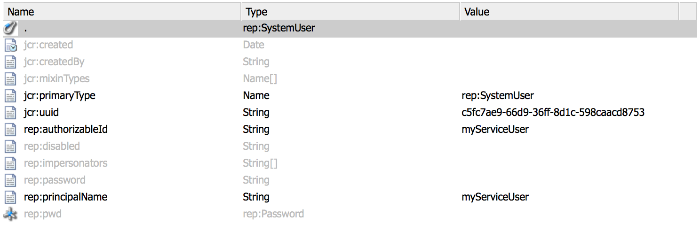

# Utenti del servizio in AEM{#service-users-in-aem}

## Panoramica {#overview}

Il modo principale per ottenere una sessione amministrativa o un risolutore di risorse in AEM era utilizzare il `SlingRepository.loginAdministrative()` e `ResourceResolverFactory.getAdministrativeResourceResolver()` metodi forniti da Sling.

Tuttavia, nessuno di questi metodi è stato progettato intorno al [principio del minimo privilegio](https://en.wikipedia.org/wiki/Principle_of_least_privilege) e rendi troppo facile per uno sviluppatore non pianificare una struttura adeguata e i corrispondenti livelli di controllo accessi (ACL, Access Control Levels) per il loro contenuto all&#39;inizio. Se una vulnerabilità è presente in un tale servizio, spesso porta a escalation di privilegi per `admin` utente, anche se il codice stesso non avrebbe bisogno di privilegi amministrativi per funzionare.

## Come uscire gradualmente dalle sessioni di amministrazione {#how-to-phase-out-admin-sessions}

### Priorità 0: La funzione è attiva/necessaria/abbandonata? {#priority-is-the-feature-active-needed-derelict}

In alcuni casi la sessione di amministrazione non viene utilizzata o la funzione viene disabilitata completamente. Se questo è il caso dell’implementazione, assicurati di rimuovere completamente la funzione o di adattarla a [Codice NOP](https://en.wikipedia.org/wiki/NOP).

### Priorità 1: Utilizzare La Sessione Di Richiesta {#priority-use-the-request-session}

Ogni volta che è possibile, riFattore della funzione in modo che la sessione di richiesta autenticata specificata possa essere utilizzata per leggere o scrivere contenuti. Se ciò non è fattibile, spesso si può ottenere applicando le priorità seguenti.

### Priorità 2: Contenuto della ristrutturazione {#priority-restructure-content}

Molti problemi possono essere risolti ristrutturando il contenuto. Tieni presenti queste semplici regole durante la ristrutturazione:

* **Modifica controllo accesso**

   * Assicurati che gli utenti o i gruppi che hanno veramente bisogno di accesso abbiano effettivamente accesso;

* **Ottimizzare la struttura dei contenuti**

   * spostarlo in altre posizioni, ad esempio dove il controllo degli accessi corrisponde alle sessioni di richiesta disponibili;
   * Modificare la granularità del contenuto;

* **Reimpostare il codice in modo che sia un servizio appropriato**

   * Sposta la logica di business dal codice JSP al servizio. Ciò consente di creare modelli di contenuto diversi.

Inoltre, assicurati che tutte le nuove funzioni sviluppate siano conformi ai seguenti principi:

* **I requisiti di sicurezza devono guidare la struttura del contenuto**

   * La gestione del controllo degli accessi dovrebbe risultare naturale
   * Il controllo di accesso deve essere applicato dall&#39;archivio, non dall&#39;applicazione

* **Utilizzare nodetypes**

   * Limita il set di proprietà che è possibile impostare

* **Rispetta le impostazioni della privacy**

   * Nel caso di profili privati, un esempio potrebbe essere quello di non esporre l’immagine del profilo, l’e-mail o il nome completo che si trova sul privato `/profile` nodo.

## Controllo rigoroso dell&#39;accesso {#strict-access-control}

Che si applichi il controllo degli accessi durante la ristrutturazione del contenuto o quando lo si fa per un nuovo utente di servizio, è necessario applicare gli ACL più rigidi possibile. Utilizzare tutte le possibilità di controllo dell&#39;accesso:

* Ad esempio, anziché applicare `jcr:read` su `/apps`, applica solo a `/apps/*/components/*/analytics`

* Utilizzo [restrizioni](https://jackrabbit.apache.org/oak/docs/security/authorization/restriction.html)

* Applica ACL per i tipi di nodo
* Autorizzazioni limite

   * ad esempio, quando devi solo scrivere le proprietà, non assegnare `jcr:write` autorizzazione; use `jcr:modifyProperties` anziché

## Utenti e mappature dei servizi {#service-users-and-mappings}

Se quanto sopra non riesce, Sling 7 offre un servizio di mappatura utenti del servizio che consente di configurare una mappatura bundle-to-user e due metodi API corrispondenti: ` [SlingRepository.loginService()](https://sling.apache.org/apidocs/sling7/org/apache/sling/jcr/api/SlingRepository.html#loginService-java.lang.String-java.lang.String-)` e ` [ResourceResolverFactory.getServiceResourceResolver()](https://sling.apache.org/apidocs/sling7/org/apache/sling/api/resource/ResourceResolverFactory.html#getServiceResourceResolver-java.util.Map-)` che restituisce un risolutore di sessione/risorse con i privilegi di un solo utente configurato. Questi metodi hanno le seguenti caratteristiche:

* Consentono di mappare i servizi agli utenti
* Consentono di definire gli utenti dei servizi secondari
* Il punto di configurazione centrale è: `org.apache.sling.serviceusermapping.impl.ServiceUserMapperImpl`
* `service-id` = `service-name` [ &quot;:&quot; nome-servizio secondario ]


* `service-id` è mappato a un risolutore di risorse e/o a un ID utente dell’archivio JCR per l’autenticazione
* `service-name` è il nome simbolico del bundle che fornisce il servizio

## Altro Recommendations {#other-recommendations}

### Sostituzione della sessione di amministrazione con un utente del servizio {#replacing-the-admin-session-with-a-service-user}

Un utente di servizio è un utente JCR senza password impostata e con un set minimo di privilegi necessari per eseguire un&#39;attività specifica. Se non è impostata alcuna password, non sarà possibile accedere con un utente del servizio.

Un modo per rendere obsoleta una sessione amministrativa consiste nel sostituirla con sessioni utente di servizio. Se necessario, potrebbe anche essere sostituito da più utenti di servizi secondari.

Per sostituire la sessione di amministrazione con un utente di servizio, esegui i seguenti passaggi:

1. Identifica le autorizzazioni necessarie per il tuo servizio, tenendo presente il principio della minima autorizzazione.
1. Controlla se c&#39;è già un utente disponibile con esattamente la configurazione dell&#39;autorizzazione necessaria. Crea un nuovo utente del servizio di sistema se nessun utente esistente soddisfa le tue esigenze. RTC è necessario per creare un nuovo utente di servizio. A volte ha senso creare più utenti di servizi secondari (ad esempio, uno per la scrittura e uno per la lettura) per compartimentare l&#39;accesso ancora di più.
1. Imposta e verifica gli ACE per l’utente.
1. Aggiungi un `service-user` mappatura per il servizio e per `user/sub-users`

1. Rendi la funzione sling dell&#39;utente del servizio disponibile per il tuo bundle: aggiornamento alla versione più recente di `org.apache.sling.api`.

1. Sostituisci il `admin-session` nel tuo codice con `loginService` o `getServiceResourceResolver` API.

## Creazione di un nuovo utente di servizio {#creating-a-new-service-user}

Dopo aver verificato che nessun utente nell’elenco degli utenti del servizio AEM è applicabile al tuo caso d’uso e che i corrispondenti problemi RTC sono stati approvati, puoi procedere e aggiungere il nuovo utente al contenuto predefinito.

L&#39;approccio consigliato è quello di creare un utente di servizio per utilizzare l&#39;esploratore del repository in *https://&lt;server>:&lt;port>/crx/explorer/index.jsp*

L&#39;obiettivo è quello di ottenere una `jcr:uuid` che è obbligatorio per creare l&#39;utente tramite un&#39;installazione di un pacchetto di contenuti.

Puoi creare utenti del servizio:

1. Andando al repository explorer all&#39;indirizzo *https://&lt;server>:&lt;port>/crx/explorer/index.jsp*
1. Accedere come amministratore premendo il pulsante **Accesso** nell’angolo in alto a sinistra dello schermo.
1. Quindi, crea e denomina l&#39;utente di sistema. Per creare l&#39;utente come un sistema, impostare il percorso intermedio come `system` e aggiungi sottocartelle facoltative in base alle tue esigenze:

   

1. Verifica che il nodo utente del sistema si presenti come segue:

   

   >[!NOTE]
   >
   >Non esistono tipi di mixin associati agli utenti del servizio. Ciò significa che non vi saranno criteri di controllo degli accessi per gli utenti del sistema.

Quando aggiungi il corrispondente .content.xml al contenuto del bundle, assicurati di aver impostato il `rep:authorizableId` e che il tipo principale è `rep:SystemUser`. Dovrebbe essere così:

```xml
<?xml version="1.0" encoding="UTF-8"?>
<jcr:root xmlns:jcr="https://www.jcp.org/jcr/1.0" xmlns:rep="internal"
    jcr:primaryType="rep:SystemUser"
    jcr:uuid="4917dd68-a0c1-3021-b5b7-435d0044b0dd"
    rep:principalName="authentication-service"
    rep:authorizableId="authentication-service"/>
```

## Aggiunta di una modifica alla configurazione ServiceUserMapper {#adding-a-configuration-amendment-to-the-serviceusermapper-configuration}

Per aggiungere una mappatura dal servizio agli utenti di sistema corrispondenti, è necessario creare una configurazione di fabbrica per ` [ServiceUserMapper](https://sling.apache.org/apidocs/sling7/org/apache/sling/serviceusermapping/ServiceUserMapper.html)` servizio. Per mantenere questa modulare tali configurazioni possono essere fornite utilizzando [Meccanismo di modifica dello Sling](https://issues.apache.org/jira/browse/SLING-3578). Il modo consigliato per installare tali configurazioni con il tuo bundle è quello di utilizzare [Caricamento del contenuto iniziale di Sling](https://sling.apache.org/documentation/bundles/content-loading-jcr-contentloader.html):

1. Crea una sottocartella SLING-INF/content sotto la cartella src/main/resources del bundle
1. In questa cartella crea un file chiamato org.apache.sling.serviceusermapping.impl.ServiceUserMapperImpl.modified-&lt;some unique=&quot;&quot; name=&quot;&quot; for=&quot;&quot; your=&quot;&quot; factory=&quot;&quot; configuration=&quot;&quot;>.xml con il contenuto della configurazione di fabbrica (incluse tutte le mappature utente dei servizi secondari). Esempio:

1. Crea un `SLING-INF/content` sotto la cartella `src/main/resources` cartella del tuo bundle;
1. In questa cartella crea un file `named org.apache.sling.serviceusermapping.impl.ServiceUserMapperImpl.amended-<a unique name for your factory configuration>.xml` con il contenuto della configurazione di fabbrica, incluse tutte le mappature utente dei servizi secondari.

   A scopo illustrativo, utilizza un file denominato `org.apache.sling.serviceusermapping.impl.ServiceUserMapperImpl.amended-com.adobe.granite.auth.saml.xml`:

   ```xml
   <?xml version="1.0" encoding="UTF-8"?>
   <node>
       <primaryNodeType>sling:OsgiConfig</primaryNodeType>
       <property>
           <name>user.default</name>
           <value></value>
       </property>
       <property>
           <name>user.mapping</name>
           <values>
               <value>com.adobe.granite.auth.saml=authentication-service</value>
           </values>
       </property>
   </node>
   ```

1. Fai riferimento al contenuto iniziale Sling nella configurazione del `maven-bundle-plugin` in `pom.xml` del tuo bundle. Esempio:

   ```xml
   <Sling-Initial-Content>
      SLING-INF/content;path:=/libs/system/config;overwrite:=true;
   </Sling-Initial-Content>
   ```

1. Installa il bundle e assicurati che la configurazione di fabbrica sia stata installata. Per farlo, segui questi passaggi:

   * Andando alla console Web in *https://serverhost:serveraddress/system/console/configMgr*
   * Cerca **Modifica al servizio User Mapper di Apache Sling Service**
   * Fai clic sul collegamento per verificare se è presente la configurazione corretta.

## Gestione delle sessioni condivise nei servizi {#dealing-with-shared-sessions-in-services}

Chiamate a `loginAdministrative()` vengono spesso visualizzati insieme a sessioni condivise. Queste sessioni vengono acquisite all’attivazione del servizio e vengono disconnesse solo dopo l’arresto del servizio. Anche se questa è una pratica comune, porta a due problemi:

* **Sicurezza:** Tali sessioni di amministrazione vengono utilizzate per memorizzare in cache e restituire risorse o altri oggetti associati alla sessione condivisa. Successivamente nello stack di chiamate questi oggetti potrebbero essere adattati alle sessioni o ai risolutori di risorse con privilegi elevati e spesso non è chiaro al chiamante che si tratta di una sessione di amministrazione con cui stanno operando.
* **Prestazioni:** Nelle sessioni condivise di Oak possono causare problemi di prestazioni e attualmente non è consigliabile utilizzarle.

La soluzione più ovvia per il rischio di sicurezza è semplicemente sostituire il `loginAdministrative()` chiama con un `loginService()` uno per un utente con privilegi limitati. Tuttavia, questo non avrà alcun impatto su eventuali potenziali degrado delle prestazioni. Una possibilità di mitigare questo problema è quella di racchiudere tutte le informazioni richieste in un oggetto che non ha alcuna associazione con la sessione. Quindi, crea (o distruggi) la sessione su richiesta.

L’approccio consigliato consiste nel refactorizzare l’API del servizio per dare al chiamante il controllo sulla creazione/distruzione della sessione.

## Sessioni amministrative in JSP {#administrative-sessions-in-jsps}

JSP non può utilizzare `loginService()`, perché non è presente alcun servizio associato. Tuttavia, le sessioni amministrative in JSP sono solitamente un segno di una violazione del paradigma MVC.

Questo può essere corretto in due modi:

1. Ristrutturazione del contenuto in modo da consentirne la manipolazione con la sessione utente;
1. Estrarre la logica in un servizio che fornisce un’API che può quindi essere utilizzata da JSP.

Il primo metodo è quello preferito.

## Eventi di elaborazione, preprocessori di replica e processi {#processing-events-replication-preprocessors-and-jobs}

Quando si elaborano eventi o lavori e, in alcuni casi, flussi di lavoro, la sessione corrispondente che ha attivato l’evento viene in genere persa. Questo porta a gestori di eventi e processori di processi che utilizzano spesso sessioni amministrative per svolgere il loro lavoro. Ci sono diversi approcci concepibili per risolvere questo problema, ciascuno con i loro vantaggi e svantaggi:

1. Passa la `user-id` nel payload dell’evento e utilizza la rappresentazione.

   **Vantaggi:** Facile da usare.

   **Svantaggi:** Usi fissi `loginAdministrative()`. autentica nuovamente una richiesta già autenticata.

1. Crea o riutilizza un utente del servizio che ha accesso ai dati.

   **Vantaggi:** Coerente con la progettazione corrente. Ha bisogno di un cambiamento minimo.

   **Svantaggi:** Ha bisogno di utenti di servizi molto potenti per essere flessibili, che può facilmente portare a escalation di privilegi. Attiva il modello di sicurezza.

1. Passa una serializzazione del `Subject` nel payload dell’evento e crea un `ResourceResolver` in base a tale argomento. Un esempio potrebbe essere l&#39;utilizzo di JAAS `doAsPrivileged` in `ResourceResolverFactory`.

   **Vantaggi:** Pulisci l&#39;implementazione dal punto di vista della sicurezza. Evita la riautenticazione e funziona con i privilegi originali. Il codice relativo alla sicurezza è trasparente per il consumatore dell&#39;evento.

   **Svantaggi:** Ha bisogno di essere refactoring. Anche il fatto che il codice relativo alla sicurezza sia trasparente per il consumatore dell&#39;evento potrebbe causare problemi.

Il terzo approccio è attualmente la tecnica di elaborazione preferita.

## Processi del flusso di lavoro {#workflow-processes}

Nelle implementazioni del processo del flusso di lavoro, la sessione utente corrispondente che ha attivato il flusso di lavoro in genere viene persa. Questo porta ai processi del flusso di lavoro che utilizzano spesso sessioni amministrative per eseguire il loro lavoro.

Per risolvere questi problemi, si raccomanda che gli stessi approcci indicati in [Eventi di elaborazione, preprocessori di replica e processi](/help/sites-administering/security-service-users.md#processing-events-replication-preprocessors-and-jobs) da utilizzare.

## Processori Sling POST e pagine eliminate {#sling-post-processors-and-deleted-pages}

Ci sono un paio di sessioni amministrative utilizzate nelle implementazioni di processori sling POST. Di solito, le sessioni amministrative vengono utilizzate per accedere ai nodi in attesa di eliminazione all’interno di POST in fase di elaborazione. Di conseguenza, non sono più disponibili tramite la sessione di richiesta. È possibile accedere a un nodo in attesa di eliminazione per rivelare un metada che altrimenti non dovrebbe essere accessibile.
