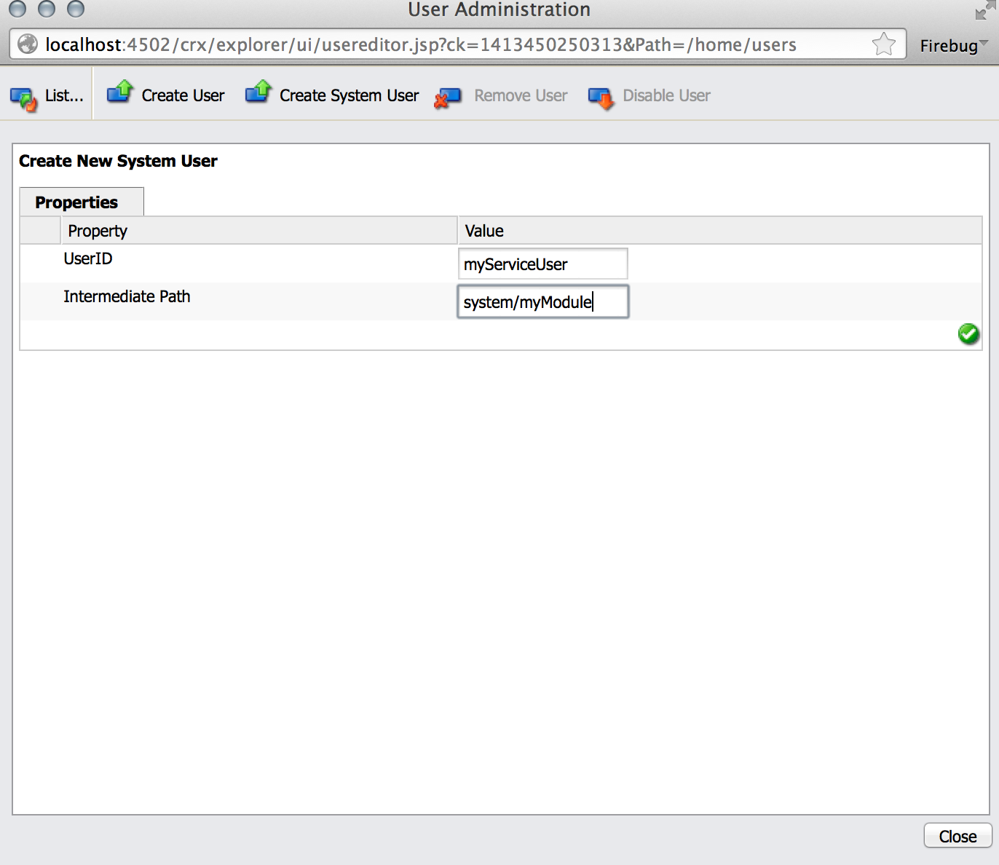

# Utenti del servizio in Adobe Experience Manager (AEM) {#service-users-in-aem}

## Panoramica {#overview}

Il modo principale per ottenere una sessione amministrativa o un risolutore risorse in AEM era utilizzare `SlingRepository.loginAdministrative()` e `ResourceResolverFactory.getAdministrativeResourceResolver()` metodi forniti da Sling.

Tuttavia, nessuno di questi metodi è stato progettato intorno al [principio del privilegio minimo](https://en.wikipedia.org/wiki/Principle_of_least_privilege) e rendere troppo semplice per uno sviluppatore non pianificare per tempo una struttura appropriata e i corrispondenti livelli di controllo di accesso (ACL) per i propri contenuti. Se in un servizio di questo tipo è presente una vulnerabilità, spesso si verificano escalation di privilegi `admin` anche se il codice stesso non necessita di privilegi amministrativi per funzionare.

## Come eliminare gradualmente le sessioni di amministrazione {#how-to-phase-out-admin-sessions}

### Priorità 0: la funzione è attiva/necessaria/obsoleta? {#priority-is-the-feature-active-needed-derelict}

In alcuni casi, la sessione di amministrazione non viene utilizzata oppure la funzione viene completamente disabilitata. In questo caso, assicurati di rimuovere completamente la funzione o di adattarla a [Codice NOP](https://en.wikipedia.org/wiki/NOP).

### Priorità 1: Utilizzare La Sessione Di Richiesta {#priority-use-the-request-session}

Quando possibile, effettua il refactoring della funzione in modo che la sessione di richiesta autenticata specificata possa essere utilizzata per la lettura o la scrittura di contenuti. Se ciò non è fattibile, spesso è possibile realizzarlo applicando le priorità seguenti.

### Priorità 2: Ristrutturazione del contenuto {#priority-restructure-content}

Molti problemi possono essere risolti ristrutturando il contenuto. Durante la ristrutturazione, considera queste semplici regole:

* **Cambia il controllo dell&#39;accesso**

   * Assicurati che gli utenti o i gruppi che necessitano effettivamente di accesso abbiano effettivamente accesso;

* **Ottimizzare la struttura del contenuto**

   * Spostalo in altre posizioni, ad esempio, in cui il controllo di accesso corrisponde alle sessioni di richiesta disponibili;
   * Modificare la granularità del contenuto;

* **Effettua il refactoring del codice per renderlo un servizio appropriato**

   * Sposta la logica di business dal codice JSP al servizio. Questo consente una modellazione del contenuto diversa.

Inoltre, assicurati che tutte le nuove funzioni sviluppate siano conformi ai seguenti principi:

* **I requisiti di sicurezza sono alla base della struttura dei contenuti**

   * La gestione del controllo degli accessi dovrebbe essere naturale
   * Il controllo degli accessi deve essere applicato dall&#39;archivio, non dall&#39;applicazione

* **Utilizzare i tipi di nodo**

   * Limita il set di proprietà che è possibile impostare

* **Rispetta le impostazioni di privacy**

   * Se sono presenti profili privati, ad esempio, potrebbe essere utile non esporre l’immagine del profilo, l’e-mail o il nome completo trovati nel profilo privato `/profile` nodo.

## Controllo accesso rigoroso {#strict-access-control}

Sia che si applichi il controllo degli accessi durante la ristrutturazione dei contenuti o quando lo si fa per un nuovo utente del servizio, è necessario applicare gli ACL più severi possibili. Usare tutte le possibilità di controllo degli accessi:

* Ad esempio, invece di applicare `jcr:read` il `/apps`, applicarlo solo a `/apps/*/components/*/analytics`

* Utilizzare [restrizioni](https://jackrabbit.apache.org/oak/docs/security/authorization/restriction.html)

* Applica ACL per i tipi di nodo
* Limita autorizzazioni

   * ad esempio, quando devi solo scrivere le proprietà, non dare il `jcr:write` autorizzazione; utilizzare `jcr:modifyProperties` invece

## Utenti e mappature dei servizi {#service-users-and-mappings}

Se quanto sopra non va a buon fine, Sling 7 offre un servizio di mappatura degli utenti del servizio, che consente di configurare una mappatura bundle-to-user e due metodi API corrispondenti:

* [`SlingRepository.loginService()`](https://sling.apache.org/apidocs/sling7/org/apache/sling/jcr/api/SlingRepository.html#loginService-java.lang.String-java.lang.String-)
* [`ResourceResolverFactory.getServiceResourceResolver()`](https://sling.apache.org/apidocs/sling7/org/apache/sling/api/resource/ResourceResolverFactory.html#getServiceResourceResolver-java.util.Map-)

I metodi restituiscono un risolutore sessione/risorsa con i privilegi solo di un utente configurato. Questi metodi presentano le seguenti caratteristiche:

* Consentono di mappare i servizi agli utenti
* Consentono di definire gli utenti dei servizi secondari
* Il punto di configurazione centrale è: `org.apache.sling.serviceusermapping.impl.ServiceUserMapperImpl`
* `service-id` = `service-name` [&quot;:&quot; nome-servizio-secondario]

* `service-id` è mappato a un risolutore risorse e/o a un ID utente dell’archivio JCR per l’autenticazione
* `service-name` è il nome simbolico del bundle che fornisce il servizio

## Altro Recommendations {#other-recommendations}

### Sostituzione della sessione di amministrazione con un utente del servizio {#replacing-the-admin-session-with-a-service-user}

Un utente del servizio è un utente JCR senza password impostata e con un set minimo di privilegi necessari per eseguire un’attività specifica. Se non viene impostata alcuna password, non sarà possibile effettuare l&#39;accesso con un utente del servizio.

Un modo per rendere obsoleta una sessione amministrativa consiste nel sostituirla con sessioni utente di servizio. Se necessario, può anche essere sostituito da più utenti del servizio secondario.

Per sostituire la sessione di amministrazione con un utente del servizio, è necessario effettuare le seguenti operazioni:

1. Identifica le autorizzazioni necessarie per il servizio, tenendo presente il principio delle autorizzazioni minime.
1. Controlla se è già disponibile un utente con esattamente la configurazione delle autorizzazioni necessaria. Crea un utente del servizio di sistema se nessun utente esistente soddisfa le tue esigenze. RTC è necessario per creare un utente di servizio. A volte, ha senso creare più utenti di servizi secondari (ad esempio, uno per la scrittura e uno per la lettura) per suddividere ulteriormente l’accesso.
1. Configurare e testare le ACE per l&#39;utente.
1. Aggiungi un `service-user` mappatura per il servizio e per `user/sub-users`

1. Rendi la funzione sling dell’utente del servizio disponibile per il bundle: aggiorna alla versione più recente di `org.apache.sling.api`.

1. Sostituisci il `admin-session` nel codice con `loginService` o `getServiceResourceResolver` API.

## Creazione di un utente del servizio {#creating-a-new-service-user}

Dopo aver verificato che nessun utente nell’elenco degli utenti del servizio AEM è applicabile al tuo caso d’uso e che i corrispondenti problemi RTC sono stati approvati, puoi procedere e aggiungere il nuovo utente al contenuto predefinito.

L’approccio consigliato consiste nel creare un utente del servizio che possa utilizzare Esplora archivio all’indirizzo *https://&lt;server>:&lt;port>/crx/explorer/index.jsp*

L’obiettivo è ottenere un `jcr:uuid` che è obbligatoria per creare l’utente tramite un’installazione del pacchetto di contenuti.

Per creare utenti del servizio, segui questi passaggi:

1. Passare a Esplora archivio all&#39;indirizzo *https://&lt;server>:&lt;port>/crx/explorer/index.jsp*
1. Accesso come amministratore premendo il tasto **Accedi** nell’angolo in alto a sinistra dello schermo.
1. Quindi, crea e assegna un nome all’utente del sistema. Per creare l&#39;utente come utente di sistema, impostare il percorso intermedio come `system` e aggiungi sottocartelle facoltative in base alle tue esigenze:

   

1. Verifica che il nodo utente del sistema sia visualizzato come segue:

   

   >[!NOTE]
   >
   >Nessun tipo mixin associato agli utenti del servizio. Ciò significa che non ci saranno criteri di controllo di accesso per gli utenti del sistema.

Quando aggiungi il file .content.xml corrispondente al contenuto del bundle, assicurati di aver impostato `rep:authorizableId` e che il tipo principale sia `rep:SystemUser`. Dovrebbe essere simile al seguente:

```xml
<?xml version="1.0" encoding="UTF-8"?>
<jcr:root xmlns:jcr="https://www.jcp.org/jcr/1.0" xmlns:rep="internal"
    jcr:primaryType="rep:SystemUser"
    jcr:uuid="4917dd68-a0c1-3021-b5b7-435d0044b0dd"
    rep:principalName="authentication-service"
    rep:authorizableId="authentication-service"/>
```

## Aggiunta di una modifica alla configurazione ServiceUserMapper {#adding-a-configuration-amendment-to-the-serviceusermapper-configuration}

Per aggiungere una mappatura dal servizio agli utenti di sistema corrispondenti, creare una configurazione di fabbrica per [`ServiceUserMapper`](https://sling.apache.org/apidocs/sling7/org/apache/sling/serviceusermapping/ServiceUserMapper.html) servizio. Per mantenere modulare questa configurazione, è possibile fornire utilizzando [Meccanismo di correzione Sling](https://issues.apache.org/jira/browse/SLING-3578). Il modo consigliato per installare tali configurazioni con il bundle è utilizzare [Caricamento iniziale del contenuto Sling](https://sling.apache.org/documentation/bundles/content-loading-jcr-contentloader.html):

1. Crea una sottocartella SLING-INF/content sotto la cartella src/main/resources del bundle
1. In questa cartella, crea un file denominato org.apache.sling.serviceusermapping.impl.ServiceUserMapperImpl.modified-&lt;some unique=&quot;&quot; name=&quot;&quot; for=&quot;&quot; your=&quot;&quot; factory=&quot;&quot; configuration=&quot;&quot;>.xml con il contenuto della configurazione di fabbrica (incluse tutte le mappature utente dei servizi secondari). Esempio:

1. Creare un `SLING-INF/content` cartella sotto il `src/main/resources` cartella del bundle;
1. Crea un file in questa cartella `named org.apache.sling.serviceusermapping.impl.ServiceUserMapperImpl.amended-<a unique name for your factory configuration>.xml` con il contenuto della configurazione di fabbrica, incluse tutte le mappature utente dei servizi secondari.

   A scopo illustrativo, prendere il file denominato `org.apache.sling.serviceusermapping.impl.ServiceUserMapperImpl.amended-com.adobe.granite.auth.saml.xml`:

   ```xml
   <?xml version="1.0" encoding="UTF-8"?>
   <node>
       <primaryNodeType>sling:OsgiConfig</primaryNodeType>
       <property>
           <name>user.default</name>
           <value></value>
       </property>
       <property>
           <name>user.mapping</name>
           <values>
               <value>com.adobe.granite.auth.saml=authentication-service</value>
           </values>
       </property>
   </node>
   ```

1. Fai riferimento al contenuto iniziale di Sling nella configurazione di `maven-bundle-plugin` nel `pom.xml` del pacchetto. Esempio:

   ```xml
   <Sling-Initial-Content>
      SLING-INF/content;path:=/libs/system/config;overwrite:=true;
   </Sling-Initial-Content>
   ```

1. Installa il bundle e assicurati che la configurazione di fabbrica sia installata. Per farlo, segui questi passaggi:

   * Vai alla console web all’indirizzo *https://serverhost:serveraddress/system/console/configMgr*
   * Cerca **Modifica del servizio User Mapper di Apache Sling**
   * Fai clic sul collegamento per verificare se è presente la configurazione corretta.

## Gestione delle sessioni condivise nei servizi {#dealing-with-shared-sessions-in-services}

Chiamate a `loginAdministrative()` vengono spesso visualizzate insieme alle sessioni condivise. Queste sessioni vengono acquisite al momento dell’attivazione del servizio e vengono disconnesse solo dopo che il servizio è stato arrestato. Anche se si tratta di una pratica comune, ciò comporta due problemi:

* **Sicurezza:** Tali sessioni di amministrazione vengono utilizzate per memorizzare nella cache e restituire risorse o altri oggetti associati alla sessione condivisa. Più avanti nello stack di chiamate questi oggetti potrebbero essere adattati a sessioni o risolutori di risorse con privilegi elevati e spesso non è chiaro al chiamante che si tratta di una sessione di amministrazione con cui stanno operando.
* **Prestazioni:** In Oak, le sessioni condivise possono causare problemi di prestazioni e non è consigliabile utilizzarle.

La soluzione più ovvia per il rischio di sicurezza è semplicemente sostituire il `loginAdministrative()` chiama con un `loginService()` uno a un utente con privilegi limitati. Tuttavia, questo non avrà alcun impatto sul potenziale deterioramento delle prestazioni. Una possibilità per mitigare questo consiste nel racchiudere tutte le informazioni richieste in un oggetto che non ha alcuna associazione con la sessione. Quindi, crea (o elimina) la sessione su richiesta.

L’approccio consigliato consiste nel refactoring dell’API del servizio per dare al chiamante il controllo sulla creazione/distruzione della sessione.

## Sessioni amministrative in JSP {#administrative-sessions-in-jsps}

Le JSP non possono utilizzare `loginService()`, perché non è associato alcun servizio. Tuttavia, le sessioni amministrative nelle JSP sono di solito un segno di violazione del paradigma MVC.

Questo problema può essere risolto in due modi:

1. Ristrutturare il contenuto in modo da poterlo manipolare con la sessione utente;
1. Estrazione della logica in un servizio che fornisce un’API che può quindi essere utilizzata da JSP.

Il primo metodo è quello preferito.

## Elaborazione di eventi, preprocessori di replica e processi {#processing-events-replication-preprocessors-and-jobs}

Durante l’elaborazione di eventi o processi e talvolta di flussi di lavoro, la sessione corrispondente che ha attivato l’evento viene persa. Questo porta i gestori di eventi e gli elaboratori di processi a utilizzare spesso sessioni amministrative per svolgere il proprio lavoro. Esistono diversi approcci possibili per risolvere questo problema, ciascuno con i suoi vantaggi e svantaggi:

1. Passa il `user-id` nel payload dell’evento e utilizza la rappresentazione.

   **Vantaggi:** Facile da usare.

   **Svantaggi:** Utilizzi ancora `loginAdministrative()`. Autentica nuovamente una richiesta già autenticata.

1. Crea o riutilizza un utente del servizio che ha accesso ai dati.

   **Vantaggi:** Coerente con il progetto corrente. Richiede modifiche minime.

   **Svantaggi:** Necessita di utenti di servizi potenti per essere flessibili, il che può facilmente portare a escalation di privilegi. Evita il modello di protezione.

1. Passa una serializzazione del `Subject` nel payload dell’evento e crea un `ResourceResolver` in base a tale argomento. Un esempio potrebbe essere l’utilizzo di JAAS `doAsPrivileged` nel `ResourceResolverFactory`.

   **Vantaggi:** Pulizia dell&#39;implementazione dal punto di vista della sicurezza. Evita la riautenticazione e funziona con i privilegi originali. Il codice pertinente per la sicurezza è trasparente per il consumatore dell’evento.

   **Svantaggi:** Necessita del refactoring. Anche il fatto che il codice pertinente in materia di sicurezza sia trasparente per il consumatore dell’evento potrebbe causare problemi.

Il terzo approccio è la tecnica di elaborazione preferita.

## Processi flusso di lavoro {#workflow-processes}

All’interno delle implementazioni dei processi di flusso di lavoro, viene persa la sessione utente corrispondente che ha attivato il flusso di lavoro. Questo porta a processi di flusso di lavoro che spesso utilizzano sessioni amministrative per eseguire il proprio lavoro.

Per risolvere questi problemi, si consiglia di utilizzare gli stessi approcci indicati in [Elaborazione di eventi, preprocessori di replica e processi](/help/sites-administering/security-service-users.md#processing-events-replication-preprocessors-and-jobs) essere utilizzati.

## Processori Sling POST e pagine eliminate {#sling-post-processors-and-deleted-pages}

Esistono un paio di sessioni amministrative utilizzate nelle implementazioni del processore sling POST. In genere, le sessioni amministrative vengono utilizzate per accedere ai nodi in attesa di eliminazione all’interno del POST in fase di elaborazione. Di conseguenza, non sono più disponibili tramite la sessione di richiesta. È possibile accedere a un nodo in attesa di eliminazione per divulgare metadati che altrimenti non dovrebbero essere accessibili.
