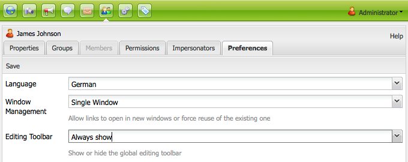

# Amministrazione utenti e sicurezza{#user-administration-and-security}

Questo capitolo descrive come configurare e mantenere l’autorizzazione degli utenti e descrive anche la teoria alla base del funzionamento dell’autenticazione e dell’autorizzazione in AEM.

## Utenti e gruppi in AEM {#users-and-groups-in-aem}

Questa sezione tratta più dettagliatamente le varie entità e i concetti correlati, per facilitare la configurazione di un concetto di gestione degli utenti di facile gestione.

### Utenti {#users}

Gli utenti accedono all’AEM con il proprio account. Ogni account utente è univoco e contiene i dettagli dell’account di base, insieme ai privilegi assegnati.

Gli utenti sono spesso membri di Gruppi, il che semplifica l’assegnazione di queste autorizzazioni e/o privilegi.

### Gruppi {#groups}

I gruppi sono insiemi di utenti, o altri gruppi, o entrambi. Queste raccolte sono tutte denominate Membri di un gruppo.

Il loro scopo principale è quello di semplificare il processo di manutenzione riducendo il numero di entità da aggiornare, in quanto una modifica apportata a un gruppo viene applicata a tutti i membri del gruppo. I gruppi spesso riflettono:

* un ruolo all’interno dell’applicazione, ad esempio qualcuno a cui è consentito navigare nel contenuto o qualcuno a cui è consentito contribuire con il contenuto.
* nella tua organizzazione; puoi estendere i ruoli per distinguere tra collaboratori di dipartimenti diversi quando sono limitati a rami diversi nella struttura del contenuto.

Pertanto, i gruppi tendono a rimanere stabili, mentre gli utenti vanno e vengono più frequentemente.

Con una pianificazione e una struttura pulita, l&#39;uso dei gruppi può riflettere la struttura, fornendo una panoramica chiara e un meccanismo efficiente per gli aggiornamenti.

### Utenti e gruppi incorporati {#built-in-users-and-groups}

WCM per AEM installa diversi utenti e gruppi. Queste raccolte vengono visualizzate al primo accesso alla console Sicurezza dopo l’installazione.

Le tabelle seguenti elencano ogni elemento insieme a:

* una breve descrizione
* eventuali raccomandazioni sulle modifiche necessarie

*Modificare tutte le password predefinite* (se non si elimina l&#39;account stesso in determinate circostanze).

<table>
 <tbody>
  <tr>
   <td>ID utente</td>
   <td>Tipo</td>
   <td>Descrizione</td>
   <td>Consiglio</td>
  </tr>
  <tr>
   <td>
admin
 
Password predefinita: admin
 </td>
   <td>User</td>
   <td>
Account di amministrazione del sistema con diritti di accesso completi.
 
Questo account viene utilizzato per la connessione tra AEM WCM e CRX.
 
Se elimini accidentalmente l’account, questo viene ricreato al riavvio dell’archivio (nell’impostazione predefinita).
 
L’account amministratore è un requisito della piattaforma AEM. Di conseguenza, questo account non può essere eliminato.
 </td>
   <td>
L'Adobe consiglia di modificare la password predefinita per questo account utente.
 
Preferibilmente durante l’installazione, anche se può essere eseguita in seguito.
 
Nota: non confondere questo account con l’account amministratore del Servlet Engine di CQ.
 </td>
  </tr>
  <tr>
   <td>
anonimo
 
 
 </td>
   <td>User</td>
   <td>
Contiene i diritti predefiniti per l’accesso non autenticato a un’istanza. Per impostazione predefinita, questo account dispone dei diritti di accesso minimi.
 
Se l'account viene eliminato accidentalmente, verrà ricreato all'avvio. Non può essere eliminato definitivamente, ma può essere disabilitato.
 </td>
   <td>Evita di eliminare o disabilitare questo account, in quanto influisce negativamente sul funzionamento delle istanze di authoring. Se esistono requisiti di sicurezza che richiedono di eliminarlo, assicurati di testare correttamente gli effetti che ha sui tuoi sistemi per primi.</td>
  </tr>
  <tr>
   <td>
author
 
Password predefinita: author
 </td>
   <td>User</td>
   <td>
Un account autore autorizzato a scrivere in /content. Comprende i privilegi dei collaboratori e degli utenti.
 
Può essere utilizzato come webmaster in quanto ha accesso all’intera struttura /content.
 
Questo account non è un utente predefinito, ma un altro utente demo di Geometrixx
 </td>
   <td>
L’Adobe consiglia di eliminare completamente l’account o di modificare la password predefinita.
 
Preferibilmente durante l’installazione, anche se può essere eseguita in seguito.
 </td>
  </tr>
  <tr>
   <td>amministratori</td>
   <td>Gruppo</td>
   <td>
Gruppo che concede diritti di amministratore a tutti i suoi membri. Solo l'amministratore può modificare questo gruppo.
 
Dispone di diritti di accesso completi.
 </td>
   <td>Anche se imposti un "nega a tutti" su un nodo, gli amministratori possono comunque accedere al nodo</td>
  </tr>
  <tr>
   <td>content-authors</td>
   <td>Gruppo</td>
   <td>
Gruppo responsabile della modifica dei contenuti. Richiede autorizzazioni di lettura, modifica, creazione ed eliminazione.
 </td>
   <td>Puoi creare gruppi di autori di contenuti personalizzati con diritti di accesso specifici per il progetto, purché tu aggiunga, modifichi, crei ed elimini le autorizzazioni di lettura.</td>
  </tr>
  <tr>
   <td>collaboratore</td>
   <td>Gruppo</td>
   <td>
Privilegi di base che consentono all’utente di scrivere contenuti (come in, solo i privilegi richiesti per la funzionalità di base).
 
Non alloca privilegi per l'accesso alla struttura /content. Questi devono essere assegnati in modo specifico per i singoli gruppi o utenti.
 </td>
   <td> </td>
  </tr>
  <tr>
   <td>dam-users</td>
   <td>Gruppo</td>
   <td>Gruppo di riferimento predefinito per un utente tipico di AEM Assets. I membri di questo gruppo dispongono dei privilegi appropriati per abilitare il caricamento e la condivisione di risorse e raccolte.</td>
   <td> </td>
  </tr>
  <tr>
   <td>tutti</td>
   <td>Gruppo</td>
   <td>
Ogni utente dell’AEM è membro del gruppo tutti, anche se potresti non vedere il gruppo o la relazione di appartenenza in tutti gli strumenti.
 
Questo gruppo può essere considerato come i diritti predefiniti in quanto può essere utilizzato per applicare le autorizzazioni per tutti, anche per gli utenti che verranno creati in futuro.
 </td>
   <td>
Non modificare o eliminare questo gruppo.
 
La modifica di questo account ha implicazioni di sicurezza aggiuntive.
 </td>
  </tr>
  <tr>
   <td>amministratori di tag</td>
   <td>Gruppo</td>
   <td>Gruppo autorizzato a modificare i tag.</td>
   <td> </td>
  </tr>
  <tr>
   <td>utenti-amministratori</td>
   <td>Gruppo</td>
   <td>Autorizza l’amministrazione degli utenti, ovvero il diritto di creare utenti e gruppi.</td>
   <td> </td>
  </tr>
  <tr>
   <td>workflow-editor</td>
   <td>Gruppo</td>
   <td>Gruppo autorizzato a creare e modificare modelli di flusso di lavoro.</td>
   <td> </td>
  </tr>
  <tr>
   <td>workflow-users</td>
   <td>Gruppo</td>
   <td>
Un utente che partecipa a un flusso di lavoro deve essere membro di un gruppo utenti del flusso di lavoro. Consente all’utente di accedere completamente a: /etc/workflow/instances per aggiornare l’istanza del flusso di lavoro.
 
Il gruppo è incluso nell’installazione standard, ma devi aggiungere manualmente gli utenti al gruppo.
 </td>
  </tr>
 </tbody>
</table>

## Autorizzazioni in AEM {#permissions-in-aem}

L’AEM utilizza gli ACL per determinare quali azioni un utente o un gruppo può intraprendere e dove può eseguire tali azioni.

### Autorizzazioni e ACL {#permissions-and-acls}

Le autorizzazioni definiscono chi può eseguire quali azioni su una risorsa. Le autorizzazioni sono il risultato di [valutazioni del controllo di accesso](#access-control-lists-and-how-they-are-evaluated).

Puoi modificare le autorizzazioni concesse/negate a un determinato utente selezionando o deselezionando le caselle di controllo per le singole [azioni](security.md#actions) dell&#39;AEM. Un segno di spunta indica che un&#39;azione è consentita. Nessun segno di spunta indica che un&#39;azione è negata.

La posizione del segno di spunta nella griglia indica anche le autorizzazioni di cui dispongono gli utenti in determinate posizioni all’interno di AEM (ovvero, quali percorsi).

### Azioni {#actions}

Le azioni possono essere eseguite su una pagina (risorsa). Per ogni pagina della gerarchia, puoi specificare l’azione che l’utente può eseguire su quella pagina. [Le autorizzazioni](#permissions-and-acls) ti consentono di consentire o negare un&#39;azione.

<table>
 <tbody>
  <tr>
   <td><strong>Azione </strong></td>
   <td><strong>Descrizione </strong></td>
  </tr>
  <tr>
   <td>Lettura</td>
   <td>L’utente è autorizzato a leggere la pagina e tutte le sue pagine figlie.</td>
  </tr>
  <tr>
   <td>Modifica</td>
   <td>
L’utente può:

    <ul>
     <li>modifica il contenuto esistente nella pagina e nelle pagine figlie.</li>
     <li>creare paragrafi sulla pagina o su qualsiasi pagina figlia.</li>
    </ul> 
A livello JCR, gli utenti possono modificare una risorsa modificandone le proprietà, il blocco, il controllo delle versioni, le non modifiche e dispongono di autorizzazioni di scrittura complete sui nodi che definiscono un nodo figlio jcr:content. Cq:Page, nt:file, cq:Asset.
 </td>
  </tr>
  <tr>
   <td>Creare</td>
   <td>
L’utente può:

    <ul>
     <li>creare una pagina o una pagina figlio.</li>
    </ul> 
Se <strong>modify</strong> viene negato, le sottostrutture sotto jcr:content vengono escluse perché la creazione di jcr:content e dei relativi nodi figlio viene considerata una modifica della pagina. Questa regola si applica solo ai nodi che definiscono un nodo figlio jcr:content.
 </td>
  </tr>
  <tr>
   <td>Elimina</td>
   <td>
L’utente può:

    <ul>
     <li>elimina i paragrafi esistenti dalla pagina o da qualsiasi pagina figlia.</li>
     <li>eliminare una pagina o una pagina figlio.</li>
    </ul> 
Se a <strong>modify</strong> viene negata l'autorizzazione, tutte le sottostrutture al di sotto di jcr:content vengono escluse in quanto la rimozione di jcr:content e dei relativi nodi figlio viene considerata una modifica della pagina. Questa regola si applica solo ai nodi che definiscono un nodo figlio jcr:content.
 </td>
  </tr>
  <tr>
   <td>Leggi ACL</td>
   <td>L’utente può leggere l’elenco di controllo di accesso della pagina o delle pagine figlie.</td>
  </tr>
  <tr>
   <td>Modifica ACL</td>
   <td>L’utente può modificare l’elenco di controllo di accesso della pagina o di qualsiasi pagina figlia.</td>
  </tr>
  <tr>
   <td>Replica</td>
   <td>L’utente può replicare i contenuti in un altro ambiente (ad esempio, l’ambiente Publish). Il privilegio viene applicato anche a tutte le pagine figlie.</td>
  </tr>
 </tbody>
</table>

>[!NOTE]
>
>AEM genera automaticamente gruppi di utenti per l&#39;assegnazione dei ruoli (Proprietario, Editor, Visualizzatore) in [Raccolte](/help/assets/manage-collections.md). Tuttavia, l’aggiunta manuale di ACL per tali gruppi può introdurre vulnerabilità di sicurezza all’interno dell’AEM. L’Adobe consiglia di evitare di aggiungere manualmente ACL.

### Elenchi di controllo di accesso e modalità di valutazione {#access-control-lists-and-how-they-are-evaluated}

WCM AEM utilizza gli elenchi di controllo di accesso (ACL, Access Control List) per organizzare le autorizzazioni applicate alle varie pagine.

Gli elenchi di controllo di accesso sono costituiti dalle singole autorizzazioni e vengono utilizzati per determinare l&#39;ordine in cui tali autorizzazioni vengono applicate. L’elenco è formato in base alla gerarchia delle pagine considerate. L’elenco viene quindi analizzato dal basso verso l’alto fino a quando non viene trovata la prima autorizzazione appropriata da applicare a una pagina.

>[!NOTE]
>
>Alcuni ACL sono inclusi negli esempi. Si consiglia di esaminare e determinare ciò che è appropriato per le applicazioni. Per esaminare gli ACL inclusi, passare a **CRXDE** e selezionare la scheda **Controllo di accesso** per i nodi seguenti:
>
>* `/etc/cloudservices`
>* `/home/users/we-retail`
>
>L’applicazione personalizzata può impostare l’accesso per altre relazioni, ad esempio:
>
>* `*/social/relationships/friend/*`
>* o `*/social/relationships/pending-following/*`.
>
>Quando si creano ACL specifici per le comunità, ai membri che si uniscono a tali comunità possono essere concesse autorizzazioni aggiuntive. Ad esempio, quando gli utenti si uniscono alle community in: `/content/we-retail/us/en/community`

### Stati di autorizzazione {#permission-states}

>[!NOTE]
>
>Per gli utenti di CQ 5.3:
>
>A differenza delle versioni precedenti di CQ, **create** e **delete** non devono più essere concessi se un utente deve solo modificare le pagine. Concedi invece l&#39;azione **modifica** solo se desideri che gli utenti possano creare, modificare o eliminare componenti nelle pagine esistenti.
>
>Per motivi di compatibilità con le versioni precedenti, i test per le azioni non prendono in considerazione il trattamento speciale dei nodi che definiscono **jcr:content**.

| **Azione** | **Descrizione** |
|---|---|
| Consenti (segno di spunta) | WCM per AEM consente all’utente di eseguire l’azione su questa pagina o su qualsiasi pagina secondaria. |
| Nega (nessun segno di spunta) | WCM per AEM non consente all’utente di eseguire l’azione su questa pagina o su alcuna pagina secondaria. |

Le autorizzazioni vengono applicate anche a tutte le pagine figlie.

Se un&#39;autorizzazione non viene ereditata dal nodo padre ma include almeno una voce locale, alla casella di controllo vengono aggiunti i simboli seguenti. Una voce locale viene creata nell’interfaccia di CRX 2.2 (attualmente è possibile creare ACL con caratteri jolly solo in CRX).

Per un&#39;azione in un determinato percorso:

<table>
 <tbody>
  <tr>
   <td>* (asterisco)</td>
   <td>Esiste almeno una voce locale (effettiva o non effettiva). Questi ACL con caratteri jolly sono definiti in CRX.</td>
  </tr>
  <tr>
   <td>! (punto esclamativo)</td>
   <td>Almeno una voce non ha attualmente alcun effetto.</td>
  </tr>
 </tbody>
</table>

Quando passi il cursore del mouse sull’asterisco o sul punto esclamativo, una descrizione comando fornisce ulteriori dettagli sulle voci dichiarate. La descrizione comando è divisa in due parti:

<table>
 <tbody>
  <tr>
   <td>Parte superiore</td>
   <td>
Elenca le voci effettive.
 </td>
  </tr>
  <tr>
   <td>Parte inferiore</td>
   <td>Elenca le voci non valide che possono avere effetto in un altro punto della struttura (come indicato da un attributo speciale presente con l'ACE corrispondente che limita l'ambito della voce). In alternativa, è una voce il cui effetto viene revocato da un'altra voce definita nel percorso specificato o in un nodo predecessore.</td>
  </tr>
 </tbody>
</table>

>[!NOTE]
>
>Se non sono definite autorizzazioni per una pagina, tutte le azioni sono negate.

Di seguito sono riportati alcuni consigli sulla gestione degli elenchi di controllo di accesso:

* Non assegnare autorizzazioni direttamente agli utenti. Assegnale solo ai gruppi.

  Questo semplifica la manutenzione, in quanto il numero di gruppi è molto inferiore al numero di utenti e anche meno volatile.

* Se desideri che un gruppo o un utente possa modificare solo le pagine, non concedere loro i diritti di creazione o negazione. Concedi loro solo i diritti di modifica e lettura.
* Utilizza Rifiuta con moderazione. Per quanto possibile utilizzare solo Consenti.

  L’utilizzo di nega può causare effetti imprevisti se le autorizzazioni vengono applicate in un ordine diverso da quello previsto. Se un utente è membro di più gruppi, le istruzioni Deny di un gruppo possono annullare l&#39;istruzione Allow di un altro gruppo o viceversa. È difficile avere una panoramica quando si verifica una situazione del genere e può facilmente portare a risultati imprevisti, mentre le assegnazioni consentite non causano tali conflitti.

  L&#39;Adobe consiglia di utilizzare Consenti anziché Nega per visualizzare [Best practice](#best-practices).

Prima di modificare una di queste autorizzazioni, accertati di comprendere come funzionano e come si relazionano tra loro. Consulta la documentazione di CRX che illustra il modo in cui AEM WCM [valuta i diritti di accesso](/help/sites-administering/user-group-ac-admin.md#how-access-rights-are-evaluated) ed esempi sulla configurazione degli elenchi di controllo di accesso.

### Autorizzazioni {#permissions}

Le autorizzazioni consentono a utenti e gruppi di accedere alle funzionalità AEM sulle pagine AEM.

Per sfogliare le autorizzazioni per percorso, espandi/comprimi i nodi e puoi tenere traccia dell’ereditarietà delle autorizzazioni fino al nodo principale.

Per consentire o negare le autorizzazioni, selezionare o deselezionare le caselle di controllo appropriate.

### Visualizzazione di informazioni dettagliate sulle autorizzazioni {#viewing-detailed-permission-information}

Insieme alla visualizzazione griglia, AEM fornisce una visualizzazione dettagliata delle autorizzazioni per un utente/gruppo selezionato in un determinato percorso. La vista Dettaglio fornisce informazioni aggiuntive.

Oltre a visualizzare le informazioni, è possibile includere o escludere l&#39;utente o il gruppo corrente da un gruppo. Consulta [Aggiunta di utenti o gruppi durante l&#39;aggiunta di autorizzazioni](#adding-users-or-groups-while-adding-permissions). Le modifiche apportate vengono immediatamente riportate nella parte superiore della vista dettagliata.

Per accedere alla visualizzazione Dettagli, nella scheda **Autorizzazioni**, fare clic su **Dettagli** per ogni gruppo/utente e percorso selezionato.

I dettagli sono suddivisi in due parti:

<table>
 <tbody>
  <tr>
   <td>Parte superiore</td>
   <td>
Ripete le informazioni visualizzate nella griglia della struttura. Per ogni azione, un’icona mostra se l’azione è consentita o negata:

    <ul>
     <li>nessuna icona = nessuna voce dichiarata</li>
     <li>(tick) = azione dichiarata (consenti)</li>
     <li>(-) = azione dichiarata (negazione)</li>
    </ul> </td>
  </tr>
  <tr>
   <td>Parte inferiore</td>
   <td>
Mostra la griglia di utenti e gruppi che esegue le operazioni seguenti:

    <ul>
     <li>Dichiara una voce per il percorso specificato E</li>
     <li>L’OR autorizzato è un gruppo</li>
    </ul> </td>
  </tr>
 </tbody>
</table>

### Rappresentazione di un altro utente {#impersonating-another-user}

Con la funzionalità [Impersona](/help/sites-authoring/user-properties.md#user-settings), un utente può lavorare per conto di un altro utente.

In altre parole, un account utente può specificare altri account che possono operare con il proprio account. Ad esempio, se l’utente B può rappresentare l’utente A, allora l’utente B può agire utilizzando i dettagli completi dell’account dell’utente A.

Questa funzionalità consente agli account di rappresentazione di completare le attività come se stessero utilizzando l’account che stanno impersonando. Ad esempio, durante un’assenza o per condividere un carico eccessivo a breve termine.

>[!NOTE]
>
>Affinché la rappresentazione funzioni per gli utenti non amministratori, la rappresentazione (nel caso precedente, user-B) deve disporre delle autorizzazioni di LETTURA nel percorso `/home/users`.
>
>Vedi [Autorizzazioni in AEM](/help/sites-administering/security.md#permissions-in-aem).

>[!CAUTION]
>
>Se un account ne rappresenta un altro, è difficile da vedere. Viene inserita una voce nel registro di controllo quando la rappresentazione inizia e termina, ma gli altri file di registro (come il registro di accesso) non contengono alcuna informazione che la rappresentazione si sia verificata sugli eventi. Pertanto, se l’utente B rappresenta l’utente A, tutti gli eventi sembrano essere stati eseguiti dall’utente A.

>[!CAUTION]
>
>Il blocco di pagina può essere eseguito quando si impersona un utente. Tuttavia, una pagina bloccata in questo modo può essere sbloccata solo come utente impersonato o come utente con privilegi di amministratore.
>
>Non è consentito sbloccare le pagine bloccate impersonando l’utente che le ha boccate.

### Best practice {#best-practices}

Di seguito sono descritte le best practice per l’utilizzo di autorizzazioni e privilegi:

| Regola | Motivo |
|--- |--- |
| *Usa gruppi* | Evita di assegnare i diritti di accesso utente per utente. Questo consiglio ha diverse ragioni:<ul><li>Poiché il numero di utenti è superiore a quello dei gruppi, la struttura dei gruppi risulta semplificata.</li><li>I gruppi forniscono una panoramica su tutti gli account.</li> <li>L’ereditarietà è più semplice con i gruppi.</li><li>Gli utenti vanno e vengono. I gruppi sono a lungo termine.</li></ul> |
| *Sii Positivo* | Utilizzare sempre le istruzioni Allow per specificare i diritti del gruppo, se possibile. Evita di utilizzare un’istruzione Deny. I gruppi vengono valutati in ordine e l’ordine può essere definito in modo diverso per utente. In altre parole: potresti avere poco controllo sull’ordine in cui le istruzioni vengono implementate e valutate. Se utilizzi solo le istruzioni Allow, l’ordine non ha importanza. |
| *Semplifica* | Vale la pena investire tempo e riflessioni nella configurazione di una nuova installazione. L&#39;applicazione di una struttura chiara semplifica la manutenzione e l&#39;amministrazione in corso, garantendo che sia i colleghi attuali che quelli futuri possano facilmente comprendere ciò che viene implementato. |
| *Test* | Utilizza un’installazione di test per esercitarti e assicurarti di comprendere le relazioni tra i vari utenti e gruppi. |
| *Utenti/Gruppi predefiniti* | Aggiorna sempre Utenti e gruppi predefiniti subito dopo l&#39;installazione per evitare problemi di sicurezza. |

## Gestione di utenti e gruppi {#managing-users-and-groups}

Gli utenti includono le persone che utilizzano il sistema e i sistemi stranieri che effettuano richieste al sistema.

Un gruppo è un insieme di utenti.

Entrambi possono essere configurati utilizzando la funzionalità User Administration nella Security Console.

### Accesso all’amministrazione degli utenti con la console Sicurezza {#accessing-user-administration-with-the-security-console}

Puoi accedere a tutti gli utenti, i gruppi e le autorizzazioni associate utilizzando la console Sicurezza. Tutte le procedure descritte in questa sezione vengono eseguite in questa finestra.

Per accedere alla protezione WCM AEM, effettuare una delle seguenti operazioni:

* Dalla schermata iniziale o da varie posizioni in AEM, fai clic sull’icona di sicurezza:

* Passa direttamente a `https://<server>:<port>/useradmin`. Accertati di accedere a AEM come amministratore.

Viene visualizzata la seguente finestra:

La struttura a sinistra elenca tutti gli utenti e i gruppi attualmente presenti nel sistema. È possibile selezionare le colonne da visualizzare, ordinare il contenuto delle colonne e persino modificare l&#39;ordine di visualizzazione trascinando l&#39;intestazione di colonna in una nuova posizione.

Le schede consentono di accedere a varie configurazioni:

<!-- ??? in table below. -->

| Linguetta | Descrizione |
|--- |--- |
| Casella filtro | Un meccanismo per filtrare gli utenti, i gruppi o entrambi elencati. Vedere [Filtraggio di utenti e gruppi](#filtering-users-and-groups). |
| Nascondi utenti | Un interruttore che nasconde tutti gli utenti elencati, lasciando solo i gruppi. Vedere [Nascondere utenti e gruppi](#hiding-users-and-groups). |
| Nascondi gruppi | Un interruttore che nasconde tutti i gruppi elencati, lasciando solo gli utenti. Vedere [Nascondere utenti e gruppi](#hiding-users-and-groups). |
| Modifica | Menu che consente di creare ed eliminare, nonché attivare e disattivare utenti o gruppi. Vedere [Creazione di utenti e gruppi](#creating-users-and-groups) e [Eliminazione di utenti e gruppi](#deleting-users-and-groups). |
| Proprietà | Elenca informazioni sull&#39;utente o sul gruppo che possono includere informazioni e-mail, una descrizione e informazioni sul nome. Consente inoltre di modificare la password di un utente. Consulta [Creazione di utenti e gruppi](#creating-users-and-groups), [Modifica delle proprietà di utenti e gruppi](#modifying-user-and-group-properties) e [Modifica della password utente](#changing-a-user-password). |
| Gruppi | Elenca tutti i gruppi a cui appartiene l&#39;utente o il gruppo selezionato. È possibile assegnare l&#39;utente o i gruppi selezionati a gruppi aggiuntivi o rimuoverli dai gruppi. Vedi [Gruppi](#adding-users-or-groups-to-a-group). |
| Membri | Disponibile solo per i gruppi. Elenca i membri di un determinato gruppo. Vedi [Membri](#members-adding-users-or-groups-to-a-group). |
| Autorizzazioni | Puoi allocare le autorizzazioni a un utente o a un gruppo. Consente di controllare quanto segue:<ul><li>Autorizzazioni relative a pagine/nodi specifici. Consulta [Impostazione delle autorizzazioni](#setting-permissions). </li><li>Autorizzazioni relative alla creazione e all&#39;eliminazione di pagine e alla modifica della gerarchia. ??? consente di [allocare privilegi](#settingprivileges), ad esempio la modifica della gerarchia, che consente di creare ed eliminare pagine.</li><li>Autorizzazioni relative a [privilegi di replica](#setting-replication-privileges) (in genere dall&#39;autore alla pubblicazione) in base a un percorso.</li></ul> |
| Impersonatori | Consente a un altro utente di rappresentare l’account. Utile quando hai bisogno che un utente agisca per conto di un altro utente. Vedi [Rappresentazione degli utenti](#impersonating-another-user). |
| Preferenze | Imposta [preferenze per il gruppo o l&#39;utente](#setting-user-and-group-preferences). Ad esempio, le preferenze di lingua. |

### Filtraggio di utenti e gruppi {#filtering-users-and-groups}

Per filtrare l’elenco, inserisci un’espressione di filtro che nasconde tutti gli utenti e i gruppi che non corrispondono all’espressione. È inoltre possibile nascondere utenti e gruppi utilizzando i pulsanti [Nascondi utente e Nascondi gruppo](#hiding-users-and-groups).

Per filtrare utenti o gruppi:

1. Nell&#39;elenco della struttura a sinistra digitare l&#39;espressione del filtro nello spazio disponibile. Se ad esempio si immette **admin**, verranno visualizzati tutti gli utenti e i gruppi contenenti questa stringa.
1. Fare clic sulla lente di ingrandimento per filtrare l&#39;elenco.

   

1. Fare clic su **x** per rimuovere tutti i filtri.

### Nascondere utenti e gruppi {#hiding-users-and-groups}

Nascondere utenti o gruppi è un altro modo per filtrare l’elenco di tutti gli utenti e i gruppi in un sistema. Sono disponibili due meccanismi di attivazione/disattivazione. Facendo clic su Nascondi utente, tutti gli utenti vengono nascosti e facendo clic su Nascondi gruppi tutti i gruppi vengono nascosti (non è possibile nascondere sia gli utenti che i gruppi contemporaneamente). Per filtrare l&#39;elenco utilizzando un&#39;espressione di filtro, vedere [Filtraggio di utenti e gruppi](#filtering-users-and-groups).

Per nascondere utenti e gruppi:

1. Nella console **Sicurezza**, fare clic su **Nascondi utenti** o **Nascondi gruppi**. Il pulsante selezionato appare evidenziato.

   

1. Per visualizzare di nuovo utenti o gruppi, fare nuovamente clic sul pulsante corrispondente.

### Creazione di utenti e gruppi {#creating-users-and-groups}

Per creare un utente o un gruppo:

1. Nell&#39;elenco dell&#39;albero della console **Sicurezza** fare clic su **Modifica** e quindi su **Crea utente** o **Crea gruppo**.

   

1. Immettere i dettagli richiesti, a seconda che si stia creando un utente o un gruppo.

   * Se si seleziona **Crea utente,** immettere l&#39;ID di accesso, il nome e il cognome, l&#39;indirizzo di posta elettronica e una password. Per impostazione predefinita, AEM crea un percorso basato sulla prima lettera del cognome, ma è possibile selezionare un altro percorso.

   

   * Se si seleziona **Crea gruppo**, immettere un ID gruppo e una descrizione facoltativa.

   

1. Fai clic su **Crea**. L&#39;utente o il gruppo creato viene visualizzato nell&#39;elenco della struttura.

### Eliminazione di utenti e gruppi {#deleting-users-and-groups}

Per eliminare un utente o un gruppo:

1. Nella console **Protezione**, selezionare l&#39;utente o il gruppo che si desidera eliminare. Se si desidera eliminare più elementi, premere Maiusc+clic o Ctrl+clic per selezionarli.
1. Fai clic su **Modifica,** quindi seleziona Elimina. In WCM per AEM viene richiesto se si desidera eliminare l&#39;utente o il gruppo.
1. Fai clic su **OK** per confermare o annullare.

### Modifica delle proprietà di utenti e gruppi {#modifying-user-and-group-properties}

Per modificare le proprietà di utenti e gruppi:

1. Nella console **Protezione** fare doppio clic sul nome dell&#39;utente o del gruppo che si desidera modificare.

1. Fai clic sulla scheda **Proprietà**, apporta le modifiche necessarie e fai clic su **Salva**.

   

>[!NOTE]
>
>Il percorso dell’utente viene visualizzato nella parte inferiore delle proprietà dell’utente. Non può essere modificato.

### Modifica della password utente {#changing-a-user-password}

Per modificare la password di un utente, attenersi alla procedura descritta di seguito.

>[!NOTE]
>
>Non è possibile utilizzare la console Sicurezza per modificare la password amministratore. Per modificare la password per l&#39;account amministratore, utilizzare la console [Utenti](/help/sites-administering/granite-user-group-admin.md#changing-the-password-for-an-existing-user) fornita da Granite Operations.
>
>Se utilizzi AEM Forms su JEE, non utilizzare le istruzioni di seguito per modificare la password e utilizza invece AEM Forms su JEE Admin Console (/adminui) per modificare la password.

1. Nella console **Protezione** fare doppio clic sul nome utente per il quale si desidera modificare la password.
1. Fare clic sulla scheda **Proprietà** (se non è già attiva).
1. Fare clic su **Imposta password**. Viene visualizzata la finestra Imposta password, in cui è possibile modificare la password.

   

1. Immettere la nuova password due volte; poiché non vengono visualizzate in testo non crittografato, questa azione è da confermare; se non corrispondono, il sistema visualizza un errore.
1. Fare clic su **Imposta** per attivare la nuova password per l&#39;account.

### Aggiunta di utenti o gruppi a un gruppo {#adding-users-or-groups-to-a-group}

L’AEM offre tre modi diversi per aggiungere utenti o gruppi a un gruppo esistente:

* All&#39;interno del gruppo è possibile aggiungere membri (utenti o gruppi).
* Quando si è membri, è possibile aggiungere membri ai gruppi.
* Quando si lavora sulle autorizzazioni, è possibile aggiungere membri ai gruppi.

### Gruppi - Aggiunta di utenti o gruppi a un gruppo {#groups-adding-users-or-groups-to-a-group}

La scheda **Gruppi** mostra a quali gruppi appartiene l&#39;account corrente. Puoi utilizzarlo per aggiungere l’account selezionato a un gruppo:

1. Fare doppio clic sul nome dell&#39;account (utente o gruppo) da assegnare a un gruppo.
1. Fare clic sulla scheda **Gruppi**. Viene visualizzato un elenco di gruppi a cui appartiene già l’account.
1. Nell&#39;elenco della struttura fare clic sul nome del gruppo a cui si desidera aggiungere l&#39;account e trascinarlo nel riquadro **Gruppi**. Se si desidera aggiungere più utenti, fare clic su tali nomi tenendo premuto Maiusc o Ctrl e trascinarli.

   

1. Fai clic su **Salva** per salvare le modifiche.

### Membri: aggiunta di utenti o gruppi a un gruppo {#members-adding-users-or-groups-to-a-group}

La scheda **Membri** funziona solo per i gruppi e mostra quali utenti e gruppi appartengono al gruppo corrente. Puoi utilizzarlo per aggiungere account a un gruppo:

1. Fare doppio clic sul nome del gruppo al quale si desidera aggiungere membri.
1. Fare clic sulla scheda **Membri**. Viene visualizzato un elenco di membri che appartengono già a questo gruppo.
1. Nell&#39;elenco della struttura fare clic sul nome del membro che si desidera aggiungere al gruppo e trascinarlo nel riquadro **Membri**. Se si desidera aggiungere più utenti, fare clic su tali nomi tenendo premuto Maiusc o Ctrl e trascinarli.

   

1. Fai clic su **Salva** per salvare le modifiche.

### Aggiunta di utenti o gruppi durante l’aggiunta di autorizzazioni {#adding-users-or-groups-while-adding-permissions}

Per aggiungere membri a un gruppo in un determinato percorso:

1. Fare doppio clic sul nome del gruppo o dell&#39;utente a cui si desidera aggiungere gli utenti.

1. Fare clic sulla scheda **Autorizzazioni**.

1. Passare al percorso a cui si desidera aggiungere le autorizzazioni e fare clic su **Dettagli**. Nella parte inferiore della finestra dei dettagli vengono fornite informazioni su chi dispone delle autorizzazioni per tale pagina.

   

1. Selezionare la casella di controllo nella colonna **Membro** per i membri per i quali si desidera disporre delle autorizzazioni per tale percorso. Deselezionare la casella di controllo relativa al membro per il quale si desidera rimuovere le autorizzazioni. Nella cella modificata verrà visualizzato un triangolo rosso.
1. Fai clic su **OK** per salvare le modifiche.

### Rimozione di utenti o gruppi dai gruppi {#removing-users-or-groups-from-groups}

L’AEM offre tre modi diversi per rimuovere utenti o gruppi da un gruppo:

* Nel profilo del gruppo è possibile rimuovere membri (utenti o gruppi).
* Nel profilo membro è possibile rimuovere membri dai gruppi.
* Quando si lavora su Autorizzazioni, è possibile rimuovere i membri dai gruppi.

### Gruppi - Rimozione di utenti o gruppi dai gruppi {#groups-removing-users-or-groups-from-groups}

Per rimuovere un account utente o di gruppo da un gruppo:

1. Fare doppio clic sul nome del gruppo o dell&#39;account utente che si desidera rimuovere da un gruppo.
1. Fare clic sulla scheda **Gruppi**. Puoi vedere a quali gruppi appartiene l’account selezionato.
1. Nel riquadro **Gruppi** fare clic sul nome dell&#39;utente o del gruppo che si desidera rimuovere dal gruppo e quindi su **Rimuovi**. Se si desidera rimuovere più account, fare clic tenendo premuto Maiusc o Ctrl e fare clic su tali nomi e quindi su **Rimuovi**.

   

1. Fai clic su **Salva** per salvare le modifiche.

### Membri: rimozione di utenti o gruppi dai gruppi {#members-removing-users-or-groups-from-groups}

Per rimuovere account da un gruppo:

1. Fare doppio clic sul nome del gruppo da cui si desidera rimuovere i membri.
1. Fare clic sulla scheda **Membri**. Viene visualizzato un elenco di membri che appartengono già a questo gruppo.
1. Nel riquadro **Membri** fare clic sul nome del membro che si desidera rimuovere dal gruppo e quindi su **Rimuovi**. Se si desidera rimuovere più utenti, fare clic tenendo premuto Maiusc o Ctrl e fare clic su tali nomi e quindi su **Rimuovi**.

   

1. Fai clic su **Salva** per salvare le modifiche.

### Rimozione di utenti o gruppi durante l’aggiunta di autorizzazioni {#removing-users-or-groups-while-adding-permissions}

Per rimuovere membri da un gruppo in un determinato percorso:

1. Fare doppio clic sul nome del gruppo o dell&#39;utente da cui si desidera rimuovere gli utenti.

1. Fare clic sulla scheda **Autorizzazioni**.

1. Passare al percorso a cui si desidera rimuovere le autorizzazioni e fare clic su **Dettagli**. Nella parte inferiore della finestra dei dettagli vengono fornite informazioni su chi dispone delle autorizzazioni per tale pagina.

   

1. Selezionare la casella di controllo nella colonna **Membro** per i membri per i quali si desidera disporre delle autorizzazioni per tale percorso. Deselezionare la casella di controllo relativa al membro per il quale si desidera rimuovere le autorizzazioni. Nella cella modificata verrà visualizzato un triangolo rosso.
1. Fai clic su **OK** per salvare le modifiche.

### Sincronizzazione utente {#user-synchronization}

Quando la distribuzione è una [farm di pubblicazione](/help/sites-deploying/recommended-deploys.md#tarmk-farm), gli utenti e i gruppi devono essere sincronizzati tra tutti i nodi di pubblicazione.

Per informazioni sulla sincronizzazione degli utenti e su come attivarla, vedere [Sincronizzazione degli utenti](/help/sites-administering/sync.md).

## Gestione delle autorizzazioni {#managing-permissions}

>[!NOTE]
>
>Adobe ha introdotto una nuova visualizzazione principale basata sull’interfaccia utente touch per la gestione delle autorizzazioni. Per ulteriori dettagli su come utilizzarla, vedere [Visualizzazione entità per la gestione delle autorizzazioni](/help/sites-administering/touch-ui-principal-view.md).

Questa sezione descrive come impostare le autorizzazioni, inclusi i privilegi di replica.

### Impostazione delle autorizzazioni {#setting-permissions}

Le autorizzazioni consentono agli utenti di eseguire determinate azioni sulle risorse in determinati percorsi. Include inoltre la possibilità di creare o eliminare pagine.

Per aggiungere, modificare o eliminare le autorizzazioni:

1. Nella console **Protezione** fare doppio clic sul nome dell&#39;utente o del gruppo per cui si desidera impostare le autorizzazioni oppure [cercare i nodi](#searching-for-nodes).

1. Fare clic sulla scheda **Autorizzazioni**.

   

1. Nella griglia della struttura selezionare una casella di controllo per consentire all&#39;utente o al gruppo selezionato di eseguire un&#39;azione oppure deselezionare una casella di controllo per negare all&#39;utente o al gruppo selezionato di eseguire un&#39;azione. Per ulteriori informazioni, fare clic su **Dettagli**.

1. Al termine, fare clic su **Salva**.

### Impostazione dei privilegi di replica {#setting-replication-privileges}

Il privilegio di replica è il diritto di pubblicare il contenuto e può essere impostato per gruppi e utenti.

>[!NOTE]
>
>* Tutti i diritti di replica applicati a un gruppo vengono applicati a tutti gli utenti del gruppo.
>* I privilegi di replica di un utente sostituiscono quelli di un gruppo.
>* I diritti di replica Consenti hanno una precedenza maggiore rispetto ai diritti di replica Nega. Per ulteriori informazioni, vedere [Autorizzazioni in AEM](#permissions-in-aem).
>

Per impostare i privilegi di replica:

1. Selezionare l&#39;utente o il gruppo dall&#39;elenco, fare doppio clic per aprire e fare clic su **Autorizzazioni**.
1. Nella griglia passare al percorso in cui si desidera che l&#39;utente disponga dei privilegi di replica oppure [cercare i nodi.](#searching-for-nodes)

1. Nella colonna **Replica** nel percorso selezionato selezionare una casella di controllo per aggiungere il privilegio di replica per l&#39;utente o il gruppo oppure deselezionare la casella di controllo per rimuovere il privilegio di replica. AEM visualizza un triangolo rosso in tutti i punti in cui sono state apportate modifiche non ancora salvate.

   

1. Fai clic su **Salva** per salvare le modifiche.

### Ricerca di nodi {#searching-for-nodes}

Quando aggiungi o rimuovi le autorizzazioni, puoi sfogliare o cercare il nodo.

Esistono due diversi tipi di ricerca dei percorsi:

* Ricerca nel percorso: se la stringa di ricerca inizia con &quot;/&quot;, cerca i sottonodi diretti del percorso specificato:

Nella casella di ricerca è possibile effettuare le seguenti operazioni:

| Azione | Effetto |
|--- |--- |
| Freccia destra | Seleziona un sottonodo nel risultato della ricerca |
| Freccia giù | Riavvia la ricerca. |
| Immetti (Invio) chiave | Seleziona un sottonodo e lo carica nella griglia della struttura |

* Ricerca full-text: se la stringa di ricerca non inizia con &quot;/&quot;, viene eseguita una ricerca full-text su tutti i nodi nel percorso &quot;/content&quot;.

Per eseguire una ricerca su percorsi o full-text:

1. Nella console Sicurezza selezionare un utente o un gruppo, quindi fare clic sulla scheda **Autorizzazioni**.

1. Nella casella Cerca immettere un termine da cercare.

### Rappresentazione degli utenti {#impersonating-users}

Puoi specificare uno o più utenti che possono rappresentare l’utente corrente. Grazie a questa funzionalità, è possibile cambiare le impostazioni dell&#39;account con quelle dell&#39;utente corrente e agire per conto di quest&#39;ultimo.

Utilizza questa funzione con cautela in quanto potrebbe consentire agli utenti di eseguire azioni che il loro utente non può eseguire. Quando si impersona un utente, gli utenti vengono avvisati che non sono connessi come se stessi.

Esistono diversi scenari in cui potrebbe essere utile utilizzare questa funzionalità, tra cui:

* Se sei fuori sede, puoi lasciare che un’altra persona ti rappresenti mentre sei fuori sede. Utilizzando questa funzione, puoi assicurarti che qualcuno disponga dei tuoi diritti di accesso e che non sia necessario modificare un profilo utente o fornire la tua password.
* Puoi utilizzarlo a scopo di debug. Ad esempio, per vedere come il sito Web cerca un utente con diritti di accesso limitati. Inoltre, se un utente si lamenta di problemi tecnici, puoi impersonarlo per diagnosticare e risolvere il problema.

Per rappresentare un utente esistente:

1. Nell&#39;elenco della struttura, selezionare il nome della persona a cui si desidera assegnare altri utenti per la rappresentazione. Fare doppio clic per aprire.
1. Fare clic sulla scheda **Impersonatori**.
1. Fare clic sull&#39;utente che si desidera rappresentare l&#39;utente selezionato. Trascina l’utente (il/la impersonatore) dall’elenco al riquadro Impersona. Il nome viene visualizzato nell&#39;elenco.

   

1. Fai clic su **Salva**.

### Impostazione delle preferenze di utenti e gruppi {#setting-user-and-group-preferences}

Per impostare le preferenze di utenti e gruppi, incluse quelle relative alla lingua, alla gestione delle finestre e alla barra degli strumenti:

1. Selezionare l&#39;utente o il gruppo di cui si desidera modificare le preferenze nella struttura a sinistra. Per selezionare più utenti o gruppi, fare clic sulle selezioni tenendo premuto Ctrl o Maiusc.
1. Fare clic sulla scheda **Preferenze**.

   

1. Apporta le modifiche necessarie alle preferenze del gruppo o dell&#39;utente e al termine fai clic su **Salva**.

### Impostazione di utenti o amministratori che dispongono del privilegio per gestire altri utenti {#setting-users-or-administrators-to-have-the-privilege-to-manage-other-users}

Per impostare gli utenti o gli amministratori in modo che dispongano dei privilegi per eliminare, attivare e disattivare altri utenti:

1. Aggiungere al gruppo di amministratori l&#39;utente a cui si desidera assegnare i privilegi per gestire altri utenti e salvare le modifiche.

   

1. Nella scheda **Autorizzazioni** dell&#39;utente, passa a &quot;/&quot; e nella colonna Replica seleziona la casella di controllo per consentire la replica in &quot;/&quot; e fai clic su **Salva**.

   

   L&#39;utente selezionato può disattivare, attivare, eliminare e creare gli utenti.

### Estensione dei privilegi a livello di progetto {#extending-privileges-on-a-project-level}

Se si prevede di implementare privilegi specifici per l&#39;applicazione, le informazioni seguenti descrivono ciò che è necessario sapere per implementare un privilegio personalizzato e come applicarlo in CQ:

Il privilegio di modifica della gerarchia è coperto da una combinazione di privilegi jcr. Il privilegio di replica è denominato **crx:replicate** che viene archiviato/valutato insieme ad altri privilegi nell&#39;archivio JCR. Tuttavia, non viene applicato a livello di JCR.

La definizione e la registrazione dei privilegi personalizzati fa ufficialmente parte dell&#39;[API Jackrabbit](https://jackrabbit.apache.org/oak/docs/security/privilege.html) a partire dalla versione 2.4 (vedere anche [JCR-2887](https://issues.apache.org/jira/browse/JCR-2887)). L&#39;ulteriore utilizzo è coperto dalla gestione del controllo di accesso JCR come definito da [JSR 283](https://jcp.org/en/jsr/detail?id=283) (sezione 16). Inoltre, l’API Jackrabbit definisce un paio di estensioni.

Il meccanismo di registrazione dei privilegi si riflette nell&#39;interfaccia utente in **Configurazione archivio**.

La registrazione di nuovi privilegi (personalizzati) è a sua volta protetta da un privilegio incorporato che deve essere concesso a livello di archivio. In JCR: passando &quot;null&quot; come parametro &quot;absPath&quot; nell’api ac mgt, vedi jsr 333 per i dettagli. Per impostazione predefinita, **admin** e tutti i membri degli amministratori dispongono di tale privilegio.

>[!NOTE]
>
>L’implementazione si occupa di convalidare e valutare i privilegi personalizzati, ma non può applicarli a meno che non siano aggregati di privilegi incorporati.
