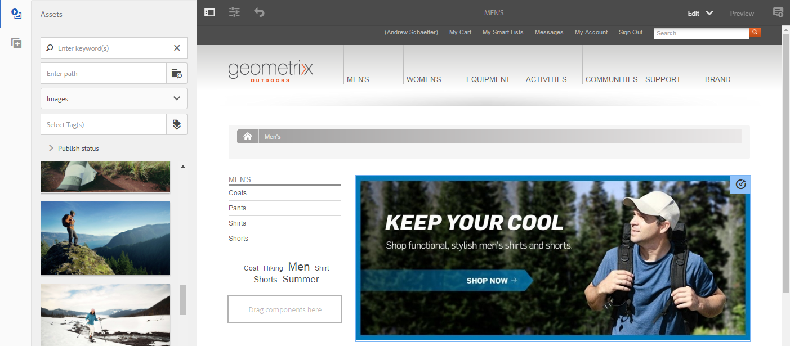

# Configurazione della segmentazione con ContextHub{#configuring-segmentation-with-contexthub}

>[!NOTE]
>
>Questa sezione descrive la configurazione della segmentazione quando si utilizza ContextHub. Se utilizzi la funzionalità ClientContext, consulta la documentazione pertinente per [configurazione della segmentazione per il contesto client](/help/sites-administering/campaign-segmentation.md).

La segmentazione è un concetto chiave per la creazione di una campagna. Vedi [Gestione dei tipi di pubblico](/help/sites-authoring/managing-audiences.md) per informazioni sul funzionamento della segmentazione e sui termini chiave.

A seconda delle informazioni che hai già raccolto sui visitatori del tuo sito e degli obiettivi che desideri raggiungere, dovrai definire i segmenti e le strategie necessarie per i contenuti di destinazione.

Questi segmenti verranno poi utilizzati per fornire al visitatore i contenuti di destinazione più pertinenti. Questo contenuto viene mantenuto nel [Personalizzazione](/help/sites-authoring/personalization.md) sezione del sito web. Le [Attività](/help/sites-authoring/activitylib.md) qui definite possono essere incluse in qualsiasi pagina e definiscono a quale segmento visitatore è applicabile il contenuto specifico.

AEM ti consente di personalizzare facilmente l’esperienza degli utenti. Consente inoltre di verificare i risultati delle tue definizioni dei segmenti.

## Accesso ai segmenti {#accessing-segments}

La [Tipi di pubblico](/help/sites-authoring/managing-audiences.md) viene utilizzata per gestire i segmenti per ContextHub o Client Context, nonché i tipi di pubblico per il tuo account Adobe Target. La presente documentazione riguarda la gestione dei segmenti per ContextHub. Per [Segmenti di contesto client](/help/sites-administering/campaign-segmentation.md) e i segmenti Adobe Target, consulta la documentazione pertinente.

Per accedere ai segmenti devi selezionare la configurazione. Nella navigazione globale seleziona **Navigazione > Personalizzazione > Pubblico**. Verranno visualizzate le configurazioni disponibili:


Seleziona la configurazione per visualizzare i segmenti, ad esempio Sito WKND:


## Editor segmento {#segment-editor}

L’**Editor segmento** consente di modificare facilmente un segmento. Per modificare un segmento, seleziona un segmento nel [elenco dei segmenti](/help/sites-administering/segmentation.md#accessing-segments) e fai clic su **Modifica** pulsante .


Tramite il browser Componenti puoi aggiungere i contenitori **AND** e **OR** per definire la logica del segmento. In seguito puoi aggiungere altri componenti per confrontare proprietà e valori o script di riferimento e altri segmenti per definire i criteri di selezione (consulta [Creazione di un nuovo segmento](#creating-a-new-segment)) per definire lo scenario esatto per la selezione del segmento.

Quando l’intera istruzione restituisce “True”, significa che il segmento è stato risolto. Nel caso in cui siano applicabili più segmenti, viene utilizzato anche il fattore **Incremento**. Vedi [Creazione di un nuovo segmento](#creating-a-new-segment) per informazioni dettagliate sul [fattore di incremento.](/help/sites-administering/campaign-segmentation.md#boost-factor)

>[!CAUTION]
>
>L’editor segmento non verifica la presenza di riferimenti circolari. Ad esempio, il segmento A fa riferimento a un altro segmento B, che a sua volta fa riferimento al segmento A. È necessario assicurarsi che i segmenti non contengano riferimenti circolari.

### Contenitori {#containers}

I seguenti contenitori sono predefiniti e consentono di raggruppare confronti e riferimenti per la valutazione boolean. Possono essere trascinati dal browser Componenti all’editor. Per ulteriori informazioni, consulta la sezione seguente [Utilizzo dei contenitori AND e OR](/help/sites-administering/segmentation.md#using-and-and-or-containers).

<table>
 <tbody>
  <tr>
   <td>Contenitore AND<br /> </td>
   <td>Operatore AND boolean<br /> </td>
  </tr>
  <tr>
   <td>Contenitore OR<br /> </td>
   <td>Operatore OR boolean</td>
  </tr>
 </tbody>
</table>

### Confronti {#comparisons}

Per valutare le proprietà dei segmenti sono disponibili i seguenti confronti di segmenti predefiniti. Possono essere trascinati dal browser Componenti all’editor.

<table>
 <tbody>
  <tr>
   <td>Property-Value (Proprietà-Valore)<br /> </td>
   <td>Confronta una proprietà di un archivio con un valore definito<br /> </td>
  </tr>
  <tr>
   <td>Property-Property (Proprietà-Proprietà)</td>
   <td>Confronta una proprietà di un archivio con un’altra proprietà<br /> </td>
  </tr>
  <tr>
   <td>Riferimento Property-Segment (Proprietà-Segmento)</td>
   <td>Confronta una proprietà di un archivio con un altro segmento di riferimento<br /> </td>
  </tr>
  <tr>
   <td>Riferimento Property-Script (Proprietà-Script)</td>
   <td>Confronta una proprietà di un archivio con i risultati di uno script<br /> </td>
  </tr>
  <tr>
   <td>Segment Reference-Script Reference (Riferimento segmento-Riferimento script)</td>
   <td>Confronta un segmento di riferimento ai risultati di uno script<br /> </td>
  </tr>
 </tbody>
</table>

>[!NOTE]
>
>Quando si confrontano i valori, se il tipo di dati del confronto non è impostato (cioè è impostato sul rilevamento automatico), il motore di segmentazione di ContextHub si limiterà a confrontare i valori allo stesso modo di javascript. Non effettua l’assegnazione dei valori ai tipi previsti, il che può portare a risultati fuorvianti. Esempio:
>
>`null < 30 // will return true`
>
>Pertanto quando procedi alla [creazione di un segmento](/help/sites-administering/segmentation.md#creating-a-new-segment) devi selezionare un **tipo di dati** ogni volta che sono noti i tipi di valori confrontati. Esempio:
>
>Quando confronti la proprietà `profile/age`, sai già che il tipo confrontato sarà un **numero**, perciò anche se `profile/age` non è impostato, un confronto `profile/age` minore di 30 restituirà **False (Falso)**, come è logico.

### Riferimenti {#references}

Sono disponibili i seguenti riferimenti predefiniti per eseguire un collegamento diretto a uno script o a un altro segmento. Possono essere trascinati dal browser Componenti all’editor.

<table>
 <tbody>
  <tr>
   <td>Riferimento segmento<br /> </td>
   <td>Valuta il segmento di riferimento</td>
  </tr>
  <tr>
   <td>Riferimento script</td>
   <td>Valuta lo script di riferimento. Per ulteriori informazioni, consulta la sezione seguente <a href="/help/sites-administering/segmentation.md#using-script-references">Utilizzo di riferimenti a script</a>.</td>
  </tr>
 </tbody>
</table>

## Creazione di un nuovo segmento {#creating-a-new-segment}

Per definire il nuovo segmento:

1. Dopo [accesso ai segmenti](/help/sites-administering/segmentation.md#accessing-segments), [passa alla cartella](#organizing-segments) dove desideri creare il segmento.

1. tocca o fai clic sul pulsante Crea e seleziona **Creare un segmento ContextHub**.

   

1. In **Nuovo segmento ContextHub**, inserisci un titolo per il segmento e se necessario un valore di incremento, quindi tocca o fai clic su **Crea**.

   

   Ogni segmento ha un parametro di incremento utilizzato come fattore di ponderazione. Un valore più elevato determina la selezione del segmento, preferendolo a un segmento con un valore inferiore nelle istanze in cui sono validi più segmenti.

   * Valore minimo: `0`
   * Valore massimo: `1000000`

1. Trascina un confronto o un riferimento nell’editor segmento per visualizzarlo nel contenitore AND predefinito.
1. Tocca o fai doppio clic sull’opzione di configurazione del nuovo riferimento o segmento per modificarne i parametri specifici. In questo esempio, stiamo testando le persone a San Jose.

   

   Imposta sempre un **Tipo di dati** se possibile, per garantire che i confronti siano valutati correttamente. Per ulteriori informazioni, consulta [Confronti](/help/sites-administering/segmentation.md#comparisons).

1. Fai clic su **OK** per salvare la definizione:
1. Aggiungi altri componenti in base alle esigenze. Puoi formulare espressioni boolean utilizzando i componenti contenitore per i confronti AND e OR (vedi di seguito [Utilizzo dei contenitori AND e OR](/help/sites-administering/segmentation.md#using-and-and-or-containers)). Con l’editor segmento è possibile eliminare i componenti non più necessari o trascinarli in nuove posizioni all’interno dell’istruzione.

### Utilizzo dei contenitori AND e OR {#using-and-and-or-containers}

Utilizzando i componenti contenitore AND e OR, puoi costruire segmenti complessi in AEM. Questa operazione richiede di tenere presenti alcuni punti fondamentali:

* Il livello principale della definizione è sempre il contenitore AND creato inizialmente. Questo non può essere modificato, ma non ha effetti sul resto della definizione del segmento.
* Assicurati che la nidificazione del contenitore abbia una logica. I contenitori possono essere visualizzati come parentesi dell’espressione boolean.

L’esempio seguente viene utilizzato per selezionare i visitatori considerati nel nostro gruppo di prime pagine:

Maschio e tra i 30 e i 59 anni

OPPURE

Femmina e tra i 30 e i 59 anni

Per iniziare, inserisci un componente contenitore OR all’interno del contenitore AND predefinito. All’interno del contenitore OR, aggiungi due contenitori AND e all’interno di entrambi puoi aggiungere la proprietà o i componenti di riferimento.


### Utilizzo di riferimenti a script {#using-script-references}

Utilizzando il componente Riferimento script, è possibile delegare la valutazione di una proprietà di segmento a uno script esterno. Una volta configurato correttamente lo script, può essere utilizzato come qualsiasi altro componente di una condizione di segmento.

#### Definizione di uno script a cui fare riferimento {#defining-a-script-to-reference}

1. Aggiungi file alla libreria client `contexthub.segment-engine.scripts`.
1. Implementa una funzione che restituisca un valore. Esempio:

   ```
   ContextHub.console.log(ContextHub.Shared.timestamp(), '[loading] contexthub.segment-engine.scripts - script.profile-info.js');
   
   (function() {
       'use strict';
   
       /**
        * Sample script returning profile information. Returns user info if data is available, false otherwise.
        *
        * @returns {Boolean}
        */
       var getProfileInfo = function() {
           /* let the SegmentEngine know when script should be re-run */
           this.dependOn(ContextHub.SegmentEngine.Property('profile/age'));
           this.dependOn(ContextHub.SegmentEngine.Property('profile/givenName'));
   
           /* variables */
           var name = ContextHub.get('profile/givenName');
           var age = ContextHub.get('profile/age');
   
           return name === 'Joe' && age === 123;
       };
   
       /* register function */
       ContextHub.SegmentEngine.ScriptManager.register('getProfileInfo', getProfileInfo);
   
   })();
   ```

1. Registra lo script con `ContextHub.SegmentEngine.ScriptManager.register`.

Se lo script dipende da proprietà aggiuntive, lo script deve chiamare `this.dependOn()`. Ad esempio, se lo script dipende da `profile/age`:

```
this.dependOn(ContextHub.SegmentEngine.Property('profile/age'));
```

#### Riferimento a uno script {#referencing-a-script}

1. Crea un segmento ContextHub.
1. Aggiungi il componente **Riferimento script** nella posizione desiderata del segmento.
1. Apri la finestra di dialogo di modifica del componente **Riferimento script**. Se [configurato correttamente](/help/sites-administering/segmentation.md#defining-a-script-to-reference), lo script deve essere disponibile nell’elenco a discesa **Nome script**.

## Organizzazione dei segmenti {#organizing-segments}

Se disponi di molti segmenti, la gestione in un elenco semplice può essere complicata. In questi casi, può essere utile creare alcune cartelle per gestire i tuoi segmenti.

### Crea una nuova cartella,  {#create-folder}

1. Dopo aver effettuato [l’accesso ai segmenti](#accessing-segments), tocca o fai clic sul pulsante **Crea** e seleziona **Cartella**.

   

1. Specifica il **titolo** e il **nome** da assegnare alla cartella.
   * Il **titolo** deve essere descrittivo.
   * Il **nome** diventerà il nome del nodo nell’archivio.
      * Viene generato automaticamente dal titolo, secondo le [convenzioni di denominazione di AEM.](/help/sites-developing/naming-conventions.md)
      * Se necessario è possibile modificarlo.

   

1. Tocca o fai clic su **Crea**.

   

1. La cartella verrà visualizzata nell’elenco dei segmenti.
   * L’ordinamento delle colonne incide sulla posizione di visualizzazione della nuova cartella nell’elenco.
   * Per regolare l’ordinamento, tocca o fai clic sulle intestazioni di colonna.
      

### Modificare le cartelle esistenti {#modify-folders}

1. Dopo aver effettuato [l’accesso ai segmenti](#accessing-segments), tocca o fai clic sulla cartella da modificare per selezionarla.

   

1. Per rinominare la cartella, tocca o fai clic su **Rinomina** nella barra degli strumenti.

1. Specifica un nuovo **Titolo cartella** e tocca o fai clic su **Salva**.

   

>[!NOTE]
>
>Quando rinomini una cartella, è possibile modificare solo il titolo. Il nome non può essere modificato.

### Eliminare una cartella

1. Dopo aver effettuato [l’accesso ai segmenti](#accessing-segments), tocca o fai clic sulla cartella da modificare per selezionarla.

   

1. Per eliminare la cartella, tocca o fai clic su **Elimina** nella barra degli strumenti.

1. Una finestra di dialogo riporta un elenco di cartelle selezionate per l’eliminazione.

   

   * Tocca o fai clic su **Elimina** per confermare.
   * Tocca o fai clic su **Annulla** per interrompere.

1. Se una delle cartelle selezionate contiene sottocartelle o segmenti, devi confermarne l’eliminazione.

   

   * Tocca o fai clic su **Forza eliminazione** per confermare.
   * Tocca o fai clic su **Annulla** per interrompere.

>[!NOTE]
>
>Non è possibile spostare un segmento da una cartella all’altra.

## Test dell’applicazione di un segmento {#testing-the-application-of-a-segment}

Una volta definito il segmento, è possibile testare i risultati potenziali con l’ausilio di **[ContextHub](/help/sites-authoring/ch-previewing.md).**

1. Visualizza l’anteprima di una pagina
1. Fai clic sull’icona ContextHub per visualizzare la barra degli strumenti di ContextHub
1. Seleziona un utente che corrisponda al segmento creato
1. ContextHub risolverà i segmenti applicabili per l’utente tipo selezionato

Ad esempio, la nostra definizione di segmento semplice per identificare gli utenti nel nostro gruppo di prima età è una definizione di segmento semplice basata sull’età e sul genere dell’utente. Il caricamento di un utente tipo specifico che corrisponde a tali criteri mostra se il segmento è stato risolto correttamente:


Oppure, se non è risolto:


>[!NOTE]
>
>Tutte le caratteristiche vengono risolte immediatamente, anche se la maggior parte si modifica solamente quando la pagina viene ricaricata.

Tali test possono essere eseguiti anche sulle pagine di contenuto e in combinazione con contenuti mirati e **Attività** ed **Esperienze** correlate.

Se hai impostato un’attività e un’esperienza utilizzando l’esempio di segmento del gruppo di prime pagine riportato sopra, puoi facilmente testare il segmento con l’attività. Per informazioni dettagliate sulla configurazione di un’attività, consulta la relativa [documentazione sull’authoring di contenuti di destinazione](/help/sites-authoring/content-targeting-touch.md).

1. In modalità di modifica di una pagina in cui hai impostato il contenuto di destinazione, è possibile vedere che il contenuto è indirizzato tramite l’icona a forma di freccia su di esso.

   

1. Passa alla modalità anteprima e utilizza ContextHub, passa a un utente tipo che non corrisponde alla segmentazione configurata per l’esperienza.

   

1. Passa a un utente tipo che non corrisponde alla segmentazione configurata per l’esperienza e osserva che l’esperienza cambia di conseguenza.

   

## Utilizzo del segmento {#using-your-segment}

I segmenti vengono utilizzati per gestire il contenuto effettivo visualizzato da tipi di pubblico specifici. Consulta [Gestione dei tipi di pubblico](/help/sites-authoring/managing-audiences.md) per ulteriori informazioni su tipi di pubblico e di segmenti e [Authoring di contenuti di destinazione](/help/sites-authoring/content-targeting-touch.md) per informazioni sull’utilizzo di tipi di pubblico e di segmenti per eseguire il targeting del contenuto.
