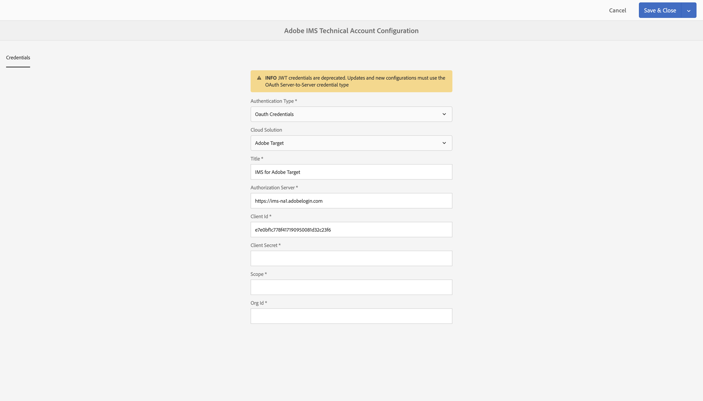

# Configurazione delle integrazioni IMS per l’AEM {#setting-up-ims-integrations-for-aem}

>[!NOTE]
>
>[Adobe Developer Console](https://developer.adobe.com/console) viene utilizzato per generare credenziali che consentano l’accesso a varie API. È possibile scegliere tra vari tipi di credenziali, da server a server OAuth ad applicazione a pagina singola. Uno di questi tipi di credenziali, le credenziali dell’account di servizio (JWT), è stato dichiarato obsoleto a favore delle credenziali server-to-server OAuth con Service Pack 20. È possibile eseguire il back port di questa modifica nei Service Pack precedenti, a partire da Service Pack 11 fino a Service Pack 20 con l&#39;utilizzo di un hotfix che è possibile scaricare [qui](https://experience.adobe.com/#/downloads/content/software-distribution/en/aem.html?package=/content/software-distribution/en/details.html/content/dam/aem/public/adobe/packages/cq650/hotfix/ims-jwt-compatibility-package-6.5-1.0.zip).

Adobe Experience Manager (AEM) può essere integrato con molte altre soluzioni Adobi. Ad esempio, Adobe Target, Adobe Analytics e altre.

Le integrazioni utilizzano un’integrazione IMS, configurata con OAuth S2S.

* Dopo aver creato:

   * [Credenziali in Developer Console](#credentials-in-the-developer-console)

* Quindi puoi:

   * Creare una (nuova) [Configurazione OAuth](#creating-oauth-configuration)

   * [Migrare una configurazione JWT esistente a una configurazione OAuth](#migrating-existing-JWT-configuration-to-oauth)

>[!CAUTION]
>
>In precedenza, le configurazioni venivano effettuate con [Credenziali JWT che ora sono obsolete in Adobe Developer Console](/help/sites-administering/jwt-credentials-deprecation-in-adobe-developer-console.md).
>
>Tali configurazioni non possono più essere create o aggiornate, ma è possibile eseguirne la migrazione alle configurazioni OAuth.

## Credenziali in Developer Console {#credentials-in-the-developer-console}

Come primo passaggio, devi configurare le credenziali OAuth in Adobe Developer Console.

Per informazioni dettagliate su come eseguire questa operazione, consulta la documentazione di Developer Console, a seconda dei requisiti:

* Panoramica:

   * [Autenticazione da server a server](https://developer.adobe.com/developer-console/docs/guides/authentication/ServerToServerAuthentication/)

* Creazione di nuove credenziali OAuth:

   * [Guida all’implementazione delle credenziali da server a server OAuth](https://developer.adobe.com/developer-console/docs/guides/authentication/ServerToServerAuthentication/implementation/)

* Migrazione di una credenziale JWT esistente a una credenziale OAuth:

   * [Migrazione dalle credenziali dell’account di servizio (JWT) alle credenziali da server a server OAuth](https://developer.adobe.com/developer-console/docs/guides/authentication/ServerToServerAuthentication/migration/)

Ad esempio:

## Creazione di una configurazione OAuth {#creating-oauth-configuration}

Per creare una nuova integrazione Adobe IMS utilizzando OAuth:

1. In AEM, passa a **Strumenti**, **Sicurezza**, **Integrazione Adobe IMS**.

1. Seleziona **Crea**.

1. Completa la configurazione in base ai dettagli di [Developer Console](https://developer.adobe.com/developer-console/docs/guides/authentication/ServerToServerAuthentication/implementation/). Ad esempio:

   

1. **Salva** le modifiche.

## Migrazione di una configurazione JWT esistente a una configurazione OAuth {#migrating-existing-JWT-configuration-to-oauth}

Per migrare un’integrazione Adobe IMS esistente basata sulle credenziali JWT:

>[!NOTE]
>
>Questo esempio mostra una configurazione di lancio di IMS.

1. In AEM, passa a **Strumenti**, **Sicurezza**, **Integrazione Adobe IMS**.

1. Seleziona la configurazione JWT di cui eseguire la migrazione. Le configurazioni JWT sono contrassegnate dall’avvertenza **Credenziali JWT (obsolete)**.

1. Seleziona **Proprietà**.

   

1. La configurazione verrà aperta in sola lettura:

   

1. Seleziona **OAuth** dall’elenco a discesa **Tipo di autenticazione**:

   

1. Le proprietà disponibili verranno aggiornate. Utilizza i dettagli da Developer Console per completarli:

   

1. Utilizza **Salva e chiudi** per mantenere gli aggiornamenti.
Quando ritorni alla console, l’avvertenza **Credenziali JWT (obsolete)** non sarà più visibile.