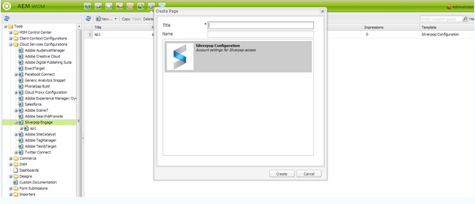

# Integrazione con Silverpop Engage{#integrating-with-silverpop-engage}

<!-- THIS ENTIRE TOPIC APPEARS OBSOLETE BECAUSE SILVERPOP NO LONGER EXISTS AND THERE ARE NO REDIRECTS FOR THE DOWNLOAD URL BELOW THAT IS 404.
>[!NOTE]
>
>Silverpop integration is **not** available out of the box. Download the Silverpop integration package `https://www.adobeaemcloud.com/content/marketplace/marketplaceProxy.html?packagePath=/content/companies/public/adobe/packages/aem620/product/cq-mcm-integrations-silverpop-content` from Package Share and install it on your instance. After you have installed the package, you can configure it as described in this document. -->

L’integrazione dell’AEM con Silverpop Engage consente di gestire e inviare le e-mail create nell’AEM tramite Silverpop. Consente inoltre di utilizzare le funzioni di gestione dei lead di Silverpop tramite i moduli AEM sulle pagine AEM.

L’integrazione offre le seguenti funzioni:

* Possibilità di creare e-mail in AEM e pubblicarle su Silverpop per la distribuzione.
* Possibilità di impostare l&#39;azione di un modulo AEM per creare un abbonato Silverpop.

Dopo aver configurato Silverpop Engage, è possibile pubblicare newsletter o e-mail in Silverpop Engage.

## Creazione di una configurazione Silverpop {#creating-a-silverpop-configuration}

Le configurazioni Silverpop possono essere aggiunte tramite **Cloud Service**, **Strumenti** o **endpoint API**. Tutti i metodi sono descritti in questa sezione.

### Configurazione di Silverpop tramite Cloud Service {#configuring-silverpop-via-cloudservices}

Per creare una configurazione Silverpop in Cloud Service:

1. In AEM, fai clic su **Strumenti** > **Distribuzione** > **Cloud Service**. (Oppure accedere direttamente a `https://<hostname>:<port>/etc/cloudservices.html`.)
1. In Servizi di terze parti fare clic su **Coinvolgimento Silverop** e quindi su **Configura**. Viene visualizzata la finestra di configurazione Silverpop.

   >[!NOTE]
   >
   >Silverpop Engage non è disponibile come opzione nei servizi di terze parti, a meno che non si scarichi il pacchetto da Condivisione pacchetti.

1. Inserisci un titolo e, facoltativamente, un nome e fai clic su **Crea**. Viene visualizzata la finestra di configurazione **&#x200B; Impostazioni Silverpop**.
1. Immetti il nome utente e la password, quindi seleziona un endpoint API dall’elenco a discesa.
1. Fare clic su **Connetti a Silverpop.** Una volta stabilita la connessione, verrà visualizzata una finestra di dialogo di successo. Fare clic su **OK** per uscire dalla finestra. Per passare a Silverpop, fare clic su **Vai a Silverpop Engage**.
1. Silverpop configurato. Puoi modificare la configurazione facendo clic su **Modifica**.
1. Inoltre, il framework Silverpop Engage può essere configurato per azioni personalizzate fornendo titolo e nome (facoltativo). Fare clic su Crea per creare il framework per la connessione Silverpop già configurata.

   Le colonne di estensione dei dati importati possono essere utilizzate in seguito tramite il componente AEM **Text e Personalization**.

### Configurazione di Silverpop tramite Strumenti {#configuring-silverpop-via-tools}

Per creare una configurazione Silverpop in Strumenti:

1. In AEM, fai clic su **Strumenti** > **Distribuzione** > **Cloud Service**. Oppure accedi direttamente a `https://<hostname>:<port>/misadmin#/etc`.
1. Seleziona **Strumenti**, quindi **Configurazioni Cloud Service,** e infine **Coinvolgimento Silverpop**.
1. Fare clic su **Nuovo**.

   

1. Nella finestra **Crea pagina**, immetti **Titolo** e facoltativamente **Nome**, quindi fai clic su **Crea**.
1. Immettere le informazioni di configurazione come descritto al punto 4 della procedura precedente. Seguire questa procedura per completare la configurazione di Silverpop.

### Aggiunta di più configurazioni {#adding-multiple-configurations}

Per aggiungere più configurazioni:

1. Nella pagina di benvenuto, fai clic su **Cloud Service** e poi su **Coinvolgimento Silverpop**. Fare clic sul pulsante **Mostra configurazioni** che viene visualizzato se sono disponibili una o più configurazioni Silverpop. Sono elencate tutte le configurazioni disponibili.
1. Fai clic sul segno **+** accanto a Configurazioni disponibili. Apre la finestra **Crea configurazioni**. Segui la procedura di configurazione precedente per creare una configurazione.

### Configurazione degli endpoint API per la connessione a Silverpop {#configuring-api-end-points-for-connecting-to-silverpop}

Attualmente, l&#39;AEM ha sei endpoint non sicuri (Engage 1 - 6). Silverpop ora fornisce due nuovi punti finali e punti finali di connessione modificati per quelli esistenti.

Per configurare gli endpoint API:

1. Vai a `/libs/mcm/silverpop/components/silverpoppage/dialog/items/general/items/apiendpoint/options node` il `https://<hostname>:<port>/crxde.`
1. Fai clic con il pulsante destro del mouse e seleziona **Crea**, quindi **Crea nodo**.
1. Immetti **Nome** come `sp-e0` e scegli **Tipo** come `cq:Widget`.
1. Aggiungi due proprietà al nuovo nodo aggiunto:

   1. **Nome**: `text`, **Tipo**: `String`, **Valore**: `Engage 0`
   1. **Nome**: `value`, **Tipo**: `String`, **Valore**: `https://api0.silverpop.com`

   

   Fare clic su Salva tutto.

1. Crea un altro nodo con **Nome** come `sp-e7` e **Tipo** come `cq:Widget`.

   Aggiungi due proprietà al nuovo nodo aggiunto:

   1. **Nome**: `text`, **Tipo**: `String`, **Valore**: `Pilot`
   1. **Nome**: `value`, **Tipo**: `String`, **Valore**: `https://apipilot.silverpop.com/XMLAPI`

1. Per modificare gli endpoint API esistenti (Coinvolgi 1 - 6), fai clic su ciascuno di essi uno per uno e sostituisci i valori come segue:

   | **Nome nodo** | **Valore endpoint esistente** | **Nuovo valore endpoint** |
   |---|---|---|
   | sp-e1 | `https://api.engage1.silverpop.com/XMLAPI` | `https://api1.silverpop.com` |
   | sp-e2 | `https://api.engage2.silverpop.com/XMLAPI` | `https://api2.silverpop.com` |
   | sp-e3 | `https://api.engage3.silverpop.com/XMLAPI` | `https://api3.silverpop.com` |
   | sp-e4 | `https://api.engage4.silverpop.com/XMLAPI` | `https://api4.silverpop.com` |
   | sp-e5 | `https://api.engage5.silverpop.com/XMLAPI` | `https://api5.silverpop.com` |
   | sp-e6 | `https://api.pilot.silverpop.com/XMLAPI` | `https://api6.silverpop.com` |

1. Fare clic su **Salva tutto**. L&#39;AEM è ora pronto a connettersi a Silverpop tramite endpoint protetti.

   
