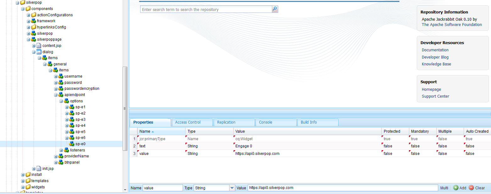

# Integrazione con Silverpop Engage{#integrating-with-silverpop-engage}

>[!NOTE]
>
>L&#39;integrazione di Silverpop è **non** disponibile fuori dalla casella. È necessario scaricare il [pacchetto di integrazione Silverpop](https://www.adobeaemcloud.com/content/marketplace/marketplaceProxy.html?packagePath=/content/companies/public/adobe/packages/aem620/product/cq-mcm-integrations-silverpop-content) da Package Share e installarlo nell&#39;istanza. Dopo aver installato il pacchetto, potete configurarlo come descritto in questo documento.

L&#39;integrazione AEM con Silverpop Engage consente di gestire e inviare e-mail create in AEM tramite Silverpop. Consente inoltre di utilizzare le funzioni di gestione dei lead di Silverpop tramite AEM moduli su AEM pagine.

L&#39;integrazione offre le seguenti funzionalità:

* La possibilità di creare e AEM e pubblicarli su Silverpop per la distribuzione.
* Possibilità di impostare l&#39;azione di un modulo AEM per creare un utente con sottoscrizione Silverpop.

Una volta configurato Silverpop Engage, potete pubblicare newsletter o e-mail su Silverpop Engage.

## Creazione di una configurazione Silverpop {#creating-a-silverpop-configuration}

Le configurazioni Silverpop possono essere aggiunte tramite **Cloudservices**, **Tools** o **Punti finali API**. Tutti i metodi sono descritti in questa sezione.

### Configurazione di Silverpop tramite Cloudservices {#configuring-silverpop-via-cloudservices}

Per creare una configurazione Silverpop negli Cloud Services:

1. In AEM, toccate o fate clic su **Strumenti** > **Distribuzione** > **Cloud Services**. (oppure accedere direttamente a `https://<hostname>:<port>/etc/cloudservices.html`.)
1. In Servizi di terze parti, fare clic su **Coinvolgimento Silverop**, quindi su **Configura**. Viene visualizzata la finestra di configurazione Silverpop.

   >[!NOTE]
   >
   >Silverpop Engage non è disponibile come opzione in servizi di terze parti a meno che non scaricate il pacchetto da Package Share.

1. Immettete un titolo ed eventualmente un nome e fate clic su **Crea**. Viene visualizzata la finestra di configurazione** Silverpop Settings**.
1. Immettete nome utente e password e selezionate un endpoint API dall&#39;elenco a discesa.
1. Fate clic su **Connetti a Silverpop.** Una volta stabilita la connessione, viene visualizzata una finestra di dialogo di successo. Fare clic su **OK** per uscire dalla finestra. Per accedere a Silverpop, fai clic su **Vai a Coinvolgimento Silverpop**.
1. Silverpop è stato configurato. È possibile modificare la configurazione facendo clic su **Modifica**.
1. Inoltre, il framework di coinvolgimento Silverpop può essere configurato per azioni personalizzate fornendo titolo e nome (facoltativo). Fate clic su Crea per creare correttamente il framework per la connessione Silverpop già configurata.

   Le colonne di estensione dei dati importate possono essere utilizzate in seguito tramite il componente AEM: **Testo e personalizzazione**.

### Configurazione di Silverpop tramite gli strumenti {#configuring-silverpop-via-tools}

Per creare una configurazione Silverpop in Strumenti:

1. In AEM, toccate o fate clic su **Strumenti** > **Distribuzione** > **Cloud Services**. Oppure andate direttamente a `https://<hostname>:<port>/misadmin#/etc`.
1. Selezionare **Strumenti**, quindi **Configurazioni Cloud Services,** quindi **Coinvolgimento Silverpop**.
1. Fai clic su **Nuovo** per aprire la finestra **Crea pagina**.

   

1. Immettere il **Titolo** e facoltativamente il **Nome**, quindi fare clic su **Crea**.
1. Immettete le informazioni di configurazione come indicato al punto 4 della procedura precedente. Seguite questa procedura per completare la configurazione di Silverpop.

### Aggiunta di configurazioni multiple {#adding-multiple-configurations}

Per aggiungere più configurazioni:

1. Nella pagina di benvenuto, fate clic su **Cloud Services** e fate clic su **Coinvolgimento Silverpop**. Fate clic sul pulsante **Mostra configurazioni** che viene visualizzato se sono disponibili una o più configurazioni Silverpop. Vengono elencate tutte le configurazioni disponibili.
1. Fare clic sul segno **+** accanto alle configurazioni disponibili. Si apre la finestra **Crea configurazioni**. Seguite la procedura di configurazione precedente per creare una nuova configurazione.

### Configurazione dei punti finali dell&#39;API per la connessione a Silverpop {#configuring-api-end-points-for-connecting-to-silverpop}

Attualmente, AEM ha sei punti finali non protetti (da 1 a 6). Silverpop offre ora due nuovi punti finali e due punti finali di connessione modificati per quelli esistenti.

Per configurare i punti finali dell&#39;API:

1. Vai a `/libs/mcm/silverpop/components/silverpoppage/dialog/items/general/items/apiendpoint/options node` il `https://<hostname>:<port>/crxde.`
1. Fare clic con il pulsante destro del mouse e selezionare **Crea**, quindi **Crea nodo**.
1. Immettete il **Nome** come `sp-e0` e scegliete **Tipo** come `cq:Widget`.
1. Aggiungi due proprietà al nodo appena aggiunto:

   1. **Nome**:  `text`,  **Tipo**:  `String`,  **Valore**:  `Engage 0`
   1. **Nome**:  `value`,  **Tipo**:  `String`,  **Valore**:  `https://api0.silverpop.com`

   

   Fare clic sul pulsante &quot;Salva tutto&quot;.

1. Create un altro nodo con **Name** come `sp-e7` e **Type** come `cq:Widget`.

   Aggiungi due proprietà al nodo appena aggiunto:

   1. **Nome**:  `text`,  **Tipo**:  `String`,  **Valore**:  `Pilot`
   1. **Nome**:  `value`,  **Tipo**:  `String`,  **Valore**:  `https://apipilot.silverpop.com/XMLAPI`

1. Per modificare i punti finali dell&#39;API (Coinvolgi da 1 a 6), fai clic su ciascuno di essi uno per uno e sostituisci i valori come segue:

   | **Nome nodo** | **Valore punto finale esistente** | **Nuovo valore del punto finale** |
   |---|---|---|
   | sp-e1 | https://api.engage1.silverpop.com/XMLAPI | https://api1.silverpop.com |
   | sp-e2 | https://api.engage2.silverpop.com/XMLAPI | https://api2.silverpop.com |
   | sp-e3 | https://api.engage3.silverpop.com/XMLAPI | https://api3.silverpop.com |
   | sp-e4 | https://api.engage4.silverpop.com/XMLAPI | https://api4.silverpop.com |
   | sp-e5 | https://api.engage5.silverpop.com/XMLAPI | https://api5.silverpop.com |
   | sp-e6 | https://api.pilot.silverpop.com/XMLAPI | https://api6.silverpop.com |

1. Fare clic su **Salva tutto**. AEM è ora pronto per collegarsi a Silverpop oltre i punti finali protetti.

   

