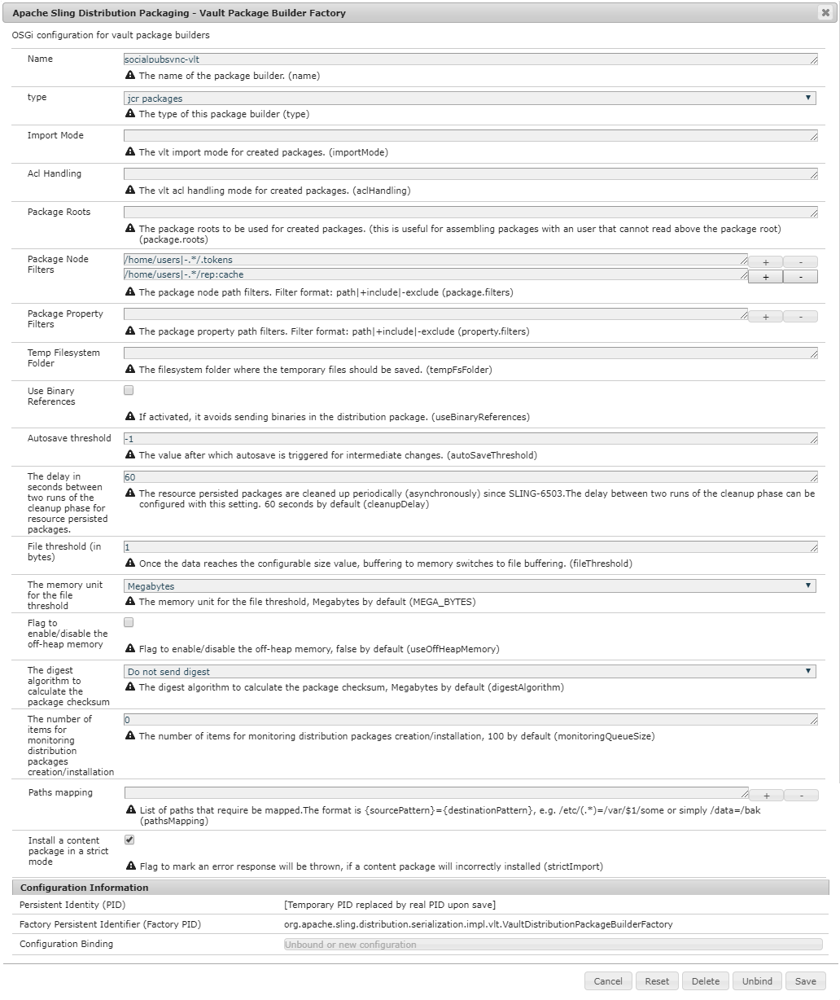

# Sincronizzazione utente{#user-synchronization}

## Introduzione {#introduction}

Quando la distribuzione è una [farm di pubblicazione](/help/sites-deploying/recommended-deploys.md#tarmk-farm), i membri devono essere in grado di accedere e visualizzare i propri dati su qualsiasi nodo di pubblicazione.

Gli utenti e i gruppi di utenti (dati utente) creati nell’ambiente di pubblicazione non sono necessari nell’ambiente di authoring.

La maggior parte dei dati utente creati nell’ambiente di authoring ha lo scopo di rimanere nell’ambiente di authoring e non essere copiati nelle istanze di pubblicazione.

La registrazione e le modifiche apportate a un’istanza di pubblicazione devono essere sincronizzate con altre istanze di pubblicazione per consentire loro di accedere agli stessi dati utente.

A partire da AEM 6.1, quando la sincronizzazione utente è abilitata, i dati utente vengono sincronizzati automaticamente tra le istanze di pubblicazione nella farm e non vengono creati sull’autore.

## Distribuzione Sling {#sling-distribution}

I dati utente, insieme ai loro [ACL](/help/sites-administering/security.md), sono memorizzati in [Oak Core](/help/sites-deploying/platform.md), il livello sotto Oak JCR, e sono accessibili utilizzando l&#39;API [Oak](https://helpx.adobe.com/experience-manager/6-5/sites/developing/using/reference-materials/javadoc/org/apache/jackrabbit/oak/api/package-tree.html). Con aggiornamenti non frequenti, è ragionevole che i dati utente siano sincronizzati con altre istanze di pubblicazione utilizzando [Sling Content Distribution](https://github.com/apache/sling/blob/trunk/contrib/extensions/distribution/README.md) (distribuzione Sling).

I vantaggi della sincronizzazione utente tramite la distribuzione Sling, rispetto alla replica tradizionale, sono i seguenti:

* *utenti*,  *profili utente* e  *raggruppamenti utente* creati al momento della pubblicazione non vengono creati sull&#39;autore

* La distribuzione Sling imposta le proprietà negli eventi jcr, consentendo di agire all&#39;interno dei listener di eventi lato pubblicazione senza preoccuparsi di cicli di replica infiniti
* La distribuzione Sling invia solo i dati utente alle istanze di pubblicazione non originarie, eliminando il traffico non necessario
* [](/help/sites-administering/security.md) ACLsset nel nodo utente sono inclusi nella sincronizzazione

>[!NOTE]
>
>Se sono necessarie sessioni, si consiglia di utilizzare una soluzione SSO o una sessione appiccicosa e chiedere ai clienti di effettuare l&#39;accesso se passano a un altro editore.

>[!CAUTION]
>
>La sincronizzazione del gruppo ***Administrators*** non è supportata, anche quando la sincronizzazione utente è abilitata. Al contrario, un errore di &quot;importazione del diff&quot; verrà registrato nel registro degli errori.
>
>Pertanto, quando la distribuzione è una farm di pubblicazione, se un utente viene aggiunto o rimosso dal gruppo ***amministratori** , la modifica deve essere eseguita manualmente su ogni istanza di pubblicazione.

## Abilita sincronizzazione utente {#enable-user-sync}

>[!NOTE]
>
>Per impostazione predefinita, la sincronizzazione utente è `disabled`.
>
>L&#39;abilitazione della sincronizzazione utente comporta la modifica delle configurazioni *esistenti* OSGi.
>
>Non è necessario aggiungere nuove configurazioni per abilitare la sincronizzazione utente.

La sincronizzazione utente si basa sull’ambiente di authoring per gestire le distribuzioni dei dati utente, anche se i dati utente non vengono creati sull’autore. Molte, ma non tutte, della configurazione avviene nell’ambiente di authoring e ogni passaggio indica chiaramente se deve essere eseguito sull’autore o sulla pubblicazione.

Di seguito sono riportati i passaggi necessari per abilitare la sincronizzazione utente, seguiti da una sezione [Risoluzione dei problemi](#troubleshooting) :

### Prerequisiti {#prerequisites}

1. Se utenti e gruppi di utenti sono già stati creati su un editore, si consiglia di [sincronizzare manualmente](#manually-syncing-users-and-user-groups) i dati utente a tutti gli editori prima di configurare e abilitare la sincronizzazione utente.

Una volta abilitata la sincronizzazione utente, vengono sincronizzati solo gli utenti e i gruppi appena creati.

1. Verifica che sia stato installato il codice più recente:

* [Aggiornamenti AEM piattaforma](https://experienceleague.adobe.com/docs/experience-manager-release-information/aem-release-updates/aem-releases-updates.html?lang=it)
* [Aggiornamenti AEM Communities](/help/communities/deploy-communities.md#latestfeaturepack)

### 1. Agente di distribuzione Apache Sling - Fabbrica agenti di sincronizzazione {#apache-sling-distribution-agent-sync-agents-factory}

**Abilita sincronizzazione utente**

* **sull&#39;autore**

   * accesso con privilegi di amministratore
   * accedere alla [console Web](/help/sites-deploying/configuring-osgi.md)

      * ad esempio, [https://localhost:4502/system/console/configMgr](https://localhost:4502/system/console/configMgr)
   * individua `Apache Sling Distribution Agent - Sync Agents Factory`

      * seleziona la configurazione esistente da aprire per la modifica (icona a forma di matita)
Verifica `name`: **`socialpubsync`**

      * seleziona la casella di controllo `Enabled`
      * select `Save`


### 2. Creare un utente autorizzato {#createauthuser}

**Configura**
autorizzazioniQuesto utente autorizzato verrà utilizzato nel passaggio 3 per configurare la distribuzione Sling sull&#39;autore.

* **su ogni istanza di pubblicazione**

   * accesso con privilegi di amministratore
   * accedere alla [console di sicurezza](/help/sites-administering/security.md)

      * ad esempio, [https://localhost:4503/useradmin](https://localhost:4503/useradmin)
   * creare un nuovo utente

      * ad esempio, `usersync-admin`
   * aggiungi questo utente al gruppo di utenti **`administrators`**
   * [aggiungi ACL per questo utente a /home](#howtoaddacl)

      * `Allow jcr:all` con restrizione  `rep:glob=*/activities/*`


>[!CAUTION]
>
>È necessario creare un nuovo utente.
>
>* L&#39;utente predefinito assegnato è **`admin`**.
>* Non utilizzare `communities-user-admin user.`

>


#### Come aggiungere ACL {#addacls}

* CRXDE Lite di accesso

   * ad esempio, [https://localhost:4503/crx/de](https://localhost:4503/crx/de)

* seleziona il nodo `/home`
* nel riquadro a destra, seleziona la scheda `Access Control`
* seleziona il pulsante `+` per aggiungere una voce ACL

   * **Principale**:  *cerca utente creato per la sincronizzazione utente*
   * **Tipo**: `Allow`
   * **Privilegi**:  `jcr:all`
   * **** Restrictionsrep:glob:  `*/activities/*`
   * selezionare **OK**

* seleziona **Salva tutto**


Consulta anche

* [Accesso alla gestione dei diritti](/help/sites-administering/user-group-ac-admin.md#access-right-management)
* Sezione Risoluzione dei problemi [Modifica eccezione di operazione durante l&#39;elaborazione della risposta](#modify-operation-exception-during-response-processing).

### 3. Distribuzione Granite Adobe - Provider segreto di trasporto password crittografata {#adobegraniteencpasswrd}

**Configurare le autorizzazioni**

Una volta creato un utente autorizzato, membro del gruppo di utenti **`administrators`**su tutte le istanze di pubblicazione, tale utente autorizzato deve essere identificato sull&#39;autore come avente l&#39;autorizzazione per sincronizzare i dati utente dall&#39;autore alla pubblicazione.

* **sull&#39;autore**

   * accesso con privilegi di amministratore
   * accedere alla [console Web](/help/sites-deploying/configuring-osgi.md)

      * ad esempio, [https://localhost:4502/system/console/configMgr](https://localhost:4502/system/console/configMgr)
   * individua `com.adobe.granite.distribution.core.impl.CryptoDistributionTransportSecretProvider.name`
   * seleziona la configurazione esistente da aprire per la modifica (icona a forma di matita)
Verifica `property name`: **`socialpubsync-publishUser`**

   * imposta il nome utente e la password per l&#39; [utente autorizzato](#createauthuser) creato al momento della pubblicazione nel passaggio 2

      * ad esempio, `usersync-admin`


### 4. Agente di distribuzione Apache Sling - Fabbrica agenti coda {#apache-sling-distribution-agent-queue-agents-factory}

**Abilita sincronizzazione utente**

* **al momento della pubblicazione**:

   * accesso con privilegi di amministratore
   * accedere alla [console Web](/help/sites-deploying/configuring-osgi.md)

      * ad esempio, [https://localhost:4503/system/console/configMgr](https://localhost:4503/system/console/configMgr)
   * individua `Apache Sling Distribution Agent - Queue Agents Factory`

      * seleziona la configurazione esistente da aprire per la modifica (icona a forma di matita)
Verifica `Name`: `socialpubsync-reverse`

      * seleziona la casella di controllo `Enabled`
      * seleziona `Save`
   * **ripetere **per ogni istanza di pubblicazione


### 5. Adobe Social Sync - Diff Observer Factory {#diffobserver}

**Abilita sincronizzazione gruppo**

* **su ogni istanza** di pubblicazione:

   * accesso con privilegi di amministratore
   * accedere alla [console Web](/help/sites-deploying/configuring-osgi.md)

      * ad esempio, [https://localhost:4503/system/console/configMgr](https://localhost:4503/system/console/configMgr)
   * individua **`Adobe Social Sync - Diff Observer Factory`**

      * seleziona la configurazione esistente da aprire per la modifica (icona a forma di matita)

         Verifica `agent name`: `socialpubsync-reverse`

      * seleziona la casella di controllo `Enabled`
      * seleziona `Save`


### 6. Trigger di distribuzione Apache Sling - Factory dei trigger programmati {#apache-sling-distribution-trigger-scheduled-triggers-factory}

**(Facoltativo) modificare l&#39;intervallo di polling**

Per impostazione predefinita, l’autore esegue il polling delle modifiche ogni 30 secondi. Per modificare questo intervallo:

* **sull&#39;autore**

   * accesso con privilegi di amministratore
   * accedere alla [console Web](/help/sites-deploying/configuring-osgi.md)

      * ad esempio, [https://localhost:4502/system/console/configMgr](https://localhost:4502/system/console/configMgr)
   * individua `Apache Sling Distribution Trigger - Scheduled Triggers Factory`

      * seleziona la configurazione esistente da aprire per la modifica (icona a forma di matita)

         * Verifica `Name`: `socialpubsync-scheduled-trigger`
      * imposta il valore `Interval in Seconds` sull&#39;intervallo desiderato
      * seleziona `Save`


## Configura per più istanze di pubblicazione {#configure-for-multiple-publish-instances}

La configurazione predefinita è per una singola istanza di pubblicazione. Poiché l’abilitazione della sincronizzazione utente è dovuta alla sincronizzazione di più istanze di pubblicazione, ad esempio per una farm di pubblicazione, le istanze di pubblicazione aggiuntive dovranno essere aggiunte a Sync Agent Factory .

### 7. Agente di distribuzione Apache Sling - Fabbrica agenti di sincronizzazione {#apache-sling-distribution-agent-sync-agents-factory-1}

**Aggiungi istanze di pubblicazione:**

* **sull&#39;autore**

   * accesso con privilegi di amministratore
   * accedere alla [console Web](/help/sites-deploying/configuring-osgi.md)

      * ad esempio, [https://localhost:4502/system/console/configMgr](https://localhost:4502/system/console/configMgr)
   * individua `Apache Sling Distribution Agent - Sync Agents Factory`

      * seleziona la configurazione esistente da aprire per la modifica (icona a forma di matita)
Verifica `Name`: `socialpubsync`


* **Endpoint**
esportazionePer ogni editore deve essere presente un endpoint di esportazione. Ad esempio, se ci sono 2 editori, localhost:4503 e 4504, ci dovrebbero essere 2 voci:

   * `https://localhost:4503/libs/sling/distribution/services/exporters/socialpubsync-reverse`
   * `https://localhost:4504/libs/sling/distribution/services/exporters/socialpubsync-reverse`

* **Endpoint importazioneÈ necessario un endpoint di importazione per ogni editore.**
Ad esempio, se ci sono 2 editori, localhost:4503 e 4504, ci dovrebbero essere 2 voci:

   * `https://localhost:4503/libs/sling/distribution/services/importers/socialpubsync`
   * `https://localhost:4504/libs/sling/distribution/services/importers/socialpubsync`

* seleziona `Save`

### 8. Listener di sincronizzazione degli utenti di AEM Communities {#aem-communities-user-sync-listener}

**(Facoltativo) Sincronizza nodi JCR aggiuntivi**

Se desideri sincronizzare dati personalizzati tra più istanze di pubblicazione, effettua le seguenti operazioni:

* **su ogni istanza** di pubblicazione:

   * accesso con privilegi di amministratore
   * accedere alla [console Web](/help/sites-deploying/configuring-osgi.md)

      * ad esempio, `https://localhost:4503/system/console/configMgr`
   * individua `AEM Communities User Sync Listener`
   * seleziona la configurazione esistente da aprire per la modifica (icona a forma di matita)
Verifica `Name`: `socialpubsync-scheduled-trigger`


* **Node**
TypesQuesto è l&#39;elenco dei tipi di nodo che verranno sincronizzati. È necessario elencare qui qualsiasi tipo di nodo diverso da sling:Folder (sling:folder viene gestito separatamente).
Elenco predefinito dei tipi di nodo da sincronizzare:

   * rep:User
   * nt:unstructured
   * nt:resource

* **Proprietà**
ignorabiliQuesto è l&#39;elenco di proprietà che verranno ignorate se viene rilevata una modifica. Le modifiche a queste proprietà potrebbero essere sincronizzate come effetto collaterale di altre modifiche (poiché la sincronizzazione è sempre a livello di nodo), ma le modifiche a queste proprietà non attiveranno di per sé la sincronizzazione.
Proprietà predefinita da ignorare:

   * cq:lastModified

* **NodesSubpaths ignorabili**
che verranno completamente ignorati durante la sincronizzazione. Niente sotto questi percorsi secondari verrà sincronizzato in qualsiasi momento.
Nodi predefiniti da ignorare:

   * .token
   * sistema

* **Cartelle distribuiteLa maggior parte delle**
cartelle sling:Folders viene ignorata perché la sincronizzazione non è necessaria. Le poche eccezioni sono elencate qui.
Cartelle predefinite da sincronizzare

   * segmenti/punteggio
   * social/relazioni
   * attività

### 9. ID Sling univoco {#unique-sling-id}

>[!CAUTION]
>
>Se l’ID Sling corrisponde tra due o più istanze di pubblicazione, la sincronizzazione dei gruppi di utenti non riuscirà.

Se l’ID Sling è lo stesso per più istanze di pubblicazione in una farm di pubblicazione, i gruppi di utenti non verranno sincronizzati.

Per verificare che tutti i valori Sling ID siano diversi, per ogni istanza di pubblicazione:

1. cerca `http://<host>:<port>/system/console/status-slingsettings`
1. controlla il valore di **Sling ID**


Se l’ID Sling di un’istanza di pubblicazione corrisponde all’ID Sling di qualsiasi altra istanza di pubblicazione, allora:

1. interrompi una delle istanze di pubblicazione con un ID Sling corrispondente
1. nella directory crx-quickstart/launchpad/felix

   * cerca ed elimina il file denominato *sling.id.file*

      * per esempio, su un sistema Linux:
         `rm -i $(find . -type f -name sling.id.file)`

      * ad esempio, in un sistema Windows:
         `use windows explorer and search for *sling.id.file*`

1. avvia l&#39;istanza di pubblicazione

   * all&#39;avvio gli verrà assegnato un nuovo Sling ID

1. verifica che **Sling ID** sia ora univoco

Ripeti questi passaggi fino a quando tutte le istanze di pubblicazione hanno un ID Sling univoco.

## Vault Package Builder Factory {#vault-package-builder-factory}

Per garantire la corretta sincronizzazione degli aggiornamenti, è necessario modificare il generatore di pacchetti vault per la sincronizzazione utente:

* su ogni istanza di pubblicazione AEM
* accedere alla [console Web](/help/sites-deploying/configuring-osgi.md)

   * ad esempio, [https://localhost:4503/system/console/configMgr](https://localhost:4503/system/console/configMgr)

* individua il percorso `Apache Sling Distribution Packaging - Vault Package Builder Factory`

   * `Builder name: socialpubsync-vlt`

* seleziona l’icona modifica
* aggiungi due `Package Node Filters`:

   * `/home/users|-.*/.tokens`
   * `/home/users|-.*/rep:cache`

* gestione dei criteri:

   * per sovrascrivere i nodi rep:policy esistenti con quelli nuovi, aggiungi un terzo filtro pacchetto:

      * `/home/users|+.*/rep:policy`
   * per evitare la distribuzione dei criteri, impostare

      * `Acl Handling:` `IGNORE`




## Che cosa succede quando ... {#what-happens-when}

### Utente si auto registra o modifica il profilo su Pubblica {#user-self-registers-or-edits-profile-on-publish}

Per progettazione, gli utenti e i profili creati nell’ambiente di pubblicazione (registrazione automatica) non vengono visualizzati nell’ambiente di authoring.

Quando la topologia è una [farm di pubblicazione](/help/sites-deploying/recommended-deploys.md#tarmk-farm) e la sincronizzazione utente è stata configurata correttamente, i profili *utente *e *utente* vengono sincronizzati nella farm di pubblicazione utilizzando la distribuzione Sling.

### Utenti o gruppi di utenti creati tramite la console di sicurezza {#users-or-user-groups-are-created-using-security-console}

Per progettazione, i dati utente creati nell’ambiente di pubblicazione non vengono visualizzati nell’ambiente di authoring e viceversa.

Quando la console [Amministrazione utente e sicurezza](/help/sites-administering/security.md) viene utilizzata per aggiungere nuovi utenti nell’ambiente di pubblicazione, la sincronizzazione utente sincronizza i nuovi utenti e la loro appartenenza al gruppo con altre istanze di pubblicazione, se necessario. La sincronizzazione utente sincronizza anche i gruppi di utenti creati tramite la console di sicurezza.

## Risoluzione dei problemi {#troubleshooting}

### Come attivare la sincronizzazione utente offline {#how-to-take-user-sync-offline}

Per impostare la sincronizzazione utente su fine, per [rimuovere un editore](#how-to-remove-a-publisher) o [sincronizzare manualmente i dati](#manually-syncing-users-and-user-groups), la coda di distribuzione deve essere vuota e silenziosa.

Per controllare lo stato della coda di distribuzione:

* autore:

   * utilizzando [CRXDE Lite](/help/sites-developing/developing-with-crxde-lite.md)

      * cerca le voci in `/var/sling/distribution/packages`

         * nodi di cartella denominati con il pattern `distrpackage_*`
   * utilizzando [Gestione pacchetti](/help/sites-administering/package-manager.md)

      * cerca pacchetti in sospeso (non ancora installati)

         * denominato con il pattern `socialpubsync-vlt*`
         * creato da `communities-user-admin`


Quando la coda di distribuzione è vuota, disattiva la sincronizzazione utente:

* sull&#39;autore

   * *deselezionare la casella di controllo `Enabled` per [Agente di distribuzione Sling Apache - Agente di sincronizzazione Factory](#apache-sling-distribution-agent-sync-agents-factory)

Una volta completate le attività, per riabilitare la sincronizzazione utente:

* sull&#39;autore

   * controlla la casella di controllo `Enabled` per [Agente di distribuzione Apache Sling - Agente di sincronizzazione Factory](#apache-sling-distribution-agent-sync-agents-factory)

### Diagnostica sincronizzazione utenti {#user-sync-diagnostics}

Diagnostica sincronizzazione utenti è uno strumento che controlla la configurazione e tenta di identificare eventuali problemi.

Sull&#39;autore, è sufficiente spostarsi dalla console principale attraverso **Strumenti, Operazioni, Diagnosi, Diagnostica sincronizzazione utente.**

È sufficiente accedere alla console Diagnostica sincronizzazione utente per visualizzare i risultati.

Questo è ciò che viene visualizzato quando la sincronizzazione utente non è stata abilitata:


#### Come eseguire la diagnostica per gli editori {#how-to-run-diagnostics-for-publishers}

Quando la diagnostica viene eseguita dall&#39;ambiente di authoring, i risultati di pass/fail includeranno una sezione [INFO] che mostra l&#39;elenco delle istanze di pubblicazione configurate per la conferma.

Nell’elenco è incluso un URL per ogni istanza di pubblicazione che eseguirà la diagnostica per quell’istanza. Il parametro url `syncUser` viene aggiunto all&#39;URL di diagnostica con il relativo valore impostato sull&#39; *utente di sincronizzazione autorizzato* creato in [Passaggio 2](#createauthuser).

**Nota**: prima di avviare l&#39;URL, l&#39; *utente di sincronizzazione* autorizzato deve già essere connesso a quell&#39;istanza di pubblicazione.


### Configurazione aggiunta errata {#configuration-improperly-added}

Quando la sincronizzazione utente non funziona, il problema più comune è che sono state aggiunte configurazioni aggiuntive **. Invece, la *configurazione predefinita esistente dovrebbe essere stata *modificata*.

Di seguito sono riportate le visualizzazioni di visualizzazione delle configurazioni predefinite modificate nella console Web. Se vengono visualizzate più istanze, la configurazione aggiunta deve essere rimossa.

#### (autore) Un agente di distribuzione Apache Sling - Sync Agent Factory {#author-one-apache-sling-distribution-agent-sync-agents-factory}


#### (autore) Credenziali di trasporto di distribuzione Apache Sling - Credenziali utente basate su DistributionTransportSecretProvider {#author-one-apache-sling-distribution-transport-credentials-user-credentials-based-distributiontransportsecretprovider}


#### (pubblicare) Un agente di distribuzione Apache Sling - Coda Agenti Factory {#publish-one-apache-sling-distribution-agent-queue-agents-factory}


#### (pubblicare) Una Adobe Social Sync - Diff Observer Factory {#publish-one-adobe-social-sync-diff-observer-factory}


#### (autore) Un trigger di distribuzione Apache Sling - Scheduled Triggers Factory {#author-one-apache-sling-distribution-trigger-scheduled-triggers-factory}


### Modifica eccezione di operazione durante l&#39;elaborazione della risposta {#modify-operation-exception-during-response-processing}

Se nel registro è visibile quanto segue:

`org.apache.sling.servlets.post.impl.operations.ModifyOperation Exception during response processing.`

`java.lang.IllegalStateException: This tree does not exist`

Quindi verifica che la sezione [2. Crea utente autorizzato](#createauthuser) è stato seguito correttamente.

Questa sezione descrive la creazione di un utente autorizzato, che esiste su tutte le istanze di pubblicazione, e l&#39;identificazione di tali istanze nella configurazione OSGi &#39;Provider segreto&#39; dell&#39;autore. Per impostazione predefinita, l’utente è `admin`.

L&#39;utente autorizzato deve essere membro del gruppo di utenti **`administrators`** e le autorizzazioni per quel gruppo non devono essere modificate.

L&#39;utente autorizzato deve avere esplicitamente i seguenti privilegi e restrizioni su tutte le istanze di pubblicazione:

| **path** | **jcr:all** | **rep:glob** |
|---|---|---|
| /home | X | */attività/* |
| /home/users | X | */attività/* |
| /home/groups | X | */attività/* |

Come membro del gruppo `administrators`, l&#39;utente autorizzato deve disporre dei seguenti privilegi su tutte le istanze di pubblicazione:

| **path** | **jcr:all** | **jcr:read** | **rep:write** |
|---|---|---|---|
| /etc/packages/sling/distribution |  |  | X |
| /libs/sling/distribution |  | X |  |
| /var |  |  | X |
| /var/eventing |  | X | X |
| /var/sling/distribution |  | X | X |

### Sincronizzazione dei gruppi di utenti non riuscita {#user-group-sync-failed}

Se l’ID Sling corrisponde tra due o più istanze di pubblicazione, la sincronizzazione dei gruppi di utenti non riuscirà.

Vedere la sezione [9. ID Sling univoco](#unique-sling-id)

### Sincronizzazione manuale di utenti e gruppi di utenti {#manually-syncing-users-and-user-groups}

* sull&#39;editore in cui esistono utenti e gruppi di utenti:

   * [se attivato, disattiva la sincronizzazione utente](#how-to-take-user-sync-offline)
   * [creare un ](/help/sites-administering/package-manager.md#creating-a-new-package) pacchetto di  `/home`

      * durante la modifica del pacchetto

         * Scheda Filtri: Aggiungi filtro: Percorso principale: `/home`
         * Scheda Avanzate: Gestione AC: `Overwrite`
   * [esporta il pacchetto](/help/sites-administering/package-manager.md#downloading-packages-to-your-file-system)


* su altre istanze di pubblicazione:

   * [importare il pacchetto](/help/sites-administering/package-manager.md#installing-packages)

Per configurare o abilitare la sincronizzazione utente, passa al passaggio 1: [Agente di distribuzione Apache Sling - Sincronizza agenti Factory](#apache-sling-distribution-agent-sync-agents-factory)

### Quando un editore diventa non disponibile {#when-a-publisher-becomes-unavailable}

Quando un’istanza di pubblicazione diventa non disponibile, non deve essere rimossa se torna online in futuro. Le modifiche verranno messe in coda per l&#39;editore e, una volta tornate online, le modifiche saranno elaborate.

Se l’istanza di pubblicazione non torna mai online, se è offline in modo permanente, deve essere rimossa perché la compilazione della coda comporterà un notevole utilizzo dello spazio su disco nell’ambiente di authoring.

Quando un editore non è attivo, il registro dell&#39;autore avrà eccezioni simili a:

```
28.01.2016 15:57:48.475 ERROR
 [pool-12-thread-34-org_apache_sling_distribution_queue_socialpubsync_endpoint1
 (org/apache/sling/distribution/queue/socialpubsync/endpoint1)]
 org.apache.sling.distribution.agent.impl.SimpleDistributionAgent [agent][socialpubsync] could not deliver package distrpackage_1454014575838_a2b45ec8-0400-42f3-bed8-ae09b66381cb
 org.apache.sling.distribution.packaging.DistributionPackageImportException: failed in importing package ...
```

### Come rimuovere un editore {#how-to-remove-a-publisher}

Per rimuovere un editore da [Apache Sling Distribution Agent - Sync Agents Factory](#apache-sling-distribution-agent-sync-agents-factory), la coda di distribuzione deve essere vuota e silenziosa.

* autore:

   * [Disconnetti utente offline](#how-to-take-user-sync-offline)
   * segui [passaggio 7](#apache-sling-distribution-agent-sync-agents-factory) per rimuovere l&#39;editore da entrambi gli elenchi dei server:

      * `Exporter Endpoints`
      * `Importer Endpoints`
   * riattiva sincronizzazione utente

      * controlla la casella di controllo `Enabled` per [Agente di distribuzione Apache Sling - Agente di sincronizzazione Factory](#apache-sling-distribution-agent-sync-agents-factory)
