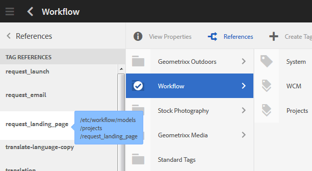

# Amministrazione dei tag {#administering-tags}

I tag sono un metodo semplice e veloce per classificare i contenuti di un sito web. Possono essere considerate come parole chiave o etichette (metadati) che consentono di trovare più rapidamente il contenuto come risultato di una ricerca.

In Adobe Experience Manager (AEM), un tag può essere una proprietà di

* un nodo di contenuto per una pagina (vedi [Utilizzo dei tag](/help/sites-authoring/tags.md))

* un nodo di metadati per una risorsa (consulta [Gestione dei metadati per le risorse digitali](/help/assets/metadata.md))

Oltre alle pagine e alle risorse, i tag vengono utilizzati per le funzioni di AEM Communities

* contenuti generati dall&#39;utente (vedere [Assegnazione tag UGC)](/help/communities/tag-ugc.md)

* Risorse di attivazione (consulta [Risorse di abilitazione dei tag](/help/communities/functions.md#catalog-function))

## Funzioni tag {#tag-features}

Alcune delle caratteristiche dei tag all’interno dell’AEM includono:

* I tag possono essere raggruppati in vari spazi dei nomi. Tali gerarchie consentono la creazione di tassonomie. Queste tassonomie sono globali in tutta l&#39;AEM.
* La restrizione principale per i nuovi tag creati è che devono essere univoci all’interno di uno spazio dei nomi specifico.
* Il titolo di un tag non deve includere i caratteri di separazione del percorso del tag (né verranno visualizzati se presenti)

   * due punti `:` : delimita il tag namespace
   * barra `/` - delimita i tag secondari

* I tag possono essere applicati da autori e visitatori del sito. Indipendentemente dall’autore, tutte le forme di tag sono disponibili per la selezione, sia durante l’assegnazione a una pagina che durante la ricerca.
* I tag possono essere creati e la relativa tassonomia modificata dai membri del gruppo &quot;tag-administrator&quot; e dai membri con diritti di modifica per `/content/cq:tags`.

   * Un tag che contiene tag figlio viene definito tag contenitore
   * Un tag che non è un tag contenitore viene definito tag foglia
   * Uno spazio dei nomi dei tag è un tag foglia o un tag contenitore

* I tag vengono utilizzati da [Componente di ricerca](https://helpx.adobe.com/experience-manager/core-components/using/quick-search.html) per facilitare la ricerca dei contenuti.
* I tag vengono utilizzati da [Componente teaser](https://helpx.adobe.com/experience-manager/core-components/using/teaser.html), che monitora il tag cloud di un utente per fornire contenuto mirato.
* Se l’assegnazione tag è un aspetto importante del contenuto

   * assicurati di creare un pacchetto di tag con le pagine che li utilizzano
   * assicurati che [autorizzazioni tag](#setting-tag-permissions) abilita accesso in lettura

## Console per assegnazione tag {#tagging-console}

La console Assegnazione tag consente di creare e gestire i tag e le relative tassonomie. Un obiettivo è quello di evitare di avere molti tag simili relativi essenzialmente alla stessa cosa : per esempio, pagina e pagine o calzature e scarpe.

I tag vengono gestiti raggruppandoli in spazi dei nomi, esaminando l’utilizzo dei tag esistenti prima di crearne di nuovi e riorganizzandoli senza disconnettere il tag dal contenuto a cui si fa attualmente riferimento.

Per accedere alla console Assegnazione tag:

* all’autore
* accedi con privilegi amministrativi
* dalla navigazione globale

   * seleziona **`Tools`**
   * seleziona **`General`**
   * seleziona **`Tagging`**

### Creazione di uno spazio dei nomi {#creating-a-namespace}

Per creare un nuovo spazio dei nomi, seleziona la **`Create Namespace`** icona.

Lo spazio dei nomi è di per sé un tag e non deve necessariamente contenere tag secondari. Tuttavia, per continuare a creare una tassonomia, [crea tag secondari](#creating-tags), che a sua volta può essere un tag foglia o un tag contenitore.

 

* **Titolo**
  *(obbligatorio)* Titolo visualizzato per lo spazio dei nomi.

* **Nome**
  *(facoltativo)* Nome dello spazio dei nomi. Se non viene specificato, viene creato un nome di nodo valido dal titolo. Consulta [TagID](/help/sites-developing/framework.md#tagid).

* **Descrizione**
  *(facoltativo)* Descrizione dello spazio dei nomi.

Una volta inserite le informazioni richieste

* seleziona **Crea**

### Operazioni sui tag {#operations-on-tags}

La selezione di uno spazio dei nomi o di un altro tag rende disponibili le seguenti operazioni:

* [Visualizza proprietà](#viewing-tag-properties)
* [Riferimenti](#showing-tag-references)
* [Crea tag](#creating-tags)
* [Modifica](#editing-tags)
* [Spostare](#moving-tags)
* [Unisci](#merging-tags)
* [Pubblicazione](#publishing-tags)
* [Annulla pubblicazione](#unpublishing-tags)
* [Eliminare](#deleting-tags)

Quando la finestra del browser non è sufficientemente ampia da visualizzare tutte le icone, le icone più a destra sono raggruppate sotto un **`... More`** che, se selezionata, visualizzerà un elenco a discesa delle icone delle operazioni nascoste.

### Selezione di un tag dello spazio dei nomi {#selecting-a-namespace-tag}

Quando viene selezionato per la prima volta, se lo spazio dei nomi non contiene tag, le proprietà vengono visualizzate a destra, altrimenti vengono visualizzati i tag figlio. Per ogni tag selezionato vengono visualizzati i tag in esso contenuti o le relative proprietà se non sono presenti tag figlio.

Per selezionare il tag per le operazioni e per la selezione multipla, seleziona solo l’icona accanto al titolo. Selezionando il titolo verranno visualizzate solo le proprietà o verrà aperto il tag per visualizzarne il contenuto.

 

### Visualizzazione delle proprietà dei tag {#viewing-tag-properties}

Quando viene selezionato uno spazio dei nomi o un altro tag, selezionando **`View Properties`** determina la visualizzazione di informazioni relative al `name`, ora dell&#39;ultima modifica e numero di riferimenti. Se pubblicato, vengono visualizzati l’ora dell’ultima pubblicazione e l’ID dell’editore. Queste informazioni vengono visualizzate in una colonna a sinistra delle colonne dei tag.

### Visualizzazione dei riferimenti dei tag {#showing-tag-references}

Quando viene selezionato uno spazio dei nomi o un altro tag, selezionando **Riferimenti** identificherà il contenuto a cui è stato applicato il tag.

La visualizzazione iniziale è un conteggio dei tag applicati.

Selezionando la freccia a destra del conteggio, vengono elencati i nomi dei riferimenti.

Il tracciato del riferimento viene visualizzato come descrizione quando si passa il puntatore su un riferimento.

### Creazione di tag {#creating-tags}

Quando si seleziona uno spazio dei nomi o un altro tag (selezionando l’icona accanto al titolo), è possibile creare un tag figlio per il tag corrente selezionando **`Create Tag`** icona.

* **Titolo**
*(obbligatorio) *Un titolo di visualizzazione per il tag.

* **Nome**
*(facoltativo) *Un nome per il tag. Se non viene specificato, viene creato un nome di nodo valido dal titolo. Consulta [TagID](/help/sites-developing/framework.md#tagid).

* **Descrizione**
*(facoltativo) *Una descrizione del tag.

Una volta inserite le informazioni richieste

* seleziona **Crea**

### Modifica dei tag {#editing-tags}

Quando viene selezionato uno spazio dei nomi o un altro tag, è possibile modificare il Titolo e la Descrizione e fornire le localizzazioni del Titolo selezionando il **`Edit`**.

Dopo aver apportato le modifiche, seleziona **Salva**.

Per informazioni dettagliate sull’aggiunta delle traduzioni per lingua, consulta la sezione su [Gestione dei tag in lingue diverse](#managing-tags-in-different-languages).

### Spostamento dei tag {#moving-tags}

Quando viene selezionato uno spazio dei nomi o un altro tag, selezionando **`Move`** consente ad amministratori e sviluppatori di tag di ripulire la tassonomia spostando il tag in una nuova posizione o rinominandolo. Quando il tag selezionato è un tag contenitore, lo spostamento del tag comporta lo spostamento anche di tutti i tag figlio.

>[!NOTE]
>
>Si consiglia di consentire agli autori solo di: [modifica](#editing-tags) del tag `title`, per non spostare o rinominare i tag.

* **Percorso**
  *(sola lettura)* Percorso corrente del tag selezionato.

* **Sposta in**
Individua il nuovo percorso in cui spostare il tag.

* **Rinomina in**
Visualizza inizialmente il valore corrente `name`del tag. Una nuova `name`possono essere inserite.

* seleziona **Salva**

### Unione di tag {#merging-tags}

L’unione di tag può essere utilizzata quando una tassonomia presenta duplicati. Quando il tag A viene unito al tag B, tutte le pagine contrassegnate con il tag A vengono contrassegnate con il tag B e il tag A non è più disponibile per gli autori.

Quando viene selezionato uno spazio dei nomi o un altro tag, selezionando **Unisci** apre un pannello in cui è possibile selezionare il percorso in cui eseguire l’unione.

* **Percorso**
  *(sola lettura)* Percorso del tag selezionato da unire in un altro tag.

* **Unisci in**
Sfoglia per selezionare il percorso del tag in cui eseguire l’unione.

>[!NOTE]
>
>Dopo l&#39;unione, **Percorso** la selezione originale non esisterà (virtualmente) più.
>
>Quando un tag di riferimento viene spostato o unito, il tag non viene fisicamente eliminato in modo tale da poter mantenere i riferimenti.

### Pubblicazione dei tag {#publishing-tags}

Quando viene selezionato uno spazio dei nomi o un altro tag, selezionando **Pubblica** per attivare il tag nell’ambiente di pubblicazione. Analogamente al contenuto della pagina, viene pubblicato solo il tag selezionato, indipendentemente dal fatto che si tratti o meno di un tag contenitore.

Per pubblicare una tassonomia (uno spazio dei nomi e tag secondari), la best practice consiste nel creare una [pacchetto](/help/sites-administering/package-manager.md) dello spazio dei nomi (vedi [Nodo principale tassonomia](/help/sites-developing/framework.md#taxonomy-root-node)). Assicurati di [applica autorizzazioni](#setting-tag-permissions) allo spazio dei nomi prima di creare il pacchetto.

### Annullamento della pubblicazione dei tag {#unpublishing-tags}

Quando viene selezionato uno spazio dei nomi o un altro tag, selezionando **Annulla pubblicazione** disattiva il tag nell’ambiente di authoring e lo rimuove dall’ambiente di pubblicazione. Simile a `Delete`se il tag selezionato è un tag contenitore, tutti i relativi tag secondari verranno disattivati nell’ambiente di authoring e rimossi dall’ambiente di pubblicazione.

### Eliminazione dei tag {#deleting-tags}

Quando viene selezionato uno spazio dei nomi o un altro tag, selezionando **Elimina** rimuoverà definitivamente il tag dall’ambiente di authoring. Se il tag è stato pubblicato, viene rimosso anche dall’ambiente di pubblicazione. Se il tag selezionato è un tag contenitore, verranno rimossi anche tutti i relativi tag figlio.

## Impostazione delle autorizzazioni dei tag {#setting-tag-permissions}

Le autorizzazioni tag sono [&#39;protetto (per impostazione predefinita)&#39;](/help/sites-administering/production-ready.md); una best practice per l’ambiente di pubblicazione che richiede l’autorizzazione di lettura per essere consentita esplicitamente per i tag. In pratica, questo avviene creando un pacchetto dello spazio dei nomi dei tag dopo aver impostato le autorizzazioni per l’authoring e installando il pacchetto su tutte le istanze di pubblicazione.

* sull’istanza di authoring

   * accedi con privilegi amministrativi
   * accedere a [Console di sicurezza](/help/sites-administering/security.md#accessing-user-administration-with-the-security-console),

      * ad esempio, passa a http://localhost:4502/useradmin

   * nel riquadro sinistro selezionare il gruppo (o l&#39;utente) per il quale [autorizzazione di lettura](/help/sites-administering/security.md#permissions) deve essere concesso
   * nel riquadro di destra, individua il **Percorso **dello spazio dei nomi dei tag

      * ad esempio, `/content/cq:tags/mycommunity`

   * seleziona la `checkbox`nel **Letto** colonna
   * seleziona **Salva**

* assicurarsi che tutte le istanze di pubblicazione abbiano le stesse autorizzazioni

   * un approccio consiste nel [creare un pacchetto](/help/sites-administering/package-manager.md#package-manager) dello spazio dei nomi sull’autore

      * il `Advanced` scheda, per `AC Handling` seleziona `Overwrite`

   * replicare il pacchetto

      * scegli `Replicate` da gestione pacchetti

## Gestione dei tag in lingue diverse {#managing-tags-in-different-languages}

Il `title`di un tag può essere tradotta in più lingue. Una volta tradotto, il tag appropriato `title`può essere visualizzata in base alla lingua utente o alla lingua della pagina.

### Definizione dei titoli di tag in più lingue {#defining-tag-titles-in-multiple-languages}

Di seguito viene descritto come tradurre `title`del tag **Animali** dall&#39;inglese al tedesco e al francese.

Per iniziare, seleziona il tag sotto **Foto d&#39;archivio** spazio dei nomi e selezione del **`Edit`**icona (vedere [Modifica dei tag](#editing-tags) sezione ).

Il pannello Modifica tag consente di scegliere le lingue in cui localizzare il titolo del tag.

Quando viene selezionata una lingua, viene visualizzata una casella di testo in cui è possibile immettere il titolo tradotto.

Una volta inserite tutte le traduzioni, seleziona **Salva** per uscire dalla modalità di modifica.

In generale, la lingua scelta per il tag viene presa dalla lingua della pagina, quando disponibile. Quando [`tag` widget](/help/sites-developing/building.md#tagging-on-the-client-side) viene utilizzato in altri casi (ad esempio nei moduli o nelle finestre di dialogo), il linguaggio dei tag dipende dal contesto.

Invece di usare l’impostazione della lingua della pagina, la console Assegnazione tag utilizza l’impostazione della lingua utente. Nella console Assegnazione tag, per il tag &quot;Animals&quot;, veniva visualizzato &quot;Animaux&quot; per un utente che impostava la lingua sul francese nelle proprietà utente.

Per aggiungere una nuova lingua alla finestra di dialogo, vedi [Aggiunta di una nuova lingua alla finestra di dialogo Modifica tag](/help/sites-developing/building.md#adding-a-new-language-to-the-edit-tag-dialog).

>[!NOTE]
>
>Il tag cloud e le parole chiave meta nel componente pagina standard utilizzano il tag localizzato `titles`in base alla lingua della pagina, se disponibile.

## Riferimenti {#resources}

* [Assegnazione di tag per sviluppatori](/help/sites-developing/tags.md)

  Informazioni sul framework dei tag nonché sull’estensione e l’inclusione di tag in applicazioni personalizzate.

* [Console classica per l’assegnazione di tag dell’interfaccia utente](/help/sites-administering/classic-console.md)
