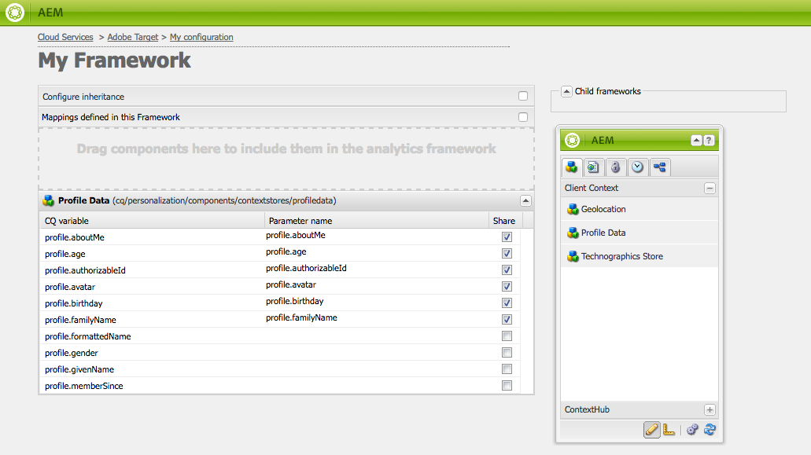

# Configurazione manuale dell’integrazione con Adobe Target {#manually-configuring-the-integration-with-adobe-target}

Puoi modificare le configurazioni della procedura guidata di consenso che hai creato quando utilizzi la procedura guidata oppure puoi integrarle manualmente con Adobe Target senza utilizzare la procedura guidata.

## Modifica delle configurazioni della procedura guidata di consenso {#modifying-the-opt-in-wizard-configurations}

La [procedura guidata di consenso](/help/sites-administering/opt-in.md) che [integra AEM con Adobe Target](/help/sites-administering/target.md) crea automaticamente una configurazione cloud di Target denominata Configurazione di destinazione con provisioning. La procedura guidata crea inoltre un framework Target per la configurazione cloud denominato Framework di destinazione con provisioning. Se necessario, puoi modificare le proprietà della configurazione e del framework del cloud.

Puoi anche configurare Adobe Target per utilizzare Adobe Target come origine per la generazione di rapporti durante il targeting del contenuto configurando la configurazione di A4T Analytics Cloud.

Per individuare la configurazione cloud e il framework, passa a **Cloud Services** tramite **Strumenti** > **Implementazione** > **Cloud**. ([http://localhost:4502/libs/cq/core/content/tools/cloudservices.html](http://localhost:4502/libs/cq/core/content/tools/cloudservices.html))
Sotto Adobe Target, tocca o fai clic su **Mostra configurazioni**.

### Proprietà di configurazione di Target con provisioning {#provisioned-target-configuration-properties}

I seguenti valori di proprietà vengono utilizzati nella configurazione cloud di configurazione di Target con provisioning creata dalla procedura guidata di Opt-in:

* **Codice client:** come immesso nella procedura guidata Opt-in.
* **E-mail:** come immesso nella procedura guidata Opt-in.
* **Password:** come immesso nella procedura guidata Opt-in.
* **Tipo API:** REST
* **Sincronizza Segmenti Da Adobe Target:** Selezionati.

* **Libreria client:** mbox.js.
* **Utilizza DTM per distribuire la libreria client:** Non selezionato. Seleziona questa opzione se [utilizzi DTM](/help/sites-administering/dtm.md) o un altro sistema di gestione dei tag per ospitare il file mbox.js o AT.js. Adobe consiglia di utilizzare DTM anziché AEM per distribuire la libreria.

* **Custom mbox.js:** nessuno specificato in modo che venga utilizzato il file mbox.js predefinito. Specifica un file mbox.js personalizzato da utilizzare in base alle esigenze. Viene visualizzato solo se hai selezionato mbox.js.
* **AT.js personalizzato:** nessuno specificato in modo che venga utilizzato il file AT.js predefinito. Specifica un file AT.js personalizzato da utilizzare in base alle esigenze. Viene visualizzato solo se è stato selezionato AT.js.

>[!NOTE]
>
>Nella AEM 6.3, puoi selezionare il file della libreria di Target [AT.JS](https://docs.adobe.com/content/help/en/target/using/implement-target/client-side/mbox-implement/mbox-download.html), una nuova libreria di implementazione per Adobe Target progettata sia per le implementazioni web tipiche che per le applicazioni a pagina singola.
>
>AT.js offre diversi miglioramenti rispetto alla libreria mbox.js :
>
>* Tempi di caricamento delle pagine migliorati per le implementazioni web
>* Maggiore sicurezza
>* Migliori opzioni di implementazione per le applicazioni a pagina singola
>* AT.js contiene i componenti inclusi in target.js, quindi cessano le chiamate a target.js

### Proprietà Framework di Target con provisioning {#provisioned-target-framework-properties}

Il framework di destinazione predisposto creato dalla procedura guidata Opt-in è configurato per inviare dati contestuali dall’archivio dati profilo. Per impostazione predefinita, gli elementi dati relativi a età e genere dell’archivio vengono inviati a Target. È probabile che la soluzione richieda l’invio di parametri aggiuntivi.

Puoi configurare il framework per inviare informazioni di contesto aggiuntive a Target come descritto in [Aggiunta di un framework di Target](/help/sites-administering/target-configuring.md#adding-a-target-framework).

### Configurazione della configurazione di A4T Analytics Cloud {#configuring-a-t-analytics-cloud-configuration}

Puoi configurare Adobe Target per utilizzare Adobe Analytics come origine per la generazione di rapporti durante il targeting del contenuto.

>[!NOTE]
>
>L’autenticazione con credenziali utente (legacy) non funziona con A4T (sia per Target che per Analytics). Pertanto, i clienti devono utilizzare l’autenticazione IMS invece dell’autenticazione User-Credential.

A questo scopo, devi specificare con quale configurazione cloud A4T collegare la configurazione cloud di Adobe Target:

1. Passa a **Cloud Services** tramite il logo **AEM** > **Strumenti** > **Implementazione** > **Cloud Services**.
1. Nella sezione **Adobe Target**, fai clic su **Configura ora**.
1. Riconnettersi alla configurazione Adobe Target.
1. Nel menu a discesa **A4T Analytics Cloud Configuration** , seleziona il framework.

   >[!NOTE]
   >
   >Sono disponibili solo le configurazioni di Analytics abilitate per A4T.
   >
   >Durante la configurazione di A4T con AEM, è possibile che manchi una voce di riferimento alla configurazione. Per selezionare il framework di analytics, procedi come segue:
   >
   >1. Passa a **Strumenti** > **Generale** > **CRXDE Lite**.
   1. Accedi a `/libs/cq/analytics/components/testandtargetpage/dialog/items/tabs/items/tab1_general/items/a4tAnalyticsConfig`
   1. Imposta la proprietà **disable** su **false**.
   1. Tocca o fai clic su **Salva tutto**.

   

   Fai clic su **OK**. Quando esegui il targeting del contenuto con Adobe Target, puoi [selezionare l&#39;origine del rapporto](/help/sites-authoring/content-targeting-touch.md).

## Integrazione manuale con Adobe Target {#manually-integrating-with-adobe-target}

Effettua l’integrazione manuale con Adobe Target invece di utilizzare la procedura guidata di consenso.

>[!NOTE]
Il file della libreria di Target [AT.JS](https://docs.adobe.com/content/help/en/target/using/implement-target/client-side/mbox-implement/mbox-download.html) è una nuova libreria di implementazione per Adobe Target progettata sia per le implementazioni web tipiche che per le applicazioni a pagina singola. Adobe consiglia di utilizzare AT.js invece di mbox.js come libreria client.
AT.js offre diversi miglioramenti rispetto alla libreria mbox.js :
* Tempi di caricamento delle pagine migliorati per le implementazioni web
* Maggiore sicurezza
* Migliori opzioni di implementazione per le applicazioni a pagina singola
* AT.js contiene i componenti inclusi in target.js, quindi cessano le chiamate a target.js
Puoi selezionare AT.js o mbox.js nel menu a discesa **Libreria client** .

### Creazione di una configurazione cloud di Target {#creating-a-target-cloud-configuration}

Per consentire a AEM di interagire con Adobe Target, crea una configurazione cloud di Target. Per creare la configurazione, fornisci il codice client Adobe Target e le credenziali utente.

Puoi creare la configurazione cloud di Target una sola volta perché puoi associare la configurazione a più campagne AEM. Se disponi di diversi codici client Adobe Target, crea una configurazione per ogni codice client.

Puoi configurare la configurazione cloud per sincronizzare i segmenti da Adobe Target. Se abiliti la sincronizzazione, i segmenti vengono importati in background da Target non appena viene salvata la configurazione cloud.

Segui la procedura seguente per creare una configurazione cloud di Target in AEM:

1. Passa a **Cloud Services** tramite il logo **AEM** > **Strumenti** > **Implementazione** > **Cloud Services**. ([http://localhost:4502/libs/cq/core/content/tools/cloudservices.html](http://localhost:4502/libs/cq/core/content/tools/cloudservices.html))

   Viene visualizzata la pagina di panoramica **Adobe Marketing Cloud**.

1. Nella sezione **Adobe Target**, fai clic su **Configura ora**.
1. Nella finestra di dialogo **Crea configurazione** :

   1. Assegna alla configurazione un **Titolo**.
   1. Seleziona il modello **Configurazione Adobe Target** .
   1. Fai clic su **Crea**.

   Viene visualizzata la finestra di dialogo di modifica.

   

   >[!NOTE]
   Durante la configurazione di A4T con AEM, è possibile che manchi una voce di riferimento alla configurazione. Per selezionare il framework di analytics, procedi come segue:
   1. Passa a **Strumenti** > **Generale** > **CRXDE Lite**.
   1. Passa a **/libs/cq/analytics/components/testandtargetpage/dialog/items/tabs/items/tab1_general/items/a4tAnalyticsConfig**
   1. Imposta la proprietà **disable** su **false**.
   1. Tocca o fai clic su **Salva tutto**.

1. Nella finestra di dialogo , specifica i valori per queste proprietà.

   * **Codice** client: il codice client dell’account di Target
   * **E-mail**: l’e-mail dell’account Target.
   * **Password**: la password dell’account Target.
   * **Tipo** API: REST o XML
   * **Configurazione** di A4T Analytics Cloud: Seleziona la configurazione cloud di Analytics utilizzata per gli obiettivi e le metriche delle attività di destinazione. È necessario se utilizzi Adobe Analytics come origine per la generazione di rapporti durante il targeting del contenuto. Se non visualizzi la configurazione cloud, consulta la nota in [Configurazione di A4T Analytics Cloud Configuration](#configuring-a-t-analytics-cloud-configuration).

   * **Utilizza targeting preciso:** Per impostazione predefinita questa casella di controllo è selezionata. Se questa opzione è selezionata, la configurazione del servizio cloud attenderà il caricamento del contesto prima di caricare il contenuto. Vedi la nota che segue.
   * **Sincronizza segmenti da Adobe Target:** seleziona questa opzione per scaricare i segmenti definiti in Target e utilizzarli in AEM. Devi selezionare questa opzione quando la proprietà Tipo API è REST, perché i segmenti in linea non sono supportati e devi sempre utilizzare i segmenti da Target. Il termine AEM &quot;segmento&quot; è equivalente al &quot;pubblico&quot; di Target.
   * **Libreria client:** seleziona se desideri la libreria client mbox.js o AT.js.
   * **Utilizza DTM per distribuire la libreria**  client: seleziona questa opzione per utilizzare AT.js o mbox.js da DTM o un altro sistema di gestione dei tag. Devi [configurare l&#39;integrazione DTM](/help/sites-administering/dtm.md) per utilizzare questa opzione. Adobe consiglia di utilizzare DTM anziché AEM per distribuire la libreria.
   * **mbox.js** personalizzato: Lascia vuoto se hai selezionato la casella DTM o per utilizzare il mbox.js predefinito. In alternativa, carica il mbox.js personalizzato. Viene visualizzato solo se hai selezionato mbox.js.
   * **AT.js** personalizzato: Lascia vuoto se hai selezionato la casella DTM o per utilizzare il file AT.js predefinito. In alternativa, carica il tuo AT.js personalizzato. Viene visualizzato solo se è stato selezionato AT.js.

   >[!NOTE]
   Per impostazione predefinita, quando si sceglie di accedere alla procedura guidata di configurazione di Adobe Target, il targeting accurato è abilitato.
   Il targeting accurato significa che la configurazione del servizio cloud attende il caricamento del contesto prima di caricare il contenuto. Di conseguenza, in termini di prestazioni, un targeting accurato può creare un ritardo di alcuni millisecondi prima del caricamento del contenuto.
   Il targeting accurato è sempre abilitato nell’istanza di authoring. Tuttavia, nell’istanza di pubblicazione puoi scegliere di disattivare il targeting accurato a livello globale cancellando il segno di spunta accanto a Targeting accurato nella configurazione del servizio cloud (**http://localhost:4502/etc/cloudservices.html**). Puoi inoltre attivare e disattivare il targeting accurato per i singoli componenti indipendentemente dall’impostazione nella configurazione del servizio cloud.
   Se hai ***già*** creato componenti di destinazione e modifichi questa impostazione, le modifiche non influiscono su tali componenti. Devi apportare direttamente le modifiche a tali componenti.

1. Fai clic su **Connetti a Target** per inizializzare la connessione con Target. Se la connessione ha esito positivo, viene visualizzato il messaggio **Connessione riuscita**. Fare clic su **OK** sul messaggio e quindi su **OK** nella finestra di dialogo.

   Se non riesci a connetterti a Target, consulta la sezione [risoluzione dei problemi](/help/sites-administering/target-configuring.md#troubleshooting-target-connection-problems) .

### Aggiunta di un framework di Target {#adding-a-target-framework}

Dopo aver configurato la configurazione cloud di Target, aggiungi un framework di Target. Il framework identifica i parametri predefiniti inviati ad Adobe Target dai componenti [Client Context](/help/sites-administering/client-context.md) o [ContextHub](/help/sites-developing/ch-configuring.md) disponibili. Target utilizza i parametri per determinare i segmenti che si applicano al contesto corrente.

Puoi creare più framework per una singola configurazione di Target. I framework multipli sono utili quando devi inviare un diverso set di parametri a Target per diverse sezioni del sito web. Crea un framework per ogni set di parametri da inviare. Associa ogni sezione del sito web al framework appropriato. Una pagina web può utilizzare un solo framework alla volta.

1. Nella pagina di configurazione di Target, fai clic su **+** (segno più) accanto a Framework disponibili.
1. Nella finestra di dialogo Crea framework, specifica un **Titolo**, seleziona il **Adobe Target Framework** e fai clic su **Crea**.

   

   Viene visualizzata la pagina del framework. La barra laterale fornisce componenti che rappresentano informazioni dal [contesto client](/help/sites-administering/client-context.md) o [ContextHub](/help/sites-developing/ch-configuring.md) che è possibile mappare.

   

1. Trascina il componente ClientContext che rappresenta i dati da utilizzare per la mappatura sulla destinazione di rilascio. In alternativa, trascina il componente **ContextHub Store** nel framework.

   >[!NOTE]
   Durante la mappatura, i parametri vengono passati a una mbox tramite stringhe semplici. Non è possibile mappare array da ContextHub.

   Ad esempio, per utilizzare **Dati profilo** sui visitatori del sito per controllare la campagna Target, trascina il componente **Dati profilo** nella pagina. Vengono visualizzate le variabili dei dati di profilo disponibili per la mappatura ai parametri di Target.

   

1. Seleziona le variabili che desideri rendere visibili al sistema Adobe Target selezionando la casella di controllo **Condividi** nelle colonne appropriate.

   

   >[!NOTE]
   La sincronizzazione dei parametri è solo unidirezionale, da AEM ad Adobe Target.

Viene creato il framework. Per replicare il framework nell&#39;istanza di pubblicazione, utilizza l&#39;opzione **Attiva framework** dalla barra laterale.

### Associazione di attività alla configurazione di Target Cloud  {#associating-activities-with-the-target-cloud-configuration}

Associa le attività [AEM](/help/sites-authoring/activitylib.md) alla configurazione cloud di Target in modo da poter eseguire il mirroring delle attività in [Adobe Target](https://docs.adobe.com/content/help/en/target/using/experiences/offers/manage-content.html).

>[!NOTE]
Il tipo di attività disponibile viene stabilito in base ai seguenti elementi:
* Se l&#39;opzione **xt_only** è abilitata sul tenant di Adobe Target (clientcode) utilizzato sul lato AEM per connettersi ad Adobe Target, puoi creare **solo** attività XT in AEM.
* Se le opzioni **xt_only** **non** sono abilitate sul tenant di Adobe Target (clientcode), puoi creare **sia** le attività XT che A/B in AEM.
**Nota aggiuntiva:** le opzioni **xt_only** sono un&#39;impostazione applicata a un determinato tenant Target (clientcode) e possono essere modificate solo direttamente in Adobe Target. Non puoi attivare o disattivare questa opzione da AEM.

### Associazione del framework di Target al sito {#associating-the-target-framework-with-your-site}

Dopo aver creato un framework di Target in AEM, associa le pagine web al framework. I componenti di destinazione nelle pagine inviano ad Adobe Target i dati definiti dal framework per il tracciamento. (Consulta [Targeting dei contenuti](/help/sites-authoring/content-targeting-touch.md).)

Quando associate una pagina al framework, le pagine figlie ereditano l’associazione.

1. Nella console **Sites** , individua il sito da configurare.
1. Utilizzando [azioni rapide](/help/sites-authoring/basic-handling.md#quick-actions) o [modalità di selezione](/help/sites-authoring/basic-handling.md), selezionare **Visualizza proprietà.**
1. Selezionare la scheda **Cloud Services**.
1. Tocca o fai clic su **Modifica**.
1. Tocca/fai clic su **Aggiungi configurazione** in **Configurazioni Cloud Service** e seleziona **Adobe Target**.

   

1. Seleziona il framework desiderato in **Riferimento di configurazione**.

   >[!NOTE]
   Assicurati di selezionare il **framework** specifico creato e non la configurazione cloud di Target in cui è stato creato.

1. Tocca o fai clic su **Fine**.
1. Attiva la pagina principale del sito web per replicarla nel server di pubblicazione. (Vedere [Come pubblicare le pagine](/help/sites-authoring/publishing-pages.md).)

   >[!NOTE]
   Se il framework allegato alla pagina non è ancora stato attivato, viene visualizzata una procedura guidata che consente di pubblicarlo.

## Risoluzione dei problemi di connessione di Target {#troubleshooting-target-connection-problems}

Esegui le seguenti operazioni per risolvere i problemi che si verificano durante la connessione a Target:

* Assicurati che le credenziali utente fornite siano corrette.
* Assicurati che l&#39;istanza AEM possa connettersi al server Target. Ad esempio, assicurati che le regole del firewall non bloccino le connessioni AEM in uscita o che AEM configurato per l’utilizzo dei proxy necessari.
* Cerca messaggi utili nel registro degli errori AEM. Il file error.log si trova nella directory **crx-quickstart/logs** in cui è installato AEM.
* Quando modifichi l’attività in Adobe Target, l’URL punta a localhost. Per ovviare a questo problema, imposta l’esternalizzatore AEM sull’URL corretto.
