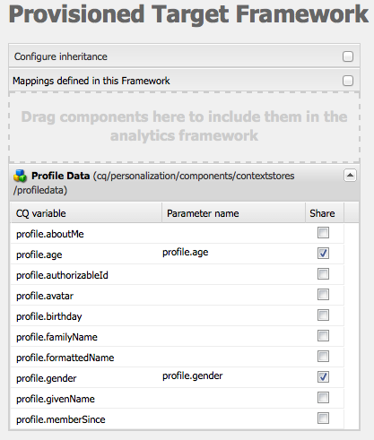

# Configurazione manuale dell&#39;integrazione con  Adobe Target {#manually-configuring-the-integration-with-adobe-target}

È possibile modificare le configurazioni della procedura guidata per l&#39;annullamento dell&#39;iscrizione, oppure è possibile effettuare l&#39;integrazione manuale con  Adobe Target senza ricorrere alla procedura guidata.

## Modifica delle configurazioni della procedura guidata di consenso {#modifying-the-opt-in-wizard-configurations}

La procedura guidata [di](/help/sites-administering/opt-in.md) consenso che [integra AEM con  Adobe Target](/help/sites-administering/target.md) crea automaticamente una configurazione cloud Target denominata Configurazione Target con provisioning. La procedura guidata crea inoltre un framework Target per la configurazione cloud denominata Provisioning Target Framework. Se necessario, potete modificare le proprietà della configurazione e della struttura del cloud.

Potete inoltre configurare  Adobe Target per utilizzare  Adobe Target come origine di reporting quando eseguite il targeting del contenuto configurando la configurazione A4T  Analytics Cloud Configuration.

Per individuare la configurazione cloud e il framework, passa a Servizi **** Cloud tramite **Strumenti** > **Distribuzione** > **Cloud**. ([http://localhost:4502/libs/cq/core/content/tools/cloudservices.html](http://localhost:4502/libs/cq/core/content/tools/cloudservices.html))Sotto  Adobe Target, fate clic o toccate **Mostra configurazioni**.

### Proprietà di configurazione Target con provisioning {#provisioned-target-configuration-properties}

I seguenti valori delle proprietà vengono utilizzati nella configurazione cloud di configurazione di Target Configuration con provisioning creata dalla procedura guidata di consenso:

* **Codice client:** Come immesso nella procedura guidata di consenso.
* **E-mail:** Come immesso nella procedura guidata di consenso.
* **Password:** Come immesso nella procedura guidata di consenso.
* **Tipo API:** REST
* **Sincronizza segmenti da  Adobe Target:** Selezionato.

* **Libreria client:** mbox.js.
* **Utilizzate DTM per distribuire la libreria client:** Non selezionato. Selezionate questa opzione se [utilizzate DTM](/help/sites-administering/dtm.md) o un altro sistema di gestione tag per ospitare il file mbox.js o AT.js. Adobe consiglia di utilizzare DTM invece di AEM per distribuire la libreria.

* **Custom mbox.js:** Nessuno specificato in modo che venga utilizzato il file mbox.js predefinito. Specificate un file mbox.js personalizzato da utilizzare come necessario. Viene visualizzato solo se avete selezionato mbox.js.
* **AT.js personalizzato:** Nessuno specificato in modo che venga utilizzato il file AT.js predefinito. Specificate un file AT.js personalizzato da utilizzare come necessario. Viene visualizzato solo se avete selezionato AT.js.

>[!NOTE]
>
>In AEM 6.3, è possibile selezionare il file Target Library, [AT.JS](https://docs.adobe.com/content/help/en/target/using/implement-target/client-side/mbox-implement/mbox-download.html), una nuova libreria di implementazione per  Adobe Target progettata sia per le implementazioni Web tipiche che per le applicazioni a pagina singola.
>
>AT.js offre diversi miglioramenti rispetto alla libreria mbox.js:
>
>* Tempi di caricamento delle pagine migliorati per le implementazioni Web
>* Maggiore sicurezza
>* Migliori opzioni di implementazione per le applicazioni a pagina singola
>* AT.js contiene i componenti che erano inclusi in target.js, pertanto non esiste più una chiamata a target.js

### Proprietà Target Framework con provisioning {#provisioned-target-framework-properties}

Il framework Target con provisioning creato dalla procedura guidata di consenso è configurato per l&#39;invio di dati contestuali dall&#39;archivio dati profilo. Per impostazione predefinita, gli elementi relativi a età e genere dello store vengono inviati ad Target. Probabilmente la soluzione richiede l&#39;invio di parametri aggiuntivi.

Potete configurare il framework per inviare informazioni di contesto aggiuntive ad Target come descritto in [Aggiunta di un Target Framework](/help/sites-administering/target-configuring.md#adding-a-target-framework).

### Configuring A4T Analytics Cloud Configuration {#configuring-a-t-analytics-cloud-configuration}

Potete configurare  Adobe Target per utilizzare Adobe  Analytics come origine di reporting quando eseguite il targeting del contenuto.

A tal fine, dovete specificare quale configurazione cloud A4T collegare la configurazione cloud  Adobe Target con:

1. Passa ai servizi **** cloud tramite il logo **** AEM > **Strumenti** > **Distribuzione** > Servizi **** cloud.
1. Nella sezione **Adobe Target** , fate clic su **Configura ora**.
1. Riconnettersi alla configurazione del Adobe Target .
1. Nel menu a discesa Configurazione **Analytics Cloud** A4T , selezionate il framework.

   >[!NOTE]
   >
   >Sono disponibili solo le configurazioni di analisi abilitate per A4T.
   >
   >Durante la configurazione di A4T con AEM, potrebbe essere presente una voce di riferimento alla configurazione mancante. Per poter selezionare il framework di analisi, effettuate le seguenti operazioni:
   >
   >1. Passare a **Strumenti** > **Generale** > **CRXDE Lite**.
   1. Passa a **/libs/cq/analytics/components/testandtargetpage/dialog/items/tab/items/tab1_general/items/a4tAnalyticsConfig**
   1. Impostate la proprietà **disable** su **false**.
   1. Tap or click **Save All**.

   

   Fai clic su **OK**. Quando eseguite il targeting del contenuto con  Adobe Target, potete [selezionare l&#39;origine](/help/sites-authoring/content-targeting-touch.md)del rapporto.

## Manually Integrating with Adobe Target {#manually-integrating-with-adobe-target}

Integrare manualmente con  Adobe Target invece di utilizzare la procedura guidata di consenso.

>[!NOTE]
Il file Target Library, [AT.JS](https://docs.adobe.com/content/help/en/target/using/implement-target/client-side/mbox-implement/mbox-download.html), è una nuova libreria di implementazione per  Adobe Target progettata sia per le implementazioni Web tipiche che per le applicazioni a pagina singola. Adobe consiglia di utilizzare AT.js invece di mbox.js come libreria client.
AT.js offre diversi miglioramenti rispetto alla libreria mbox.js:
* Tempi di caricamento delle pagine migliorati per le implementazioni Web
* Maggiore sicurezza
* Migliori opzioni di implementazione per le applicazioni a pagina singola
* AT.js contiene i componenti che erano inclusi in target.js, pertanto non esiste più una chiamata a target.js

Potete selezionare AT.js o mbox.js nel menu a discesa Libreria **** client.

### Creazione di una configurazione Target Cloud {#creating-a-target-cloud-configuration}

Per consentire ad AEM di interagire con  Adobe Target, create una configurazione cloud Target. Per creare la configurazione, dovete fornire il codice client del Adobe Target  e le credenziali utente.

Puoi creare la configurazione cloud Target una sola volta perché puoi associare la configurazione a più campagne AEM. Se avete diversi codici client  Adobe Target, create una configurazione per ogni codice client.

Puoi configurare la configurazione cloud per sincronizzare i segmenti da  Adobe Target. Se abilitate la sincronizzazione, i segmenti vengono importati in background da Target non appena viene salvata la configurazione cloud.

Per creare una configurazione cloud Target in AEM, effettuate le seguenti operazioni:

1. Passa ai servizi **** cloud tramite il logo **** AEM > **Strumenti** > **Distribuzione** > Servizi **** cloud. ([http://localhost:4502/libs/cq/core/content/tools/cloudservices.html](http://localhost:4502/libs/cq/core/content/tools/cloudservices.html))

   Viene visualizzata la pagina **panoramica Adobe Marketing Cloud** .

1. Nella sezione **Adobe Target** , fate clic su **Configura ora**.
1. Nella finestra di dialogo **Crea configurazione** :

   1. Assegna alla configurazione un **Titolo**.
   1. Selezionate il modello **Configurazione** Adobe Target.
   1. Fai clic su **Crea**.

   Viene visualizzata la finestra di dialogo di modifica.

   

   >[!NOTE]
   Durante la configurazione di A4T con AEM, potrebbe essere presente una voce di riferimento alla configurazione mancante. Per poter selezionare il framework di analisi, effettuate le seguenti operazioni:
   1. Passare a **Strumenti** > **Generale** > **CRXDE Lite**.
   1. Passa a **/libs/cq/analytics/components/testandtargetpage/dialog/items/tab/items/tab1_general/items/a4tAnalyticsConfig**
   1. Impostate la proprietà **disable** su **false**.
   1. Tap or click **Save All**.

1. Nella finestra di dialogo, inserite i valori per queste proprietà.

   * **Codice** client: il codice cliente dell&#39;account Target
   * **E-mail**: l’indirizzo e-mail dell’account Target.
   * **Password**: la password dell&#39;account Target.
   * **Tipo** API: REST o XML
   * **Configurazione** A4T  Analytics Cloud: Seleziona la configurazione cloud  Analytics utilizzata per gli obiettivi e le metriche dell&#39;attività di destinazione. Questo è necessario se utilizzate Adobe  Analytics come origine di reporting quando eseguite il targeting del contenuto. Se non visualizzi la configurazione cloud, consulta la nota in [Configurazione di A4T  configurazione](#configuring-a-t-analytics-cloud-configuration)Analytics Cloud.

   * **Utilizzate targeting accurato:** Per impostazione predefinita questa casella di controllo è selezionata. Se selezionata, la configurazione del servizio cloud attende il caricamento del contesto prima di caricare il contenuto. Vedere la nota che segue.
   * **Sincronizza segmenti da  Adobe Target:** Selezionate questa opzione per scaricare i segmenti definiti in Target e utilizzarli in AEM. Devi selezionare questa opzione quando la proprietà Tipo API è REST, perché i segmenti in linea non sono supportati e devi sempre utilizzare i segmenti da Target. Il termine &quot;segmento&quot; di AEM equivale al termine &quot;pubblico&quot; di Target.
   * **Libreria client:** Specificate se desiderate la libreria client mbox.js o AT.js.
   * **Utilizza DTM per distribuire la libreria** client - Seleziona questa opzione per utilizzare AT.js o mbox.js da DTM o un altro sistema di gestione tag. Per utilizzare questa opzione è necessario [configurare l&#39;integrazione](/help/sites-administering/dtm.md) di Gestione dinamica dei tag. Adobe consiglia di utilizzare DTM invece di AEM per distribuire la libreria.
   * **Custom mbox.js**: Lasciate vuoto se avete selezionato la casella Gestione dinamica dei tag o per utilizzare il file mbox.js predefinito. In alternativa, caricate il mbox.js personalizzato. Viene visualizzato solo se avete selezionato mbox.js.
   * **AT.js** personalizzato: Lasciate vuoto se avete selezionato la casella Gestione dinamica dei tag o per utilizzare il file AT.js predefinito. In alternativa, caricate il vostro AT.js personalizzato. Viene visualizzato solo se avete selezionato AT.js.

   >[!NOTE]
   Per impostazione predefinita, quando si sceglie di accedere alla procedura guidata di configurazione del Adobe Target , viene attivato il targeting accurato.
   Con targeting accurato, la configurazione del servizio cloud attende che il contesto venga caricato prima di caricare il contenuto. Di conseguenza, in termini di prestazioni, un targeting accurato potrebbe creare un ritardo di alcuni millisecondi prima del caricamento del contenuto.
   Il targeting accurato è sempre abilitato nell&#39;istanza di creazione. Tuttavia, nell’istanza di pubblicazione potete scegliere di disattivare il targeting accurato a livello globale deselezionando il segno di spunta accanto a Accurate Targeting (Impostazione destinazione accurata) nella configurazione del servizio cloud (**http://localhost:4502/etc/cloudservices.html**). Potete inoltre attivare e disattivare il targeting accurato per i singoli componenti, indipendentemente dall&#39;impostazione nella configurazione del servizio cloud.
   Se avete ***già*** creato componenti con targeting e modificate questa impostazione, le modifiche apportate non influiscono su tali componenti. È necessario apportare direttamente modifiche a tali componenti.

1. Fate clic su **Connetti ad Target** per inizializzare la connessione con Target. Se la connessione ha esito positivo, viene visualizzato il messaggio **Connessione riuscita** . Fare clic su **OK** sul messaggio, quindi su **OK** nella finestra di dialogo.

   Se non riuscite a connettervi ad Target, consultate la sezione [Risoluzione dei problemi](/help/sites-administering/target-configuring.md#troubleshooting-target-connection-problems) .

### Aggiunta di un framework Target {#adding-a-target-framework}

Dopo aver configurato la configurazione cloud Target, aggiungete un framework Target. Il framework identifica i parametri predefiniti inviati al Adobe Target  dai componenti Client Context [o](/help/sites-administering/client-context.md) ContextHub  disponibili. Target utilizza i parametri per determinare i segmenti che si applicano al contesto corrente.

Potete creare più framework per una singola configurazione Target. I framework multipli sono utili quando è necessario inviare un set diverso di parametri ad Target per diverse sezioni del sito Web. Create un framework per ciascun set di parametri da inviare. Associate ogni sezione del sito Web al framework appropriato. Una pagina Web può utilizzare un solo framework per volta.

1. Nella pagina di configurazione Target, fate clic sul segno **+** (più) accanto a Framework disponibili.
1. Nella finestra di dialogo Crea framework, specificate un **Titolo**, selezionate il Framework **di Adobe Target** e fate clic su **Crea**.

   

   Viene visualizzata la pagina del framework. La barra laterale fornisce componenti che rappresentano le informazioni [Client Context](/help/sites-administering/client-context.md) o [ContextHub](/help/sites-administering/contexthub-config.md) mappabili dall&#39;utente.

   

1. Trascinare il componente ClientContext che rappresenta i dati da utilizzare per la mappatura sulla destinazione di rilascio. In alternativa, trascinate **il componente ContextHub Store** nel framework.

   >[!NOTE]
   Durante la mappatura, i parametri vengono passati a una mbox tramite semplici stringhe. Non è possibile mappare array da ContextHub.

   Ad esempio, per utilizzare Dati **** profilo sui visitatori del sito per controllare la campagna Target, trascinate il componente Dati **** profilo sulla pagina. Vengono visualizzate le variabili di dati del profilo disponibili per la mappatura ai parametri Target.

   

1. Selezionate le variabili che desiderate rendere visibili al Adobe Target  selezionando la casella di controllo **Condividi** nelle colonne appropriate.

   

   >[!NOTE]
   La sincronizzazione dei parametri è solo unidirezionale, da AEM a  Adobe Target.

Il framework viene creato. Per replicare il framework nell’istanza di pubblicazione, utilizzate l’opzione **Attiva framework** dalla barra laterale.

### Associazione delle attività con la configurazione di Target Cloud  {#associating-activities-with-the-target-cloud-configuration}

Associate le attività  AEM alla configurazione cloud Target in modo da poter eseguire il mirroring delle attività in [Adobe Target](https://docs.adobe.com/content/help/en/target/using/experiences/offers/manage-content.html).

>[!NOTE]
Il tipo di attività disponibile viene stabilito in base ai seguenti elementi:
* Se l&#39;opzione **xt_only** è abilitata sul tenant di Adobe Target (clientcode) utilizzato sul lato AEM per connettersi ad Adobe Target, puoi creare **solo** attività XT in AEM.

* Se le opzioni **xt_only** **non** sono abilitate sul tenant di Adobe Target (clientcode), puoi creare **sia** le attività XT che A/B in AEM.

**Nota aggiuntiva:** le opzioni **xt_only** sono un&#39;impostazione applicata a un determinato tenant Target (clientcode) e possono essere modificate solo direttamente in Adobe Target. Non puoi attivare o disattivare questa opzione da AEM.

### Associazione di Target Framework al sito {#associating-the-target-framework-with-your-site}

Dopo aver creato un framework Target in AEM, associate le pagine Web al framework. I componenti di destinazione nelle pagine inviano i dati definiti dal framework al Adobe Target  per il tracciamento. Consultate Targeting dei [contenuti](/help/sites-authoring/content-targeting-touch.md).

Quando associate una pagina al framework, le pagine figlie ereditano l&#39;associazione.

1. Nella console **Siti** , individuate il sito da configurare.
1. Utilizzando le azioni  rapide o la modalità [di](/help/sites-authoring/basic-handling.md)selezione, selezionate **Visualizza proprietà.**
1. Selezionate la scheda Servizi **** cloud.
1. Tap/click **Edit**.
1. Toccate o fate clic su **Aggiungi configurazione** in Configurazioni **** Cloud Service e selezionate **Adobe Target**.

   

1. Selezionate il framework desiderato in Riferimento **** configurazione.

   >[!NOTE]
   Accertatevi di selezionare il **framework** specifico creato e non la configurazione cloud Target in cui è stato creato.

1. Toccate o fate clic su **Fine**.
1. Attivate la pagina principale del sito Web per replicarla sul server di pubblicazione. (See [How To Publish Pages](/help/sites-authoring/publishing-pages.md).)

   >[!NOTE]
   Se il framework allegato alla pagina non è stato ancora attivato, si apre una procedura guidata che consente di pubblicarlo.

## Risoluzione dei problemi di connessione di Target {#troubleshooting-target-connection-problems}

Per risolvere i problemi che si verificano durante la connessione ad Target, effettuate le seguenti operazioni:

* Verificate che le credenziali utente fornite siano corrette.
* Accertatevi che l&#39;istanza AEM possa connettersi al server Target. Ad esempio, accertatevi che le regole del firewall non blocchino le connessioni AEM in uscita o che AEM sia configurato per l’utilizzo dei proxy necessari.
* Cercate utili messaggi nel registro errori di AEM. Il file error.log si trova nella directory **crx-quickstart/logs** in cui è installato AEM.
* Quando modificate l&#39;attività in  Adobe Target, l&#39;URL punta a localhost. Per ovviare a questo problema, impostate l’esternalizzatore AEM sull’URL corretto.

