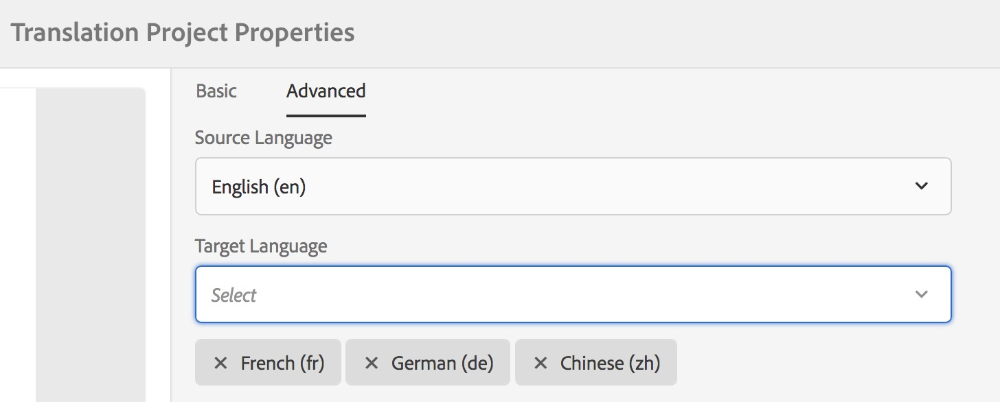
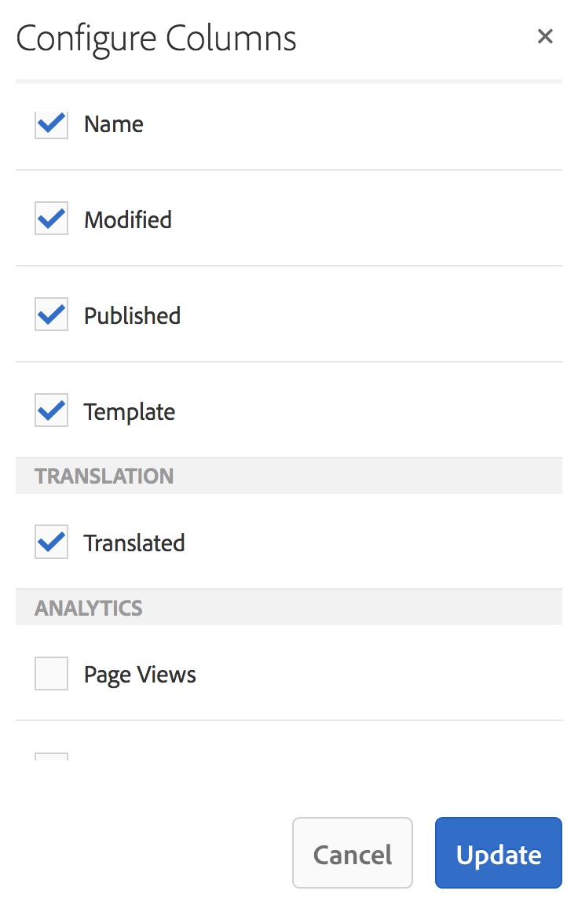

# Miglioramenti alla traduzione{#translation-enhancements}

Questa pagina presenta miglioramenti e miglioramenti incrementali alle funzionalità di gestione della traduzione AEM.

## Automazione dei progetti di traduzione {#translation-project-automation}

Sono state aggiunte opzioni per migliorare la produttività nell’utilizzo dei progetti di traduzione, ad esempio per promuovere ed eliminare automaticamente i lanci di traduzione e per pianificare l’esecuzione ricorrente di un progetto di traduzione.

1. Nel progetto di traduzione, tocca o fai clic sui puntini di sospensione nella parte inferiore del **Riepilogo della traduzione** piastrelle.

   

1. Passa alla **Avanzate** scheda . In basso, è possibile selezionare **Promuovi automaticamente i lanci di traduzione**.

   

1. Facoltativamente, puoi selezionare se dopo aver ricevuto il contenuto tradotto, gli avvii di traduzione devono essere promossi ed eliminati automaticamente.

   

1. Per selezionare l’esecuzione ricorrente di un progetto di traduzione, seleziona la frequenza con il menu a discesa in **Ripeti traduzione**. L’esecuzione ricorrente del progetto creerà ed eseguirà automaticamente i processi di traduzione agli intervalli specificati.

   

## Progetti di traduzione multilingue {#multilingual-translation-projects}

È possibile configurare più lingue di destinazione in un progetto di traduzione, per ridurre il numero totale di progetti di traduzione creati.

1. Nel progetto di traduzione, tocca o fai clic sui punti nella parte inferiore del **Riepilogo della traduzione** piastrelle.

   

1. Passa alla **Avanzate** scheda . È possibile aggiungere più lingue in **Lingua di destinazione**.

   

1. In alternativa, se si avvia la traduzione tramite la barra dei riferimenti in Sites, aggiungere le lingue e selezionare **Creare un progetto di traduzione multilingue**.

   

1. I lavori di traduzione verranno creati nel progetto per ogni lingua di destinazione. Possono essere avviati uno per uno all’interno del progetto o tutti insieme eseguendo il progetto globalmente in Amministratore progetti.

   

## Aggiornamenti della memoria di traduzione {#translation-memory-updates}

Le modifiche manuali dei contenuti tradotti possono essere sincronizzate nuovamente con il sistema di gestione della traduzione (TMS) per addestrare la sua memoria di traduzione.

1. Dalla console Sites, dopo aver aggiornato il contenuto di testo in una pagina tradotta, seleziona **Aggiorna memoria di traduzione**.

   

1. Una vista a elenco mostra un confronto affiancato dell’originale e della traduzione per ogni componente di testo modificato. Selezionare gli aggiornamenti di traduzione da sincronizzare con la memoria di traduzione e selezionare **Aggiorna memoria**.

   

AEM aggiorna la traduzione delle stringhe esistenti nella memoria di traduzione del TMS configurato.

* L&#39;azione aggiorna la traduzione delle stringhe esistenti nella memoria di traduzione del TMS configurato.
* Non crea nuovi lavori di traduzione.
* Invia le traduzioni al TMS tramite AEM API di traduzione (vedi sotto).

Per utilizzare questa funzione:

* Un TMS deve essere configurato per l’utilizzo con AEM.
* Il connettore deve implementare il metodo [`storeTranslation`](https://developer.adobe.com/experience-manager/reference-materials/cloud-service/javadoc/com/adobe/granite/translation/api/TranslationService.html).
   * Il codice all’interno di questo metodo determina cosa accade alla richiesta di aggiornamento della memoria di traduzione.
   * Il framework di traduzione AEM invia nuovamente le coppie di valori stringa (traduzione originale e aggiornata) al TMS tramite questa implementazione del metodo.

Gli aggiornamenti della memoria di traduzione possono essere intercettati e inviati a una destinazione personalizzata, per i casi in cui viene utilizzata una memoria di traduzione proprietaria.

## Copie per lingua su più livelli {#language-copies-on-multiple-levels}

Le radici della lingua possono ora essere raggruppate sotto i nodi, ad esempio per regione, mentre vengono ancora riconosciute come radici delle copie della lingua.

>[!CAUTION]
>
>È consentito un solo livello. Ad esempio, quanto segue non consente alla pagina &quot;es&quot; di risolvere una copia per lingua:
>
>* `/content/we-retail/language-masters/en`
>* `/content/we-retail/language-masters/americas/central-america/es`
>
>Questo `es` la copia della lingua non verrà rilevata in quanto si trova a 2 livelli (americas/central-america) lontano dal `en` nodo.

>[!NOTE]
>
>Le radici della lingua possono avere qualsiasi nome di pagina, anziché solo il codice ISO della lingua. AEM sempre controllare prima il percorso e il nome, ma se il nome della pagina non identifica una lingua, AEM controllerà la proprietà cq:language della pagina per l&#39;identificazione della lingua.

## Reporting sullo stato della traduzione {#translation-status-reporting}

È ora possibile selezionare una proprietà nella vista a elenco Siti che mostra se una pagina è stata tradotta, è in traduzione o non è ancora stata tradotta. Per visualizzarlo:

1. In Sites, passa a **Vista a elenco.**

   

1. Tocca o fai clic su **Visualizza impostazioni**.

   

1. Controlla **Tradotto** spunta sotto **Traduzione** e tocca/fai clic su **Aggiorna**.

   

Ora è possibile visualizzare un **Tradotto** che mostra lo stato di traduzione delle pagine.

