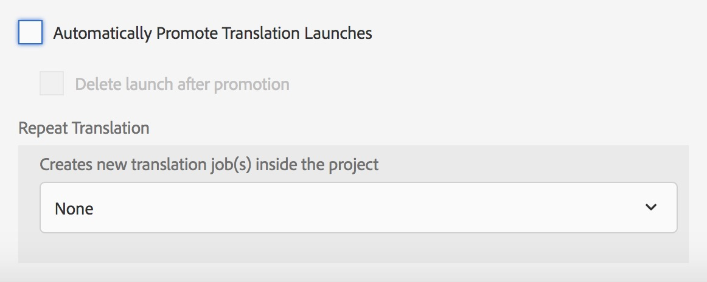

# Miglioramenti della traduzione{#translation-enhancements}

Questa pagina presenta miglioramenti e miglioramenti incrementali alle funzionalità di gestione AEM traduzione.

## Automazione progetto di traduzione {#translation-project-automation}

Sono state aggiunte opzioni per migliorare la produttività nell’utilizzo dei progetti di traduzione, ad esempio per promuovere ed eliminare automaticamente i lanci di traduzione e per pianificare l’esecuzione ricorrente di un progetto di traduzione.

1. Nel progetto di traduzione, tocca o fai clic sui puntini di sospensione nella parte inferiore della sezione **Riepilogo traduzione**.

   

1. Passate alla scheda **Avanzate**. In basso, potete selezionare **Promuovi automaticamente lanci di traduzione**.

   

1. Facoltativamente, potete scegliere se, dopo aver ricevuto il contenuto convertito, gli avvii di traduzione devono essere promossi ed eliminati automaticamente.

   

1. Per selezionare l&#39;esecuzione ricorrente di un progetto di traduzione, selezionare la frequenza con il menu a discesa in **Ripeti traduzione**. L&#39;esecuzione periodica del progetto creerà e eseguirà automaticamente i processi di conversione agli intervalli specificati.

   

## Progetti di traduzione multilingue {#multilingual-translation-projects}

È possibile configurare più lingue di destinazione in un progetto di traduzione, per ridurre il numero totale di progetti di traduzione creati.

1. Nel progetto di traduzione, tocca o fai clic sui punti in fondo alla sezione **Riepilogo traduzione**.

   

1. Passate alla scheda **Avanzate**. È possibile aggiungere più lingue in **Lingua di destinazione**.

   

1. In alternativa, se iniziate la traduzione tramite la barra laterale Riferimenti in Siti, aggiungete le lingue e selezionate **Crea progetto di traduzione in più lingue**.

   

1. I processi di traduzione verranno creati nel progetto per ogni lingua di destinazione. Possono essere avviati uno per uno all’interno del progetto, oppure tutti insieme eseguendo il progetto globalmente in Amministratore progetti.

   

## Aggiornamenti della memoria di traduzione {#translation-memory-updates}

Le modifiche manuali dei contenuti tradotti possono essere sincronizzate con il sistema TMS (Translation Management System) per formare la sua memoria di traduzione.

1. Dalla console Siti, dopo aver aggiornato il contenuto di testo in una pagina tradotta, selezionare **Aggiorna memoria di traduzione**.

   

1. Una vista a elenco mostra un confronto affiancato tra l’origine e la traduzione per ogni componente di testo modificato. Selezionare gli aggiornamenti di traduzione da sincronizzare con la memoria di traduzione, quindi selezionare **Aggiorna memoria**.

   

   >[!NOTE]
   >
   >AEM rispedirà le stringhe selezionate al Sistema di gestione della traduzione.

## Copie della lingua a più livelli {#language-copies-on-multiple-levels}

Le radici delle lingue ora possono essere raggruppate sotto i nodi, ad esempio per regione, pur restando riconosciute come radici delle copie delle lingue.

>[!CAUTION]
>
>È consentito un solo livello. Ad esempio, quanto segue non consente alla pagina &quot;es&quot; di trovare una copia per lingua:
>
>* `/content/we-retail/language-masters/en`
>* `/content/we-retail/language-masters/americas/central-america/es`

>
>
Questa copia della lingua `es` non verrà rilevata perché si trova a 2 livelli (America centrale/America centrale) lontano dal nodo `en`.

>[!NOTE]
>
>Le radici della lingua possono avere un nome di pagina qualsiasi, anziché semplicemente il codice ISO della lingua. AEM sempre controllare prima il percorso e il nome, ma se il nome della pagina non identifica una lingua, AEM controllare la proprietà cq:language della pagina per l’identificazione della lingua.

## Report stato conversione {#translation-status-reporting}

È ora possibile selezionare una proprietà nella visualizzazione Elenco siti che mostra se una pagina è stata tradotta, è in traduzione o non è ancora stata tradotta. Per visualizzarlo:

1. In Siti, passare a **Visualizzazione elenco.**

   

1. Tocca o fai clic su **Visualizza impostazioni**.

   

1. Selezionare la casella di controllo **Translated** in **Translation** e toccare/fare clic su **Aggiorna**.

   

È ora possibile visualizzare una colonna **Translated** che mostra lo stato di traduzione delle pagine.

