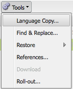

# Creazione di una directory principale della lingua utilizzando l’interfaccia classica{#creating-a-language-root-using-the-classic-ui}

La procedura seguente utilizza l’interfaccia classica per creare una directory principale della lingua di un sito. Per ulteriori informazioni, consulta [Creazione di una directory principale della lingua](/help/sites-administering/tc-prep.md#creating-a-language-root).

1. Nella console Siti Web seleziona la pagina principale del sito nella struttura Siti Web. ([http://localhost:4502/siteadmin#](http://localhost:4502/siteadmin#))
1. Aggiungi una nuova pagina figlio che rappresenta la versione per la lingua del sito:

   1. Fai clic su Nuovo > Nuova pagina.
   1. Nella finestra di dialogo , specifica il Titolo e il Nome. Il nome deve essere nel formato di `<language-code>` o `<language-code>_<country-code>`ad esempio en, en_US, en_us, en_GB, en_gb.

      * Il codice della lingua supportato è un codice a due lettere minuscolo come definito dallo standard ISO-639-1
      * Il codice del paese supportato è un codice a due lettere minuscolo o superiore, come definito dalla norma ISO 3166
   1. Selezionare il modello e fare clic su Crea.

   

1. Nella console Siti Web seleziona la pagina principale del sito nella struttura Siti Web.
1. Selezionare Copia lingua dal menu Strumenti.

   

   La finestra di dialogo Copia lingua visualizza una matrice delle versioni disponibili per la lingua e delle pagine Web. Una x in una colonna della lingua indica che la pagina è disponibile in tale lingua.

   

1. Per copiare una pagina o una struttura di pagina esistente in una versione della lingua, selezionare la cella relativa alla pagina nella colonna della lingua. Fai clic sulla freccia e seleziona il tipo di copia da creare.

   Nell&#39;esempio seguente, la pagina apparecchiature/occhiali da sole/irian viene copiata nella versione in lingua francese.

   

   | Tipo di copia della lingua | Descrizione |
   |---|---|
   | auto | Utilizza il comportamento delle pagine padre |
   | ignore | Non crea una copia di questa pagina e dei relativi elementi secondari |
   | `<language>+` (es. francese+) | Copia la pagina e tutti i relativi elementi secondari da tale lingua |
   | `<language>` (ad esempio francese) | Copia solo la pagina da tale lingua |

1. Fate clic su OK per chiudere la finestra di dialogo.
1. Nella finestra di dialogo successiva, fare clic su Sì per confermare la copia.
