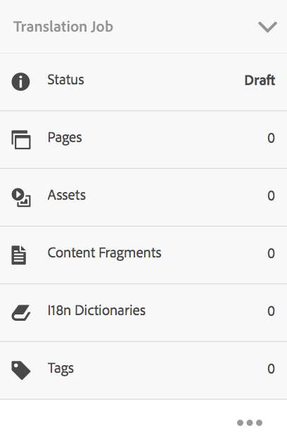
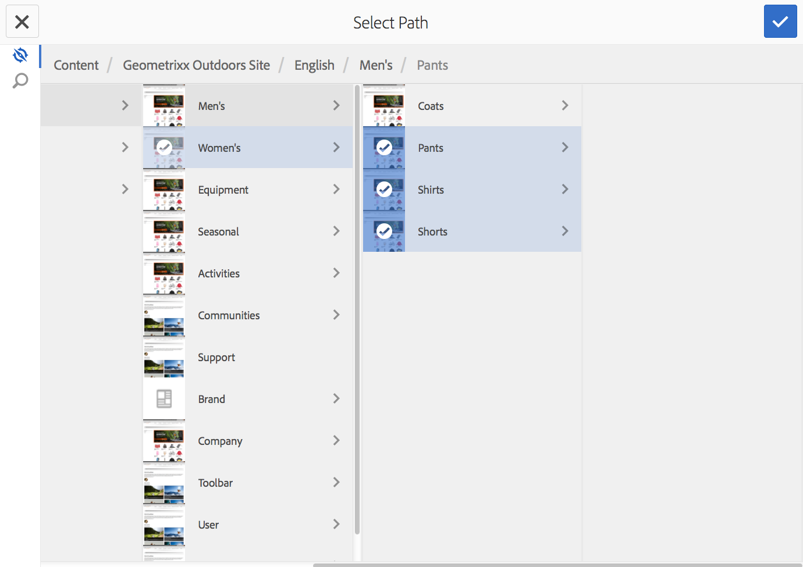

# Gestione dei progetti di traduzione{#managing-translation-projects}

Dopo aver preparato il contenuto per la traduzione, devi completare la struttura della lingua creando copie per lingua mancanti e creare progetti di traduzione.

I progetti di traduzione consentono di gestire la traduzione dei contenuti AEM. Un progetto di traduzione è un tipo di [progetto](/help/sites-authoring/projects.md) AEM che contiene risorse da tradurre in altre lingue. Queste risorse sono le pagine e le risorse delle [copie per lingua](/help/sites-administering/tc-prep.md) create dal master lingua.

Quando si aggiungono risorse a un progetto di traduzione, viene creato un processo di traduzione apposito. I processi forniscono i comandi e le informazioni sullo stato, utili per gestire i flussi di lavoro di traduzione umana e automatica che vengono eseguiti sulle risorse.

>[!NOTE]
>
>Un progetto di traduzione può contenere più processi di traduzione.

I progetti di traduzione sono elementi a esecuzione prolungata, definiti per lingua e metodo/fornitore di traduzione per l’allineamento alla governance organizzativa di globalizzazione. Devono essere avviati una volta, durante la traduzione iniziale o manualmente, e rimangono in funzione per tutte le attività di aggiornamento del contenuto e della traduzione.

I progetti e i processi di traduzione vengono creati con flussi di lavoro di preparazione della traduzione. Questi flussi di lavoro hanno tre opzioni, sia per la traduzione iniziale (Crea&amp;Traduci) che per gli aggiornamenti (Aggiorna traduzione):

1. [Crea nuovo progetto](#creating-translation-projects-using-the-references-panel)
1. [Aggiungi a progetto esistente](#adding-pages-to-a-translation-project)
1. [Solo struttura del contenuto](#creating-the-structure-of-a-language-copy)

>[!NOTE]
>
>L’opzione 3 non è correlata al processo/progetto di traduzione. Consente di copiare il contenuto e le modifiche strutturali nel master lingua in copie in lingua (non tradotte). Puoi utilizzarlo per mantenere sincronizzati i master lingua, anche senza traduzione.

## Esecuzione di traduzioni iniziali e aggiornamento di traduzioni esistenti {#performing-initial-translations-and-updating-existing-translations}

AEM rileva se viene creato un progetto per la traduzione iniziale del contenuto o per aggiornare copie per lingua già tradotte. Quando crei un progetto di traduzione per una pagina e indichi le copie per lingua di cui ti stai occupando, AEM rileva se la pagina sorgente esiste già nelle copie per lingua di destinazione:

* **La copia per lingua non include la pagina:** AEM tratta questa situazione come traduzione iniziale. La pagina viene immediatamente copiata nella copia per lingua e inclusa nel progetto. Quando la pagina tradotta viene importata in AEM, AEM la inserisce direttamente nella copia per lingua.
* **La copia per lingua include già la pagina:** AEM tratta questa situazione come traduzione aggiornata. Viene creato un lancio a cui viene aggiunta una copia della pagina inclusa nel progetto. I lanci consentono di rivedere le traduzioni aggiornate prima di inviarle alla copia per lingua:

   * Quando la pagina tradotta viene importata in AEM, sovrascrive la pagina nel lancio.
   * La pagina tradotta sovrascrive la copia per lingua solo quando il lancio viene promosso.

Ad esempio, viene creata la directory principale della lingua /content/geometrixx/fr per la traduzione francese della lingua master /content/geometrixx/en. Non ci sono altre pagine nella copia per lingua francese.

* Viene creato un progetto di traduzione per la pagina /content/geometrixx/en/products e tutte le pagine figlie, con targeting per la copia in lingua francese. Poiché la copia per lingua non include la pagina /content/geometrixx/fr/products, l’AEM copia immediatamente la pagina /content/geometrixx/en/products e tutte le pagine figlie nella copia in lingua francese. Le copie sono incluse anche nel progetto di traduzione.
* Viene creato un progetto di traduzione per la pagina /content/geometrixx/en e tutte le pagine figlie, con targeting per la copia in lingua francese. Poiché la copia per lingua include la pagina che corrisponde alla pagina /content/geometrixx/en (directory principale della lingua), l’AEM copia la pagina /content/geometrixx/en e tutte le pagine figlie e le aggiunge a un lancio. Le copie sono incluse anche nel progetto di traduzione.

## Creazione di progetti di traduzione tramite il pannello Riferimenti {#creating-translation-projects-using-the-references-panel}

Crea progetti di traduzione in modo da poter eseguire e gestire il flusso di lavoro per la traduzione delle risorse del master lingua. Quando si creano i progetti, è possibile specificare la pagina nel master lingua che si sta traducendo e le copie per lingua per le quali si sta eseguendo la traduzione:

* La configurazione cloud del framework di integrazione della traduzione associato alla pagina selezionata determina molte proprietà dei progetti di traduzione, ad esempio il flusso di lavoro di traduzione da utilizzare.
* Viene creato un progetto per ogni copia per lingua selezionata.
* Viene creata e aggiunta a ciascun progetto una copia della pagina selezionata e delle risorse associate. Queste copie vengono successivamente inviate al fornitore di traduzione per la lavorazione.

È possibile specificare anche la selezione delle pagine figlie insieme alla pagina selezionata. In questo caso, a ogni progetto vengono aggiunte anche copie delle pagine figlie in modo che vengano tradotte. Se alle pagine figlie sono associate diverse configurazioni del framework di integrazione della traduzione, AEM crea ulteriori progetti.

È inoltre possibile [creare manualmente progetti di traduzione](#creating-a-translation-project-using-the-projects-console).

>[!NOTE]
>
>Per creare un progetto, il tuo account deve essere un membro del gruppo `project-administrators`.

**Traduzioni iniziali e aggiornamento delle traduzioni**

Il pannello Riferimenti indica se si stanno aggiornando le copie per lingua esistenti o se si sta creando la prima versione delle copie per lingua. Quando esiste una copia per lingua della pagina selezionata, viene visualizzata la scheda Aggiorna copie per lingua per consentire l’accesso ai comandi relativi al progetto.

Dopo aver tradotto, puoi [rivedere la traduzione](#reviewing-and-promoting-updated-content) prima di utilizzarla per sovrascrivere la copia per lingua. Se non esiste una copia per lingua della pagina selezionata, viene visualizzata la scheda Crea e traduci per consentire l’accesso ai comandi relativi al progetto.

### Creare progetti di traduzione per una nuova copia per lingua {#create-translation-projects-for-a-new-language-copy}

1. Usa la console Sites per selezionare la pagina che stai aggiungendo ai progetti di traduzione.

   Ad esempio, per tradurre le pagine in inglese del sito demo Geometrixx, seleziona Geometrixx sito demo > Inglese.

1. Sulla barra degli strumenti fare clic su Riferimenti.

   

1. Seleziona Copie per lingua, quindi seleziona le copie per lingua per le quali stai traducendo le pagine sorgente.
1. Fai clic su Crea e traduci, quindi configura il processo di traduzione:

   * Utilizza il menu a discesa Lingue per selezionare una copia per lingua per cui desideri tradurre. Seleziona le lingue aggiuntive come richiesto. Le lingue visualizzate nell’elenco corrispondono alle [directory principali della lingua create](/help/sites-administering/tc-prep.md#creating-a-language-root).
   * Per tradurre la pagina selezionata e tutte le pagine figlie, seleziona Seleziona tutte le sottopagine. Per tradurre solo la pagina selezionata, deseleziona l’opzione.
   * Per Progetto, seleziona Crea nuovo progetto di traduzione.
   * Digita un nome per il progetto.

   

1. Fai clic su Crea.

### Creare progetti di traduzione per una copia per lingua esistente {#create-translation-projects-for-an-existing-language-copy}

1. Usa la console Sites per selezionare la pagina da aggiungere ai progetti di traduzione.

   Ad esempio, per tradurre le pagine in inglese del sito demo Geometrixx, seleziona Geometrixx sito demo > Inglese.

1. Sulla barra degli strumenti fare clic su Riferimenti.

   

1. Seleziona Copie per lingua, quindi seleziona le copie per lingua per le quali stai traducendo le pagine sorgente.
1. Fai clic su Aggiorna copie per lingua quindi configura il processo di traduzione:

   * Per tradurre la pagina selezionata e tutte le pagine figlie, seleziona Seleziona tutte le sottopagine. Per tradurre solo la pagina selezionata, deseleziona l’opzione.
   * Per Progetto, seleziona Crea nuovo progetto di traduzione.
   * Digita un nome per il progetto.

   

1. Fai clic su Start.

## Aggiunta di pagine a un progetto di traduzione {#adding-pages-to-a-translation-project}

Dopo aver creato un progetto di traduzione, puoi utilizzare il riquadro Risorse per aggiungere pagine al progetto. L’aggiunta di pagine è utile quando si includono pagine di rami diversi nello stesso progetto.

Quando aggiungi delle pagine a un progetto di traduzione, queste vengono incluse in un nuovo processo di traduzione. È inoltre possibile [aggiungere pagine a un processo esistente](#adding-pages-assets-to-a-translation-job).

Come per la creazione di un progetto, quando si aggiungono pagine, se necessario le copie delle pagine vengono aggiunte a un lancio per evitare la sovrascrittura delle copie per lingua esistenti. Consulta [Creazione di progetti di traduzione per copie per lingua esistenti](#performing-initial-translations-and-updating-existing-translations).

1. Usa la console Sites per selezionare la pagina che stai aggiungendo al progetto di traduzione.

   Ad esempio, per tradurre le pagine in inglese del sito demo Geometrixx, seleziona Geometrixx sito demo > Inglese.

1. Sulla barra degli strumenti fare clic su Riferimenti.

   

1. Seleziona Copie per lingua, quindi seleziona le copie per lingua per le quali stai traducendo le pagine sorgente.

   

1. Fai clic su Aggiorna copie per lingua quindi configura le proprietà:

   * Per tradurre la pagina selezionata e tutte le pagine figlie, seleziona Seleziona tutte le sottopagine. Per tradurre solo la pagina selezionata, deseleziona l’opzione.
   * Per Progetto, seleziona Aggiungi a progetto di traduzione esistente.
   * Seleziona il progetto.

   >[!NOTE]
   >
   >La lingua di destinazione impostata nel progetto di traduzione deve corrispondere al percorso della copia per lingua, come mostrato nel pannello Riferimenti.

   

1. Fai clic su Start.

## Aggiunta di pagine/risorse a un processo di traduzione {#adding-pages-assets-to-a-translation-job}

Puoi aggiungere pagine, risorse, tag o dizionari i18n al processo di traduzione del progetto di traduzione. Per aggiungere pagine o risorse:

1. Nella parte inferiore del riquadro Lavoro di traduzione del progetto di traduzione, fai clic sui puntini di sospensione.

   

1. Fai clic su Aggiungi e Pagine/Risorse.

   

1. Seleziona l’elemento più in alto del ramo da aggiungere, quindi fai clic sull’icona del segno di spunta. Puoi effettuare una selezione multipla.

   

1. In alternativa, puoi selezionare l’icona di ricerca per cercare facilmente le pagine o le risorse da aggiungere al processo di traduzione.

   

Le pagine e/o le risorse vengono aggiunte al processo di traduzione.

## Aggiunta di dizionari i18n a un processo di traduzione {#adding-i-n-dictionaries-to-a-translation-job}

Puoi aggiungere pagine, risorse, tag o dizionari i18n al processo di traduzione del progetto di traduzione. Per aggiungere un dizionario i18n:

1. Nella parte inferiore del riquadro Lavoro di traduzione del progetto di traduzione, fai clic sui puntini di sospensione.

   

1. Fare clic su Aggiungi e su I18N-Dictionary.

   

1. Selezionare il dizionario che si desidera aggiungere e quindi fare clic su Pulsante Aggiungi.

   

Il tuo dizionario è ora nel tuo lavoro di traduzione.

>[!NOTE]
>
>Per ulteriori informazioni sui dizionari i18n, leggere [Utilizzo di Translator per gestire i dizionari](/help/sites-developing/i18n-translator.md).

## Aggiunta di tag a un processo di traduzione {#adding-tags-to-a-translation-job}

Puoi aggiungere pagine, risorse, tag o dizionari i18n al processo di traduzione del progetto di traduzione. Per aggiungere i tag:

1. Nella parte inferiore del riquadro Lavoro di traduzione del progetto di traduzione, fai clic sui puntini di sospensione.

   

1. Fai clic su Aggiungi e quindi su Tag.

   

1. Selezionare i tag che si desidera aggiungere e quindi fare clic sull&#39;icona del segno di spunta. Puoi effettuare una selezione multipla.

   

I tag vengono ora aggiunti nel processo di traduzione.

## Visualizzazione dei dettagli del progetto di traduzione {#seeing-translation-project-details}

Il riquadro Riepilogo di traduzione contiene le proprietà configurate per un progetto di traduzione. Oltre al generico [informazioni sul progetto](/help/sites-authoring/projects.md#project-info), la scheda Traduzione contiene proprietà specifiche per la traduzione:

* Lingua di origine: lingua delle pagine che vengono tradotte.
* Lingua di destinazione: lingua in cui le pagine vengono tradotte.
* Metodo di traduzione: il flusso di lavoro di traduzione. È supportata la traduzione umana o automatica.
* Fornitore di traduzione: il fornitore di servizi di traduzione che esegue la traduzione.
* Categoria di contenuto: (traduzione automatica) la categoria di contenuto utilizzata per la traduzione.
* Configurazione cloud: configurazione cloud per il connettore del servizio di traduzione utilizzato per il progetto.

Quando un progetto viene creato utilizzando il riquadro Risorse di una pagina, queste proprietà vengono configurate automaticamente in base alle proprietà della pagina sorgente.

## Monitoraggio dello stato di un processo di traduzione {#monitoring-the-status-of-a-translation-job}

Il riquadro Lavoro di traduzione di un progetto di traduzione fornisce lo stato di un lavoro di traduzione e il numero di pagine e risorse in esso contenute.

La tabella seguente descrive ogni stato di un processo o di un elemento del processo:

| Stato | Descrizione |
|---|---|
| Bozza | Il processo di traduzione non è stato avviato. I processi di traduzione sono in stato BOZZA al momento della creazione. |
| Inviato | I file nel processo di traduzione sono in questo stato quando risultano inviati correttamente al servizio di traduzione. Questo stato può verificarsi dopo l’esecuzione del comando Richiedi valutazione o Avvia. |
| Conteggio richiesto | Per il flusso di lavoro Traduzione umana, i file nel processo sono stati inviati al fornitore di traduzione per la valutazione. Questo stato viene visualizzato dopo l’esecuzione del comando Richiedi valutazione. |
| Conteggio completato | Il fornitore ha valutato il processo di traduzione. |
| Confermato per traduzione | Il proprietario del progetto ha accettato la valutazione. Questo stato indica che il fornitore deve iniziare a tradurre i file nel processo. |
| Traduzione in corso | Per un processo, la traduzione di uno o più file nel processo non è ancora completa. Per un elemento del processo, l’elemento è in traduzione. |
| Tradotto | Per un processo, la traduzione di tutti i file nel processo è completa. Per un elemento del processo, l’elemento viene tradotto. |
| Pronto per la revisione | L’elemento nel processo è stato tradotto e il file importato in AEM. |
| Completato | Il proprietario del progetto ha indicato che il contratto di traduzione è completo. |
| Annulla | Indica che il fornitore deve interrompere il lavoro su un processo di traduzione. |
| Errore aggiornamento | Errore durante il trasferimento dei file tra AEM e il servizio di traduzione. |
| Stato sconosciuto | Si è verificato un errore sconosciuto. |

Per visualizzare lo stato di ciascun file nel processo, fai clic sui puntini di sospensione nella parte inferiore del riquadro.

## Impostazione della data di termine dei processi di traduzione {#setting-the-due-date-of-translation-jobs}

Specifica la data prima della quale il fornitore di traduzione deve restituire i file tradotti. È possibile impostare la data di scadenza per il progetto o per un job specifico:

* **Progetto:** I processi di traduzione nel progetto ereditano la data di scadenza.
* **Processo:** La data di scadenza impostata per il job sostituisce la data di scadenza impostata per il progetto.

L’impostazione della data di termine funziona correttamente solo quando il fornitore di traduzione utilizzato supporta questa funzione.

Nella procedura seguente viene impostata la data di scadenza per un progetto.

1. Fai clic sui puntini di sospensione nella parte inferiore del riquadro Riepilogo di traduzione.

   

1. Nella scheda Base, utilizza il selettore data della proprietà Data di scadenza per selezionare la data di scadenza.

   

1. Fai clic su Fine.

La procedura seguente imposta la data di scadenza di un processo di traduzione.

1. Nel riquadro Lavoro di traduzione, fai clic sul menu dei comandi, quindi su Data di scadenza.

   

1. Nella finestra di dialogo, fai clic sull’icona del calendario, quindi seleziona la data e l’ora da utilizzare come data di scadenza, quindi fai clic su Salva.

   

## Valutazione di un processo di traduzione {#scoping-a-translation-job}

La valutazione di un processo di traduzione serve per ottenere una stima del costo dal fornitore del servizio. Quando si esegue la valutazione di un processo, i file di origine vengono inviati al fornitore di traduzione che confronta il testo con il proprio pool di traduzioni memorizzate (memoria di traduzione). In genere, la valutazione corrisponde al numero di parole che devono essere tradotte.

Per ottenere ulteriori informazioni sui risultati della valutazione, contatta il fornitore della traduzione.

>[!NOTE]
>
>L&#39;ambito è facoltativo. Puoi avviare un processo di traduzione senza valutazione.

Quando esegui la valutazione di un processo di traduzione, lo stato del processo è `Scope Requested`. Quando il fornitore di traduzione restituisce l’ambito, lo stato viene modificato in `Scope Completed`. Al termine della valutazione è possibile utilizzare il comando Mostra valutazione per esaminare i risultati della valutazione.

La valutazione funziona correttamente solo quando il fornitore di traduzione utilizzato la supporta.

1. Nella console Progetti, apri il progetto di traduzione.
1. Nel riquadro Lavoro di traduzione, fai clic sul menu dei comandi, quindi fai clic su Richiedi valutazione.

   

1. Quando lo stato del processo cambia in SCOPE_COMPLETED, nella sezione Processo di traduzione fare clic sul menu dei comandi e quindi su Mostra ambito.

## Avvio di un processo di traduzione {#starting-a-translation-job}

Avvia un processo di traduzione per tradurre le pagine di origine nella lingua di destinazione. La traduzione viene eseguita in base ai valori delle proprietà della sezione Riepilogo traduzione.

Dopo aver avviato il processo di traduzione, il riquadro Lavoro di traduzione mostra lo stato Traduzione in corso.

1. Nella console Progetti, apri il progetto di traduzione.
1. Nel riquadro Lavoro di traduzione, fai clic sul menu dei comandi, quindi fai clic su Avvia.

   

1. Nella finestra di dialogo Azione che conferma l’avvio della traduzione, fai clic su Chiudi.

## Annullamento di un processo di traduzione {#canceling-a-translation-job}

Annulla un processo di traduzione per interromperlo e impedire al fornitore di traduzione di eseguire ulteriori traduzioni. È possibile annullare un processo quando il processo ha `Committed For Translation` o `Translation In Progress` stato.

1. Nella console Progetti, apri il progetto di traduzione.
1. Nel riquadro Lavoro di traduzione, fai clic sul menu dei comandi, quindi su Annulla.
1. Nella finestra di dialogo Azione che conferma l’annullamento della traduzione, fai clic su OK.

## Accetta/Rifiuta flusso di lavoro {#accept-reject-workflow}

Quando il contenuto torna dopo la traduzione ed è in stato Pronto per la revisione, puoi accedere al processo di traduzione e accettare/rifiutare il contenuto.

Se selezioni Rifiuta traduzione, puoi aggiungere un commento.

Il contenuto rifiutato viene inviato nuovamente al fornitore di traduzione, che potrà visualizzare il commento.

## Revisione e promozione di contenuti aggiornati {#reviewing-and-promoting-updated-content}

Quando il contenuto viene tradotto per una copia per lingua esistente, rivedi le traduzioni, apporta modifiche se necessario e quindi promuovi le traduzioni per spostarlo nella copia per lingua. È possibile rivedere i file tradotti quando il processo di traduzione è in stato Pronto per la revisione.

1. Seleziona la pagina nel master lingua, fai clic su Riferimenti, quindi su Copie per lingua.
1. Fai clic sulla copia per lingua da rivedere.

   

1. Fai clic su Launch per visualizzare i comandi relativi al lancio.

   

1. Per aprire la copia di lancio della pagina per esaminare e modificare il contenuto, fai clic su Apri pagina.
1. Dopo aver rivisto il contenuto e apportato le modifiche necessarie, per promuovere la copia di lancio fai clic su Promuovi.
1. Nella pagina Promuovi lancio, specifica le pagine da promuovere, quindi fai clic su Promuovi.

## Confronto di copie per lingua {#comparing-language-copies}

Per confrontare le copie per lingua con la lingua master:

1. In **Sites** , passare alla copia per lingua che si desidera confrontare.
1. Apri **[Riferimenti](/help/sites-authoring/basic-handling.md#references)** pannello.
1. Sotto l’intestazione **Copie** seleziona **Copie per lingua.**
1. Seleziona la specifica copia per lingua e fai clic su **Confronta con ** principaleo **Confronta con precedente **se applicabile.

   

1. Le due pagine (lancio e origine) verranno aperte una accanto all’altra.

   Per informazioni complete sull’utilizzo di questa funzionalità, consulta [Differenze tra pagine](/help/sites-authoring/page-diff.md).

## Completamento e archiviazione dei processi di traduzione {#completing-and-archiving-translation-jobs}

Completa un processo di traduzione dopo aver esaminato i file tradotti dal fornitore. Per i flussi di lavoro di traduzione umana, il completamento di una traduzione indica al fornitore che il contratto di traduzione è stato rispettato e che deve salvare la traduzione nella propria memoria di traduzione.

Dopo aver completato il job, lo stato del job è Completato.

Archivia un processo di traduzione una volta completato e non è più necessario visualizzare i dettagli sullo stato del processo. Quando archivi il processo, il riquadro Processo di traduzione viene rimosso dal progetto.

## Creazione della struttura di una copia per lingua {#creating-the-structure-of-a-language-copy}

Compila la copia per lingua in modo che contenga il contenuto del master lingua che si sta traducendo. Prima di compilare la copia per lingua, è necessario [creare la directory principale della lingua](/help/sites-administering/tc-prep.md#creating-a-language-root) della copia per lingua.

1. Utilizza la console Sites per selezionare la directory principale della lingua del master che utilizzi come origine. Ad esempio, per tradurre le pagine in inglese del sito demo Geometrixx, seleziona Contenuto > Geometrixx sito demo > Inglese.
1. Sulla barra degli strumenti fare clic su Riferimenti.

   

1. Seleziona Copie per lingua, quindi seleziona le copie per lingua che desideri compilare.

   

1. Fai clic su Aggiorna copie per lingua per visualizzare gli strumenti di traduzione e configurare le proprietà:

   * Selezionare l&#39;opzione Seleziona tutte le sottopagine.
   * Per Progetto, seleziona Crea solo struttura.

   

1. Fai clic su Start.

## Spostamento o ridenominazione di una pagina di origine {#move-source}

Se una pagina sorgente già tradotta deve essere [rinominato o spostato](/help/sites-authoring/managing-pages.md#moving-or-renaming-a-page), traducendo di nuovo la pagina dopo lo spostamento viene creata una copia per lingua in base al nuovo nome/percorso della pagina. La copia per lingua precedente basata sul nome/posizione precedente è ancora presente. Per evitare questo problema, è possibile utilizzare la funzionalità di aggiornamento della copia per lingua dopo lo spostamento:

1. Sposta una pagina contenente una copia per lingua.
1. Seleziona la directory principale della copia lingua.
1. Apri **Riferimenti** pannello.
1. Seleziona **Copie per lingua**.
1. Seleziona le lingue di destinazione da aggiornare.
1. Seleziona **Aggiorna copie per lingua**.

   

1. Clic **Aggiorna**. A [Launch](/help/sites-authoring/launches-promoting.md) verrà creato.
1. Passa alla directory principale della lingua desiderata e selezionala.
1. Utilizzo di **Riferimenti** pannello, seleziona **Lanci**.

   

1. Fai clic sul lancio creato e fai clic su **Promuovi lancio**.

Ora la pagina sorgente è stata spostata e la copia per lingua associata.

## Creazione di un progetto di traduzione tramite la console Progetti {#creating-a-translation-project-using-the-projects-console}

Puoi creare manualmente un progetto di traduzione se preferisci utilizzare la console Progetti.

>[!NOTE]
>
>Per creare un progetto, il tuo account deve far parte del gruppo `projects-administrators`.

Quando crei manualmente un progetto di traduzione, devi fornire valori per le seguenti proprietà relative alla traduzione, oltre alle [proprietà di base](/help/sites-authoring/touch-ui-managing-projects.md#creating-a-project):

* **Nome:** Nome del progetto.
* **Lingua di origine:** Lingua del contenuto sorgente.
* **Lingua di destinazione:** Lingua in cui il contenuto viene tradotto.
* **Metodo di traduzione:** Seleziona Traduzione umana per indicare che la traduzione deve essere eseguita manualmente.

1. Sulla barra degli strumenti della console Progetti, fai clic su Crea.
1. Seleziona il modello Progetto di traduzione e fai clic su Avanti.
1. Immetti i valori per le proprietà Base.
1. Fai clic su Avanzate e fornisci i valori per le proprietà relative alla traduzione.
1. Fai clic su Crea. Nella casella di conferma, fai clic su Fine per tornare alla console Progetti, oppure fai clic su Apri progetto per aprire e iniziare a gestire il progetto.

## Esportazione di un processo di traduzione {#exporting-a-translation-job}

Puoi scaricare il contenuto di un processo di traduzione, ad esempio per inviarlo a un fornitore di traduzione che non è integrato con l’AEM tramite un connettore o per rivederlo.

1. Dal menu a discesa del riquadro Lavoro di traduzione, fai clic su Esporta.
1. Nella finestra di dialogo Esporta fare clic su Scarica file esportato e, se necessario, utilizzare la finestra di dialogo del browser Web per salvare il file.
1. Nella finestra di dialogo Esporta fare clic su Chiudi.

## Importazione di un processo di traduzione {#importing-a-translation-job}

Puoi importare contenuti tradotti in AEM, ad esempio, quando il provider di traduzione li invia a te perché non è integrato con AEM tramite un connettore.

1. Dal menu a discesa del riquadro Lavoro di traduzione, fai clic su Importa.
1. Utilizza la finestra di dialogo del browser web per selezionare il file da importare.
1. Nella finestra di dialogo Importa fare clic su Chiudi.
