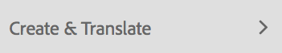
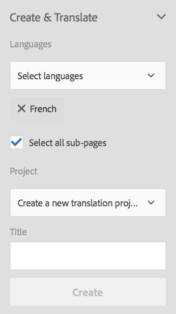

# Gestione dei progetti di traduzione{#managing-translation-projects}

Dopo aver preparato il contenuto per la traduzione, devi completare la struttura linguistica creando copie in lingua mancanti e creare progetti di traduzione.

I progetti di traduzione consentono di gestire la traduzione dei contenuti AEM. Un progetto di traduzione è un tipo di AEM [progetto](/help/sites-authoring/projects.md) che contiene risorse da tradurre in altre lingue. Queste risorse sono le pagine e le risorse delle [copie della lingua](/help/sites-administering/tc-prep.md) create dal master della lingua.

Quando si aggiungono risorse a un progetto di traduzione, viene creato un processo di traduzione per tali risorse. I processi forniscono i comandi e le informazioni sullo stato utilizzati per gestire i flussi di lavoro di traduzione umana e di traduzione automatica che vengono eseguiti sulle risorse.

>[!NOTE]
>
>Un progetto di traduzione può contenere più processi di traduzione.

I progetti di traduzione sono elementi a lungo termine, definiti per lingua e metodo/provider di traduzione per allinearsi alla governance organizzativa per la globalizzazione. Devono essere iniziati una volta, sia durante la traduzione iniziale che manualmente, e rimanere in vigore per tutto il contenuto e le attività di aggiornamento della traduzione.

I progetti e i lavori di traduzione vengono creati con flussi di lavoro di preparazione della traduzione. Questi flussi di lavoro hanno tre opzioni, sia per la traduzione iniziale (Crea&amp;Traduci) che per gli aggiornamenti (Aggiorna traduzione):

1. [Crea nuovo progetto](#creating-translation-projects-using-the-references-panel)
1. [Aggiungi al progetto esistente](#adding-pages-to-a-translation-project)
1. [Solo struttura del contenuto](#creating-the-structure-of-a-language-copy)

>[!NOTE]
>
>L&#39;opzione 3 non è correlata al lavoro/progetto di traduzione. Consente di copiare il contenuto e le modifiche strutturali nel master lingua in copie (non tradotte) della lingua. Puoi utilizzarlo per mantenere sincronizzati i master lingua, anche senza traduzione.

## Esecuzione di traduzioni iniziali e aggiornamento di traduzioni esistenti {#performing-initial-translations-and-updating-existing-translations}

AEM rileva se viene creato un progetto di traduzione per la traduzione iniziale del contenuto o per aggiornare copie in lingua già tradotte. Quando crei un progetto di traduzione per una pagina e indichi le copie della lingua per le quali stai traducendo, AEM rileva se la pagina di origine esiste già nelle copie della lingua di destinazione:

* **La copia in lingua non include la pagina:** AEM considera questa situazione come la traduzione iniziale. La pagina viene immediatamente copiata nella copia per lingua e inclusa nel progetto. Quando la pagina tradotta viene importata in AEM, AEM copiata direttamente nella copia per lingua.
* **La copia in lingua include già la pagina:** AEM considera questa situazione come una traduzione aggiornata. Viene creato un lancio e una copia della pagina viene aggiunta al lancio e inclusa nel progetto. I lanci consentono di rivedere le traduzioni aggiornate prima di inviarle alla copia per lingua:

   * Quando la pagina tradotta viene importata in AEM, sovrascrive la pagina nel lancio.
   * La pagina tradotta sovrascrive la copia in lingua solo quando viene promosso il lancio.

Ad esempio, la radice della lingua /content/geometrixx/fr viene creata per la traduzione francese della lingua master /content/geometrixx/en. Non ci sono altre pagine nella copia in lingua francese.

* Viene creato un progetto di traduzione per la pagina /content/geometrixx/en/products e per tutte le pagine figlie, con targeting per la copia in lingua francese. Poiché la copia per lingua non include la pagina /content/geometrixx/fr/products, AEM copia immediatamente la pagina /content/geometrixx/en/products e tutte le pagine figlie nella copia per lingua francese. Le copie sono incluse anche nel progetto di traduzione.
* Viene creato un progetto di traduzione per la pagina /content/geometrixx/en e per tutte le pagine figlie, con targeting per la copia in lingua francese. Poiché la copia per lingua include la pagina che corrisponde alla pagina /content/geometrixx/en (la directory principale lingua), AEM copia la pagina /content/geometrixx/en e tutte le pagine figlie e le aggiunge a un lancio. Le copie sono incluse anche nel progetto di traduzione.

## Creazione di progetti di traduzione tramite il pannello Riferimenti {#creating-translation-projects-using-the-references-panel}

Crea progetti di traduzione in modo da poter eseguire e gestire il flusso di lavoro per la traduzione delle risorse del tuo language master. Quando si creano i progetti, è possibile specificare la pagina nel master della lingua che si sta traducendo e le copie della lingua per le quali si sta eseguendo la traduzione:

* La configurazione cloud del framework di integrazione della traduzione associato alla pagina selezionata determina molte proprietà dei progetti di traduzione, ad esempio il flusso di lavoro di traduzione da utilizzare.
* Viene creato un progetto per ogni copia della lingua selezionata.
* Viene creata e aggiunta a ciascun progetto una copia della pagina selezionata e delle risorse associate. Queste copie vengono successivamente inviate al provider di traduzione per la traduzione.

È possibile specificare di selezionare anche le pagine figlie della pagina selezionata. In questo caso, a ogni progetto vengono aggiunte anche copie delle pagine figlie in modo che vengano tradotte. Quando delle pagine figlie sono associate a diverse configurazioni del framework di integrazione della traduzione, AEM crea altri progetti.

Puoi anche [creare manualmente progetti di traduzione](#creating-a-translation-project-using-the-projects-console).

>[!NOTE]
>
>Per creare un progetto, l’account deve essere membro del gruppo `project-administrators` .

**Traduzioni iniziali e aggiornamento delle traduzioni**

Il pannello Riferimenti indica se si stanno aggiornando le copie della lingua esistenti o se si sta creando la prima versione delle copie della lingua. Quando esiste una copia per lingua per la pagina selezionata, viene visualizzata la scheda Aggiorna copie per lingua per consentire l’accesso ai comandi relativi al progetto.

Dopo aver tradotto, è possibile [rivedere la traduzione](#reviewing-and-promoting-updated-content) prima di sovrascrivere con essa la copia per lingua. Se non esiste una copia per la lingua per la pagina selezionata, viene visualizzata la scheda Crea e traduci per consentire l’accesso ai comandi relativi al progetto.

### Creare progetti di traduzione per una nuova copia in lingua {#create-translation-projects-for-a-new-language-copy}

1. Usa la console Sites per selezionare la pagina che stai aggiungendo ai progetti di traduzione.

   Ad esempio, per tradurre le pagine in inglese di Geometrixx Demo Site, selezionare Geometrixx Demo Site > English.

1. Sulla barra degli strumenti, tocca o fai clic su Riferimenti.

   

1. Selezionare Copie per lingua, quindi selezionare le copie per lingua per le quali si stanno traducendo le pagine di origine.
1. Tocca o fai clic su Crea e traduci e quindi configura il processo di traduzione:

   * Utilizza l’elenco a discesa Lingue per selezionare una copia per lingua per la quale vuoi tradurre. Seleziona le lingue aggiuntive richieste. Le lingue visualizzate nell&#39;elenco corrispondono alle [radici della lingua create](/help/sites-administering/tc-prep.md#creating-a-language-root).
   * Per tradurre la pagina selezionata e tutte le pagine figlie, selezionare Seleziona tutte le sottopagine. Per tradurre solo la pagina selezionata, deselezionare l’opzione.
   * In Progetto, selezionare Crea nuovo progetto di traduzione.
   * Digita un nome per il progetto.

   

1. Tocca o fai clic su Crea.

### Creare progetti di traduzione per una copia in lingua esistente {#create-translation-projects-for-an-existing-language-copy}

1. Usa la console Sites per selezionare la pagina da aggiungere ai progetti di traduzione.

   Ad esempio, per tradurre le pagine in inglese di Geometrixx Demo Site, selezionare Geometrixx Demo Site > English.

1. Sulla barra degli strumenti, tocca o fai clic su Riferimenti.

   

1. Selezionare Copie per lingua, quindi selezionare le copie per lingua per le quali si stanno traducendo le pagine di origine.
1. Tocca o fai clic su Aggiorna copie per lingua, quindi configura il processo di traduzione:

   * Per tradurre la pagina selezionata e tutte le pagine figlie, selezionare Seleziona tutte le sottopagine. Per tradurre solo la pagina selezionata, deselezionare l’opzione.
   * In Progetto, selezionare Crea nuovo progetto di traduzione.
   * Digita un nome per il progetto.

   

1. Tocca o fai clic su Avvia .

## Aggiunta di pagine a un progetto di traduzione {#adding-pages-to-a-translation-project}

Dopo aver creato un progetto di traduzione, puoi utilizzare il riquadro Risorse per aggiungere pagine al progetto. L’aggiunta di pagine è utile quando si includono pagine di rami diversi nello stesso progetto.

Quando aggiungi delle pagine a un progetto di traduzione, queste vengono incluse in un nuovo lavoro di traduzione. È inoltre possibile [aggiungere pagine a un processo esistente](#adding-pages-assets-to-a-translation-job).

Come per la creazione di un nuovo progetto, quando si aggiungono pagine, le copie delle pagine vengono aggiunte a un lancio quando necessario per evitare la sovrascrittura delle copie in lingua esistenti. (Consulta [Creazione di progetti di traduzione per copie in lingua esistenti](#performing-initial-translations-and-updating-existing-translations).)

1. Usa la console Sites per selezionare la pagina che stai aggiungendo al progetto di traduzione.

   Ad esempio, per tradurre le pagine in inglese di Geometrixx Demo Site, selezionare Geometrixx Demo Site > English.

1. Sulla barra degli strumenti, tocca o fai clic su Riferimenti.

   

1. Selezionare Copie per lingua, quindi selezionare le copie per lingua per le quali si stanno traducendo le pagine di origine.

   

1. Tocca o fai clic su Aggiorna copie per lingua e quindi configura le proprietà:

   * Per tradurre la pagina selezionata e tutte le pagine figlie, selezionare Seleziona tutte le sottopagine. Per tradurre solo la pagina selezionata, deselezionare l’opzione.
   * Per Progetto, selezionare Aggiungi al progetto di traduzione esistente.
   * Seleziona il progetto.

   >[!NOTE]
   >
   >La lingua di destinazione impostata nel progetto di traduzione deve corrispondere al percorso della copia per lingua, come mostrato nel pannello Riferimenti.

   

1. Tocca o fai clic su Avvia .

## Aggiunta di pagine/risorse a un processo di traduzione {#adding-pages-assets-to-a-translation-job}

Puoi aggiungere pagine, risorse, tag o dizionari i18n al lavoro di traduzione del progetto di traduzione. Per aggiungere pagine o risorse:

1. Nella parte inferiore della sezione Processo di traduzione del progetto di traduzione, tocca o fai clic sui puntini di sospensione.

   

1. Tocca o fai clic su Aggiungi e pagine/risorse.

   

1. Seleziona l’elemento in alto del ramo che desideri aggiungere, quindi tocca o fai clic sull’icona del segno di spunta. È possibile effettuare una selezione multipla.

   

1. In alternativa, puoi selezionare l’icona di ricerca per cercare facilmente le pagine o le risorse da aggiungere al lavoro di traduzione.

   

Le pagine e/o le risorse vengono aggiunte al processo di traduzione.

## Aggiunta di dizionari i18n a un lavoro di traduzione {#adding-i-n-dictionaries-to-a-translation-job}

Puoi aggiungere pagine, risorse, tag o dizionari i18n al lavoro di traduzione del progetto di traduzione. Per aggiungere un dizionario i18n:

1. Nella parte inferiore della sezione Processo di traduzione del progetto di traduzione, tocca o fai clic sui puntini di sospensione.

   

1. Tocca o fai clic su Aggiungi e Dizionario I18N.

   

1. Seleziona il dizionario da aggiungere, quindi tocca o fai clic sul pulsante Aggiungi .

   

Il tuo dizionario ora è nel tuo lavoro di traduzione.

>[!NOTE]
>
>Per ulteriori informazioni sui dizionari i18n, leggere [Utilizzo di Translator per gestire i dizionari](/help/sites-developing/i18n-translator.md).

## Aggiunta di tag a un processo di traduzione {#adding-tags-to-a-translation-job}

Puoi aggiungere pagine, risorse, tag o dizionari i18n al lavoro di traduzione del progetto di traduzione. Per aggiungere tag:

1. Nella parte inferiore della sezione Processo di traduzione del progetto di traduzione, tocca o fai clic sui puntini di sospensione.

   

1. Tocca o fai clic su Aggiungi , quindi su Tag .

   

1. Seleziona i tag da aggiungere, quindi tocca o fai clic sull’icona del segno di spunta. È possibile effettuare una selezione multipla.

   

I tag vengono ora aggiunti nel processo di traduzione.

## Visualizzazione dei dettagli del progetto di traduzione {#seeing-translation-project-details}

La sezione Riepilogo di traduzione contiene le proprietà configurate per un progetto di traduzione. Oltre alle informazioni generiche [sul progetto](/help/sites-authoring/projects.md#project-info), la scheda Traduzione contiene proprietà specifiche per la traduzione:

* Lingua di origine: La lingua delle pagine che vengono tradotte.
* Lingua di destinazione: Lingua in cui le pagine vengono tradotte.
* Metodo di traduzione: Il flusso di lavoro di traduzione. È supportata la traduzione umana o la traduzione automatica.
* Provider di traduzione: Provider del servizio di traduzione che esegue la traduzione.
* Categoria di contenuto: (Traduzione automatica) La categoria di contenuto utilizzata per la traduzione.
* Configurazione cloud: Configurazione cloud per il connettore del servizio di traduzione utilizzato per il progetto.

Quando un progetto viene creato utilizzando il riquadro Risorse di una pagina, queste proprietà vengono configurate automaticamente in base alle proprietà della pagina di origine.

## Monitoraggio dello stato di un processo di traduzione {#monitoring-the-status-of-a-translation-job}

La sezione Processo di traduzione di un progetto di traduzione fornisce lo stato di un lavoro di traduzione, nonché il numero di pagine e risorse del lavoro.

La tabella seguente descrive ogni stato di un processo o di un elemento del processo:

| Stato | Descrizione |
|---|---|
| Bozza | Il processo di traduzione non è stato avviato. I lavori di traduzione sono nello stato DRAFT quando vengono creati. |
| Inviato | I file nel processo di traduzione hanno questo stato quando sono stati inviati correttamente al servizio di traduzione. Questo stato può verificarsi dopo l&#39;attivazione del comando Request Scope o Start. |
| Conteggio richiesto | Per il flusso di lavoro di traduzione umana, i file nel processo sono stati inviati al fornitore di traduzione per l&#39;ambito. Questo stato viene visualizzato dopo l&#39;attivazione del comando Request Scope (Ambito richiesta). |
| Conteggio completato | Il fornitore ha delimitato il processo di traduzione. |
| Impegnato per la traduzione | Il proprietario del progetto ha accettato l&#39;ambito. Questo stato indica che il fornitore di traduzione deve iniziare a tradurre i file nel processo. |
| Traduzione in corso | Per un processo, la traduzione di uno o più file nel processo non è ancora completa. Per un elemento del processo, l&#39;elemento viene tradotto. |
| Tradotto | Per un lavoro, la traduzione di tutti i file nel processo è completa. Per un elemento del processo, l&#39;elemento viene tradotto. |
| Pronto per la revisione | L&#39;elemento nel processo viene tradotto e il file è stato importato in AEM. |
| Completa | Il proprietario del progetto ha indicato che il contratto di traduzione è completo. |
| Annulla | Indica che il fornitore della traduzione deve interrompere il lavoro su un processo di traduzione. |
| Aggiornamento errore | Errore durante il trasferimento dei file tra AEM e il servizio di traduzione. |
| Stato sconosciuto | Errore sconosciuto. |

Per visualizzare lo stato di ciascun file nel processo, tocca o fai clic sui puntini di sospensione nella parte inferiore della tessera.

## Impostazione della data di scadenza dei processi di traduzione {#setting-the-due-date-of-translation-jobs}

Specifica la data prima della quale il fornitore di traduzione deve restituire i file tradotti. Puoi impostare la data di scadenza per il progetto o per un lavoro specifico:

* **Progetto:** i lavori di traduzione nel progetto ereditano la data di scadenza.
* **Processo:** la data di scadenza impostata per il processo sostituisce la data di scadenza impostata per il progetto.

L’impostazione della data di scadenza funziona correttamente solo quando il fornitore di traduzione utilizzato supporta questa funzione.

Nella procedura seguente viene impostata la data di scadenza per un progetto.

1. Tocca o fai clic sui puntini di sospensione nella parte inferiore della sezione Riepilogo di traduzione .

   

1. Nella scheda Base, utilizzare il selettore data della proprietà Data scadenza per selezionare la data di scadenza.

   

1. Tocca o fai clic su Fine.

Nella procedura seguente viene impostata la data di scadenza per un processo di traduzione.

1. Nella sezione Processo di traduzione, tocca o fai clic sul menu dei comandi, quindi tocca o fai clic su Data di scadenza.

   

1. Nella finestra di dialogo, fai clic o tocca l’icona del calendario, quindi seleziona la data e l’ora da utilizzare come data di scadenza, quindi fai clic su Salva.

   

## Applicazione dell’ambito a un processo di traduzione {#scoping-a-translation-job}

Ambito di un processo di traduzione per ottenere una stima del costo della traduzione dal provider di servizi di traduzione. Quando si esegue l&#39;ambito di un processo, i file di origine vengono inviati al fornitore di traduzione che confronta il testo con il proprio pool di traduzioni memorizzate (memoria di traduzione). In genere, l’ambito corrisponde al numero di parole che richiedono la traduzione.

Per ottenere ulteriori informazioni sui risultati dell&#39;ambito, contatta il fornitore della traduzione.

>[!NOTE]
>
>L&#39;ambito è facoltativo. Puoi avviare un lavoro di traduzione senza ambito.

Quando si esegue l’ambito di un processo di traduzione, lo stato del processo è `Scope Requested`. Quando il fornitore di traduzione restituisce l’ambito, lo stato viene modificato in `Scope Completed`. Al termine dell&#39;ambito è possibile utilizzare il comando Mostra ambito per esaminare i risultati dell&#39;ambito.

L’ambito funziona correttamente solo quando il fornitore di traduzione utilizzato supporta questa funzione.

1. Nella console Progetti , apri il progetto di traduzione.
1. Nella sezione Processo di traduzione, tocca o fai clic sul menu dei comandi, quindi tocca o fai clic su Request Scope (Richiedi ambito).

   

1. Quando lo stato del processo diventa SCOPE_COMPLETED, nella sezione Processo di traduzione fare clic o toccare il menu comandi, quindi fare clic o toccare Mostra ambito.

## Avvio di un processo di traduzione {#starting-a-translation-job}

Avvia un processo di traduzione per tradurre le pagine di origine nella lingua di destinazione. La traduzione viene eseguita in base ai valori delle proprietà della sezione Riepilogo di traduzione.

Dopo aver avviato il lavoro di traduzione, la sezione Processo di traduzione mostra lo stato di Traduzione in corso.

1. Nella console Progetti , apri il progetto di traduzione.
1. Nella sezione Processo di traduzione, tocca o fai clic sul menu dei comandi, quindi tocca o fai clic su Avvia.

   

1. Nella finestra di dialogo Azione che conferma l’avvio della traduzione, tocca o fai clic su Chiudi.

## Annullamento di un processo di traduzione {#canceling-a-translation-job}

Annulla un processo di traduzione per interrompere il processo di traduzione e impedire al fornitore di traduzione di eseguire ulteriori traduzioni. È possibile annullare un processo quando lo stato del processo è `Committed For Translation` o `Translation In Progress`.

1. Nella console Progetti , apri il progetto di traduzione.
1. Nella sezione Processo di traduzione, tocca o fai clic sul menu dei comandi, quindi tocca o fai clic su Annulla .
1. Nella finestra di dialogo Azione che conferma l’annullamento della traduzione, tocca o fai clic su OK.

## Accetta/Rifiuta flusso di lavoro {#accept-reject-workflow}

Quando il contenuto torna dopo la traduzione ed è in stato Pronto per la revisione, puoi accedere al lavoro di traduzione e accettare/rifiutare il contenuto.

Se selezionate Rifiuta traduzione, potete aggiungere un commento.

Il rifiuto del contenuto lo invia nuovamente al fornitore di traduzione dove sarà in grado di visualizzare il commento.

## Revisione e promozione dei contenuti aggiornati {#reviewing-and-promoting-updated-content}

Quando il contenuto viene tradotto per una copia in lingua esistente, rivedi le traduzioni, apporta modifiche se necessario e quindi promuovi le traduzioni per spostarlo nella copia in lingua. È possibile rivedere i file tradotti quando il processo di traduzione mostra lo stato Pronto per la revisione.

1. Seleziona la pagina nel master lingua, tocca o fai clic su Riferimenti, quindi tocca o fai clic su Copie per lingua.
1. Tocca o fai clic sulla copia per lingua da rivedere.

   

1. Tocca o fai clic su Launch per visualizzare i comandi relativi al lancio.

   

1. Per aprire la copia di lancio della pagina per esaminare e modificare il contenuto, fai clic su Apri pagina.
1. Dopo aver rivisto il contenuto e apportato le modifiche necessarie, per promuovere la copia del lancio fai clic su Promuovi .
1. Nella pagina Promuovi lancio , specifica quali pagine promuovere, quindi tocca o fai clic su Promuovi .

## Confronto delle copie per lingua {#comparing-language-copies}

Per confrontare Copie per lingua con il master della lingua:

1. Nella console **Sites** , individua la copia per lingua da confrontare.
1. Apri il pannello **[Riferimenti](/help/sites-authoring/basic-handling.md#references)** .
1. Sotto l&#39;intestazione **Copie** selezionare **Copie per lingua.**
1. Seleziona la tua copia in lingua specifica e puoi fare clic su **Confronta con principale **o **Confronta con precedente **se applicabile.

   

1. Le due pagine (di lancio e di origine) verranno aperte una accanto all&#39;altra.

   Per informazioni complete sull&#39;utilizzo di questa funzionalità, consulta [Differenze tra pagine](/help/sites-authoring/page-diff.md).

## Completamento e archiviazione dei processi di traduzione {#completing-and-archiving-translation-jobs}

Completa un lavoro di traduzione dopo aver esaminato i file tradotti dal fornitore. Per i flussi di lavoro di traduzione umana, il completamento di una traduzione indica al fornitore che il contratto di traduzione è stato soddisfatto e che deve salvare la traduzione nella propria memoria di traduzione.

Dopo aver completato il processo, il processo ha lo stato Completato.

Archivia un processo di traduzione al termine e non è più necessario visualizzare i dettagli dello stato del processo. Quando archivi il lavoro, la sezione Processo di traduzione viene rimossa dal progetto.

## Creazione della struttura di una copia in lingua {#creating-the-structure-of-a-language-copy}

Compilare la copia per lingua in modo che contenga il contenuto della lingua master che si sta traducendo. Prima di compilare la copia per lingua, è necessario aver [creato la directory principale lingua](/help/sites-administering/tc-prep.md#creating-a-language-root) della copia per lingua.

1. Utilizzare la console Sites per selezionare la directory principale della lingua principale utilizzata come origine. Ad esempio, per tradurre le pagine in inglese del sito Demo di Geometrixx, selezionare Contenuto > Sito demo di Geometrixx > Inglese.
1. Sulla barra degli strumenti, tocca o fai clic su Riferimenti.

   

1. Selezionare Copie per lingua, quindi selezionare le copie per lingua da compilare.

   

1. Tocca o fai clic su Aggiorna copie per visualizzare gli strumenti di traduzione e configurare le proprietà:

   * Selezionare l’opzione Seleziona tutte le sottopagine.
   * Per Progetto, selezionare Crea solo struttura.

   

1. Tocca o fai clic su Avvia .

## Creazione di un progetto di traduzione tramite la console Progetti {#creating-a-translation-project-using-the-projects-console}

Puoi creare manualmente un progetto di traduzione se preferisci utilizzare la console Progetti .

>[!NOTE]
>
>Per creare un progetto, l’account deve essere membro del gruppo `project-administrators` .

Quando crei manualmente un progetto di traduzione, devi fornire valori per le seguenti proprietà relative alla traduzione in aggiunta alle proprietà di base [a1/>:](/help/sites-authoring/touch-ui-managing-projects.md#creating-a-project)

* **Nome:** nome del progetto.
* **Lingua sorgente:** la lingua del contenuto sorgente.
* **Lingua di destinazione:** la lingua in cui il contenuto viene tradotto.
* **Metodo di traduzione:** seleziona Traduzione umana per indicare che la traduzione deve essere eseguita manualmente.

1. Nella barra degli strumenti della console Progetti , tocca o fai clic su Crea .
1. Seleziona il modello Progetto di traduzione, quindi tocca o fai clic su Avanti.
1. Immettere i valori per le proprietà Base.
1. Tocca o fai clic su Avanzate e fornisci valori per le proprietà relative alla traduzione.
1. Tocca o fai clic su Crea. Nella casella di conferma, tocca o fai clic su Fine per tornare alla console Progetti oppure tocca o fai clic su Apri progetto per aprire e iniziare a gestire il progetto.

## Esportazione di un processo di traduzione {#exporting-a-translation-job}

È possibile scaricare il contenuto di un processo di traduzione, ad esempio per inviare a un provider di traduzione che non è integrato con AEM tramite un connettore, o per esaminare il contenuto.

1. Dal menu a discesa del riquadro Processo di traduzione, tocca o fai clic su Esporta.
1. Nella finestra di dialogo Esporta, fare clic o toccare Scarica file esportato e, se necessario, utilizzare la finestra di dialogo del browser Web per salvare il file.
1. Nella finestra di dialogo Esporta, fai clic o tocca Chiudi.

## Importazione di un processo di traduzione {#importing-a-translation-job}

Puoi importare contenuti tradotti in AEM, ad esempio quando il provider di traduzione li invia a te perché non sono integrati con AEM tramite un connettore.

1. Dal menu a discesa del riquadro Processo di traduzione, tocca o fai clic su Importa.
1. Utilizzare la finestra di dialogo del browser Web per selezionare il file da importare.
1. Nella finestra di dialogo Importa fare clic o toccare Chiudi.

