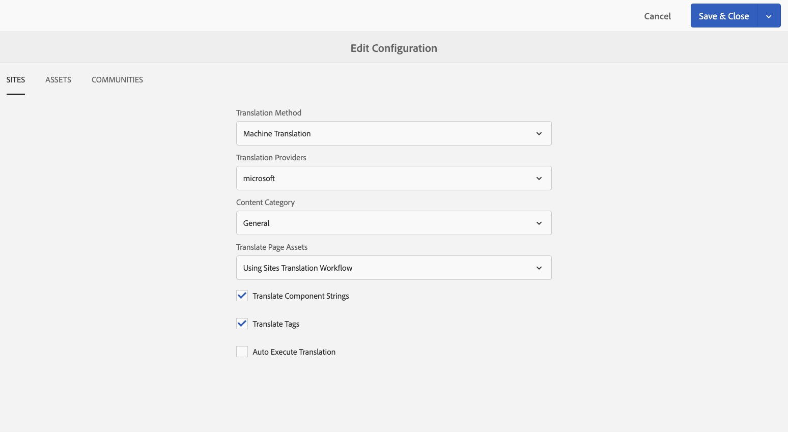

# Configurazione di Translation Integration Framework{#configuring-the-translation-integration-framework}

Il framework di integrazione della traduzione si integra con servizi di traduzione di terze parti per orchestrare la traduzione dei contenuti AEM.

* Connettiti al provider del servizio di traduzione.
* Creare una configurazione di Translation Integration Framework.
* Associate le configurazioni cloud alle pagine.

Per una panoramica delle funzioni di traduzione del contenuto in AEM, consultate [Translating Content for Multilingual Sites](/help/sites-administering/translation.md) (Traduzione del contenuto per siti multilingue).

## Connessione a un provider di servizi di traduzione {#connecting-to-a-translation-service-provider}

Crea una configurazione cloud che si connetta AEM al provider del servizio di traduzione. AEM include la capacità di connettersi a Microsoft Translator per impostazione predefinita.
I seguenti fornitori di traduzione forniscono un&#39;implementazione della nuova API per i progetti di traduzione. Collegamenti per ulteriori informazioni sull&#39;integrazione:

* [Translations.com](https://exchange.adobe.com/experiencecloud.details.90104.globallink-connect-plus-for-aem.html) ( Adobe Exchange Premier Partner)
* [Tecnologie per tablet argilla](https://exchange.adobe.com/experiencecloud.details.90064.clay-tablet-translation-for-experience-manager.html)
* [Lionbridge](https://exchange.adobe.com/experiencecloud.details.100064.lionbridge-connector-for-experience-manager-63.html)
* [Memsource](https://exchange.adobe.com/experiencecloud.details.103166.memsource-connector-for-adobe-experience-manager.html)
* [Cloudwords](https://exchange.adobe.com/experiencecloud.details.90019.html)
* [CrossLang NV](https://exchange.adobe.com/experiencecloud.details.90049.crosslang-xtm-for-adobe-experience-manager.html)
* [Lingotek](https://exchange.adobe.com/experiencecloud.details.90088.lingotek-collaborative-translation-platform.html)
* [Smartphone](https://exchange.adobe.com/experiencecloud.details.90101.smartling-connector-for-adobe-experience-manager.html)
* [SDL](https://exchange.adobe.com/experiencecloud.details.100110.sdl-translation-management.html)
* [Systran](https://exchange.adobe.com/experiencecloud.details.90233.systran-for-adobe-experience-manager.html)
* [Altlang](https://exchange.adobe.com/experiencecloud.details.90222.altlang.html)
* Microsoft (Microsoft Translator è preinstallato in AEM)

>[!NOTE]
>
>Per trovare l&#39;ultimo elenco di fornitori di traduzioni umane e automatiche, date un&#39;occhiata a queste pagine:
>
>
>* [AEM](https://www.adobe.com/go/aem-human-translation-connectors)
>* [AEM](https://www.adobe.com/go/aem-machine-translation-connectors)

>

Dopo aver installato un pacchetto di connettore, potete creare una configurazione cloud per il connettore. In genere, è necessario fornire le credenziali per l&#39;autenticazione con il servizio di traduzione. Per informazioni sull&#39;aggiunta di una configurazione cloud per il connettore Microsoft Translator, vedere [Integrazione con Microsoft Translator](/help/sites-administering/tc-msconf.md).

Se necessario, è possibile creare più configurazioni cloud per lo stesso connettore. Ad esempio, creare una configurazione per ciascuno degli account o dei progetti che si dispone con lo stesso fornitore.

Dopo aver configurato una connessione, potete creare la configurazione del framework di integrazione di conversione che la utilizza.

## Creazione di una configurazione dell&#39;integrazione di conversione {#creating-a-translation-integration-configuration}

Create una configurazione del framework di integrazione della traduzione per specificare come tradurre il contenuto. La configurazione include le informazioni seguenti:

* Quale provider di servizi di traduzione utilizzare.
* Se la traduzione umana o automatica deve essere eseguita.
* Se tradurre altro contenuto associato a una pagina o a una risorsa, ad esempio i tag.

Dopo aver creato una configurazione di framework, potete associare la configurazione cloud alle pagine che desiderate tradurre in base alla configurazione. Quando il processo di traduzione viene avviato, il flusso di lavoro di traduzione procede in base alla configurazione framework associata.

Se diverse sezioni del sito Web presentano requisiti di traduzione diversi, create di conseguenza più configurazioni del framework. Ad esempio, un sito Web multilingue include copie in lingua inglese, spagnola e giapponese. Il proprietario del sito utilizza due diversi provider di servizi di traduzione per le traduzioni in spagnolo e giapponese. Pertanto, sono configurate due configurazioni del framework. Ogni configurazione utilizza un provider di servizi di traduzione diverso.

Dopo aver configurato un framework di integrazione della traduzione, potete [associarlo alle pagine](/help/sites-administering/tc-prep.md) che lo utilizzano.

**Nota:** per una panoramica delle funzioni di traduzione del contenuto in AEM, consultate  [Traduzione del contenuto per siti](/help/sites-administering/translation.md) multilingue.

Una singola configurazione del framework controlla come tradurre il contenuto delle pagine, il contenuto delle community e le risorse.

### Proprietà configurazione siti {#sites-configuration-properties}

Le proprietà Siti controllano il modo in cui viene eseguita la conversione del contenuto della pagina.

<table>
 <tbody>
  <tr>
   <th>Proprietà</th>
   <th>Descrizione</th>
  </tr>
  <tr>
   <td>Flusso di lavoro per traduzione</td>
   <td>
Selezionate il metodo di traduzione che il framework esegue per il contenuto del sito:

    <ul>
     <li>Traduzione automatica: Il provider di traduzione esegue la traduzione utilizzando la traduzione automatica in tempo reale.</li>
     <li>Traduzione umana: Il contenuto viene inviato al provider di traduzione affinché venga tradotto dai traduttori. </li>
     <li>Non tradurre: Il contenuto non viene inviato per la traduzione. Questo consente di saltare alcuni rami di contenuto che non sarebbero stati tradotti ma che potrebbero essere aggiornati con i contenuti più recenti.</li>
    </ul> </td>
  </tr>
  <tr>
   <td>Provider traduzione</td>
   <td>Selezionate il provider di traduzione per eseguire la traduzione. Un provider viene visualizzato nell'elenco quando è installato il connettore corrispondente.</td>
  </tr>
  <tr>
   <td>Categoria contenuto</td>
   <td>(Solo traduzione automatica) Una categoria che descrive il contenuto che si sta traducendo. La categoria può influenzare la scelta della terminologia e della formulazione quando si traduce il contenuto.</td>
  </tr>
  <tr>
   <td>Traduci tag</td>
   <td>Consente di tradurre i tag associati alla pagina.</td>
  </tr>
  <tr>
   <td>Traduci risorse di pagina</td>
   <td>
Selezionate come tradurre le risorse aggiunte ai componenti dal file system o a cui si fa riferimento da Risorse:

    <ul>
     <li>Non tradurre: Le risorse di pagina non vengono convertite.</li>
     <li>Utilizzo del flusso di lavoro di traduzione Siti: Le risorse vengono gestite in base alle proprietà di configurazione della scheda Siti.</li>
     <li>Utilizzo del flusso di lavoro di traduzione Risorse: Le risorse vengono gestite in base alla configurazione delle proprietà nella scheda Risorse.</li>
    </ul> </td>
  </tr>
  <tr>
   <td>Esecuzione automatica della conversione</td>
   <td>Selezionate questa opzione per eseguire automaticamente i processi di traduzione dopo la creazione dei progetti di traduzione. Non potete rivedere e ampliare il processo di traduzione quando selezionate questa opzione.</td>
  </tr>
 </tbody>
</table>

### Proprietà configurazione community {#communities-configuration-properties}

Le proprietà Community controllano il modo in cui viene eseguita la conversione del contenuto generato dall&#39;utente. La traduzione del contenuto generato dall&#39;utente utilizza sempre la traduzione automatica. Per ulteriori informazioni, vedere [Traduzione di contenuti generati dall&#39;utente](/help/communities/translate-ugc.md).

| Proprietà | Descrizione |
|---|---|
| Provider traduzione | Selezionate il provider di traduzione per eseguire la traduzione. Nell&#39;elenco viene visualizzato il provider per il quale vengono create le configurazioni cloud. |
| Categoria contenuto | Una categoria che descrive il contenuto da tradurre. La categoria può influenzare la scelta della terminologia e della formulazione quando si traduce il contenuto. |
| Scegliete Un&#39;Impostazione Internazionale Da Utilizzare Come Store Di Condivisione Globale | (Facoltativo) Selezionando una lingua per la memorizzazione UGC, i post di tutte le copie della lingua verranno visualizzati in un&#39;unica conversazione globale. Per convenzione, scegliete le impostazioni internazionali per la [lingua di base](/help/communities/sites-console.md#translation) del sito Web. Se scegliete Nessuno store comune, la traduzione globale verrà disabilitata. Per impostazione predefinita, la traduzione globale è disabilitata. |

### Proprietà di configurazione delle risorse {#assets-configuration-properties}

Le proprietà delle risorse controllano come configurare le risorse. Per ulteriori informazioni sulla conversione delle risorse, consultate [Creazione di copie della lingua per le risorse](/help/assets/translation-projects.md).

<table>
 <tbody>
  <tr>
   <th>Proprietà</th>
   <th>Descrizione</th>
  </tr>
  <tr>
   <td>Flusso di lavoro per traduzione</td>
   <td>
Selezionate il tipo di traduzione che il framework esegue per le risorse:

    <ul>
     <li>Traduzione automatica: Il provider di traduzione esegue la traduzione immediatamente utilizzando la traduzione automatica.</li>
     <li>Traduzione umana: Il contenuto viene inviato automaticamente al provider di traduzione per essere tradotto manualmente. </li>
     <li>Non tradurre: Le risorse non vengono inviate per la traduzione.</li>
    </ul> </td>
  </tr>
  <tr>
   <td>Provider traduzione</td>
   <td>Selezionate il provider di traduzione per eseguire la traduzione. Un provider viene visualizzato nell'elenco quando è installato il connettore corrispondente.</td>
  </tr>
  <tr>
   <td>Categoria contenuto</td>
   <td>(Solo traduzione automatica) Una categoria che descrive il contenuto che si sta traducendo. La categoria può influenzare la scelta della terminologia e della formulazione quando si traduce il contenuto.</td>
  </tr>
  <tr>
   <td>Traduci risorse</td>
   <td>Selezionate questa opzione per includere le risorse nel progetto di traduzione. </td>
  </tr>
  <tr>
   <td>Traduci metadati</td>
   <td>Selezionate questa opzione per tradurre i metadati delle risorse.</td>
  </tr>
  <tr>
   <td>Traduci tag</td>
   <td>Consente di tradurre i tag associati alla risorsa.</td>
  </tr>
  <tr>
   <td>Esecuzione automatica della conversione</td>
   <td>Selezionate questa opzione per eseguire automaticamente i processi di traduzione dopo la creazione dei progetti di traduzione. Non potete rivedere o ampliare il processo di traduzione quando selezionate questa opzione.</td>
  </tr>
 </tbody>
</table>

1. Nella barra laterale, fate clic o toccate Strumenti > Operazioni > Cloud > Cloud Services.
1. Nell&#39;area Integrazione traduzione, se sono state create configurazioni, il collegamento viene visualizzato:

   * Se non è stata creata alcuna configurazione, tocca o fai clic su Configura ora.
   * Se le configurazioni già esistono, tocca o fai clic su Mostra configurazioni, quindi tocca o fai clic sul collegamento + visualizzato accanto a Configurazioni disponibili.

1. Digitate un nome per la configurazione e quindi fate clic o toccate Crea.
1. Configura le proprietà nella scheda Siti, Comunità e Risorse, quindi tocca o fai clic su OK.

## Configurazione delle pagine per la traduzione {#configuring-pages-for-translation}

Per configurare la traduzione delle pagine di origine in altre lingue, associa le pagine alle seguenti configurazioni cloud:

* Configurazione cloud che si collega AEM al provider di traduzione.
* Il framework di integrazione della traduzione che configura i dettagli della traduzione.

La configurazione cloud del framework di integrazione della traduzione identifica la configurazione cloud da utilizzare per la connessione al provider di servizi. Quando associate una pagina di origine a una configurazione cloud di framework, la pagina deve essere associata alla configurazione cloud del provider di servizi utilizzata dalla configurazione cloud del framework.

Quando si associa una pagina a una configurazione cloud, i discendenti della pagina ereditano l&#39;associazione. Ad esempio, se si associa la pagina /content/geometrixx/en/products a un framework di integrazione delle traduzioni, la pagina Prodotti e tutte le pagine sottostanti vengono convertite in base al framework.

Se necessario, è possibile ignorare l&#39;associazione in una pagina discendente. Ad esempio, il contenuto di un sito Web riguarda principalmente l&#39;abbigliamento. Tuttavia, un ramo di pagine descrive la società. La pagina principale del sito è associata a un framework di integrazione traduzione che specifica la conversione automatica utilizzando la categoria Abbigliamento. Il ramo che descrive la società utilizza un framework che esegue la traduzione automatica utilizzando la categoria Generale.

Inoltre, per tutte le comunità [componenti SCF](/help/communities/scf.md) nelle pagine, il contenuto generato dall&#39;utente (UGC) includerà la possibilità per gli utenti di tradurre il contenuto. Per ulteriori informazioni, vedere [Traduzione del contenuto generato dall&#39;utente](/help/communities/translate-ugc.md).

### Associazione di una pagina a un provider di traduzione {#associating-a-page-with-a-translation-provider}

Associate una pagina al provider di traduzione che utilizzate per tradurre la pagina e le pagine discendenti.

1. Nella console Siti, selezionate la pagina da configurare e toccate o fate clic su Visualizza proprietà.
1. Tocca o fai clic su Modifica, quindi tocca o fai clic sulla scheda Cloud Services.
1. Tocca o fai clic su Aggiungi configurazione > Integrazione traduzione.
1. Selezionate il provider di traduzione da utilizzare, quindi toccate o fate clic su Fine.

### Associazione di pagine a un framework di integrazione della traduzione {#associating-pages-with-a-translation-integration-framework}

Associate una pagina al framework di integrazione della traduzione che definisce il modo in cui desiderate eseguire la traduzione della pagina e delle pagine discendenti.

1. Nella console Siti, selezionate la pagina da configurare e toccate o fate clic su Visualizza proprietà.
1. Tocca o fai clic su Modifica, quindi tocca o fai clic sulla scheda Cloud Services.
1. Tocca o fai clic su Aggiungi configurazione > Integrazione traduzione.
1. Selezionate il framework di integrazione della conversione da utilizzare, quindi fate clic o toccate Fine.

