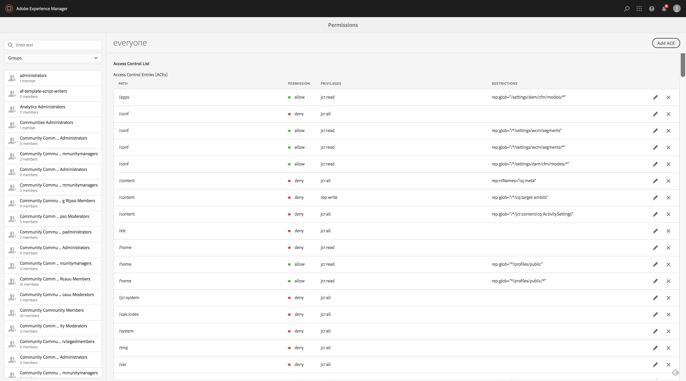

# Visualizzazione entità per la gestione delle autorizzazioni{#principal-view-for-permissions-management}

## Panoramica {#overview}

AEM 6.5 introduce la gestione delle autorizzazioni per utenti e gruppi. La funzionalità principale rimane la stessa dell’interfaccia classica, ma è più semplice da usare ed efficiente.

## Guida all’uso {#how-to-use}

### Accesso all’interfaccia utente {#accessing-the-ui}

La nuova gestione delle autorizzazioni basata sull’interfaccia utente è accessibile tramite la scheda Autorizzazioni in Sicurezza, come illustrato di seguito:

La nuova visualizzazione consente di esaminare più facilmente l’intero insieme di privilegi e restrizioni per una determinata entità principale in tutti i percorsi in cui sono state concesse esplicitamente le autorizzazioni. Questo elimina la necessità di passare a

CRXDE per gestire privilegi e restrizioni avanzati. È stato consolidato nella stessa visualizzazione. Il valore predefinito della visualizzazione è Gruppo &quot;tutti&quot;.

È disponibile un filtro che consente all’utente di selezionare il tipo di entità da esaminare **Utenti**, **Gruppi**, o **Tutti** e cerca un’entità principale **.**

### Visualizzazione delle autorizzazioni per un’entità {#viewing-permissions-for-a-principal}

Il frame a sinistra consente agli utenti di scorrere verso il basso per trovare un’entità principale o cercare un gruppo o un utente in base al filtro selezionato, come illustrato di seguito:

Facendo clic sul nome, a destra vengono visualizzate le autorizzazioni assegnate. Nel riquadro delle autorizzazioni viene visualizzato l&#39;elenco delle voci di controllo di accesso in percorsi specifici con le limitazioni configurate.

### Aggiunta di una nuova voce di controllo di accesso per un&#39;entità {#adding-new-access-control-entry-for-a-principal}

È possibile aggiungere nuove autorizzazioni aggiungendo una nuova voce di controllo degli accessi facendo clic sul pulsante Aggiungi voce ACE.

Viene visualizzata la finestra mostrata di seguito. Il passaggio successivo consiste nel scegliere un percorso in cui configurare l’autorizzazione.

Qui selezioniamo un percorso per il quale desideri configurare un’autorizzazione **dam-users**:

Dopo aver selezionato il percorso, il flusso di lavoro torna a questa schermata, in cui l’utente può quindi selezionare uno o più privilegi dagli spazi dei nomi disponibili (come `jcr`, `rep` o `crx`) come mostrato di seguito.

I privilegi possono essere aggiunti effettuando una ricerca utilizzando il campo di testo e selezionando dall’elenco.

>[!NOTE]
>
>Per un elenco completo dei privilegi e delle descrizioni, vedere [questa pagina](/help/sites-administering/user-group-ac-admin.md#access-right-management).

 

Dopo aver selezionato l&#39;elenco dei privilegi, l&#39;utente può scegliere il Tipo di autorizzazione: Nega o Consenti, come illustrato di seguito.

 

### Utilizzo delle restrizioni {#using-restrictions}

Oltre all’elenco dei privilegi e al tipo di autorizzazione su un determinato percorso, questa schermata consente anche di aggiungere restrizioni per il controllo degli accessi a grana fine, come illustrato di seguito:

>[!NOTE]
>
>Per ulteriori informazioni sul significato di ciascuna restrizione, consulta [la documentazione di Jackrabbit Oak](https://jackrabbit.apache.org/oak/docs/security/authorization/restriction.html).

Le restrizioni possono essere aggiunte come mostrato di seguito scegliendo il tipo di restrizione, immettendo il valore e premendo il tasto **+** icona.

 

La nuova voce ACE viene visualizzata nell&#39;elenco di controllo di accesso come illustrato di seguito. Tieni presente che `jcr:write` è un privilegio aggregato che include `jcr:removeNode` che è stato aggiunto in precedenza, ma non è mostrato di seguito come suo coperto in `jcr:write`.

### Modifica delle ACE {#editing-aces}

Le voci di controllo di accesso possono essere modificate selezionando un&#39;entità principale e scegliendo l&#39;ACE che si desidera modificare.

Ad esempio, qui è possibile modificare la voce seguente per **dam-users** facendo clic sull’icona della matita a destra:

Viene visualizzata la schermata di modifica con ACE configurati preselezionati. Per eliminarli, fai clic sull’icona a forma di croce accanto a essi oppure puoi aggiungere nuovi privilegi per il percorso specificato, come illustrato di seguito.

Stiamo aggiungendo il `addChildNodes` privilegio per **dam-users** nel percorso specificato.

Le modifiche possono essere salvate facendo clic su **Salva** in alto a destra, e le modifiche si rifletteranno nelle nuove autorizzazioni per **dam-users** come mostrato di seguito:

### Eliminazione di ACE {#deleting-aces}

È possibile eliminare le voci di controllo di accesso per rimuovere tutte le autorizzazioni concesse a un utente/gruppo/ruolo in un percorso specifico. L&#39;icona X accanto a ACE può essere utilizzata per eliminarla come illustrato di seguito:

 

### Combinazioni di privilegi dell’interfaccia classica {#classic-ui-privilege-combinations}

La nuova interfaccia utente delle autorizzazioni utilizza esplicitamente il set di privilegi di base invece di combinazioni predefinite che non riflettevano realmente i privilegi sottostanti concessi.

Ciò ha causato confusione su ciò che è esattamente configurato. Nella tabella seguente viene elencato il mapping tra le combinazioni di privilegi dell’interfaccia classica e i privilegi effettivi che le costituiscono:

<table>
 <tbody>
  <tr>
   <th>Combinazioni di privilegi dell’interfaccia classica</th>
   <th>Autorizzazioni UI Privilegio</th>
  </tr>
  <tr>
   <td>Leggi</td>
   <td><code>jcr:read</code></td>
  </tr>
  <tr>
   <td>Modifica</td>
   <td>
<code>jcr:modifyProperties</code>
 
<code>jcr:lockManagement</code>
 
<code>jcr:versionManagement</code>
 </td>
  </tr>
  <tr>
   <td>Creare</td>
   <td>
<code>jcr:addChildNodes</code>
 
<code>jcr:nodeTypeManagement</code>
 </td>
  </tr>
  <tr>
   <td>Eliminare</td>
   <td>
<code>jcr:removeNode</code>
 
<code>jcr:removeChildNodes</code>
 </td>
  </tr>
  <tr>
   <td>Leggi ACL</td>
   <td><code>jcr:readAccessControl</code></td>
  </tr>
  <tr>
   <td>Modifica ACL</td>
   <td><code>jcr:modifyAccessControl</code></td>
  </tr>
  <tr>
   <td>Replica</td>
   <td><code>crx:replicate</code></td>
  </tr>
 </tbody>
</table>
