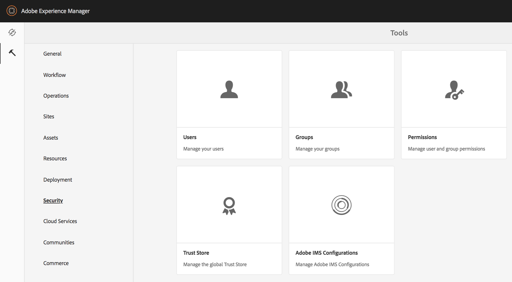
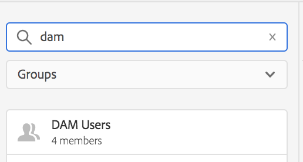
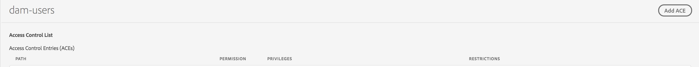
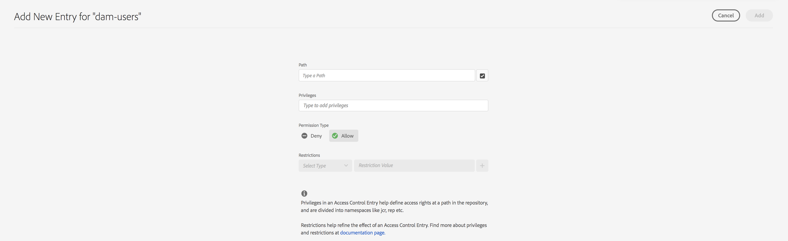
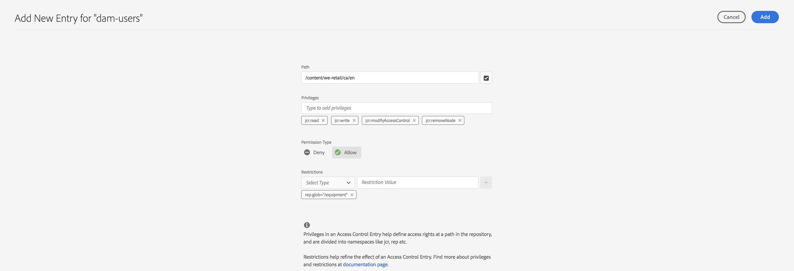
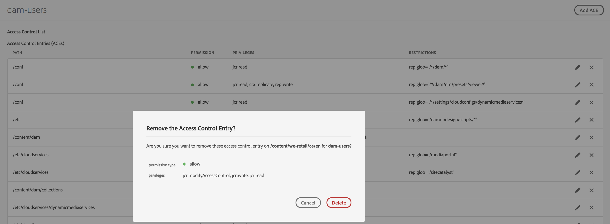

# Visualizzazione principale per la gestione delle autorizzazioni{#principal-view-for-permissions-management}

## Panoramica {#overview}

AEM 6.5 introduce la gestione delle autorizzazioni per utenti e gruppi. La funzionalità principale rimane la stessa dell’interfaccia classica, ma è più semplice ed efficiente.

## Guida all’uso {#how-to-use}

### Accesso all’interfaccia utente {#accessing-the-ui}

La nuova gestione delle autorizzazioni basata sull’interfaccia utente è accessibile tramite la scheda Autorizzazioni in Sicurezza, come illustrato di seguito:

La nuova visualizzazione consente di esaminare più facilmente l’intero insieme di privilegi e restrizioni per una determinata entità principale in tutti i percorsi in cui sono state concesse esplicitamente le autorizzazioni. Questa interfaccia elimina la necessità di passare a

CRXDE per gestire privilegi e restrizioni avanzati. È stato consolidato nella stessa visualizzazione. Il valore predefinito della visualizzazione è Gruppo &quot;tutti&quot;.

È disponibile un filtro che consente all’utente di selezionare il tipo di entità principali da esaminare: **Utenti**, **Gruppi** o **Tutti** e cercare qualunque entità&#x200B;**.**

### Visualizzazione delle autorizzazioni per un’entità principale {#viewing-permissions-for-a-principal}

Il riquadro a sinistra consente agli utenti di scorrere verso il basso per trovare un’entità principale o cercare un gruppo o un utente in base al filtro selezionato, come illustrato di seguito:

Facendo clic sul nome, a destra vengono visualizzate le autorizzazioni assegnate. Il riquadro delle autorizzazioni mostra l’elenco delle voci di controllo degli accessi in percorsi specifici con le restrizioni configurate.

### Aggiunta di una nuova voce di controllo degli accessi per un’entità principale {#adding-new-access-control-entry-for-a-principal}

È possibile aggiungere nuove autorizzazioni aggiungendo una voce di controllo degli accessi. È sufficiente fare clic sul pulsante Aggiungi ACE.

Questo fa apparire la finestra mostrata di seguito. Il passaggio successivo consiste nello scegliere un percorso in cui configurare l’autorizzazione.

In questo caso, viene selezionato un percorso in cui è possibile configurare un’autorizzazione per **dam-users**:

Dopo aver selezionato il percorso, il flusso di lavoro torna a questa schermata, in cui l’utente può selezionare uno o più privilegi dagli spazi dei nomi disponibili (ad esempio `jcr`, `rep` o `crx`) come mostrato di seguito.

I privilegi possono essere aggiunti effettuando una ricerca dal campo di testo e selezionando dall’elenco.

>[!NOTE]
>
>Per un elenco completo dei privilegi e delle descrizioni, consulta [Gestione di utenti, gruppi e dei diritti di accesso](/help/sites-administering/user-group-ac-admin.md#access-right-management).

 

Dopo aver selezionato l’elenco dei privilegi, l’utente può scegliere il tipo di autorizzazione: Nega o Consenti, come mostrato di seguito.

 

### Utilizzo delle restrizioni {#using-restrictions}

Oltre all’elenco dei privilegi e al tipo di autorizzazione su un determinato percorso, questa schermata consente di aggiungere restrizioni per il controllo degli accessi a grana fine, come illustrato di seguito:

>[!NOTE]
>
>Per ulteriori informazioni sul significato di ciascuna restrizione, consulta [la documentazione Jackrabbit Oak](https://jackrabbit.apache.org/oak/docs/security/authorization/restriction.html).

Le restrizioni possono essere aggiunte, come mostrato di seguito, scegliendo il tipo, immettendo il valore e premendo l’icona **+**.

 

La nuova ACE viene riflessa nell’elenco di controllo degli accessi, come illustrato di seguito. Si noti che `jcr:write` è un privilegio aggregato che include `jcr:removeNode` aggiunto in precedenza, ma non mostrato in quanto coperto in `jcr:write`.

### Modifica delle ACE {#editing-aces}

Le voci di controllo degli accessi (ACE) possono essere modificate selezionando un’entità principale e scegliendo l’ACE che si desidera modificare.

Ad esempio, facendo clic sull’icona a forma di matita a destra puoi modificare la voce seguente per **dam-users**:

Viene visualizzata la schermata di modifica con preselezionate le ACE configurate. Per eliminarle, fai clic sull’icona a forma di croce accanto ad esse oppure puoi aggiungere nuovi privilegi per il percorso specificato, come mostrato di seguito.

Qui viene aggiunto il privilegio `addChildNodes` per **dam-users** sul percorso specificato.

Le modifiche possono essere salvate facendo clic sul pulsante **Salva** in alto a destra e si riflettono nelle nuove autorizzazioni per **dam-users**, come illustrato di seguito:

### Eliminazione delle ACE {#deleting-aces}

È possibile eliminare le voci di controllo degli accessi per rimuovere tutte le autorizzazioni concesse a un’entità principale in un percorso specifico. L’icona X accanto all’ACE può essere utilizzata per eliminarla come illustrato di seguito:

 

### Combinazioni di privilegi dell’interfaccia classica {#classic-ui-privilege-combinations}

La nuova interfaccia utente delle autorizzazioni utilizza esplicitamente il set di privilegi di base invece di combinazioni predefinite che non riflettono realmente la precisione dei privilegi sottostanti concessi.

Si trattava di un sistema che causava confusione su ciò che veniva esattamente configurato. Nella tabella seguente viene elencata la mappatura tra le combinazioni di privilegi dell’interfaccia classica e i privilegi effettivi che le costituiscono:

<table>
 <tbody>
  <tr>
   <th>Combinazioni di privilegi dell’interfaccia classica</th>
   <th>Privilegio nell’interfaccia utente Autorizzazioni</th>
  </tr>
  <tr>
   <td>Lettura</td>
   <td><code>jcr:read</code></td>
  </tr>
  <tr>
   <td>Modificare</td>
   <td>
<code>jcr:modifyProperties</code>
 
<code>jcr:lockManagement</code>
 
<code>jcr:versionManagement</code>
 </td>
  </tr>
  <tr>
   <td>Creare</td>
   <td>
<code>jcr:addChildNodes</code>
 
<code>jcr:nodeTypeManagement</code>
 </td>
  </tr>
  <tr>
   <td>Eliminare</td>
   <td>
<code>jcr:removeNode</code>
 
<code>jcr:removeChildNodes</code>
 </td>
  </tr>
  <tr>
   <td>Leggere le ACL</td>
   <td><code>jcr:readAccessControl</code></td>
  </tr>
  <tr>
   <td>Modificare le ACL</td>
   <td><code>jcr:modifyAccessControl</code></td>
  </tr>
  <tr>
   <td>Replicare</td>
   <td><code>crx:replicate</code></td>
  </tr>
 </tbody>
</table>
