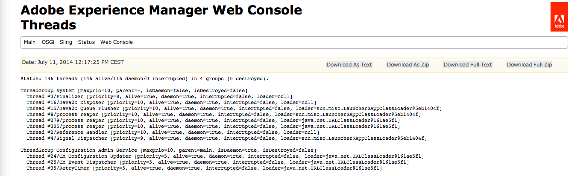

# Risoluzione dei problemi AEM {#troubleshooting-aem}

La sezione seguente illustra alcuni problemi che potresti riscontrare durante l’utilizzo di AEM, oltre a suggerimenti su come risolverli.

>[!NOTE]
>
>Se stai risolvendo i problemi di authoring in AEM, vedi [Risoluzione dei problemi relativi agli autori.](/help/sites-authoring/troubleshooting.md)

>[!NOTE]
>
>Quando si verificano problemi, è anche utile controllare l’elenco dei [Problemi noti](/help/release-notes/release-notes.md) per l’istanza (release e service pack).

## Scenari di risoluzione dei problemi per gli amministratori {#troubleshooting-scenarios-for-administrators}

La tabella seguente fornisce una panoramica dei problemi che gli amministratori possono dover risolvere:

<table>
 <tbody>
  <tr>
   <td><strong>Ruolo/i</strong></td>
   <td><strong>Problema </strong></td>
  </tr>
  <tr>
   <td>Amministratore di sistema</td>
   <td>
Fare doppio clic sul file jar Quickstart non ha alcun effetto o apre il file jar con un altro programma (ad esempio, gestione archivi)
 </td>
  </tr>
  <tr>
   <td>
Amministratore di sistema
 </td>
   <td>
La mia applicazione in esecuzione su CRX genera errori di memoria esaurita
 </td>
  </tr>
  <tr>
   <td>
Amministratore di sistema
 </td>
   <td>
La schermata di benvenuto AEM non viene visualizzata nel browser dopo aver fatto doppio clic AEM CM Quickstart
 </td>
  </tr>
  <tr>
   <td>
Amministratore di sistema
 
utente amministratore
 </td>
   <td>
Creazione di un dump di thread
 </td>
  </tr>
  <tr>
   <td>
Amministratore di sistema
 
utente amministratore
 </td>
   <td>
Verifica di sessioni JCR non chiuse
 </td>
  </tr>
 </tbody>
</table>

## Problemi di installazione {#installation-issues}

Vedi [Problemi comuni di installazione](/help/sites-deploying/troubleshooting.md#common-installation-issues) per informazioni sui seguenti scenari di risoluzione dei problemi:

* Un doppio clic sul jar Quickstart non ha alcun effetto oppure il file JAR viene aperto in un altro programma (ad esempio un gestore di archivi).
* Le applicazioni eseguite su CRX generano errori di esaurimento della memoria.
* La schermata di benvenuto di AEM non viene visualizzata nel browser quando si fa doppio clic su AEM Quickstart.

## Metodi per la risoluzione dei problemi di analisi {#methods-for-troubleshooting-analysis}

### Creazione di un dump di thread {#making-a-thread-dump}

Il dump di thread è un elenco di tutti i thread Java attualmente attivi. Se AEM non risponde correttamente, il dump di thread può aiutarti a identificare deadlock o altri problemi.

### Utilizzo del dump di thread Sling {#using-sling-thread-dumper}

1. Apri **Console Web AEM**; ad esempio in `https://localhost:4502/system/console/`.
1. Seleziona la **Thread** sotto **Stato** scheda .

### Utilizzo di jstack (riga di comando) {#using-jstack-command-line}

1. Trova il PID (process id) dell&#39;istanza Java AEM.

   Ad esempio, puoi utilizzare `ps -ef` o `jps`.

1. Esegui:

   `jstack <pid>`

1. Questo mostrerà il dump di thread.

>[!NOTE]
>
>Puoi aggiungere le immagini di thread a un file di registro utilizzando la `>>` reindirizzamento uscita:
>
>`jstack <pid> >> /path/to/logfile.log`

Consulta la sezione [Come prendere i dump di thread da una JVM](https://helpx.adobe.com/cq/kb/TakeThreadDump.html) documentazione per ulteriori informazioni

### Verifica di sessioni JCR non chiuse {#checking-for-unclosed-jcr-sessions}

Quando si sviluppano funzionalità per AEM WCM, è possibile aprire sessioni JCR (paragonabili all&#39;apertura di una connessione al database). Se le sessioni aperte non vengono mai chiuse, il sistema potrebbe riscontrare i seguenti sintomi:

* Il sistema diventa più lento.
* Puoi vedere molti CacheManager: ridimensionaTutte le voci nel file di log; numero seguente (size=&lt;x>) mostra il numero di cache, ogni sessione apre diverse cache.
* Di tanto in tanto il sistema esaurisce la memoria (dopo alcune ore, giorni o settimane - a seconda della gravità).

Per analizzare le sessioni non chiuse e scoprire quale codice non sta chiudendo una sessione, consulta l’articolo della Knowledge Base [Analizzare le sessioni non chiuse](https://helpx.adobe.com/crx/kb/AnalyzeUnclosedSessions.html).

### Utilizzo della console Web di Adobe Experience Manager {#using-the-adobe-experience-manager-web-console}

Lo stato dei bundle OSGi può anche fornire un&#39;indicazione tempestiva di possibili problemi.

1. Apri **Console Web AEM**; ad esempio in `https://localhost:4502/system/console/`.
1. Seleziona **Bundle** sotto **OSGI** scheda .
1. Seleziona:

   * lo stato dei bundle. Se qualcuno è Inattivo o Non soddisfatto, prova a interrompere e riavviare il bundle. Se il problema persiste, potrebbe essere necessario approfondire le indagini utilizzando altri metodi.
   * se uno dei bundle ha dipendenze mancanti. Tali dettagli possono essere visualizzati facendo clic sul nome del singolo bundle, che è un collegamento (il seguente esempio non ha problemi):

