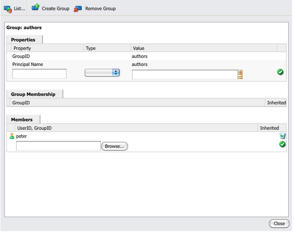

# Amministrazione di utenti, gruppi e diritti di accesso{#user-group-and-access-rights-administration}

L’abilitazione dell’accesso a un archivio CRX prevede diversi argomenti:

* [Diritti di accesso](#how-access-rights-are-evaluated): i concetti relativi alla definizione e alla valutazione
* [Amministrazione utenti](#user-administration) - gestione dei singoli account utilizzati per l&#39;accesso
* [Amministrazione gruppo](#group-administration) - semplificazione della gestione degli utenti mediante la creazione di gruppi
* [Gestione dei diritti di accesso](#access-right-management): definizione dei criteri che controllano il modo in cui gli utenti e i gruppi possono accedere alle risorse

Gli elementi di base sono:

**Account utente** - CRX autentica l&#39;accesso identificando e verificando un utente (tramite una persona o un&#39;altra applicazione) in base ai dettagli contenuti nell&#39;account utente.

In CRX, ogni account utente è un nodo nell’area di lavoro. Un account utente di CRX dispone delle seguenti proprietà:

* Rappresenta un utente di CRX.
* Contiene un nome utente e una password.
* Applicabile a tale area di lavoro.
* Non possono essere presenti utenti secondari. Per i diritti di accesso gerarchici, è necessario utilizzare i gruppi.

* È possibile specificare i diritti di accesso per l&#39;account utente.

  Tuttavia, per semplificare la gestione, Adobe consiglia di assegnare (nella maggior parte dei casi) i diritti di accesso agli account dei gruppi. L’assegnazione dei diritti di accesso a ogni singolo utente diventa rapidamente difficile da gestire (le eccezioni sono determinate dagli utenti del sistema quando esistono solo una o due istanze).

**Account gruppo** - Gli account gruppo sono insiemi di utenti e/o altri gruppi. Questi vengono utilizzati per semplificare la gestione in quanto una modifica dei diritti di accesso assegnati a un gruppo viene applicata automaticamente a tutti gli utenti di tale gruppo. Un utente non deve necessariamente appartenere a nessun gruppo, ma spesso appartiene a più gruppi.

In CRX, un gruppo ha le seguenti proprietà:

* Rappresenta un gruppo di utenti con diritti di accesso comuni. Ad esempio, autori o sviluppatori.
* Applicabile a tale area di lavoro.
* Può avere membri; questi possono essere singoli utenti o altri gruppi.
* Il raggruppamento gerarchico può essere ottenuto con le relazioni tra i membri. Non è possibile inserire un gruppo direttamente sotto un altro gruppo nell&#39;archivio.
* È possibile definire i diritti di accesso per tutti i membri del gruppo.

**Diritti di accesso** - CRX utilizza i diritti di accesso per controllare l&#39;accesso ad aree specifiche dell&#39;archivio.

Questa operazione viene eseguita assegnando i privilegi per consentire o negare l’accesso a una risorsa (nodo o percorso) nell’archivio. Poiché è possibile assegnare vari privilegi, questi devono essere valutati per determinare quale combinazione è applicabile alla richiesta corrente.

CRX consente di configurare i diritti di accesso sia per gli account utente che per quelli di gruppo. Gli stessi principi di base di valutazione sono poi applicati a entrambi.

## Valutazione dei diritti di accesso {#how-access-rights-are-evaluated}

>[!NOTE]
>
>CRX implementa il controllo degli accessi [come definito da JSR-283](https://developer.adobe.com/experience-manager/reference-materials/spec/jcr/2.0/16_Access_Control_Management.html).
>
>Un’installazione standard di un archivio CRX è configurata per utilizzare elenchi di controllo di accesso basati sulle risorse. Questa è una possibile implementazione del controllo degli accessi JSR-283 e una delle implementazioni presenti con Jackrabbit.

### Soggetti e oggetti principali {#subjects-and-principals}

CRX utilizza due concetti chiave per valutare i diritti di accesso:

* Un&#39;entità **principal** è un&#39;entità che dispone di diritti di accesso. Gli utenti/gruppi/ruoli includono:

   * Un account utente
   * Un account di gruppo

     Se un account utente appartiene a uno o più gruppi, viene associato anche a ciascuno di tali gruppi principali.

* **oggetto** utilizzato per rappresentare l&#39;origine di una richiesta.

  Viene utilizzato per consolidare i diritti di accesso applicabili a tale richiesta. Questi sono presi da:

   * Entità utente principale

     I diritti assegnati direttamente all’account utente.

   * Tutte le entità di gruppo associate all&#39;utente

     Tutti i diritti vengono assegnati a uno qualsiasi dei gruppi a cui appartiene l&#39;utente.

  Il risultato viene quindi utilizzato per consentire o negare l’accesso alla risorsa richiesta.

#### Compilazione dell&#39;elenco dei diritti di accesso per un oggetto {#compiling-the-list-of-access-rights-for-a-subject}

In CRX, l’argomento dipende da:

* entità utente
* tutte le entità di gruppo associate a tale utente

L’elenco dei diritti di accesso applicabili al soggetto è costituito da:

* i diritti assegnati direttamente all’account utente
* più tutti i diritti assegnati a uno qualsiasi dei gruppi a cui appartiene l&#39;utente


>[!NOTE]
>
>* CRX non tiene conto di alcuna gerarchia di utenti durante la compilazione dell’elenco.
>* CRX utilizza una gerarchia di gruppi solo quando si include un gruppo come membro di un altro gruppo. Non esiste ereditarietà automatica delle autorizzazioni del gruppo.
>* L&#39;ordine in cui si specificano i gruppi non influisce sui diritti di accesso.
>

### Risoluzione di richieste e diritti di accesso {#resolving-request-and-access-rights}

Quando CRX gestisce la richiesta, confronta la richiesta di accesso dal soggetto con l’elenco di controllo di accesso sul nodo dell’archivio:

Pertanto, se Linda richiede di aggiornare il nodo `/features` nella seguente struttura dell&#39;archivio:


### Ordine di precedenza {#order-of-precedence}

I diritti di accesso in CRX vengono valutati come segue:

* Le entità utente hanno sempre la precedenza sulle entità gruppo indipendentemente da:

   * l’ordine nell’elenco di controllo di accesso
   * la loro posizione nella gerarchia dei nodi

* Per una determinata entità principale, esiste (al massimo) una negazione e 1 consenti l’ingresso in un determinato nodo. L’implementazione cancella sempre le voci ridondanti e si assicura che lo stesso privilegio non sia elencato sia nelle voci consentite che in quelle negate.

>[!NOTE]
>
>Questo processo di valutazione è appropriato per il controllo degli accessi basato sulle risorse di un&#39;installazione standard di CRX.

Prendendo due esempi in cui l&#39;utente `aUser` è membro del gruppo `aGroup`:

```xml
   + parentNode
     + acl
       + ace: aUser - deny - write
     + childNode
       + acl
         + ace: aGroup - allow - write
       + grandChildNode
```

Nel caso di cui sopra:

* A `aUser` non è concessa l&#39;autorizzazione di scrittura per `grandChildNode`.

```xml
   + parentNode
     + acl
       + ace: aUser - deny - write
     + childNode
       + acl
         + ace: aGroup - allow - write
         + ace: aUser - deny - write
       + grandChildNode
```

In questo caso:

* A `aUser` non è concessa l&#39;autorizzazione di scrittura per `grandChildNode`.
* La seconda voce ACE per `aUser` è ridondante.

I diritti di accesso di più entità di gruppo vengono valutati in base al loro ordine, sia all&#39;interno della gerarchia che all&#39;interno di un singolo elenco di controllo di accesso.

### Best practice {#best-practices}

La tabella seguente elenca alcuni consigli e best practice:

<table>
 <tbody>
  <tr>
   <td>Consiglio...</td>
   <td>Motivo...</td>
  </tr>
  <tr>
   <td><i>Usa gruppi</i></td>
   <td><p>Evita di assegnare i diritti di accesso utente per utente. Questo può essere dovuto a diversi motivi:</p>
    <ul>
     <li>Poiché il numero di utenti è superiore a quello dei gruppi, la struttura dei gruppi risulta semplificata.</li>
     <li>I gruppi forniscono una panoramica su tutti gli account.</li>
     <li>L’ereditarietà è più semplice con i gruppi.</li>
     <li>Gli utenti vanno e vengono. I gruppi sono a lungo termine.</li>
    </ul> </td>
  </tr>
  <tr>
   <td><i>Sii Positivo</i></td>
   <td><p>Utilizzare sempre le istruzioni Allow per specificare i diritti di accesso dell'entità di gruppo, se possibile. Evita di utilizzare un’istruzione Deny.</p> <p>Le entità di gruppo vengono valutate in ordine, sia all'interno della gerarchia che nell'ordine all'interno di un singolo elenco di controllo di accesso.</p> </td>
  </tr>
  <tr>
   <td><i>Semplifica</i></td>
   <td><p>Investire un po 'di tempo e di pensiero durante la configurazione di una nuova installazione è ben ripagato.</p> <p>L'applicazione di una struttura chiara semplifica la manutenzione e l'amministrazione in corso, garantendo che sia i colleghi attuali che i futuri successori possano comprendere facilmente ciò che viene implementato.</p> </td>
  </tr>
  <tr>
   <td><i>Test</i></td>
   <td>Utilizza un’installazione di test per esercitarti e assicurarti di comprendere le relazioni tra i vari utenti e gruppi.</td>
  </tr>
  <tr>
   <td><i>Utenti/gruppi predefiniti</i></td>
   <td>Aggiorna sempre Utenti e gruppi predefiniti subito dopo l'installazione per evitare problemi di sicurezza.</td>
  </tr>
 </tbody>
</table>

## Amministrazione utente {#user-administration}

Viene utilizzata una finestra di dialogo standard per **Amministrazione utenti**.

Devi aver effettuato l’accesso all’area di lavoro appropriata, quindi puoi accedere alla finestra di dialogo da entrambi:

* il collegamento **Amministrazione utenti** nella console principale di CRX
* il menu **Sicurezza** di CRX Explorer


**Proprietà**

* **ID utente**

  Quando si accede a CRX, viene utilizzato un nome breve per l’account.

* **Nome entità**

  Nome di testo completo dell&#39;account.

* **Password**

  Necessario per accedere a CRX con questo account.

* **ntlmhash**

  Assegnato automaticamente per ogni nuovo account e aggiornato quando la password viene cambiata.

* Puoi aggiungere nuove proprietà definendo un nome, un tipo e un valore. Fai clic su Salva (simbolo di graduazione verde) per ogni nuova proprietà.

**Appartenenza al gruppo**

In questo modo vengono visualizzati tutti i gruppi a cui appartiene l’account. La colonna Ereditato indica l&#39;appartenenza ereditata a seguito dell&#39;appartenenza a un altro gruppo.

Facendo clic su un GroupID (se disponibile) si apre [Group Administration](#group-administration) per quel gruppo.

**Impersonatori**

Con la funzionalità Impersona un utente può lavorare per conto di un altro utente.

Ciò significa che un account utente può specificare altri account (utente o gruppo) che possono operare con il proprio account. In altre parole, se l’utente B può rappresentare l’utente A, allora l’utente B può agire utilizzando i dettagli completi dell’account dell’utente A (inclusi ID, nome e diritti di accesso).

Questo consente agli account di rappresentazione di completare le attività come se stessero utilizzando l’account che impersonano; ad esempio, durante un’assenza o per condividere un carico eccessivo a breve termine.

Se un account ne rappresenta un altro, è difficile visualizzarlo. I file di registro non contengono informazioni sul fatto che la rappresentazione si sia verificata sugli eventi. Pertanto, se l’utente B rappresenta l’utente A, tutti gli eventi possono avere l’aspetto di essere eseguiti personalmente dall’utente A.

### Creazione di un account utente {#creating-a-user-account}

1. Apri la finestra di dialogo **Amministrazione utenti**.
1. Fare clic su **Crea utente**.
1. Puoi quindi immettere le Proprietà:

   * **UserID** utilizzato come nome account.
   * **Password** richiesta per l&#39;accesso.
   * **Nome entità** per fornire un nome completo.
   * **Percorso intermedio** che può essere utilizzato per formare una struttura ad albero.

1. Fai clic su Salva (simbolo di spunta verde).
1. La finestra di dialogo viene espansa in modo da consentire le seguenti operazioni:

   1. Configura **Proprietà**.
   1. Consulta **Iscrizione al gruppo**.
   1. Definisci **Impersonatori**.

>[!NOTE]
>
>Talvolta si osserva una perdita di prestazioni quando si registrano nuovi utenti in installazioni con un numero elevato di entrambi:
>
>* utenti
>* gruppi con molti membri
>

### Aggiornamento di un account utente {#updating-a-user-account}

1. Con la finestra di dialogo **Amministrazione utenti**, apri la visualizzazione elenco di tutti gli account.
1. Navigare nella struttura ad albero.
1. Fai clic sull’account richiesto per aprirlo per la modifica.
1. Apporta una modifica, quindi fai clic su Salva (simbolo di spunta verde) per quella voce.
1. Fai clic su **Chiudi** per terminare oppure su **Elenco...** per tornare all&#39;elenco di tutti gli account utente.

### Rimozione di un account utente {#removing-a-user-account}

1. Con la finestra di dialogo **Amministrazione utenti**, apri la visualizzazione elenco di tutti gli account.
1. Navigare nella struttura ad albero.
1. Selezionare l&#39;account richiesto e fare clic su **Rimuovi utente**. L&#39;account verrà eliminato immediatamente.

>[!NOTE]
>
>Questo rimuove il nodo per questa entità dall’archivio.
>
>Le voci relative ai diritti di accesso non vengono rimosse. Ciò garantisce l’integrità storica.

### Definizione delle proprietà {#defining-properties}

Puoi definire **Proprietà** per account nuovi o esistenti:

1. Apri la finestra di dialogo **Amministrazione utenti** per l&#39;account appropriato.
1. Definisci un nome di **proprietà**.
1. Selezionare **Tipo** dall&#39;elenco a discesa.
1. Definisci il **valore**.
1. Fai clic su Salva (simbolo di clic verde) per la nuova proprietà.

Le proprietà esistenti possono essere eliminate con il simbolo del cestino.

Ad eccezione della password, le proprietà non possono essere modificate, devono essere eliminate e ricreate.

#### Modifica della password {#changing-the-password}

La **password** è una proprietà speciale che può essere modificata facendo clic sul collegamento **Cambia password**.

Puoi anche modificare la password per il tuo account utente dal menu **Sicurezza** in Esplora risorse di CRX.

### Definizione di una rappresentazione {#defining-an-impersonator}

Puoi definire gli impersonatori per account nuovi o esistenti:

1. Apri la finestra di dialogo **Amministrazione utenti** per l&#39;account appropriato.
1. Specifica l’account che può rappresentare tale account.

   Puoi usare Sfoglia... per selezionare un account esistente.

1. Fai clic su Salva (simbolo di spunta verde) per la nuova proprietà.

## Amministrazione gruppo {#group-administration}

Finestra di dialogo standard utilizzata per **Amministrazione gruppo**.

Devi aver effettuato l’accesso all’area di lavoro appropriata, quindi puoi accedere alla finestra di dialogo da entrambi:

* il collegamento **Amministrazione gruppo** nella console principale di CRX
* il menu **Sicurezza** di CRX Explorer



**Proprietà**

* **ID gruppo**

  Nome breve dell&#39;account del gruppo.

* **Nome entità**

  Nome di testo completo per l&#39;account di gruppo.

* Puoi aggiungere nuove proprietà definendo un nome, un tipo e un valore. Fai clic su Salva (simbolo di graduazione verde) per ogni nuova proprietà.

* **Membri**

  È possibile aggiungere utenti o altri gruppi come membri di questo gruppo.

**Appartenenza al gruppo**

In questo modo vengono visualizzati tutti i gruppi a cui appartiene il conto di gruppo corrente. La colonna Ereditato indica l&#39;appartenenza ereditata a seguito dell&#39;appartenenza a un altro gruppo.

Se si fa clic su un GroupID, viene visualizzata la finestra di dialogo relativa a tale gruppo.

**Membri**

Elenca tutti gli account (utenti e/o gruppi) che sono membri del gruppo corrente.

La colonna **Ereditato** indica l&#39;appartenenza ereditata come risultato dell&#39;appartenenza a un altro gruppo.

>[!NOTE]
>
>Quando il ruolo Proprietario, Editor o Visualizzatore viene assegnato a un utente in una cartella di risorse, viene creato un nuovo gruppo. Il nome del gruppo è nel formato `mac-default-<foldername>` per ogni cartella in cui sono definiti i ruoli.

### Creazione di un account di gruppo {#creating-a-group-account}

1. Apri la finestra di dialogo **Amministrazione gruppo**.
1. Fai clic su **Crea gruppo**.
1. Puoi quindi immettere le Proprietà:

   * **Nome entità** per fornire un nome completo.
   * **Percorso intermedio** che può essere utilizzato per formare una struttura ad albero.

1. Fai clic su Salva (simbolo di spunta verde).
1. La finestra di dialogo viene espansa in modo da poter:

   1. Configura **Proprietà**.
   1. Consulta **Iscrizione al gruppo**.
   1. Gestisci **Membri**.

### Aggiornamento di un account di gruppo {#updating-a-group-account}

1. Con la finestra di dialogo **Amministrazione gruppo**, aprire la visualizzazione elenco di tutti gli account.
1. Navigare nella struttura ad albero.
1. Fai clic sull’account richiesto per aprirlo per la modifica.
1. Apporta una modifica, quindi fai clic su Salva (simbolo di spunta verde) per quella voce.
1. Fai clic su **Chiudi** per terminare oppure su **Elenco...** per tornare all&#39;elenco di tutti gli account del gruppo.

### Rimozione di un account di gruppo {#removing-a-group-account}

1. Con la finestra di dialogo **Amministrazione gruppo**, aprire la visualizzazione elenco di tutti gli account.
1. Navigare nella struttura ad albero.
1. Selezionare l&#39;account richiesto e fare clic su **Rimuovi gruppo**. L&#39;account verrà eliminato immediatamente.

>[!NOTE]
>
>Questo rimuove il nodo per questa entità dall’archivio.
>
>Le voci relative ai diritti di accesso non vengono rimosse. Ciò garantisce l’integrità storica.

### Definizione delle proprietà {#defining-properties-1}

Puoi definire le Proprietà per account nuovi o esistenti:

1. Apri la finestra di dialogo **Amministrazione gruppo** per l&#39;account appropriato.
1. Definisci un nome di **proprietà**.
1. Selezionare **Tipo** dall&#39;elenco a discesa.
1. Definisci il **valore**.
1. Fai clic su Salva (simbolo di spunta verde) per la nuova proprietà.

Le proprietà esistenti possono essere eliminate con il simbolo del cestino.

### Membri {#members}

È possibile aggiungere membri al gruppo corrente:

1. Apri la finestra di dialogo **Amministrazione gruppo** per l&#39;account appropriato.
1. Effettua una delle seguenti operazioni:

   * Immettere il nome del membro richiesto (account utente o di gruppo).
   * In alternativa, utilizzare **Sfoglia...** per cercare e selezionare l&#39;entità principale (account utente o account di gruppo) che si desidera aggiungere.

1. Fai clic su Salva (simbolo di spunta verde) per la nuova proprietà.

In alternativa, eliminare un membro esistente con il simbolo del cestino.

## Gestione diritti di accesso {#access-right-management}

Con la scheda **Controllo di accesso** di CRXDE Lite, puoi definire i criteri di controllo di accesso e assegnare i relativi privilegi.

Ad esempio, per **Percorso corrente** selezionare la risorsa richiesta nel riquadro sinistro, la scheda Controllo di accesso nel riquadro inferiore destro:


I criteri sono suddivisi in categorie in base a:

* **Criteri di controllo dell&#39;accesso applicabili**

  Questi criteri possono essere applicati.

  Criteri disponibili per la creazione di un criterio locale. Quando selezioni e aggiungi un criterio applicabile, questo diventa un criterio locale.

* **Criteri di controllo dell&#39;accesso locali**

  Si tratta dei criteri di controllo di accesso applicati. Puoi quindi aggiornarli, ordinarli o rimuoverli.

  Un criterio locale sostituisce tutti i criteri ereditati dall&#39;elemento padre.

* **Criteri di controllo dell&#39;accesso effettivi**

  Questi sono i criteri di controllo di accesso attualmente in vigore per qualsiasi richiesta di accesso. Mostrano i criteri aggregati derivati dai criteri locali e da quelli ereditati dal padre.

### Selezione criteri {#policy-selection}

I criteri possono essere selezionati per:

* **Percorso corrente**

  Come nell’esempio precedente, seleziona una risorsa all’interno dell’archivio. Vengono visualizzati i criteri per questo &quot;percorso corrente&quot;.

* **Archivio**

  Seleziona il controllo dell&#39;accesso a livello di repository. Ad esempio, quando si imposta il privilegio `jcr:namespaceManagement`, che è pertinente solo per l&#39;archivio, non un nodo.

* **Entità**

  Entità registrata nell&#39;archivio.

  È possibile digitare il nome **Ental** oppure fare clic sull&#39;icona a destra del campo per aprire la finestra di dialogo **Seleziona entità**.

  Ciò ti consente di **cercare** un **Utente** o un **Gruppo**. Selezionare l&#39;entità richiesta dall&#39;elenco risultante, quindi fare clic su **OK** per riportare il valore nella finestra di dialogo precedente.


>[!NOTE]
>
>Per semplificare la gestione, l&#39;Adobe consiglia di assegnare i diritti di accesso agli account dei gruppi e non ai singoli account utente.
>
>È più facile gestire alcuni gruppi, piuttosto che molti account utente.

### Privilegi {#privileges}

Durante l&#39;aggiunta di una voce di controllo di accesso è possibile selezionare i privilegi seguenti (per informazioni dettagliate, vedere l&#39;[API di protezione](https://developer.adobe.com/experience-manager/reference-materials/spec/javax.jcr/javadocs/jcr-2.0/javax/jcr/security/Privilege.html)):

<table>
 <tbody>
  <tr>
   <th><strong>Nome privilegio</strong></th>
   <th><strong>Che controlla il privilegio di...</strong></th>
  </tr>
  <tr>
   <td><code>jcr:read</code></td>
   <td>Recupera un nodo e leggi le relative proprietà e i relativi valori.</td>
  </tr>
  <tr>
   <td><code>rep:write</code></td>
   <td>Si tratta di un privilegio di aggregazione specifico per Jackrabbit di jcr:write e jcr:nodeTypeManagement.<br /> </td>
  </tr>
  <tr>
   <td><code>jcr:all</code></td>
   <td>Si tratta di un privilegio di aggregazione che contiene tutti gli altri privilegi predefiniti.</td>
  </tr>
  <tr>
   <td><strong>Avanzate </strong></td>
   <td> </td>
  </tr>
  <tr>
   <td><code>crx:replicate</code></td>
   <td>Eseguire la replica di un nodo.</td>
  </tr>
  <tr>
   <td><code>jcr:addChildNodes</code></td>
   <td>Crea nodi secondari di un nodo.</td>
  </tr>
  <tr>
   <td><code>jcr:lifecycleManagement</code></td>
   <td>Eseguire operazioni del ciclo di vita su un nodo.</td>
  </tr>
  <tr>
   <td><code>jcr:lockManagement</code></td>
   <td>Blocca e sblocca un nodo; aggiorna un blocco.</td>
  </tr>
  <tr>
   <td><code>jcr:modifyAccessControl</code></td>
   <td>Modificare i criteri di controllo di accesso di un nodo.</td>
  </tr>
  <tr>
   <td><code>jcr:modifyProperties</code></td>
   <td>Creare, modificare e rimuovere le proprietà di un nodo.</td>
  </tr>
  <tr>
   <td><code>jcr:namespaceManagement</code></td>
   <td>Registra, annulla la registrazione e modifica le definizioni dello spazio dei nomi.</td>
  </tr>
  <tr>
   <td><code>jcr:nodeTypeDefinitionManagement</code></td>
   <td>Importa le definizioni dei tipi di nodo nel repository.</td>
  </tr>
  <tr>
   <td><code>jcr:nodeTypeManagement</code></td>
   <td>Aggiungi e rimuovi tipi di nodo mixin e modifica il tipo di nodo principale di un nodo. Sono incluse anche le chiamate ai metodi Node.addNode e di importazione XML in cui il tipo mixin o primario del nuovo nodo è specificato in modo esplicito.</td>
  </tr>
  <tr>
   <td><code>jcr:readAccessControl</code></td>
   <td>Leggi i criteri di controllo di accesso di un nodo.</td>
  </tr>
  <tr>
   <td><code>jcr:removeChildNodes</code></td>
   <td>Rimuovere i nodi secondari di un nodo.</td>
  </tr>
  <tr>
   <td><code>jcr:removeNode</code></td>
   <td>Rimuovere un nodo.</td>
  </tr>
  <tr>
   <td><code>jcr:retentionManagement</code></td>
   <td>Eseguire operazioni di gestione della conservazione su un nodo.</td>
  </tr>
  <tr>
   <td><code>jcr:versionManagement</code></td>
   <td>Eseguire operazioni di controllo delle versioni su un nodo.</td>
  </tr>
  <tr>
   <td><code>jcr:workspaceManagement</code></td>
   <td>La creazione e l’eliminazione delle aree di lavoro tramite l’API JCR.</td>
  </tr>
  <tr>
   <td><code>jcr:write</code></td>
   <td>Questo è un privilegio di aggregazione che contiene:<br /> - jcr:modifyProperties<br /> - jcr:addChildNodes<br /> - jcr:removeNode<br /> - jcr:removeChildNodes</td>
  </tr>
  <tr>
   <td><code>rep:privilegeManagement</code></td>
   <td>Registra un nuovo privilegio.</td>
  </tr>
 </tbody>
</table>

### Registrazione di nuovi privilegi {#registering-new-privileges}

È inoltre possibile registrare nuovi privilegi:

1. Dalla barra degli strumenti, seleziona **Strumenti**, quindi **Privilegi** per visualizzare i privilegi attualmente registrati.

   

1. Utilizza l&#39;icona **Registra privilegio** (**+**) per definire un privilegio:

   

1. Fare clic su **OK** per salvare. Il privilegio è ora disponibile per la selezione.

### Aggiunta di una voce di controllo di accesso {#adding-an-access-control-entry}

1. Seleziona la risorsa e apri la scheda **Controllo dell&#39;accesso**.

1. Per aggiungere un nuovo **Criteri di controllo di accesso locali**, fare clic sull&#39;icona **+** a destra dell&#39;elenco **Criteri di controllo di accesso applicabili**:

   

1. Viene visualizzata una nuova voce in **Criteri di controllo di accesso locali:**

   

1. Fai clic sull&#39;icona **+** per aggiungere una voce:

   

   >[!NOTE]
   >
   >Attualmente è necessaria una soluzione alternativa per specificare una stringa vuota.
   >
   >Per questo, devi utilizzare `""`.

1. Definisci i criteri di controllo di accesso e fai clic su **OK** per salvare. Il nuovo criterio è:

   * elencato in **Criteri di controllo di accesso locali**
   * le modifiche si riflettono nei **Criteri di controllo di accesso effettivi**.

CRX convalida la selezione; per un determinato utente/gruppo/ruolo esiste (al massimo) un elemento deny e uno allow entry su un determinato nodo. L’implementazione cancella sempre le voci ridondanti e si assicura che lo stesso privilegio non sia elencato sia nelle voci consentite che in quelle negate.

### Ordinamento dei criteri di controllo dell&#39;accesso locale {#ordering-local-access-control-policies}

L’ordine nell’elenco indica l’ordine in cui vengono applicati i criteri.

1. Nella tabella dei **Criteri di controllo di accesso locali**, selezionare la voce richiesta e trascinarla nella nuova posizione nella tabella.

   

1. Le modifiche vengono visualizzate in entrambe le tabelle per **Local** e **Effective Access Control Policies**.

### Rimozione di un criterio di controllo di accesso {#removing-an-access-control-policy}

1. Nella tabella dei **Criteri di controllo di accesso locali** fare clic sull&#39;icona rossa (-) a destra della voce.
1. La voce viene rimossa da entrambe le tabelle per **Local** e **Effective Access Control Policies**.

### Verifica di un criterio di controllo degli accessi {#testing-an-access-control-policy}

1. Dalla barra degli strumenti di CRXDE Lite, seleziona **Strumenti**, quindi **Verifica controllo accesso...**.
1. Nel riquadro superiore destro viene visualizzata una nuova finestra di dialogo. Selezionare il **Percorso** e/o l&#39;**Entità** che si desidera verificare.
1. Fai clic su **Test** per visualizzare i risultati della selezione:

   
