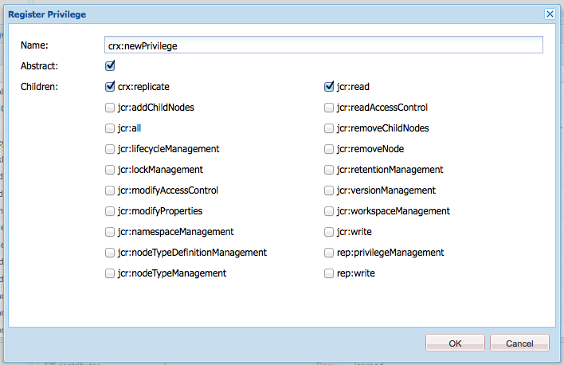

# Amministrazione di diritti di accesso, gruppi e utenti{#user-group-and-access-rights-administration}

L&#39;abilitazione dell&#39;accesso a un archivio CRX prevede diversi argomenti:

* [Diritti](#how-access-rights-are-evaluated)  di accesso: concetti relativi alla definizione e alla valutazione
* [Amministrazione utente](#user-administration) : gestione dei singoli account utilizzati per l&#39;accesso
* [Amministrazione dei gruppi](#group-administration) : semplifica la gestione degli utenti creando gruppi
* [Accesso alla gestione dei diritti](#access-right-management) : definizione di criteri che controllano il modo in cui questi utenti e gruppi possono accedere alle risorse

Gli elementi di base sono i seguenti:

**User** AccountsCRX autentica l&#39;accesso identificando e verificando un utente (da parte di tale persona o altra applicazione) in base ai dettagli contenuti nell&#39;account utente.

In CRX ogni account utente è un nodo nell&#39;area di lavoro. Un account utente CRX ha le seguenti proprietà:

* Rappresenta un utente di CRX.
* Contiene un nome utente e una password.
* È applicabile per quell’area di lavoro.
* Non può avere utenti secondari. Per i diritti di accesso gerarchici, utilizzare i gruppi.

* Puoi specificare i diritti di accesso per l’account utente.

   Tuttavia, per semplificare la gestione, consigliamo (nella maggior parte dei casi) di assegnare diritti di accesso agli account di gruppo. L’assegnazione di diritti di accesso per ogni singolo utente diventa rapidamente molto difficile da gestire (le eccezioni sono determinati utenti di sistema quando esistono solo una o due istanze).

**Gli account Group** AccountsGroup sono raccolte di utenti e/o di altri gruppi. Questi vengono utilizzati per semplificare la gestione in quanto una modifica dei diritti di accesso assegnati a un gruppo viene applicata automaticamente a tutti gli utenti di quel gruppo. Un utente non deve appartenere ad alcun gruppo, ma spesso appartiene a diversi.

In CRX un gruppo ha le seguenti proprietà:

* Rappresenta un gruppo di utenti con diritti di accesso comuni. Ad esempio, autori o sviluppatori.
* È applicabile per quell’area di lavoro.
* può avere membri; possono essere singoli utenti o altri gruppi.
* Il raggruppamento gerarchico può essere ottenuto con le relazioni tra membri. Non puoi posizionare un gruppo direttamente sotto un altro gruppo nell’archivio.
* È possibile definire i diritti di accesso per tutti i membri del gruppo.

**Access** RightsCRX utilizza i diritti di accesso per controllare l&#39;accesso a specifiche aree dell&#39;archivio.

Questo viene fatto assegnando privilegi per consentire o negare l’accesso a una risorsa (nodo o percorso) nell’archivio. Poiché è possibile assegnare vari privilegi, questi devono essere valutati per determinare quale combinazione è applicabile alla richiesta corrente.

CRX ti consente di configurare i diritti di accesso per gli account utente e per i gruppi. Gli stessi principi di valutazione di base sono poi applicati a entrambi.

## Valutazione dei diritti di accesso {#how-access-rights-are-evaluated}

>[!NOTE]
>
>CRX implementa [il controllo degli accessi come definito da JSR-283](https://www.adobe.io/experience-manager/reference-materials/spec/jcr/2.0/16_Access_Control_Management.html).
>
>Un’installazione standard di un archivio CRX è configurata per utilizzare elenchi di controllo degli accessi basati sulle risorse. Questa è una possibile implementazione del controllo degli accessi JSR-283 e una delle implementazioni presenti con Jackrabbit.

### Argomenti e Principali {#subjects-and-principals}

CRX utilizza due concetti chiave durante la valutazione dei diritti di accesso:

* Un **principal** è un&#39;entità che detiene diritti di accesso. I principali includono:

   * Un account utente
   * Un account di gruppo

      Se un account utente appartiene a uno o più gruppi, lo raggruppa anche con ciascuno di questi gruppi principali.

* Un **oggetto** viene utilizzato per rappresentare l&#39;origine di una richiesta.

   Viene utilizzato per consolidare i diritti di accesso applicabili a tale richiesta. Questi sono tratti da:

   * Entità utente principale

      I diritti che assegni direttamente all’account utente.

   * Tutti i gruppi principali associati a tale utente

      Tutti i diritti assegnati a uno qualsiasi dei gruppi a cui appartiene l&#39;utente.
   Il risultato viene quindi utilizzato per consentire o negare l’accesso alla risorsa richiesta.

#### Compilazione dell&#39;elenco dei diritti di accesso per un soggetto {#compiling-the-list-of-access-rights-for-a-subject}

In CRX il soggetto dipende da:

* entità utente
* tutte le entità gruppo associate a tale utente

L&#39;elenco dei diritti di accesso applicabili all&#39;oggetto è costituito da:

* i diritti che assegni direttamente all’account utente
* più tutti i diritti assegnati a uno qualsiasi dei gruppi a cui appartiene l&#39;utente


>[!NOTE]
>
>* CRX non prende in considerazione alcuna gerarchia di utenti quando compila l’elenco.
>* CRX utilizza una gerarchia di gruppi solo quando includi un gruppo come membro di un altro gruppo. Non esiste un&#39;ereditarietà automatica delle autorizzazioni di gruppo.
>* L’ordine in cui si specificano i gruppi non influisce sui diritti di accesso.

>


### Risoluzione dei diritti di richiesta e di accesso {#resolving-request-and-access-rights}

Quando CRX gestisce la richiesta confronta la richiesta di accesso dall&#39;oggetto con l&#39;elenco di controllo accessi sul nodo del repository:

Quindi, se Linda richiede di aggiornare il nodo `/features` nella seguente struttura di archivio:


### Ordine di precedenza {#order-of-precedence}

I diritti di accesso in CRX sono valutati come segue:

* Le entità utente hanno sempre la precedenza sui gruppi principali indipendentemente da:

   * ordine nell&#39;elenco dei controlli di accesso
   * la loro posizione nella gerarchia dei nodi

* Per un dato entità principale esiste (al massimo) 1 negazione e 1 permette l&#39;ingresso su un dato nodo. L&#39;implementazione cancella sempre le voci ridondanti e si assicura che lo stesso privilegio non sia elencato sia nelle voci allow che deny.

>[!NOTE]
>
>Questo processo di valutazione è appropriato per il controllo dell&#39;accesso basato sulle risorse di un&#39;installazione CRX standard.

Prendendo due esempi in cui l&#39;utente `aUser` è membro del gruppo `aGroup`:

```xml
   + parentNode
     + acl
       + ace: aUser - deny - write
     + childNode
       + acl
         + ace: aGroup - allow - write
       + grandChildNode
```

Nel caso di cui sopra:

* `aUser` non dispone dell&#39;autorizzazione di scrittura su  `grandChildNode`.

```xml
   + parentNode
     + acl
       + ace: aUser - deny - write
     + childNode
       + acl
         + ace: aGroup - allow - write
         + ace: aUser - deny - write
       + grandChildNode
```

In questo caso:

* `aUser` non dispone dell&#39;autorizzazione di scrittura su  `grandChildNode`.
* Il secondo ACE per `aUser` è ridondante.

I diritti di accesso da più entità di gruppo vengono valutati in base al loro ordine, sia all&#39;interno della gerarchia che all&#39;interno di un unico elenco di controllo di accesso.

### Best practice   {#best-practices}

Nella tabella seguente sono elencati alcuni consigli e best practice:

<table>
 <tbody>
  <tr>
   <td>Consiglio...</td>
   <td>Motivo...</td>
  </tr>
  <tr>
   <td><i>Usa gruppi</i></td>
   <td><p>Evita di assegnare diritti di accesso in base all’utente. Ci sono diversi motivi per questo:</p>
    <ul>
     <li>Hai molti più utenti dei gruppi, quindi i gruppi semplificano la struttura.</li>
     <li>I gruppi forniscono una panoramica su tutti gli account.</li>
     <li>L'ereditarietà è più semplice con i gruppi.</li>
     <li>Gli utenti vanno e vengono. I gruppi sono a lungo termine.</li>
    </ul> </td>
  </tr>
  <tr>
   <td><i>Sii Positivo</i></td>
   <td><p>Utilizzare sempre le istruzioni Allow per specificare i diritti di accesso dell'entità gruppo (laddove possibile). Evitare di utilizzare un'istruzione Rifiuta.</p> <p>I gruppi principali vengono valutati in ordine, sia all'interno della gerarchia che nell'ordine all'interno di un singolo elenco di controllo di accesso.</p> </td>
  </tr>
  <tr>
   <td><i>Mantieni semplice</i></td>
   <td><p>Investire un po' di tempo e di pensiero durante la configurazione di una nuova installazione sarà ben pagato.</p> <p>L'applicazione di una struttura chiara semplificherà la manutenzione e l'amministrazione in corso, garantendo che sia i colleghi attuali che i futuri successori possano comprendere facilmente ciò che viene implementato.</p> </td>
  </tr>
  <tr>
   <td><i>Prova</i></td>
   <td>Utilizza un’installazione di test per esercitarti e accertarti di comprendere le relazioni tra i vari utenti e gruppi.</td>
  </tr>
  <tr>
   <td><i>Utenti/gruppi predefiniti</i></td>
   <td>Aggiorna sempre gli utenti e i gruppi predefiniti immediatamente dopo l'installazione per evitare problemi di sicurezza.</td>
  </tr>
 </tbody>
</table>

## Amministrazione utente {#user-administration}

Viene utilizzata una finestra di dialogo standard per **Amministrazione utente**.

Devi aver effettuato l’accesso all’area di lavoro appropriata, quindi puoi accedere alla finestra di dialogo da entrambi:

* il collegamento **Amministrazione utente** sulla console principale di CRX
* il menu **Sicurezza** di CRX Explorer


**Proprietà**

* **UserID**

   Nome breve per l&#39;account, utilizzato quando si accede a CRX.

* **Nome principale**

   Nome completo dell&#39;account.

* **Password**

   Necessario quando si accede a CRX con questo account.

* **ntlmhash**

   Assegnato automaticamente per ogni nuovo account e aggiornato quando la password viene modificata.

* È possibile aggiungere nuove proprietà definendo un nome, un tipo e un valore. Fai clic su Salva (simbolo di spunta verde) per ciascuna nuova proprietà.

**Iscrizione al gruppo**

Vengono visualizzati tutti i gruppi a cui appartiene l’account. La colonna Ereditato indica l&#39;appartenenza ereditata a seguito dell&#39;appartenenza di un altro gruppo.

Facendo clic su un GroupID (se disponibile) si aprirà [Amministrazione dei gruppi](#group-administration) per quel gruppo.

**Impersonatori**

La funzionalità Impersona permette a un utente di lavorare a nome di un altro utente.

Ciò significa che un account utente può specificare altri account (utente o gruppo) che possono funzionare con il proprio account. In altre parole, se l&#39;utente-B può rappresentare l&#39;utente-A, l&#39;utente-B può intraprendere azioni utilizzando i dettagli account completi dell&#39;utente-A (inclusi ID, nome e diritti di accesso).

Ciò consente agli account dell’impersonatore di completare le attività come se utilizzassero l’account che stanno impersonando; ad esempio, durante un&#39;assenza o per condividere un carico eccessivo a breve termine.

Se un account ne impersona un altro è molto difficile da vedere. I file di registro non contengono informazioni sul fatto che si è verificata una rappresentazione sugli eventi. Quindi, se l’utente-B rappresenta l’utente-A, tutti gli eventi avranno l’aspetto di come se fossero stati eseguiti personalmente dall’utente-A.

### Creazione di un account utente {#creating-a-user-account}

1. Apri la finestra di dialogo **Amministrazione utente** .
1. Fare clic su **Crea utente**.
1. Puoi quindi immettere le Proprietà :

   * **** UserIDusato come nome dell&#39;account.
   * **** Password necessaria per l&#39;accesso.
   * **Nome principale** per fornire un nome di testo completo.
   * **Percorsi intermedi** che possono essere utilizzati per formare una struttura ad albero.

1. Fare clic sul simbolo di spunta verde Salva.
1. La finestra di dialogo viene espansa per consentire di:

   1. Configura **Proprietà**.
   1. Vedere **Appartenenza al gruppo**.
   1. Definire **Impersonatori**.

>[!NOTE]
>
>A volte si può notare una perdita di prestazioni durante la registrazione di nuovi utenti in installazioni con un numero elevato di:
>
>* users
>* groups con molti membri

>


### Aggiornamento di un account utente {#updating-a-user-account}

1. Con la finestra di dialogo **Amministrazione utente** apri la visualizzazione a elenco di tutti gli account.
1. Spostarsi nella struttura ad albero.
1. Fai clic sull’account necessario per aprire per la modifica.
1. Apporta una modifica, quindi fai clic su Salva (simbolo di spunta verde) per quella voce.
1. Fare clic su **Chiudi** per terminare o su **Elenco...** per tornare all&#39;elenco di tutti gli account utente.

### Rimozione di un account utente {#removing-a-user-account}

1. Con la finestra di dialogo **Amministrazione utente** apri la visualizzazione a elenco di tutti gli account.
1. Spostarsi nella struttura ad albero.
1. Seleziona l&#39;account richiesto e fai clic su **Rimuovi utente**; l’account verrà eliminato immediatamente.

>[!NOTE]
>
>Questo rimuove il nodo per l&#39;entità dall&#39;archivio.
>
>Le voci dei diritti di accesso non vengono rimosse. Questo garantisce l&#39;integrità storica.

### Definizione delle proprietà {#defining-properties}

Puoi definire **Proprietà** per account nuovi o esistenti:

1. Apri la finestra di dialogo **Amministrazione utente** per l&#39;account appropriato.
1. Definire un nome **Proprietà**.
1. Seleziona il **Tipo** dall’elenco a discesa.
1. Definire il **Valore**.
1. Fai clic su Salva (simbolo di clic verde) per la nuova proprietà.

Le proprietà esistenti possono essere eliminate con il simbolo del cestino.

Ad eccezione della password, le proprietà non possono essere modificate, devono essere eliminate e ricreati.

#### Modifica della password {#changing-the-password}

La **Password** è una proprietà speciale che può essere modificata facendo clic sul collegamento **Cambia password**.

Puoi anche cambiare la password nel tuo account utente dal menu **Sicurezza** in CRX Explorer.

### Definizione di un impersonatore {#defining-an-impersonator}

Puoi definire gli utenti impersonatori per account nuovi o esistenti:

1. Apri la finestra di dialogo **Amministrazione utente** per l&#39;account appropriato.
1. Specifica l&#39;account da consentire per rappresentare tale account.

   Puoi utilizzare Sfoglia per selezionare un account esistente.

1. Fai clic su Salva (simbolo di spunta verde) per la nuova proprietà.

## Amministrazione dei gruppi {#group-administration}

Viene utilizzata una finestra di dialogo standard per **Amministrazione dei gruppi**.

Devi aver effettuato l’accesso all’area di lavoro appropriata, quindi puoi accedere alla finestra di dialogo da entrambi:

* il collegamento **Amministrazione del gruppo** sulla console principale di CRX
* il menu **Sicurezza** di CRX Explorer


**Proprietà**

* **GroupID**

   Nome breve per l&#39;account del gruppo.

* **Nome principale**

   Nome completo dell&#39;account del gruppo.

* È possibile aggiungere nuove proprietà definendo un nome, un tipo e un valore. Fai clic su Salva (simbolo di spunta verde) per ciascuna nuova proprietà.

* **Membri**

   È possibile aggiungere utenti o altri gruppi come membri di questo gruppo.

**Iscrizione al gruppo**

Vengono visualizzati tutti i gruppi a cui appartiene l&#39;account del gruppo corrente. La colonna Ereditato indica l&#39;appartenenza ereditata a seguito dell&#39;appartenenza di un altro gruppo.

Facendo clic su un GroupID si aprirà la finestra di dialogo relativa a tale gruppo.

**Membri**

Elenca tutti gli account (utenti e/o gruppi) che sono membri del gruppo corrente.

La colonna **Ereditato** indica l&#39;appartenenza ereditata a seguito dell&#39;appartenenza a un altro gruppo.

>[!NOTE]
>
>Quando il ruolo Proprietario, Editor o Visualizzatore viene assegnato a un utente in una cartella di risorse, viene creato un nuovo gruppo. Il nome del gruppo è in formato `mac-default-<foldername>` per ogni cartella in cui sono definiti i ruoli.

### Creazione di un account di gruppo {#creating-a-group-account}

1. Apri la finestra di dialogo **Amministrazione dei gruppi** .
1. Fare clic su **Crea gruppo**.
1. Puoi quindi immettere le Proprietà :

   * **Nome principale** per fornire un nome di testo completo.
   * **Percorsi intermedi** che possono essere utilizzati per formare una struttura ad albero.

1. Fare clic sul simbolo di spunta verde Salva.
1. La finestra di dialogo viene espansa per consentire di:

   1. Configura **Proprietà**.
   1. Vedere **Appartenenza al gruppo**.
   1. Gestisci **Membri**.

### Aggiornamento di un account di gruppo {#updating-a-group-account}

1. Con la finestra di dialogo **Amministrazione dei gruppi** apri la visualizzazione a elenco di tutti gli account.
1. Spostarsi nella struttura ad albero.
1. Fai clic sull’account necessario per aprire per la modifica.
1. Apporta una modifica, quindi fai clic su Salva (simbolo di spunta verde) per quella voce.
1. Fare clic su **Chiudi** per terminare o su **Elenco...** per tornare all&#39;elenco di tutti gli account del gruppo.

### Rimozione di un account di gruppo {#removing-a-group-account}

1. Con la finestra di dialogo **Amministrazione dei gruppi** apri la visualizzazione a elenco di tutti gli account.
1. Spostarsi nella struttura ad albero.
1. Seleziona l&#39;account richiesto e fai clic su **Rimuovi gruppo**; l’account verrà eliminato immediatamente.

>[!NOTE]
>
>Questo rimuove il nodo per l&#39;entità dall&#39;archivio.
>
>Le voci dei diritti di accesso non vengono rimosse. Questo garantisce l&#39;integrità storica.

### Definizione delle proprietà {#defining-properties-1}

Puoi definire le Proprietà per account nuovi o esistenti:

1. Apri la finestra di dialogo **Amministrazione dei gruppi** per l&#39;account appropriato.
1. Definire un nome **Proprietà**.
1. Seleziona il **Tipo** dall’elenco a discesa.
1. Definire il **Valore**.
1. Fai clic su Salva (simbolo di spunta verde) per la nuova proprietà.

Le proprietà esistenti possono essere eliminate con il simbolo del cestino.

### Membri {#members}

È possibile aggiungere membri al gruppo corrente:

1. Apri la finestra di dialogo **Amministrazione dei gruppi** per l&#39;account appropriato.
1. Effettua una delle seguenti operazioni:

   * Immettere il nome del membro richiesto (account utente o gruppo).
   * Oppure utilizza **Sfoglia..** per cercare e selezionare l&#39;entità (account utente o gruppo) che si desidera aggiungere.

1. Fai clic su Salva (simbolo di spunta verde) per la nuova proprietà.

Oppure eliminare un membro esistente con il simbolo del cestino.

## Accesso alla gestione dei diritti {#access-right-management}

Con la scheda **Controllo accessi** di CRXDE Lite è possibile definire i criteri di controllo accessi e assegnare i relativi privilegi.

Ad esempio, per **Percorso corrente** selezionare la risorsa richiesta nel riquadro a sinistra, la scheda Controllo accesso nel riquadro in basso a destra:


Le politiche sono classificate in base a:

* **Criteri applicabili per il controllo degli accessi**

   Questi criteri possono essere applicati.

   Si tratta di criteri disponibili per la creazione di un criterio locale. Una volta selezionato e aggiunto un criterio applicabile, diventa un criterio locale.

* **Criteri di controllo dell&#39;accesso locali**

   Si tratta dei criteri di controllo accessi applicati. È quindi possibile aggiornarli, ordinarli o rimuoverli.

   I criteri locali sostituiranno i criteri ereditati dall&#39;elemento padre.

* **Criteri di controllo dell&#39;accesso effettivi**

   Si tratta dei criteri di controllo accessi che sono ora in vigore per qualsiasi richiesta di accesso. Essi mostrano i criteri aggregati derivati sia dai criteri locali sia da quelli ereditati dall&#39;elemento padre.

### Selezione criteri {#policy-selection}

I criteri possono essere selezionati per:

* **Percorso corrente**

   Come nell’esempio precedente, seleziona una risorsa all’interno dell’archivio. Verranno mostrate le politiche per questo &quot;percorso attuale&quot;.

* **Archivio**

   Seleziona il controllo di accesso a livello di archivio. Ad esempio, quando imposti il privilegio `jcr:namespaceManagement` , che è pertinente solo per l’archivio, non per un nodo.

* **Principale**

   Entità registrata nell&#39;archivio.

   È possibile digitare il nome **Principale** oppure fare clic sull&#39;icona a destra del campo per aprire la finestra di dialogo **Seleziona entità**.

   Questo consente di **cercare** un **utente** o **Gruppo**. Seleziona l&#39;entità richiesta dall&#39;elenco risultante, quindi fai clic su **OK** per riportare il valore alla finestra di dialogo precedente.


>[!NOTE]
>
>Per semplificare la gestione, ti consigliamo di assegnare diritti di accesso agli account di gruppo, non a singoli account utente.
>
>È più facile gestire alcuni gruppi, piuttosto che molti account utente.

### Privilegi {#privileges}

I seguenti privilegi sono disponibili per la selezione quando si aggiunge una voce di controllo accessi (per informazioni dettagliate, consulta [API di sicurezza](https://docs.adobe.com/docs/en/spec/javax.jcr/javadocs/jcr-2.0/javax/jcr/security/Privilege.html) ):

<table>
 <tbody>
  <tr>
   <th><strong>Nome privilegio</strong></th>
   <th><strong>Che controlla il privilegio a...</strong></th>
  </tr>
  <tr>
   <td><code>jcr:read</code></td>
   <td>Recupera un nodo e leggi le relative proprietà e i relativi valori.</td>
  </tr>
  <tr>
   <td><code>rep:write</code></td>
   <td>Si tratta di un privilegio aggregato specifico per jackrabbit di jcr:write e jcr:nodeTypeManagement.<br /> </td>
  </tr>
  <tr>
   <td><code>jcr:all</code></td>
   <td>Si tratta di un privilegio aggregato che contiene tutti gli altri privilegi predefiniti.</td>
  </tr>
  <tr>
   <td><strong>Avanzate </strong></td>
   <td> </td>
  </tr>
  <tr>
   <td><code>crx:replicate</code></td>
   <td>Esegui la replica di un nodo.</td>
  </tr>
  <tr>
   <td><code>jcr:addChildNodes</code></td>
   <td>Crea nodi figlio di un nodo.</td>
  </tr>
  <tr>
   <td><code>jcr:lifecycleManagement</code></td>
   <td>Esegui operazioni del ciclo di vita su un nodo.</td>
  </tr>
  <tr>
   <td><code>jcr:lockManagement</code></td>
   <td>Bloccare e sbloccare un nodo; aggiornare un blocco.</td>
  </tr>
  <tr>
   <td><code>jcr:modifyAccessControl</code></td>
   <td>Modificare i criteri di controllo degli accessi di un nodo.</td>
  </tr>
  <tr>
   <td><code>jcr:modifyProperties</code></td>
   <td>Crea, modifica e rimuovi le proprietà di un nodo.</td>
  </tr>
  <tr>
   <td><code>jcr:namespaceManagement</code></td>
   <td>Registrare, annullare la registrazione e modificare le definizioni dei namespace.</td>
  </tr>
  <tr>
   <td><code>jcr:nodeTypeDefinitionManagement</code></td>
   <td>Importa le definizioni dei tipi di nodo nel repository.</td>
  </tr>
  <tr>
   <td><code>jcr:nodeTypeManagement</code></td>
   <td>Aggiungi e rimuovi i tipi di nodo mixin e cambia il tipo di nodo primario di un nodo. Questo include anche tutte le chiamate ai metodi di importazione Node.addNode e XML in cui il mixin o il tipo principale di nuovo nodo è esplicitamente specificato.</td>
  </tr>
  <tr>
   <td><code>jcr:readAccessControl</code></td>
   <td>Leggi i criteri di controllo accessi di un nodo.</td>
  </tr>
  <tr>
   <td><code>jcr:removeChildNodes</code></td>
   <td>Rimuovere i nodi secondari di un nodo.</td>
  </tr>
  <tr>
   <td><code>jcr:removeNode</code></td>
   <td>Rimuovi un nodo.</td>
  </tr>
  <tr>
   <td><code>jcr:retentionManagement</code></td>
   <td>Esegui operazioni di gestione della conservazione su un nodo.</td>
  </tr>
  <tr>
   <td><code>jcr:versionManagement</code></td>
   <td>Eseguire operazioni di controllo delle versioni su un nodo.</td>
  </tr>
  <tr>
   <td><code>jcr:workspaceManagement</code></td>
   <td>Creazione ed eliminazione di aree di lavoro tramite l’API JCR.</td>
  </tr>
  <tr>
   <td><code>jcr:write</code></td>
   <td>Questo è un privilegio aggregato che contiene:<br /> - jcr:modifyProperties<br /> - jcr:addChildNodes<br /> - jcr:removeNode<br /> - jcr:removeChildNodes</td>
  </tr>
  <tr>
   <td><code>rep:privilegeManagement</code></td>
   <td>Registra nuovo privilegio.</td>
  </tr>
 </tbody>
</table>

### Registrazione di nuovi privilegi {#registering-new-privileges}

È inoltre possibile registrare nuovi privilegi:

1. Dalla barra degli strumenti selezionare **Strumenti**, quindi **Privilegi** per visualizzare i privilegi attualmente registrati.

   

1. Utilizza l&#39;icona **Registra privilegio** (**+**) per aprire la finestra di dialogo e definire un nuovo privilegio:

   

1. Fai clic su **OK** per salvare. Il privilegio sarà ora disponibile per la selezione.

### Aggiunta di una voce di controllo di accesso {#adding-an-access-control-entry}

1. Seleziona la risorsa e apri la scheda **Controllo accessi** .

1. Per aggiungere un nuovo **Criteri per il controllo degli accessi locali**, fai clic sull&#39;icona **+** a destra dell&#39;elenco **Criteri per il controllo degli accessi applicabili**:

   

1. Una nuova voce viene visualizzata in **Criteri di controllo accessi locali:**

   

1. Fai clic sull&#39;icona **+** per aggiungere una nuova voce:

   

   >[!NOTE]
   >
   >Al momento è necessaria una soluzione alternativa per specificare una stringa vuota.
   >
   >A questo scopo è necessario utilizzare &quot;&quot;.

1. Definisci i criteri di controllo accessi e fai clic su **OK** per salvare. Il nuovo criterio:

   * essere elencati in **Criteri di controllo accessi locali**
   * le modifiche saranno riportate in **Criteri di controllo accessi effettivi**.

CRX convalida la tua selezione; per un dato entità principale esiste (al massimo) 1 negazione e 1 permette l&#39;ingresso su un dato nodo. L&#39;implementazione cancella sempre le voci ridondanti e si assicura che lo stesso privilegio non sia elencato sia nelle voci allow che deny.

### Ordinamento dei criteri di controllo accessi locali {#ordering-local-access-control-policies}

L&#39;ordine nell&#39;elenco indica l&#39;ordine in cui vengono applicati i criteri.

1. Nella tabella di **Criteri di controllo accessi locali** selezionare la voce richiesta e trascinarla nella nuova posizione nella tabella.

   

1. Le modifiche verranno visualizzate sia nelle tabelle relative a **Locale** che in quelle relative a **Criteri di controllo accessi effettivi**.

### Rimozione di un criterio di controllo degli accessi {#removing-an-access-control-policy}

1. Nella tabella di **Criteri di controllo accessi locali** fare clic sull&#39;icona rossa (-) a destra della voce.
1. La voce verrà rimossa sia dalle tabelle relative a **Locale** che da **Criteri di controllo accessi effettivi**.

### Verifica di un criterio di controllo degli accessi {#testing-an-access-control-policy}

1. Dalla barra degli strumenti di CRXDE Lite selezionare **Strumenti**, quindi **Controllo accesso di prova...**.
1. Viene visualizzata una nuova finestra di dialogo nel riquadro in alto a destra. Seleziona il **Percorso** e/o **Principale** da testare.
1. Fai clic su **Test** per visualizzare i risultati della selezione:

   
