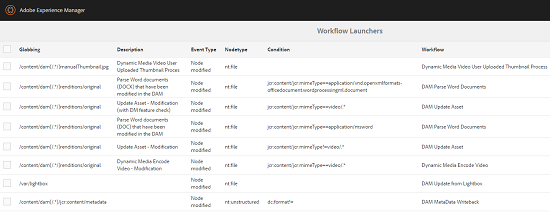

# Offloader flusso di lavoro risorse{#assets-workflow-offloader}

Lo scaricatore del flusso di lavoro Assets consente di abilitare più istanze di Risorse Adobe Experience Manager (AEM) per ridurre il carico di elaborazione sull’istanza principale (intestazione). Il carico di elaborazione viene distribuito tra l&#39;istanza di riempimento iniziale e le varie istanze offload (Worker) ad essa aggiunte. La distribuzione del carico di elaborazione delle risorse aumenta l’efficienza e la velocità con cui AEM Assets elabora le risorse. Inoltre, consente di allocare risorse dedicate per elaborare risorse di un particolare tipo MIME. Ad esempio, potete allocare un nodo specifico nella topologia per elaborare solo risorse InDesign.

## Configurare la topologia offloader {#configure-offloader-topology}

Utilizzare Configuration Manager per aggiungere l&#39;URL per l&#39;istanza leader e i nomi host delle istanze offloader per le richieste di connessione nell&#39;istanza leader.

1. Toccate o fate clic sul logo AEM, quindi scegliete **Strumenti** > **Operazioni** > Console **** Web per aprire Gestione configurazione.
1. Dalla console Web, selezionate **Sling** (Sling) > **Topology Management (Gestione** topologia).

   

1. Nella pagina Gestione topologia, tocca o fai clic sul collegamento **Configura servizio** Discovery.Oak.

   

1. Nella pagina Configurazione servizio di individuazione, specificate l&#39;URL del connettore per l&#39;istanza leader nel campo URL **del connettore** topologia.

   

1. Nel campo Whitelist del connettore **topologia** , specificate l&#39;indirizzo IP o i nomi host delle istanze offloader che possono connettersi all&#39;istanza leader. Tap/click **Save**.

   

1. Per visualizzare le istanze offload collegate all&#39;istanza leader, accedete a **Strumenti** > **Distribuzione** > **Topologia** e toccate o fate clic sulla vista Cluster.

## Disattivazione {#disable-offloading}

1. Toccate o fate clic sul logo AEM, quindi scegliete **Strumenti** > **Distribuzione** > **Offload**. Nella pagina **Scaricamento del browser** sono visualizzati gli argomenti e le istanze del server che possono utilizzare gli argomenti.

   

1. Disattiva l’argomento *com/adobe/granite/workflow/offload* sulle istanze iniziali con cui gli utenti interagiscono per caricare o modificare le risorse AEM.

   

## Configurare gli avviatori del flusso di lavoro sull&#39;istanza leader {#configure-workflow-launchers-on-the-leader-instance}

Configurate gli avviatori dei flussi di lavoro per utilizzare il flusso di lavoro **DAM Update Asset Offload** (Aggiorna risorsa) sull&#39;istanza principale invece del flusso di lavoro **Dam Update Asset** (Aggiorna risorsa Dam).

1. Toccate o fate clic sul logo AEM, quindi scegliete **Strumenti** > **Flusso** di lavoro > **Avviatori** per aprire la console **Workflow Launcher** .

   

1. Individuate le due configurazioni di avvio con i tipi di evento **Nodo creato** e **Nodo modificato** rispettivamente, che eseguono il flusso di lavoro **DAM Update Asset** .
1. Per ciascuna configurazione, seleziona la casella di controllo prima di essa e tocca o fai clic sull’icona **Visualizza proprietà** dalla barra degli strumenti per visualizzare la finestra di dialogo Proprietà **** avvio.

   

1. Dall’elenco **Flusso** di lavoro, scegliete **DAM Update Asset Offload** (Aggiorna offload risorsa) e toccate o fate clic su **Salva**.

   

1. Toccate o fate clic sul logo AEM, quindi scegliete **Strumenti** > **Flusso** di lavoro > **Modelli** per aprire la pagina Modelli **di** workflow.
1. Selezionate il flusso di lavoro **DAM Update Asset Offload** , quindi toccate o fate clic su **Modifica** nella barra degli strumenti per visualizzarne i dettagli.

   

1. Visualizzare il menu di scelta rapida per il passaggio Offload **del flusso di lavoro** DAM e scegliere **Modifica**. Verificare la voce nel campo **Argomenti** processo della scheda Argomenti **** generici della finestra di dialogo di configurazione.

   

## Disattivare gli avviatori del flusso di lavoro sulle istanze offload {#disable-the-workflow-launchers-on-the-offloader-instances}

Disattivate i avviatori del flusso di lavoro che eseguono il flusso di lavoro **DAM Update Asset** nell&#39;istanza iniziale.

1. Toccate o fate clic sul logo AEM, quindi scegliete **Strumenti** > **Flusso** di lavoro > **Avviatori** per aprire la console **Workflow Launcher** .

   

1. Individuate le due configurazioni di avvio con i tipi di evento **Nodo creato** e **Nodo modificato** rispettivamente, che eseguono il flusso di lavoro **DAM Update Asset** .
1. Per ciascuna configurazione, seleziona la casella di controllo prima di essa e tocca o fai clic sull’icona **Visualizza proprietà** dalla barra degli strumenti per visualizzare la finestra di dialogo Proprietà **** avvio.

   

1. Nella sezione **Attiva** , trascinate il cursore per disattivare l’avvio del flusso di lavoro e toccate o fate clic su **Salva** per disattivarlo.

   

1. Caricate qualsiasi risorsa di tipo immagine nell’istanza di riempimento iniziale. Verifica le miniature generate e riportate di nuovo per la risorsa dall’istanza scaricata.

