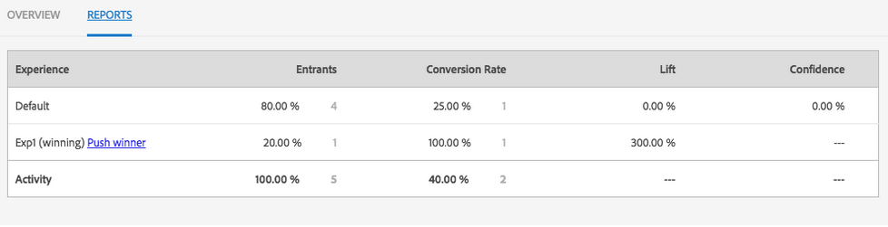
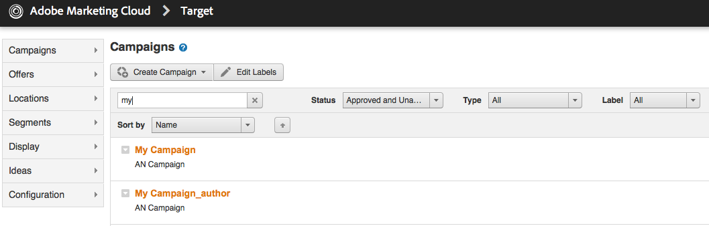

# Gestione delle attività{#managing-activities}

La console Attività consente di creare, organizzare e gestire le [attività](/help/sites-authoring/personalization.md#activities) di marketing dei tuoi marchi:

* Aggiungi marchi.
* Per ogni marchio puoi aggiungere e configurare delle attività.
* Attività di amministrazione.

>[!NOTE]
>
>Se utilizzi Adobe Target come motore di destinazione, puoi anche [visualizzare i dati sulle prestazioni delle tue attività](#viewing-performance-and-converting-winning-experiences-a-b-test). Se utilizzi la funzionalità di test A/B, puoi [convertire i vincitori](#viewing-performance-and-converting-winning-experiences-a-b-test).

Sulla console Attività, le attività sono organizzate per marchio. Puoi utilizzare i marchi e le cartelle per strutturare l&#39;organizzazione delle attività. Accedi alla console Attività toccando/facendo clic su **Personalizzazione** e toccando/facendo clic su **Attività**.

Le attività sono disponibili in modalità Targeting per [creazione di contenuti mirati](/help/sites-authoring/content-targeting-touch.md), dove puoi anche creare attività. Le attività create in modalità Targeting vengono visualizzate nella console Attività.

Le attività vengono visualizzate con un&#39;etichetta che descrive il tipo di attività definito:

* XT - Targeting esperienze di Adobe Target
* A/B - Test A/B di Adobe Target
* AEM - Targeting di Adobe Experience Manager (determinato da contexthub o clientcontext)

>[!NOTE]
>
>Il tipo di attività disponibile viene stabilito in base ai seguenti elementi:
>
>* Se l&#39;opzione **xt_only** è abilitata sul tenant di Adobe Target (clientcode) utilizzato sul lato AEM per connettersi ad Adobe Target, puoi creare **solo** attività XT in AEM.
>
>* Se le opzioni **xt_only** **non** sono abilitate sul tenant di Adobe Target (clientcode), puoi creare **sia** le attività XT che A/B in AEM.
>
>**Nota aggiuntiva:** le opzioni **xt_only** sono un&#39;impostazione applicata a un determinato tenant Target (clientcode) e possono essere modificate solo direttamente in Adobe Target. Non puoi attivare o disattivare questa opzione da AEM.

>[!CAUTION]
>
>È necessario proteggere il nodo delle impostazioni dell’attività **cq:ActivitySettings** nell’istanza di pubblicazione in modo che sia inaccessibile agli utenti normali. Il nodo delle impostazioni delle attività deve essere accessibile solo al servizio che gestisce la sincronizzazione delle attività con Adobe Target.
>
>Vedi [Prerequisiti per l’integrazione con Adobe Target](/help/sites-administering/target-requirements.md#securingtheactivitysettings) per informazioni dettagliate.

## Creazione di un marchio tramite la console Attività {#creating-a-brand-using-the-activities-console}

Consente la creazione di un marchio per cui desideri gestire le attività di marketing.

Quando crei un marchio utilizzando la console Attività, questo viene visualizzato anche nella [Console Offerte](/help/sites-authoring/offerlib.md) dove puoi creare offerte per le esperienze delle tue attività.

1. Nella console Navigazione, tocca o fai clic su **Personalizzazione**. Tocca o fai clic su **Attività**.

   

1. Nella console Attività, tocca o fai clic su **Crea** e quindi su **Crea marchio**.
1. Seleziona il modello di marchio e tocca o fai clic su **Avanti**.
1. Digita un titolo per il marchio come desideri che appaia nelle console Attività o Offerte. Facoltativamente, digita o seleziona uno o più tag da associare al marchio.
1. Tocca o fai clic su **Crea**. Il marchio viene visualizzato nella console Attività.

## Aggiunta/pubblicazione di un&#39;attività utilizzando la console Attività {#adding-editing-an-activity-using-the-activities-console}

Aggiungi un&#39;attività o modifica un&#39;attività esistente per concentrare le tue attività di marketing su un pubblico specifico. Quando crei/modifichi un&#39;attività, è necessario specificare le seguenti informazioni:

* **Nome:** il nome dell’attività.
* **Motore di destinazione:** [AEM](/help/sites-authoring/personalization.md#aem) oppure [Adobe Target](/help/sites-authoring/personalization.md#adobe-target) come motore per il contenuto di destinazione.

* **Seleziona una configurazione di destinazione:** (Solo Adobe Target) la configurazione cloud che questa attività deve utilizzare per connettersi ad Adobe Target. Questa opzione viene visualizzata solo quando è selezionato Adobe Target è per il motore di destinazione.
* **Tipo di attività: **Tipo di attività: test A/B o targeting delle esperienze
* **Obiettivo:** (facoltativo) una descrizione dell’attività.
* **Esperienze:** mappature tra i nomi del pubblico e i segmenti di marketing di destinazione.
* **Traffic Percentages (Percentuali di traffico):** se è selezionato il test A/B, puoi modificare la quantità di traffico (in percentuale) che viene indirizzato a ogni esperienza.
* **Durata:** il periodo di tempo in cui viene applicata l’attività.
* **Priorità:** la priorità relativa dell’attività. Quando le attività forniscono contenuto per gli stessi segmenti di utenti, l’attività della priorità superiore ha la precedenza.
* **Metrica per obiettivo:** se Adobe Target è selezionato come motore di destinazione, puoi aggiungere all’attività le metriche di successo. È necessaria una metrica di successo.

>[!NOTE]
>
>È necessario ***creare*** nuove attività di Adobe Target nell’editor del contenuto di destinazione, non nella console **Attività**, in quanto la sincronizzazione con Adobe Target avrà esito negativo.
>
>Puoi, tuttavia, modificare le attività di Adobe Target esistenti nella console.

Per aggiungere un’attività:

1. Tocca o fai clic sul marchio per il quale stai creando l’attività, quindi tocca o fai clic su **Crea**, quindi su **Crea attività**. Se stai modificando, seleziona l’attività e quindi tocca o fai clic su **Modifica**.
1. Fornisci le informazioni seguenti e tocca o fai clic su **Avanti**:

   * Un nome per l&#39;attività.
   * Il motore di destinazione da utilizzare. ContextHub (AEM) è selezionato per impostazione predefinita. Se è necessario utilizzare Adobe Target, crea l&#39;attività nell&#39;editor di contenuti con targeting.
   * Se hai selezionato Adobe Target come motore di destinazione, seleziona/modifica la configurazione del cloud da utilizzare per la connessione ad Adobe Target. (Non selezionare un framework creato in precedenza per la configurazione del cloud).
   * (Facoltativo) L&#39;obiettivo o la descrizione dell&#39;attività.
   * Seleziona il tipo di attività.

1. Aggiungi una o più esperienze all’attività. Tocca o fai clic su **Aggiungi esperienza**.
1. Se utilizzi il targeting di AEM o il targgeting esperienze di Adobe Target:

   1. Tocca o fai clic su **Seleziona pubblico **e seleziona il segmento a cui viene indirizzata l’esperienza.
   1. Tocca o fai clic su **Aggiungi esperienza**, digita un nome e tocca o fai clic su **OK**. 

   1. Tocca o fai clic su **Avanti**.

   Se utilizzi la funzionalità di test A/B di Adobe Target:

   1. Tocca o fai clic sulla matita nella casella dei tipi di pubblico per selezionare un pubblico.
   1. Tocca o fai clic su **Aggiungi esperienza**, digita un nome e tocca o fai clic su **OK**. 

   1. Inserisci la percentuale di traffico visualizzato in ogni esperienza.
   1. Tocca o fai clic su **Avanti**.

1. Per specificare quando l&#39;attività viene avviata, utilizza il menu a discesa **Avvio** per selezionare uno dei seguenti valori:

   * **Quando viene attivato**: l&#39;attività viene avviata quando la pagina contenente il contenuto con targeting viene attivata.
   * **Data e ora specifiche:** un tempo specifico. Quando selezioni questa opzione, fai clic o tocca l’icona del calendario, seleziona una data e specifica l’ora in cui avviare l’attività.

1. Per specificare quando l&#39;attività termina, usa il menu a discesa Fine per selezionare uno dei seguenti valori:

   * **Quando viene disattivato**: l&#39;attività viene terminata quando la pagina contenente il contenuto con targeting viene disattivata.
   * **Data e ora specificata**: un tempo specifico. Quando selezioni questa opzione, tocca o fai clic sull’icona del calendario, seleziona una data e specifica l’ora di fine dell’attività.

1. Per specificare una priorità per l&#39;attività, usa il cursore per selezionare un valore **Basso**, **Medio** o **Alto**.
1. Se utilizzi Adobe Target come motore di destinazione, seleziona cosa desideri misurare con questa attività. Vedi [Configurazione dell’attività e definizione degli obiettivi](/help/sites-authoring/content-targeting-touch.md) per ulteriori informazioni sulle metriche di successo disponibili. Devi selezionare almeno un obiettivo.
1. Tocca o fai clic su **Salva**.

   >[!NOTE]
   >
   >Dopo aver creato un&#39;attività, devi pubblicarla in modo che sia disponibile.

## Pubblicazione e annullamento della pubblicazione delle attività {#publishing-and-unpublishing-activities}

È necessario modificare le attività per renderle disponibili. Al contrario, puoi rendere le attività non disponibili annullandole la pubblicazione.

>[!NOTE]
>
>Quando si annulla la pubblicazione di un’attività, lo stato dell’attività non cambia a meno che non si aggiorni la pagina.

Per pubblicare o annullare la pubblicazione di attività:

1. Tocca o fai clic sul marchio e quindi sull&#39;area che contiene l&#39;attività che desideri pubblicare o di cui desideri annullare la pubblicazione.
1. Tocca o fai clic sull&#39;icona accanto all&#39;attività o alle attività che desideri pubblicare o di cui desideri annullare la pubblicazione.

   

1. Per pubblicare, tocca o fai clic su **Pubblica**. Per annullare la pubblicazione, tocca o fai clic su **Annulla pubblicazione**. L&#39;attività o le attività vengono pubblicate o la loro pubblicazione viene annullata e il loro stato cambia nella console Attività (potrebbe essere necessario un aggiornamento).

## Attività su istanze autore e pubblicazione {#activities-on-author-and-publish-instances}

Quando viene attivata un&#39;attività che utilizza il motore di destinazione di Adobe Target, viene creata una seconda attività sull&#39;istanza di pubblicazione:

* L&#39;attività sull&#39;istanza autore traccia l&#39;attività sull&#39;istanza autore ed è utile per simulare l&#39;esperienza del visitatore. L&#39;analisi registrata per questa attività riflette solo ciò che viene eseguito nell&#39;istanza dell&#39;autore.
* L&#39;attività sull&#39;istanza di pubblicazione riflette e risponde all&#39;attività sul server di pubblicazione. Questa è l&#39;attività che viene eseguita sul sito web pubblico. Solo l&#39;attività di pubblicazione è rilevante per tracciare e analizzare l&#39;utilizzo del sito pubblico attuale.

## Prestazioni di visualizzazione e conversione dell&#39;esperienza vincente (test A/B) {#viewing-performance-and-converting-winning-experiences-a-b-test}

Puoi visualizzare le prestazioni di tutte le attività di Adobe Target (XT o A/B). Se utilizzi i test A/B, puoi inoltre convertire l&#39;esperienza vincente, che diventa l&#39;esperienza predefinita.

Per visualizzare le prestazioni dell&#39;attività e convertire l&#39;esperienza vincente:

1. In **Personalizzazione**, tocca o fai clic su **Attività** per passare al **Attività** console.
1. Tocca o fai clic sul marchio di cui desideri visualizzare le attività.
1. Seleziona l’attività e tocca o fai clic su **Visualizza proprietà**, quindi seleziona la scheda **Rapporti** e scegli l’attività per la quale visualizzare le prestazioni o convertire le esperienze vincenti. Vengono visualizzati i dati sulle prestazioni.

   

1. Tocca o fai clic su **Vincitore push** per inviare quell’esperienza come esperienza predefinita.

   La conversione del vincitore comporta le seguenti operazioni:

   * Disattiva l&#39;attività in corso
   * Modifica tutte le pagine e sostituisce il contenuto con targeting con il contenuto effettivo dell&#39;esperienza vincente. Il contenuto dell’esperienza vincente diventa parte della pagina normale **senza** targeting.

   

   Un&#39;esperienza vincente è l&#39;esperienza che genera un incremento maggiore nei rapporti, che si basa sul tasso di conversione.

1. Tocca o fai clic su **Sì** per confermare che desideri convertire il vincitore, disattivando l&#39;esperienza attuale e sostituendola con il contenuto dell&#39;esperienza vincente.

## Sincronizzazione delle attività con Adobe Target {#synchronizing-activities-with-adobe-target}

Le attività che utilizzano il motore di destinazione di Adobe Target vengono sincronizzate con le campagne di Adobe Target. Un&#39;attività viene sincronizzata automaticamente con Adobe Target quando vengono soddisfatte le seguenti condizioni:

* L&#39;attività contiene almeno un&#39;esperienza.
* Almeno un&#39;esperienza contiene un segmento mappato e un&#39;offerta.
* Ogni esperienza nell&#39;attività deve avere lo stesso numero di offerte.

Queste condizioni valgono per le attività relative alle istanze autore e pubblicazione.

Quando un&#39;attività è sincronizzata, una campagna corrispondente viene creata in Adobe Target:

* Le attività sull&#39;istanza di pubblicazione hanno lo stesso nome della campagna Adobe Target corrispondente.
* Le attività nell’istanza di authoring corrispondono alle campagne Target con lo stesso nome con `_author` suffisso

Le attività _author sono sincronizzate immediatamente quando l&#39;attività viene modificata. La sincronizzazione immediata consente la simulazione delle attività con il ClientContext o ContextHub.

Le attività di pubblicazione vengono sincronizzate quando l&#39;attività viene pubblicata nell&#39;istanza di pubblicazione AEM.

## Risoluzione dei problemi della sincronizzazione attività {#troubleshooting-activity-synchronization}

Quando AEM sincronizza un’attività con Adobe Target, AEM include una proprietà dell’attività denominata `thirdPartyId`. Il valore di questa proprietà è basato sul percorso dell&#39;attività nel repository AEM. Non ci sono due campagne in Adobe Target che possono avere lo stesso valore per la proprietà `thirdPartyId`. Pertanto, un&#39;attività non sarà sincronizzata se una campagna esistente (di tipo diverso AB, XT) in Adobe Target utilizza lo stesso valore per `thirdPartyId`.

Questa situazione può verificarsi nelle seguenti circostanze:

1. Un’attività viene creata e sincronizzata con Adobe Target.
1. In un&#39;altra istanza di AEM viene creata un&#39;attività con lo stesso marchio e con lo stesso nome. La sincronizzazione di questa attività non riesce quando viene tentata.

Questa situazione può verificarsi anche nelle seguenti circostanze:

1. Un’attività viene creata e sincronizzata con Adobe Target. L&#39;attività viene quindi eliminata in AEM.
1. Un&#39;attività viene creata con lo stesso marchio e lo stesso nome dell&#39;attività eliminata. La sincronizzazione di questa attività non riesce quando viene tentata.

Per evitare problemi di sincronizzazione, utilizza sempre nomi univoci per le attività. Se un&#39;attività non viene sincronizzata, puoi eliminare la campagna in Adobe Target che utilizza lo stesso nome se non viene utilizzata.

>[!NOTE]
>
>Quando crei una campagna in Adobe Target, assegna una proprietà denominata `thirdPartyId t`Per ogni campagna. Quando elimini la campagna in Adobe Target, `thirdPartyId` non viene eliminato. Non è possibile riutilizzare `thirdPartyId` per campagne di tipo diverso (AB, XT) e non può essere rimosso manualmente. Per evitare questo problema, denomina ogni campagna con un nome univoco; i nomi delle campagne non possono quindi essere riutilizzati in diversi tipi di campagne.
>
>Se utilizzi lo stesso nome nello stesso tipo di campagna, sovrascriverai la campagna esistente.
>
>Se durante la sincronizzazione si verifica l’errore “Richiesta non riuscita. `thirdPartyId` esiste già”, modifica il nome della campagna ed esegui di nuovo la sincronizzazione.
