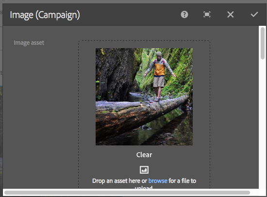
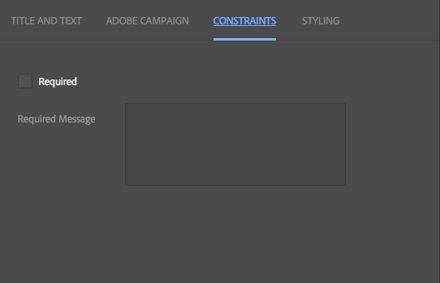

# Componenti di Adobe Campaign{#adobe-campaign-components}

Quando si esegue l’integrazione con Adobe Campaign, sono disponibili componenti per l’utilizzo di newsletter e moduli. Entrambi sono descritti in questo documento.

>[!CAUTION]
>
>I componenti e-mail dell’AEM sono stati dichiarati obsoleti. A causa della natura dell’e-mail, che unisce contenuti e stile, i componenti e-mail forniti come predefiniti dall’AEM vengono riutilizzati in modo limitato per i clienti, a causa della necessità di implementare stili personalizzati in tutti i componenti necessari per i progetti.
>
>I componenti e-mail possono essere implementati a livello di progetto, e i componenti e-mail AEM obsoleti illustrano come ciò possa essere ottenuto. Tuttavia, non utilizzare questi componenti obsoleti nei progetti.

## Componenti della newsletter di Adobe Campaign {#adobe-campaign-newsletter-components}

Tutti i componenti di Campaign seguono le best practice descritte in [Best practice per i modelli e-mail](/help/sites-administering/best-practices-for-email-templates.md) e si basano sul linguaggio di markup Adobe [HTL](https://helpx.adobe.com/it/experience-manager/htl/using/overview.html).

Quando apri una newsletter/e-mail configurata per l&#39;integrazione con Adobe Campaign, dovresti vedere i seguenti componenti nella sezione **Newsletter Adobe Campaign**:

* Intestazione (Campaign)
* Immagine (Campaign)
* Collegamento (Campagna)
* Modello immagini di Scene7 (Campaign)
* Riferimento di destinazione (Campaign)
* Testo e immagine (Campaign)
* Testo e personalizzazione (Campaign)

La descrizione di questi componenti è riportata nella sezione seguente.

I componenti vengono visualizzati come segue:

### Intestazione (Campaign) {#heading-campaign}

Il componente intestazione può:

* Visualizza il nome della pagina corrente lasciando vuoto il campo **Titolo**.
* Visualizza un testo specificato nel campo **Titolo**.

Puoi modificare direttamente il componente **Intestazione (Campaign)**. Lascia vuoto per usare il titolo della pagina.

Puoi configurare quanto segue:

* **Titolo**
Se si desidera utilizzare un nome diverso dal titolo della pagina, immetterlo qui.

* **Livello di intestazione (1, 2, 3, 4)**
Livello di intestazione in base alle dimensioni di intestazione HTML da 1 a 4.

L’esempio seguente mostra un componente Titolo (Campagna) visualizzato.

### Immagine (Campaign) {#image-campaign}

Il componente Immagine (campagna) visualizza un’immagine e il testo che la accompagna in base ai parametri specificati.

Puoi caricare un’immagine, quindi modificarla e manipolarla (ad esempio ritagliarla, ruotarla, aggiungere un collegamento/titolo/testo).

Puoi trascinare un&#39;immagine dal [Browser risorse](/help/sites-authoring/author-environment-tools.md#assetsbrowsertouchoptimizedui) direttamente nel componente o nella relativa [finestra di dialogo per configurazione](/help/sites-authoring/editing-content.md#editconfigurecopycutdeletepastetouchoptimizedui). Puoi anche caricare un’immagine dalla finestra di dialogo Configura, che controlla anche tutte le definizioni e le manipolazioni dell’immagine:

>[!NOTE]
>
>Immettere le informazioni nel campo **Testo alternativo** oppure non è possibile salvare l&#39;immagine.

Dopo che l&#39;immagine è stata caricata (e non prima) puoi utilizzare [la modifica diretta](/help/sites-authoring/editing-content.md#editcontenttouchoptimizedui) per ritagliare/ruotare l&#39;immagine come richiesto:

>[!NOTE]
>
>L’editor locale utilizza le dimensioni e le proporzioni originali dell’immagine durante la modifica. È inoltre possibile specificare le proprietà relative all&#39;altezza e alla larghezza. Tutte le restrizioni relative a dimensioni e proporzioni definite nelle proprietà vengono applicate quando si salvano le modifiche.
>
>A seconda dell&#39;istanza, le restrizioni minime e massime possono essere imposte anche dalla [progettazione della pagina](/help/sites-developing/designer.md); queste vengono sviluppate durante l&#39;implementazione del progetto.

Nella modalità di modifica a schermo intero sono disponibili diverse opzioni aggiuntive, ad esempio mappa e zoom:

Quando viene caricata un’immagine, puoi configurare quanto segue:

* **Mappa**
Per mappare un&#39;immagine, selezionare Mappa. È possibile specificare la modalità di creazione della mappa immagine (rettangolo, poligono e così via) e il punto a cui deve puntare l&#39;area.

* **Ritaglio**
Seleziona Ritaglia per ritagliare un’immagine. Utilizzare il mouse per ritagliare l&#39;immagine.

* **Ruota**
Per ruotare un&#39;immagine, selezionare Ruota. Usare ripetutamente fino a quando l&#39;immagine non viene ruotata nel modo desiderato.

* **Cancella**
Rimuove l&#39;immagine corrente.

* Barra di zoom (solo classica)
Per ingrandire e ridurre l&#39;immagine, utilizzare la barra di scorrimento sotto l&#39;immagine (sopra i pulsanti OK e Annulla)
* **Titolo**
Titolo dell&#39;immagine.

* **Testo alternativo**
Testo alternativo da utilizzare per la creazione di contenuto accessibile.

* **Collegamento A**
Crea un collegamento alle risorse o ad altre pagine del tuo sito web.

* **Descrizione**
Descrizione dell&#39;immagine.

* **Dimensione**
Imposta l&#39;altezza e la larghezza dell&#39;immagine.

>[!NOTE]
>
>Immetti le informazioni nel campo **Testo alternativo** della scheda **Avanzate** oppure l&#39;immagine non può essere salvata e viene visualizzato il seguente messaggio di errore:
>
>`Validation failed. Verify the values of the marked fields.`
>

L’esempio seguente mostra un componente Immagine (Campaign) visualizzato.

### Collegamento (Campagna) {#link-campaign}

Il componente Collegamento (Campagna) consente di aggiungere un collegamento alla newsletter.

Puoi configurare quanto segue nelle schede **Visualizzazione**, **Informazioni URL** o **Avanzate**:

* **Didascalia collegamento**
Didascalia del collegamento. Questo è il testo visualizzato dagli utenti.

* **Descrizione comando collegamento**
Aggiunge ulteriori informazioni sull&#39;utilizzo del collegamento.

* **TipoCollegamento**
Nell&#39;elenco a discesa selezionare tra un **URL personalizzato** e un **documento adattivo**. Questo campo è obbligatorio. Se selezioni URL personalizzato, puoi fornire l’URL del collegamento. Se selezioni Documento adattivo, puoi fornire il percorso del documento.

* **Parametro URL aggiuntivo**
Aggiungi eventuali parametri URL aggiuntivi. Fai clic su Aggiungi elemento per aggiungere più elementi.

>[!NOTE]
>
>Immetti le informazioni nel campo **Tipo di collegamento** nella scheda **Informazioni URL** oppure il componente non può essere salvato e viene visualizzato il seguente messaggio di errore:
>
>`Validation failed. Verify the values of the marked fields.`
>

L’esempio seguente mostra un componente Collega (Campagna) visualizzato.

### Modello immagini Dynamic Media Classic (Scene7) (Campaign) {#scene-image-template-campaign}

I modelli di immagine Dynamic Media Classic (Scene7) sono a più livelli e sono file di immagine a più livelli, in cui il contenuto e le proprietà possono essere parametrizzati per variabilità. Il componente **[!UICONTROL Modello immagine]** consente di utilizzare i modelli di Scene7 nelle newsletter e di modificare i valori dei parametri del modello. Inoltre, puoi utilizzare le variabili di metadati di Adobe Campaign all’interno dei parametri, in modo che ogni utente possa percepire l’immagine in modo personalizzato.

Fai clic su **Modifica** per configurare il componente. È possibile configurare le impostazioni descritte in questa sezione. Questo modello di immagine Scene7 è descritto in dettaglio in [Componente modello immagine Scene7](/help/assets/scene7.md#image-template).

Inoltre, il pannello dei parametri elenca tutti i parametri di modello definiti per il modello in Scene7. Per ciascuno di questi parametri, puoi adattare il valore, inserire variabili o reimpostarle sul valore predefinito.

### Riferimento di destinazione (Campaign) {#targeted-reference-campaign}

Il componente Riferimento di destinazione (Campaign) consente di creare un riferimento a un paragrafo di destinazione.

In questo componente, passa al paragrafo di destinazione per selezionarlo.

Fai clic sull’icona della cartella per passare al paragrafo a cui desideri fare riferimento. Al termine, fare clic sul segno di spunta.

### Testo e immagine (Campaign) {#text-image-campaign}

Il componente Testo e immagine (Campaign) aggiunge un blocco di testo e un’immagine.

Quando fai clic su per configurare il componente, selezioni Testo o Immagine.

Selezionando **Testo** viene visualizzato un editor in linea:

Selezionando **Immagine** viene visualizzato l&#39;editor locale per le immagini:

Per ulteriori informazioni sull&#39;utilizzo delle immagini, vedere il componente [Immagine (Campaign)](#image-campaign). Per ulteriori informazioni sull&#39;utilizzo del testo, vedere il componente [Text &amp; Personalization (Campaign)](#text-personalization-campaign).

Come per i componenti Testo e Personalization (Campaign) e Immagine (Campaign), puoi configurare:

* **Testo**
Immettere il testo. Utilizza la barra degli strumenti per modificare la formattazione, creare elenchi e aggiungere collegamenti.

* **Immagine**
Trascina un&#39;immagine dal Finder dei contenuti o fai clic per passare a un&#39;immagine. Ritagliare o ruotare in base alle esigenze.

* **Proprietà immagine** (**Proprietà immagine avanzate**)
Consente di specificare quanto segue:

   * **Titolo**
Titolo del blocco, visualizzato a comparsa.

   * **Testo alternativo**
Testo alternativo da visualizzare se l’immagine non può essere visualizzata.

   * **Collegamento a**
Crea un collegamento alle risorse o ad altre pagine del tuo sito web.

   * **Descrizione**
Descrizione dell&#39;immagine.

   * **Dimensione**
Imposta l&#39;altezza e la larghezza dell&#39;immagine.

>[!NOTE]
>
>Il campo **Testo alternativo** nella scheda **Avanzate** è obbligatorio oppure il componente non può essere salvato e viene visualizzato il seguente messaggio di errore:
>
>`Validation failed. Verify the values of the marked fields.`
>

L’esempio seguente mostra un componente Testo e immagine (Campaign) visualizzato.

### Testo e personalizzazione (Campaign) {#text-personalization-campaign}

Il componente Testo e Personalization (Campaign) consente di immettere un blocco di testo utilizzando un editor WYSIWYG, con funzionalità fornite dall&#39;[editor Rich Text](/help/sites-authoring/rich-text-editor.md). Questo componente consente inoltre di utilizzare i campi di contesto e i blocchi di personalizzazione disponibili da Adobe Campaign. Vedere anche [Inserimento di Personalization](/help/sites-authoring/campaign.md#inserting-personalization).

La selezione delle icone consente di formattare il testo, incluse le caratteristiche dei caratteri, l&#39;allineamento, i collegamenti, gli elenchi e i rientri. La funzionalità è sostanzialmente la stessa in [entrambe le interfacce utente](/help/sites-authoring/editing-content.md), anche se l&#39;aspetto è diverso:

Nell’editor locale puoi aggiungere testo, modificare la giustificazione, aggiungere e rimuovere collegamenti, aggiungere campi di contesto o blocchi di personalizzazione e attivare la modalità a schermo intero. Al termine dell’aggiunta di testo/personalizzazione, seleziona il segno di spunta per salvare le modifiche (o x per annullare). Per ulteriori informazioni, vedere [Modifica diretta](/help/sites-authoring/editing-content.md#editcontenttouchoptimizedui).

>[!NOTE]
>
>* I campi di personalizzazione disponibili dipendono dal modello Adobe Campaign a cui è collegata la newsletter.
>* Dopo aver selezionato un utente tipo da ContextHub, i campi di personalizzazione vengono sostituiti automaticamente dai dati del profilo selezionato.
>
>Vedere [Inserimento di Personalization](/help/sites-authoring/campaign.md#inserting-personalization).

>[!NOTE]
>
>Vengono presi in considerazione solo i campi definiti nello schema **nms:seedMember** o in una delle sue estensioni. Gli attributi delle tabelle collegate a **nms:seedMember** non sono disponibili.

## Componenti di Adobe Campaign Form {#adobe-campaign-form-components}

I componenti Adobe Campaign vengono utilizzati per creare un modulo che gli utenti compilano per abbonarsi a una newsletter, annullare l’abbonamento a una newsletter o aggiornare i propri profili utente. Per ulteriori informazioni, vedere [Creazione di Adobe Campaign Forms](/help/sites-authoring/adobe-campaign-forms.md).

Ogni campo componente può essere collegato a un campo del database di Adobe Campaign. I campi disponibili variano a seconda del tipo di dati in essi contenuti, come descritto nella sezione [Componenti e tipo di dati](#components-and-data-type). Se estendi lo schema dei destinatari in Adobe Campaign, i nuovi campi saranno disponibili nei componenti i cui tipi di dati corrispondono.

Quando apri un modulo configurato per l&#39;integrazione con Adobe Campaign, nella sezione **Adobe Campaign** vengono visualizzati i seguenti componenti:

* Casella di selezione (Campaign)
* Campo data (Campaign) e Campo data/HTML5 (Campaign)
* Chiave principale crittografata (Campaign)
* Visualizzazione errori (Campaign)
* Chiave di riconciliazione nascosta (Campaign)
* Campo numerico (Campaign)
* Campo opzione (Campaign)
* Lista di controllo delle iscrizioni (Campaign)
* Campo testo (Campaign)

I componenti vengono visualizzati come segue:

Questa sezione descrive in dettaglio ogni componente.

### Componenti e tipo di dati {#components-and-data-type}

La tabella seguente descrive i componenti disponibili per visualizzare e modificare i dati del profilo di Adobe Campaign. Ogni componente può essere mappato su un campo del profilo Adobe Campaign per visualizzarne il valore e aggiornare il campo quando il modulo viene inviato. I diversi componenti possono essere associati solo a campi di un tipo di dati appropriato.

<table>
 <tbody>
  <tr>
   <td>
<strong>Componente</strong>
 </td>
   <td>
<strong>Tipo di dati del campo Adobe Campaign</strong>
 </td>
   <td>
<strong>Campo di esempio</strong>
 </td>
  </tr>
  <tr>
   <td>
Casella di selezione (Campaign)
 </td>
   <td>
booleano
 </td>
   <td>
Non contattare più (tramite alcun canale)
 </td>
  </tr>
  <tr>
   <td>
Campo data (Campaign)
 
Campo data/HTML 5 (Campaign)
 </td>
   <td>
data
 </td>
   <td>
Data di nascita
 </td>
  </tr>
  <tr>
   <td>
Campo numerico (Campaign)
 </td>
   <td>
numerico (byte, breve, lungo, doppio)
 </td>
   <td>
Età
 </td>
  </tr>
  <tr>
   <td>
Campo opzione (Campaign)
 </td>
   <td>
byte con valori associati
 </td>
   <td>
Genere
 </td>
  </tr>
  <tr>
   <td>
Campo testo (Campaign)
 </td>
   <td>
stringa
 </td>
   <td>
E-mail
 </td>
  </tr>
 </tbody>
</table>

### Impostazioni comuni alla maggior parte dei componenti {#settings-common-to-most-components}

I componenti di Adobe Campaign hanno impostazioni comuni a tutti i componenti (ad eccezione dei componenti Crittografia chiave primaria e Riconciliazione nascosta).

Nella maggior parte dei componenti, puoi configurare i seguenti elementi:

#### Titolo e testo {#title-and-text}

* **Titolo**
Se desideri utilizzare un nome diverso da quello dell’elemento, inseriscilo qui.

* **Nascondi titolo**
Selezionare questa casella di controllo se non si desidera visualizzare il titolo.

* **Descrizione**
Aggiungi una descrizione al campo per fornire ulteriori informazioni agli utenti.

* **Mostra solo valore**
Mostra solo il valore, se presente

#### Adobe Campaign {#adobe-campaign}

Puoi configurare quanto segue:

* **Mappatura**
Se necessario, seleziona un campo di personalizzazione Adobe Campaign.

* **Chiave riconciliazione**
Seleziona questa casella di controllo se questo campo fa parte della chiave di riconciliazione.

#### Vincoli {#constraints}

* **Obbligatorio** Selezionare questa casella di controllo per rendere obbligatorio il componente, ovvero gli utenti devono immettere un valore.
* **Messaggio richiesto** È possibile aggiungere un messaggio che indichi che il campo è obbligatorio.

#### Attribuzione stile {#styling}

* **CSS**
Immetti le classi CSS da utilizzare per questo componente.

### Casella di selezione (Campaign) {#checkbox-campaign}

Il componente Casella di controllo (Campaign) consente all’utente di modificare i campi del profilo Adobe Campaign di tipo dati booleano. Ad esempio, puoi avere un componente Casella di controllo (Campagna) che consente al destinatario di specificare che non desidera essere contattato tramite alcun canale.

Puoi [configurare le impostazioni comuni alla maggior parte dei componenti di Adobe Campaign](#settings-common-to-most-components) nel componente Casella di controllo (Campagna).

L’esempio seguente mostra un componente Casella di controllo (Campaign) visualizzato.

### Campo data (Campaign) e Campo data/HTML 5 (Campaign) {#date-field-campaign-and-date-field-html-campaign}

Utilizza il campo data per consentire ai destinatari di impostare una data, ad esempio per specificare la data di nascita. Il formato della data corrisponde al formato utilizzato nell’istanza Adobe Campaign.

Oltre alle [impostazioni comuni alla maggior parte dei componenti di Adobe Campaign](#settings-common-to-most-components), puoi configurare quanto segue:

* **Vincoli - Vincolo** a discesa
È possibile selezionare - **Nessuno** o **Data -** per aggiungere il vincolo di una data o nessun vincolo. Se selezioni data, la risposta che gli utenti immettono nel campo deve essere in un formato data.

* **Messaggio vincolo** È inoltre possibile aggiungere un messaggio vincolo per consentire agli utenti di formattare correttamente le risposte.
* **Stile - Larghezza** Per regolare la larghezza del campo, tocca o fai clic sulle icone **+** e **-** oppure immetti un numero.

L’esempio seguente mostra un componente Campo data (Campaign) con la larghezza regolata.

### Chiave principale crittografata (Campaign) {#encrypted-primary-key-campaign}

Questo componente definisce il nome del parametro URL che conterrà l&#39;identificatore di un profilo di Adobe Campaign (**Identificatore risorsa principale** o **Chiave primaria crittografata** in Adobe Campaign Standard e 6.1, rispettivamente).

Ogni modulo che visualizza e modifica i dati del profilo di Adobe Campaign **deve** includere un componente chiave primaria crittografata.

Nel componente Chiave primaria crittografata (Campaign) puoi configurare quanto segue:

* **Titolo e testo - Nome elemento** Per impostazione predefinita è encryptedPK. È necessario modificare il nome dell&#39;elemento solo quando è in conflitto con il nome di un altro elemento nel modulo. Non ci sono due campi modulo che possono avere lo stesso nome elemento.
* **Adobe Campaign - Parametro URL** Aggiungi il parametro URL per EPK. Ad esempio, puoi utilizzare il valore **epk**.

L’esempio seguente mostra un componente Chiave primaria crittografata (Campaign) visualizzato.

### Visualizzazione errori (Campaign) {#error-display-campaign}

Questo componente consente di visualizzare gli errori di back-end. Per il corretto funzionamento del componente, la gestione degli errori del modulo deve essere impostata su Inoltra.

L’esempio seguente mostra un componente Visualizzazione errori (Campaign) visualizzato.

### Chiave di riconciliazione nascosta (Campaign) {#hidden-reconciliation-key-campaign}

Il componente Chiave riconciliazione nascosta (Campaign) consente di aggiungere campi nascosti come parte della chiave di riconciliazione a un modulo.

Nel componente Chiave riconciliazione nascosta (Campaign) puoi configurare quanto segue:

* **Titolo e testo - Nome elemento** Impostazione predefinita: reconcilKey. È necessario modificare il nome dell&#39;elemento solo quando è in conflitto con il nome di un altro elemento nel modulo. Non ci sono due campi modulo che possono avere lo stesso nome elemento.
* **Adobe Campaign - Mappatura** Esegui il mapping a un campo di personalizzazione Adobe Campaign.

L’esempio seguente mostra un componente Chiave di riconciliazione nascosta (Campaign) visualizzato.

### Campo numerico (Campaign) {#numeric-field-campaign}

Utilizza il campo numerico per consentire ai destinatari di immettere numeri, ad esempio la loro età.

Oltre alle [impostazioni comuni alla maggior parte dei componenti di Adobe Campaign](#settings-common-to-most-components), puoi configurare quanto segue:

* **Vincoli - Vincolo** a discesa
È possibile selezionare - **Nessuno** o **Numerico -** per aggiungere il vincolo di un numero o di nessun vincolo. Se si seleziona numero, la risposta che gli utenti immettono nel campo deve essere numerica.

* **Messaggio vincolo** È inoltre possibile aggiungere un messaggio vincolo per consentire agli utenti di formattare correttamente le risposte.
* **Stile - Larghezza** Per regolare la larghezza del campo, tocca o fai clic sulle icone **+** e **-** oppure immetti un numero.

L’esempio seguente mostra un componente Campo numerico (Campaign) con la larghezza configurata.

### Campo opzione (Campaign) {#option-field-campaign}

Questo elenco a discesa consente di selezionare un’opzione, ad esempio il genere o lo stato di un destinatario.

È possibile [configurare le impostazioni comuni alla maggior parte dei componenti di Adobe Campaign](#settings-common-to-most-components) nel componente Campo opzione (Campaign). Per popolare l’elenco a discesa, seleziona il campo appropriato nei campi di personalizzazione di Adobe Campaign toccando o facendo clic sul simbolo Adobe Campaign e navigando fino al campo.

L’esempio seguente mostra un componente Campo opzione (Campaign) visualizzato.

### Lista di controllo delle iscrizioni (Campaign) {#subscriptions-checklist-campaign}

Utilizza il componente **Elenco di controllo sottoscrizioni (Campaign)** per modificare le sottoscrizioni associate a un profilo Adobe Campaign.

Quando viene aggiunto a un modulo, questo componente visualizza tutte le sottoscrizioni disponibili come caselle di controllo e consente all’utente di selezionare le sottoscrizioni desiderate. Quando gli utenti inviano il modulo, questo componente sottoscrive o annulla l&#39;abbonamento dell&#39;utente ai servizi selezionati a seconda del tipo di azione del modulo (**Adobe Campaign: Subscribe to Services** o **Adobe Campaign: Unsubscribe from Services**).

>[!NOTE]
>
>Il componente non controlla i servizi a cui l’utente è già abbonato/da cui ha annullato l’abbonamento.

È possibile [configurare le impostazioni comuni alla maggior parte dei componenti di Adobe Campaign](#settings-common-to-most-components) nel componente Elenco di controllo sottoscrizioni (Campaign). Non sono disponibili configurazioni di Adobe Campaign per questo componente.

L’esempio seguente mostra un componente Elenco di controllo iscrizioni (Campaign) visualizzato.

### Campo testo (Campaign) {#text-field-campaign}

Il componente Campo di testo (Campaign) che consente di immettere dati di tipo stringa, ad esempio un nome, un cognome, un indirizzo, un indirizzo e-mail e così via.

Oltre alle [impostazioni comuni alla maggior parte dei componenti di Adobe Campaign](#settings-common-to-most-components), puoi configurare quanto segue:

* **Vincoli - Vincolo** a discesa
È possibile selezionare - **Nessuno,** **E-mail** o **Nome** (senza umlaut) - per aggiungere il vincolo di un indirizzo e-mail, di un nome o di nessun vincolo. Se selezioni e-mail, la risposta che gli utenti immettono nel campo deve essere un indirizzo e-mail. Se selezioni nome, deve essere un nome (gli umlaut non sono consentiti).

* **Messaggio vincolo** È inoltre possibile aggiungere un messaggio vincolo per consentire agli utenti di formattare correttamente le risposte.
* **Stile - Larghezza** Per regolare la larghezza del campo, tocca o fai clic sulle icone **+** e **-** oppure immetti un numero.

L’esempio seguente mostra un componente Campo di testo (Campaign) visualizzato.

