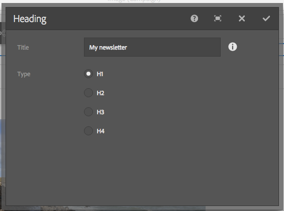
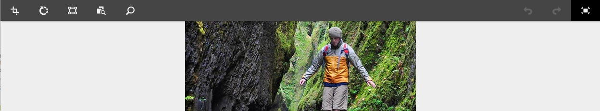
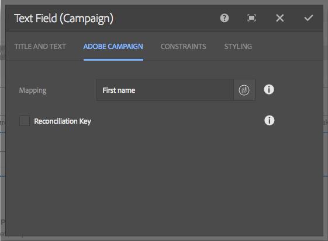
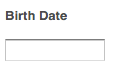

# Componenti di Adobe Campaign{#adobe-campaign-components}

Al momento dell’integrazione con Adobe Campaign, hai a disposizione componenti per newsletter e moduli. In questo documento sono descritti entrambi.

>[!CAUTION]
>
>I componenti e-mail AEM sono stati dichiarati obsoleti. A causa della natura dell’e-mail, che unisce contenuto e stile, i componenti e-mail forniti come predefiniti AEM diventano di uso limitato per i clienti a causa della necessità di implementare stili personalizzati in tutti i componenti necessari per i progetti.
>
>I componenti e-mail possono essere implementati a livello di progetto e i componenti e-mail AEM componenti e-mail obsoleti illustrano come ottenere questo risultato. Tuttavia, questi componenti obsoleti non devono essere utilizzati nei progetti.

## Componenti per newsletter di Adobe Campaign {#adobe-campaign-newsletter-components}

Tutti i componenti di Campaign seguono le best practice descritte in [Best practice per i modelli di e-mail](/help/sites-administering/best-practices-for-email-templates.md) e sono basati sul linguaggio di markup Adobe [HTL](https://helpx.adobe.com/it/experience-manager/htl/using/overview.html).

Quando apri una newsletter/e-mail configurata per l’integrazione con Adobe Campaign, verifica che i seguenti componenti siano presenti nella sezione **Newsletter di Adobe Campaign**:

* Intestazione (Campaign)
* Immagine (Campaign)
* Collegamento (Campaign)
* Modello immagini Scene7 (Campaign)
* Riferimento di destinazione (Campaign)
* Testo e immagine (Campaign)
* Testo e personalizzazione (Campaign)

La sezione seguente descrive questi componenti.

I componenti vengono visualizzati come segue:

### Intestazione (Campaign) {#heading-campaign}

Per il componente di intestazione è possibile:

* Mostrare il nome della pagina corrente lasciando vuoto il campo **Titolo**.
* Mostrare un testo specificato nel campo **Titolo**.

Modifica direttamente il componente **Intestazione (Campaign)**. Lascia vuoto per usare il titolo della pagina.

Puoi configurare le seguenti operazioni:

* **Titolo** Per utilizzare un nome diverso dal titolo della pagina, inseriscilo in questo campo.

* **Livello di intestazione (1, 2, 3, 4)** Il livello di intestazione basato sulle dimensioni da 1 a 4 in HTML.

Il seguente esempio mostra come viene visualizzato il componente Intestazione (Campaign).

### Immagine (Campaign) {#image-campaign}

Il componente Immagine (Campaign) mostra un’immagine e il relativo testo in base ai parametri specificati.

Puoi caricare un’immagine, quindi modificarla e manipolarla (ad esempio ritagliandola, ruotandola o aggiungendo un collegamento, un titolo o un testo).

Potete trascinare un&#39;immagine dal [Browser risorse](/help/sites-authoring/author-environment-tools.md#assetsbrowsertouchoptimizedui) direttamente sul componente o nella relativa [finestra di dialogo Configura](/help/sites-authoring/editing-content.md#editconfigurecopycutdeletepastetouchoptimizedui). È anche possibile caricare un&#39;immagine dalla finestra di dialogo Configura; questa finestra di dialogo controlla anche tutte le definizioni e le operazioni di alterazione delle immagini:

>[!NOTE]
>
>È necessario immettere le informazioni nel **Testo Alt** oppure l&#39;immagine non può essere salvata.

Dopo il caricamento dell’immagine (e non prima) puoi utilizzare [modifica diretta](/help/sites-authoring/editing-content.md#editcontenttouchoptimizedui) per ritagliare/ruotare l’immagine come necessario:

>[!NOTE]
>
>L’editor locale utilizza le dimensioni e le proporzioni originali dell’immagine durante la modifica. È inoltre possibile specificare le proprietà relative a altezza e larghezza. Eventuali restrizioni relative a dimensioni e proporzioni definite nelle proprietà vengono applicate al salvataggio delle modifiche.
>
>In base all’istanza, le limitazioni minime e massime possono essere imposte anche a partire dalla [progettazione della pagina](/help/sites-developing/designer.md); queste vengono sviluppate durante l’implementazione del progetto.

Diverse opzioni aggiuntive sono disponibili nella modalità di modifica a schermo intero, ad esempio, mappa e zoom: 

Quando carichi un’immagine, puoi configurare le opzioni seguenti:

* **Mappa** Per mappare un’immagine, seleziona Mappa. È possibile specificare come si desidera creare la mappa immagine (rettangolare, poligonale, e così via) e specificare la destinazione dell’area.

* **Ritaglia** Consente di ritagliare un’immagine. Utilizza il mouse per ritagliare.

* **Rotazione** Per ruotare un’immagine. Fai clic più volte fino a ottenere la rotazione desiderata.

* **Cancella** Rimuove l’immagine corrente.

* Barra Zoom (solo interfaccia classica) Per ingrandire e ridurre l’immagine, utilizzate la barra di scorrimento al di sotto dell’immagine (sopra i pulsanti OK e Annulla)
* **Titolo** Il titolo dell’immagine.

* **Testo Alt** Un testo alternativo da utilizzare per la creazione di contenuti accessibili.

* **Collega a** Crea un collegamento a risorse o altre pagine nel tuo sito web.

* **Descrizione** Una descrizione dell’immagine.

* **Dimensioni** Consente di impostare l’altezza e la larghezza dell’immagine.

>[!NOTE]
>
>Immetti le informazioni nel campo **Testo Alt** della scheda **Avanzate**. In caso contrario l’immagine non verrà salvata e verrà visualizzato il seguente messaggio di errore:
>
>`Validation failed. Verify the values of the marked fields.`

Il seguente esempio mostra come viene visualizzato il componente Immagine (Campaign).

### Collegamento (Campaign) {#link-campaign}

Il componente Collegamento (Campaign) consente di aggiungere un collegamento alla newsletter.

Puoi configurare le seguenti operazioni nelle schede **Visualizzazione**, **Informazioni URL** o **Avanzate**:

* **Didascalia collegamento** La didascalia per il collegamento. Questo è il testo che gli utenti vedranno.

* **Descrizione collegamento** Ulteriori informazioni su come utilizzare il collegamento.

* **LinkType**
Nell’elenco a discesa , seleziona tra 
**URL personalizzato** e **Documento adattivo**. Questo campo è obbligatorio. Se selezioni URL personalizzato, puoi fornire l’URL del collegamento. Se selezioni Documento adattivo, puoi fornire il percorso del documento.

* **Parametro URL aggiuntivo** Aggiungi eventuali parametri URL aggiuntivi. Fai clic su Aggiungi elemento per aggiungere altri elementi.

>[!NOTE]
>
>È necessario immettere le informazioni nel **Tipo di collegamento** nel campo **Informazioni URL** oppure il componente non può essere salvato e viene visualizzato il seguente messaggio di errore:
>
>`Validation failed. Verify the values of the marked fields.`

I seguenti esempi mostrano come viene visualizzato un componente Collegamento (Campaign).

### Modello immagini Dynamic Media Classic (Scene7) (Campaign) {#scene-image-template-campaign}

I modelli immagine Dynamic Media Classic (Scene7) sono a livelli costituiti da file immagine a più livelli, in cui il contenuto e le proprietà possono essere parametrizzati in base alla variabilità. Il componente **[!UICONTROL Modello immagini]** consente di utilizzare i modelli di Scene7 all&#39;interno delle newsletter e modificare i valori dei parametri di modello. Inoltre, puoi utilizzare le variabili dei metadati Adobe Campaign all&#39;interno dei parametri, in modo che ogni utente possa visualizzare l&#39;immagine in modo personalizzato.

Fai clic su **Modifica** per configurare il componente. Puoi configurare le impostazioni descritte in questa sezione. Questo modello di immagine Scene7 è descritto dettagliatamente [Componente Modello immagini Scene7](/help/assets/scene7.md#image-template).

Inoltre, il pannello dei parametri elenca tutti i parametri del modello che sono stati definiti per il modello in Scene7. Per ciascuno di questi parametri, puoi personalizzare il valore, inserire variabili o ripristinarli ai loro valori predefiniti.

### Riferimento di destinazione (Campaign) {#targeted-reference-campaign}

Il componente Riferimento di destinazione (Campaign) consente di creare un rimando a un paragrafo di destinazione.

In questo componente, accedi al paragrafo di destinazione per selezionarlo.

Fai clic sull’icona della cartella per accedere al paragrafo a cui fare riferimento. Una volta terminato, fai clic sul segno di spunta.

### Testo e immagine (Campaign) {#text-image-campaign}

Il componente Testo e immagine (Campaign) aggiunge un blocco di testo e un’immagine.

Quando fai clic per configurare il componente, seleziona il testo o l’immagine.

Selezionando **Testo** viene visualizzato un editor in linea:

Selezionando **Immagine** viene visualizzato un editor in linea per le immagini:

Consulta [componente Immagine (Campaign)](#image-campaign) per ulteriori informazioni sulle operazioni con le immagini. Consulta [componente Testo e personalizzazione (Campaign)](#text-personalization-campaign) per ulteriori informazioni sulle operazioni con il testo.

Come per i componenti di Testo e personalizzazione (Campaign) e Immagine (Campaign), puoi configurare:

* **Testo** Immetti il testo. Utilizza la barra degli strumenti per modificare la formattazione, creare elenchi e aggiungere collegamenti.

* **Immagine** Trascina un’immagine da Content Finder oppure fai clic per individuare l’immagine desiderata. Ritaglia o ruota come richiesto.

* **Proprietà immagine** **(Proprietà immagine avanzate**)
: consente di specificare quanto segue:

   * **Titolo** Titolo del blocco di testo che verrà visualizzato al passaggio del mouse.

   * **Testo Alt** Testo alternativo che verrà mostrato qualora l’immagine non sia disponibile.

   * **Collega a** Crea un collegamento a risorse o altre pagine nel tuo sito web.

   * **Descrizione** Una descrizione dell’immagine.

   * **Dimensioni** Imposta l’altezza e la larghezza dell’immagine.

>[!NOTE]
>
>Il campo **Testo Alt** nella scheda **Avanzate** è obbligatorio; se non viene fornito, il componente non verrò salvato e viene visualizzato il seguente messaggio di errore:
>
>`Validation failed. Verify the values of the marked fields.`

I seguenti esempi mostrano un componente Testo e immagine (Campaign) che viene visualizzato.

### Testo e personalizzazione (Campaign) {#text-personalization-campaign}

Il componente Testo e personalizzazione (Campaign) consente di inserire un blocco di testo utilizzando un editor WYSIWYG, con funzionalità fornite da [Editor Rich Text](/help/sites-authoring/rich-text-editor.md). Inoltre, consente di utilizzare i campi di contesto e i blocchi di personalizzazione da Adobe Campaign. Consulta [Inserimento di personalizzazioni](/help/sites-authoring/campaign.md#inserting-personalization).

Le varie icone consentono di formattare il testo con font, allineamento, collegamenti, elenchi e rientri. La funzionalità è sostanzialmente la stessa in [entrambe le interfacce](/help/sites-authoring/editing-content.md), anche se l’aspetto è diverso:

Nell’editor interno è possibile aggiungere testo, modificare la giustificazione, aggiungere e rimuovere collegamenti, aggiungere campi contestuali o blocchi di personalizzazione ed entrare in modalità a schermo intero. Una volta finito di aggiungere testo/personalizzare, seleziona il segno di spunta per salvare le modifiche (oppure x per annullare). Vedi [Modifica locale](/help/sites-authoring/editing-content.md#editcontenttouchoptimizedui) per ulteriori informazioni.

>[!NOTE]
>
>* I campi disponibili dipendono dal modello di Adobe Campaign a cui la newsletter è collegata.
>* Dopo aver selezionato una persona da ContextHub, i campi di personalizzazione vengono automaticamente sostituiti dai dati del profilo selezionato.
>
>Consulta [Inserimento di personalizzazioni](/help/sites-authoring/campaign.md#inserting-personalization).

>[!NOTE]
>
>Vengono presi in considerazione solo i campi definiti nello schema **nms:seedMember** o in una delle sue estensioni. Gli attributi di tabelle collegate a **nms:seedMember** non sono disponibili.

## Componenti per i moduli di Adobe Campaign {#adobe-campaign-form-components}

Utilizza i componenti di Adobe Campaign per creare un modulo che gli utenti dovranno compilare per iscriversi a una newsletter, annullare l’iscrizione a una newsletter o aggiornare il proprio profilo utente. Consulta [Creazione di moduli di Adobe Campaign](/help/sites-authoring/adobe-campaign-forms.md).

Ogni campo del componente può essere collegato a un campo del database di Adobe Campaign. I campi disponibili dipendono dal tipo di dati che contengono, come descritto nella sezione [Componenti e tipi di dati](#components-and-data-type). Se si estende lo schema dei destinatari in Adobe Campaign, i nuovi campi saranno disponibili nei componenti con tipi di dati corrispondenti.

Quando si apre un modulo configurato per l’integrazione con Adobe Campaign, vengono visualizzati i seguenti componenti nel **Adobe Campaign** sezione:

* Casella di selezione (Campaign)
* Campo data (Campaign) e Campo data/HTML 5 (Campaign)
* Chiave principale crittografata (Campaign)
* Visualizzazione errori (Campaign)
* Chiave riconciliazione nascosta (Campaign)
* Campo numerico (Campaign)
* Campo opzione (Campaign)
* Lista di controllo delle iscrizioni (Campaign)
* Campo testo (Campaign)

I componenti vengono visualizzati come segue:

Questa sezione descrive ogni componente.

### Componenti e tipi di dati {#components-and-data-type}

La tabella seguente descrive i componenti disponibili per visualizzare e modificare i dati di profilo Adobe Campaign. Ogni componente può essere mappato su un campo profilo Adobe Campaign, per visualizzarne il valore e aggiornare il campo quando il modulo viene inviato. I diversi componenti possono essere associati solo a campi di un tipo di dati appropriato.

<table>
 <tbody>
  <tr>
   <td>
<strong>Componente</strong>
 </td>
   <td>
<strong>Tipo di dati del campo Adobe Campaign</strong>
 </td>
   <td>
<strong>Campo di esempio</strong>
 </td>
  </tr>
  <tr>
   <td>
Casella di selezione (Campaign)
 </td>
   <td>
booleano
 </td>
   <td>
Nessun contatto (da qualsiasi canale)
 </td>
  </tr>
  <tr>
   <td>
Campo data (Campaign)
 
Campo data/HTML 5 (Campaign)
 </td>
   <td>
data
 </td>
   <td>
Data di nascita
 </td>
  </tr>
  <tr>
   <td>
Campo numerico (Campaign)
 </td>
   <td>
numerico (byte, breve, lungo, doppio)
 </td>
   <td>
Età
 </td>
  </tr>
  <tr>
   <td>
Campo opzione (Campaign)
 </td>
   <td>
byte con valori associati
 </td>
   <td>
Genere
 </td>
  </tr>
  <tr>
   <td>
Campo testo (Campaign)
 </td>
   <td>
stringa
 </td>
   <td>
E-mail
 </td>
  </tr>
 </tbody>
</table>

### Impostazioni comuni alla maggior parte dei componenti {#settings-common-to-most-components}

I componenti di Adobe Campaign hanno impostazioni comuni a tutti i componenti (eccetto i componenti Chiave principale crittografata e Chiave di riconciliazione nascosta).

Nella maggior parte dei componenti, è possibile configurare le seguenti operazioni:

#### Titolo e testo {#title-and-text}

* **Titolo** Per utilizzare un nome diverso dal nome dell’elemento, inseriscilo in questo campo.

* **Nascondi titolo** Seleziona questa casella se non intendi rendere il titolo visibile.

* **Descrizione** Aggiungi una descrizione al campo per fornire ulteriori informazioni per gli utenti.

* **Mostra solo valore** Mostra solo il valore, se presente.

#### Adobe Campaign {#adobe-campaign}

Puoi configurare le seguenti operazioni:

* **Mappatura** Seleziona un campo per la personalizzazione di Adobe Campaign, se appropriato.

* **Chiave riconciliazione** Seleziona questa casella di controllo se questo campo fa parte della chiave di riconciliazione.

#### Vincoli {#constraints}

* **Obbligatorio** Seleziona questa casella di controllo per rendere questo componente obbligatorio: gli utenti devono immettere un valore.
* **Messaggio richiesto** Se necessario, aggiungi un messaggio che segnala che il campo è obbligatorio.

#### Attribuzione stile {#styling}

* **CSS** Immetti le classi CSS da usare per questo componente.

### Casella di selezione (Campaign) {#checkbox-campaign}

Il componente Casella di selezione (Campaign) consente all’utente di modificare i campi del profilo Adobe Campaign che corrispondono al tipo di dati booleano. Ad esempio, potresti disporre di un componente Casella di selezione (Campaign) che consente al destinatario di specificare che non desidera essere contattato tramite alcun canale.

Puoi [configurare le impostazioni comuni alla maggior parte dei componenti di Adobe Campaign](#settings-common-to-most-components) nel componente Casella di selezione (Campaign).

I seguenti esempi mostrano come viene visualizzato il componente Casella di selezione (Campaign).

### Campo data (Campaign) e Campo data/HTML 5 (Campaign) {#date-field-campaign-and-date-field-html-campaign}

Consenti ai destinatari di aggiungere una data tramite il campo data; ad esempio, ai destinatari potrebbe essere richiesto di specificare la data di nascita. Il formato della data corrisponde al formato utilizzato nell’istanza di Adobe Campaign.

Oltre alle [impostazioni comuni alla maggior parte dei componenti di Adobe Campaign](#settings-common-to-most-components), puoi configurare le seguenti opzioni:

* **Vincoli - Vincolo** a discesa È possibile selezionare - **Nessuno** o **Data -** per aggiungere il vincolo di una data o nessun vincolo. Se si seleziona la data, le risposte inserite dagli utenti nel campo devono essere in un formato data.

* **Messaggio vincolo** Puoi aggiungere un messaggio che spieghi agli utenti come formattare correttamente le risposte.
* **Stile - Larghezza** Per regolare la larghezza del campo, tocca o fai clic sul pulsante **+** e **-** icone o immissione di un numero.

L’esempio seguente mostra come viene visualizzato il componente Campo data (Campaign) con la larghezza regolata.

### Chiave principale crittografata (Campaign) {#encrypted-primary-key-campaign}

Questo componente definisce il dominio del parametro URL che conterrà l’identificatore di un profilo Adobe Campaign: **Main Resource ID** (Identificatore della risorsa principale) o **Encrypted primary key** (Chiave principale crittografata), rispettivamente in Adobe Campaign Standard e 6.1.

Ogni modulo che visualizza e modifica i dati di profilo Adobe Campaign **deve** includere un componente Chiave principale crittografata.

Puoi configurare le seguenti opzioni nel componente Chiave principale crittografata (Campaign):

* **Titolo e testo: Nome elemento** L’impostazione predefinita è encryptedPK. È sufficiente modificare il nome dell’elemento quando è in conflitto con il nome di un altro elemento del modulo. Due campi del modulo non possono avere lo stesso nome elemento.
* **Adobe Campaign: parametro URL** Aggiungi il parametro URL per EPK. Ad esempio, puoi utilizzare il valore **epk**.

I seguenti esempi mostrano come viene visualizzato il componente Chiave principale crittografata (Campaign).

### Visualizzazione errori (Campaign) {#error-display-campaign}

Questo componente consente di visualizzare gli errori di backend. Per far funzionare correttamente il componente, la gestione degli errori del modulo deve essere impostata su Inoltra.

I seguenti esempi mostrano come viene visualizzato il componente Visualizzazione errori (Campaign).

### Chiave riconciliazione nascosta (Campaign) {#hidden-reconciliation-key-campaign}

Il componente Chiave riconciliazione nascosta (Campaign) consente di aggiungere a un modulo campi nascosti come parte della chiave di riconciliazione.

Puoi configurare le seguenti opzioni nel componente Chiave riconciliazione nascosta (Campaign):

* **Titolo e testo: Nome elemento** L’impostazione predefinita è reconcilKey. È sufficiente modificare il nome dell’elemento quando è in conflitto con il nome di un altro elemento del modulo. Due campi del modulo non possono avere lo stesso nome elemento.
* **Adobe Campaign: Mappatura** Mappa su un campo per la personalizzazione di Adobe Campaign.

Il seguente esempio mostra come viene visualizzato il componente Chiave riconciliazione nascosta (Campaign).

### Campo numerico (Campaign) {#numeric-field-campaign}

Usa il campo numerico per consentire ai destinatari di immettere numeri, ad esempio la loro età.

Oltre alle [impostazioni comuni alla maggior parte dei componenti di Adobe Campaign](#settings-common-to-most-components), puoi configurare le seguenti opzioni:

* **Vincoli - Vincolo** a discesa È possibile selezionare - **Nessuno** o **Numerico -** per aggiungere il vincolo di un numero o nessun vincolo. Se si seleziona un numero, le risposte inserite dagli utenti nel campo devono essere numeriche.

* **Messaggio vincolo** Puoi aggiungere un messaggio che spieghi agli utenti come formattare correttamente le risposte.
* **Stile - Larghezza** Per regolare la larghezza del campo, tocca o fai clic sul pulsante **+** e **-** icone o immissione di un numero.

L’esempio seguente mostra come viene visualizzato il componente Campo numerico (Campaign) con la larghezza configurata.

### Campo opzione (Campaign) {#option-field-campaign}

Questo elenco a discesa consente di selezionare un’opzione; ad esempio, il sesso o lo stato di un destinatario.

Puoi [configurare le impostazioni comuni alla maggior parte dei componenti di Adobe Campaign](#settings-common-to-most-components) nel componente Campo opzione (Campaign). Per compilare l’elenco a discesa, seleziona il campo appropriato nei campi di personalizzazione di Adobe Campaign toccando o facendo clic sul simbolo di Adobe Campaign e passando al campo.

I seguenti esempi mostrano come viene visualizzato il componente Campo opzione (Campaign).

### Lista di controllo delle iscrizioni (Campaign) {#subscriptions-checklist-campaign}

Usa il componente **Lista di controllo delle iscrizioni (Campaign)** per modificare le iscrizioni associate a un profilo Adobe Campaign.

Una volta aggiunto a un modulo, questo componente mostra tutte le iscrizioni disponibili come caselle di controllo e consente all’utente di selezionare quelle desiderate. Quando gli utenti inviano il modulo, questo componente si abbona o annulla l’iscrizione dell’utente ai servizi selezionati a seconda del tipo di azione del modulo (**Adobe Campaign: Iscriviti ai servizi** o **Adobe Campaign: Annulla sottoscrizione a servizi**).

>[!NOTE]
>
>Il componente non controlla a quali servizi l’utente è già iscritto o meno.

Puoi [configurare le impostazioni comuni alla maggior parte dei componenti di Adobe Campaign](#settings-common-to-most-components) nel componente Lista di controllo delle iscrizioni (Campaign). Non sono disponibili configurazioni di Adobe Campaign per questo componente.

I seguenti esempi mostrano come viene visualizzato un componente Lista di controllo delle iscrizioni (Campaign).

### Campo testo (Campaign) {#text-field-campaign}

Il componente Campo testo (Campaign) che consente di immettere dati di tipo stringa, quali nome, cognome, indirizzo, indirizzo e-mail e così via.

Oltre alle [impostazioni comuni alla maggior parte dei componenti di Adobe Campaign](#settings-common-to-most-components), puoi configurare le seguenti opzioni:

* **Vincoli - Vincolo** a discesa È possibile selezionare - **Nessuno** **E-mail** oppure **Nome** (senza umlaut) - per aggiungere il vincolo di un indirizzo e-mail, un nome o nessun vincolo. Se selezioni E-mail, le risposte inserite dagli utenti nel campo devono essere un indirizzo e-mail. Se selezioni il nome, deve essere un nome (gli umlaut non sono consentiti).

* **Messaggio vincolo** Puoi aggiungere un messaggio che spieghi agli utenti come formattare correttamente le risposte.
* **Stile - Larghezza** Per regolare la larghezza del campo, tocca o fai clic sul pulsante **+** e **-** icone o immissione di un numero.

I seguenti esempi mostrano viene visualizzato un componente Campo testo (Campaign).

