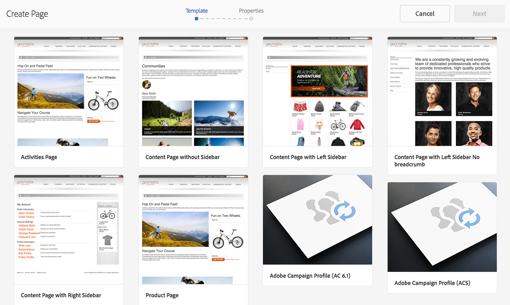

# Creazione di Adobe Campaign Forms nell’AEM {#creating-adobe-campaign-forms-in-aem}

AEM consente di creare e utilizzare moduli che interagiscono con Adobe Campaign sul sito web. Campi specifici possono essere inseriti nei moduli e mappati al database di Adobe Campaign.

Puoi gestire le sottoscrizioni di nuovi contatti, il loro annullamento e i dati del profilo utente, il tutto integrando i relativi dati nel database di Adobe Campaign.

Per utilizzare Adobe Campaign Forms nell’AEM, è necessario seguire questi passaggi, descritti in questo documento:

1. Rendi disponibile un modello.
1. Creare un modulo.
1. Modifica il contenuto del modulo.

Per impostazione predefinita, sono disponibili tre tipi di moduli specifici di Adobe Campaign:

* Salvare un profilo
* Abbonati a un servizio
* Annullare l’abbonamento a un servizio

Questi moduli definiscono un parametro URL che accetta la chiave primaria crittografata di un profilo Adobe Campaign. In base a questo parametro URL, il modulo aggiorna i dati del profilo Adobe Campaign associato.

Anche se questi moduli vengono creati in modo indipendente, in un caso d’uso tipico viene generato un collegamento personalizzato a una pagina di modulo all’interno del contenuto della newsletter, in modo che i destinatari possano aprire il collegamento e apportare modifiche ai dati del loro profilo (sia che si tratti dell’annullamento dell’abbonamento, dell’abbonamento o dell’aggiornamento del profilo).

Il modulo viene aggiornato automaticamente in base all’utente. Consulta [Modifica del contenuto di un modulo](#editing-form-content) per ulteriori informazioni.

## Come rendere disponibile un modello {#making-a-template-available}

Prima di poter creare moduli specifici per Adobe Campaign, è necessario rendere disponibili i diversi modelli nell’applicazione AEM.

Per eseguire questa operazione, vedere [Documentazione sui modelli](/help/sites-developing/templates.md#template-availability).

## Creazione di un modulo {#creating-a-form}

Adobe Campaign Prima di tutto, verifica che la connessione tra le istanze di authoring e pubblicazione funzioni correttamente. Consulta [Integrazione con Adobe Campaign Standard](/help/sites-administering/campaignstandard.md) o [Integrazione con Adobe Campaign Classic](/help/sites-administering/campaignonpremise.md).

>[!NOTE]
>
>Assicurati che le **acMapping** proprietà nel file della pagina **jcr:content** nodo impostato su **mapRecipient** o **profilo** quando si utilizza rispettivamente Adobe Campaign Classic o Adobe Campaign Standard
>

1. In AEM, in Sites, individua il punto in cui desideri creare una pagina.
1. Crea una pagina e seleziona **Profilo Adobe Campaign Classic** o **Profilo Adobe Campaign Standard** e fai clic su **Successivo**.

   

   >[!NOTE]
   >
   >Se il modello desiderato non è disponibile, vedi [Disponibilità dei modelli](/help/sites-developing/templates.md#template-availability).

1. In **Nome** , aggiungi il nome della pagina. Deve essere un nome JCR valido.
1. In **Titolo** , inserisci un titolo e fai clic su **Crea**.
1. Apri la pagina e seleziona **Apri proprietà** e in Cloud Service aggiungi la configurazione di Adobe Campaign e seleziona il segno di spunta per salvare le modifiche.

   

1. Nella pagina, nella sezione **Inizio modulo** , seleziona il tipo di modulo desiderato - **Abbonati, Annulla iscrizione,** o **Salva profilo**. È possibile specificare un solo tipo per modulo. Ora puoi [modificare il contenuto del modulo](#editing-form-content).

## Modifica del contenuto di un modulo {#editing-form-content}

Forms dedicato ad Adobe Campaign dispone di componenti specifici. Questi componenti dispongono di un’opzione che consente di collegare ogni campo del modulo a un campo del database di Adobe Campaign.

>[!NOTE]
>
>Se il modello desiderato non è disponibile, vedi [Come rendere disponibile un modello](/help/sites-authoring/adobe-campaign.md).

Questa sezione descrive solo collegamenti specifici ad Adobe Campaign. Per ulteriori informazioni su una panoramica più generale dell’utilizzo dei moduli in Adobe Experience Manager, consulta [Componenti modalità di modifica](/help/sites-authoring/default-components-foundation.md).

1. Seleziona **Apri proprietà** e in Cloud Service aggiungi la configurazione di Adobe Campaign e seleziona il segno di spunta per salvare le modifiche.

   

1. Nella pagina, nella sezione **Inizio modulo** fare clic sull&#39;icona Configurazione.

   

1. Fai clic su **Avanzate** e selezionare il tipo di modulo desiderato - **Abbonati, Annulla iscrizione,** o **Salva profilo** e fai clic su **OK.** È possibile specificare un solo tipo per modulo.

   * **Adobe Campaign: Salva profilo**: consente di creare o aggiornare un destinatario in Adobe Campaign (valore predefinito).
   * **Adobe Campaign: abbonati ai servizi**: consente di gestire gli abbonamenti di un destinatario in Adobe Campaign.
   * **Adobe Campaign: Annulla iscrizione a servizi**: consente di annullare gli abbonamenti di un destinatario in Adobe Campaign.

1. Devi avere un **Chiave principale crittografata** in ogni modulo. Questo componente definisce quale parametro URL viene utilizzato per accettare la chiave primaria crittografata di un profilo Adobe Campaign. In Componenti, seleziona Adobe Campaign in modo che siano visibili solo i componenti.
1. Trascina il componente **Chiave principale crittografata** al modulo (ovunque) e fare clic sul pulsante **Configurazione** icona. In **Adobe Campaign** , specifica un nome per il parametro URL. Fai clic sul segno di spunta per salvare le modifiche.

   I collegamenti generati a questo modulo devono utilizzare questo parametro URL e assegnargli la chiave primaria crittografata di un profilo Adobe Campaign. La chiave primaria crittografata deve essere correttamente codificata nell&#39;URL (percentuale).

   

1. Aggiungere al modulo i componenti necessari, ad esempio un campo di testo, un campo di data, un campo casella di controllo, un campo di opzione e così via. Consulta [Componenti di Adobe Campaign Form](/help/sites-authoring/adobe-campaign-components.md) per ulteriori informazioni su ciascun componente.
1. Fai clic sull’icona Configurazione per aprire il componente. Ad esempio, in **Campo di testo (Campaign)** , modificare il titolo e il testo.

   Clic **Adobe Campaign** per mappare il campo modulo a una variabile di metadati Adobe Campaign. Quando invii il modulo, il campo mappato viene aggiornato in Adobe Campaign. Nel selettore delle variabili sono disponibili solo i campi con tipi corrispondenti (ad esempio, le variabili stringa per i campi di testo).

   

   >[!NOTE]
   >
   >Puoi aggiungere/rimuovere i campi visualizzati nella tabella dei destinatari seguendo le istruzioni qui riportate: [https://blogs.adobe.com/experiencedelivers/experience-management/aem-campaign-integration/](https://blogs.adobe.com/experiencedelivers/experience-management/aem-campaign-integration/)

1. Clic **Pubblica pagina**. La pagina viene attivata sul sito. Puoi visualizzarlo dalla tua istanza di pubblicazione AEM. È inoltre possibile [testare un modulo](#testing-a-form).

   >[!CAUTION]
   >
   >È necessario fornire autorizzazioni di lettura all’utente anonimo sul servizio cloud per utilizzare i moduli al momento della pubblicazione. Tuttavia, stai attento ai potenziali problemi di sicurezza legati alla fornitura di autorizzazioni di lettura all’utente anonimo e assicurati di attenuarli, ad esempio, configurando il dispatcher.

## Verifica di un modulo {#testing-a-form}

Dopo aver creato un modulo e averne modificato il contenuto, può essere opportuno verificare manualmente il funzionamento previsto.

>[!NOTE]
>
>Devi avere un **Chiave principale crittografata** in ogni modulo. In Componenti, seleziona Adobe Campaign in modo che siano visibili solo i componenti.
>
>Anche se in questa procedura si immette il numero epk manualmente, in pratica, gli utenti riceveranno un collegamento a questa pagina (se annullare l’abbonamento, abbonarsi o aggiornare il profilo) all’interno di una newsletter. In base all’utente, il pk si aggiorna automaticamente.
>
>Per creare tale collegamento, utilizza la variabile **Identificatore risorsa principale**(Adobe Campaign Standard) oppure **Identificatore crittografato** (Adobe Campaign Classic) (ad esempio, in un **Testo e personalizzazione (Campaign)** ), che si collega al codice epk in Adobe Campaign.

A questo scopo, devi ottenere manualmente l’EPK di un profilo Adobe Campaign e quindi aggiungerlo all’URL:

1. Per ottenere la chiave principale crittografata (EPK) di un profilo Adobe Campaign:

   * In Adobe Campaign Standard: passa a **Profili e tipi di pubblico** > **Profili**, che elenca i profili esistenti. Accertati che nella tabella sia visualizzato **Identificatore risorsa principale** in una colonna (può essere configurato facendo clic o toccando **Configura elenco**). Copia l’identificatore della risorsa principale del profilo desiderato.
   * In Adobe Campaign Classic, vai a **Profili e destinazioni** >  **Destinatari**, che elenca i profili esistenti. Accertati che nella tabella sia visualizzato **Identificatore crittografato** in una colonna (può essere configurato facendo clic con il pulsante destro del mouse su una voce e selezionando **Configura elenco...**). Copia l’identificatore crittografato del profilo desiderato.

1. In AEM, apri la pagina del modulo nell’istanza di pubblicazione e aggiungi l’EPK del passaggio 1 come parametro URL: utilizza lo stesso nome precedentemente definito nel componente EPK durante la creazione del modulo (ad esempio: `?epk=...`)
1. Il modulo può ora essere utilizzato per modificare i dati e le sottoscrizioni associati al profilo Adobe Campaign collegato. Dopo aver modificato alcuni campi e aver inviato il modulo, puoi verificare in Adobe Campaign che i dati appropriati siano stati aggiornati.

I dati nel database di Adobe Campaign vengono aggiornati dopo la convalida di un modulo.
