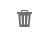
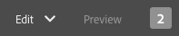

# Annotazioni durante la modifica di una pagina{#annotations-when-editing-a-page}

L’aggiunta di contenuto alle pagine del sito web è spesso soggetta a discussioni prima che questo venga effettivamente pubblicato. Per facilitare questa fase, molti componenti direttamente correlati al contenuto (anziché, ad esempio, al layout) ti consentono di aggiungere un’annotazione.

Un’annotazione posiziona un marcatore colorato o una nota adesiva sulla pagina. può contenere commenti o domande inseriti da un utente e destinati ad altri autori o revisori.

>[!NOTE]
>
>Nella definizione di un singolo tipo di componente è possibile specificare se l’aggiunta di annotazioni è supportata o meno per le istanze del componente.

>[!NOTE]
>
>Le annotazioni create nell’interfaccia classica vengono visualizzate nell’interfaccia touch. Tuttavia, gli schizzi sono specifici dell’interfaccia utente e vengono visualizzati solo nell’interfaccia utente in cui sono stati creati.

>[!CAUTION]
>
>Se si elimina una risorsa (ad esempio un paragrafo), vengono anche eliminate tutte le annotazioni e gli schizzi associati ad essa, indipendentemente dalla loro posizione sulla pagina.

>[!NOTE]
>
>Se necessario, puoi anche sviluppare un flusso di lavoro per inviare una notifica quando vengono aggiunte, aggiornate o eliminate delle annotazioni.

## Annotazioni {#annotations}

Per la creazione e la visualizzazione delle annotazioni viene utilizzata una [modalità](/help/sites-authoring/author-environment-tools.md#page-modes) speciale.

>[!NOTE]
>
>Non dimenticare che [commenti](/help/sites-authoring/basic-handling.md#timeline) sono disponibili anche per fornire feedback su una pagina.

>[!NOTE]
>
>Puoi aggiungere annotazioni a diverse risorse:
>
>* [Aggiunta di annotazioni alle risorse](/help/assets/manage-assets.md#annotating)
>* [Aggiunta di annotazioni alle risorse video](/help/assets/managing-video-assets.md#annotate-video-assets)
>

### Aggiunta di annotazioni a un componente {#annotating-a-component}

La modalità Annota consente di creare, modificare, spostare o eliminare le annotazioni nel contenuto:

1. Puoi accedere alla modalità Annota utilizzando l’icona nella barra degli strumenti (in alto a destra) durante la modifica di una pagina:

   

   È ora possibile visualizzare tutte le annotazioni esistenti.

   >[!NOTE]
   >
   >Per uscire dalla modalità Annotazione, fare clic sull&#39;icona Annota (simbolo x) a destra della barra degli strumenti superiore.

1. Per iniziare ad aggiungere annotazioni, fai clic sull’icona Aggiungi annotazione (simbolo + a sinistra della barra degli strumenti).

   >[!NOTE]
   >
   >Per interrompere l’aggiunta delle annotazioni e tornare alla visualizzazione, fai clic sull’icona Annulla (simbolo x in un cerchio bianco) a sinistra della barra degli strumenti superiore.

1. Fai clic sul componente richiesto (i componenti ai quali è possibile aggiungere annotazioni saranno evidenziati da un bordo blu) per aggiungere l’annotazione e aprire la relativa finestra di dialogo:

   

   Utilizzando il campo e/o l’icona appropriata puoi effettuare le seguenti operazioni:

   * Inserisci il testo dell’annotazione.
   * Crea uno schizzo (linee e forme) per evidenziare un’area del componente.

     Quando create uno sketch, il cursore si trasforma in un reticolo incrociato. Puoi disegnare più linee distinte. La linea dello schizzo ha lo stesso colore dell’annotazione e può essere una freccia, un cerchio o un ovale.

     

   * Scegli o modifica il colore:

     

   * Elimina l’annotazione.

     

1. Per chiudere la finestra di dialogo dell’annotazione, tocca o fai clic all’esterno della finestra di dialogo. Viene mostrata una vista troncata (la prima parola) dell’annotazione, insieme a eventuali schizzi:

   

1. Dopo aver modificato un’annotazione, puoi effettuare le seguenti operazioni:

   * Fare clic sull&#39;indicatore di testo per aprire l&#39;annotazione. Una volta aperta, è possibile visualizzare il testo completo, apportare modifiche o eliminare l’annotazione.

      * Gli schizzi non possono essere eliminati indipendentemente dall’annotazione.

   * Riposiziona il marcatore di testo.
   * Fate clic su una linea di uno schizzo per selezionarlo e trascinarlo nella posizione desiderata.
   * Sposta o copia un componente.

      * Vengono spostate o copiate anche tutte le annotazioni e gli schizzi correlati e la loro posizione rispetto al paragrafo rimane invariata.

1. Per uscire dalla modalità Annotazione e tornare alla modalità utilizzata in precedenza, fare clic sull&#39;icona Annota (simbolo x) a destra della barra degli strumenti superiore.

>[!NOTE]
>
>Non è possibile aggiungere annotazioni a una pagina bloccata da un altro utente.

### Indicatore di annotazione {#annotation-indicator}

Le annotazioni non vengono visualizzate in modalità Modifica, ma il contrassegno in alto a destra della barra degli strumenti mostra il numero di annotazioni esistenti per la pagina corrente. Il contrassegno sostituisce l’icona Annotazioni predefinita, ma continua a fungere da collegamento rapido per attivare o disattivare la modalità Annota:

