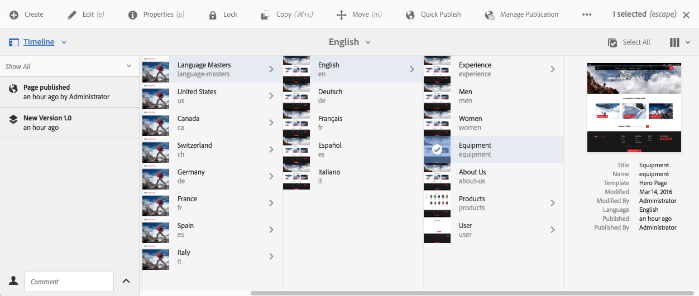
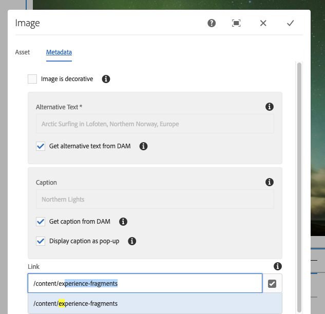

# Authoring: ambiente e strumenti{#authoring-the-environment-and-tools}

L’ambiente di authoring di AEM offre diversi metodi per organizzare e modificare i contenuti. Gli strumenti forniti sono accessibili dalle varie console ed editor di pagina.

## Gestione del sito {#managing-your-site}

La console **Sites** consente di navigare nel sito Web e di gestirlo utilizzando la barra intestazione, la barra degli strumenti, le icone delle azioni (per la risorsa selezionata), le breadcrumb e, se selezionate, le barre laterali secondarie (ad esempio Timeline e Riferimenti).

Ad esempio, nella vista a colonne:

## Modifica del contenuto di una pagina {#editing-page-content}

Puoi modificare una pagina con l’editor pagina. Esempio:

`https://localhost:4502/editor.html/content/we-retail/us/en/equipment.html`

>[!NOTE]
>
>La prima volta che apri una pagina per la modifica, una serie di diapositive ti offre una panoramica delle funzioni.
>
>Se necessario, puoi saltare la presentazione e ripeterla in qualsiasi momento selezionando una delle opzioni dal menu **Informazioni pagina**.

## Accedere all’Aiuto   {#accessing-help}

Durante la modifica di una pagina, l’**Aiuto** è accessibile dalle seguenti aree:

* il selettore [**Informazioni pagina**](/help/sites-authoring/editing-page-properties.md#page-properties), che mostra le diapositive introduttive (così come visualizzate al primo accesso all&#39;editor).
* la finestra di dialogo [configurazione](/help/sites-authoring/editing-content.md#edit-configure-copy-cut-delete-paste) per componenti specifici (utilizzando il punto interrogativo (?) sulla barra degli strumenti della finestra di dialogo), che mostra la Guida sensibile al contesto.

Ulteriori [risorse di aiuto sono disponibili nelle console](/help/sites-authoring/basic-handling.md#accessing-help).

## Browser Componenti   {#components-browser}

Il browser Componenti mostra tutti componenti disponibili per la pagina corrente. Questi possono essere trascinati nella posizione appropriata, quindi modificati per aggiungere il contenuto.

Il browser Componenti è una scheda che si trova nel pannello laterale, insieme al [browser Risorse](/help/sites-authoring/author-environment-tools.md#assets-browser) e alla [struttura dei contenuti](/help/sites-authoring/author-environment-tools.md#content-tree). Per aprire (o chiudere) il pannello laterale, utilizza l’icona in alto a sinistra della barra degli strumenti:

Quando apri il pannello laterale, questo si apre dal lato sinistro (se necessario seleziona la scheda **Componenti**). Una volta aperta, puoi sfogliare tutti i componenti disponibili per la pagina.

L&#39;aspetto e la gestione effettivi dipendono dal tipo di dispositivo in uso:

>[!NOTE]
>
>Un dispositivo viene rilevato come mobile se la larghezza è inferiore a 1024 px. Questo può essere anche il caso di una piccola finestra del desktop.

* **Dispositivo mobile (ad esempio iPad)**

  Il browser Componenti copre completamente la pagina in fase di modifica.

  Per aggiungere un componente alla pagina, tocca e tieni premuto il componente richiesto e spostalo verso destra (il browser componenti si chiude e mostra di nuovo la pagina), dove puoi posizionare il componente.

  

* **Dispositivo desktop**

  Il browser Componenti viene aperto sul lato sinistro della finestra.

  Per aggiungere un componente alla pagina, fai clic sul componente richiesto e trascinalo nella posizione desiderata.

  

  I componenti sono rappresentati da

   * Nome componente
   * Gruppo di componenti (in grigio)
   * Icona o abbreviazione

      * Le icone dei componenti standard sono monocromatiche.
      * Le abbreviazioni sono sempre i primi due caratteri del nome del componente.

  Dalla barra degli strumenti nella parte superiore del browser **Componenti** è possibile effettuare le seguenti operazioni:

   * Filtrare i componenti per nome
   * Limita la visualizzazione a uno specifico gruppo selezionandolo dall’elenco a discesa.

  Per una descrizione più dettagliata del componente, puoi fare clic sull&#39;icona delle informazioni accanto al componente nel browser **Componenti** (se disponibile). Ad esempio, per **Contenitore di layout**:

  

  Per ulteriori informazioni sui componenti disponibili, vedere [Console componenti](/help/sites-authoring/default-components-console.md).

## Browser Risorse {#assets-browser}

Il browser Risorse mostra tutte le [risorse](/help/assets/assets.md) disponibili per la pagina corrente.

Il browser risorse è una scheda all&#39;interno del pannello laterale insieme a [componenti sfoglia](/help/sites-authoring/author-environment-tools.md#components-browser)r e [struttura contenuto](/help/sites-authoring/author-environment-tools.md#content-tree). Per aprire o chiudere il pannello laterale, utilizza l’icona in alto a sinistra della barra degli strumenti:

Quando apri il pannello laterale, questo si apre dal lato sinistro. Se necessario, seleziona la scheda **Assets**.

Quando il browser Risorse è aperto, puoi sfogliare tutte le risorse disponibili per la pagina. Se necessario, per espandere l’elenco viene utilizzato lo scorrimento infinito.

Per aggiungere una risorsa alla pagina, selezionala e trascinala nella posizione desiderata. Può trattarsi di:

* un componente esistente del tipo appropriato.

   * Ad esempio, puoi trascinare una risorsa di tipo immagine su un componente Immagine.

* Un [segnaposto](/help/sites-authoring/editing-content.md#component-placeholder) nel sistema paragrafo per creare un componente del tipo appropriato.

   * Ad esempio, puoi trascinare una risorsa di tipo immagine nel sistema paragrafo per creare un componente Immagine.

>[!NOTE]
>
>Questa funzione è disponibile per risorse e tipi di componenti specifici. Consulta [Inserimento di un componente tramite il browser Risorse](/help/sites-authoring/editing-content.md#inserting-a-component-using-the-assets-browser) per ulteriori dettagli.

Dalla barra degli strumenti nella parte superiore del browser Risorse puoi filtrare le risorse in base a:

* Nome
* Percorso
* Tipo di risorsa come immagini, manoscritti, documenti, video, pagine, paragrafi e prodotti
* Caratteristiche della risorsa come Orientamento (Verticale, Orizzontale, Quadrato) e Stile (Colore, Monocromatico, Scala di grigio)

   * Disponibile solo per alcuni tipi di risorse

L&#39;aspetto e la gestione effettivi dipendono dal tipo di dispositivo in uso:

>[!NOTE]
>
>Un dispositivo viene rilevato come mobile se la larghezza è inferiore a 1024 px (quindi anche su una piccola finestra del desktop).

* **Dispositivo mobile come iPad**

  Il browser Risorse copre completamente la pagina in fase di modifica.

  Per aggiungere una risorsa alla pagina, tocca e tieni premuto sulla risorsa richiesta, quindi spostala verso destra: il browser Risorse si chiude e viene visualizzata di nuovo la pagina, dove puoi aggiungere la risorsa al componente richiesto.

  

* **Dispositivo desktop**

  Il browser Risorse viene aperto sul lato sinistro della finestra.

  Per aggiungere una risorsa alla pagina, fai clic sulla risorsa e trascinala sul componente o sulla posizione desiderata.

  

Se devi cambiare rapidamente una risorsa, puoi avviare [Editor risorse](/help/assets/manage-assets.md) direttamente dal browser Risorse facendo clic sull&#39;icona Modifica accanto al nome della risorsa.

## Struttura contenuto {#content-tree}

La **Struttura contenuto** offre una panoramica di tutti i componenti della pagina in una gerarchia, in modo da poter vedere immediatamente come viene composta la pagina.

Struttura contenuto è una scheda che si trova nel pannello laterale, insieme ai browser Componenti e Risorse. Per aprire o chiudere il pannello laterale, utilizza l’icona in alto a sinistra della barra degli strumenti:

Quando apri il pannello laterale, questo si apre (dal lato sinistro). Se necessario, seleziona la scheda **Struttura contenuto**. Quando è aperta, è possibile visualizzare una struttura ad albero della pagina o del modello, in modo da comprendere più facilmente come il contenuto è strutturato gerarchicamente. Inoltre, in una pagina complessa, consente di spostarsi più facilmente tra i componenti della pagina.

Poiché una pagina può essere composta da numerosi componenti dello stesso tipo, la struttura del contenuto (componente) presenta un testo descrittivo (in grigio) dopo il nome del tipo di componente (in nero). Il testo descrittivo proviene da proprietà comuni del componente, ad esempio titolo o testo.

I tipi di componente vengono mostrati nella lingua dell’utente, mentre il testo della descrizione del componente proviene dalla lingua della pagina.

Facendo clic sulla freccia accanto a un componente, questo livello viene compresso o espanso.

>[!NOTE]
>
>La struttura del contenuto non è disponibile quando si modifica una pagina su un dispositivo mobile (se la larghezza del browser è inferiore a 1024 px).

Facendo clic sul componente, questo viene evidenziato nell’editor pagina. Le azioni disponibili dipendono dallo stato della pagina:

* Ad esempio, una pagina di base:

  `https://localhost:4502/editor.html/content/we-retail/language-masters/en/equipment.html`

  

  Se il componente su cui fai clic nella struttura ad albero è modificabile, a destra del nome viene visualizzata un’icona a forma di chiave inglese. Fai clic su questa icona per aprire la finestra di dialogo di modifica del componente.

  

* Oppure una pagina che fa parte di una [Live Copy](/help/sites-administering/msm.md), in cui i componenti vengono ereditati da un&#39;altra pagina, ad esempio:

  `https://localhost:4502/editor.html/content/we-retail/us/en/equipment.html`

  

## Frammenti - Browser Contenuto associato {#fragments-associated-content-browser}

Se la pagina contiene frammenti di contenuto, è possibile accedere al browser [Contenuto associato](/help/sites-authoring/content-fragments.md#using-associated-content).

## Riferimenti {#references}

**I riferimenti** mostrano le connessioni alla pagina selezionata:

* Blueprint
* Lanci
* Live Copy
* Copie per lingua
* Collegamenti in entrata
* Uso del componente di riferimento: contenuto prestato e preso in prestito
* Riferimenti alle pagine dei prodotti (dalla console Commerce - Prodotti)

Apri la console richiesta, quindi accedi alla risorsa desiderata e apri i **Riferimenti** utilizzando:

[Seleziona la risorsa richiesta](/help/sites-authoring/basic-handling.md#viewing-and-selecting-resources) mostra un elenco di tipi di riferimenti relativi a tale risorsa:

Per ulteriori informazioni, selezionate il tipo di riferimento appropriato. In alcune situazioni, quando selezioni un riferimento specifico sono disponibili ulteriori azioni, tra cui:

* **Collegamenti in ingresso** fornisce un elenco di pagine che fanno riferimento alla pagina, insieme all&#39;accesso diretto a **Modifica** una di queste pagine quando selezioni un collegamento specifico.

   * Questo può mostrare solo collegamenti statici, non collegamenti generati dinamicamente; ad esempio, dal componente Elenco.

* Istanze di contenuto prestato o preso in prestito mediante il componente **Riferimento**: da qui puoi passare alla pagina di riferimento o a cui si fa riferimento.

* [Riferimenti alle pagine dei prodotti](/help/commerce/cif-classic/administering/generic.md#showing-product-references) (disponibili nella console Prodotti Commerce)
* [Lanci](/help/sites-authoring/launches.md) fornisce l&#39;accesso ai lanci correlati.
* [Live Copy](/help/sites-administering/msm.md) visualizza i percorsi di tutte le Live Copy basate sulla risorsa selezionata.
* [Blueprint](/help/sites-administering/msm-best-practices.md) fornisce dettagli e varie azioni.
* [Copie per lingua](/help/sites-administering/tc-manage.md#creating-translation-projects-using-the-references-panel) fornisce dettagli e varie azioni.

Ad esempio, potete correggere un riferimento interrotto all&#39;interno di un componente Riferimento (Reference):

## Eventi - Timeline {#events-timeline}

Per le risorse appropriate (ad esempio, pagine dalla console **Sites** o risorse dalla console **Assets**) è possibile utilizzare la [timeline per visualizzare le attività recenti relative agli elementi selezionati](/help/sites-authoring/basic-handling.md#timeline).

Apri la console richiesta, quindi accedi alla risorsa desiderata e apri la **Timeline** utilizzando:

[Scegli la risorsa desiderata](/help/sites-authoring/basic-handling.md#viewing-and-selecting-resources), quindi seleziona **Mostra tutto** o **Attività** per ottenere un elenco delle azioni recenti relative alle risorse selezionate:

## Informazioni sulle pagine {#page-information}

Il pulsante Informazioni pagina (icona equalizzatore) apre un menu che fornisce anche dettagli sull’ultima modifica e sull’ultima pubblicazione. A seconda delle caratteristiche della pagina, del sito e delle istanze, potrebbero essere disponibili più o meno opzioni:

* [Apri proprietà](/help/sites-authoring/editing-page-properties.md)
* [Rollout pagina](/help/sites-administering/msm.md#msm-from-the-ui)
* [Avvia flusso di lavoro](/help/sites-authoring/workflows-applying.md#starting-a-workflow-from-the-page-editor)
* [Blocca pagina](/help/sites-authoring/editing-content.md#locking-a-page)
* [Pubblica pagina](/help/sites-authoring/publishing-pages.md#main-pars-title-10)
* [Annulla pubblicazione pagina](/help/sites-authoring/publishing-pages.md#main-pars-title-5)
* [Modifica modello](/help/sites-authoring/templates.md); quando la pagina è basata su un [modello modificabile](/help/sites-authoring/templates.md#editable-and-static-templates)

* [Visualizza come pubblicato](/help/sites-authoring/editing-content.md#view-as-published)
* Visualizza in Amministrazione; apre la pagina nella console [Sites](/help/sites-authoring/basic-handling.md#viewing-and-selecting-resources)
* [Aiuto](/help/sites-authoring/basic-handling.md#accessing-help)

Ad esempio, se appropriato, **Informazioni pagina** dispone anche delle opzioni seguenti:

* [Promuovi lancio](/help/sites-authoring/launches-promoting.md) se la pagina è un lancio
* [Apri nell&#39;interfaccia classica](/help/sites-authoring/select-ui.md#switching-to-classic-ui-when-editing-a-page) se questa opzione è stata [abilitata da un amministratore](/help/sites-administering/enable-classic-ui-editor.md)

Inoltre, se necessario, **Informazioni pagina** può fornire accesso alle analisi e alle raccomandazioni.

## Modalità pagina   {#page-modes}

Esistono diverse modalità di modifica di una pagina che consentono di eseguire azioni diverse:

* [Modifica](/help/sites-authoring/editing-content.md) - utilizza questa modalità quando modifichi il contenuto della pagina.
* [Layout](/help/sites-authoring/responsive-layout.md) - consente di creare e modificare il layout dinamico a seconda del dispositivo (se la pagina si basa su un contenitore di layout)

* [Scaffolding](/help/sites-authoring/scaffolding.md): ti consente di creare un set di pagine di grandi dimensioni che condividono la struttura ma hanno contenuti diversi.
* [Sviluppatore](/help/sites-developing/developer-mode.md) - consente di eseguire varie azioni (richiede privilegi). Ad esempio, è necessario esaminare i dettagli tecnici di una pagina e dei relativi componenti.

* [Progettazione](/help/sites-authoring/default-components-designmode.md) - consente di abilitare/disabilitare i componenti da utilizzare in una pagina e di configurare la progettazione del componente (se la pagina è basata su un [modello statico](/help/sites-authoring/templates.md#editable-and-static-templates)).

* [Targeting](/help/sites-authoring/content-targeting-touch.md): aumenta la rilevanza dei contenuti attraverso il targeting e la misurazione su tutti i canali.
* [Activity Map](/help/sites-authoring/page-analytics-using.md#analyticsvisiblefromthepageeditor) - mostra i dati di Analytics per la pagina.

* [Timewarp](/help/sites-authoring/working-with-page-versions.md#timewarp) - consente di visualizzare lo stato di una pagina in un determinato momento.
* [Stato Live Copy](/help/sites-authoring/editing-content.md#live-copy-status): consente di ottenere una rapida panoramica dello stato della live copy e dei componenti che vengono/non vengono ereditati.
* [Anteprima](/help/sites-authoring/editing-content.md#previewing-pages): utilizzato per visualizzare l’aspetto che la pagina avrà nell’ambiente di pubblicazione o per spostarsi utilizzando i collegamenti presenti nel contenuto.

* [Annota](/help/sites-authoring/annotations.md): utilizzato per aggiungere o visualizzare annotazioni nella pagina.

Per accedervi, utilizza le icone nell’angolo in alto a destra. L’icona effettiva cambia per riflettere la modalità attualmente in uso:

>[!NOTE]
>
>* A seconda delle caratteristiche della pagina, alcune modalità potrebbero non essere disponibili.
>* L’accesso ad alcune modalità richiede le autorizzazioni/i privilegi appropriati.
>* La modalità Sviluppatore non è disponibile sui dispositivi mobili a causa di restrizioni di spazio.
>* È disponibile una [scelta rapida da tastiera](/help/sites-authoring/page-authoring-keyboard-shortcuts.md) ( `Ctrl-Shift-M`) per passare da **Anteprima** alla modalità attualmente selezionata, ad esempio **Modifica** e **Layout**.
>

## Selezione del percorso {#path-selection}

Spesso per l’authoring è necessario selezionare un’altra risorsa, ad esempio quando si definisce un collegamento a un’altra pagina o risorsa o si seleziona un’immagine. Per selezionare facilmente un percorso, i [campi percorso](/help/sites-authoring/author-environment-tools.md#path-fields) offrono un completamento automatico e il [browser percorsi](/help/sites-authoring/author-environment-tools.md#path-browser) consente una selezione più solida.

### Campi percorso   {#path-fields}

L’esempio utilizzato qui mostra il Componente immagine. Per ulteriori informazioni sull&#39;utilizzo e la modifica dei componenti, vedere [Componenti per l&#39;authoring delle pagine](/help/sites-authoring/default-components.md).

I campi percorso dispongono della funzione di completamento automatico e di look-ahead per rendere più facile individuare una risorsa.

Fai clic sul pulsante **Apri finestra di dialogo per selezione** nel campo percorso per aprire la finestra di dialogo del [browser Percorsi](/help/sites-authoring/author-environment-tools.md#path-browser) e utilizzare opzioni di selezione più dettagliate.

In alternativa, puoi iniziare a digitare nel campo percorso e AEM offre i percorsi corrispondenti mentre digiti.

### Browser Percorsi {#path-browser}

Il browser Percorsi è organizzato come la [vista a colonne](/help/sites-authoring/basic-handling.md#column-view) della console Sites e permette di selezionare le risorse in modo più dettagliato.

* Una volta selezionata una risorsa, il pulsante **Seleziona** in alto a destra nella finestra di dialogo diventa attivo. Fai clic su per confermare la selezione o su **Annulla** per interromperla.
* Se il contesto consente la selezione di più risorse, la scelta di una risorsa attiva anche il pulsante **Seleziona**, ma aggiunge anche un conteggio del numero di risorse selezionate nella parte superiore destra della finestra. Fai clic su **X** accanto al numero per deselezionare tutti.
* Quando ti sposti nella struttura, la posizione si riflette nelle breadcrumb nella parte superiore della finestra di dialogo. Queste breadcrumb possono essere utilizzate anche per passare rapidamente all’interno della gerarchia delle risorse.
* In qualsiasi momento, puoi utilizzare il campo di ricerca nella parte superiore della finestra di dialogo. Fai clic su **X** nel campo di ricerca per cancellare la ricerca.
* Per limitare l’ambito della ricerca, puoi visualizzare le opzioni filtro e filtrare il risultato in base a un determinato percorso.

  

## Scelte rapide da tastiera {#keyboard-shortcuts}

Sono disponibili alcune [scelte rapide da tastiera](/help/sites-authoring/page-authoring-keyboard-shortcuts.md).
